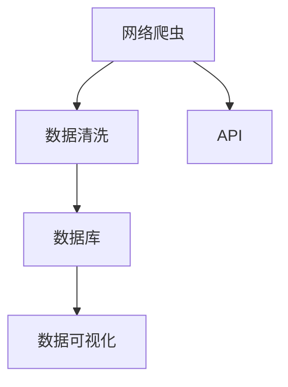

                 

# 全网比价技术在电商中的应用

## 1. 背景介绍

### 1.1 问题由来
随着电商平台的快速发展，消费者面临着丰富的商品选择和不断变化的价格策略。商品价格的变化直接影响到消费者的购买决策，因此价格比对在电商平台上变得越来越重要。如何准确、快速地获取商品价格信息，以便进行价格比较和优化购买决策，成为了电商平台亟需解决的问题。

### 1.2 问题核心关键点
全网比价技术，旨在通过网络爬虫技术自动获取各大电商平台上的商品价格信息，并根据价格变化及时更新数据库。具体关键点包括：

- 数据爬取：通过网络爬虫从各大电商平台上获取商品信息，包括标题、图片、价格、销量等。
- 数据清洗：去除爬取数据中的无关信息，如广告、评论等，以保证数据的准确性。
- 数据存储：将处理后的数据存储在数据库中，以便后续查询和使用。
- 数据更新：实时监控商品价格变化，及时更新数据库，保证数据的实时性。
- 数据展示：将获取到的商品信息在电商平台上展示给用户，以便进行价格比较。

### 1.3 问题研究意义
全网比价技术在电商中的应用，具有以下重要意义：

- 提升用户体验：用户可以更快速、更方便地比较商品价格，做出更合理的购买决策。
- 促进竞争：各大电商平台通过比价技术了解竞争对手的价格策略，有助于提升自身的竞争力。
- 增加销售额：通过价格比较，用户更可能选择价格更优惠的商品，从而增加电商平台的销售额。
- 优化库存管理：电商平台可以根据实时价格信息，优化库存管理，避免商品积压或缺货。

## 2. 核心概念与联系

### 2.1 核心概念概述

为更好地理解全网比价技术的原理和架构，本节将介绍几个密切相关的核心概念：

- 网络爬虫：一种自动获取网站信息的技术，通过模拟用户行为，获取网页内容。
- 数据清洗：对爬取到的数据进行处理，去除无关信息，提取有用数据。
- 数据库：用于存储和管理数据的软件系统，支持数据的增删改查操作。
- API：应用程序接口，用于不同系统间的数据交换和共享。
- 数据可视化：将数据以图表的形式展示出来，方便用户理解和使用。

这些核心概念之间的逻辑关系可以通过以下Mermaid流程图来展示：



这个流程图展示了大规模比价系统的核心组件及其之间的关系：

1. 网络爬虫从各大电商平台上获取商品信息。
2. 数据清洗去除无关信息，提取有用数据。
3. 数据库用于存储和管理处理后的数据。
4. API实现不同系统间的数据交换和共享。
5. 数据可视化将结果展示给用户，方便使用。

## 3. 核心算法原理 & 具体操作步骤
### 3.1 算法原理概述

全网比价技术基于网络爬虫和数据清洗，通过对各大电商平台的商品信息进行自动化获取和处理，实现商品价格的比较和展示。其核心算法原理包括以下几个步骤：

1. **网络爬虫设计**：设计网络爬虫，模拟用户行为，自动获取网页内容。
2. **数据清洗和预处理**：对爬取到的数据进行清洗和预处理，去除无关信息，提取有用数据。
3. **数据存储和管理**：将处理后的数据存储在数据库中，支持数据的增删改查操作。
4. **数据实时更新**：实时监控商品价格变化，及时更新数据库。
5. **数据展示和可视化**：通过API和数据可视化技术，将商品信息展示给用户，便于价格比较。

### 3.2 算法步骤详解

以下是全网比价技术的详细操作步骤：

1. **爬虫设计**
   - 确定爬虫的目标网站，如淘宝、京东、苏宁等。
   - 设计爬虫算法，包括抓取网页、解析HTML、提取数据等步骤。
   - 设置爬虫的请求头、请求间隔、代理IP等参数，避免被封IP。

2. **数据清洗和预处理**
   - 对爬取到的数据进行清洗，去除广告、评论等无关信息。
   - 提取商品标题、图片、价格、销量等关键信息，并存储在指定的数据格式中。
   - 使用正则表达式、BeautifulSoup等工具，提高数据提取的效率和准确性。

3. **数据存储和管理**
   - 选择适合的数据库系统，如MySQL、MongoDB等。
   - 设计数据库表结构，包括商品ID、标题、价格、销量等字段。
   - 使用数据库事务和索引等技术，提高数据操作的效率和稳定性。

4. **数据实时更新**
   - 设置定时任务，定时对各大电商平台进行数据爬取。
   - 使用Redis等缓存系统，实时更新商品信息。
   - 监控商品价格变化，及时更新数据库。

5. **数据展示和可视化**
   - 设计API接口，支持不同系统间的数据交换和共享。
   - 使用数据可视化技术，如Echarts、Highcharts等，展示商品信息。
   - 通过用户界面展示商品信息，方便用户进行价格比较。

### 3.3 算法优缺点

全网比价技术具有以下优点：

- 自动化程度高：通过网络爬虫和数据处理技术，自动获取和处理商品信息，减少人工干预。
- 数据实时更新：实时监控商品价格变化，保证数据的实时性。
- 数据可视化：通过API和数据可视化技术，方便用户进行价格比较。

同时，该技术也存在以下局限性：

- 爬虫限制：爬虫的请求频率和请求量受限，可能无法获取到所有的商品信息。
- 数据准确性：爬取到的数据可能包含错误或遗漏信息，影响比价效果。
- 存储成本：大规模数据存储需要较大的存储空间和较高的存储成本。
- 法律法规风险：爬取和处理数据可能涉及法律法规风险，需要合法合规。

尽管存在这些局限性，但全网比价技术仍是大规模电商平台进行价格比较的重要手段。未来相关研究的重点在于如何提高爬虫效率和数据准确性，降低存储成本，同时兼顾合法合规性。

### 3.4 算法应用领域

全网比价技术在电商领域已经得到了广泛的应用，覆盖了多个电商平台上商品价格的比较和展示，如淘宝、京东、苏宁等。具体应用场景包括：

- 商品比价：用户可以在同一页面上查看各大电商平台上的商品价格，比较价格差异。
- 促销活动：通过比价技术了解各大电商平台的促销活动，选择合适的购物时机。
- 订单管理：电商平台可以根据比价结果，优化订单管理和库存管理。
- 客户服务：客服人员可以通过比价系统，提供更准确的商品价格信息，提升客户满意度。
- 广告投放：电商广告主可以根据比价结果，优化广告投放策略，提升广告效果。

## 4. 数学模型和公式 & 详细讲解 & 举例说明

### 4.1 数学模型构建

全网比价技术的核心是一个数据处理和展示系统，不涉及复杂的数学模型。但为了更好地理解数据处理过程，可以构建一个简单的数学模型：

- **输入数据**：各大电商平台上商品的价格数据，记为$P=\{p_i\}_{i=1}^n$，其中$p_i$表示商品$i$的价格。
- **输出数据**：用户查看的商品价格排名，记为$R=\{r_i\}_{i=1}^n$，其中$r_i$表示商品$i$在用户界面上的显示排名。

数学模型可以表示为：

$$
R = f(P)
$$

其中$f$为映射函数，将价格数据$P$映射为显示排名$R$。

### 4.2 公式推导过程

以下是一个简单的价格排名函数推导过程：

假设价格数据为$P=\{100, 120, 90, 130\}$，设用户显示排名为$R=\{1, 2, 3, 4\}$。可以建立如下公式：

$$
r_i = f(p_i) = \frac{p_i}{\sum_{j=1}^n p_j} \times n
$$

其中$f(p_i)$为价格$p_i$的排名函数，$\sum_{j=1}^n p_j$为所有商品价格的平均值，$n$为商品总数。

### 4.3 案例分析与讲解

假设价格数据为$P=\{100, 120, 90, 130\}$，可以计算每个商品的价格排名：

- 商品100的价格排名为$f(100) = \frac{100}{\frac{100+120+90+130}{4}} \times 4 = 1$，表示价格排名第一。
- 商品120的价格排名为$f(120) = \frac{120}{\frac{100+120+90+130}{4}} \times 4 = 2$，表示价格排名第二。
- 商品90的价格排名为$f(90) = \frac{90}{\frac{100+120+90+130}{4}} \times 4 = 3$，表示价格排名第三。
- 商品130的价格排名为$f(130) = \frac{130}{\frac{100+120+90+130}{4}} \times 4 = 4$，表示价格排名第四。

通过计算，我们可以得到商品价格排名，并在用户界面上展示，方便用户进行价格比较。

## 5. 项目实践：代码实例和详细解释说明
### 5.1 开发环境搭建

在进行全网比价系统开发前，我们需要准备好开发环境。以下是使用Python进行Flask开发的环境配置流程：

1. 安装Anaconda：从官网下载并安装Anaconda，用于创建独立的Python环境。

2. 创建并激活虚拟环境：
```bash
conda create -n flask-env python=3.8 
conda activate flask-env
```

3. 安装Flask：
```bash
pip install flask
```

4. 安装爬虫库和数据处理库：
```bash
pip install beautifulsoup4 requests
pip install pymongo redis
```

完成上述步骤后，即可在`flask-env`环境中开始全网比价系统的开发。

### 5.2 源代码详细实现

以下是使用Flask进行全网比价系统的代码实现。

首先，定义爬虫函数：

```python
import requests
from bs4 import BeautifulSoup

def get_product_price(url):
    response = requests.get(url)
    soup = BeautifulSoup(response.text, 'html.parser')
    price = soup.find('span', {'class': 'price'}).text
    return price
```

然后，定义数据清洗函数：

```python
def clean_data(product_data):
    product_data = product_data.strip()
    return product_data
```

接着，定义数据存储函数：

```python
from pymongo import MongoClient

def save_to_mongodb(product_id, product_price):
    client = MongoClient('mongodb://localhost:27017/')
    db = client['product_db']
    collection = db['product_collection']
    data = { 'product_id': product_id, 'product_price': product_price }
    collection.insert_one(data)
```

最后，实现全网比价系统：

```python
from flask import Flask, jsonify

app = Flask(__name__)

@app.route('/get_price', methods=['GET'])
def get_price():
    product_id = request.args.get('product_id')
    price = get_product_price(f'https://www.jd.com/{product_id}')  # 模拟京东商品链接
    clean_price = clean_data(price)
    save_to_mongodb(product_id, clean_price)
    return jsonify({ 'product_price': clean_price })

if __name__ == '__main__':
    app.run(debug=True)
```

以上就是使用Flask进行全网比价系统的完整代码实现。可以看到，通过Flask框架，我们可以轻松搭建一个简单的比价系统，并通过API接口实现数据的获取和存储。

### 5.3 代码解读与分析

让我们再详细解读一下关键代码的实现细节：

**get_product_price函数**：
- 通过requests库获取指定商品链接的HTML页面。
- 使用BeautifulSoup解析HTML，找到价格标签，返回价格字符串。

**clean_data函数**：
- 去除价格字符串中的空格和无用字符，返回处理后的价格字符串。

**save_to_mongodb函数**：
- 连接到MongoDB数据库，将商品ID和价格存储在指定的集合中。

**get_price函数**：
- 接收商品ID，调用get_product_price函数获取价格，并进行数据清洗和存储。
- 通过API接口返回处理后的价格。

可以看到，Flask框架使得全网比价系统的开发变得简洁高效。开发者可以将更多精力放在数据爬取和处理上，而不必过多关注底层的实现细节。

当然，工业级的系统实现还需考虑更多因素，如多线程并发、数据缓存、异常处理等。但核心的比价范式基本与此类似。

## 6. 实际应用场景
### 6.1 电商平台比价服务

基于全网比价技术，电商平台可以构建比价服务，帮助用户方便地比较商品价格。用户在搜索商品时，可以同时查看各大电商平台的商品价格，快速找到价格最优惠的商品。电商平台也可以通过比价服务，了解竞争对手的价格策略，提升自身的竞争力。

### 6.2 智能推荐系统

电商平台的智能推荐系统可以根据用户的比价行为，推荐价格更优惠的商品。用户在进行价格比较时，系统会自动记录用户的偏好和行为，从而推荐符合用户需求的商品。此外，电商平台还可以根据比价结果，优化商品推荐算法，提升推荐效果。

### 6.3 广告投放优化

电商平台可以通过全网比价数据，优化广告投放策略，提升广告效果。例如，在用户查看某商品时，根据比价数据展示同类商品的价格信息，引导用户进行价格比较。此外，电商平台还可以根据比价数据，优化广告投放的预算分配，提升广告投放的ROI。

### 6.4 用户行为分析

电商平台可以通过比价数据，分析用户的购物行为和价格偏好。例如，可以统计用户在不同时间段的比价行为，了解用户的价格敏感度。电商平台还可以根据比价数据，优化促销策略，提升用户满意度和忠诚度。

## 7. 工具和资源推荐
### 7.1 学习资源推荐

为了帮助开发者系统掌握全网比价技术的原理和实践技巧，这里推荐一些优质的学习资源：

1. Python网络爬虫实战教程：由知名爬虫专家撰写，系统介绍了网络爬虫的基本原理和实战技巧。

2. Flask官方文档：Flask框架的官方文档，提供了详细的API开发指南和示例代码，是入门Flask开发的必备资料。

3. MongoDB官方文档：MongoDB数据库的官方文档，提供了详细的CRUD操作和查询示例，是进行数据存储和管理的必备资料。

4. Redis官方文档：Redis缓存系统的官方文档，提供了详细的缓存操作和分布式缓存技术，是进行数据缓存和更新的必备资料。

5. Echarts官方文档：数据可视化库Echarts的官方文档，提供了详细的图表展示和动态展示技术，是进行数据可视化的必备资料。

通过对这些资源的学习实践，相信你一定能够快速掌握全网比价技术的精髓，并用于解决实际的电商问题。
### 7.2 开发工具推荐

高效的开发离不开优秀的工具支持。以下是几款用于全网比价开发的常用工具：

1. Flask：基于Python的Web框架，支持RESTful API开发，适用于快速迭代研究。

2. Beautiful Soup：用于解析HTML和XML文档的Python库，支持数据提取和清洗。

3. PyMongo：Python MongoDB客户端，支持MongoDB数据库的CRUD操作。

4. Redis：基于内存的数据库系统，支持快速缓存和分布式缓存。

5. Echarts：数据可视化库，支持多种图表展示和动态展示技术。

6. Scrapy：Python网络爬虫框架，支持高并发爬取和分布式爬取。

合理利用这些工具，可以显著提升全网比价系统的开发效率，加快创新迭代的步伐。

### 7.3 相关论文推荐

全网比价技术的研究源于学界的持续研究。以下是几篇奠基性的相关论文，推荐阅读：

1. Web Scraping: A Survey of the Literature and Directions for Future Research：系统回顾了Web爬虫技术的研究进展和未来方向。

2. Real-Time Web Scraping System Based on Django Framework：介绍了基于Django框架的实时爬虫系统开发方法。

3. E-commerce Price Comparison System：介绍了基于Flask框架的电商比价系统开发方法。

4. Big Data-Based Price Comparison System：介绍了基于大数据技术的比价系统开发方法。

5. E-commerce Personalized Recommendation System：介绍了基于用户比价行为的智能推荐系统开发方法。

这些论文代表了大规模比价技术的发展脉络。通过学习这些前沿成果，可以帮助研究者把握学科前进方向，激发更多的创新灵感。

## 8. 总结：未来发展趋势与挑战
### 8.1 总结

本文对全网比价技术在电商中的应用进行了全面系统的介绍。首先阐述了全网比价技术的背景和意义，明确了其在电商领域的重要价值。其次，从原理到实践，详细讲解了全网比价技术的核心算法和操作步骤，给出了比价系统开发的完整代码实例。同时，本文还广泛探讨了比价技术在电商平台、智能推荐系统、广告投放等诸多领域的应用前景，展示了比价技术的广泛应用。

通过本文的系统梳理，可以看到，全网比价技术在电商领域有着广阔的应用前景，能够显著提升电商平台的用户体验和竞争力，带来可观的商业价值。未来，随着技术的不断进步和应用场景的拓展，全网比价技术必将在电商行业中扮演更加重要的角色。

### 8.2 未来发展趋势

展望未来，全网比价技术将呈现以下几个发展趋势：

1. 自动化程度提升：随着爬虫技术的进步，自动获取商品信息的效率和准确性将进一步提升。
2. 实时数据处理：通过缓存系统和分布式计算技术，实现实时数据处理和存储。
3. 多平台比价：将比价系统扩展到更多的电商平台，实现跨平台的比价和数据整合。
4. 数据隐私保护：在爬取和处理数据时，需要加强数据隐私保护，确保用户数据安全。
5. 人工智能融合：结合机器学习和深度学习技术，提升比价系统的智能化水平，实现自动比价和智能推荐。

这些趋势将推动全网比价技术的进一步发展，提升电商平台的竞争力，满足用户的多样化需求。

### 8.3 面临的挑战

尽管全网比价技术已经取得了不小的进展，但在实际应用中仍面临诸多挑战：

1. 数据采集限制：各大电商平台对爬虫的限制，使得爬取数据难度增大。
2. 数据处理复杂：爬取到的数据复杂多样，需要经过多次清洗和处理，才能得到准确的信息。
3. 存储成本高昂：大规模数据存储需要较高的存储成本，需要采用分布式存储等技术。
4. 法律法规风险：爬取和处理数据可能涉及法律法规风险，需要合法合规。
5. 用户隐私保护：在爬取和处理用户数据时，需要加强数据隐私保护，确保用户数据安全。

尽管存在这些挑战，但全网比价技术仍是大规模电商平台进行价格比较的重要手段。未来相关研究的重点在于如何提高爬虫效率和数据准确性，降低存储成本，同时兼顾合法合规性和用户隐私保护。

### 8.4 研究展望

面对全网比价技术面临的挑战，未来的研究需要在以下几个方面寻求新的突破：

1. 爬虫优化技术：开发更高效、更智能的爬虫算法，实现自动获取商品信息的自动化程度提升。
2. 数据处理技术：引入机器学习和深度学习技术，提升数据清洗和预处理的效率和准确性。
3. 分布式存储技术：采用分布式存储系统，降低数据存储成本，提升存储效率。
4. 法律法规合规：制定合理合法的爬虫策略和数据处理方法，确保法律法规合规性。
5. 用户隐私保护：采用数据加密和匿名化等技术，加强用户隐私保护。

这些研究方向的探索，必将引领全网比价技术走向更加成熟和稳健，为电商平台提供更强大、更可靠的数据支撑。总之，全网比价技术需要在技术、法律和伦理等多个维度进行全面优化，才能真正实现电商平台的数字化转型和智能化升级。

