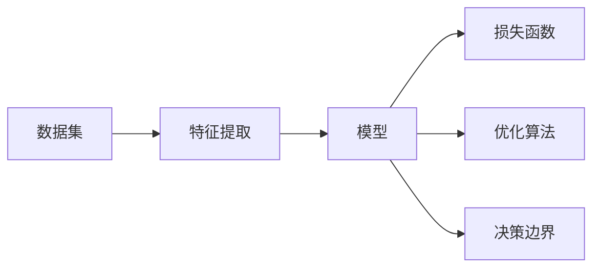

                 

# 分类(Classification) - 原理与代码实例讲解

> 关键词：分类算法, 模型构建, 机器学习, 神经网络, 特征提取, 决策边界

## 1. 背景介绍

### 1.1 问题由来

分类是机器学习中最基础且应用广泛的算法之一。它通过对数据进行标签分类，解决了许多实际问题，如图像识别、情感分析、垃圾邮件过滤等。尽管分类算法已经发展了几十年，但其核心思想和框架依然沿用了经典的统计和模型学习方法。

随着深度学习技术的发展，神经网络成为分类任务中的重要工具。通过多层神经网络对数据进行特征提取和表示学习，可以在复杂的非线性关系中发现数据的内在结构，从而实现高精度的分类任务。

### 1.2 问题核心关键点

为了更好地理解和应用分类算法，我们首先简要梳理了其核心概念：

1. **分类算法**：用于将数据映射到预定义的类别标签，如二分类、多分类等。
2. **模型构建**：根据数据特征和任务需求选择合适的模型结构，如线性模型、神经网络等。
3. **特征提取**：从原始数据中提取出有利于分类的特征表示。
4. **损失函数**：用于衡量模型预测与真实标签之间的差异，指导模型优化。
5. **优化算法**：通过梯度下降等方法最小化损失函数，更新模型参数。
6. **决策边界**：表示模型预测与真实标签一致的分界面，如线性分类器中的超平面。

这些概念构成了分类的基本框架，本文将深入探讨这些核心概念及其在实际应用中的具体实现。

## 2. 核心概念与联系

### 2.1 核心概念概述

为了更加直观地理解分类的原理，我们通过以下Mermaid流程图展示分类任务的流程和各组件之间的关系：



这个流程图展示了数据集经过特征提取后，输入到模型中进行训练，通过损失函数和优化算法调整模型参数，最终形成决策边界，将数据分类到正确标签的过程。

## 3. 核心算法原理 & 具体操作步骤

### 3.1 算法原理概述

分类的核心思想是将输入数据映射到一个或多个类别标签上。这可以通过构建一个或多个模型，将输入数据转换为表示形式，然后通过决策边界将其分类到正确的类别。常用的分类算法包括线性分类器、支持向量机(SVM)、决策树、随机森林、神经网络等。

以线性分类器为例，其原理是通过将数据映射到一个高维空间，使得不同类别的数据在该空间中的分布尽可能分开，从而找到一条超平面，将数据分类到不同的类别中。

### 3.2 算法步骤详解

以下是使用逻辑回归模型进行二分类任务的详细步骤：

**Step 1: 准备数据集**
- 收集训练集 $\mathcal{D}=\{(x_i,y_i)\}_{i=1}^N$，其中 $x_i$ 为输入特征，$y_i \in \{0,1\}$ 为二元标签。
- 将数据集划分为训练集、验证集和测试集，通常比例为7:1.8:1.2。

**Step 2: 特征提取**
- 对输入数据进行特征工程，得到一组特征向量 $\mathcal{X} \in \mathbb{R}^d$。
- 可以使用各种特征提取方法，如PCA、SVD、独热编码等。

**Step 3: 构建模型**
- 选择逻辑回归模型作为分类器，其数学表达为：
  $$
  y = \sigma(\mathbf{w} \cdot \mathbf{x} + b)
  $$
  其中 $\sigma(z) = \frac{1}{1+e^{-z}}$ 为Sigmoid函数，$\mathbf{w}$ 为权重向量，$b$ 为偏置项。

**Step 4: 定义损失函数**
- 常用的损失函数为交叉熵损失，表示为：
  $$
  \mathcal{L}(\mathbf{w}, b) = -\frac{1}{N}\sum_{i=1}^N y_i\log y_i + (1-y_i)\log(1-y_i)
  $$
  其中 $y_i$ 为模型对样本 $x_i$ 的预测结果。

**Step 5: 选择优化算法**
- 常用的优化算法为随机梯度下降(SGD)或其变体，如AdamW、Adagrad等。

**Step 6: 训练模型**
- 使用训练集 $\mathcal{D}$ 对模型进行迭代优化，更新参数 $\mathbf{w}, b$ 直到收敛。
- 通常设置最大迭代次数 $K$ 和损失函数阈值 $\epsilon$，当损失函数连续 $K$ 次迭代变化小于 $\epsilon$ 时停止训练。

**Step 7: 评估模型**
- 在验证集上测试模型性能，使用准确率、召回率、F1分数等指标评估分类效果。
- 调整模型参数和超参数，如学习率、正则化系数等，以提高模型泛化能力。

**Step 8: 测试模型**
- 在测试集上最终评估模型性能，对比训练集和验证集上的表现。

### 3.3 算法优缺点

**优点**：
1. **简单高效**：逻辑回归模型易于实现，训练速度快，适用于大数据集。
2. **可解释性强**：模型的权重向量 $\mathbf{w}$ 和偏置项 $b$ 可以直观解释特征的重要性。
3. **适应性广**：逻辑回归模型可以用于二分类和多分类任务，适用于多种数据分布。

**缺点**：
1. **线性假设**：逻辑回归模型假设数据符合线性可分，对于非线性数据效果有限。
2. **依赖特征选择**：特征提取和选择对模型性能有较大影响，需要经过反复调试。
3. **过拟合风险**：当特征维度较高时，模型容易过拟合训练集，泛化能力下降。

### 3.4 算法应用领域

逻辑回归模型在分类任务中应用广泛，以下是一些典型场景：

1. **信用评分**：根据客户历史交易记录、基本信息等特征，预测客户信用等级。
2. **情感分析**：对电影评论、社交媒体等文本数据进行情感极性分类。
3. **垃圾邮件过滤**：通过分析邮件特征，判断邮件是否为垃圾邮件。
4. **疾病诊断**：基于病历记录和检测数据，预测患者是否患有某种疾病。
5. **图像分类**：将图像像素转换为特征向量，使用逻辑回归模型分类到不同类别。

除了这些经典任务，逻辑回归模型还可应用于许多其他领域，如推荐系统、语音识别、行为预测等。

## 4. 数学模型和公式 & 详细讲解 & 举例说明

### 4.1 数学模型构建

假设输入特征 $\mathbf{x} \in \mathbb{R}^d$，标签 $y \in \{0,1\}$。逻辑回归模型的数学表达为：

$$
p(y=1|\mathbf{x}, \mathbf{w}, b) = \sigma(\mathbf{w} \cdot \mathbf{x} + b)
$$

其中 $\sigma(z)$ 为Sigmoid函数，定义为：

$$
\sigma(z) = \frac{1}{1+e^{-z}}
$$

### 4.2 公式推导过程

逻辑回归模型的目标是最大化似然函数：

$$
\mathcal{L}(\mathbf{w}, b) = \frac{1}{N}\sum_{i=1}^N \log p(y_i|\mathbf{x}_i, \mathbf{w}, b) = \frac{1}{N}\sum_{i=1}^N (y_i\log p(y_i|\mathbf{x}_i, \mathbf{w}, b) + (1-y_i)\log(1-p(y_i|\mathbf{x}_i, \mathbf{w}, b))
$$

通过链式法则求导，得到梯度表达式：

$$
\frac{\partial \mathcal{L}}{\partial \mathbf{w}_k} = \frac{1}{N}\sum_{i=1}^N [y_i(\mathbf{x}_i)_k - p(y_i|\mathbf{x}_i, \mathbf{w}, b)]
$$

其中 $(\mathbf{x}_i)_k$ 表示特征向量 $\mathbf{x}_i$ 的第 $k$ 维特征，$[y_i(\mathbf{x}_i)_k - p(y_i|\mathbf{x}_i, \mathbf{w}, b)]$ 为当前样本在 $k$ 维上的误分类度。

通过上述梯度公式，使用随机梯度下降等优化算法更新模型参数，即可不断逼近最优解。

### 4.3 案例分析与讲解

假设有一个二分类问题，训练集 $\mathcal{D}=\{(x_i,y_i)\}_{i=1}^N$，其中 $x_i \in \mathbb{R}^d$，$y_i \in \{0,1\}$。使用逻辑回归模型进行训练，步骤如下：

1. 随机初始化模型参数 $\mathbf{w} \in \mathbb{R}^d$ 和 $b \in \mathbb{R}$。
2. 对于每个训练样本 $(x_i,y_i)$，计算预测值 $\hat{y}_i = \sigma(\mathbf{w} \cdot x_i + b)$。
3. 计算损失函数 $\mathcal{L}(\mathbf{w}, b) = -\frac{1}{N}\sum_{i=1}^N y_i\log \hat{y}_i + (1-y_i)\log(1-\hat{y}_i)$。
4. 使用梯度下降算法，更新模型参数 $\mathbf{w}$ 和 $b$，以最小化损失函数 $\mathcal{L}$。

通过以上步骤，不断迭代优化模型，直到收敛。

## 5. 项目实践：代码实例和详细解释说明

### 5.1 开发环境搭建

以下是使用Python和PyTorch进行逻辑回归模型分类的开发环境配置流程：

1. 安装Anaconda：从官网下载并安装Anaconda，用于创建独立的Python环境。

2. 创建并激活虚拟环境：
```bash
conda create -n logistic-reg-env python=3.8 
conda activate logistic-reg-env
```

3. 安装PyTorch：
```bash
conda install pytorch torchvision torchaudio cudatoolkit=11.1 -c pytorch -c conda-forge
```

4. 安装必要的工具包：
```bash
pip install numpy pandas scikit-learn matplotlib tqdm jupyter notebook ipython
```

5. 安装TensorBoard：
```bash
pip install tensorboard
```

6. 下载训练集和测试集：
```bash
wget http://yann.lecun.com/exdb/mnist/train-images-idx3-ubyte.gz
wget http://yann.lecun.com/exdb/mnist/train-labels-idx1-ubyte.gz
wget http://yann.lecun.com/exdb/mnist/t10k-images-idx3-ubyte.gz
wget http://yann.lecun.com/exdb/mnist/t10k-labels-idx1-ubyte.gz
```

7. 解压数据集：
```bash
gzip -d *
```

完成上述步骤后，即可在`logistic-reg-env`环境中开始分类任务的实现。

### 5.2 源代码详细实现

以下是对MNIST手写数字识别数据集进行逻辑回归分类的代码实现：

```python
import torch
import torch.nn as nn
import torchvision
import torchvision.transforms as transforms
from torch.utils.data import DataLoader

# 定义模型
class LogisticRegression(nn.Module):
    def __init__(self, input_dim):
        super(LogisticRegression, self).__init__()
        self.linear = nn.Linear(input_dim, 1)

    def forward(self, x):
        return torch.sigmoid(self.linear(x))

# 加载数据集
train_dataset = torchvision.datasets.MNIST(root='./data', train=True, transform=transforms.ToTensor(), download=True)
test_dataset = torchvision.datasets.MNIST(root='./data', train=False, transform=transforms.ToTensor(), download=True)

# 划分训练集和验证集
train_dataset, valid_dataset = torch.utils.data.random_split(train_dataset, lengths=[50000, 10000])

# 定义训练和测试数据加载器
train_loader = DataLoader(train_dataset, batch_size=64, shuffle=True)
valid_loader = DataLoader(valid_dataset, batch_size=64, shuffle=False)
test_loader = DataLoader(test_dataset, batch_size=64, shuffle=False)

# 定义模型和优化器
model = LogisticRegression(784)
optimizer = torch.optim.SGD(model.parameters(), lr=0.01)
loss_fn = nn.BCELoss()

# 定义训练过程
for epoch in range(10):
    model.train()
    train_loss = 0.0
    for data, target in train_loader:
        data = data.view(-1, 784)
        optimizer.zero_grad()
        output = model(data)
        loss = loss_fn(output, target)
        train_loss += loss.item()
        loss.backward()
        optimizer.step()
    train_loss /= len(train_loader)
    print(f'Epoch {epoch+1}, train loss: {train_loss:.4f}')

# 定义评估过程
model.eval()
valid_loss = 0.0
with torch.no_grad():
    for data, target in valid_loader:
        data = data.view(-1, 784)
        output = model(data)
        loss = loss_fn(output, target)
        valid_loss += loss.item()
    valid_loss /= len(valid_loader)
print(f'Valid loss: {valid_loss:.4f}')
```

### 5.3 代码解读与分析

让我们再详细解读一下关键代码的实现细节：

**LogisticRegression类**：
- `__init__`方法：初始化模型，定义一个线性层。
- `forward`方法：前向传播计算模型输出，使用Sigmoid函数进行非线性变换。

**数据加载和分割**：
- 使用`torchvision`库加载MNIST数据集。
- 通过`random_split`函数将数据集随机分为训练集和验证集。

**模型和优化器定义**：
- 定义逻辑回归模型，输入维度为784，输出维度为1。
- 使用SGD优化器进行参数更新。
- 定义交叉熵损失函数。

**训练过程**：
- 使用`DataLoader`对训练集进行批处理。
- 在每个批次上，前向传播计算输出，计算损失，反向传播更新参数。
- 记录训练集损失，并在每个epoch输出。

**评估过程**：
- 使用`DataLoader`对验证集进行批处理。
- 在每个批次上，前向传播计算输出，计算损失。
- 记录验证集损失，并在最终输出。

**模型评价**：
- 通过对比训练集和验证集上的损失，评估模型性能。

## 6. 实际应用场景

### 6.1 图像分类

图像分类是分类的典型应用场景，广泛应用于医学影像分析、自动驾驶、工业质检等领域。使用逻辑回归模型进行图像分类，需要首先对图像进行特征提取，然后将其转换为特征向量。常用的特征提取方法包括卷积神经网络(CNN)、SIFT、HOG等。

### 6.2 情感分析

情感分析是对文本数据进行情感极性分类，如对电影评论、社交媒体等文本数据进行情感分析。使用逻辑回归模型进行情感分析，需要首先对文本进行词袋模型、TF-IDF等文本表示方法进行特征提取。

### 6.3 垃圾邮件过滤

垃圾邮件过滤是二分类任务，使用逻辑回归模型对邮件进行垃圾邮件和非垃圾邮件分类。通过提取邮件特征，如词汇、链接、发件人等信息，输入到逻辑回归模型中进行训练。

### 6.4 未来应用展望

随着深度学习技术的发展，逻辑回归模型在分类任务中的应用将更加广泛。未来，我们可以预见分类技术将在更多领域得到应用，如医疗诊断、金融预测、司法判决等。

## 7. 工具和资源推荐

### 7.1 学习资源推荐

为了帮助开发者系统掌握分类算法，我们推荐以下学习资源：

1. 《机器学习实战》：通俗易懂的机器学习实战书籍，适合初学者入门。
2. 《深度学习》：Ian Goodfellow等著的深度学习经典教材，详细介绍了深度学习模型和算法。
3. Coursera的《机器学习》课程：由斯坦福大学Andrew Ng教授主讲，深入浅出地介绍了机器学习理论和方法。
4. PyTorch官方文档：提供了丰富的模型和算法实现，适合学习深度学习框架。
5. Kaggle：数据科学竞赛平台，提供了大量分类任务的样例代码和数据集，适合实践练习。

### 7.2 开发工具推荐

以下是几个常用的开发工具，可以帮助我们更高效地实现分类算法：

1. PyTorch：灵活的深度学习框架，支持GPU加速，适合实现复杂模型。
2. TensorFlow：开源深度学习框架，支持多种模型和算法，适合大规模工程应用。
3. Scikit-learn：简单易用的机器学习库，提供了丰富的分类算法和评估方法。
4. Weights & Biases：模型训练的实验跟踪工具，可以帮助我们记录和可视化模型训练过程。
5. TensorBoard：TensorFlow配套的可视化工具，可以实时监测模型训练状态。

### 7.3 相关论文推荐

分类算法的发展源于学界的持续研究。以下是几篇奠基性的相关论文，推荐阅读：

1. "Pattern Recognition and Machine Learning"：Christopher M. Bishop的经典教材，介绍了分类算法的理论基础和实际应用。
2. "A Tutorial on Support Vector Regression"：Yang Yang等著的论文，介绍了支持向量机的原理和实现方法。
3. "SVM: Theory and Applications"：Vladimir N. Vapnik的论文，介绍了支持向量机的理论基础和实际应用。
4. "Random Forests"：Tibshirani等著的论文，介绍了随机森林的原理和实现方法。
5. "Large Scale Multiclass Classification Using a Random Label Assignment Strategy"：Wang Jie等著的论文，介绍了随机标签策略在大规模分类任务中的应用。

## 8. 总结：未来发展趋势与挑战

### 8.1 总结

本文系统介绍了分类的原理和实现方法，通过逻辑回归模型作为实例，详细讲解了分类的数学模型和代码实现。在实际应用中，分类算法被广泛应用于图像识别、情感分析、垃圾邮件过滤等诸多领域。未来，分类算法将在更多领域得到应用，为各行各业提供智能化的解决方案。

### 8.2 未来发展趋势

展望未来，分类算法的发展趋势如下：

1. **深度学习广泛应用**：深度学习模型在分类任务中的应用将更加广泛，特别是卷积神经网络(CNN)、循环神经网络(RNN)等，可以处理更加复杂的非线性关系。
2. **集成学习提升性能**：通过多种分类算法进行集成学习，如Bagging、Boosting等，可以显著提升分类性能。
3. **在线学习适应变化**：面对动态变化的数据分布，在线学习算法可以实时更新模型，保持较高的泛化能力。
4. **迁移学习拓展应用**：通过迁移学习，将已有知识应用于新任务，减少标注样本需求。
5. **自监督学习降低依赖**：通过自监督学习方法，从无标签数据中学习特征表示，减少对标注数据的依赖。
6. **多模态学习融合信息**：将文本、图像、语音等多种模态信息进行融合，提升分类精度和泛化能力。

### 8.3 面临的挑战

尽管分类算法已经取得了显著成果，但在应用过程中仍面临以下挑战：

1. **数据稀缺**：许多领域的数据稀缺，特别是小样本分类任务，如何利用有限数据提高分类效果，仍是重要难题。
2. **模型复杂度**：深度学习模型的复杂度较高，训练和推理开销较大，如何降低复杂度，提高效率，仍需不断优化。
3. **鲁棒性不足**：分类模型对噪声数据和异常值的鲁棒性较弱，如何提高模型的鲁棒性，增强泛化能力，是未来研究的重点。
4. **可解释性不足**：深度学习模型的黑盒特性，使得模型的决策过程难以解释，如何提高模型的可解释性，增强透明度，仍需努力。
5. **伦理和隐私问题**：分类模型的应用，可能涉及隐私保护和伦理问题，如何平衡模型的应用和伦理道德，是必须面对的挑战。

### 8.4 研究展望

面对分类算法面临的挑战，未来的研究需要在以下几个方面寻求新的突破：

1. **自监督学习的发展**：通过自监督学习，从无标签数据中学习特征表示，减少对标注数据的依赖。
2. **迁移学习的拓展**：将已有知识应用于新任务，减少标注样本需求，提高模型泛化能力。
3. **集成学习的研究**：通过多种分类算法进行集成学习，提升分类精度和鲁棒性。
4. **深度学习模型的优化**：通过模型简化、结构优化等方法，降低模型复杂度，提高训练和推理效率。
5. **可解释性增强**：通过模型可视化、特征重要性等方法，提高模型的可解释性，增强透明度。

总之，分类算法在实际应用中具有重要意义，未来将与深度学习、集成学习、迁移学习等前沿技术相结合，进一步提升分类性能和应用范围。只有不断探索和创新，才能在分类算法的研究与应用中取得更大的突破。

## 9. 附录：常见问题与解答

**Q1: 逻辑回归模型适用于哪些分类任务？**

A: 逻辑回归模型适用于二分类和多分类任务，特别是对于线性可分的数据集，效果显著。

**Q2: 逻辑回归模型如何处理多分类问题？**

A: 对于多分类问题，可以使用One-vs-Rest策略或softmax函数，将模型输出映射为概率分布，进行交叉熵损失计算。

**Q3: 逻辑回归模型和支持向量机(SVM)的区别是什么？**

A: 逻辑回归模型是基于线性判别函数进行分类的，适用于线性可分的数据集。而SVM则基于间隔最大化，适用于非线性可分的数据集，可以通过核函数进行扩展。

**Q4: 逻辑回归模型在深度学习中有什么作用？**

A: 逻辑回归模型在深度学习中可以作为全连接层的一部分，用于最终的分类任务。例如，在卷积神经网络(CNN)的输出层，加入逻辑回归层，可以输出最终的概率分布，进行分类预测。

**Q5: 逻辑回归模型如何进行特征选择？**

A: 特征选择可以通过信息增益、方差、卡方检验等方法进行，选择对分类任务影响较大的特征。

通过本文的系统介绍和代码实例，相信你对分类的原理和实现方法有了更加深入的理解。分类算法在实际应用中具有重要意义，未来将与深度学习、集成学习、迁移学习等前沿技术相结合，进一步提升分类性能和应用范围。相信通过不断的探索和创新，分类算法将在更多领域得到应用，为各行各业提供智能化的解决方案。

