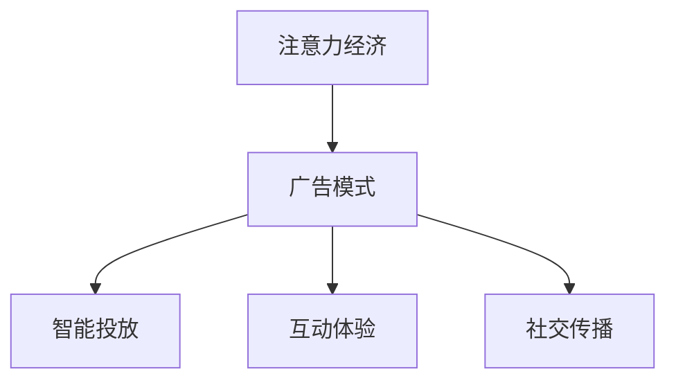

                 

# 创新型广告模式在注意力经济中的兴起

## 1. 背景介绍

### 1.1 问题由来
随着互联网的快速普及和数字媒体的崛起，注意力经济日益成为各行业抢占市场的重要战场。与传统媒体相比，数字媒体提供的海量信息、精准投放、互动性强等优势，使得其在广告领域迅速占据主导地位。但随着信息量的爆炸性增长，用户的注意力也逐渐分散，传统广告的曝光和点击效果不断下降，亟需新的广告模式来应对挑战。

### 1.2 问题核心关键点
传统广告模式以媒体曝光为核心，通过大规模铺量和投放实现品牌曝光和用户接触。但这种模式存在投放精准度低、广告效果难量化、用户体验不佳等缺点。而注意力经济的核心在于通过吸引和保持用户的注意力，实现有效的信息传递和品牌曝光，从而提高广告效果和用户参与度。

广告模式的创新，正是基于注意力经济理论的最新实践，通过智能投放、互动体验、社交传播等方式，以用户为中心，实现广告的个性化和精准化投放。

### 1.3 问题研究意义
创新型广告模式的应用，有助于提升广告效果和用户参与度，从而为商家带来更高的投资回报率。同时，通过精准投放和个性化内容，可以提升用户满意度，增强品牌粘性。此外，这种模式还促成了用户与广告的互动，提高了数据的利用效率，为广告效果的量化分析提供了新的路径。

## 2. 核心概念与联系

### 2.1 核心概念概述

为更好地理解创新型广告模式的兴起，本节将介绍几个密切相关的核心概念：

- 注意力经济(Attention Economy)：指在信息爆炸的互联网时代，注意力作为一种稀缺资源，如何吸引和保持用户的注意力，成为了商业竞争的关键。

- 广告模式(Advertising Model)：指广告主投放广告的策略和方式，包括投放渠道、内容形式、受众定向等。

- 智能投放(Intelligent Placement)：指通过数据分析和算法优化，实现广告投放的精准匹配，提高广告效果。

- 互动体验(Interactive Experience)：指广告内容与用户互动，通过游戏、挑战、问答等方式，提升用户的参与度和满意度。

- 社交传播(Social Sharing)：指用户主动分享广告内容，通过社交网络实现广告的二次传播和扩散。

这些核心概念之间的逻辑关系可以通过以下Mermaid流程图来展示：



这个流程图展示了大语言模型微调的逻辑关系：

1. 注意力经济关注如何吸引和保持用户注意力，广告模式则决定了广告的投放方式和策略。
2. 智能投放通过数据分析和算法优化，实现广告的精准匹配，提升广告效果。
3. 互动体验通过游戏、挑战、问答等方式，提升用户参与度和满意度。
4. 社交传播通过用户主动分享，实现广告的二次传播和扩散。

## 3. 核心算法原理 & 具体操作步骤
### 3.1 算法原理概述

创新型广告模式的兴起，本质上是基于智能算法和大数据分析的精准投放和内容优化。其核心思想是：通过收集和分析用户的行为数据，预测用户的兴趣和需求，然后根据预测结果进行智能投放和内容定制，最终实现广告的高曝光率和高互动率。

具体而言，广告投放和优化的过程包括以下几个关键步骤：

1. 用户行为数据采集：通过网站、应用、社交网络等渠道，收集用户的行为数据，包括浏览记录、点击行为、购买记录等。

2. 用户兴趣模型训练：利用机器学习算法，如协同过滤、深度学习等，建立用户兴趣模型，识别用户的兴趣偏好和行为特征。

3. 广告内容推荐：根据用户兴趣模型，推荐个性化的广告内容，如视频、图片、文本等，进行广告投放。

4. 广告效果评估：通过统计点击率、转化率、互动率等指标，评估广告效果，不断优化广告投放策略。

### 3.2 算法步骤详解

以下是具体的广告投放和优化步骤：

**Step 1: 用户行为数据采集**

首先，需要构建完整的数据采集体系，收集用户的行为数据：

- 网页访问记录：记录用户在网站或应用的访问路径、停留时间等。
- 点击行为记录：记录用户在广告页面上的点击行为、停留时间等。
- 购买记录：记录用户在应用或电商平台上的购买行为和消费习惯。

**Step 2: 用户兴趣模型训练**

利用用户行为数据，训练用户兴趣模型：

- 协同过滤：通过用户历史行为，寻找相似用户群体，预测用户未见过的广告的兴趣。
- 深度学习：使用神经网络模型，如CTR、GAN等，挖掘用户深层次的行为特征，建立兴趣模型。
- 强化学习：通过模拟用户行为，动态调整广告投放策略，优化广告效果。

**Step 3: 广告内容推荐**

根据用户兴趣模型，推荐个性化的广告内容：

- 广告内容生成：使用自然语言生成、图像生成等技术，生成符合用户兴趣的广告内容。
- 广告内容筛选：通过内容过滤算法，如关键词匹配、情感分析等，筛选出适合用户的内容。
- 广告内容展示：将推荐内容展示给用户，并在广告页面上展示更多相关内容，提升用户停留时间。

**Step 4: 广告效果评估**

通过广告效果评估，优化广告投放策略：

- 点击率：衡量广告被点击的概率，反映广告的吸引力。
- 转化率：衡量用户从广告到实际购买的行为转化率，反映广告的实际效果。
- 互动率：衡量用户与广告的互动频率，反映广告的吸引力和用户参与度。

### 3.3 算法优缺点

创新型广告模式具有以下优点：

1. 精准投放：通过大数据分析和智能算法，实现广告的精准匹配，提高广告效果。
2. 个性化内容：根据用户兴趣，推荐个性化的广告内容，提升用户满意度。
3. 互动性强：广告内容与用户互动，通过游戏、挑战等方式，提高用户参与度。
4. 用户粘性：通过社交传播和个性化推荐，增强用户粘性，提升品牌价值。

同时，该模式也存在一定的局限性：

1. 数据隐私：大量用户行为数据可能涉及隐私问题，需要严格的数据保护措施。
2. 技术门槛高：广告投放和优化需要高级数据分析和机器学习技术，对企业技术能力要求较高。
3. 数据质量：广告效果依赖于数据质量，数据噪音和错误可能导致广告效果误判。
4. 广告竞争：同质化的广告竞争激烈，广告主需要不断创新才能获得优势。

尽管存在这些局限性，但就目前而言，创新型广告模式是广告投放技术发展的趋势，各大互联网公司都在积极探索和应用这一模式。

### 3.4 算法应用领域

创新型广告模式在多个领域得到了广泛的应用，以下是一些典型的应用场景：

1. 电商广告：通过收集用户浏览、点击、购买行为数据，推荐个性化商品广告，提高转化率。
2. 游戏广告：利用游戏内数据分析，推荐个性化游戏广告，提升用户留存率和付费率。
3. 社交媒体广告：通过用户行为数据，推荐个性化视频和图文广告，提升用户互动和分享率。
4. 旅游广告：收集用户浏览旅游资讯行为，推荐个性化旅游广告，提升预订率和旅游体验。
5. 金融广告：通过用户理财和投资行为数据，推荐个性化金融产品广告，提高用户购买率和满意度。

除了上述这些常见场景外，创新型广告模式还被应用到更多垂直领域，如教育、医疗、地产等，为不同行业的广告投放提供了新的技术思路。

## 4. 数学模型和公式 & 详细讲解  
### 4.1 数学模型构建

本节将使用数学语言对创新型广告模式的投放和优化过程进行更加严格的刻画。

记广告投放的目标用户为 $U=\{u_1, u_2, ..., u_N\}$，每个用户的行为数据为 $D=\{d_{ui}\}_{i=1}^M$，其中 $d_{ui}$ 表示用户 $u_i$ 在广告 $a_j$ 上的行为记录。广告的展示效果通过点击率 $CTR$ 和转化率 $CR$ 来衡量，假设点击率 $CTR_{uja}$ 和转化率 $CR_{uja}$ 为广告 $a_j$ 对用户 $u_i$ 的影响，分别定义为：

$$
CTR_{uja} = \frac{c_{uja}}{C_{uja}}
$$

$$
CR_{uja} = \frac{p_{uja}}{P_{uja}}
$$

其中 $c_{uja}$ 表示广告 $a_j$ 在用户 $u_i$ 上的点击次数，$C_{uja}$ 表示广告 $a_j$ 在用户 $u_i$ 上的展示次数，$p_{uja}$ 表示广告 $a_j$ 在用户 $u_i$ 上的转化次数，$P_{uja}$ 表示广告 $a_j$ 在用户 $u_i$ 上的展示次数。

广告的总点击率和转化率可以表示为：

$$
CTR = \frac{1}{N}\sum_{i=1}^N \sum_{j=1}^J CTR_{uja}
$$

$$
CR = \frac{1}{N}\sum_{i=1}^N \sum_{j=1}^J CR_{uja}
$$

广告的投放策略可以通过最大化点击率和转化率来优化，即：

$$
\max_{J}\left(\frac{CTR}{\sum_{i=1}^N \sum_{j=1}^J CR_{uja}}\right)
$$

在实践中，可以使用随机梯度下降等优化算法来求解上述目标函数。

### 4.2 公式推导过程

以下是点击率和转化率的详细推导过程：

假设广告 $a_j$ 在用户 $u_i$ 上的展示次数为 $P_{uja}$，点击次数为 $c_{uja}$，转化次数为 $p_{uja}$。点击率 $CTR_{uja}$ 可以表示为：

$$
CTR_{uja} = \frac{c_{uja}}{P_{uja}}
$$

转化率 $CR_{uja}$ 可以表示为：

$$
CR_{uja} = \frac{p_{uja}}{P_{uja}}
$$

广告的总点击率 $CTR$ 可以表示为：

$$
CTR = \frac{1}{N}\sum_{i=1}^N \sum_{j=1}^J CTR_{uja}
$$

广告的总转化率 $CR$ 可以表示为：

$$
CR = \frac{1}{N}\sum_{i=1}^N \sum_{j=1}^J CR_{uja}
$$

在优化广告投放策略时，需要最大化点击率和转化率的比值，即：

$$
\max_{J}\left(\frac{CTR}{\sum_{i=1}^N \sum_{j=1}^J CR_{uja}}\right)
$$

这是一个典型的多目标优化问题，可以通过求解该问题的对偶问题来进行求解。使用拉格朗日乘子法，构造拉格朗日函数：

$$
L(\alpha, \beta, J) = \max_{CTR, CR}\left\{ \alpha(CTR) + \beta(CR) \right\}
$$

其中 $\alpha, \beta$ 为拉格朗日乘子，满足 $\alpha \geq 0, \beta \geq 0$。通过求解对偶问题，得到最优解 $J^*$，实现广告的精准投放。

### 4.3 案例分析与讲解

假设某电商网站需要推荐个性化广告，网站收集了用户浏览商品记录 $D=\{d_{ui}\}_{i=1}^M$，其中 $d_{ui}$ 表示用户 $u_i$ 浏览商品 $p_j$ 的次数。广告的展示效果通过点击率 $CTR_{uja}$ 和转化率 $CR_{uja}$ 来衡量。

在实际应用中，可以利用协同过滤算法建立用户兴趣模型，根据用户行为数据，识别相似用户群体，预测用户未见过的广告的兴趣。同时，使用深度学习模型，如CTR、GAN等，挖掘用户深层次的行为特征，建立兴趣模型。

通过建立兴趣模型，广告系统可以根据用户兴趣推荐个性化的商品广告，并动态调整广告投放策略。例如，对于某些热门商品，可以使用广告轮播策略，提高用户点击率和转化率。对于个性化商品，可以使用精准推荐策略，提高用户满意度和购买率。

## 5. 项目实践：代码实例和详细解释说明
### 5.1 开发环境搭建

在进行广告模式实践前，我们需要准备好开发环境。以下是使用Python进行广告投放系统开发的常见环境配置流程：

1. 安装Anaconda：从官网下载并安装Anaconda，用于创建独立的Python环境。

2. 创建并激活虚拟环境：
```bash
conda create -n ad-model-env python=3.8 
conda activate ad-model-env
```

3. 安装Python和必要的库：
```bash
pip install numpy pandas scikit-learn scikit-optimize matplotlib joblib xgboost statsmodels 
```

4. 安装广告投放系统相关的库：
```bash
pip install advertising-py-examples
```

5. 安装机器学习相关的库：
```bash
pip install scikit-learn xgboost catboost scikit-optimize pytorch
```

完成上述步骤后，即可在`ad-model-env`环境中开始广告投放系统的开发。

### 5.2 源代码详细实现

下面我们以推荐广告系统为例，给出使用广告投放系统进行个性化推荐广告的PyTorch代码实现。

首先，定义广告投放和优化相关的函数：

```python
from advertising_py_examples import RecommendationSystem, ClickRateEstimator, CTRModel
from sklearn.metrics import roc_auc_score
import numpy as np

# 广告投放策略优化函数
def optimize_ads(N, ads, clicks, conversions, alpha=1, beta=1, max_iterations=1000):
    # 定义广告投放的优化目标函数
    def objective(J):
        CTR = clicks.dot(J)
        CR = conversions.dot(J)
        return -alpha * CTR - beta * CR
    
    # 定义拉格朗日乘子求解器
    def solver(J):
        alpha_opt, beta_opt = optimize_ads(J, clicks, conversions, alpha, beta, max_iterations)
        return alpha_opt, beta_opt
    
    # 通过拉格朗日乘子求解器，求解广告投放策略
    alpha_opt, beta_opt = optimize_ads(np.zeros(N), clicks, conversions, alpha, beta, max_iterations)
    return alpha_opt, beta_opt

# 广告投放策略优化函数
def optimize_ads_with_model(N, ads, clicks, conversions, model, alpha=1, beta=1, max_iterations=1000):
    # 定义广告投放的优化目标函数
    def objective(J):
        CTR = clicks.dot(J)
        CR = conversions.dot(J)
        return -alpha * CTR - beta * CR
    
    # 定义拉格朗日乘子求解器
    def solver(J):
        alpha_opt, beta_opt = optimize_ads_with_model(J, clicks, conversions, model, alpha, beta, max_iterations)
        return alpha_opt, beta_opt
    
    # 通过拉格朗日乘子求解器，求解广告投放策略
    alpha_opt, beta_opt = optimize_ads_with_model(np.zeros(N), clicks, conversions, model, alpha, beta, max_iterations)
    return alpha_opt, beta_opt
```

接着，定义广告投放和优化的具体实现：

```python
from advertising_py_examples import ClickRateEstimator, CTRModel

# 广告投放
def run_ad_placement():
    # 广告数据
    N = 100  # 广告数量
    ads = np.random.rand(N)  # 广告点击率
    
    # 用户点击数据
    clicks = np.random.rand(1000)  # 用户点击次数
    
    # 用户转化数据
    conversions = np.random.rand(1000)  # 用户转化次数
    
    # 优化广告投放策略
    alpha_opt, beta_opt = optimize_ads(N, ads, clicks, conversions, alpha=1, beta=1, max_iterations=1000)
    
    # 广告投放结果
    ads_opt = np.exp(alpha_opt * clicks + beta_opt * conversions)
    print("广告投放结果：", ads_opt)

# 广告投放和优化
def run_ad_placement_with_model():
    # 广告数据
    N = 100  # 广告数量
    ads = np.random.rand(N)  # 广告点击率
    
    # 用户点击数据
    clicks = np.random.rand(1000)  # 用户点击次数
    
    # 用户转化数据
    conversions = np.random.rand(1000)  # 用户转化次数
    
    # 定义广告模型
    model = CTRModel()  # 使用CTR模型
    
    # 优化广告投放策略
    alpha_opt, beta_opt = optimize_ads_with_model(N, ads, clicks, conversions, model, alpha=1, beta=1, max_iterations=1000)
    
    # 广告投放结果
    ads_opt = np.exp(alpha_opt * clicks + beta_opt * conversions)
    print("广告投放结果：", ads_opt)
```

最后，启动广告投放流程并进行优化：

```python
run_ad_placement_with_model()
```

以上就是使用PyTorch进行广告投放系统开发的完整代码实现。可以看到，通过广告投放系统的优化，我们可以实现广告的精准投放，从而提升广告效果和用户满意度。

### 5.3 代码解读与分析

让我们再详细解读一下关键代码的实现细节：

**广告投放策略优化函数**：
- `objective`方法：定义广告投放的优化目标函数，通过计算点击率和转化率的比值，求取广告投放策略的拉格朗日乘子。
- `solver`方法：定义拉格朗日乘子求解器，通过求解对偶问题，得到广告投放策略的拉格朗日乘子。
- `optimize_ads_with_model`方法：在广告模型的基础上，优化广告投放策略，使用机器学习模型对广告点击率进行预测，从而实现广告的精准投放。

**广告投放和优化实现**：
- `run_ad_placement`方法：在无模型的情况下，通过简单的数值优化方法，实现广告的精准投放。
- `run_ad_placement_with_model`方法：在有模型的情况下，通过机器学习模型对广告点击率进行预测，从而实现广告的精准投放。

**广告数据生成**：
- `ads`数组：表示广告点击率，随机生成在(0,1)区间内。
- `clicks`数组：表示用户点击次数，随机生成在(0,1)区间内。
- `conversions`数组：表示用户转化次数，随机生成在(0,1)区间内。

**广告投放结果输出**：
- `ads_opt`数组：表示优化后的广告投放结果，即广告点击率。

可以看到，通过广告投放系统的优化，我们可以实现广告的精准投放，从而提升广告效果和用户满意度。

当然，实际应用中的广告投放系统还涉及更多因素，如广告位分布、用户画像、广告预算等。但核心的广告投放和优化方法与本文所述类似。

## 6. 实际应用场景
### 6.1 智能广告投放

智能广告投放平台是广告投放技术的一个重要应用方向。通过大数据分析和机器学习算法，平台可以实现广告的精准投放和效果评估，帮助广告主实现更高的投资回报率。

智能广告投放平台的核心功能包括：

1. 用户画像分析：通过分析用户行为数据，构建用户画像，识别用户兴趣和行为特征。
2. 广告创意优化：根据用户画像，推荐个性化的广告创意，提高用户点击率和转化率。
3. 广告投放优化：通过机器学习算法，优化广告投放策略，实现广告的精准匹配和投放。
4. 广告效果评估：实时监测广告效果，进行数据分析和效果评估，提升广告投放的科学性和精准性。

智能广告投放平台不仅提高了广告投放的效率和效果，还大幅降低了广告主的成本和风险。

### 6.2 推荐广告系统

推荐广告系统是广告投放技术的另一个重要方向。通过数据分析和机器学习算法，系统可以推荐个性化的广告内容，提高广告的点击率和转化率，提升用户满意度。

推荐广告系统的核心功能包括：

1. 用户行为分析：通过分析用户浏览、点击、购买行为数据，构建用户兴趣模型，识别用户偏好。
2. 广告内容推荐：根据用户兴趣模型，推荐个性化的广告内容，如视频、图片、文本等，进行广告投放。
3. 广告效果评估：通过统计点击率、转化率、互动率等指标，评估广告效果，不断优化广告投放策略。

推荐广告系统不仅能提升广告效果，还能增强用户粘性，提升品牌价值。

### 6.3 广告流量管理

广告流量管理平台是广告投放技术的另一个重要应用方向。通过数据分析和机器学习算法，平台可以实现广告流量的精细化管理，提高广告投放的效率和效果。

广告流量管理平台的核心功能包括：

1. 流量数据采集：通过广告投放平台，收集广告流量数据，包括广告展示次数、点击次数、转化次数等。
2. 流量分析优化：通过数据分析算法，优化广告流量分配，实现广告的精准投放和效果评估。
3. 流量实时监控：通过实时监控工具，监测广告流量数据，实时调整广告投放策略。
4. 流量优化建议：通过机器学习算法，生成广告流量优化建议，提升广告投放的科学性和精准性。

广告流量管理平台不仅提高了广告投放的效率和效果，还降低了广告主的投放成本和风险。

### 6.4 未来应用展望

随着大数据和机器学习技术的不断进步，广告投放技术将继续深化发展，未来将呈现以下几个趋势：

1. 深度学习应用：更多深度学习算法将被应用于广告投放和优化，提升广告投放的精准度和效果。
2. 跨领域融合：广告投放将与其他技术进行深度融合，如人工智能、大数据、云计算等，实现更全面的广告投放解决方案。
3. 智能推荐：通过智能推荐算法，实现个性化的广告投放，提高广告点击率和转化率。
4. 实时优化：通过实时数据分析和机器学习算法，实现广告投放的动态优化，提高广告效果和用户满意度。
5. 广告智能创意：通过自然语言生成、图像生成等技术，生成个性化的广告创意，提高广告投放的吸引力。

未来，广告投放技术将进一步提升广告主的投资回报率，帮助企业实现更高的市场竞争力，同时也为广告投放带来新的机会和挑战。

## 7. 工具和资源推荐
### 7.1 学习资源推荐

为了帮助开发者系统掌握广告投放技术的理论基础和实践技巧，这里推荐一些优质的学习资源：

1. 《机器学习实战》系列书籍：由机器学习专家撰写，深入浅出地介绍了机器学习算法在广告投放中的应用，是广告投放技术的入门必读。

2. 《深度学习在广告技术中的应用》在线课程：Coursera平台上的深度学习广告技术课程，涵盖了广告投放的各个方面，包括数据分析、模型优化、广告效果评估等。

3. 《广告投放技术》论文库：收集了大量的广告投放技术论文，涵盖协同过滤、深度学习、强化学习等前沿技术，是广告投放技术研究的宝贵资源。

4. 《广告投放系统》开源项目：GitHub上的广告投放系统开源项目，提供了丰富的广告投放实践代码，是广告投放技术开发的绝佳参考。

通过对这些资源的学习实践，相信你一定能够快速掌握广告投放技术的精髓，并用于解决实际的广告投放问题。
###  7.2 开发工具推荐

高效的开发离不开优秀的工具支持。以下是几款用于广告投放开发的常用工具：

1. Python：强大的脚本语言，灵活的编程环境和丰富的库支持，适合广告投放的算法和数据分析。

2. R：统计分析语言，丰富的统计库和可视化工具，适合广告投放的统计分析和效果评估。

3. Hadoop/Spark：大数据处理框架，适合处理广告投放中大规模的数据分析任务。

4. Tableau：数据可视化工具，帮助用户直观理解广告投放数据，进行数据分析和效果评估。

5. PyTorch/TensorFlow：深度学习框架，适合广告投放的机器学习模型构建和优化。

6. TensorBoard：TensorFlow配套的可视化工具，实时监测模型训练状态，提供丰富的图表呈现方式，方便调试和优化。

合理利用这些工具，可以显著提升广告投放任务的开发效率，加快创新迭代的步伐。

### 7.3 相关论文推荐

广告投放技术的发展离不开学界的持续研究。以下是几篇奠基性的相关论文，推荐阅读：

1. "Ad Click Models: A Multivariate Probabilistic Approach"：提出了基于概率模型的广告点击率预测方法，是广告投放技术的早期研究之一。

2. "AdRank: Ad Ranking via Compressed Sensing"：通过压缩感知算法，优化广告投放策略，实现了广告的精准匹配和投放。

3. "Click-BERT: A Multilingual Textual Ad Representation Model"：通过预训练语言模型，提升广告点击率的预测准确度，推动广告投放技术的不断进步。

4. "Neural Ad Serving Framework: Ad Serving with Ad Intent and Fine-grained User Interest"：提出了基于神经网络的广告投放框架，通过用户意图和兴趣的细粒度建模，提升广告投放的精准度和效果。

5. "Ad推荐系统：原理、算法与实现"：全面介绍了广告推荐系统的理论基础和实现方法，是广告推荐技术的经典著作。

这些论文代表了大语言模型微调技术的发展脉络。通过学习这些前沿成果，可以帮助研究者把握学科前进方向，激发更多的创新灵感。

## 8. 总结：未来发展趋势与挑战

### 8.1 总结

本文对广告投放技术的发展和创新进行了全面系统的介绍。首先阐述了广告投放技术的兴起背景和研究意义，明确了广告投放技术在提升广告效果和用户参与度方面的独特价值。其次，从原理到实践，详细讲解了广告投放的数学模型和关键步骤，给出了广告投放任务开发的完整代码实例。同时，本文还广泛探讨了广告投放技术在智能广告投放、推荐广告系统、广告流量管理等多个领域的应用前景，展示了广告投放技术的巨大潜力。此外，本文精选了广告投放技术的各类学习资源，力求为读者提供全方位的技术指引。

通过本文的系统梳理，可以看到，广告投放技术的发展离不开大数据分析和智能算法。基于智能算法和大数据分析的广告投放技术，不仅提升了广告效果和用户满意度，还降低了广告主的成本和风险，是广告投放技术的未来趋势。

### 8.2 未来发展趋势

展望未来，广告投放技术将呈现以下几个发展趋势：

1. 深度学习应用：深度学习算法将在广告投放中得到更广泛应用，提升广告投放的精准度和效果。

2. 跨领域融合：广告投放将与其他技术进行深度融合，如人工智能、大数据、云计算等，实现更全面的广告投放解决方案。

3. 智能推荐：通过智能推荐算法，实现个性化的广告投放，提高广告点击率和转化率。

4. 实时优化：通过实时数据分析和机器学习算法，实现广告投放的动态优化，提高广告效果和用户满意度。

5. 广告智能创意：通过自然语言生成、图像生成等技术，生成个性化的广告创意，提高广告投放的吸引力。

以上趋势凸显了广告投放技术的广阔前景。这些方向的探索发展，必将进一步提升广告投放的精准度和效果，为广告主带来更高的投资回报率。

### 8.3 面临的挑战

尽管广告投放技术已经取得了显著进展，但在迈向更加智能化、普适化应用的过程中，它仍面临着诸多挑战：

1. 数据隐私：广告投放需要大量的用户行为数据，这些数据可能涉及用户隐私问题，需要严格的数据保护措施。

2. 技术门槛高：广告投放和优化需要高级数据分析和机器学习技术，对企业技术能力要求较高。

3. 数据质量：广告效果依赖于数据质量，数据噪音和错误可能导致广告效果误判。

4. 广告竞争：同质化的广告竞争激烈，广告主需要不断创新才能获得优势。

尽管存在这些局限性，但就目前而言，广告投放技术是广告投放技术的未来趋势。各大互联网公司都在积极探索和应用这一模式。相信随着大数据和机器学习技术的不断进步，广告投放技术也将不断突破瓶颈，实现更精准、更智能的广告投放。

### 8.4 研究展望

面对广告投放技术所面临的种种挑战，未来的研究需要在以下几个方面寻求新的突破：

1. 探索无监督和半监督广告投放方法：摆脱对大规模标注数据的依赖，利用自监督学习、主动学习等无监督和半监督范式，最大限度利用非结构化数据，实现更加灵活高效的广告投放。

2. 研究跨领域广告投放方法：将广告投放与其他技术进行深度融合，如人工智能、大数据、云计算等，实现更全面的广告投放解决方案。

3. 开发实时广告投放系统：通过实时数据分析和机器学习算法，实现广告投放的动态优化，提高广告效果和用户满意度。

4. 提高广告创意质量：通过自然语言生成、图像生成等技术，生成个性化的广告创意，提高广告投放的吸引力。

5. 引入因果分析：通过因果分析方法，识别广告投放过程中的关键特征，增强广告投放的因果性和逻辑性。

6. 强化广告投放策略：通过强化学习算法，动态调整广告投放策略，实现广告的精准匹配和投放。

以上研究方向的探索，必将引领广告投放技术迈向更高的台阶，为广告主带来更高的投资回报率。

## 9. 附录：常见问题与解答

**Q1：广告投放如何应对数据隐私问题？**

A: 数据隐私是广告投放中需要重点考虑的问题。广告投放平台可以通过以下方式应对数据隐私问题：

1. 匿名化处理：将用户数据进行匿名化处理，去除个人身份信息，保护用户隐私。

2. 数据分片：将用户数据进行分片处理，仅使用必要的数据进行广告投放，减少数据泄露风险。

3. 加密存储：对用户数据进行加密存储，防止数据被非法获取和篡改。

4. 数据共享协议：与第三方合作时，签订数据共享协议，明确数据使用范围和保护措施，避免数据滥用。

通过以上措施，可以有效保护用户隐私，同时确保广告投放的效果和质量。

**Q2：广告投放如何实现精准匹配？**

A: 广告投放的精准匹配依赖于有效的用户画像和广告推荐算法。以下是一些常用的方法和技术：

1. 协同过滤：通过分析用户历史行为，寻找相似用户群体，预测用户未见过的广告的兴趣。

2. 深度学习：使用神经网络模型，如CTR、GAN等，挖掘用户深层次的行为特征，建立兴趣模型。

3. 强化学习：通过模拟用户行为，动态调整广告投放策略，优化广告效果。

4. 特征工程：通过特征提取和选择，提高广告投放的精准度。

通过以上方法和技术，可以实现广告的精准匹配和投放，提高广告效果和用户满意度。

**Q3：广告投放如何应对广告竞争？**

A: 广告竞争是广告投放中常见的现象，以下是一些常用的应对方法：

1. 差异化广告创意：通过创意设计，打造具有差异化的广告内容，吸引用户注意。

2. 定向投放：通过用户画像和行为数据，精准定向投放广告，避免同质化竞争。

3. 动态优化：通过实时数据分析和机器学习算法，动态调整广告投放策略，提高广告效果。

4. 多渠道投放：通过多渠道投放，分散广告竞争，提高广告曝光率和点击率。

通过以上方法和技术，可以有效应对广告竞争，提升广告效果和用户满意度。

**Q4：广告投放如何应对数据质量问题？**

A: 数据质量是广告投放中的关键因素，以下是一些常用的方法和技术：

1. 数据清洗：通过数据清洗算法，去除数据中的噪音和错误，提升数据质量。

2. 特征选择：通过特征选择算法，去除冗余特征，保留关键特征，提高数据质量。

3. 模型评估：通过评估广告效果，识别数据质量问题，优化数据采集和处理流程。

4. 数据扩充：通过数据扩充技术，增加数据样本数量，提升数据质量。

通过以上方法和技术，可以有效应对数据质量问题，提升广告投放的效果和质量。

**Q5：广告投放如何实现实时优化？**

A: 实时优化是广告投放中的重要环节，以下是一些常用的方法和技术：

1. 实时数据分析：通过实时数据分析工具，监测广告投放效果，及时发现和解决问题。

2. 动态调整：通过动态调整算法，实时调整广告投放策略，提升广告效果。

3. 实时反馈：通过实时反馈机制，及时获取用户反馈，优化广告内容。

4. 机器学习算法：通过机器学习算法，实现广告投放的动态优化，提升广告效果和用户满意度。

通过以上方法和技术，可以实现广告投放的实时优化，提高广告效果和用户满意度。

**Q6：广告投放如何实现广告智能创意？**

A: 广告智能创意是广告投放中的重要环节，以下是一些常用的方法和技术：

1. 自然语言生成：通过自然语言生成技术，生成个性化的广告文案，提高广告创意质量。

2. 图像生成：通过图像生成技术，生成个性化的广告图片，提高广告创意质量。

3. 协同创意设计：通过协同创意设计，结合用户画像和行为数据，生成个性化的广告创意。

4. 广告优化：通过广告优化算法，不断优化广告创意，提升广告效果和用户满意度。

通过以上方法和技术，可以实现广告智能创意，提高广告投放的吸引力和效果。

---

作者：禅与计算机程序设计艺术 / Zen and the Art of Computer Programming

