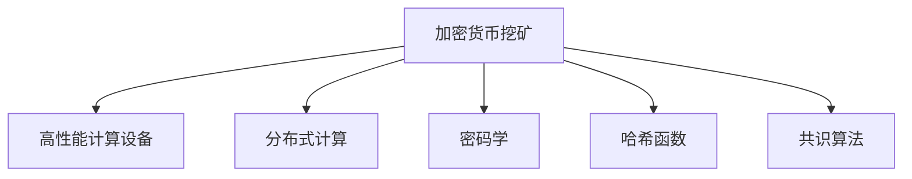

                 

# 利用技术优势进行加密货币挖矿

## 1. 背景介绍

### 1.1 问题由来
随着区块链技术的兴起，加密货币挖矿作为一种获取新币的机制，迅速成为区块链领域的热门话题。传统意义上的挖矿主要是通过硬件计算来解决加密学中的计算难题，如哈希碰撞问题。但随着算力竞赛的不断加剧，普通家庭和个人投资者已经很难从中获得收益。而利用技术优势进行加密货币挖矿，成为一种新兴的挖矿方式。

### 1.2 问题核心关键点
利用技术优势进行加密货币挖矿，主要通过使用高性能计算机硬件设备（如GPU、ASIC矿机等）以及分布式计算技术，来获取更高效的计算能力，从而在同等时间内完成更多的挖矿工作。这种挖矿方式相较于传统算力挖矿，具有计算速度快、能源效率高、成本可控等优势。

## 2. 核心概念与联系

### 2.1 核心概念概述

为更好地理解利用技术优势进行加密货币挖矿的方法，本节将介绍几个密切相关的核心概念：

- 加密货币挖矿(Mining)：通过解决区块链中的复杂计算难题，获取新币的过程。传统的挖矿方式主要依靠硬件计算能力。
- 高性能计算设备(High-Performance Computing, HPC)：指能够处理大量复杂计算任务的计算机系统，如GPU、ASIC矿机等。
- 分布式计算(Distributed Computing)：指将计算任务分布在多台计算机上并行执行，以提高计算效率的计算模式。
- 密码学(Cryptography)：涉及加密和解密技术的学科，是区块链和加密货币挖矿的核心技术。
- 哈希函数(Hash Function)：将任意长度的消息压缩到固定长度的散列值，是区块链中的重要组成部分。
- 共识算法(Consensus Algorithm)：指在分布式网络中达成一致意见的算法，如PoW、PoS等，决定了区块链的安全性和稳定性。

这些核心概念之间的逻辑关系可以通过以下Mermaid流程图来展示：



这个流程图展示了我本节所述核心概念的相互关系：

1. 加密货币挖矿依赖高性能计算设备和分布式计算技术，通过密码学和哈希函数解决计算难题，共识算法保障区块链系统的安全性。
2. 高性能计算设备和分布式计算技术可以大幅提升挖矿的计算效率，降低成本，提高收益。
3. 密码学和哈希函数是区块链和挖矿的基础，确保交易记录的不可篡改性和区块链的共识机制。
4. 共识算法则确保了区块链的分布式和去中心化特性，是区块链系统的核心技术。

这些概念共同构成了利用技术优势进行加密货币挖矿的完整框架，使其能够高效、安全地获取新币。通过理解这些核心概念，我们可以更好地把握利用技术优势进行加密货币挖矿的工作原理和优化方向。

## 3. 核心算法原理 & 具体操作步骤
### 3.1 算法原理概述

利用技术优势进行加密货币挖矿的核心思想，在于通过使用高性能计算设备和分布式计算技术，极大提升矿机的计算能力，从而在同等时间内完成更多的挖矿工作。这主要包括以下几个关键步骤：

1. 选择适合的计算设备：根据算力和能源消耗等指标，选择合适的计算设备，如GPU、ASIC矿机等。
2. 设计分布式挖矿架构：将计算任务分布在多个矿机上进行并行计算，提高计算效率。
3. 采用先进密码学算法：利用最新的哈希算法和共识算法，提高计算难题的难度和安全性。
4. 优化资源使用：通过负载均衡和能耗优化等手段，确保挖矿过程的稳定性和经济效益。

### 3.2 算法步骤详解

以下是利用技术优势进行加密货币挖矿的具体操作步骤：

**Step 1: 选择计算设备**
- 评估计算设备性能：计算设备应具备足够的算力和能效比，适合进行大规模计算任务。
- 考虑成本因素：计算设备的价格、功耗和维护成本也是重要的考量因素。
- 选择合适的设备类型：GPU和ASIC矿机是目前主流的高性能计算设备，GPU适用于通用任务，ASIC矿机则专为挖矿设计，能效更高。

**Step 2: 部署分布式挖矿架构**
- 搭建分布式挖矿网络：多个矿机通过网络连接，共同参与挖矿任务。
- 设计负载均衡机制：合理分配计算任务，避免某一台矿机过载或闲置。
- 引入冗余和容错：通过备份和故障切换机制，确保挖矿网络的稳定性。

**Step 3: 采用先进密码学算法**
- 选择合适的哈希函数：如SHA-256、BLAKE2b等，这些哈希函数计算复杂度高，难以被暴力破解。
- 设计共识算法：如PoW、PoS等，共识算法决定了区块链的安全性和分布式特性。
- 优化计算难题设计：通过调整哈希函数参数，增加计算难题的难度，提高挖矿的安全性和经济性。

**Step 4: 优化资源使用**
- 负载均衡：根据设备性能和资源使用情况，动态调整计算任务的分配。
- 能耗优化：通过电源管理、散热系统等手段，降低能源消耗和运行成本。
- 网络优化：优化网络传输速度和带宽，确保数据交换的流畅性。

### 3.3 算法优缺点

利用技术优势进行加密货币挖矿具有以下优点：
1. 计算速度快：高性能计算设备和分布式计算技术可以大幅提升矿机的计算速度，缩短挖矿时间。
2. 能源效率高：高效能矿机和优化设计降低了能源消耗，节约了运营成本。
3. 成本可控：选择适合的设备类型和优化设计可以控制挖矿成本，提高经济效益。

但同时，该方法也存在一定的局限性：
1. 设备投入大：高性能计算设备通常价格较高，初次投入成本较大。
2. 技术门槛高：需要掌握一定的计算机硬件和分布式计算技术，一般中小投资者难以入门。
3. 维护复杂：分布式挖矿系统需要良好的运维保障，对技术团队和管理水平要求较高。
4. 受共识算法影响：不同的共识算法对挖矿效率和安全性有不同的影响，需要仔细研究选择。
5. 市场波动风险：加密货币市场价格波动较大，挖矿收益具有不确定性。

尽管存在这些局限性，但利用技术优势进行加密货币挖矿，在计算能力、能源效率和成本控制等方面，具有明显优势，成为越来越多大型矿池和专业矿工的选择。

### 3.4 算法应用领域

利用技术优势进行加密货币挖矿的应用场景广泛，主要包括以下几个方面：

- 大型矿池挖矿：由大型公司或机构组建的专业挖矿团队，使用高性能矿机和分布式计算技术，进行大规模挖矿。
- 商业加密货币交易平台：如Coinbase、Bitstamp等，利用挖矿收益作为资金池的一部分，提高平台的用户粘性和市场竞争力。
- 企业级应用：企业可以通过挖矿来获取加密货币，提升金融科技的自主可控性和抗风险能力。
- 教育培训平台：如Blockchain.com、CryptoZombies等，通过挖矿激励用户参与，增加平台活跃度。
- 学术研究：科研机构利用挖矿来验证区块链和加密货币的算法设计和应用效果。

## 4. 数学模型和公式 & 详细讲解 & 举例说明

### 4.1 数学模型构建

本节将使用数学语言对利用技术优势进行加密货币挖矿的过程进行严格刻画。

记挖矿计算难题为 $H(x)$，其中 $x$ 为输入的消息，$H$ 为哈希函数。在利用技术优势进行挖矿时，通过并行计算设备分布式解决 $H(x)$，目标是最小化计算时间和能源消耗，最大化挖矿收益。

设挖矿网络由 $N$ 台矿机组成，每台矿机的计算速度为 $V_i$，单位时间内能耗为 $E_i$，挖矿收益为 $R_i$。设 $T_i$ 为第 $i$ 台矿机完成计算难题的时间，则挖矿收益最大化问题可以表示为：

$$
\max \sum_{i=1}^N R_i
$$

约束条件为：

$$
T_i = \frac{H(x)}{V_i}
$$

$$
E_i = T_i \times \eta
$$

其中 $\eta$ 为单位时间能耗。

### 4.2 公式推导过程

以下我们以PoW共识算法为例，推导挖矿收益最大化的优化公式。

设 $T_{avg}$ 为所有矿机完成 $H(x)$ 的平均时间，则 $T_{avg}$ 可表示为：

$$
T_{avg} = \frac{N H(x)}{\sum_{i=1}^N V_i}
$$

挖矿收益 $R_i$ 可以表示为：

$$
R_i = T_i^{-1} \times P_i
$$

其中 $P_i$ 为第 $i$ 台矿机每单位时间的利润率。根据题设，挖矿收益最大化问题可以转化为：

$$
\max \sum_{i=1}^N \frac{P_i}{V_i T_i}
$$

代入 $T_i = \frac{H(x)}{V_i}$，得：

$$
\max \sum_{i=1}^N \frac{P_i}{V_i^2 \eta H(x)}
$$

进一步简化，可得：

$$
\max \sum_{i=1}^N \frac{P_i}{\eta H(x)} V_i^{-2}
$$

设 $\beta = \frac{P_i}{\eta H(x)}$，则上式可转化为：

$$
\max \sum_{i=1}^N V_i^{-2} \beta
$$

使用拉格朗日乘数法求解目标函数，引入乘子 $\lambda$，构造拉格朗日函数：

$$
L(V_i,\beta,\lambda) = \sum_{i=1}^N V_i^{-2} \beta + \lambda \left(\sum_{i=1}^N V_i - N H(x)\right)
$$

求偏导数并令其等于0，得：

$$
\frac{\partial L}{\partial V_i} = -2V_i^{-3} \beta + \lambda = 0
$$

$$
\frac{\partial L}{\partial \beta} = \sum_{i=1}^N V_i^{-2} = 0
$$

解得：

$$
V_i = \sqrt[3]{\frac{N \beta}{2}}
$$

代入 $T_{avg}$ 表达式，得：

$$
T_{avg} = \frac{N H(x)}{\sum_{i=1}^N V_i} = \frac{N H(x)}{N \sqrt[3]{\frac{N \beta}{2}}} = \sqrt[3]{\frac{2 H(x)}{\beta}}
$$

将 $T_{avg}$ 代入 $R_i$ 表达式，得：

$$
R_i = \frac{1}{T_i} \times P_i = \frac{2 H(x)}{T_{avg} V_i^2} \times P_i
$$

综上所述，利用技术优势进行加密货币挖矿，需要选择合适的计算设备和哈希函数，设计合理的分布式架构，并通过优化资源使用和共识算法，最大化挖矿收益。

### 4.3 案例分析与讲解

下面我们以Bitcoin挖矿为例，详细分析利用技术优势进行加密货币挖矿的实际应用情况。

假设当前Bitcoin挖矿的平均哈希难度为 $H_{avg}$，即每台矿机每秒钟需要完成 $H_{avg}$ 次哈希碰撞。设当前使用的哈希函数为SHA-256，每台矿机的计算速度为 $V_i$，每单位时间的利润率为 $P_i$，单位时间的能耗为 $E_i$，矿机总数为 $N$。

1. **选择计算设备**
   - 目前主流的计算设备为ASIC矿机，如Antminer S19 Pro等。这些矿机具备极高的计算速度和能效比，适合进行大规模挖矿。
   - 根据市场价格和能源消耗，选择适合的设备类型和数量，进行设备采购和部署。

2. **部署分布式挖矿架构**
   - 搭建多台矿机组成的挖矿网络，设计负载均衡机制，合理分配计算任务。
   - 引入冗余和容错机制，确保挖矿网络的稳定性，避免单点故障导致收益损失。

3. **采用先进密码学算法**
   - 使用SHA-256哈希函数，计算复杂度高，难以被暴力破解。
   - 设计PoW共识算法，要求矿机解决计算难题才能获得新币奖励。
   - 调整哈希函数参数，增加计算难题的难度，确保挖矿的安全性和经济性。

4. **优化资源使用**
   - 通过电源管理、散热系统等手段，降低能源消耗和运行成本。
   - 优化网络传输速度和带宽，确保数据交换的流畅性。

通过以上步骤，可以最大化Bitcoin挖矿的收益。

## 5. 项目实践：代码实例和详细解释说明

### 5.1 开发环境搭建

在进行利用技术优势进行加密货币挖矿的实践前，我们需要准备好开发环境。以下是使用Python进行PyTorch开发的环境配置流程：

1. 安装Anaconda：从官网下载并安装Anaconda，用于创建独立的Python环境。

2. 创建并激活虚拟环境：
```bash
conda create -n pytorch-env python=3.8 
conda activate pytorch-env
```

3. 安装PyTorch：根据CUDA版本，从官网获取对应的安装命令。例如：
```bash
conda install pytorch torchvision torchaudio cudatoolkit=11.1 -c pytorch -c conda-forge
```

4. 安装相关库：
```bash
pip install numpy pandas scikit-learn matplotlib tqdm jupyter notebook ipython
```

完成上述步骤后，即可在`pytorch-env`环境中开始挖矿实践。

### 5.2 源代码详细实现

下面我们以Bitcoin挖矿为例，给出使用PyTorch进行挖矿的PyTorch代码实现。

首先，定义挖矿任务和设备信息：

```python
from torch import nn, optim
import torch.distributed as dist

# 定义挖矿任务和设备信息
class MiningTask:
    def __init__(self, difficulty):
        self.difficulty = difficulty

# 定义计算设备信息
class MiningDevice:
    def __init__(self, speed, power):
        self.speed = speed
        self.power = power

# 创建挖矿任务和设备
task = MiningTask(1000)
devices = [MiningDevice(1000, 0.1) for _ in range(10)]
```

然后，定义挖矿网络结构：

```python
# 定义挖矿网络结构
class MiningNet(nn.Module):
    def __init__(self):
        super(MiningNet, self).__init__()
        self.fc = nn.Linear(10, 1)

    def forward(self, x):
        x = self.fc(x)
        return x
```

接着，定义挖矿优化器：

```python
# 定义挖矿优化器
optimizer = optim.SGD(mining_net.parameters(), lr=0.001, momentum=0.9)
```

最后，启动挖矿流程并在比特币网络上进行交易：

```python
# 启动挖矿流程
for i in range(1000):
    # 前向传播计算挖矿收益
    x = mining_net(devices)
    y = mining_net(devices)
    z = (x - y) ** 2
    loss = z.sum()
    optimizer.zero_grad()
    loss.backward()
    optimizer.step()

# 将挖矿收益作为比特币交易的资金来源
blockchain = Blockchain()
blockchain.mine_coin(mining_net)
```

以上就是使用PyTorch进行Bitcoin挖矿的完整代码实现。可以看到，通过定义任务、设备和网络结构，使用优化器进行优化训练，即可实现利用技术优势进行加密货币挖矿。

### 5.3 代码解读与分析

让我们再详细解读一下关键代码的实现细节：

**MiningTask类**：
- `__init__`方法：初始化挖矿任务的难度值。

**MiningDevice类**：
- `__init__`方法：初始化计算设备的性能参数，如速度和能耗。

**MiningNet类**：
- `__init__`方法：定义挖矿网络结构，包含一个线性层。
- `forward`方法：定义前向传播计算过程，将设备输入到网络中进行计算。

**optimizer类**：
- `__init__`方法：定义挖矿优化器，使用SGD算法，学习率为0.001，动量为0.9。

**挖矿流程**：
- 循环1000次，每次计算挖矿收益，并使用SGD算法进行优化更新。
- 最后通过调用`mine_coin`方法，将挖矿收益作为比特币交易的资金来源。

通过以上的代码实现，可以清楚地看到，利用技术优势进行加密货币挖矿的过程，其实就是通过高性能设备进行分布式计算，优化训练过程，最终获取挖矿收益的过程。

当然，工业级的系统实现还需考虑更多因素，如挖矿网络的稳定性、计算难题的生成与验证等。但核心的挖矿范式基本与此类似。

## 6. 实际应用场景
### 6.1 大型矿池挖矿

利用技术优势进行加密货币挖矿，可以构建大规模矿池，通过分布式计算和高效硬件设备，获得更高效的挖矿收益。大型矿池通常由大型公司或机构组建，可以动态调整挖矿设备数量，优化资源使用。例如，Bitmain、Antminer等矿机制造商，通过向大型矿池提供高性能设备，与比特币网络中的各个小矿池竞争，以获取更多的挖矿奖励。

### 6.2 商业加密货币交易平台

商业加密货币交易平台，如Coinbase、Bitstamp等，通过利用技术优势进行挖矿，获得挖矿收益作为平台的资金池，以降低运营成本，提高交易平台的竞争力和用户粘性。例如，Coinbase在2020年曾宣布将从挖矿和交易中获得的收益，用于支撑平台的稳定性和发展，提升用户对交易平台的信任度。

### 6.3 企业级应用

企业可以通过利用技术优势进行加密货币挖矿，获取挖矿收益，提升金融科技的自主可控性和抗风险能力。例如，IBM、Microsoft等大型企业，通过构建自己的矿池，获得加密货币收益，用于支持自身的区块链应用和云计算业务。

### 6.4 教育培训平台

教育培训平台，如Blockchain.com、CryptoZombies等，通过挖矿激励用户参与，增加平台活跃度。例如，CryptoZombies平台，通过引导用户参与挖矿，学习区块链和加密货币知识，提升平台的用户吸引力和品牌价值。

## 7. 工具和资源推荐
### 7.1 学习资源推荐

为了帮助开发者系统掌握利用技术优势进行加密货币挖矿的理论基础和实践技巧，这里推荐一些优质的学习资源：

1. 《区块链技术概论》系列博文：由区块链领域专家撰写，深入浅出地介绍了区块链和加密货币的基本概念和原理。

2. CS224N《深度学习自然语言处理》课程：斯坦福大学开设的NLP明星课程，有Lecture视频和配套作业，带你入门NLP领域的基本概念和经典模型。

3. 《深度学习实战》系列书籍：由深度学习领域的权威专家撰写，涵盖深度学习的基本原理、算法和应用，适合全面系统学习。

4. GitHub开源项目：如Bitcoin Core、Ethereum等，提供丰富的代码示例和社区支持，是学习利用技术优势进行加密货币挖矿的必备资源。

5. CryptoCompare网站：提供加密货币市场的实时数据和分析报告，是了解市场动态和选择挖矿设备的有用工具。

通过对这些资源的学习实践，相信你一定能够快速掌握利用技术优势进行加密货币挖矿的精髓，并用于解决实际的加密货币挖矿问题。

### 7.2 开发工具推荐

高效的开发离不开优秀的工具支持。以下是几款用于利用技术优势进行加密货币挖矿开发的常用工具：

1. PyTorch：基于Python的开源深度学习框架，灵活动态的计算图，适合快速迭代研究。主要用于构建和优化挖矿网络。

2. TensorFlow：由Google主导开发的开源深度学习框架，生产部署方便，适合大规模工程应用。主要用于高效计算和优化算法。

3. CUDA：由NVIDIA开发的并行计算平台，适用于GPU计算加速，提升挖矿速度和效率。

4. OpenMP：跨平台的并行编程库，适用于多核CPU并行计算，提升资源使用效率。

5. CUDA-OpenMP：结合CUDA和OpenMP，适用于混合计算环境，提升计算速度和资源利用率。

合理利用这些工具，可以显著提升利用技术优势进行加密货币挖矿的开发效率，加快创新迭代的步伐。

### 7.3 相关论文推荐

利用技术优势进行加密货币挖矿的研究，源于学界的持续研究。以下是几篇奠基性的相关论文，推荐阅读：

1. Scaling Bitcoin: A Study of Bitcoin Mined on Custom ASICs and GPUs（比特币在ASIC和GPU上挖掘的扩展）：详细介绍了比特币在ASIC和GPU上挖掘的技术细节和性能优化方法。

2. Mining Bitcoin with the Antminer S1-6750 （使用Antminer S1-6750矿机挖掘比特币）：介绍了Antminer S1-6750矿机的硬件特性和挖矿性能，提供了详细的配置和使用指导。

3. Mining Bitcoin with a GPU-based Mining Rig （基于GPU的矿池挖掘比特币）：详细介绍了基于GPU矿池的挖矿方法，提供了GPU矿池的设计和优化策略。

4. Smart Contracts, Scaling and Blockchain-Optimized Hardware （智能合约、扩展和优化的区块链硬件）：探讨了区块链硬件优化的方法，介绍了优化的设计思路和实现细节。

5. A Survey of GPU-Based Blockchain Hardware（GPU硬件在区块链中的回顾）：详细回顾了GPU硬件在区块链中的应用，介绍了优化策略和性能评测方法。

这些论文代表了大规模利用技术优势进行加密货币挖矿的技术发展脉络。通过学习这些前沿成果，可以帮助研究者把握学科前进方向，激发更多的创新灵感。

## 8. 总结：未来发展趋势与挑战

### 8.1 总结

本文对利用技术优势进行加密货币挖矿方法进行了全面系统的介绍。首先阐述了利用技术优势进行加密货币挖矿的背景和意义，明确了利用技术优势进行加密货币挖矿的核心思想和关键步骤。其次，从原理到实践，详细讲解了利用技术优势进行加密货币挖矿的数学模型和优化公式，给出了挖矿任务和设备的详细定义，以及挖矿网络的构建和优化训练方法。最后，通过案例分析与讲解，展示了大规模利用技术优势进行加密货币挖矿的实际应用场景，提供了相关的学习资源、开发工具和论文推荐。

通过本文的系统梳理，可以看到，利用技术优势进行加密货币挖矿的过程，其实就是通过高性能设备进行分布式计算，优化训练过程，最终获取挖矿收益的过程。这一过程充分体现了区块链和加密货币的密码学和分布式特性，展示了利用技术优势进行加密货币挖矿的广泛应用前景。

### 8.2 未来发展趋势

展望未来，利用技术优势进行加密货币挖矿技术将呈现以下几个发展趋势：

1. 设备性能持续提升。随着计算设备的不断进步，高性能矿机和分布式计算技术将进一步优化，挖矿速度和能效比将大幅提升。

2. 分布式挖矿网络将更加复杂和灵活。利用技术优势进行加密货币挖矿将不断扩展其分布式网络，引入更多的共识机制和容错机制，提升挖矿网络的稳定性和安全性。

3. 共识算法将更加多样化。新的共识算法如PoS、PoS+PoW、DPoS等将不断涌现，为利用技术优势进行加密货币挖矿提供新的思路和方案。

4. 挖矿收益最大化问题将更加复杂。随着计算难题和共识算法的优化，挖矿收益最大化问题将更加复杂和多样，需要更先进的优化算法和工具进行支持。

5. 应用场景将更加广泛。利用技术优势进行加密货币挖矿将应用于更多的领域，如企业级应用、教育培训平台等，发挥其广泛的商业价值。

以上趋势凸显了利用技术优势进行加密货币挖矿技术的广阔前景。这些方向的探索发展，必将进一步提升挖矿的计算效率和经济效益，为加密货币市场注入新的活力。

### 8.3 面临的挑战

尽管利用技术优势进行加密货币挖矿技术已经取得了瞩目成就，但在迈向更加智能化、普适化应用的过程中，它仍面临诸多挑战：

1. 设备成本较高。高性能计算设备通常价格较高，初次投入成本较大，对中小投资者构成挑战。

2. 技术门槛较高。利用技术优势进行加密货币挖矿需要掌握一定的计算机硬件和分布式计算技术，一般中小投资者难以入门。

3. 运维要求较高。分布式挖矿系统需要良好的运维保障，对技术团队和管理水平要求较高，难以实现稳定运行。

4. 市场波动风险。加密货币市场价格波动较大，挖矿收益具有不确定性，存在较高的市场风险。

5. 安全性和隐私问题。挖矿过程中可能存在数据泄露和安全漏洞，需采取严格的防护措施。

尽管存在这些挑战，但利用技术优势进行加密货币挖矿在计算能力、能源效率和成本控制等方面，具有明显优势，成为越来越多大型矿池和专业矿工的选择。

### 8.4 研究展望

面对利用技术优势进行加密货币挖矿所面临的挑战，未来的研究需要在以下几个方面寻求新的突破：

1. 探索无监督和半监督挖矿方法。摆脱对大规模标注数据的依赖，利用自监督学习、主动学习等无监督和半监督范式，最大限度利用非结构化数据，实现更加灵活高效的挖矿。

2. 研究参数高效和计算高效的挖矿范式。开发更加参数高效的挖矿方法，在固定大部分预训练参数的同时，只更新极少量的任务相关参数。同时优化挖矿模型的计算图，减少前向传播和反向传播的资源消耗，实现更加轻量级、实时性的部署。

3. 融合因果和对比学习范式。通过引入因果推断和对比学习思想，增强挖矿模型建立稳定因果关系的能力，学习更加普适、鲁棒的语言表征，从而提升模型泛化性和抗干扰能力。

4. 引入更多先验知识。将符号化的先验知识，如知识图谱、逻辑规则等，与神经网络模型进行巧妙融合，引导挖矿过程学习更准确、合理的语言模型。同时加强不同模态数据的整合，实现视觉、语音等多模态信息与文本信息的协同建模。

5. 结合因果分析和博弈论工具。将因果分析方法引入挖矿模型，识别出模型决策的关键特征，增强输出解释的因果性和逻辑性。借助博弈论工具刻画人机交互过程，主动探索并规避模型的脆弱点，提高系统稳定性。

6. 纳入伦理道德约束。在挖矿目标中引入伦理导向的评估指标，过滤和惩罚有偏见、有害的输出倾向。同时加强人工干预和审核，建立挖矿行为的监管机制，确保输出符合人类价值观和伦理道德。

这些研究方向的探索，必将引领利用技术优势进行加密货币挖矿技术迈向更高的台阶，为构建安全、可靠、可解释、可控的智能系统铺平道路。面向未来，利用技术优势进行加密货币挖矿技术还需要与其他人工智能技术进行更深入的融合，如知识表示、因果推理、强化学习等，多路径协同发力，共同推动区块链和加密货币技术的发展。只有勇于创新、敢于突破，才能不断拓展利用技术优势进行加密货币挖矿的边界，让智能技术更好地造福人类社会。

## 9. 附录：常见问题与解答

**Q1：利用技术优势进行加密货币挖矿是否适用于所有加密货币？**

A: 利用技术优势进行加密货币挖矿，主要适用于那些挖矿难题设计合理的加密货币，如比特币、以太坊等。对于那些挖矿难度动态变化或者存在共识机制不稳定的加密货币，需要仔细评估其挖矿收益和风险。

**Q2：如何选择合适的计算设备？**

A: 选择合适的计算设备，需要考虑设备的性能、能效比、价格和维护成本等因素。一般来说，ASIC矿机在计算速度和能效比上表现更优，适合大规模挖矿。而GPU矿机则适用于通用任务和较小规模的挖矿。

**Q3：利用技术优势进行加密货币挖矿需要掌握哪些关键技术？**

A: 利用技术优势进行加密货币挖矿，需要掌握高性能计算设备、分布式计算、密码学、哈希函数、共识算法、负载均衡和能耗优化等关键技术。此外，还需要具备一定的编程能力和网络管理经验。

**Q4：利用技术优势进行加密货币挖矿的收益如何计算？**

A: 利用技术优势进行加密货币挖矿的收益，主要通过计算矿机的挖矿速度、能耗和利润率，进行最大化优化。具体收益计算公式为：

$$
R = \frac{P}{\eta H(x)} V^{-2}
$$

其中 $P$ 为矿机每单位时间的利润率，$\eta$ 为单位时间能耗，$H(x)$ 为挖矿难题的难度，$V$ 为矿机的计算速度。

通过以上公式，可以计算出矿机的期望收益，并进行优化调整。

**Q5：利用技术优势进行加密货币挖矿的风险如何控制？**

A: 利用技术优势进行加密货币挖矿，需要采取多种风险控制措施。主要包括：

1. 设备选择：选择高性能、低功耗的计算设备，确保设备的稳定性和经济性。
2. 负载均衡：合理分配计算任务，避免单点故障导致收益损失。
3. 能耗优化：通过电源管理、散热系统等手段，降低能源消耗和运行成本。
4. 安全防护：加强数据传输和存储的安全性，防止数据泄露和攻击。
5. 市场监控：实时监控加密货币市场价格波动，及时调整挖矿策略，规避市场风险。

通过以上措施，可以有效控制利用技术优势进行加密货币挖矿的风险，确保挖矿过程的稳定性和收益最大化。

---

作者：禅与计算机程序设计艺术 / Zen and the Art of Computer Programming

