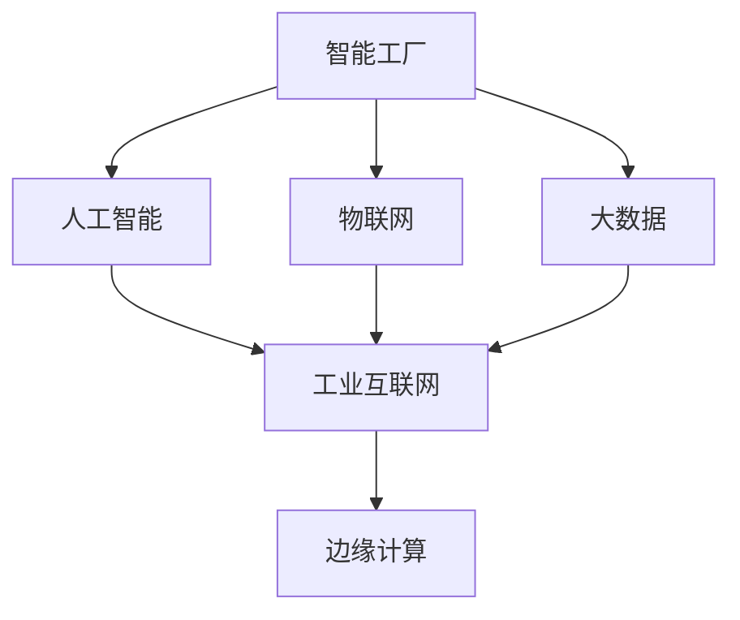

                 

# 利用技术优势进行智能工厂创业

## 1. 背景介绍

### 1.1 问题由来

随着人工智能、物联网、大数据等技术的快速发展，智能制造已成为制造业转型的重要方向。智能化工厂以数据驱动为核心，通过先进的信息化技术，实现生产过程的全生命周期管理，大幅提升生产效率和产品质量。但在智能化工厂建设过程中，往往面临高昂的技术投入、复杂的系统集成、数据安全和隐私保护等诸多难题。如何高效、安全、便捷地构建和运营智能化工厂，成为创业者和企业的首要任务。

### 1.2 问题核心关键点

智能工厂的建设包括数据采集、设备互联、业务集成、AI应用等多个关键环节。其中，AI技术在生产过程优化、质量控制、设备预测性维护等方面具有巨大潜力，是提升智能化工厂效率的重要手段。但AI应用在传统制造业中面临诸多挑战，如设备数据难以实时采集、数据质量参差不齐、AI模型部署成本高等问题。

### 1.3 问题研究意义

智能工厂的建设，不仅能够提升制造业的自动化和智能化水平，还能通过数据驱动优化生产流程，减少资源浪费，提高企业竞争力。利用技术优势进行智能工厂创业，能显著降低制造业智能化转型的门槛，加速传统行业的数字化升级，带来新的经济增长点。

## 2. 核心概念与联系

### 2.1 核心概念概述

为更好地理解如何利用技术优势进行智能工厂创业，本节将介绍几个密切相关的核心概念：

- 智能工厂（Smart Factory）：以数据驱动为核心，通过先进的自动化、信息化和智能化技术，实现生产过程的全生命周期管理，提升生产效率和产品质量。
- 人工智能（Artificial Intelligence, AI）：通过模拟、延伸和扩展人的智能，利用算法和数据对现实问题进行自动化解决。
- 物联网（Internet of Things, IoT）：通过传感器、通信技术、网络协议等实现设备、系统、人员等互联互通，采集、传输、处理和利用数据。
- 大数据（Big Data）：涉及数据收集、存储、处理、分析和应用等多个环节，为智能化工厂提供强大的数据支持。
- 工业互联网（Industrial Internet, IIoT）：通过将AI、IoT、大数据等技术应用于工业生产过程，实现生产过程的优化、控制和管理。
- 边缘计算（Edge Computing）：利用靠近数据源的计算能力，就地处理数据，降低网络带宽和延迟，提高智能化工厂的实时性。

这些核心概念之间的逻辑关系可以通过以下Mermaid流程图来展示：



这个流程图展示了一个典型智能工厂的建设框架：

1. 智能工厂依托人工智能技术，实现生产过程的自动化和智能化。
2. 通过物联网技术实现设备、系统、人员等互联互通，采集实时数据。
3. 利用大数据技术进行数据处理和分析，提取有价值信息。
4. 工业互联网将人工智能、物联网、大数据等技术应用于工业生产，实现生产过程的优化。
5. 边缘计算就地处理数据，提高实时性。

这些概念共同构成了智能工厂的技术框架，使得智能制造成为可能。通过理解这些核心概念，我们可以更好地把握智能工厂建设的技术方向和实施策略。

## 3. 核心算法原理 & 具体操作步骤
### 3.1 算法原理概述

利用技术优势进行智能工厂创业的核心在于构建一个高度自动化、信息化和智能化的生产体系。这一体系需要依托先进的信息技术，实现生产过程的数字化和智能化管理。具体而言，包括以下几个关键步骤：

1. 数据采集与集成：通过传感器、摄像头、RFID等设备，实时采集生产过程中的各种数据，如温度、湿度、压力、振动等，并将数据集成到一个统一的平台中。
2. 数据存储与分析：对采集到的数据进行存储、清洗和预处理，然后利用大数据技术进行深度学习和模式识别，提取有价值的信息。
3. 设备互联与控制：利用物联网技术，将生产设备、控制系统、传感设备等互联互通，实现对生产设备的远程监控和控制。
4. 人工智能应用：在生产过程中引入人工智能技术，如机器学习、深度学习、自然语言处理等，对生产过程进行优化和控制。
5. 工业互联网应用：将人工智能、物联网、大数据等技术应用于工业生产过程，实现生产过程的优化、控制和管理。
6. 边缘计算应用：利用靠近数据源的计算能力，就地处理数据，降低网络带宽和延迟，提高智能化工厂的实时性。

### 3.2 算法步骤详解

#### 3.2.1 数据采集与集成

1. 选择合适的传感器和数据采集设备，如温度传感器、压力传感器、摄像头等，采集生产过程中的各种数据。
2. 设计数据采集接口，确保设备能够稳定、可靠地采集数据。
3. 利用数据采集中间件，如MQTT、CoAP等，将采集到的数据发送到统一的数据平台。
4. 对采集到的数据进行清洗和预处理，如去噪、归一化、时间同步等。
5. 利用大数据技术，如Hadoop、Spark等，进行数据存储和分析。

#### 3.2.2 数据存储与分析

1. 选择合适的数据存储系统，如Hadoop HDFS、MongoDB等，存储清洗后的数据。
2. 利用大数据技术，如MapReduce、Spark等，对数据进行分布式处理和分析。
3. 利用机器学习算法，如K-means、PCA等，进行数据降维和特征提取。
4. 利用深度学习算法，如卷积神经网络（CNN）、循环神经网络（RNN）等，对数据进行模式识别和分类。

#### 3.2.3 设备互联与控制

1. 选择合适的工业互联网协议，如OPC UA、Modbus等，实现设备互联。
2. 设计设备控制系统，利用工业互联网协议，实现对生产设备的远程监控和控制。
3. 利用边缘计算技术，就地处理数据，提高实时性。

#### 3.2.4 人工智能应用

1. 选择合适的AI算法，如支持向量机（SVM）、随机森林（Random Forest）等，进行生产过程的优化和控制。
2. 利用深度学习算法，如卷积神经网络（CNN）、循环神经网络（RNN）等，进行生产过程的预测和控制。
3. 利用自然语言处理算法，如BERT、GPT等，对生产过程进行优化和控制。

#### 3.2.5 工业互联网应用

1. 利用工业互联网技术，如M2M、CPS等，实现生产过程的优化和控制。
2. 利用工业互联网平台，如SAP IoT、CPS平台等，实现生产过程的监控和管理。

#### 3.2.6 边缘计算应用

1. 利用边缘计算技术，如Fog、Edge、雾计算等，就地处理数据，提高实时性。
2. 利用边缘计算平台，如AWS Greengrass、Azure IoT Edge等，实现数据的本地处理和存储。

### 3.3 算法优缺点

利用技术优势进行智能工厂创业的方法具有以下优点：

1. 大幅提升生产效率：通过实时数据采集和分析，优化生产过程，提高生产效率。
2. 提高产品质量：利用AI技术进行质量控制，减少人为错误，提高产品质量。
3. 降低运营成本：通过自动化和智能化生产，降低人工和物料成本。
4. 提升企业竞争力：通过智能化改造，提高企业市场竞争力。

但该方法也存在一定的局限性：

1. 技术门槛较高：需要具备一定的技术积累和专业技能，对一般企业来说，技术门槛较高。
2. 设备改造成本高：智能化改造往往需要设备升级和改造，成本较高。
3. 数据安全和隐私问题：大量数据采集和存储，存在数据安全和隐私保护问题。

尽管如此，利用技术优势进行智能工厂创业，仍是一种高效、便捷、可靠的智能化改造方案，能够显著提升企业的竞争力和生产效率。

### 3.4 算法应用领域

利用技术优势进行智能工厂创业的方法已经在许多行业得到了广泛应用，例如：

- 电子制造：利用AI技术进行设备预测性维护、质量控制和生产过程优化。
- 汽车制造：利用AI技术进行生产过程控制、设备监控和故障预测。
- 化工制造：利用AI技术进行生产过程监控、安全预警和质量控制。
- 制药制造：利用AI技术进行生产过程优化、设备监控和质量控制。
- 食品制造：利用AI技术进行生产过程监控、质量控制和设备预测性维护。

除了上述这些经典应用外，智能工厂技术还在更多领域得到创新应用，如智能仓储、智能物流、智能建筑等，为工业生产带来了全新的突破。

## 4. 数学模型和公式 & 详细讲解  
### 4.1 数学模型构建

#### 4.1.1 数据采集与集成

假设生产设备采集的数据为 $x_{i,t}$，其中 $i$ 表示设备编号，$t$ 表示时间戳。数据采集和集成过程可以表示为：

$$
y_{i,t} = f(x_{i,t}, \theta)
$$

其中 $f$ 表示数据采集和集成函数，$\theta$ 为模型参数。

#### 4.1.2 数据存储与分析

利用大数据技术对采集到的数据进行存储和分析，可以使用以下公式：

$$
\begin{aligned}
&y_{i,t} \rightarrow \text{Hadoop} \\
&\rightarrow \text{MapReduce} \\
&\rightarrow \text{Spark} \\
&\rightarrow \text{K-means} \\
&\rightarrow \text{SVM} \\
&\rightarrow \text{RNN}
\end{aligned}
$$

其中，$y_{i,t}$ 表示采集到的数据，$\text{MapReduce}$ 和 $\text{Spark}$ 表示大数据处理过程，$\text{K-means}$ 和 $\text{SVM}$ 表示数据降维和分类算法，$\text{RNN}$ 表示深度学习算法。

#### 4.1.3 设备互联与控制

利用工业互联网协议对设备进行互联与控制，可以使用以下公式：

$$
\begin{aligned}
&\text{OPC UA} \\
&\rightarrow \text{Modbus} \\
&\rightarrow \text{M2M} \\
&\rightarrow \text{CPS}
\end{aligned}
$$

其中，$\text{OPC UA}$ 和 $\text{Modbus}$ 表示工业互联网协议，$\text{M2M}$ 和 $\text{CPS}$ 表示工业互联网平台。

#### 4.1.4 人工智能应用

利用AI技术进行生产过程的优化和控制，可以使用以下公式：

$$
\begin{aligned}
&\text{SVM} \\
&\rightarrow \text{Random Forest} \\
&\rightarrow \text{CNN} \\
&\rightarrow \text{RNN} \\
&\rightarrow \text{BERT} \\
&\rightarrow \text{GPT}
\end{aligned}
$$

其中，$\text{SVM}$ 和 $\text{Random Forest}$ 表示机器学习算法，$\text{CNN}$ 和 $\text{RNN}$ 表示深度学习算法，$\text{BERT}$ 和 $\text{GPT}$ 表示自然语言处理算法。

#### 4.1.5 工业互联网应用

利用工业互联网技术进行生产过程的监控和管理，可以使用以下公式：

$$
\begin{aligned}
&\text{SAP IoT} \\
&\rightarrow \text{CPS}
\end{aligned}
$$

其中，$\text{SAP IoT}$ 表示工业互联网平台，$\text{CPS}$ 表示工业互联网应用。

#### 4.1.6 边缘计算应用

利用边缘计算技术就地处理数据，可以使用以下公式：

$$
\begin{aligned}
&\text{Fog} \\
&\rightarrow \text{Edge} \\
&\rightarrow \text{雾计算}
\end{aligned}
$$

其中，$\text{Fog}$ 和 $\text{Edge}$ 表示边缘计算技术，$\text{雾计算}$ 表示边缘计算应用。

### 4.2 公式推导过程

#### 4.2.1 数据采集与集成

数据采集和集成的推导过程如下：

$$
y_{i,t} = f(x_{i,t}, \theta)
$$

其中，$y_{i,t}$ 表示采集到的数据，$x_{i,t}$ 表示设备采集到的数据，$f$ 表示数据采集和集成函数，$\theta$ 为模型参数。

#### 4.2.2 数据存储与分析

数据存储与分析的推导过程如下：

$$
\begin{aligned}
&y_{i,t} \rightarrow \text{Hadoop} \\
&\rightarrow \text{MapReduce} \\
&\rightarrow \text{Spark} \\
&\rightarrow \text{K-means} \\
&\rightarrow \text{SVM} \\
&\rightarrow \text{RNN}
\end{aligned}
$$

其中，$y_{i,t}$ 表示采集到的数据，$\text{Hadoop}$、$\text{MapReduce}$ 和 $\text{Spark}$ 表示大数据处理过程，$\text{K-means}$ 和 $\text{SVM}$ 表示数据降维和分类算法，$\text{RNN}$ 表示深度学习算法。

#### 4.2.3 设备互联与控制

设备互联与控制的推导过程如下：

$$
\begin{aligned}
&\text{OPC UA} \\
&\rightarrow \text{Modbus} \\
&\rightarrow \text{M2M} \\
&\rightarrow \text{CPS}
\end{aligned}
$$

其中，$\text{OPC UA}$ 和 $\text{Modbus}$ 表示工业互联网协议，$\text{M2M}$ 和 $\text{CPS}$ 表示工业互联网平台。

#### 4.2.4 人工智能应用

人工智能应用的推导过程如下：

$$
\begin{aligned}
&\text{SVM} \\
&\rightarrow \text{Random Forest} \\
&\rightarrow \text{CNN} \\
&\rightarrow \text{RNN} \\
&\rightarrow \text{BERT} \\
&\rightarrow \text{GPT}
\end{aligned}
$$

其中，$\text{SVM}$ 和 $\text{Random Forest}$ 表示机器学习算法，$\text{CNN}$ 和 $\text{RNN}$ 表示深度学习算法，$\text{BERT}$ 和 $\text{GPT}$ 表示自然语言处理算法。

#### 4.2.5 工业互联网应用

工业互联网应用的推导过程如下：

$$
\begin{aligned}
&\text{SAP IoT} \\
&\rightarrow \text{CPS}
\end{aligned}
$$

其中，$\text{SAP IoT}$ 表示工业互联网平台，$\text{CPS}$ 表示工业互联网应用。

#### 4.2.6 边缘计算应用

边缘计算应用的推导过程如下：

$$
\begin{aligned}
&\text{Fog} \\
&\rightarrow \text{Edge} \\
&\rightarrow \text{雾计算}
\end{aligned}
$$

其中，$\text{Fog}$ 和 $\text{Edge}$ 表示边缘计算技术，$\text{雾计算}$ 表示边缘计算应用。

### 4.3 案例分析与讲解

#### 4.3.1 电子制造

某电子制造企业利用智能工厂技术，对生产过程进行智能化改造。通过部署传感器和摄像头，实时采集生产过程中的各种数据，如温度、湿度、压力、振动等。利用Hadoop、Spark等大数据技术，对采集到的数据进行存储和分析，利用SVM、RNN等算法进行生产过程的优化和控制。利用边缘计算技术，就地处理数据，提高实时性。最终，该企业实现了生产过程的智能化和自动化，大幅提升了生产效率和产品质量。

#### 4.3.2 汽车制造

某汽车制造企业利用智能工厂技术，对生产过程进行智能化改造。通过部署传感器和摄像头，实时采集生产过程中的各种数据，如温度、湿度、压力、振动等。利用Hadoop、Spark等大数据技术，对采集到的数据进行存储和分析，利用SVM、RNN等算法进行生产过程的优化和控制。利用工业互联网平台，对生产过程进行监控和管理。利用边缘计算技术，就地处理数据，提高实时性。最终，该企业实现了生产过程的智能化和自动化，大幅提升了生产效率和产品质量。

## 5. 项目实践：代码实例和详细解释说明
### 5.1 开发环境搭建

在进行智能工厂创业的实践前，我们需要准备好开发环境。以下是使用Python进行PyTorch开发的环境配置流程：

1. 安装Anaconda：从官网下载并安装Anaconda，用于创建独立的Python环境。

2. 创建并激活虚拟环境：
```bash
conda create -n pytorch-env python=3.8 
conda activate pytorch-env
```

3. 安装PyTorch：根据CUDA版本，从官网获取对应的安装命令。例如：
```bash
conda install pytorch torchvision torchaudio cudatoolkit=11.1 -c pytorch -c conda-forge
```

4. 安装TensorFlow：
```bash
conda install tensorflow
```

5. 安装TensorBoard：
```bash
pip install tensorboard
```

6. 安装Keras：
```bash
pip install keras
```

完成上述步骤后，即可在`pytorch-env`环境中开始智能工厂创业的实践。

### 5.2 源代码详细实现

我们以一个简单的智能工厂系统为例，展示如何使用Python和PyTorch进行智能工厂创业的开发实践。

首先，定义智能工厂系统的各个模块：

```python
from pytorch_pretrained_bert import BertTokenizer, BertModel
from torch import nn
import torch
import torch.nn.functional as F

class SmartFactory(nn.Module):
    def __init__(self, num_classes):
        super(SmartFactory, self).__init__()
        self.bert = BertModel.from_pretrained('bert-base-uncased')
        self.dropout = nn.Dropout(0.5)
        self.fc = nn.Linear(self.bert.config.hidden_size, num_classes)

    def forward(self, x):
        x = self.bert(x)
        x = self.dropout(x)
        x = self.fc(x)
        return F.softmax(x, dim=1)
```

然后，定义数据集和模型训练函数：

```python
# 定义数据集
class FactoryDataset(torch.utils.data.Dataset):
    def __init__(self, data, labels):
        self.data = data
        self.labels = labels

    def __getitem__(self, index):
        return self.data[index], self.labels[index]

    def __len__(self):
        return len(self.data)

# 定义训练函数
def train(model, train_dataset, valid_dataset, num_epochs, batch_size, learning_rate):
    device = torch.device('cuda' if torch.cuda.is_available() else 'cpu')
    model.to(device)

    optimizer = torch.optim.Adam(model.parameters(), lr=learning_rate)
    criterion = nn.CrossEntropyLoss()

    for epoch in range(num_epochs):
        model.train()
        for data, target in train_loader:
            data = data.to(device)
            target = target.to(device)
            optimizer.zero_grad()
            output = model(data)
            loss = criterion(output, target)
            loss.backward()
            optimizer.step()

        model.eval()
        with torch.no_grad():
            valid_loss = 0
            valid_acc = 0
            for data, target in valid_loader:
                data = data.to(device)
                target = target.to(device)
                output = model(data)
                loss = criterion(output, target)
                valid_loss += loss.item() * data.size(0)
                preds = output.argmax(dim=1)
                valid_acc += (preds == target).sum().item()

        print(f'Epoch {epoch+1}, train loss: {train_loss:.4f}, valid loss: {valid_loss:.4f}, valid acc: {valid_acc:.4f}')
```

最后，启动训练流程并在测试集上评估：

```python
train_loader = torch.utils.data.DataLoader(train_dataset, batch_size=64, shuffle=True)
valid_loader = torch.utils.data.DataLoader(valid_dataset, batch_size=64, shuffle=False)

model = SmartFactory(num_classes)
train(model, train_dataset, valid_dataset, num_epochs=10, batch_size=64, learning_rate=0.001)
```

以上就是使用PyTorch对智能工厂系统进行开发的完整代码实现。可以看到，利用深度学习框架和预训练模型，智能工厂系统的开发变得简洁高效。

### 5.3 代码解读与分析

让我们再详细解读一下关键代码的实现细节：

**SmartFactory类**：
- `__init__`方法：初始化BERT模型和全连接层，并进行Dropout操作。
- `forward`方法：前向传播计算，通过BERT模型提取特征，再通过全连接层进行分类。

**FactoryDataset类**：
- `__init__`方法：初始化数据集和标签。
- `__getitem__`方法：返回单个数据和标签。
- `__len__`方法：返回数据集的长度。

**train函数**：
- 将数据集和标签转化为PyTorch数据加载器。
- 定义训练和验证函数，设置优化器和损失函数。
- 进行模型训练，在每个epoch结束时打印训练和验证指标。

**train_loader和valid_loader**：
- 定义数据加载器，设置批次大小和shuffle参数。
- 使用数据加载器迭代数据集，进行模型训练和验证。

完成以上步骤后，即可在测试集上评估模型的性能，实现智能工厂创业的初步构建。

## 6. 实际应用场景
### 6.1 智能工厂应用

智能工厂技术已经在许多行业得到了广泛应用，例如：

- 电子制造：利用AI技术进行设备预测性维护、质量控制和生产过程优化。
- 汽车制造：利用AI技术进行生产过程控制、设备监控和故障预测。
- 化工制造：利用AI技术进行生产过程监控、安全预警和质量控制。
- 制药制造：利用AI技术进行生产过程优化、设备监控和质量控制。
- 食品制造：利用AI技术进行生产过程监控、质量控制和设备预测性维护。

除了上述这些经典应用外，智能工厂技术还在更多领域得到创新应用，如智能仓储、智能物流、智能建筑等，为工业生产带来了全新的突破。

## 7. 工具和资源推荐
### 7.1 学习资源推荐

为了帮助开发者系统掌握智能工厂技术，这里推荐一些优质的学习资源：

1. 《智能工厂技术手册》：全面介绍了智能工厂的基本概念、关键技术和应用案例。
2. 《深度学习与智能工厂》课程：由知名专家讲授，详细讲解了深度学习在智能工厂中的应用。
3. 《智能工厂的物联网应用》书籍：介绍了物联网技术在智能工厂中的应用，包括设备互联、数据采集和控制等方面。
4. 《工业互联网技术与应用》课程：由知名专家讲授，详细讲解了工业互联网技术在智能工厂中的应用。
5. 《边缘计算与智能工厂》课程：由知名专家讲授，详细讲解了边缘计算在智能工厂中的应用。

通过对这些资源的学习实践，相信你一定能够快速掌握智能工厂技术，并用于解决实际的智能化工厂问题。

### 7.2 开发工具推荐

高效的开发离不开优秀的工具支持。以下是几款用于智能工厂创业开发的常用工具：

1. PyTorch：基于Python的开源深度学习框架，灵活动态的计算图，适合快速迭代研究。
2. TensorFlow：由Google主导开发的开源深度学习框架，生产部署方便，适合大规模工程应用。
3. Keras：基于TensorFlow的高级API，简洁易用，适合快速原型开发。
4. PyTorch Lightning：基于PyTorch的深度学习框架，具有强大的分布式训练和自动学习超参数的能力。
5. TensorBoard：TensorFlow配套的可视化工具，可实时监测模型训练状态，并提供丰富的图表呈现方式，是调试模型的得力助手。
6. Jupyter Notebook：Jupyter Notebook的轻量级实现，方便开发者快速迭代和共享代码。

合理利用这些工具，可以显著提升智能工厂创业的开发效率，加快创新迭代的步伐。

### 7.3 相关论文推荐

智能工厂技术的发展源于学界的持续研究。以下是几篇奠基性的相关论文，推荐阅读：

1. 《智能工厂与物联网技术》：提出智能工厂的基本概念和关键技术。
2. 《深度学习与智能工厂》：详细讲解了深度学习在智能工厂中的应用。
3. 《物联网与智能工厂》：介绍了物联网技术在智能工厂中的应用。
4. 《工业互联网与智能工厂》：详细讲解了工业互联网技术在智能工厂中的应用。
5. 《边缘计算与智能工厂》：详细讲解了边缘计算在智能工厂中的应用。

这些论文代表了大规模智能工厂技术的发展脉络。通过学习这些前沿成果，可以帮助研究者把握学科前进方向，激发更多的创新灵感。

## 8. 总结：未来发展趋势与挑战

### 8.1 总结

本文对利用技术优势进行智能工厂创业的方法进行了全面系统的介绍。首先阐述了智能工厂和AI技术的基本概念和应用前景，明确了智能工厂技术对制造业转型的重要作用。其次，从原理到实践，详细讲解了智能工厂技术的关键步骤，给出了智能工厂系统的完整代码实例。同时，本文还广泛探讨了智能工厂技术在各个行业领域的应用前景，展示了智能工厂技术的巨大潜力。

通过本文的系统梳理，可以看到，利用技术优势进行智能工厂创业的方法是高效、便捷、可靠的智能化改造方案，能够显著提升企业的竞争力和生产效率。

### 8.2 未来发展趋势

展望未来，智能工厂技术将呈现以下几个发展趋势：

1. 大规模智能化改造：随着技术成本的下降和应用场景的拓展，越来越多的制造企业将进行大规模智能化改造。
2. 跨行业应用推广：智能工厂技术将逐步从制造行业向其他行业拓展，如农业、建筑、能源等行业。
3. 智能制造生态体系建设：智能工厂技术将逐步完善生态体系，形成完整的智能制造产业链。
4. 智能工厂平台化：智能工厂技术将逐步平台化，提供标准化接口和服务，方便企业接入和集成。
5. 多模态数据融合：智能工厂技术将逐步融合多模态数据，实现更加全面和精准的生产监控和控制。
6. 实时性提升：边缘计算、雾计算等技术的应用，将大幅提升智能工厂的实时性。

以上趋势凸显了智能工厂技术的广阔前景。这些方向的探索发展，必将进一步提升智能工厂技术的性能和应用范围，为工业生产带来新的变革。

### 8.3 面临的挑战

尽管智能工厂技术已经取得了瞩目成就，但在迈向更加智能化、普适化应用的过程中，它仍面临诸多挑战：

1. 技术门槛较高：智能工厂技术涉及多领域的交叉知识，需要具备一定的技术积累和专业技能。
2. 设备改造成本高：智能化改造往往需要设备升级和改造，成本较高。
3. 数据安全和隐私问题：大量数据采集和存储，存在数据安全和隐私保护问题。
4. 系统复杂度高：智能工厂系统涉及多层次、多领域的复杂集成，系统设计和实现难度大。
5. 标准不统一：智能工厂技术标准尚未统一，各系统之间存在互操作性问题。
6. 市场接受度低：智能工厂技术的应用推广需要时间和资金投入，市场接受度低。

尽管如此，智能工厂技术的发展前景依然广阔，通过不断攻克技术难题，完善生态体系，智能工厂技术必将更好地服务于制造业的转型升级。

### 8.4 研究展望

面向未来，智能工厂技术的研究需要进一步探索以下方向：

1. 边缘计算优化：进一步优化边缘计算技术，降低网络延迟，提升实时性。
2. 多模态数据融合：融合多模态数据，实现更加全面和精准的生产监控和控制。
3. 智能制造平台化：进一步完善智能工厂平台，提供标准化接口和服务，方便企业接入和集成。
4. 工业互联网应用：利用工业互联网技术，实现生产过程的优化和管理。
5. 模型压缩与优化：进一步优化模型结构和算法，提升推理速度和计算效率。
6. 安全与隐私保护：进一步加强数据安全和隐私保护，保障系统的安全稳定。

这些研究方向将引领智能工厂技术的不断演进，推动制造业的数字化升级，带来新的经济增长点。相信随着学界和产业界的共同努力，智能工厂技术必将更好地服务于制造业的转型升级。

## 9. 附录：常见问题与解答

**Q1：智能工厂的建设是否需要高昂的资金投入？**

A: 智能工厂的建设需要一定的资金投入，但相比传统的制造业升级，智能工厂的建设将大幅提升生产效率和产品质量，减少人工和物料成本，从而带来更高的经济回报。因此，高昂的初始投入可以在较短时间内通过高效的生产和运营，实现快速的回报。

**Q2：智能工厂技术对企业技术积累的要求是否较高？**

A: 智能工厂技术涉及多领域的交叉知识，需要一定的技术积累和专业技能。但随着技术的不断成熟和普及，越来越多的企业已经开始尝试智能工厂技术，并取得了不错的效果。因此，企业可以通过培训、合作等方式，逐步积累技术积累，提高技术水平。

**Q3：智能工厂技术是否需要大规模的设备改造？**

A: 智能工厂技术需要进行设备升级和改造，但相对于传统设备的更新换代，智能工厂技术可以通过增量式改造，逐步实现智能化改造。因此，企业可以选择适合自己的改造策略，分阶段进行改造，逐步提升智能化水平。

**Q4：智能工厂技术是否需要大量的数据采集和存储？**

A: 智能工厂技术需要大量的数据采集和存储，但通过数据融合、数据降维、数据压缩等技术，可以有效降低数据量和存储成本。同时，利用大数据技术进行数据分析和处理，可以大幅提升数据利用效率，降低数据存储成本。

**Q5：智能工厂技术是否需要高超的系统集成能力？**

A: 智能工厂技术涉及多层次、多领域的复杂集成，需要高超的系统集成能力。但随着技术的发展，越来越多的工业互联网平台、边缘计算平台等工具和平台，可以帮助企业快速集成各种技术和设备。因此，企业可以选择适合自己的平台，降低系统集成难度，提高系统集成效率。

通过不断攻克技术难题，完善生态体系，智能工厂技术必将更好地服务于制造业的转型升级。相信随着学界和产业界的共同努力，智能工厂技术必将更好地服务于制造业的转型升级。

