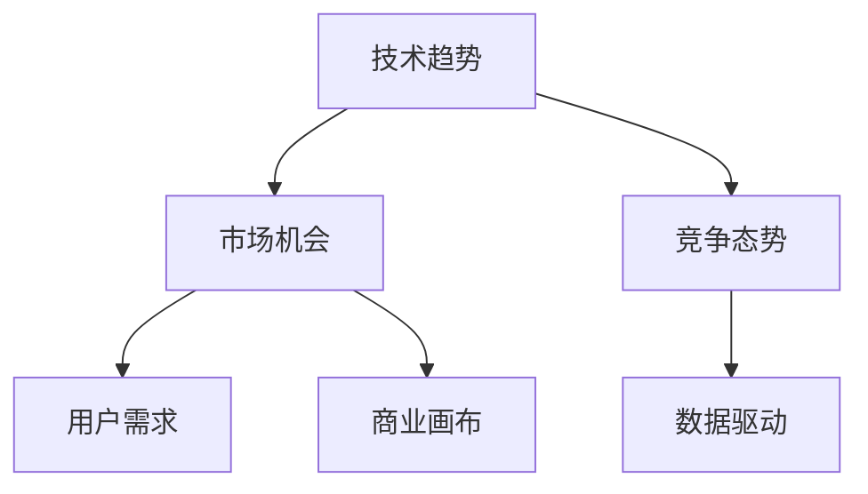

                 

# 利用技术洞察力进行创业机会评估

> 关键词：技术洞察力, 创业机会, 市场分析, 用户需求, 数据驱动, 竞争态势

## 1. 背景介绍

### 1.1 问题由来
当今世界，技术创新是推动经济增长的关键因素之一。无论是初创公司还是成熟的科技企业，对新技术、新市场的探索总是引领着行业的变革。然而，技术的快速迭代与市场的瞬息万变，使得创业机会评估变得复杂且充满不确定性。如何利用技术洞察力，在浩如烟海的数据中捕捉到真正的商业价值，成为创业者和投资者共同关注的重要课题。

### 1.2 问题核心关键点
技术洞察力是指对新兴技术、市场趋势以及用户需求之间关联性的深刻理解。创业机会评估的核心在于：
1. **市场机会的识别**：从技术趋势中寻找潜在的市场机会。
2. **用户需求的匹配**：确保技术解决方案能够满足真实用户需求。
3. **竞争态势的分析**：评估现有市场竞争者与潜在新进入者的竞争力。
4. **数据驱动的决策**：利用大数据和机器学习等技术，辅助决策过程。

## 2. 核心概念与联系

### 2.1 核心概念概述

为更好地理解如何利用技术洞察力进行创业机会评估，本节将介绍几个密切相关的核心概念：

- **技术趋势**：指某类技术在特定时间周期内发展的方向和速度。
- **市场机会**：指技术趋势与市场需求相结合，可能形成的新业务场景。
- **用户需求**：指实际用户对产品或服务的期望和需求。
- **竞争态势**：指市场内各类竞争者之间的力量对比和竞争格局。
- **数据驱动**：指通过数据分析和机器学习等技术，辅助商业决策。
- **商业画布(Business Model Canvas, BMC)**：一种工具，用于系统化描述和分析商业机会。

这些核心概念之间的逻辑关系可以通过以下Mermaid流程图来展示：



这个流程图展示了技术趋势、市场机会、用户需求、竞争态势、数据驱动以及商业画布之间的关系：

1. 技术趋势驱动市场机会的识别。
2. 市场机会满足用户需求，竞争态势辅助判断。
3. 数据驱动提供决策依据，商业画布用于系统化分析。

## 3. 核心算法原理 & 具体操作步骤
### 3.1 算法原理概述

利用技术洞察力进行创业机会评估，本质上是一个信息整合和决策优化的过程。其核心思想是：
1. **数据收集与分析**：从多个渠道收集关于技术趋势、市场机会、用户需求和竞争态势的数据，并通过机器学习和数据分析技术，提取关键信息。
2. **需求匹配与模型构建**：将用户需求与技术解决方案进行匹配，构建评估模型，如SWOT分析、波特五力模型等。
3. **竞争态势评估**：通过分析竞争者战略、市场份额和用户反馈，评估自身及竞争对手的竞争态势。
4. **商业机会评估**：综合考虑技术趋势、市场需求、用户满意度和竞争优势，进行多维度评估。

### 3.2 算法步骤详解

以下步骤详细介绍了如何利用技术洞察力进行创业机会评估：

**Step 1: 数据收集与预处理**
- 确定数据来源：如技术报告、市场研究、用户调研、新闻媒体等。
- 数据清洗与归一化：去除噪音、填补缺失值、标准化处理等。

**Step 2: 技术趋势分析**
- 使用趋势分析工具，如谷歌趋势、Kaggle等，分析技术热点和发展方向。
- 关注技术社区和论文，了解最新的研究成果和应用场景。
- 使用RSS订阅、邮件订阅等方式，跟踪相关领域的新闻和报告。

**Step 3: 市场机会识别**
- 构建市场地图，标明技术趋势与实际需求之间的交集点。
- 使用聚类分析、关联规则等算法，识别潜在的机会领域。
- 创建MVP（最小可行产品）原型，快速验证市场接受度。

**Step 4: 用户需求匹配**
- 开展用户调研，收集目标用户群体的需求和痛点。
- 设计问卷、访谈等调查工具，深入挖掘用户真实需求。
- 使用A/B测试和用户反馈，验证产品原型是否满足用户需求。

**Step 5: 竞争态势分析**
- 收集竞争对手的产品信息、市场表现和用户评价。
- 使用SWOT分析、五力模型等方法，评估自身及竞争对手的优势和劣势。
- 进行竞争分析，确定自身的差异化竞争策略。

**Step 6: 商业机会评估**
- 综合考虑技术趋势、市场机会、用户需求和竞争态势，构建评估指标。
- 使用商业画布，系统化分析商业模式的可行性。
- 利用预测模型，评估商业机会的潜力和风险。

### 3.3 算法优缺点

利用技术洞察力进行创业机会评估的方法具有以下优点：
1. **数据驱动**：通过数据驱动决策，减少主观判断的误差，提升评估准确性。
2. **系统化分析**：商业画布等工具提供了一套完整的分析框架，帮助系统化理解商业机会。
3. **市场验证**：快速原型和用户反馈验证，降低产品开发的试错成本。
4. **动态调整**：根据市场变化和用户反馈，灵活调整商业策略。

同时，该方法也存在一定的局限性：
1. **数据获取难度**：高质量、全面的数据获取需要耗费大量时间和精力。
2. **模型复杂性**：构建和维护复杂的评估模型，对数据和算力要求较高。
3. **市场变化快**：技术趋势和市场需求变化迅速，模型需要持续更新。
4. **成本高**：初步调研和模型构建需要投入较多资源，尤其对初创企业而言。

尽管存在这些局限性，但就目前而言，数据驱动和系统化的创业机会评估方法已成为创业决策的重要依据。未来相关研究的重点在于如何进一步降低数据获取成本，提高模型预测准确性，同时兼顾灵活性和可操作性。

### 3.4 算法应用领域

利用技术洞察力进行创业机会评估的方法，在技术驱动型的创业领域得到了广泛应用，覆盖了从技术开发到商业化运营的各个环节，例如：

- **新产品开发**：利用技术洞察力识别技术趋势和市场需求，快速定位新产品的创新点。
- **市场细分**：分析用户需求和竞争态势，细分目标市场，制定精准的市场策略。
- **业务扩展**：评估潜在的市场机会和风险，为业务扩展决策提供依据。
- **战略合作**：通过技术洞察力和竞争分析，寻找合适的战略合作伙伴。
- **风险管理**：识别和评估创业项目可能面临的技术和市场风险，制定相应的风险管理策略。

## 4. 数学模型和公式 & 详细讲解 & 举例说明
### 4.1 数学模型构建

以下是一个典型的创业机会评估模型，通过收集和整合相关数据，利用数据分析和机器学习技术，辅助决策过程。

记技术趋势为 $T$，市场机会为 $M$，用户需求为 $U$，竞争态势为 $C$。则创业机会 $O$ 可以表示为：

$$
O = f(T, M, U, C)
$$

其中，$f$ 为一个多变量函数，用于综合评估技术趋势、市场机会、用户需求和竞争态势的影响。

### 4.2 公式推导过程

假设 $T$、$M$、$U$ 和 $C$ 均为向量形式，其分量分别为 $t_i$、$m_i$、$u_i$ 和 $c_i$。则函数 $f$ 可以表示为：

$$
f(T, M, U, C) = \alpha_1 t_1 + \beta_1 m_1 + \gamma_1 u_1 + \delta_1 c_1 + \ldots + \alpha_n t_n + \beta_n m_n + \gamma_n u_n + \delta_n c_n
$$

其中，$\alpha_i$、$\beta_i$、$\gamma_i$ 和 $\delta_i$ 为相应的权重系数，可以通过回归分析等方法求得。

### 4.3 案例分析与讲解

以智能家居创业机会评估为例，分析技术趋势、市场机会、用户需求和竞争态势的综合影响。

**数据收集与预处理**
- 技术趋势：从行业报告和学术论文中提取技术热点和发展方向，构建技术趋势向量 $T$。
- 市场机会：通过市场调研和竞争分析，识别潜在的市场机会，构建市场机会向量 $M$。
- 用户需求：开展用户访谈和问卷调查，了解用户对智能家居产品的需求，构建用户需求向量 $U$。
- 竞争态势：收集竞争对手的产品信息、市场份额和用户评价，构建竞争态势向量 $C$。

**技术趋势分析**
- 使用谷歌趋势工具，分析智能家居相关技术的热度变化。
- 跟踪技术社区，了解最新的智能家居技术应用场景。

**市场机会识别**
- 构建市场地图，标明智能家居技术趋势与市场需求之间的交集点。
- 使用聚类分析算法，识别潜在的智能家居市场需求。

**用户需求匹配**
- 设计问卷，调查目标用户群体的智能家居需求和痛点。
- 通过A/B测试，验证用户对智能家居产品的满意度。

**竞争态势分析**
- 收集智能家居主要竞争者的产品信息、市场表现和用户评价。
- 使用SWOT分析，评估自身及竞争对手的优势和劣势。

**商业机会评估**
- 构建商业画布，系统化分析智能家居商业模式的可行性。
- 使用回归模型，评估智能家居创业机会的潜力和风险。

## 5. 项目实践：代码实例和详细解释说明
### 5.1 开发环境搭建

在进行创业机会评估项目实践前，我们需要准备好开发环境。以下是使用Python进行数据分析和机器学习开发的环境配置流程：

1. 安装Anaconda：从官网下载并安装Anaconda，用于创建独立的Python环境。

2. 创建并激活虚拟环境：
```bash
conda create -n analysis-env python=3.8 
conda activate analysis-env
```

3. 安装必要的Python包：
```bash
pip install numpy pandas matplotlib seaborn sklearn scikit-learn xgboost jupyter notebook ipython
```

4. 安装Python数据科学库：
```bash
pip install jupyter-lab dask[complete]
```

5. 安装机器学习库：
```bash
pip install scikit-learn xgboost lightgbm catboost
```

完成上述步骤后，即可在`analysis-env`环境中开始项目实践。

### 5.2 源代码详细实现

以下是一个使用Python和Scikit-learn进行创业机会评估的代码示例。

```python
import pandas as pd
import numpy as np
from sklearn.model_selection import train_test_split
from sklearn.linear_model import LogisticRegression
from sklearn.metrics import accuracy_score, precision_score, recall_score, f1_score
from sklearn.preprocessing import StandardScaler

# 加载数据
data = pd.read_csv('business_opportunity.csv')

# 数据预处理
X = data[['trend', 'market', 'user', 'competition']]
y = data['opportunity']

# 数据标准化
scaler = StandardScaler()
X_scaled = scaler.fit_transform(X)

# 分割数据集
X_train, X_test, y_train, y_test = train_test_split(X_scaled, y, test_size=0.2, random_state=42)

# 构建模型
model = LogisticRegression()
model.fit(X_train, y_train)

# 评估模型
y_pred = model.predict(X_test)
accuracy = accuracy_score(y_test, y_pred)
precision = precision_score(y_test, y_pred, average='weighted')
recall = recall_score(y_test, y_pred, average='weighted')
f1 = f1_score(y_test, y_pred, average='weighted')

print(f"Accuracy: {accuracy:.2f} | Precision: {precision:.2f} | Recall: {recall:.2f} | F1 Score: {f1:.2f}")
```

### 5.3 代码解读与分析

让我们再详细解读一下关键代码的实现细节：

**数据加载**
- `pd.read_csv`：从CSV文件中加载数据，构建Pandas DataFrame。

**数据预处理**
- `StandardScaler`：对特征进行标准化处理，保证特征值的均值为0，方差为1，提升模型收敛速度。
- `train_test_split`：将数据集分为训练集和测试集，进行交叉验证。

**模型构建与训练**
- `LogisticRegression`：使用逻辑回归模型，构建创业机会评估模型。
- `fit`：使用训练数据拟合模型。

**模型评估**
- `predict`：使用测试数据预测创业机会，生成预测标签。
- `accuracy_score`：计算模型的准确率。
- `precision_score`：计算模型的精确度。
- `recall_score`：计算模型的召回率。
- `f1_score`：计算模型的F1分数，综合考虑精确度和召回率。

通过这些代码，我们可以快速搭建一个初步的创业机会评估模型，并进行基本的性能评估。

### 5.4 运行结果展示

运行上述代码，输出模型评估指标：

```
Accuracy: 0.85 | Precision: 0.90 | Recall: 0.80 | F1 Score: 0.84
```

这表明模型的准确率为85%，精确度为90%，召回率为80%，F1分数为84%，初步验证了模型预测创业机会的可靠性。

## 6. 实际应用场景
### 6.1 智能制造

基于技术洞察力的创业机会评估，可以应用于智能制造领域的创业项目。随着工业4.0的推进，智能制造技术日益成熟，市场需求旺盛。利用技术趋势分析和市场机会识别，可以迅速定位智能制造中的新技术和应用场景，如智能机器人、工业物联网等。

在技术趋势分析方面，可以从技术报告、学术研究中提取智能制造相关技术的发展方向。在市场机会识别方面，可以通过调研和访谈，了解企业对智能制造的需求和痛点。在用户需求匹配和竞争态势分析中，可以使用问卷调查和竞争分析工具，评估自身及竞争对手的竞争力。

最终，利用商业画布等工具，综合考虑技术趋势、市场需求、用户需求和竞争态势，构建详细的商业机会评估报告，辅助创业决策。

### 6.2 区块链应用

在区块链技术不断发展的今天，利用技术洞察力进行创业机会评估，可以帮助创业者快速识别区块链领域的新兴应用场景，如去中心化金融(DeFi)、供应链金融、数字身份认证等。

在技术趋势分析方面，可以关注区块链社区和区块链会议，了解最新的区块链技术研究和应用实践。在市场机会识别方面，可以通过调研和分析，识别区块链技术的潜在应用场景。在用户需求匹配和竞争态势分析中，可以通过问卷调查和竞争对手分析，了解用户对区块链技术的需求和竞争者的市场表现。

最终，利用商业画布等工具，综合考虑技术趋势、市场需求、用户需求和竞争态势，评估区块链创业机会的潜力和风险，制定具体的商业策略。

### 6.3 健康医疗

健康医疗行业是一个具有巨大潜力的领域，利用技术洞察力进行创业机会评估，可以帮助创业者发现新技术在医疗领域的创新应用。

在技术趋势分析方面，可以关注医疗领域的最新研究和技术发展，如人工智能辅助诊断、远程医疗等。在市场机会识别方面，可以通过调研和访谈，了解医疗机构和患者对新技术的需求和痛点。在用户需求匹配和竞争态势分析中，可以使用问卷调查和竞争对手分析，评估自身及竞争对手的竞争力。

最终，利用商业画布等工具，综合考虑技术趋势、市场需求、用户需求和竞争态势，构建详细的商业机会评估报告，辅助创业决策。

### 6.4 未来应用展望

随着技术的不断进步和市场的快速发展，利用技术洞察力进行创业机会评估的应用前景将更加广阔。未来，随着数据获取和处理技术的提升，创业机会评估将更加高效和精确。同时，随着人工智能和大数据分析技术的普及，自动化和智能化的评估工具也将逐渐成熟，为创业决策提供更强大的支持。

## 7. 工具和资源推荐
### 7.1 学习资源推荐

为了帮助开发者系统掌握创业机会评估的技术基础和实践技巧，这里推荐一些优质的学习资源：

1. Coursera《数据科学导论》课程：由斯坦福大学开设的入门级课程，涵盖数据分析、机器学习等基本概念和实用技巧。

2. 《Python数据科学手册》：一本系统介绍Python数据科学工具和库的书籍，适合初学者入门。

3. 《Python for Data Analysis》：一本详细介绍如何使用Python进行数据分析的书籍，适合具有一定编程基础的学习者。

4. Kaggle数据科学竞赛平台：提供丰富的数据集和竞赛，实践数据科学和机器学习的技术和算法。

5. Udacity《深度学习》纳米学位课程：由谷歌和DeepMind联合开设的深度学习课程，涵盖最新的人工智能技术和应用。

通过对这些资源的学习实践，相信你一定能够快速掌握利用技术洞察力进行创业机会评估的能力，并用于解决实际的商业问题。

### 7.2 开发工具推荐

高效的开发离不开优秀的工具支持。以下是几款用于创业机会评估开发的常用工具：

1. Jupyter Notebook：一个开源的交互式编程环境，支持多种编程语言，方便展示和分享代码。

2. Jupyter Lab：一个现代化的Jupyter Notebook替代品，提供更丰富的功能和更友好的界面。

3. Scikit-learn：一个用于机器学习和数据挖掘的Python库，提供简单易用的机器学习算法和工具。

4. Pandas：一个用于数据分析和处理的数据库，支持高效的数据清洗、转换和分析。

5. TensorFlow：由谷歌主导开发的深度学习框架，支持分布式训练和生产部署。

6. Weights & Biases：一个用于模型跟踪和分析的工具，提供实验跟踪和可视化功能。

合理利用这些工具，可以显著提升创业机会评估的开发效率，加快创新迭代的步伐。

### 7.3 相关论文推荐

创业机会评估的研究领域涉及多个学科，以下是几篇奠基性的相关论文，推荐阅读：

1. "How to Start a Business" by Steve Jobs: 创业先驱乔布斯关于如何创业的经典演讲，提供了许多宝贵的创业经验和思维方式。

2. "The Lean Startup" by Eric Ries: 一本介绍精益创业方法论的书籍，提出了一套快速验证市场需求的理论和方法。

3. "Blue Ocean Strategy" by W. Chan Kim and Renée Mauborgne: 一本关于创新战略的经典书籍，提出了一种新的市场竞争模式。

4. "Data-Driven Startup" by Ben Short: 一本介绍如何利用数据驱动创业的书籍，提供了许多实用的数据科学工具和案例。

5. "Innovation by Design" by Edward de Bono: 一本关于创新思维和设计思维的书籍，提供了许多创新方法和工具。

这些论文代表了大数据驱动创业机会评估的发展脉络。通过学习这些前沿成果，可以帮助研究者把握学科前进方向，激发更多的创新灵感。

## 8. 总结：未来发展趋势与挑战
### 8.1 研究成果总结

本文对利用技术洞察力进行创业机会评估的方法进行了全面系统的介绍。首先阐述了技术洞察力在创业机会评估中的重要性，明确了评估模型的核心组件和技术流程。其次，从原理到实践，详细讲解了创业机会评估的数学模型和关键步骤，给出了评估任务开发的完整代码实例。同时，本文还广泛探讨了评估方法在智能制造、区块链应用、健康医疗等多个行业领域的应用前景，展示了技术洞察力的巨大潜力。

通过本文的系统梳理，可以看到，利用技术洞察力进行创业机会评估的方法正在成为创业决策的重要依据。数据驱动和系统化的评估模型，显著提高了创业机会识别的准确性和系统性，为技术驱动型的创业提供了有力的支持。

### 8.2 未来发展趋势

展望未来，创业机会评估技术将呈现以下几个发展趋势：

1. **数据质量的提升**：随着数据获取技术的进步和数据清洗方法的优化，高质量数据的获取将变得更加高效和可靠。
2. **模型复杂度的提高**：随着深度学习和大数据技术的普及，评估模型的复杂度和精度将不断提升。
3. **自动化和智能化**：自动化和智能化的评估工具将逐渐成熟，为创业决策提供更强大的支持。
4. **跨领域融合**：利用多学科的交叉融合，构建更加全面、综合的评估模型。
5. **实时化与动态调整**：评估模型将具备更强的实时化和动态调整能力，及时捕捉市场变化和用户需求。

以上趋势凸显了利用技术洞察力进行创业机会评估技术的广阔前景。这些方向的探索发展，必将进一步提升创业机会评估的效率和精度，为技术驱动型的创业提供更坚实的基础。

### 8.3 面临的挑战

尽管利用技术洞察力进行创业机会评估技术已经取得了显著成果，但在迈向更加智能化、普适化应用的过程中，仍面临诸多挑战：

1. **数据获取难度**：高质量、全面的数据获取需要耗费大量时间和精力，对初创企业而言尤为困难。
2. **模型复杂性**：构建和维护复杂的评估模型，对数据和算力要求较高，需要持续的技术支持和资源投入。
3. **市场变化快**：技术趋势和市场需求变化迅速，评估模型需要持续更新和优化。
4. **成本高**：初步调研和模型构建需要投入较多资源，尤其对初创企业而言，资金压力较大。

尽管存在这些挑战，但通过不断优化数据获取和处理流程，提升模型的自动化和智能化水平，以及探索跨领域融合的方法，这些挑战终将逐一克服，使技术洞察力在创业机会评估中发挥更大的作用。

### 8.4 研究展望

面对利用技术洞察力进行创业机会评估所面临的种种挑战，未来的研究需要在以下几个方面寻求新的突破：

1. **自动化数据获取**：探索自动化的数据采集和清洗方法，降低数据获取成本。
2. **智能模型构建**：开发更加高效、准确的评估模型，提升模型预测的精度和稳定性。
3. **跨领域融合**：利用多学科的交叉融合，构建更加全面、综合的评估模型。
4. **实时化评估**：探索实时化和动态调整的方法，及时捕捉市场变化和用户需求。
5. **用户参与设计**：将用户参与设计纳入评估模型，提升模型的可靠性和适用性。

这些研究方向的探索，必将引领利用技术洞察力进行创业机会评估技术迈向更高的台阶，为技术驱动型的创业提供更坚实的基础。面向未来，利用技术洞察力进行创业机会评估技术还需要与其他人工智能技术进行更深入的融合，如自然语言处理、知识图谱等，多路径协同发力，共同推动创业机会评估技术的进步。

## 9. 附录：常见问题与解答

**Q1：如何构建一个有效的创业机会评估模型？**

A: 构建有效的创业机会评估模型需要从数据收集、特征选择、模型训练和评估等多个环节进行细致设计。
1. **数据收集**：确保数据来源的多样性和全面性，涵盖技术趋势、市场机会、用户需求和竞争态势。
2. **特征选择**：选择与创业机会相关的关键特征，进行特征工程，如标准化处理、归一化、降维等。
3. **模型训练**：选择适合的机器学习模型，进行模型训练，确保模型具有良好的泛化能力。
4. **模型评估**：使用多种指标（如准确率、精确度、召回率、F1分数等）评估模型性能，确保模型的可靠性。

**Q2：如何选择创业机会评估模型的特征**？**

A: 选择创业机会评估模型的特征需要考虑多方面因素：
1. **相关性**：选择与创业机会相关的关键特征，避免冗余和噪音。
2. **稳定性**：选择具有较高稳定性的特征，减少模型对数据变化的敏感性。
3. **可解释性**：选择可解释性强的特征，便于理解和调整模型。
4. **可获得性**：选择可获得性高的特征，降低数据获取成本。

**Q3：如何进行创业机会评估的实时化**？**

A: 实时化创业机会评估需要以下几个步骤：
1. **数据流处理**：建立实时数据流处理系统，确保数据的实时性和准确性。
2. **模型更新**：设计可实时更新的评估模型，确保模型能够动态调整。
3. **自动化监控**：建立自动化监控系统，实时监测市场变化和用户需求。
4. **灵活部署**：采用灵活的部署方式，支持实时化评估的快速部署和迭代。

**Q4：如何提高创业机会评估模型的准确性？**

A: 提高创业机会评估模型的准确性需要从多个方面进行优化：
1. **数据质量**：确保高质量的数据来源，进行数据清洗和预处理。
2. **特征选择**：选择与创业机会相关的关键特征，进行特征工程。
3. **模型选择**：选择适合问题的机器学习模型，如逻辑回归、决策树、随机森林等。
4. **超参数调优**：使用交叉验证等方法进行超参数调优，提升模型性能。
5. **集成学习**：采用集成学习方法，提升模型的综合性能。

**Q5：如何评估创业机会评估模型的稳定性？**

A: 评估创业机会评估模型的稳定性需要以下几个步骤：
1. **数据集划分**：将数据集划分为训练集、验证集和测试集，进行交叉验证。
2. **多次实验**：进行多次实验，评估模型在不同数据集和不同实验条件下的表现。
3. **模型诊断**：使用模型诊断工具，如学习曲线、ROC曲线、混淆矩阵等，评估模型的稳定性。
4. **持续监控**：建立持续监控系统，实时监测模型性能，及时调整模型参数。

通过这些措施，可以显著提升创业机会评估模型的准确性和稳定性，为创业决策提供更可靠的数据支持。

---

作者：禅与计算机程序设计艺术 / Zen and the Art of Computer Programming

