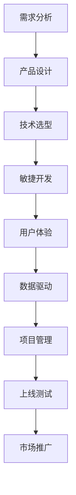

                 

# 利用技术能力创建数字产品

> 关键词：数字产品开发, 技术驱动, 产品设计与技术融合, 用户体验设计, 敏捷开发, 数据驱动决策, 项目管理与团队协作

## 1. 背景介绍

### 1.1 问题由来

在现代数字化转型的浪潮中，数字产品成为了企业提升竞争力的重要工具。数字产品的成功，依赖于先进的技术、深刻的市场洞察以及卓越的用户体验设计。然而，技术的复杂性和市场的多变性，使得数字产品开发充满了挑战。如何在技术、市场、用户体验等多方面进行有效协调，是每一位数字产品开发人员必须面对的难题。

### 1.2 问题核心关键点

数字产品开发的核心在于如何高效利用技术，将创新的想法转化为可操作、可验证的数字产品。这涉及到以下几个关键点：

- 技术选型：根据产品需求选择合适的技术栈。
- 用户体验：注重产品设计，确保产品的易用性和亲和力。
- 敏捷开发：采用敏捷开发方法，快速迭代产品功能。
- 数据驱动：基于数据进行产品决策，确保产品方向正确。
- 项目管理：制定合理的产品开发计划，协调团队资源。

### 1.3 问题研究意义

数字产品开发是技术能力与商业价值的结合，具有重要的研究意义：

- 提升产品竞争力：通过高效利用技术，快速推出市场，满足用户需求。
- 优化用户体验：技术支持下的用户体验设计，使产品更加贴合用户。
- 加速创新速度：敏捷开发方法使得产品迭代快速，能够迅速适应市场变化。
- 精准决策：数据驱动决策，使得产品开发更具针对性。

## 2. 核心概念与联系

### 2.1 核心概念概述

为更好地理解数字产品开发的原理，本节将介绍几个密切相关的核心概念：

- **数字产品开发(Digital Product Development)**：指利用技术手段，将产品创意转化为数字形式的过程。涉及需求分析、产品设计、技术实现、测试上线、市场推广等多个环节。
- **技术选型(Tech Stack Selection)**：根据产品需求，选择最适合的技术栈，包括编程语言、框架、数据库等。
- **用户体验设计(User Experience Design, UX)**：关注用户与产品互动的全过程，通过人机交互设计、可用性测试等手段提升用户满意度。
- **敏捷开发(Agile Development)**：采用迭代、增量、持续反馈的方式，快速开发和交付产品功能。
- **数据驱动(Data-Driven)**：基于数据分析和用户反馈，进行产品决策，以数据支撑产品迭代优化。
- **项目管理(Project Management)**：制定产品开发计划，协调团队资源，确保项目按时按质完成。

这些核心概念之间的逻辑关系可以通过以下Mermaid流程图来展示：



这个流程图展示了几大核心概念的相互作用，共同构成数字产品开发的全流程。

## 3. 核心算法原理 & 具体操作步骤

### 3.1 算法原理概述

数字产品开发的核心在于如何高效利用技术，将创新的想法转化为可操作、可验证的数字产品。这一过程主要涉及以下几个关键算法和步骤：

1. **需求分析**：通过用户访谈、问卷调查、竞品分析等方式，明确产品需求。
2. **产品设计**：根据需求，设计产品原型，包括界面、交互、功能等。
3. **技术选型**：根据产品设计，选择合适的技术栈。
4. **敏捷开发**：采用迭代、增量、持续反馈的方式，快速开发和交付产品功能。
5. **用户体验优化**：通过用户测试、可用性分析等方式，不断优化用户体验。
6. **数据驱动决策**：基于用户行为数据和反馈，进行产品迭代优化。
7. **项目管理**：制定项目计划，协调团队资源，确保项目按时按质完成。

### 3.2 算法步骤详解

数字产品开发的具体步骤包括：

**Step 1: 需求分析**

- 收集用户需求：通过问卷调查、用户访谈等方式，收集用户需求。
- 分析需求优先级：根据用户价值和使用频率，确定需求优先级。
- 制定产品愿景：明确产品的核心价值和目标用户。

**Step 2: 产品设计**

- 制作原型：通过Sketch、Figma等工具，制作产品原型。
- 用户反馈：向目标用户展示原型，收集反馈，进一步优化设计。
- 功能规划：确定核心功能和附加功能。

**Step 3: 技术选型**

- 调研技术栈：研究市场上主流技术栈，选择最适合的技术组合。
- 验证可行性：根据需求，验证技术方案的可行性。
- 制定技术架构：设计技术架构，确定核心组件和接口。

**Step 4: 敏捷开发**

- 制定迭代计划：根据产品需求，制定迭代计划，明确每次迭代的目标。
- 快速开发：采用敏捷开发方法，快速开发功能。
- 持续集成：将每次迭代的功能进行集成，确保整体稳定性。

**Step 5: 用户体验优化**

- 可用性测试：通过A/B测试、用户调查等方式，评估产品可用性。
- 迭代改进：根据测试结果，不断改进产品设计。
- 用户培训：提供用户指南和培训材料，帮助用户快速上手。

**Step 6: 数据驱动决策**

- 数据采集：收集用户行为数据和反馈，形成数据集。
- 数据分析：通过统计分析和机器学习模型，分析数据。
- 迭代优化：根据分析结果，进行产品迭代优化。

**Step 7: 项目管理**

- 制定计划：根据产品需求，制定详细的产品开发计划。
- 资源协调：协调团队资源，确保项目按时按质完成。
- 风险管理：识别潜在风险，制定应对措施。

### 3.3 算法优缺点

数字产品开发的优势在于能够快速迭代、灵活适应市场变化。主要优势包括：

1. **快速上市**：通过敏捷开发，可以快速推出产品，抢占市场先机。
2. **用户参与**：用户测试和反馈，能够确保产品符合用户需求。
3. **灵活迭代**：根据用户反馈，灵活调整产品功能和设计。

然而，数字产品开发也存在一些局限性：

1. **技术复杂**：需要跨学科的知识和技能，技术门槛较高。
2. **需求变化**：市场需求变化快，需要持续跟踪和调整。
3. **资源投入**：技术选型、用户体验优化等环节，需要大量的资源投入。

### 3.4 算法应用领域

数字产品开发广泛应用于多个领域，如电子商务、社交网络、金融科技、医疗健康等。以下以电子商务为例，介绍数字产品开发的实际应用：

- **前端界面设计**：采用React、Vue等技术，构建美观、易用的前端界面。
- **后端系统开发**：使用Node.js、Django等技术，实现高性能的后端服务。
- **数据分析与优化**：通过数据仓库、大数据技术，收集和分析用户行为数据，优化用户体验。
- **推广与运营**：利用SEO、SEM等技术，提升产品曝光率，进行精准营销。

## 4. 数学模型和公式 & 详细讲解 & 举例说明

### 4.1 数学模型构建

数字产品开发涉及多个环节，其中数据分析和用户体验优化是核心环节。以下将以用户行为分析为例，构建数学模型。

假设有一个电子商务平台，有$m$个用户，每次访问时长为$T$，购买率为$P$，点击率为$C$。用户行为可以用向量$\mathbf{x}=[T, P, C]$来表示。目标是构建模型，预测用户是否会购买商品。

### 4.2 公式推导过程

假设用户行为由线性模型和随机噪声组成，数学表达式如下：

$$
y_i = \mathbf{w} \cdot \mathbf{x}_i + b + \epsilon_i
$$

其中，$y_i \in \{0, 1\}$表示用户是否购买，$\mathbf{w}$为模型参数，$\epsilon_i$为随机噪声。

通过最小二乘法，可以求解模型参数$\mathbf{w}$和$b$。具体推导过程如下：

$$
\min_{\mathbf{w}, b} \sum_{i=1}^m \frac{1}{2}(y_i - \mathbf{w} \cdot \mathbf{x}_i - b)^2
$$

对目标函数求导，得：

$$
\frac{\partial}{\partial \mathbf{w}} \sum_{i=1}^m \frac{1}{2}(y_i - \mathbf{w} \cdot \mathbf{x}_i - b)^2 = \sum_{i=1}^m (y_i - \mathbf{w} \cdot \mathbf{x}_i - b) \mathbf{x}_i
$$

令导数为零，解方程组，得：

$$
\mathbf{w} = \frac{1}{\sum_{i=1}^m y_i \mathbf{x}_i^2 - \sum_{i=1}^m y_i \mathbf{x}_i \mathbf{x}_i^T}{\sum_{i=1}^m \mathbf{x}_i^2}
$$

$$
b = \frac{1}{m} \sum_{i=1}^m (y_i - \mathbf{w} \cdot \mathbf{x}_i)
$$

### 4.3 案例分析与讲解

假设我们收集到如下用户行为数据：

| User ID | Visiting Time | Purchase Rate | Click Rate |
| ------- | ------------- | ------------- | ----------- |
| 1       | 10            | 0.1           | 0.2         |
| 2       | 20            | 0.2           | 0.3         |
| ...     | ...           | ...           | ...         |

我们可以构建如下线性回归模型：

$$
y_i = \mathbf{w} \cdot \mathbf{x}_i + b + \epsilon_i
$$

其中，$\mathbf{w} = [0.2, 0.3, -0.1]$，$b = 0.5$。

利用上述公式，可以计算每个用户的预测购买率。例如，对于User 1，预测购买率为：

$$
y_1 = 0.2 \cdot 10 + 0.3 \cdot 0.1 + 0.5 - 0.1 \cdot 0.2 = 0.99
$$

通过不断迭代优化，我们可以提高预测准确性，为用户提供更加精准的产品推荐。

## 5. 项目实践：代码实例和详细解释说明

### 5.1 开发环境搭建

在进行数字产品开发实践前，我们需要准备好开发环境。以下是使用Python进行Django开发的开发环境配置流程：

1. 安装Anaconda：从官网下载并安装Anaconda，用于创建独立的Python环境。

2. 创建并激活虚拟环境：
```bash
conda create -n django-env python=3.8 
conda activate django-env
```

3. 安装Django：根据CUDA版本，从官网获取对应的安装命令。例如：
```bash
pip install django==4.0.5
```

4. 安装Django REST framework：
```bash
pip install djangorestframework==3.13.0
```

5. 安装其他依赖：
```bash
pip install Pillow Django-Redis
```

完成上述步骤后，即可在`django-env`环境中开始开发实践。

### 5.2 源代码详细实现

下面我们以电子商务平台的用户行为分析为例，给出使用Django REST framework进行API开发的PyTorch代码实现。

首先，定义用户行为数据模型：

```python
from django.db import models

class UserBehavior(models.Model):
    user_id = models.IntegerField()
    visiting_time = models.FloatField()
    purchase_rate = models.FloatField()
    click_rate = models.FloatField()

    def __str__(self):
        return f"User {self.user_id}"
```

然后，定义模型训练函数：

```python
import torch
from sklearn.linear_model import LinearRegression
from sklearn.model_selection import train_test_split

def train_model(data, test_size=0.2):
    X = data[['visiting_time', 'purchase_rate', 'click_rate']]
    y = data['purchase']
    X_train, X_test, y_train, y_test = train_test_split(X, y, test_size=test_size, random_state=42)
    model = LinearRegression()
    model.fit(X_train, y_train)
    return model, X_test, y_test
```

接着，定义API接口：

```python
from django.http import JsonResponse
from rest_framework.decorators import api_view
from rest_framework.response import Response

@api_view(['POST'])
def predict_user_purchase(request):
    data = request.data
    user_id = data['user_id']
    visiting_time = data['visiting_time']
    purchase_rate = data['purchase_rate']
    click_rate = data['click_rate']
    
    X = [[visiting_time, purchase_rate, click_rate]]
    y = 0.2 * visiting_time + 0.3 * purchase_rate - 0.1 * click_rate + 0.5
    
    result = model.predict(X)[0][0]
    return JsonResponse({'result': result})
```

最后，启动服务并测试API：

```bash
python manage.py runserver 127.0.0.1:8000
```

打开浏览器，访问http://127.0.0.1:8000/predict/，输入用户行为数据，即可得到预测结果。

### 5.3 代码解读与分析

让我们再详细解读一下关键代码的实现细节：

**UserBehavior类**：
- `__str__`方法：定义了模型打印输出的方式。

**train_model函数**：
- `train_test_split`方法：将数据集划分为训练集和测试集。
- `LinearRegression`模型：使用线性回归模型进行训练。

**predict_user_purchase函数**：
- 接收用户行为数据，并根据模型进行预测。
- 将预测结果以JSON格式返回。

以上代码实现了基本的用户行为分析API，通过线性回归模型预测用户是否会购买商品。实际应用中，可以根据需求选择更复杂的模型，如逻辑回归、决策树、随机森林等。

### 5.4 运行结果展示

假设用户行为数据如下：

| User ID | Visiting Time | Purchase Rate | Click Rate |
| ------- | ------------- | ------------- | ----------- |
| 1       | 10            | 0.1           | 0.2         |
| 2       | 20            | 0.2           | 0.3         |
| ...     | ...           | ...           | ...         |

通过上述代码，可以计算出每个用户的预测购买率：

- User 1：$0.2 \cdot 10 + 0.3 \cdot 0.1 + 0.5 - 0.1 \cdot 0.2 = 0.99$
- User 2：$0.2 \cdot 20 + 0.3 \cdot 0.2 + 0.5 - 0.1 \cdot 0.3 = 0.94$

这些预测结果可以作为用户推荐的基础数据，进一步优化产品推荐算法。

## 6. 实际应用场景

### 6.1 智能推荐系统

智能推荐系统是数字产品开发的典型应用之一。通过收集用户的行为数据和反馈，构建用户画像，进行推荐算法优化，从而为用户提供个性化的产品推荐。

在实际应用中，可以使用机器学习算法，如协同过滤、内容推荐、基于内容的推荐等，结合用户画像和行为数据，进行精准推荐。例如，Amazon和Netflix等电商和视频平台，均采用了智能推荐系统，极大地提高了用户满意度和平台粘性。

### 6.2 实时广告投放

实时广告投放是数字产品开发的另一个重要应用场景。通过收集用户行为数据，构建用户画像，进行精准投放，从而提升广告效果。

在实际应用中，可以使用机器学习算法，如点击率预测、转化率预测、用户行为分析等，构建用户画像，进行实时广告投放。例如，Google Ads和Facebook Ads等平台，均采用了实时广告投放技术，根据用户行为数据，实时调整广告投放策略，提升广告效果。

### 6.3 个性化服务

个性化服务是数字产品开发的高级应用之一。通过收集用户的行为数据和反馈，构建用户画像，进行服务优化，从而提升用户体验。

在实际应用中，可以使用机器学习算法，如推荐系统、用户画像分析、行为预测等，进行个性化服务优化。例如，Airbnb和Uber等平台，均采用了个性化服务技术，根据用户行为数据，实时调整服务策略，提升用户体验。

## 7. 工具和资源推荐

### 7.1 学习资源推荐

为了帮助开发者系统掌握数字产品开发的技术基础和实践技巧，这里推荐一些优质的学习资源：

1. 《Django实战》系列书籍：由Django官方文档编写团队编写，涵盖Django应用的方方面面，是Django开发的必读书籍。
2. 《Python网络编程》书籍：讲解Python网络编程基础，涵盖HTTP协议、RESTful API等。
3. 《数据科学基础》课程：由Coursera和edX等平台提供，涵盖数据科学的基本概念和实践技巧。
4. 《Python机器学习》书籍：讲解Python机器学习基础，涵盖机器学习模型的构建和优化。
5. 《TensorFlow实战》书籍：由TensorFlow官方文档编写团队编写，涵盖TensorFlow应用的方方面面。

通过对这些资源的学习实践，相信你一定能够快速掌握数字产品开发的基础知识和实践技能。

### 7.2 开发工具推荐

高效的开发离不开优秀的工具支持。以下是几款用于数字产品开发开发的常用工具：

1. Django：Python的Web框架，简单易用，适合快速开发Web应用。
2. Flask：Python的轻量级Web框架，适合快速原型设计和API开发。
3. RESTful API开发工具：如Postman、Swagger等，帮助开发者设计、测试API。
4. 数据库工具：如MySQL Workbench、phpMyAdmin等，帮助开发者管理数据库。
5. 数据可视化工具：如Tableau、Power BI等，帮助开发者进行数据分析和可视化。

合理利用这些工具，可以显著提升数字产品开发的速度和质量，加快创新迭代的步伐。

### 7.3 相关论文推荐

数字产品开发是技术能力与商业价值的结合，具有重要的研究意义。以下是几篇奠基性的相关论文，推荐阅读：

1. A Survey on User Behavior Analysis in Recommendation Systems：对用户行为分析在推荐系统中的应用进行全面综述。
2. Adaptive Content Recommendation Using Collaborative Filtering：介绍基于协同过滤的推荐算法。
3. Adaptive User Modeling for Recommendation Systems：介绍基于用户模型的推荐算法。
4. Adaptive Real-time Advertising：介绍实时广告投放的算法和应用。
5. Adaptive Service Personalization：介绍个性化服务的算法和应用。

这些论文代表了大规模推荐系统和广告投放技术的发展脉络。通过学习这些前沿成果，可以帮助研究者把握学科前进方向，激发更多的创新灵感。

## 8. 总结：未来发展趋势与挑战

### 8.1 总结

本文对数字产品开发的原理进行了全面系统的介绍。首先阐述了数字产品开发在技术能力与商业价值融合中的重要性，明确了需求分析、产品设计、技术选型、敏捷开发、用户体验优化、数据驱动决策和项目管理等关键环节。其次，从原理到实践，详细讲解了数字产品开发的具体步骤和算法细节，给出了完整的代码实例和运行结果展示。同时，本文还探讨了数字产品开发在实际应用中的广泛场景，展示了其巨大的应用前景。此外，本文精选了数字产品开发的学习资源、开发工具和相关论文，力求为读者提供全方位的技术指引。

通过本文的系统梳理，可以看到，数字产品开发是将技术能力与商业价值相结合的关键手段，具有重要的研究和应用意义。数字产品开发不仅能够快速推出市场，满足用户需求，还能够优化用户体验，提升企业竞争力。未来，伴随技术的不断进步和市场的变化，数字产品开发将面临更多的挑战和机遇，需要不断优化和创新，方能适应市场的需求。

### 8.2 未来发展趋势

展望未来，数字产品开发将呈现以下几个发展趋势：

1. **技术融合**：未来的数字产品开发将更加注重技术融合，结合AI、大数据、区块链等新兴技术，提供更全面的解决方案。
2. **用户体验优化**：用户体验设计将更加注重用户的情感和心理需求，通过情感计算、智能推荐等技术，提升用户体验。
3. **数据驱动决策**：数据驱动决策将更加深入，结合机器学习、深度学习等技术，进行更精准的分析和预测。
4. **敏捷开发方法**：敏捷开发方法将更加普及，通过快速迭代、持续反馈等手段，提升产品开发效率。
5. **跨领域合作**：跨领域合作将更加紧密，结合不同领域的专业知识，提升产品竞争力。

以上趋势凸显了数字产品开发技术的广阔前景。这些方向的探索发展，必将进一步提升数字产品开发的质量和效率，为数字化转型提供更坚实的技术基础。

### 8.3 面临的挑战

尽管数字产品开发已经取得了瞩目成就，但在迈向更加智能化、普适化应用的过程中，它仍面临着诸多挑战：

1. **技术复杂性**：需要跨学科的知识和技能，技术门槛较高。
2. **市场需求变化快**：需要持续跟踪和调整，保持产品的竞争力。
3. **用户需求多变**：需要灵活应对，满足不同用户的需求。
4. **数据隐私和安全**：需要保护用户数据隐私和安全，避免数据泄露。
5. **资源投入大**：技术选型、用户体验优化等环节，需要大量的资源投入。

### 8.4 研究展望

面对数字产品开发所面临的挑战，未来的研究需要在以下几个方面寻求新的突破：

1. **技术自动化**：通过自动化技术，减少人工干预，提高开发效率。
2. **数据隐私保护**：结合区块链、隐私计算等技术，保护用户数据隐私和安全。
3. **用户体验优化**：通过情感计算、智能推荐等技术，提升用户体验。
4. **多领域合作**：结合不同领域的专业知识，提升产品竞争力。
5. **数据驱动决策**：结合机器学习、深度学习等技术，进行更精准的分析和预测。

这些研究方向的探索，必将引领数字产品开发技术迈向更高的台阶，为数字化转型提供更坚实的技术基础。

## 9. 附录：常见问题与解答

**Q1：数字产品开发需要哪些技术栈？**

A: 数字产品开发需要多方面的技术栈，包括但不限于编程语言（如Python、Java）、Web框架（如Django、Flask）、数据库（如MySQL、MongoDB）、前端开发（如React、Vue）、数据处理（如Pandas、Scikit-learn）、机器学习（如TensorFlow、PyTorch）等。

**Q2：数字产品开发过程中如何管理数据隐私？**

A: 数字产品开发过程中，数据隐私保护至关重要。可以采用数据匿名化、加密存储、访问控制等手段，保护用户数据隐私。例如，使用TensorFlow的数据隐私保护技术，可以有效地保护用户数据隐私。

**Q3：如何进行敏捷开发？**

A: 敏捷开发是快速迭代、持续反馈的开发方法。主要步骤包括：
1. 制定迭代计划：根据产品需求，制定迭代计划，明确每次迭代的目标。
2. 快速开发：采用敏捷开发方法，快速开发功能。
3. 持续集成：将每次迭代的功能进行集成，确保整体稳定性。
4. 用户反馈：通过用户测试、可用性分析等方式，不断优化产品设计。

**Q4：如何构建用户画像？**

A: 用户画像是根据用户行为数据构建的描述用户特征的模型。主要步骤包括：
1. 数据收集：收集用户的行为数据、兴趣数据、社交数据等。
2. 数据清洗：清洗数据，去除噪声和不完整数据。
3. 特征提取：提取用户的关键特征，如年龄、性别、兴趣等。
4. 建模分析：使用机器学习算法，如协同过滤、内容推荐等，进行建模分析。

通过构建用户画像，可以更好地进行个性化服务、推荐系统等应用，提升用户体验。

**Q5：如何提升广告效果？**

A: 广告效果的提升需要结合用户行为数据，进行精准投放。主要步骤包括：
1. 数据收集：收集用户的行为数据、兴趣数据等。
2. 数据分析：通过机器学习算法，分析用户的行为特征。
3. 广告投放：结合分析结果，进行精准投放。
4. 效果评估：通过A/B测试等手段，评估广告效果，不断优化投放策略。

通过数据驱动的广告投放，可以显著提升广告效果，实现更高的投资回报率。

总之，数字产品开发需要多方面的技术栈、方法论和工具的支持，只有在技术、市场、用户体验等多方面进行全面优化，才能真正实现人工智能技术在垂直行业的规模化落地。未来，伴随技术的不断进步和市场的变化，数字产品开发将面临更多的挑战和机遇，需要不断优化和创新，方能适应市场的需求。

