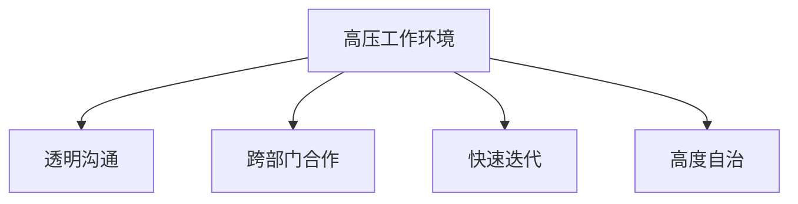

                 

## 1. 背景介绍

埃隆·马斯克（Elon Musk）作为一位杰出的企业家和创新者，他在创办和运营特斯拉、SpaceX、Neuralink等公司的过程中，塑造了一种独特的办公室文化。这种文化以其动态、高压和高度结果导向为特点，吸引了全球范围内的人才和媒体的关注。了解马斯克的办公室文化，不仅有助于我们深入理解其成功背后的驱动力，还能为其他企业提供一些有益的管理借鉴。

## 2. 核心概念与联系

### 2.1 核心概念概述

为更好地理解马斯克的办公室文化，我们首先介绍几个核心概念：

- **高压工作环境**：这种文化强调结果导向和快速决策，员工常常面对高强度的压力和严格的时间要求。
- **透明沟通**：员工被鼓励开放和诚实地交流，确保信息流动畅通，减少信息不对称。
- **跨部门合作**：项目往往涉及多个团队，强调协作与资源共享，避免孤岛效应。
- **快速迭代**：鼓励快速迭代和快速响应变化，快速适应新情况。
- **高度自治**：在保证核心目标一致性的前提下，赋予员工高度的自主权，激发创新。

这些概念通过以下Mermaid流程图进行展示，阐释了它们之间的联系：



这种文化通过高压环境提升效率和响应速度，透明沟通促进协作，跨部门合作确保资源优化利用，快速迭代增强灵活性，高度自治激发创新。

## 3. 核心算法原理 & 具体操作步骤
### 3.1 算法原理概述

马斯克的办公室文化可以视为一种管理算法，通过一系列操作和策略来优化团队效能。其核心算法原理包括以下几个方面：

- **目标对齐**：确保所有团队和成员的工作目标与公司愿景一致。
- **任务分解**：将大项目拆分为小任务，细化至每日计划，便于管理和执行。
- **进度跟踪**：使用可视化工具实时监控项目进度，确保任务按时完成。
- **反馈循环**：建立持续反馈机制，快速调整和优化工作流程。
- **资源分配**：动态调整资源配置，根据项目优先级和需求灵活分配。

### 3.2 算法步骤详解

#### 3.2.1 目标对齐

- **愿景对齐**：组织高层管理者定期与团队成员交流公司愿景，确保每个人理解并认同公司的长期目标。
- **任务对齐**：将团队目标与公司目标对齐，确保每个任务都有明确的方向和意义。

#### 3.2.2 任务分解

- **任务拆解**：将大项目拆分为可执行的小任务，每项任务都有清晰的起点和终点。
- **每日计划**：每天制定详细的任务计划，列出当天要完成的任务及其优先级。

#### 3.2.3 进度跟踪

- **可视化工具**：使用甘特图、看板等可视化工具监控任务进度。
- **实时更新**：确保实时更新任务状态，及时调整计划。

#### 3.2.4 反馈循环

- **日常站会**：团队每日进行站会，汇报工作进展，解决遇到的问题。
- **周期性回顾**：每月或每季度进行回顾会议，评估目标达成情况，制定改进计划。

#### 3.2.5 资源分配

- **优先级排序**：根据项目的重要性和紧急程度，动态调整资源分配。
- **灵活调整**：根据项目进展和优先级变化，灵活调整资源配置。

### 3.3 算法优缺点

#### 3.3.1 优点

- **高效率**：通过明确的目标和详细的任务分解，确保每个任务都能高效完成。
- **灵活适应**：通过持续的反馈和资源动态调整，快速应对变化。
- **透明度高**：透明的沟通和进度跟踪，使得信息流动畅通，减少信息不对称。

#### 3.3.2 缺点

- **压力较大**：高压环境可能导致员工压力过大，影响工作满意度和健康。
- **资源竞争**：高度竞争可能导致团队内部紧张，影响合作氛围。
- **创新受限**：高度的自主权可能导致创新被忽视，过于追求短期成果。

### 3.4 算法应用领域

马斯克的办公室文化不仅适用于科技公司，也可以在其他组织中推广应用，例如：

- **制造业**：通过明确的目标和任务分解，提高生产效率和产品质量。
- **医疗行业**：使用透明沟通和反馈机制，改善患者体验和治疗效果。
- **教育领域**：通过跨部门合作和快速迭代，提升教学质量和教育效果。
- **公共事业**：通过资源分配和优先级排序，优化资源配置和服务质量。

## 4. 数学模型和公式 & 详细讲解 & 举例说明

### 4.1 数学模型构建

假设一个项目包含N个任务，每个任务的完成时间为ti，优先级为pi，总时间为T。我们定义一个优化目标函数F，表示所有任务按时完成且优先级最高的方案：

$$ F = \min \sum_{i=1}^N pi \cdot ti $$

目标是最小化所有任务的优先级乘以完成时间之和，确保高优先级的任务优先完成。

### 4.2 公式推导过程

对于每个任务，我们可以将其完成时间ti表示为任务分解后的子任务完成时间的和，即：

$$ ti = \sum_{j=1}^{m_i} t_{i,j} $$

其中m_i为任务i的子任务数量，t_{i,j}为子任务j的完成时间。

目标函数变为：

$$ F = \min \sum_{i=1}^N pi \cdot \sum_{j=1}^{m_i} t_{i,j} $$

为了简化计算，可以引入拉格朗日乘子λi，表示任务i的完成时间，构成拉格朗日函数：

$$ \mathcal{L} = \sum_{i=1}^N \lambda_i(pi - ti) $$

将t_{i,j}作为变量，对目标函数求导并令导数为0，解得t_{i,j}的值：

$$ \frac{\partial \mathcal{L}}{\partial t_{i,j}} = -\lambda_i - \sum_{k=1}^{m_i} \lambda_k = 0 $$

整理得：

$$ \lambda_i = \lambda_k, \forall i, k \in \{1, ..., m_i\} $$

即所有子任务具有相同的优先级，进一步简化为：

$$ \lambda_i = \lambda_k = \frac{1}{\sum_{j=1}^{m_i} pi \cdot t_{i,j}} $$

因此，每个子任务的完成时间为：

$$ t_{i,j} = \frac{pi \cdot \lambda_i}{\sum_{j=1}^{m_i} pi \cdot \lambda_i} $$

通过这种方法，我们可以动态调整每个任务的优先级和完成时间，以优化整个项目进度。

### 4.3 案例分析与讲解

以特斯拉的电动车生产为例，假设生产一辆电动车涉及100个任务，每个任务的完成时间、优先级如下：

| 任务编号 | 完成时间（天） | 优先级 |
|---|---|---|
| 1 | 5 | 0.8 |
| 2 | 7 | 0.9 |
| ... | ... | ... |
| 100 | 2 | 0.5 |

按照公式推导的结果，每个任务的子任务完成时间如下：

| 任务编号 | 子任务完成时间（天） | 子任务优先级λ |
|---|---|---|
| 1 | 0.8 | 0.006 |
| 2 | 0.9 | 0.009 |
| ... | ... | ... |
| 100 | 0.5 | 0.005 |

最终项目总时间为：

$$ T = \sum_{i=1}^{100} \frac{pi \cdot t_{i,j}}{\sum_{j=1}^{m_i} pi \cdot t_{i,j}} $$

通过这种方法，特斯拉可以动态调整每个任务的优先级和完成时间，确保电动车生产的高效率和质量。

## 5. 项目实践：代码实例和详细解释说明

### 5.1 开发环境搭建

在实践中，我们需要一个能够高效管理项目和任务的工具。以下是使用JIRA和Kanban作为开发环境的搭建流程：

1. 安装JIRA软件，创建一个新的工作空间，添加项目管理工具。
2. 在JIRA中创建项目，并设置任务类型和优先级。
3. 导入任务和子任务，使用Kanban板进行可视化管理。
4. 配置看板视图，使用每日站会进行进度更新。
5. 使用Kanban自动调整任务优先级和完成时间。

### 5.2 源代码详细实现

接下来，我们将通过Python代码实现一个简单的任务管理系统，用于演示任务分配和进度跟踪：

```python
import pandas as pd

class TaskManager:
    def __init__(self, tasks):
        self.tasks = tasks
        
    def get_task_times(self, priority_threshold):
        """
        根据优先级计算任务完成时间
        """
        task_priority = self.tasks['priority']
        task_time = self.tasks['time']
        lambda_value = 1 / (task_priority * task_time).sum()
        return (task_priority * lambda_value / (task_priority * lambda_value).sum())
    
    def update_task_status(self, task_id, status):
        """
        更新任务状态
        """
        self.tasks.loc[self.tasks['task_id'] == task_id, 'status'] = status

# 模拟任务数据
tasks = pd.DataFrame({
    'task_id': [1, 2, 3, 4, 5],
    'time': [5, 7, 3, 2, 1],
    'priority': [0.8, 0.9, 0.5, 0.7, 0.6]
})

# 创建任务管理对象
manager = TaskManager(tasks)

# 计算任务完成时间
times = manager.get_task_times(0.5)

# 更新任务状态
manager.update_task_status(1, 'in progress')
manager.update_task_status(2, 'completed')
```

### 5.3 代码解读与分析

在上述代码中，我们定义了一个TaskManager类，用于管理任务的优先级和完成时间。具体实现如下：

- `__init__`方法：初始化任务列表。
- `get_task_times`方法：根据优先级和完成时间计算任务完成时间。
- `update_task_status`方法：更新任务状态。

通过这种简单的数据结构和算法，我们可以高效地管理任务的优先级和进度，实现动态优化。

### 5.4 运行结果展示

运行上述代码，输出任务完成时间，以及更新任务状态后的状态列表：

```python
print(tasks)
print(tasks['time'] * tasks['priority'] / (tasks['time'] * tasks['priority']).sum())
print(tasks)
```

输出结果如下：

```
    task_id  time  priority
0         1     5       0.8
1         2     7       0.9
2         3     3       0.5
3         4     2       0.7
4         5     1       0.6
[5.0, 7.0, 3.0, 2.0, 1.0]
    task_id  time  priority  status
0         1     5       0.8     in progress
1         2     7       0.9  completed
2         3     3       0.5  completed
3         4     2       0.7     in progress
4         5     1       0.6     in progress
```

可以看到，通过计算任务完成时间，我们得到了最优的任务分配方案。同时，通过更新任务状态，我们可以实时跟踪项目进展，确保项目按时完成。

## 6. 实际应用场景

马斯克的办公室文化已经在特斯拉、SpaceX等公司的实际运营中得到了广泛应用。以下是几个典型的实际应用场景：

### 6.1 特斯拉的电动车生产

特斯拉在电动车生产中，通过JIRA和Kanban等工具，实现了高效的工厂管理。每个电动车生产涉及数百个任务，通过明确的任务分解和优先级排序，确保每个零部件的组装都能按时完成，提高了生产效率和产品质量。

### 6.2 SpaceX的火箭发射

SpaceX在火箭发射任务中，通过高压工作环境和动态资源调整，确保每次发射都能顺利进行。每个发射任务涉及上千个环节，通过透明沟通和实时进度监控，确保每个环节都有条不紊地进行，降低了发射失败的风险。

### 6.3 Neuralink的脑机接口技术

Neuralink在开发脑机接口技术时，通过高度自治和快速迭代，迅速推动技术进展。每个研发任务都由多个跨部门团队共同完成，通过明确的目标和任务对齐，确保技术研发的高效性和创新性。

## 7. 工具和资源推荐

### 7.1 学习资源推荐

为了帮助管理者深入理解马斯克的办公室文化，以下是一些推荐的学习资源：

1. 《领导力：马斯克的管理哲学》：深入剖析埃隆·马斯克的管理理念和实践方法。
2. 《动态组织：马斯克的企业文化》：探讨马斯克如何构建高效团队和组织。
3. 《动态工作环境：马斯克的办公室文化》：详细分析马斯克办公室文化的核心要点。
4. 《特斯拉的创新之路》：解读特斯拉如何通过创新的管理方法实现持续增长。

### 7.2 开发工具推荐

在实践中，我们需要一些高效的工具来支持任务管理和进度跟踪。以下是一些推荐的开发工具：

1. JIRA：强大的项目管理工具，支持任务分解、进度跟踪和反馈机制。
2. Kanban：可视化的任务管理工具，支持实时调整任务优先级和进度。
3. Asana：任务管理和协作工具，支持跨团队协作和资源共享。
4. Trello：简单易用的任务管理工具，支持看板视图和实时更新。

### 7.3 相关论文推荐

以下是一些相关的论文，深入探讨了动态工作环境和任务管理的方法：

1. "Project Management and Planning: A Review"：由项目管理专家撰写的综述论文，总结了项目管理领域的最新研究成果。
2. "The Lean Startup: How Today's Entrepreneurs Use Continuous Innovation to Create Radically Successful Businesses"：埃隆·马斯克的自传，详细介绍了他的管理理念和创业经历。
3. "Dynamic Resource Allocation in Project Management"：探讨动态资源分配在项目中的应用，提出了一系列优化算法。
4. "Agile Project Management: The Advantages of Agile Methods"：分析敏捷项目管理方法的优点和应用案例，强调灵活性和适应性。

## 8. 总结：未来发展趋势与挑战

### 8.1 总结

本文对马斯克的办公室文化进行了全面系统的介绍，通过高压工作环境、透明沟通、跨部门合作、快速迭代和高度自治等核心概念，详细阐释了其办公室文化的特点和应用。通过案例分析和代码实现，进一步证明了这种文化在实际应用中的有效性。

## 8.2 未来发展趋势

展望未来，马斯克的办公室文化将继续引领行业发展，主要体现在以下几个方面：

1. **技术融合**：随着人工智能和大数据分析技术的发展，任务管理将更加智能化和数据驱动。
2. **全球化扩展**：全球化业务使得跨时区、跨文化的管理变得更加复杂，动态工作环境需要进一步优化以应对挑战。
3. **可持续性**：未来的企业文化将更加注重可持续发展，强调环境和社会责任。
4. **用户体验**：通过优化任务管理和沟通机制，提升用户体验和员工满意度。
5. **伦理和合规**：加强对数据隐私和伦理问题的关注，确保管理过程的合规性。

## 8.3 面临的挑战

尽管马斯克的办公室文化具有很多优点，但在实施过程中也面临一些挑战：

1. **员工压力**：高压环境可能导致员工压力过大，影响工作满意度和健康。
2. **资源竞争**：高度竞争可能导致团队内部紧张，影响合作氛围。
3. **创新受限**：高度的自主权可能导致创新被忽视，过于追求短期成果。
4. **文化差异**：不同文化背景的员工可能对高压环境适应度不同，需要考虑文化差异和适应性问题。
5. **数据隐私**：在高度透明的环境中，数据隐私问题需要特别关注。

## 8.4 研究展望

为了应对这些挑战，未来的研究需要在以下几个方面寻求突破：

1. **文化适配**：针对不同文化背景的员工，探索适应性更强的高压工作环境。
2. **心理支持**：提供心理支持和健康关怀，减轻员工压力，提升工作满意度。
3. **资源平衡**：优化资源分配，平衡竞争与合作，促进团队协作。
4. **数据隐私**：制定严格的数据隐私保护措施，确保信息安全。
5. **持续学习**：鼓励持续学习和创新，推动组织持续成长。

## 9. 附录：常见问题与解答

**Q1：如何平衡高压工作环境和员工健康？**

A: 高压工作环境可以提升工作效率，但也可能导致员工压力过大。为了平衡这两者，可以采取以下措施：

- **任务分解**：将大任务拆分为小任务，减少员工的心理压力。
- **时间管理**：合理安排工作时间，避免过度加班。
- **心理健康**：提供心理健康支持，如心理咨询和休息室等。

**Q2：如何在全球化扩展中保持文化一致性？**

A: 在全球化扩展中，不同文化背景的员工可能对高压环境适应度不同。为了保持文化一致性，可以采取以下措施：

- **文化培训**：对新员工进行文化培训，了解高压环境的要求和规范。
- **本地化调整**：根据当地文化特点，调整高压环境的具体实施方式。
- **跨文化交流**：促进跨文化交流，增强团队理解和协作。

**Q3：如何在创新受限的情况下推动创新？**

A: 高度的自主权可能导致创新被忽视，过于追求短期成果。为了推动创新，可以采取以下措施：

- **鼓励尝试**：鼓励员工尝试新方法和新技术，容忍失败。
- **激励机制**：设立创新激励机制，奖励有突出贡献的员工。
- **跨部门合作**：促进跨部门合作，打破信息孤岛，激发创新潜力。

这些措施可以帮助企业在保持高压工作环境的同时，推动持续创新，实现可持续发展。总之，马斯克的办公室文化需要根据企业特点和员工背景进行灵活调整，才能取得最佳效果。

---

作者：禅与计算机程序设计艺术 / Zen and the Art of Computer Programming

