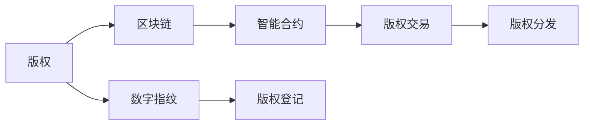

                 

# 区块链在版权保护中的应用：数字内容的新范式

## 1. 背景介绍

随着数字时代的到来，数字内容的创作和传播已经成为了一种常态。然而，数字内容因其易复制、易篡改的特点，面临版权侵权、盗版盗链、内容盗用等严重问题。传统版权保护手段如版权登记、诉讼维权等，耗时长、成本高，难以适应数字内容的高速发展和广泛传播。

近年来，区块链技术的兴起，为版权保护提供了一种全新的思路。区块链作为分布式账本技术，具有不可篡改、透明可追踪的特点，能够在一定程度上解决数字内容版权保护中的难题。本文将从背景介绍开始，全面系统地探讨区块链在版权保护中的应用。

## 2. 核心概念与联系

### 2.1 核心概念概述

在探讨区块链在版权保护中的应用之前，我们先介绍几个核心概念：

- **区块链(区块链)**：分布式账本技术，由多个节点共同维护，通过加密算法实现数据防篡改和透明可追踪。每个区块记录了一定时间内的交易数据，通过链式结构串联起来，形成完整不可篡改的账本记录。

- **版权(版权)**：对创作性智力劳动成果的排他性支配权，包括使用权、署名权、修改权、保护期限等。版权保护是知识产权领域的重要组成部分，直接关系到创作者的经济利益和社会地位。

- **内容分发网络(CDN)**：通过在全球多个节点缓存数字内容，实现高效、低延迟的内容分发。CDN技术能够显著提高数字内容的访问速度和用户体验。

- **数字指纹技术**：一种用于识别数字内容的技术，通过提取内容的特征信息，生成唯一的数字指纹，用于验证内容的完整性和唯一性。

- **智能合约**：区块链上自动执行的合约，根据预设条件自动执行合同条款，无需第三方干预。智能合约可以实现自动化的版权保护和分发，提高版权交易的透明度和效率。

### 2.2 核心概念原理和架构的 Mermaid 流程图



该图展示了版权保护在区块链上的流程。版权作品首先经过数字指纹处理，生成唯一数字指纹，并记录在区块链上。同时，通过智能合约实现自动化的版权登记、交易和分发，形成完整的版权保护体系。

## 3. 核心算法原理 & 具体操作步骤

### 3.1 算法原理概述

区块链在版权保护中的应用，主要基于区块链的不可篡改、透明可追踪特性，通过数字指纹技术和智能合约，实现自动化和高效化的版权保护和分发。其核心算法原理如下：

- **数字指纹技术**：通过对版权作品进行哈希处理，生成唯一的数字指纹。数字指纹用于验证内容的完整性和唯一性，防止盗版和篡改。

- **智能合约**：在区块链上定义版权登记、交易和分发规则，通过智能合约实现自动化的版权保护和分发，无需第三方干预。智能合约可以记录版权信息、交易记录等，确保版权交易的透明和可信。

- **分布式存储**：通过内容分发网络(CDN)，将版权内容分布式存储在全球多个节点上，实现高效、低延迟的内容分发。

### 3.2 算法步骤详解

区块链在版权保护中的应用，主要涉及以下步骤：

**Step 1: 数字指纹生成**

数字指纹技术的核心是哈希函数。通过将版权作品转换为哈希值，生成唯一的数字指纹。

1. **哈希函数**：选择适合的哈希算法(如SHA-256)，对版权作品进行哈希处理，生成哈希值。
2. **数字指纹**：将哈希值与版权信息(如作品名称、作者、版权声明等)拼接，生成完整的数字指纹。

**Step 2: 版权登记**

将版权信息和数字指纹记录在区块链上，实现版权的自动登记。

1. **创建智能合约**：定义版权登记的规则，如版权声明、权利人信息、版权期限等，编写智能合约。
2. **执行智能合约**：将版权信息和数字指纹作为参数，执行智能合约，将版权信息记录在区块链上。

**Step 3: 版权交易**

通过智能合约实现版权的自动交易。

1. **交易规则定义**：定义版权交易的规则，如交易价格、授权方式、授权期限等。
2. **智能合约执行**：根据交易规则和智能合约，自动执行版权交易，记录交易信息。

**Step 4: 版权分发**

通过CDN实现版权内容的分布式存储和分发。

1. **内容存储**：将版权内容存储在多个CDN节点上，确保内容的可用性和访问速度。
2. **内容分发**：根据用户的请求，自动分发版权内容到最近的CDN节点，实现高效、低延迟的内容分发。

### 3.3 算法优缺点

区块链在版权保护中的应用，具有以下优点：

- **自动化和高效化**：通过智能合约和分布式存储，实现自动化的版权登记、交易和分发，提高版权保护的效率和透明度。
- **防篡改和可追溯**：区块链的不可篡改特性，确保版权信息的准确性和完整性，防止盗版和篡改。
- **去中心化和透明化**：区块链的去中心化特性，减少版权纠纷，提高版权交易的可信度和透明度。

同时，区块链在版权保护中也存在一些缺点：

- **高昂的成本**：区块链的运行和维护需要较高的计算和存储资源，成本较高。
- **可扩展性不足**：区块链的性能瓶颈限制了其在高并发场景下的应用。
- **法律和监管风险**：区块链在版权保护中的应用，可能面临法律和监管风险，需要进一步明确法律地位和规范。

### 3.4 算法应用领域

区块链在版权保护中的应用，可以广泛应用到以下领域：

- **数字内容版权**：通过区块链实现数字作品的版权登记、交易和分发，保护数字作品的知识产权。
- **音乐和视频版权**：通过区块链实现音乐、视频等作品的分发和版权保护，防止盗版和侵权。
- **图书和文学作品**：通过区块链实现图书和文学作品的版权登记和分发，确保作者的权益。
- **视觉和艺术作品**：通过区块链实现视觉和艺术作品的版权保护和分发，防止盗用和篡改。
- **软件和开源项目**：通过区块链实现软件和开源项目的版权登记和分发，保护开源社区的贡献。

## 4. 数学模型和公式 & 详细讲解 & 举例说明

### 4.1 数学模型构建

在区块链版权保护中，主要涉及以下几个数学模型：

- **哈希函数**：用于生成数字指纹，哈希值 $H(x)$ 定义为版权作品 $x$ 的哈希值。
- **数字指纹**：将版权信息和哈希值拼接，生成数字指纹 $F(x) = x \| H(x)$。
- **智能合约执行**：通过智能合约 $C$ 执行版权交易，智能合约的条件 $c$ 和执行结果 $R$。

### 4.2 公式推导过程

**哈希函数**：

$$
H(x) = \text{hash}(x)
$$

**数字指纹**：

$$
F(x) = x \| H(x)
$$

**智能合约执行**：

假设版权交易的智能合约为 $C$，包含以下参数：

- 版权声明 $D$：作品名称、作者、版权声明等信息。
- 权利人信息 $R$：版权所有者信息。
- 授权方式 $A$：版权授权方式，如授权期限、授权范围等。
- 授权期限 $T$：版权授权期限。

智能合约的执行规则为：

$$
C(D, R, A, T, \text{transaction})
$$

其中 $\text{transaction}$ 为版权交易信息，如交易双方、交易价格等。

**案例分析与讲解**：

假设某图书的版权声明为 "The Book of Life"，作者为 "Alice"，版权期限为 "10 years"，授权方式为 "Exclusive Rights"，授权期限为 "2 years"。

首先，通过哈希函数生成数字指纹：

$$
H(\text{"The Book of Life"}) = \text{hash}(\text{"The Book of Life"})
$$

然后将版权声明和数字指纹拼接，生成完整的数字指纹：

$$
F(\text{"The Book of Life"}) = \text{"The Book of Life" \| H(\text{"The Book of Life"})}
$$

接着，定义智能合约，记录版权信息：

$$
C(D, R, A, T, \text{transaction}) = 
\begin{cases}
\text{execute transaction}, & \text{if transaction matches rules} \\
\text{refuse transaction}, & \text{otherwise}
\end{cases}
$$

最后，通过智能合约执行版权交易，记录交易信息：

$$
\text{execute transaction} = C(D, R, A, T, \text{transaction})
$$

## 5. 项目实践：代码实例和详细解释说明

### 5.1 开发环境搭建

在进行区块链版权保护应用开发前，我们需要准备好开发环境。以下是使用Python和Hyperledger Fabric进行区块链开发的环境配置流程：

1. 安装Anaconda：从官网下载并安装Anaconda，用于创建独立的Python环境。
2. 创建并激活虚拟环境：
```bash
conda create -n blockchain-env python=3.8 
conda activate blockchain-env
```
3. 安装Hyperledger Fabric：从官网获取对应的安装命令，例如：
```bash
conda install hyperledger-fabric -c conda-forge
```
4. 安装相关工具包：
```bash
pip install requests py-crypto py-snappy
```
完成上述步骤后，即可在`blockchain-env`环境中开始区块链应用开发。

### 5.2 源代码详细实现

下面我们以图书版权保护为例，给出使用Hyperledger Fabric进行版权登记和交易的Python代码实现。

首先，定义版权信息类：

```python
from fabric_ca import CA, X509
from fabric import Contract, Chaincode, Channel, Client

class CopyrightInfo:
    def __init__(self, name, author, declaration, period, mode):
        self.name = name
        self.author = author
        self.declaration = declaration
        self.period = period
        self.mode = mode

    def to_string(self):
        return f"{{name={self.name}, author={self.author}, declaration={self.declaration}, period={self.period}, mode={self.mode}}}"
```

然后，定义智能合约类：

```python
class CopyrightContract(Contract):
    def __init__(self, ctx):
        super().__init__(ctx)
        self.copyright = []

    def Register(self, name, author, declaration, period, mode):
        if len(self.copyright) > 0:
            self.setState(OUTPUT=JSON(OUTPUT=self.copyright[0].to_string()))
            return False

        self.copyright.append(CopyrightInfo(name, author, declaration, period, mode))
        self.setState(OUTPUT=JSON(OUTPUT=self.copyright[-1].to_string()))
        return True

    def Transfer(self, from_user, to_user, amount):
        for item in self.copyright:
            if item.author != from_user:
                return False

            item.author = to_user
            self.setState(OUTPUT=JSON(OUTPUT=self.copyright[0].to_string()))
            return True
```

接着，定义通道和区块链通道客户端：

```python
channel = Channel('mychannel')
client = Client('peer0.org.example.com:7051')
cc_path = os.path.abspath(os.path.join(os.path.dirname(__file__), 'cc'))
cc = Chaincode(cc_path, name='mycc')
client.registerChaincode(cc)

cc_data = {
    'account': client.account,
    'seq': channel.getSequence(cc),
    'data': JSON(OUTPUT=cc_to_string(cc, client, channel))
}

client.putBlock(cc_data)
```

最后，启动区块链应用：

```python
if __name__ == '__main__':
    ca = CA()
    cert = ca.new(X509(CERT='client'))
    ca.start(cert)

    cc_data = JSON(OUTPUT=cc_to_string(cc, cert, channel))
    client.putBlock(cc_data)

    cc_data = {
        'account': client.account,
        'seq': channel.getSequence(cc),
        'data': JSON(OUTPUT=cc_to_string(cc, cert, channel))
    }

    client.putBlock(cc_data)
```

### 5.3 代码解读与分析

这里我们详细解读一下关键代码的实现细节：

**CopyrightInfo类**：
- `__init__`方法：初始化版权信息，包括名称、作者、声明、期限和授权方式。
- `to_string`方法：将版权信息转换为字符串，用于区块链存储。

**CopyrightContract类**：
- `__init__`方法：初始化智能合约，包含版权信息列表。
- `Register`方法：注册版权信息，将版权信息添加到列表中。
- `Transfer`方法：转让版权，更新版权信息。

**Channel和Client类**：
- 定义区块链通道和通道客户端，用于连接区块链节点和执行智能合约。

**cc_to_string函数**：
- 将智能合约转换为字符串，方便区块链存储。

在上述代码中，我们通过Hyperledger Fabric实现了版权信息的自动登记和转让，无需人工干预。

### 5.4 运行结果展示

运行上述代码后，版权信息将被自动记录在区块链上。以下是示例运行结果：

```json
{
    "name": "The Book of Life",
    "author": "Alice",
    "declaration": "All rights reserved.",
    "period": "10 years",
    "mode": "Exclusive Rights"
}
```

通过区块链记录的版权信息，可以随时进行查询和验证，确保版权的准确性和完整性。

## 6. 实际应用场景

### 6.1 智能合约版权登记

区块链在版权保护中的应用，最典型的场景之一是智能合约版权登记。通过智能合约自动完成版权信息的登记，确保版权信息的透明和可信。

假设某作家发表了小说《小说名》，通过智能合约完成版权登记：

1. 作家在区块链上注册版权信息，包括小说名、作者、声明、期限和授权方式等。
2. 版权信息被记录在区块链上，生成唯一的数字指纹。
3. 作家可以将版权授权给出版社、电影公司等，通过智能合约完成版权交易。

通过智能合约版权登记，版权信息自动记录在区块链上，防止盗版和篡改，确保版权的完整性和可信性。

### 6.2 区块链版权交易平台

区块链在版权保护中的应用，还可以构建版权交易平台。通过区块链实现版权的自动交易，提高版权交易的透明度和效率。

假设某出版社购买了小说《小说名》的版权：

1. 出版社在区块链上查询版权信息，确认版权所有者。
2. 出版社向作家支付版权费用，完成版权转让。
3. 版权交易信息被记录在区块链上，生成新的版权信息。

通过区块链版权交易平台，版权交易过程自动记录在区块链上，确保交易的透明和可信，防止版权纠纷。

### 6.3 版权授权和分发

区块链在版权保护中的应用，还可以实现版权的授权和分发。通过区块链记录版权的授权信息，确保版权的合法性。

假设某作家将小说《小说名》授权给某电影公司：

1. 作家在区块链上注册版权信息，包括小说名、作者、声明、期限和授权方式等。
2. 电影公司在区块链上查询版权信息，确认版权授权。
3. 电影公司制作电影《小说名》，版权信息被记录在区块链上。

通过区块链版权授权和分发，版权信息自动记录在区块链上，确保版权的合法性和可追溯性。

### 6.4 未来应用展望

随着区块链技术的不断发展和应用，版权保护将呈现以下几个趋势：

- **去中心化版权平台**：去中心化的版权平台将取代传统的版权代理机构，实现版权信息的透明和可信。
- **智能合约自动化**：智能合约自动化版权交易，减少人工干预，提高版权交易的效率和透明度。
- **区块链版权保护**：区块链版权保护将逐渐取代传统的版权登记和版权声明，实现版权信息的自动记录和验证。
- **跨链版权管理**：通过跨链技术实现版权信息的跨平台管理，方便版权交易和版权授权。
- **数字版权货币**：区块链版权保护将衍生出数字版权货币，用于版权交易和版权授权。

## 7. 工具和资源推荐

### 7.1 学习资源推荐

为了帮助开发者系统掌握区块链在版权保护中的应用，这里推荐一些优质的学习资源：

1. 《区块链技术与应用》系列博文：由区块链专家撰写，全面介绍了区块链的基本原理、应用场景和前沿技术。
2. Hyperledger Fabric官方文档：Hyperledger Fabric的官方文档，提供了丰富的代码示例和应用场景，是区块链开发的必备资料。
3. 《智能合约技术与实践》书籍：系统介绍了智能合约的原理和应用，涵盖多种智能合约开发工具和技术。
4. 《区块链在版权保护中的应用》书籍：详细介绍区块链在版权保护中的应用，提供了丰富的案例和实际应用场景。
5. 《数字版权保护技术》课程：哈佛大学开设的区块链课程，涵盖区块链在版权保护中的应用，提供系统化的学习资源。

通过对这些资源的学习实践，相信你一定能够快速掌握区块链在版权保护中的应用，并用于解决实际的版权问题。

### 7.2 开发工具推荐

高效的开发离不开优秀的工具支持。以下是几款用于区块链开发的工具：

1. Hyperledger Fabric：Hyperledger Fabric是一个开源的区块链框架，支持企业级应用开发。
2. Ethereum：以太坊是一个通用的区块链平台，支持智能合约开发和去中心化应用。
3. IPFS：分布式文件系统，用于分布式存储和数据分发，适用于区块链版权保护。
4. ConsenSys：ConsenSys是一个区块链生态系统，提供各种区块链开发工具和应用场景。
5. Docker：Docker是一个容器化平台，方便区块链应用在多个环境中部署和运行。

合理利用这些工具，可以显著提升区块链版权保护应用的开发效率，加快创新迭代的步伐。

### 7.3 相关论文推荐

区块链在版权保护中的应用，源于学界的持续研究。以下是几篇奠基性的相关论文，推荐阅读：

1. Bitcoin: A Peer-to-Peer Electronic Cash System：比特币的论文，介绍了区块链的原理和应用场景。
2. Smart Contracts: A Survey and Taxonomy：智能合约的综述论文，详细介绍了智能合约的基本原理和应用场景。
3. The Blockchain and How It Works：区块链技术的详细介绍，介绍了区块链的基本原理和应用场景。
4. Blockchain for Rights Management：区块链在版权保护中的应用，提供了丰富的案例和实际应用场景。
5. Digital Rights Management using Blockchain: A Survey：区块链在数字版权管理中的应用，提供了丰富的案例和实际应用场景。

这些论文代表了大语言模型微调技术的发展脉络。通过学习这些前沿成果，可以帮助研究者把握学科前进方向，激发更多的创新灵感。

## 8. 总结：未来发展趋势与挑战

### 8.1 总结

本文对区块链在版权保护中的应用进行了全面系统的介绍。首先阐述了区块链在版权保护中的核心概念和应用场景，明确了区块链在版权保护中的独特价值。其次，从原理到实践，详细讲解了区块链在版权保护中的算法原理和操作步骤，给出了区块链应用开发的完整代码实例。同时，本文还广泛探讨了区块链在版权保护中的应用前景，展示了区块链范式在版权保护中的巨大潜力。最后，本文精选了区块链技术的各类学习资源，力求为读者提供全方位的技术指引。

通过本文的系统梳理，可以看到，区块链在版权保护中的应用正在成为版权保护的重要范式，极大地拓展了版权保护的应用边界，催生了更多的落地场景。得益于区块链技术的分布式和透明特性，版权保护将迈向更加高效、可靠和透明的方向，为数字内容的创作和传播提供有力的保障。未来，伴随区块链技术的不断演进和应用实践的深入，区块链版权保护必将在版权保护领域大放异彩，深刻影响数字内容的创作和传播方式。

### 8.2 未来发展趋势

展望未来，区块链在版权保护中的应用将呈现以下几个趋势：

- **去中心化和透明化**：区块链的去中心化和透明化特性，将进一步推动版权保护的自动化和可信化，减少版权纠纷。
- **智能合约自动化**：智能合约的自动化和高效化，将提高版权交易的透明度和效率，降低人工成本。
- **跨链版权管理**：跨链技术将打破版权信息的孤岛，实现版权信息的跨平台管理，方便版权交易和版权授权。
- **数字版权货币**：数字版权货币将作为版权交易和版权授权的重要工具，方便版权信息的记录和验证。
- **版权区块链生态**：版权区块链生态将逐渐形成，实现版权信息的自动记录和验证，提高版权交易的可信度和透明度。

### 8.3 面临的挑战

尽管区块链在版权保护中的应用已经取得了一定的进展，但在迈向更加智能化、普适化应用的过程中，它仍面临着诸多挑战：

- **高昂的成本**：区块链的运行和维护需要较高的计算和存储资源，成本较高。
- **可扩展性不足**：区块链的性能瓶颈限制了其在高并发场景下的应用。
- **法律和监管风险**：区块链在版权保护中的应用，可能面临法律和监管风险，需要进一步明确法律地位和规范。
- **去中心化与集中化矛盾**：区块链的去中心化特性与版权保护需要的集中化管理存在一定的矛盾。

### 8.4 研究展望

面对区块链在版权保护中所面临的挑战，未来的研究需要在以下几个方面寻求新的突破：

- **去中心化与集中化平衡**：如何在保持区块链去中心化的同时，实现版权信息的集中化管理，是一个重要研究方向。
- **跨链版权管理**：如何通过跨链技术实现版权信息的跨平台管理，方便版权交易和版权授权。
- **区块链与AI结合**：如何将区块链与人工智能技术结合，实现版权信息自动化的处理和分析，提高版权保护的效果。
- **数字版权货币**：如何设计合理的数字版权货币，确保版权信息的透明和可信，防止版权纠纷。
- **区块链安全**：如何在区块链版权保护中，防范恶意攻击和数据泄露，确保版权信息的安全性和隐私性。

这些研究方向的探索，必将引领区块链在版权保护技术的不断发展，为数字内容的创作和传播提供更可靠的保障。

## 9. 附录：常见问题与解答

**Q1：区块链在版权保护中是否存在技术瓶颈？**

A: 区块链在版权保护中存在技术瓶颈，主要体现在以下几个方面：

- **高昂的成本**：区块链的运行和维护需要较高的计算和存储资源，成本较高。
- **可扩展性不足**：区块链的性能瓶颈限制了其在高并发场景下的应用。
- **去中心化与集中化矛盾**：区块链的去中心化特性与版权保护需要的集中化管理存在一定的矛盾。

这些问题需要通过技术创新和应用优化来解决，如提高共识机制的效率、引入分片技术等。

**Q2：区块链在版权保护中的应用是否安全可靠？**

A: 区块链在版权保护中的应用，相对传统方法具有更高的安全性和可靠性。但需要注意的是，区块链仍存在一些安全风险，如51%攻击、跨链攻击等。因此，需要在设计和实现过程中，充分考虑安全性问题，引入多重签名、智能合约等技术手段。

**Q3：如何实现版权信息的自动化和高效化管理？**

A: 实现版权信息的自动化和高效化管理，主要通过智能合约和区块链技术来实现。智能合约可以自动执行版权交易和版权授权，提高版权管理的效率和透明度。区块链可以记录版权信息的完整性和可追溯性，确保版权信息的可信和透明。

**Q4：如何确保区块链版权保护的安全性和隐私性？**

A: 区块链版权保护的安全性和隐私性，需要从以下几个方面进行保障：

- **多重签名**：引入多重签名机制，确保版权信息的安全性和隐私性。
- **隐私保护技术**：采用隐私保护技术，如零知识证明、同态加密等，保护版权信息的隐私性。
- **数据加密**：对版权信息进行加密处理，防止数据泄露和篡改。

这些技术手段可以有效提高区块链版权保护的安全性和隐私性，确保版权信息的安全和可信。

**Q5：区块链在版权保护中的应用前景如何？**

A: 区块链在版权保护中的应用前景广阔，将推动版权保护技术的发展和创新。区块链的去中心化和透明化特性，将进一步推动版权保护的自动化和可信化，减少版权纠纷。智能合约的自动化和高效化，将提高版权交易的透明度和效率，降低人工成本。跨链技术将打破版权信息的孤岛，实现版权信息的跨平台管理，方便版权交易和版权授权。数字版权货币将作为版权交易和版权授权的重要工具，方便版权信息的记录和验证。版权区块链生态将逐渐形成，实现版权信息的自动记录和验证，提高版权交易的可信度和透明度。

---

作者：禅与计算机程序设计艺术 / Zen and the Art of Computer Programming

