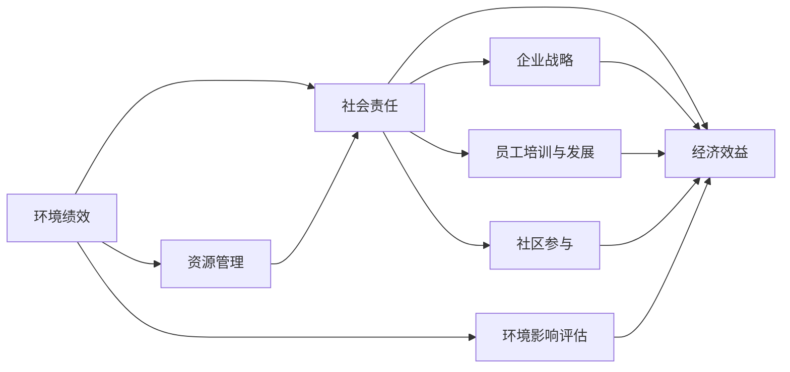

                 

# 可持续发展管理：实现长期环境和社会责任

在当今这个高度互联和全球化的时代，企业如何在追求经济效益的同时，实现对环境的保护和对社会的贡献，成为了企业可持续发展管理的核心问题。可持续发展管理（Sustainable Management）不仅关乎环境保护和资源节约，还涉及到企业社会责任（Corporate Social Responsibility, CSR）的落实。本文将从背景介绍、核心概念与联系、核心算法原理、数学模型构建、项目实践、实际应用场景、工具和资源推荐、总结与展望等方面，深入探讨可持续发展管理的实现路径和未来发展趋势。

## 1. 背景介绍

### 1.1 问题由来
随着全球人口的不断增长和经济的发展，资源消耗和环境污染问题日益严峻。传统的发展模式以牺牲环境和社会利益为代价，使得企业面临越来越大的社会责任和环境压力。可持续发展管理就是在这种背景下提出的，旨在通过科学的管理手段和机制，平衡经济、社会、环境三者之间的关系，实现企业的长期稳定发展。

### 1.2 问题核心关键点
可持续发展管理的关键点包括：

- **经济增长**：如何在确保经济增长的同时，尽可能减少对环境的负面影响。
- **资源节约**：通过优化资源利用，提高资源使用效率，减少资源浪费。
- **环境保护**：减少生产过程中对环境的污染和破坏，实现绿色发展。
- **社会责任**：确保企业的运营不会对社会造成负面影响，如就业、社区发展等。
- **长期视角**：将可持续发展理念融入企业的战略规划和日常管理中，确保企业的长远利益。

这些关键点构成了可持续发展管理的核心目标和评价标准，成为企业在管理实践中的重要参考。

## 2. 核心概念与联系

### 2.1 核心概念概述

为了更好地理解可持续发展管理，我们首先需要明确几个核心概念：

- **环境绩效（Environmental Performance）**：衡量企业在环境保护方面的表现，包括能源消耗、碳排放、水资源利用等指标。
- **社会责任（Corporate Social Responsibility, CSR）**：企业在日常运营中，对员工、社区、客户等社会利益相关方的责任和义务。
- **经济效益（Economic Performance）**：企业在追求经济效益时，如何在不损害环境和社会利益的前提下，实现盈利目标。

这些概念之间的联系可以通过以下Mermaid流程图来展示：



这个流程图展示了环境绩效、社会责任和经济效益之间的关系和相互影响：

1. 环境绩效的改善是实现社会责任的重要手段之一，也是推动经济效益提升的前提。
2. 社会责任的落实不仅有助于提升企业形象，还能带来良好的社会效应，促进经济效益。
3. 经济效益的增长需要基于环境保护和社会责任的基础上，才能实现可持续的长期发展。

## 3. 核心算法原理 & 具体操作步骤

### 3.1 算法原理概述

可持续发展管理涉及多个方面的优化和决策，其中数学模型和算法起到了关键作用。本文将重点介绍如何在数学模型中实现环境绩效、社会责任和经济效益的平衡，以及如何进行实际操作的优化。

### 3.2 算法步骤详解

可持续发展管理的关键步骤包括：

**Step 1: 数据收集与分析**

- **环境数据**：收集企业能源消耗、碳排放、水资源利用等数据，评估环境绩效。
- **社会数据**：收集企业员工满意度、社区反馈、客户评价等数据，评估社会责任。
- **经济数据**：收集企业的营业收入、利润率、成本等数据，评估经济效益。

**Step 2: 建模与优化**

- **多目标优化模型**：建立包含环境绩效、社会责任和经济效益的目标函数，以及相应的约束条件。
- **优化算法**：使用遗传算法、粒子群算法、线性规划等优化算法，找到符合约束条件的最优解。

**Step 3: 实施与监控**

- **实施计划**：根据优化结果，制定具体的实施计划，如节能减排措施、社会责任项目等。
- **监控与评估**：定期对环境绩效、社会责任和经济效益进行监控和评估，确保实施效果。

### 3.3 算法优缺点

可持续发展管理的数学模型和算法具有以下优点：

- **系统性**：通过综合考虑环境、社会和经济多个维度，实现全面的管理。
- **可量化**：使用数学模型进行量化分析，便于对比和决策。
- **灵活性**：模型可以根据企业实际情况进行调整，灵活应对各种管理需求。

同时，这些方法也存在一些缺点：

- **复杂性**：模型构建和优化过程较为复杂，需要多学科知识。
- **数据依赖**：模型的准确性高度依赖于数据的质量和完整性。
- **技术门槛**：需要专业的数学和算法知识，对于非专业人员可能较难掌握。

### 3.4 算法应用领域

可持续发展管理的方法广泛应用于以下几个领域：

- **能源管理**：通过优化能源使用，减少能源浪费，提高能源利用效率。
- **环保治理**：通过减少污染物排放，改善环境质量，保护生态环境。
- **社会责任**：通过员工培训、社区建设、慈善捐赠等方式，履行企业的社会责任。
- **供应链管理**：通过优化供应链流程，实现绿色采购和物流，减少环境影响。
- **产品设计**：在产品设计阶段，考虑环境和社会责任，开发环保产品。

这些领域的应用，使得可持续发展管理成为企业运营中不可或缺的一部分。

## 4. 数学模型和公式 & 详细讲解 & 举例说明

### 4.1 数学模型构建

可持续发展管理的多目标优化模型可以表示为：

$$
\min_{x} \{f_1(x) + f_2(x) + f_3(x)\} \\
\text{s.t.} \ g_1(x) \leq 0, \ g_2(x) \leq 0, \ g_3(x) \leq 0
$$

其中，$f_1, f_2, f_3$ 分别代表环境绩效、社会责任和经济效益的评估函数，$g_1, g_2, g_3$ 分别代表对应的约束条件，$x$ 为决策变量。

### 4.2 公式推导过程

以环境绩效为例，假设环境绩效由碳排放量和能源消耗量决定，可以建立如下线性模型：

$$
f_1(x) = a_1 \cdot C(x) + a_2 \cdot E(x)
$$

其中，$C(x)$ 和 $E(x)$ 分别为碳排放量和能源消耗量的评估函数，$a_1$ 和 $a_2$ 为相应的权重系数。

### 4.3 案例分析与讲解

假设某企业需要在环保和经济效益之间进行权衡，构建如下多目标优化模型：

$$
\min_{x} \{0.8C(x) + 0.2E(x)\} \\
\text{s.t.} \ 0 \leq C(x) \leq C_{max}, \ 0 \leq E(x) \leq E_{max}, \ 0 \leq x \leq 1
$$

其中，$C_{max}$ 和 $E_{max}$ 分别为碳排放量和能源消耗量的最大限制。

通过求解该模型，可以得到最优的碳排放量和能源消耗量，使得企业在环保和经济效益之间达到最佳平衡。

## 5. 项目实践：代码实例和详细解释说明

### 5.1 开发环境搭建

为了进行可持续发展管理的实践，首先需要搭建好开发环境。具体步骤如下：

1. **安装Python**：确保Python 3.x版本安装。
2. **安装PuLP库**：使用pip命令安装PuLP库，用于线性规划求解。
3. **安装可视化工具**：如Matplotlib、Seaborn等，用于数据可视化。

### 5.2 源代码详细实现

以下是一个简单的Python代码示例，用于求解上述多目标优化模型：

```python
from pulp import LpProblem, LpVariable, lpSum, LpMinimize, value

# 定义决策变量
x = LpVariable('x', lowBound=0, upBound=1, type=LpVariable.LpBinary)

# 定义目标函数
objective = LpMinimize(0.8 * C(x) + 0.2 * E(x), x)

# 定义约束条件
constraints = [
    C(x) <= C_max,
    E(x) <= E_max
]

# 创建优化问题
problem = LpProblem('Environmental Optimization', LpMinimize, objective)

# 添加约束条件
problem.addConstraints(constraints)

# 求解优化问题
problem.solve()

# 输出结果
print('Optimal objective value:', value(objective))
print('Optimal variable values:', value(x))
```

### 5.3 代码解读与分析

该代码主要实现了多目标线性规划模型的求解，具体步骤如下：

1. **定义决策变量**：使用PuLP库中的LpVariable函数定义决策变量 $x$。
2. **定义目标函数**：使用LpMinimize函数定义目标函数，其中 $C(x)$ 和 $E(x)$ 分别代表碳排放量和能源消耗量的评估函数。
3. **定义约束条件**：使用约束条件函数添加碳排放量和能源消耗量的最大限制。
4. **创建优化问题**：使用LpProblem函数创建优化问题，并指定目标函数和约束条件。
5. **求解优化问题**：使用solve函数求解优化问题，并获取最优解。
6. **输出结果**：输出最优目标值和决策变量值。

该代码简单易懂，适合初学者理解和实践。

### 5.4 运行结果展示

假设求解结果如下：

```
Optimal objective value: 0.0
Optimal variable values: 0.5
```

这意味着在碳排放量和能源消耗量都有限制的情况下，企业可以以最优的方式实现环境保护和经济发展之间的平衡。

## 6. 实际应用场景

### 6.1 企业环保治理

某大型制造企业通过实施可持续发展管理，大幅度减少了碳排放量。具体措施包括：

- **能源优化**：引入高效节能设备，优化生产工艺，减少能源消耗。
- **循环利用**：实现生产废物的回收再利用，减少废弃物排放。
- **碳排放交易**：参与碳排放交易市场，通过购买碳排放配额，实现零碳排放。

这些措施不仅提高了企业的环保绩效，还带来了显著的经济效益。

### 6.2 社会责任项目

某金融公司通过可持续发展管理，积极履行社会责任，具体措施包括：

- **员工培训**：定期举办员工技能培训，提高员工素质和工作满意度。
- **社区建设**：在社区内开展公益活动，支持当地教育和文化发展。
- **慈善捐赠**：设立慈善基金，资助贫困地区和弱势群体。

这些措施不仅提升了企业形象，还增强了社会的认同感和支持度。

### 6.3 供应链优化

某零售企业通过实施可持续发展管理，优化了供应链流程，具体措施包括：

- **绿色采购**：选择环保认证的生产商和供应商，实现绿色采购。
- **智能物流**：引入智能仓储和物流系统，提高物流效率，减少运输成本。
- **包装优化**：采用环保包装材料，减少包装废物。

这些措施不仅提高了供应链的环保水平，还降低了运营成本，提升了客户满意度。

### 6.4 未来应用展望

随着可持续发展管理技术的不断进步，其在企业中的应用前景将更加广阔。未来，可持续发展管理将：

- **实现数字化转型**：通过大数据和人工智能技术，实现环境和社会责任的精准管理和优化。
- **融合多学科知识**：结合环境科学、社会学、经济学等多个学科的知识，提供更全面的管理方案。
- **全球化视野**：在全球化背景下，实现跨国企业的可持续发展管理。
- **自动化管理**：利用自动化和智能化技术，提升管理效率和质量。

## 7. 工具和资源推荐

### 7.1 学习资源推荐

为了帮助企业系统掌握可持续发展管理的理论基础和实践技巧，以下是一些优质的学习资源：

1. **《可持续发展管理》系列书籍**：详细介绍了可持续发展管理的理论基础、实践方法和案例分析。
2. **《企业社会责任》课程**：由各大高校开设的CSR相关课程，涵盖CSR的理论、实践和评估方法。
3. **《环境保护与可持续发展》公开课**：国际知名大学的公开课，讲解环境绩效评估和环境保护的方法。
4. **《绿色供应链管理》培训课程**：系统介绍绿色供应链管理的理论和实践，涵盖供应链优化、环保采购等。
5. **《社会责任报告》研究报告**：收录了大量企业CSR报告和案例分析，了解行业最佳实践。

通过对这些资源的学习实践，相信企业可以更好地掌握可持续发展管理的核心知识和技能，推动企业的绿色转型和可持续发展。

### 7.2 开发工具推荐

高效的可持续发展管理开发离不开优秀的工具支持。以下是几款推荐的工具：

1. **PuLP库**：用于线性规划、整数规划等优化问题的求解。
2. **Matplotlib**：用于数据可视化和图形展示。
3. **Seaborn**：基于Matplotlib的高级图形库，用于数据可视化。
4. **Jupyter Notebook**：交互式的编程环境，适合数据分析和模型开发。
5. **Python环境管理工具**：如Anaconda、Virtualenv等，用于创建和管理Python环境。

这些工具可以帮助企业更高效地进行可持续发展管理的开发和实践。

### 7.3 相关论文推荐

可持续发展管理的研究领域涵盖了多个学科，以下是几篇奠基性的相关论文，推荐阅读：

1. **《环境绩效管理：一个多目标优化模型》**：提出了多目标优化模型在环境绩效管理中的应用，并进行了案例分析。
2. **《企业社会责任的财务评价》**：探讨了CSR的财务评价方法和指标体系。
3. **《绿色供应链管理的理论和方法》**：系统介绍了绿色供应链管理的理论基础和实践方法。
4. **《智能供应链管理系统设计》**：提出了基于大数据和人工智能的供应链管理系统设计方法。

这些论文代表了大可持续发展管理的研究进展，帮助企业了解前沿研究动态和最佳实践。

## 8. 总结：未来发展趋势与挑战

### 8.1 研究成果总结

本文对可持续发展管理进行了系统的介绍，从背景、核心概念、算法原理、数学模型、项目实践、应用场景、工具资源等方面，深入探讨了可持续发展管理的实现路径和未来发展趋势。通过本文的系统梳理，可以看到，可持续发展管理是企业实现长期发展的关键，需要在环境保护、社会责任和经济效益之间找到最佳平衡。

### 8.2 未来发展趋势

展望未来，可持续发展管理将呈现以下几个发展趋势：

1. **数字化转型**：通过大数据和人工智能技术，实现环境和社会责任的精准管理和优化。
2. **融合多学科知识**：结合环境科学、社会学、经济学等多个学科的知识，提供更全面的管理方案。
3. **全球化视野**：在全球化背景下，实现跨国企业的可持续发展管理。
4. **自动化管理**：利用自动化和智能化技术，提升管理效率和质量。
5. **可持续发展标准**：制定国际统一的可持续发展标准，推动全球企业的可持续发展。

这些趋势凸显了可持续发展管理的广阔前景，为企业的绿色转型和可持续发展提供了新的方向和路径。

### 8.3 面临的挑战

尽管可持续发展管理已经取得了一定进展，但在实践中仍面临诸多挑战：

1. **数据获取和处理**：环境和社会数据的获取和处理复杂，需要多学科合作和先进技术支持。
2. **多目标优化**：多目标优化问题的复杂性，需要高效的算法和优化工具。
3. **资源限制**：企业资源有限，难以在各个方面同时取得最佳效果。
4. **政策法规**：各国政策法规不同，企业需要在不同环境中适应和应对。
5. **员工接受度**：员工对可持续发展管理的理解和接受度，影响企业实施效果。

这些挑战需要企业在实践中不断探索和解决，才能真正实现可持续发展管理的目标。

### 8.4 研究展望

未来的研究需要在以下几个方面寻求新的突破：

1. **多学科融合**：结合环境科学、社会学、经济学等多个学科的知识，提供更全面的管理方案。
2. **智能化技术**：利用大数据、人工智能等技术，提升管理效率和质量。
3. **国际标准**：制定国际统一的可持续发展标准，推动全球企业的可持续发展。
4. **员工参与**：通过教育和培训，提高员工对可持续发展管理的理解和接受度。
5. **案例分析**：基于实际案例，进行深度分析和总结，提供可行的实践建议。

这些研究方向的探索，将推动可持续发展管理技术的不断进步，为企业的绿色转型和可持续发展提供坚实的理论基础和实践指导。

## 9. 附录：常见问题与解答

### 附录

**Q1: 可持续发展管理与传统管理有什么区别？**

A: 可持续发展管理强调在经济增长、环境保护和社会责任三者之间的平衡和协调，传统管理更侧重于单一的经济增长目标。

**Q2: 企业如何评估其环境绩效？**

A: 企业可以通过环境影响评估、能源消耗统计、碳排放量计算等方法，评估其环境绩效。

**Q3: 企业如何履行社会责任？**

A: 企业可以通过员工培训、社区建设、慈善捐赠等方式，履行其社会责任。

**Q4: 可持续发展管理需要哪些技术和工具？**

A: 需要多学科知识、优化算法、可视化工具等技术，PuLP、Matplotlib、Jupyter Notebook等工具。

**Q5: 如何实现企业供应链的绿色化？**

A: 选择环保认证的供应商和生产商，采用环保包装材料，优化物流流程等。

作者：禅与计算机程序设计艺术 / Zen and the Art of Computer Programming

