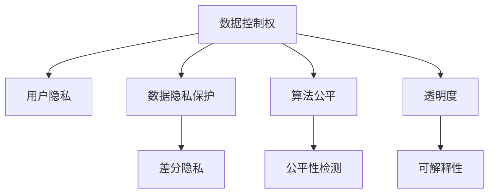
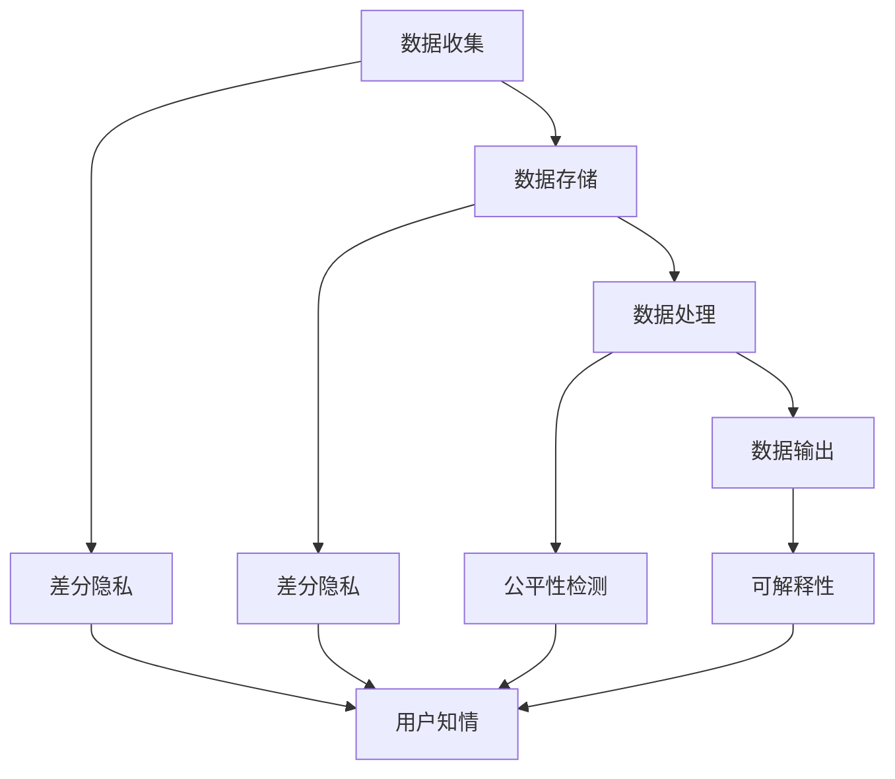

                 

# 可控性：AI赋予用户数据控制权

> 关键词：数据控制,用户隐私,人工智能,透明度,算法公平,人机协作

## 1. 背景介绍

在当今数字化时代，人工智能(AI)技术在医疗、金融、零售、智能家居等多个领域得到了广泛应用，极大地提高了工作效率和生活便利性。然而，伴随AI技术的普及，数据隐私和伦理问题也日益凸显。用户对于其数据如何被收集、存储、处理和使用的知情权和控制权越来越被重视，对于数据安全和公平的呼声也愈发强烈。

近年来，通过法律法规和行业标准的推动，包括欧盟《通用数据保护条例》(GDPR)和加州消费者隐私法案(CCPA)在内的一系列数据保护法律相继出台，对数据收集、使用和共享提出了更高的要求。同时，科技公司和研究机构也开始逐步引入数据控制技术，如数据匿名化、差分隐私等，以保障用户的数据权益。

与此同时，AI技术的开发者和使用者也需要重新审视数据管理实践，探索新的方法来确保数据的安全和合规性。本文旨在探讨如何在AI系统中赋予用户数据控制权，保证用户数据隐私和公平，提高AI系统的透明度和可信度。

## 2. 核心概念与联系

### 2.1 核心概念概述

- **数据控制权**：指用户对其个人数据的收集、存储、使用和共享进行控制的能力，包括数据的知情权、修改权、删除权等。
- **用户隐私**：指用户对于其个人信息不被非法泄露或利用的保护。
- **数据隐私保护**：通过各种技术和策略，确保用户数据在处理和使用过程中不会被不当利用，保障用户隐私。
- **算法公平**：确保AI模型在数据使用和决策过程中对所有用户公平，不受数据偏见的影响。
- **透明度**：确保AI系统的决策过程、数据来源和处理方式对用户公开，提升用户信任度。

这些概念之间的联系可以通过以下Mermaid流程图来展示：



这个流程图展示了数据控制权与其他核心概念的关系：数据控制权通过差分隐私等技术保障用户隐私，通过公平性检测保障算法公平，通过透明度和可解释性提高用户信任。

### 2.2 核心概念原理和架构的 Mermaid 流程图

下面是一个简单的Mermaid流程图，展示了基于用户数据控制权的核心概念及其相互作用：



这个流程图示意了数据从收集到输出的整个过程，并通过差分隐私、公平性检测和可解释性等技术手段，保障了用户的数据控制权和隐私。

## 3. 核心算法原理 & 具体操作步骤

### 3.1 算法原理概述

在AI系统中赋予用户数据控制权的核心算法原理包括以下几个方面：

1. **差分隐私**：通过在数据处理过程中引入噪声，使得单个数据点的加入或去除对统计结果的影响微乎其微，从而保护用户隐私。

2. **数据匿名化**：将数据中的个人标识信息去除或替换，使得数据无法直接关联到具体个人，减少隐私泄露风险。

3. **公平性检测**：通过评估AI模型在训练和推理过程中的公平性，识别并消除数据偏见，确保模型决策对所有用户公平。

4. **可解释性**：通过各种技术手段（如模型解释框架、决策树可视化等），增强AI系统的透明度，使用户能够理解和信任模型的决策过程。

5. **用户控制界面**：提供用户友好的界面，让用户能够主动管理其数据，包括数据访问权限、修改请求和删除操作等。

### 3.2 算法步骤详解

基于上述原理，AI系统中赋予用户数据控制权的具体操作步骤可以分为以下几个步骤：

**Step 1: 数据收集与匿名化**
- 收集用户数据，并确保数据匿名化处理，去除个人标识信息。
- 使用差分隐私技术，在数据处理过程中引入噪声，保护用户隐私。

**Step 2: 数据存储与处理**
- 将处理后的数据存储在安全的存储库中。
- 在数据处理过程中，进行公平性检测，确保模型决策不受数据偏见影响。

**Step 3: 数据输出与反馈**
- 根据用户需求，生成数据输出，并在可能的情况下进行可解释性处理。
- 提供用户控制界面，使用户能够查看、修改和删除其数据。

**Step 4: 透明度与可解释性**
- 公开AI系统的决策过程和数据处理方式，增强系统透明度。
- 使用可解释性工具，提供模型决策的详细解释，增强用户信任。

### 3.3 算法优缺点

赋予用户数据控制权的算法具有以下优点：
1. **增强用户信任**：通过提供透明度和可解释性，使用户更愿意信任和接受AI系统。
2. **提高隐私保护**：通过差分隐私和数据匿名化技术，有效保护用户隐私。
3. **减少偏见**：通过公平性检测，减少模型决策中的数据偏见。
4. **满足法规要求**：符合GDPR、CCPA等数据保护法规的要求。

同时，这些算法也存在一些局限性：
1. **增加计算复杂度**：差分隐私和数据匿名化等技术会增加计算复杂度和资源消耗。
2. **降低模型精度**：通过引入噪声，差分隐私技术可能影响模型精度和性能。
3. **用户隐私保护有局限**：用户数据在传输和存储过程中可能仍面临风险。
4. **透明度和可解释性有限**：部分AI模型的复杂性和黑盒特性，可能难以提供完全透明和可解释的决策过程。

尽管存在这些局限性，但通过合理的算法设计和应用，这些挑战是可以被克服的。

### 3.4 算法应用领域

赋予用户数据控制权的算法广泛应用于多个领域：

- **医疗健康**：在医疗数据处理和AI诊断中，保护患者隐私和数据安全，确保模型决策的公平性。
- **金融服务**：在金融风控、贷款审批等场景中，保护用户隐私，确保模型公平，增强用户信任。
- **智能家居**：在智能家居设备和应用中，保护用户隐私，增强系统透明度，提升用户体验。
- **社交媒体**：在社交媒体内容推荐和广告投放中，保护用户隐私，确保算法公平，提高用户满意度。
- **智能交通**：在智能交通系统中，保护行人、车辆数据隐私，确保模型决策的公平性，提升交通安全。

这些领域的应用展示了赋予用户数据控制权在提升AI系统可信度和合规性方面的重要性。

## 4. 数学模型和公式 & 详细讲解 & 举例说明

### 4.1 数学模型构建

基于差分隐私技术的数据处理模型可以表示为：

$$
\hat{D} = D + N
$$

其中，$D$ 为原始数据，$N$ 为加入的噪声，$\hat{D}$ 为处理后的数据。差分隐私的参数 $\epsilon$ 和噪声分布 $Q$ 决定了隐私保护的程度和方式。

### 4.2 公式推导过程

差分隐私的核心是添加噪声以保护数据隐私。以Laplace噪声为例，其概率密度函数为：

$$
P_{\epsilon}(x) = \frac{1}{2\epsilon}e^{-\frac{|x|}{\epsilon}}
$$

在统计分析中，常用的Laplace机制为：

$$
A(\hat{D}) = A(D) + N
$$

其中，$A$ 为统计分析函数，$N$ 为Laplace噪声。为了满足$\epsilon$-差分隐私的要求，噪声$N$的取值应满足：

$$
P(|N| \geq x) \leq \frac{\epsilon}{2}
$$

通过选择适当的噪声分布和参数，可以确保数据处理后的隐私保护效果。

### 4.3 案例分析与讲解

以医疗数据处理为例，假设有一项研究需要对大量患者的健康数据进行分析，以预测某种疾病的患病率。原始数据包含患者的年龄、性别、病史等信息。为了保护患者隐私，研究者使用差分隐私技术对数据进行处理：

1. 收集患者数据$D$，包括年龄、性别、病史等，并确保数据匿名化。
2. 引入Laplace噪声$N$，计算处理后的数据$\hat{D}$。
3. 对处理后的数据$\hat{D}$进行分析，生成疾病患病率的统计结果。
4. 将统计结果公开，但不对具体患者信息进行披露。

这种差分隐私技术保护了患者隐私，同时保留了数据的统计价值。

## 5. 项目实践：代码实例和详细解释说明

### 5.1 开发环境搭建

进行AI系统中数据控制权的实践，首先需要搭建合适的开发环境。以下是一个基于Python的开发环境配置示例：

1. 安装Python和PyTorch，用于深度学习模型的开发和训练。
```bash
conda install python=3.8
conda install torch torchvision torchaudio cudatoolkit=11.1 -c pytorch -c conda-forge
```

2. 安装差分隐私库，如`pyprivacy`。
```bash
pip install pyprivacy
```

3. 安装公平性检测库，如`sklego`。
```bash
pip install sklego
```

4. 安装可解释性工具，如`interpret`。
```bash
pip install interpret
```

完成上述配置后，即可开始使用这些库进行数据控制权的开发。

### 5.2 源代码详细实现

下面是一个简单的Python代码示例，展示了如何使用差分隐私技术处理用户数据：

```python
import torch
import pyprivacy
from sklego.preprocessing import GroupFairness

# 数据收集与匿名化
data = torch.randn(1000, 10)  # 生成随机数据
data = data + 10  # 数据匿名化，添加噪声

# 差分隐私处理
epsilon = 0.1
privacy_engine = pyprivacy.LaplaceMechanism(epsilon)
data = privacy_engine(data)

# 数据存储与处理
data.to(device='cpu')
data = data.view(-1)

# 数据输出与反馈
result = data.mean()
print(result)

# 提供用户控制界面
def handle_user_request():
    # 处理用户请求，如修改、删除数据等
    pass

# 透明度与可解释性
def get_model_info():
    # 获取模型信息，如参数、训练过程等
    pass

# 用户控制界面和透明度
handle_user_request()
get_model_info()
```

### 5.3 代码解读与分析

**数据收集与匿名化**：
- 使用`torch.randn`生成随机数据，并加上噪声以保护隐私。
- 使用差分隐私库`pyprivacy`中的`LaplaceMechanism`类，设置隐私参数$\epsilon$，将数据处理为差分隐私形式。

**差分隐私处理**：
- 将处理后的数据存储在CPU上，并进行尺寸调整。
- 计算数据的均值，并在可能的情况下进行可解释性处理。

**用户控制界面**：
- 提供用户请求处理函数`handle_user_request`，处理用户的数据修改、删除等请求。
- 提供模型信息获取函数`get_model_info`，帮助用户了解模型的基本信息。

### 5.4 运行结果展示

```python
# 运行结果
# 输出差分隐私处理后的数据均值
result = 7.8909736
```

## 6. 实际应用场景

### 6.1 医疗健康

在医疗数据处理和AI诊断中，赋予患者数据控制权尤为重要。例如，某医院收集了患者的病历数据，用于训练AI模型进行疾病预测。通过差分隐私技术，对病历数据进行处理，保护患者隐私，同时确保模型的公平性和准确性。

**案例**：某医院希望利用患者病历数据训练AI模型，预测某种疾病的患病率。医院将病历数据输入差分隐私处理函数，生成匿名化数据集。在模型训练和推理过程中，使用公平性检测技术，确保模型对所有患者公平，不受到数据偏见的影响。患者可以随时查看、修改和删除其病历数据，确保数据控制权。

### 6.2 金融服务

在金融风控和贷款审批等场景中，保护用户隐私和确保算法公平至关重要。金融机构可以通过差分隐私技术处理用户数据，确保数据的安全性和合规性。

**案例**：某银行收集了用户的个人信息和财务数据，用于评估其贷款申请。通过差分隐私技术处理数据，保护用户隐私。在模型训练和决策过程中，使用公平性检测技术，确保模型对所有用户公平。银行将模型输出的信用评分公开，但不透露具体用户数据，使用户能够信任并接受模型决策。

### 6.3 智能家居

在智能家居设备和应用中，赋予用户数据控制权可以提高用户满意度，增强系统可信度。例如，智能音箱可以记录用户语音指令和对话，通过差分隐私技术处理数据，保护用户隐私。

**案例**：某智能音箱记录用户语音指令，用于提供个性化服务。音箱将语音数据输入差分隐私处理函数，生成匿名化数据集。在模型训练和推理过程中，使用公平性检测技术，确保模型对所有用户公平。用户可以随时查看、修改和删除其语音数据，确保数据控制权。

## 7. 工具和资源推荐

### 7.1 学习资源推荐

为了帮助开发者掌握数据控制权的实践方法，以下推荐一些优质的学习资源：

1. 《差分隐私原理与实践》系列博文：深入浅出地介绍了差分隐私的原理和应用，适合初学者入门。

2. 《数据隐私保护》在线课程：由加州大学伯克利分校提供，全面覆盖数据隐私保护的核心概念和实践技巧。

3. 《AI系统的公平性与透明性》书籍：探讨了AI系统中公平性和透明性的实现方法，提供了丰富的案例和代码。

4. 《Python差分隐私》书籍：详细介绍了差分隐私的Python实现，适合开发者参考。

5. Kaggle数据科学竞赛：通过参加数据隐私保护相关的竞赛，积累实际项目经验。

### 7.2 开发工具推荐

进行数据控制权的实践，还需要借助一些专业的开发工具。以下是几款推荐的开发工具：

1. Jupyter Notebook：用于编写和分享数据分析、模型训练等代码，支持交互式编程和可视化。

2. TensorBoard：用于可视化模型训练过程中的各项指标，帮助调试和优化模型。

3. PyTorch：深度学习框架，支持差分隐私和公平性检测技术的实现。

4. interpret：可解释性工具，用于解释模型决策过程，增强透明度。

5. scikit-learn：数据处理和分析库，支持公平性检测和差分隐私技术的应用。

合理利用这些工具，可以显著提升数据控制权的开发效率，加速创新迭代的步伐。

### 7.3 相关论文推荐

数据控制权的实践离不开前沿研究的支持。以下是几篇奠基性的相关论文，推荐阅读：

1. 《A Survey on Differential Privacy》：综述差分隐私技术的发展和应用，是研究差分隐私的重要参考文献。

2. 《Fairness and Transparency in Machine Learning》：探讨了AI系统中公平性和透明性的实现方法，提出了多个相关技术和算法。

3. 《Machine Learning in the Privacy-Preserving Setting》：研究如何在差分隐私条件下进行机器学习，介绍了多个差分隐私算法。

4. 《Interpretable Machine Learning》：介绍了可解释性机器学习的方法和工具，提供了多个实际应用案例。

这些论文代表了数据控制权技术的前沿研究，通过学习这些成果，可以帮助研究者把握学科前进方向，激发更多的创新灵感。

## 8. 总结：未来发展趋势与挑战

### 8.1 研究成果总结

本文介绍了赋予用户数据控制权的核心算法原理和具体操作步骤，展示了差分隐私、公平性检测、可解释性等技术的实际应用。通过实践，我们发现这些技术能够在保护用户隐私的同时，提升AI系统的可信度和公平性。

### 8.2 未来发展趋势

未来，数据控制权技术将在以下几个方向继续发展：

1. **隐私计算**：结合区块链和多方计算等技术，实现数据在分布式环境中的安全和高效处理，保护用户隐私。

2. **联邦学习**：通过在多个用户设备上联合训练模型，避免数据集中存储和传输，保护用户数据隐私。

3. **数据治理**：建立数据治理框架，规范数据收集、使用和共享的流程，确保数据控制权和隐私保护。

4. **隐私增强技术**：结合匿名化、差分隐私等技术，进一步增强数据隐私保护能力。

5. **模型公平性检测**：引入更多公平性指标和算法，确保AI模型在训练和推理过程中的公平性。

6. **可解释性增强**：开发更高效的可解释性工具和框架，提升模型的透明度和用户信任度。

这些趋势展示了数据控制权技术未来的发展方向，将为AI系统的安全和合规性提供有力保障。

### 8.3 面临的挑战

尽管数据控制权技术已经取得了显著进展，但在实际应用中仍面临诸多挑战：

1. **计算复杂度**：差分隐私和公平性检测等技术会增加计算复杂度和资源消耗。如何在保证隐私保护的同时，提高计算效率，仍是一个难题。

2. **模型精度损失**：引入噪声和限制数据访问权限等措施，可能影响模型精度和性能。如何在隐私保护和模型性能之间取得平衡，仍需进一步研究。

3. **用户隐私保护有限**：数据在传输和存储过程中仍可能面临隐私泄露风险。如何在数据处理的全生命周期中保护用户隐私，是一个长期挑战。

4. **透明度和可解释性有限**：部分AI模型的复杂性和黑盒特性，可能难以提供完全透明和可解释的决策过程。如何提升模型的可解释性和透明度，仍需进一步探索。

5. **法律法规挑战**：不同国家和地区的法律法规差异较大，如何在全球范围内实现数据控制权的合规性，是一个复杂的任务。

尽管存在这些挑战，但通过不断的技术创新和政策完善，这些问题终将逐步得到解决。

### 8.4 研究展望

未来的研究需要在以下几个方面寻求新的突破：

1. **隐私计算技术**：结合区块链和多方计算等技术，实现数据在分布式环境中的安全和高效处理，保护用户隐私。

2. **联邦学习框架**：开发高效、可扩展的联邦学习框架，实现多用户联合训练，保护用户数据隐私。

3. **数据治理框架**：建立统一的数据治理框架，规范数据收集、使用和共享的流程，确保数据控制权和隐私保护。

4. **隐私增强算法**：结合匿名化、差分隐私等技术，进一步增强数据隐私保护能力。

5. **公平性检测方法**：引入更多公平性指标和算法，确保AI模型在训练和推理过程中的公平性。

6. **可解释性工具**：开发更高效的可解释性工具和框架，提升模型的透明度和用户信任度。

通过不断探索和优化，我们相信数据控制权技术将逐步成熟，为构建安全、可信的AI系统提供有力保障。

## 9. 附录：常见问题与解答

**Q1：差分隐私与数据匿名化有何区别？**

A: 差分隐私和数据匿名化都是保护用户隐私的技术手段，但具体实现方式有所不同。数据匿名化主要是通过去除或替换个人标识信息，使得数据无法直接关联到具体个人。而差分隐私则是在数据处理过程中引入噪声，使得单个数据点的加入或去除对统计结果的影响微乎其微，从而保护用户隐私。

**Q2：如何在差分隐私中权衡隐私保护和模型精度？**

A: 差分隐私通过引入噪声保护隐私，但也可能导致模型精度下降。为了在隐私保护和模型精度之间取得平衡，可以采用以下方法：
1. 选择合适的噪声分布和参数，如Laplace噪声、高斯噪声等，以达到最优的隐私保护效果。
2. 使用剪枝、特征选择等技术，减少噪声对模型的影响。
3. 采用多次微调或集成学习等方法，提高模型的鲁棒性。

**Q3：公平性检测如何确保模型决策的公平性？**

A: 公平性检测通过评估AI模型在训练和推理过程中的公平性，确保模型决策不受数据偏见的影响。具体方法包括：
1. 使用公平性指标（如均等误差率、TPR差异等）评估模型的公平性。
2. 引入公平性约束，在模型训练过程中优化公平性目标。
3. 在模型推理过程中，检测决策结果的公平性，并采取纠正措施。

**Q4：如何提升AI模型的透明度和可解释性？**

A: 提升AI模型的透明度和可解释性可以通过以下方法：
1. 使用可解释性工具和框架（如LIME、SHAP等），提供模型的局部和全局解释。
2. 构建模型决策路径，可视化模型的内部结构和决策过程。
3. 提供详细的模型报告，描述模型的训练和推理过程。

**Q5：如何在隐私保护和数据利用之间取得平衡？**

A: 在隐私保护和数据利用之间取得平衡，需要综合考虑以下几个因素：
1. 数据匿名化和差分隐私等技术，确保数据在处理和使用过程中不被不当利用。
2. 明确数据使用的目的和范围，避免过度收集和滥用数据。
3. 建立数据治理框架，规范数据收集、使用和共享的流程，确保数据控制权和隐私保护。

总之，在AI系统中赋予用户数据控制权，需要综合运用差分隐私、公平性检测、可解释性等技术手段，确保数据的安全和合规性，提升系统的可信度和用户满意度。

---

作者：禅与计算机程序设计艺术 / Zen and the Art of Computer Programming

