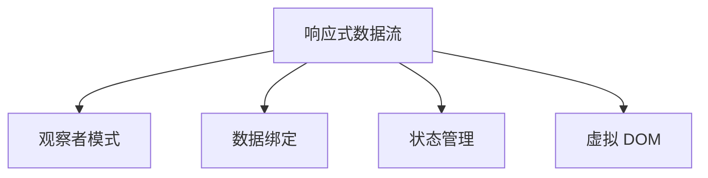

                 

# 响应式编程：处理异步数据流

## 1. 背景介绍

### 1.1 问题由来

在现代软件开发中，数据流处理是至关重要的。无论是网页应用、移动应用还是服务器端应用，都依赖于高效可靠的数据流处理。传统的数据流处理方式是通过同步的线程或者回调函数来实现，但这些方式往往带来性能瓶颈、复杂性和易错性。响应式编程范式应运而生，它通过基于观察者模式的异步数据流，实现数据驱动的程序更新和响应，极大地提高了代码的可读性和可维护性。

### 1.2 问题核心关键点

响应式编程的本质是通过异步数据流和观察者模式，实现数据的观察、变换、组合、合并等操作，从而构建起高效可靠的数据流处理系统。它能够处理各种复杂的数据模型，包括时间序列数据、对象图数据等，适用于异步并发、事件驱动等场景，如Web前端应用、后台消息队列、实时数据分析等。

响应式编程的关键在于其异步数据流模型和观察者模式。异步数据流模型通过发布-订阅机制，将数据源与数据消费者解耦，实现数据的异步发布和异步消费，提高了系统的并发能力和响应速度。观察者模式则允许开发者定义对数据的观察和响应方式，使数据的变化能够即时更新到各个观察者中，从而实现数据的实时同步和更新。

## 2. 核心概念与联系

### 2.1 核心概念概述

为了更好地理解响应式编程，本节将介绍几个密切相关的核心概念：

- 响应式数据流：基于观察者模式的数据流模型，用于异步、无阻塞地处理数据流，支持数据的发布、订阅和变换等操作。
- 观察者模式：一种设计模式，允许对象间一种一对多的依赖关系，当一个对象的状态发生改变时，它的所有依赖者（观察者）都能得到通知并自动更新。
- 数据绑定：一种响应式编程的机制，用于实现数据流与UI组件的同步更新，即当数据流发生变化时，UI组件能够自动更新。
- 状态管理：一种用于管理应用程序状态的机制，通常通过状态树或者状态管理器实现，支持数据的存储、修改和同步等操作。
- 虚拟 DOM：一种用于优化 DOM 操作的机制，通过将实际 DOM 树映射为虚拟 DOM 树，实现对 DOM 的操作优化，提高性能和可维护性。

这些核心概念之间的逻辑关系可以通过以下Mermaid流程图来展示：



这个流程图展示了这个范式的核心概念及其之间的关系：

1. 响应式数据流是响应式编程的基础，用于异步、无阻塞地处理数据流。
2. 观察者模式描述了数据流与观察者之间的关系，即数据流可以异步通知观察者，观察者可以异步响应数据流。
3. 数据绑定用于实现数据流与UI组件的同步更新，即当数据流发生变化时，UI组件能够自动更新。
4. 状态管理用于管理应用程序的状态，支持数据的存储、修改和同步等操作。
5. 虚拟 DOM 用于优化 DOM 操作，实现对 DOM 的操作优化，提高性能和可维护性。

这些核心概念共同构成了响应式编程的实现框架，使其能够高效、可靠地处理异步数据流。

## 3. 核心算法原理 & 具体操作步骤

### 3.1 算法原理概述

响应式编程的核心算法原理是基于观察者模式的数据流模型，通过发布-订阅机制实现数据的异步发布和异步消费，从而构建高效可靠的数据流处理系统。其核心思想是：

1. 数据流作为数据源，通过发布机制向所有观察者发布数据。
2. 观察者作为数据消费者，通过订阅机制异步接收数据流发布的数据。
3. 数据流和观察者之间保持解耦关系，数据流可以独立地发布数据，观察者也可以独立地订阅数据。
4. 观察者订阅数据流后，数据流变化时，观察者能够异步响应数据变化。

### 3.2 算法步骤详解

响应式编程的数据流处理过程主要包括以下几个步骤：

**Step 1: 创建数据流源**

在响应式编程中，数据流源是通过创建数据源对象来实现的。数据源对象负责生成数据流，并将其发布到观察者中。常见的数据源包括时间序列数据源、对象图数据源等。

**Step 2: 创建观察者**

观察者对象负责订阅数据流，并异步接收数据流发布的数据。观察者可以是一个UI组件、一个服务端模块、一个数据库等。

**Step 3: 创建数据发布机制**

数据发布机制用于实现数据流的异步发布。常见的发布机制包括发布-订阅模式、事件模式等。通过发布-订阅模式，数据流可以异步通知所有订阅它的观察者。

**Step 4: 创建数据订阅机制**

数据订阅机制用于实现数据流的异步订阅。常见的订阅机制包括观察者模式、消息队列等。通过观察者模式，观察者可以异步订阅数据流。

**Step 5: 创建数据变换机制**

数据变换机制用于实现对数据流的变换操作，如过滤、映射、合并等。常见的数据变换操作包括map、filter、reduce等。

**Step 6: 创建数据消费机制**

数据消费机制用于实现对数据流的消费操作，如UI组件的渲染、服务端的数据处理等。常见的数据消费操作包括数据绑定、事件处理等。

通过以上步骤，响应式编程可以构建起高效可靠的数据流处理系统。

### 3.3 算法优缺点

响应式编程的异步数据流模型具有以下优点：

1. 异步数据流：响应式编程的异步数据流模型，支持数据的异步发布和异步消费，提高了系统的并发能力和响应速度。
2. 观察者模式：通过观察者模式，数据流和观察者之间保持解耦关系，数据流可以独立地发布数据，观察者也可以独立地订阅数据，提高了系统的灵活性和可扩展性。
3. 数据绑定：通过数据绑定，实现了数据流与UI组件的同步更新，提高了系统的交互性和响应性。
4. 状态管理：通过状态管理，实现了应用程序状态的统一管理和同步，提高了系统的可靠性和可维护性。
5. 虚拟 DOM：通过虚拟 DOM，优化了 DOM 操作，提高了系统的性能和可维护性。

同时，响应式编程也存在一定的局限性：

1. 学习曲线较陡：响应式编程需要理解观察者模式、数据绑定、状态管理等概念，学习曲线较陡，需要一定的学习成本。
2. 性能消耗较大：响应式编程需要频繁地创建和销毁对象，消耗了一定的性能。
3. 数据流的复杂性：在处理复杂的数据流时，可能需要进行大量的数据变换和组合操作，增加了代码的复杂性。

尽管存在这些局限性，但响应式编程在现代软件开发中已经得到了广泛的应用，尤其是在Web前端开发、移动应用开发等领域，展示了其强大的生命力和广阔的前景。

### 3.4 算法应用领域

响应式编程的异步数据流模型在多个领域得到了广泛应用，例如：

1. Web前端开发：响应式编程在Web前端开发中广泛应用，用于实现数据的异步更新和UI组件的实时同步。通过响应式数据流和数据绑定，可以实现数据的实时同步和UI组件的自动更新。
2. 移动应用开发：响应式编程在移动应用开发中也有广泛应用，用于实现数据的异步更新和UI组件的实时同步。通过响应式数据流和数据绑定，可以实现数据的实时同步和UI组件的自动更新。
3. 后台消息队列：响应式编程在后台消息队列中也得到了应用，用于实现消息的异步发布和消费。通过响应式数据流和观察者模式，可以实现消息的异步发布和消费。
4. 实时数据分析：响应式编程在实时数据分析中也得到了应用，用于实现数据的异步处理和实时分析。通过响应式数据流和数据变换机制，可以实现数据的实时分析和处理。

除了上述这些领域，响应式编程还在其他多个领域得到了应用，展示了其强大的生命力和广阔的前景。

## 4. 数学模型和公式 & 详细讲解 & 举例说明

### 4.1 数学模型构建

在响应式编程中，数据流和观察者之间的关系可以用数学模型来描述。假设有一个时间序列数据流 $D$，它的当前值为 $D_t$，表示在时间 $t$ 的数据点。观察者 $O$ 的当前状态为 $O_t$，表示在时间 $t$ 的观察者状态。观察者 $O$ 订阅数据流 $D$，它的更新方式可以用数学模型 $O_{t+1} = f(D_{t+1}, O_t)$ 来描述，其中 $f$ 表示观察者更新函数，$O_{t+1}$ 表示在时间 $t+1$ 的观察者状态。

### 4.2 公式推导过程

通过数学模型，我们可以推导出观察者的更新公式：

$$
O_{t+1} = f(D_{t+1}, O_t)
$$

其中，$f$ 表示观察者更新函数，$D_{t+1}$ 表示在时间 $t+1$ 的数据流值，$O_t$ 表示在时间 $t$ 的观察者状态。观察者更新函数 $f$ 可以是任何函数，用于实现观察者的更新逻辑。

例如，假设观察者的更新逻辑是简单的累加，那么观察者更新函数 $f$ 可以定义为：

$$
f(D_{t+1}, O_t) = O_t + D_{t+1}
$$

这意味着，观察者 $O$ 的当前状态等于在时间 $t$ 的状态 $O_t$ 加上在时间 $t+1$ 的数据流值 $D_{t+1}$。

### 4.3 案例分析与讲解

假设有一个简单的例子，时间序列数据流 $D$ 表示温度数据，观察者 $O$ 表示一个智能手表。智能手表每隔一秒钟读取一次温度数据，并显示在屏幕上。温度数据流和智能手表之间的关系可以用数学模型来描述：

$$
O_{t+1} = D_{t+1} - D_t
$$

其中，$O_{t+1}$ 表示在时间 $t+1$ 的智能手表状态，$D_{t+1}$ 表示在时间 $t+1$ 的温度数据流值，$D_t$ 表示在时间 $t$ 的温度数据流值。智能手表的更新逻辑是计算当前温度与上一温度的差值，然后显示在屏幕上。

通过这个例子，我们可以看出响应式编程的异步数据流模型和观察者模式在实现数据流处理中的应用。数据流 $D$ 异步发布温度数据，智能手表 $O$ 异步订阅温度数据，并根据温度数据计算当前温度和显示在屏幕上。

## 5. 项目实践：代码实例和详细解释说明

### 5.1 开发环境搭建

在进行响应式编程的实践前，我们需要准备好开发环境。以下是使用JavaScript进行React开发的开发环境配置流程：

1. 安装Node.js：从官网下载并安装Node.js，用于运行JavaScript代码。
2. 创建项目目录：
```bash
mkdir my-project
cd my-project
```
3. 初始化项目：
```bash
npm init -y
```
4. 安装React和相关依赖：
```bash
npm install react react-dom react-router-dom axios
```
5. 安装开发工具：
```bash
npm install --save-dev babel-loader @babel/core @babel/preset-env @babel/preset-react
```
6. 配置.babelrc文件：
```json
{
  "presets": ["@babel/preset-env", "@babel/preset-react"]
}
```
完成上述步骤后，即可在`my-project`环境中开始响应式编程的实践。

### 5.2 源代码详细实现

这里我们以一个简单的温度监测应用为例，给出使用React进行响应式编程的代码实现。

首先，定义温度数据流：

```javascript
class TemperatureStream {
  constructor() {
    this.state = 20;
    this.handlers = [];
    this.updateHandler = this.update.bind(this);
  }
  
  update(newState) {
    this.state = newState;
    this.handlers.forEach(fn => fn());
  }
  
  addHandler(fn) {
    this.handlers.push(fn);
  }
  
  getState() {
    return this.state;
  }
}

const temperatureStream = new TemperatureStream();
temperatureStream.addHandler(() => {
  console.log('Temperature is:', temperatureStream.getState());
});
```

然后，定义观察者：

```javascript
class Thermometer {
  constructor(stream) {
    this.state = null;
    this.stream = stream;
    this.updateHandler = this.update.bind(this);
  }
  
  update() {
    this.state = this.stream.getState();
  }
  
  start() {
    this.stream.addHandler(this.updateHandler);
    setInterval(this.updateHandler, 1000);
  }
}

const thermometer = new Thermometer(temperatureStream);
thermometer.start();
```

最后，实现数据绑定：

```javascript
class ThermometerDisplay extends React.Component {
  constructor(props) {
    super(props);
    this.state = {
      temperature: null,
      intervalId: null
    };
    this.updateDisplay = this.updateDisplay.bind(this);
  }
  
  componentDidMount() {
    this.setState({
      temperature: thermometer.state,
      intervalId: setInterval(temperatureStream.updateHandler, 1000)
    });
  }
  
  componentWillUnmount() {
    clearInterval(this.state.intervalId);
  }
  
  updateDisplay() {
    const temperature = thermometer.state;
    this.setState({
      temperature: temperature
    });
  }
  
  render() {
    return (
      <div>
        <h1>Current Temperature: {this.state.temperature}°C</h1>
      </div>
    );
  }
}

ReactDOM.render(
  <ThermometerDisplay />,
  document.getElementById('root')
);
```

以上就是一个简单的温度监测应用的代码实现。温度数据流和观察者之间的交互方式是通过添加和更新事件处理函数实现的。温度数据流异步发布温度数据，观察者异步订阅温度数据，并根据温度数据更新UI组件。

### 5.3 代码解读与分析

让我们再详细解读一下关键代码的实现细节：

**TemperatureStream类**：
- 构造函数：初始化数据流状态，定义事件处理函数 `updateHandler`，定义数据流更新函数 `update`，定义添加事件处理函数 `addHandler`，定义获取数据流状态 `getState`。
- `update`方法：更新数据流状态，并调用所有事件处理函数。
- `addHandler`方法：添加事件处理函数到数据流的事件处理列表。
- `getState`方法：返回数据流的状态。

**Thermometer类**：
- 构造函数：初始化观察者状态，定义观察者更新函数 `update`，定义观察者更新函数 `start`。
- `update`方法：根据数据流状态更新观察者状态。
- `start`方法：启动观察者更新循环，每隔一秒钟更新一次观察者状态。

**ThermometerDisplay类**：
- 构造函数：初始化UI组件状态，定义UI组件更新函数 `updateDisplay`，定义UI组件渲染函数 `render`。
- `componentDidMount`方法：在组件挂载时，根据温度观察者状态更新UI组件状态，并启动数据流更新循环。
- `componentWillUnmount`方法：在组件卸载时，停止数据流更新循环。
- `updateDisplay`方法：根据温度观察者状态更新UI组件状态。
- `render`方法：渲染UI组件，展示当前温度。

通过以上代码，我们展示了温度数据流、观察者、UI组件之间的交互方式，实现了数据的异步发布、异步订阅和UI组件的实时更新。

## 6. 实际应用场景

### 6.1 智能家居系统

响应式编程在智能家居系统中可以用于实现各种智能设备之间的数据交互。例如，智能窗帘、智能灯泡、智能温控器等设备可以通过响应式编程实现数据的异步发布和异步订阅，从而构建起高效可靠的数据流处理系统。

在技术实现上，可以创建一个智能家居中心，通过响应式数据流将各个智能设备连接起来，实现数据的异步更新和UI组件的实时同步。智能家居系统可以自动根据用户的设定和实时环境数据，自动调整窗帘、灯光和温度等设备的状态，实现智能家居场景的自动控制。

### 6.2 实时数据分析

响应式编程在实时数据分析中也有广泛应用，用于实现数据的异步处理和实时分析。例如，金融市场数据的实时监控、医疗数据的实时分析等，都涉及到大量数据的异步处理和实时分析。

在技术实现上，可以创建一个数据中心，通过响应式数据流将各个数据源连接起来，实现数据的异步发布和异步订阅。数据中心可以实时接收各种数据源的数据，并根据数据变化自动更新分析结果，实现实时数据分析。

### 6.3 实时消息队列

响应式编程在实时消息队列中也有广泛应用，用于实现消息的异步发布和异步订阅。例如，企业内部的实时消息队列、服务器端的消息队列等，都涉及到大量消息的异步处理和实时订阅。

在技术实现上，可以创建一个消息队列，通过响应式数据流将各个消息订阅者连接起来，实现消息的异步发布和异步订阅。消息队列可以实时接收各种消息，并根据消息变化自动更新消息订阅者的状态，实现实时消息处理。

### 6.4 未来应用展望

随着响应式编程技术的不断发展，它在未来将有更广阔的应用前景。未来，响应式编程将与其他人工智能技术进行更深入的融合，如知识表示、因果推理、强化学习等，构建起更加强大、灵活的数据流处理系统。

在智慧医疗领域，响应式编程可以用于实现医疗数据的实时监控和分析，辅助医生进行诊断和治疗。在智能交通领域，响应式编程可以用于实现交通数据的实时监控和分析，优化交通管理和调度。在金融领域，响应式编程可以用于实现金融数据的实时监控和分析，预测市场趋势和风险。

总之，响应式编程在未来的应用将更加广泛，为各行各业带来更大的价值和创新。

## 7. 工具和资源推荐

### 7.1 学习资源推荐

为了帮助开发者系统掌握响应式编程的理论基础和实践技巧，这里推荐一些优质的学习资源：

1. 《响应式编程：原理与实践》系列博文：由响应式编程专家撰写，深入浅出地介绍了响应式编程的基本概念、原理和实践技巧。

2. 《JavaScript响应式编程》课程：由知名教育机构开设的课程，涵盖响应式编程的基本概念、原理和实践技巧，包括React、Vue等主流框架。

3. 《响应式编程设计模式》书籍：深入剖析响应式编程的核心设计模式，如观察者模式、数据绑定等，并结合实际案例进行讲解。

4. 官方文档：各大主流响应式编程框架（如React、Vue、Angular等）的官方文档，提供了详细的API和实践指南。

5. GitHub开源项目：通过查看开源项目，了解响应式编程的实际应用和最佳实践。

通过对这些资源的学习实践，相信你一定能够快速掌握响应式编程的精髓，并用于解决实际的开发问题。

### 7.2 开发工具推荐

高效的开发离不开优秀的工具支持。以下是几款用于响应式编程开发的常用工具：

1. Visual Studio Code：一个轻量级的开发环境，支持多种语言和框架，提供了强大的调试和扩展功能。

2. WebStorm：一个专业的JavaScript开发环境，提供了丰富的插件和功能，支持响应式编程的调试和测试。

3. React Developer Tools：React官方提供的Chrome插件，用于调试React应用，提供了组件树、状态树、渲染图等调试信息。

4. Vue DevTools：Vue官方提供的Chrome插件，用于调试Vue应用，提供了组件树、状态树、路由等调试信息。

5. Angular Developer Tools：Angular官方提供的Chrome插件，用于调试Angular应用，提供了组件树、状态树、路由等调试信息。

合理利用这些工具，可以显著提升响应式编程的开发效率，加快创新迭代的步伐。

### 7.3 相关论文推荐

响应式编程的研究源于学界的持续研究。以下是几篇奠基性的相关论文，推荐阅读：

1. 《Reactive Programming: Concepts and Applications》：讨论了响应式编程的基本概念和应用场景，如观察者模式、数据绑定等。

2. 《Scalable Reactive Programming》：讨论了响应式编程的扩展性和性能优化问题，如状态管理、数据流优化等。

3. 《React Design Patterns》：讨论了React应用中的设计模式，如事件处理、数据绑定、状态管理等。

4. 《Vue.js Architecture》：讨论了Vue应用中的架构设计，如组件化、状态管理、数据流等。

5. 《Angular Architecture》：讨论了Angular应用中的架构设计，如组件化、状态管理、数据流等。

这些论文代表了大响应式编程技术的发展脉络。通过学习这些前沿成果，可以帮助研究者把握学科前进方向，激发更多的创新灵感。

## 8. 总结：未来发展趋势与挑战

### 8.1 总结

本文对响应式编程进行了全面系统的介绍。首先阐述了响应式编程的背景和意义，明确了响应式编程在现代软件开发中的重要地位。其次，从原理到实践，详细讲解了响应式编程的数学模型和核心算法，提供了完整的代码实例，并通过实际应用场景展示了响应式编程的强大能力。最后，本文还推荐了一些优质的学习资源和开发工具，力求为读者提供全方位的技术指引。

通过本文的系统梳理，可以看到，响应式编程在现代软件开发中已经得到了广泛的应用，成为了一种高效可靠的数据流处理范式。其异步数据流模型和观察者模式，不仅提高了系统的并发能力和响应速度，还增强了系统的灵活性和可扩展性。未来，响应式编程必将与其他人工智能技术进行更深入的融合，构建起更加强大、灵活的数据流处理系统。

### 8.2 未来发展趋势

展望未来，响应式编程将呈现以下几个发展趋势：

1. 异步数据流模型：响应式编程的异步数据流模型将进一步发展，支持更复杂的异步操作和数据变换，提高系统的并发能力和响应速度。
2. 数据流框架：各种数据流框架将不断涌现，如RxJS、SignalR等，提供更加灵活和丰富的数据流处理功能。
3. 数据绑定优化：数据绑定技术将不断优化，支持更加高效的UI组件更新和数据同步，提高系统的性能和可维护性。
4. 状态管理优化：状态管理技术将不断优化，支持更加灵活和可靠的状态同步和更新，提高系统的可靠性和可维护性。
5. 实时数据分析：响应式编程在实时数据分析中的应用将进一步发展，支持更加复杂和高效的数据处理和实时分析。

以上趋势凸显了响应式编程的强大生命力和广阔前景。这些方向的探索发展，必将进一步提升响应式编程的性能和可维护性，使其成为现代软件开发的重要范式。

### 8.3 面临的挑战

尽管响应式编程已经取得了瞩目成就，但在迈向更加智能化、普适化应用的过程中，它仍面临着诸多挑战：

1. 学习曲线陡峭：响应式编程需要理解观察者模式、数据绑定、状态管理等概念，学习曲线较陡，需要一定的学习成本。
2. 性能消耗较大：响应式编程需要频繁地创建和销毁对象，消耗了一定的性能。
3. 数据流的复杂性：在处理复杂的数据流时，可能需要进行大量的数据变换和组合操作，增加了代码的复杂性。
4. 安全性问题：响应式编程需要避免数据泄露和敏感数据被恶意篡改，增加了系统的安全性风险。
5. 兼容性问题：不同框架之间的兼容性问题，如React、Vue、Angular等框架之间的数据流和UI组件兼容性，增加了系统的复杂性。

尽管存在这些挑战，但响应式编程在现代软件开发中已经得到了广泛的应用，尤其是在Web前端开发、移动应用开发等领域，展示了其强大的生命力和广阔的前景。

### 8.4 研究展望

未来，响应式编程需要在以下几个方面寻求新的突破：

1. 优化数据流模型：优化数据流模型，支持更复杂和高效的异步操作和数据变换，提高系统的并发能力和响应速度。
2. 增强数据绑定功能：增强数据绑定功能，支持更加高效的UI组件更新和数据同步，提高系统的性能和可维护性。
3. 引入外部数据源：引入外部数据源，如API接口、数据库等，支持更加灵活和可靠的数据处理和数据同步。
4. 引入人工智能技术：引入人工智能技术，如知识表示、因果推理、强化学习等，增强系统的智能化和灵活性。
5. 引入分布式计算：引入分布式计算技术，支持大规模数据流的处理和分析，提高系统的可扩展性和性能。

这些研究方向的探索，必将引领响应式编程技术迈向更高的台阶，为构建高效可靠的数据流处理系统铺平道路。面向未来，响应式编程需要与其他人工智能技术进行更深入的融合，共同推动人工智能技术的发展。

## 9. 附录：常见问题与解答

**Q1：响应式编程和事件驱动编程有什么区别？**

A: 响应式编程和事件驱动编程都是一种编程范式，但它们的设计思想和实现方式有所不同。

事件驱动编程是通过事件触发来驱动程序执行的，即程序在接收到特定事件时才会执行相应的处理逻辑。事件驱动编程的优点是易于理解和使用，但缺点是程序的控制流比较复杂，容易出现回调地狱等问题。

响应式编程是通过异步数据流来驱动程序执行的，即数据流中的每个数据变化都会触发相应的处理逻辑。响应式编程的优点是程序的控制流比较清晰，易于理解和维护，但缺点是需要一定的学习成本，实现方式比较复杂。

**Q2：响应式编程如何实现数据的异步发布和异步订阅？**

A: 响应式编程通过观察者模式和发布-订阅模式来实现数据的异步发布和异步订阅。具体实现方式如下：

1. 创建数据流对象，定义数据流的初始值和事件处理函数。
2. 创建观察者对象，定义观察者的初始状态和更新函数。
3. 观察者订阅数据流，并调用数据流的事件处理函数，将观察者注册到数据流中。
4. 数据流发布数据时，调用所有注册的事件处理函数，并更新观察者的状态。

通过这种方式，数据流和观察者之间的交互方式是异步的，观察者可以异步订阅数据流，并异步响应数据变化。这种异步数据流模型提高了系统的并发能力和响应速度，使程序更加灵活和可扩展。

**Q3：响应式编程和状态管理有什么区别？**

A: 响应式编程和状态管理都是一种编程范式，但它们的设计思想和实现方式有所不同。

状态管理是一种用于管理应用程序状态的机制，通常通过状态树或者状态管理器实现，支持数据的存储、修改和同步等操作。状态管理的主要作用是保证应用程序状态的统一和同步，提高系统的可靠性和可维护性。

响应式编程是一种基于观察者模式的编程范式，通过异步数据流和观察者模式实现数据的异步发布和异步订阅，从而构建高效可靠的数据流处理系统。响应式编程的主要作用是实现数据的异步更新和UI组件的实时同步，提高系统的交互性和响应性。

状态管理和响应式编程是互补的，可以通过组合使用，实现更加强大和灵活的应用程序开发。

---

作者：禅与计算机程序设计艺术 / Zen and the Art of Computer Programming

