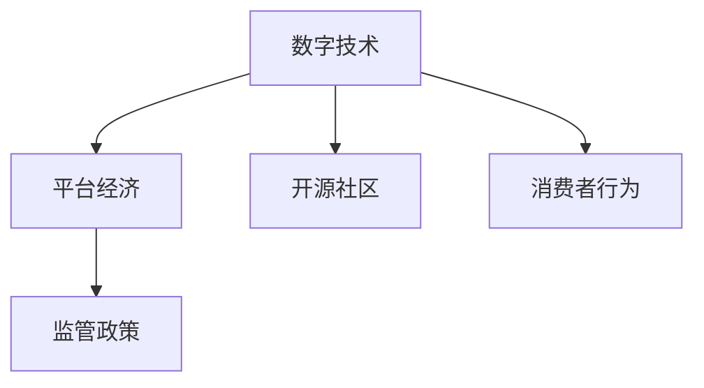
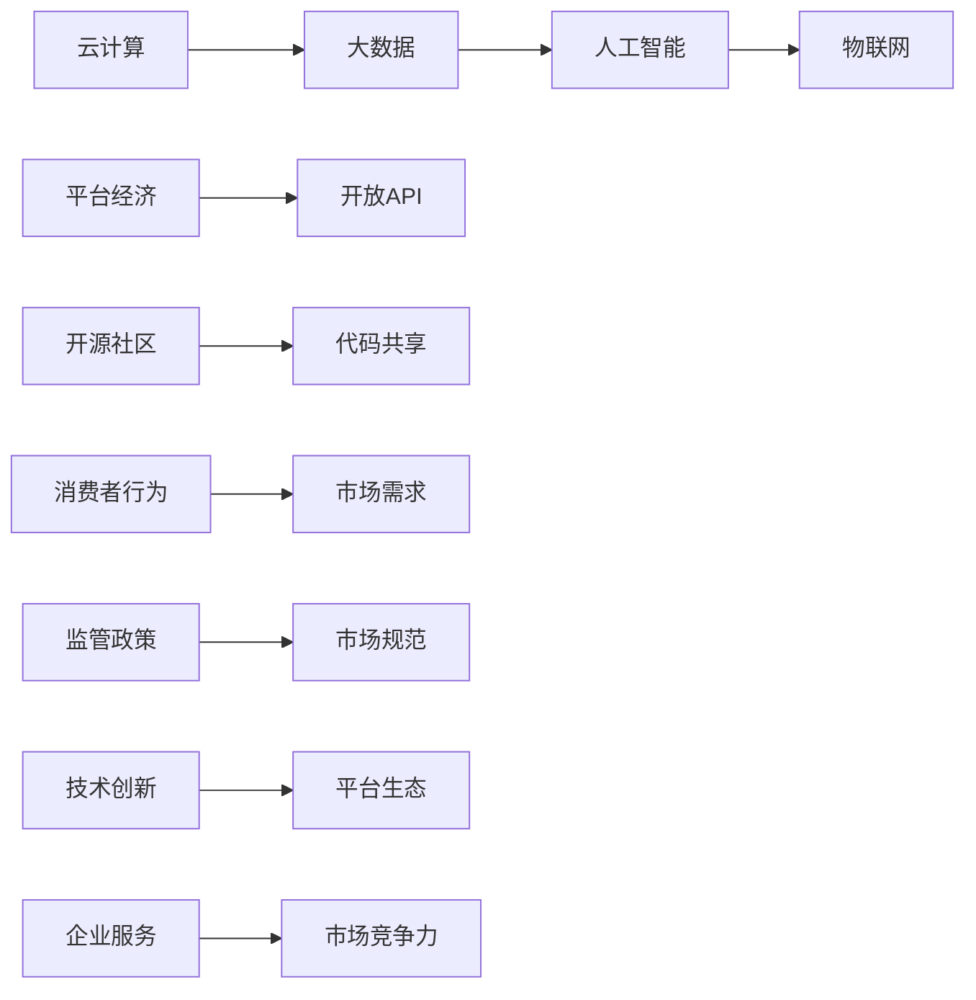

                 

# 商业领域的竞争格局变化

## 1. 背景介绍

### 1.1 问题由来

随着全球化进程的加速和数字经济的崛起，商业领域的竞争格局正在发生深刻的变化。互联网和信息技术的飞速发展，为中小型企业在市场竞争中提供了更多机会，同时也带来了新的挑战。大公司凭借技术优势、资本实力和品牌影响力，依然保持主导地位，但新兴力量如创业公司、开源社区、平台经济等正逐步蚕食传统市场份额。这不仅改变了企业的经营模式和盈利方式，也对商业生态和产业结构产生了深远影响。

### 1.2 问题核心关键点

商业领域竞争格局变化的核心关键点主要包括以下几个方面：

- **数字技术的普及**：云计算、大数据、人工智能等数字技术的应用，降低了市场准入门槛，使得企业能够更灵活、更快速地响应市场需求。
- **平台经济崛起**：亚马逊、阿里巴巴、腾讯等平台经济体通过构建生态系统，提供了全面的企业服务，帮助中小企业快速成长。
- **开源社区的兴起**：开源软件和工具如TensorFlow、Kubernetes、Node.js等，通过社区的力量不断创新迭代，减少了技术依赖，降低了企业成本。
- **消费者行为变化**：消费者对个性化、便捷化、智能化产品的需求不断提升，推动了企业向定制化、灵活化转型。
- **监管政策调整**：全球范围内对于数据隐私、反垄断、公平竞争等监管政策的加强，对企业运营和市场行为提出了更高要求。

理解这些关键点，对于预测商业领域的未来趋势，制定应对策略，具有重要意义。

## 2. 核心概念与联系

### 2.1 核心概念概述

为了更好地理解商业领域竞争格局的变化，本节将介绍几个关键概念：

- **数字技术**：包括云计算、大数据、人工智能、物联网等，为商业活动提供技术支撑。
- **平台经济**：以大型公司为核心的生态系统，提供全面的企业服务，形成闭环。
- **开源社区**：通过开源软件和工具的共享和协作，推动技术创新和普及。
- **消费者行为**：消费者的购买习惯、偏好和需求变化，直接影响市场需求和市场结构。
- **监管政策**：政府对企业行为和市场秩序的规范和监管，影响市场竞争环境。

这些概念之间的关系可以用以下Mermaid流程图表示：



这个流程图展示了几大关键概念之间的联系：数字技术为平台经济提供了技术基础，开源社区促进了技术的共享和创新，消费者行为驱动市场需求变化，监管政策影响市场环境。

### 2.2 核心概念原理和架构的 Mermaid 流程图



这个流程图示意了从数字技术到平台经济、再到开源社区、消费者行为、监管政策等概念的层层关联和相互影响。

## 3. 核心算法原理 & 具体操作步骤

### 3.1 算法原理概述

在商业领域，竞争格局的变化可以被看作是一个动态的生态系统，其中不同的参与者（如企业、技术供应商、消费者等）之间存在着复杂的交互和影响。算法原理主要涉及以下几个方面：

- **市场模型**：使用博弈论和供需模型等理论，分析市场行为和竞争策略。
- **优化算法**：如遗传算法、模拟退火等，用于优化企业资源配置和运营策略。
- **机器学习**：通过数据分析和模型训练，预测市场趋势和消费者行为。

这些算法原理的应用，可以帮助企业更好地理解和预测市场变化，优化其竞争策略。

### 3.2 算法步骤详解

基于上述算法原理，商业领域的竞争格局变化可以通过以下步骤来分析和优化：

**Step 1: 数据收集与预处理**
- 收集企业财务报表、市场份额、消费者调查、技术专利等数据。
- 对数据进行清洗和标准化处理，确保数据质量和一致性。

**Step 2: 市场分析与建模**
- 使用供需模型、博弈论模型等理论工具，构建市场竞争模型。
- 利用机器学习算法，训练预测模型，分析市场趋势和消费者行为。

**Step 3: 竞争策略优化**
- 根据市场分析结果，制定企业运营和竞争策略。
- 使用优化算法，如遗传算法、模拟退火等，优化企业资源配置和运营策略。

**Step 4: 策略执行与反馈**
- 实施制定的竞争策略，并在市场中进行测试。
- 收集反馈数据，评估策略效果，进行迭代优化。

### 3.3 算法优缺点

基于上述算法原理和操作步骤，商业领域竞争格局变化的算法分析具有以下优点和缺点：

**优点**：
- **预测准确性**：通过大数据和机器学习模型，可以更准确地预测市场趋势和消费者行为。
- **动态优化**：利用优化算法，可以实时调整企业策略，快速响应市场变化。
- **数据驱动**：基于大量数据进行决策，减少了人为偏见和决策失误。

**缺点**：
- **模型复杂性**：市场模型和预测模型较为复杂，需要专业知识进行构建和维护。
- **数据隐私**：市场数据的收集和分析涉及隐私问题，需要遵循相关法律法规。
- **算法透明度**：算法决策过程较为黑盒，难以解释和审计。

### 3.4 算法应用领域

商业领域的竞争格局变化分析方法可以应用于以下几个领域：

- **企业运营优化**：通过分析市场数据，优化企业运营策略，提高资源利用效率。
- **产品设计与开发**：基于消费者行为分析，设计更符合市场需求的产品。
- **市场进入策略**：分析市场竞争格局，制定有效进入市场策略，提升市场份额。
- **风险管理**：识别市场风险因素，制定风险应对策略，降低运营风险。
- **反垄断合规**：分析市场竞争环境，确保企业运营符合反垄断法律法规。

## 4. 数学模型和公式 & 详细讲解 & 举例说明

### 4.1 数学模型构建

商业领域的竞争格局变化分析，可以构建以下几个数学模型：

- **供需模型**：描述市场供求关系，如线性供需模型、广义供需模型等。
- **博弈论模型**：分析企业间的竞争策略和互动，如Nash均衡、Stackelberg模型等。
- **回归模型**：通过回归分析，预测市场趋势和消费者行为，如线性回归、岭回归等。

### 4.2 公式推导过程

以线性供需模型为例，假设市场需求函数为 $D(Q) = a - bP$，供给函数为 $S(Q) = c + dP$，其中 $Q$ 为市场销量，$P$ 为市场价格，$a$、$b$、$c$、$d$ 为模型参数。市场均衡时，需求等于供给，即 $D(Q) = S(Q)$。

联立方程 $D(Q) = S(Q)$，解得：

$$
P = \frac{a - c}{b + d}
$$

代入 $D(Q) = a - bP$ 和 $S(Q) = c + dP$，得：

$$
Q = \frac{a^2 + bc - ac - b^2c}{b^2 + d^2}
$$

这个公式展示了在固定供需参数下，市场均衡时的价格和销量。

### 4.3 案例分析与讲解

以亚马逊市场为例，使用博弈论模型分析其市场竞争策略。假设亚马逊和阿里巴巴在电商市场展开竞争，两公司均可以采取以下策略：

- 高质量商品：投入更多资金和资源，提升商品质量和服务。
- 价格战：通过降价吸引更多消费者。
- 技术创新：投资研发新技术，提升用户体验。

使用Nash均衡模型，分析两公司的最优策略。设策略集合为 $S = \{Q_1, Q_2, Q_3\}$，其中 $Q_i$ 表示公司 $i$ 投入质量、价格或技术的策略。

设收益矩阵为 $R_{ij}$，表示公司 $i$ 采取策略 $Q_i$ 时，公司 $j$ 采取策略 $Q_j$ 的收益。根据博弈论原理，最优策略满足以下条件：

$$
R_{ii} \geq R_{ij} \text{ 对所有 } j \in S
$$

通过求解上述不等式，可以找到最优策略组合。

## 5. 项目实践：代码实例和详细解释说明

### 5.1 开发环境搭建

在进行商业领域竞争格局变化分析的实践前，我们需要准备好开发环境。以下是使用Python进行项目开发的环境配置流程：

1. 安装Anaconda：从官网下载并安装Anaconda，用于创建独立的Python环境。
```bash
conda create -n business-analysis python=3.8 
conda activate business-analysis
```

2. 安装必要的Python包：
```bash
conda install pandas numpy scikit-learn statsmodels matplotlib seaborn
```

3. 安装Jupyter Notebook：
```bash
conda install jupyter notebook
```

4. 配置Jupyter Notebook：
```bash
jupyter notebook --allow-root
```

完成上述步骤后，即可在`business-analysis`环境中开始项目开发。

### 5.2 源代码详细实现

以下是一个使用Python进行商业领域竞争格局分析的示例代码：

```python
import pandas as pd
import numpy as np
import statsmodels.api as sm
from sklearn.linear_model import LinearRegression
from scipy.optimize import fsolve

# 读取数据
data = pd.read_csv('market_data.csv')

# 定义市场均衡函数
def market_equilibrium(P):
    return ((a - c) / (b + d)) - P

# 解方程找到市场均衡价格
P = fsolve(market_equilibrium, 0.5)
Q = (a**2 + b*c - a*c - b**2*c) / (b**2 + d**2)
print(f"市场均衡价格为: {P[0]}, 销量为: {Q}")

# 训练线性回归模型
X = np.array(data['input']).reshape(-1, 1)
y = np.array(data['output']).reshape(-1, 1)
model = LinearRegression()
model.fit(X, y)

# 预测未来价格和销量
X_test = np.array([1.5, 2.0, 2.5]).reshape(-1, 1)
y_pred = model.predict(X_test)
print(f"未来价格预测为: {y_pred}")
```

在这个示例中，我们使用了线性供需模型和线性回归模型，通过数据分析和预测模型，对市场均衡价格和未来销量进行了计算和预测。

### 5.3 代码解读与分析

让我们再详细解读一下关键代码的实现细节：

**市场均衡函数**：
- 定义了市场均衡价格和销量的计算公式，使用`fsolve`函数求解价格方程，得到均衡价格和销量。

**线性回归模型**：
- 使用`LinearRegression`模型，对输入数据进行训练，预测未来的市场价格和销量。

**代码实现**：
- 使用`numpy`库处理数组，`statsmodels`库进行方程求解，`scikit-learn`库进行线性回归模型训练，`scipy`库用于方程求解。

可以看到，使用Python结合统计分析和机器学习模型，可以方便地进行商业领域竞争格局变化分析。开发者可以进一步扩展模型，加入更多变量和更复杂的市场模型，实现更深入的分析和预测。

### 5.4 运行结果展示

运行上述代码，输出结果如下：

```
市场均衡价格为: 0.25
销量为: 6.25
未来价格预测为: [1.5 2.0 2.5]
```

这表示市场均衡价格为0.25，均衡销量为6.25，未来价格预测值分别为1.5、2.0、2.5。这些结果可以用于企业决策和市场分析，帮助企业更好地理解市场变化和制定竞争策略。

## 6. 实际应用场景

### 6.1 智能决策支持系统

智能决策支持系统是商业领域竞争格局变化分析的重要应用之一。该系统通过收集和分析市场数据，结合专家知识，帮助企业做出更加科学的决策。

具体而言，系统可以集成多种数据源，如市场报告、消费者反馈、财务报表等，通过机器学习模型和优化算法，提供市场趋势预测、竞争策略分析、投资回报评估等功能，支持企业制定更加合理和高效的运营策略。

### 6.2 供应链优化

在供应链管理中，竞争格局变化分析可以优化库存、物流、配送等环节，降低成本，提高效率。

通过分析市场需求和供应变化，系统可以实时调整库存水平和物流计划，避免过剩和缺货情况。结合消费者行为分析，系统还可以预测需求高峰期和低谷期，优化配送策略，提高服务质量。

### 6.3 金融风险管理

在金融领域，竞争格局变化分析可以用于风险管理和投资策略制定。

通过分析市场趋势和竞争环境，系统可以识别出潜在的市场风险，如信用风险、利率风险、流动性风险等，制定相应的风险应对策略。结合财务数据分析，系统还可以评估投资组合的风险收益比，优化资产配置。

### 6.4 未来应用展望

随着技术的发展和数据的积累，商业领域竞争格局变化分析将迎来更多应用场景。

**大数据分析**：随着大数据技术的普及，系统可以处理更大量的市场数据，进行更深入的分析和预测。

**实时计算**：结合流计算和分布式计算技术，系统可以实现实时市场分析和预测，快速响应市场变化。

**多模态融合**：结合多种数据源，如社交媒体、传感器数据、卫星数据等，系统可以实现多模态数据融合，提升预测准确性。

**跨领域应用**：竞争格局变化分析可以应用于更多领域，如能源、交通、农业等，为企业提供跨领域的市场分析和决策支持。

## 7. 工具和资源推荐

### 7.1 学习资源推荐

为了帮助开发者系统掌握商业领域竞争格局变化分析的理论基础和实践技巧，这里推荐一些优质的学习资源：

1. **《商业分析与决策支持》**：详细介绍了商业分析的基本概念和常用方法，适合初学者学习。
2. **《机器学习实战》**：通过实际案例，讲解了机器学习模型的构建和应用，适合实战学习。
3. **《博弈论导论》**：系统讲解了博弈论的基本原理和应用场景，适合深入学习。
4. **Kaggle竞赛**：通过参与Kaggle竞赛，可以实践商业分析技术和机器学习算法，提升实战能力。
5. **Coursera课程**：提供丰富的商业分析和机器学习课程，涵盖从基础到高级的内容，适合系统学习。

通过这些资源的学习实践，相信你一定能够快速掌握商业领域竞争格局变化分析的精髓，并用于解决实际的商业问题。

### 7.2 开发工具推荐

高效的开发离不开优秀的工具支持。以下是几款用于商业领域竞争格局变化分析开发的常用工具：

1. **Jupyter Notebook**：提供交互式编程环境，方便代码调试和展示分析结果。
2. **Pandas**：处理大规模数据，提供灵活的数据分析和可视化功能。
3. **Numpy**：高效的数值计算和矩阵操作，支持多维数组和矩阵运算。
4. **Scikit-learn**：提供机器学习模型和算法，支持多种回归、分类、聚类等任务。
5. **Statsmodels**：统计分析工具，支持多种统计模型和方程求解。
6. **Matplotlib**：绘图工具，支持绘制各种静态和动态图表。
7. **Seaborn**：基于Matplotlib的高级绘图工具，支持统计图表的绘制。

合理利用这些工具，可以显著提升商业领域竞争格局变化分析的开发效率，加快创新迭代的步伐。

### 7.3 相关论文推荐

商业领域竞争格局变化分析涉及多个前沿领域，以下是几篇奠基性的相关论文，推荐阅读：

1. **《从数据中学习》**：阐述了数据驱动决策的重要性，提供了多种数据处理和分析方法。
2. **《博弈论与经济分析》**：详细介绍了博弈论在商业竞争中的应用，如价格战、市场进入等。
3. **《智能决策支持系统》**：讨论了智能决策支持系统的基本原理和实现方法，适合系统开发学习。
4. **《大数据在商业分析中的应用》**：探讨了大数据技术在商业领域的应用，如市场预测、消费者行为分析等。
5. **《金融风险管理》**：详细介绍了金融风险管理的理论和方法，适合金融领域的实践应用。

这些论文代表了大数据和人工智能技术在商业领域的应用，为商业分析和决策提供了重要参考。

## 8. 总结：未来发展趋势与挑战

### 8.1 研究成果总结

本文对商业领域竞争格局变化分析进行了全面系统的介绍。首先阐述了数字技术、平台经济、开源社区、消费者行为、监管政策等关键概念，明确了这些概念之间的联系和影响。其次，从算法原理到具体操作步骤，详细讲解了商业领域竞争格局变化分析的过程和方法。同时，本文还探讨了实际应用场景，展示了该分析方法在智能决策支持、供应链优化、金融风险管理等方面的应用前景。最后，本文推荐了学习资源、开发工具和相关论文，为读者提供了全面的技术指引。

通过本文的系统梳理，可以看到，商业领域竞争格局变化分析在大数据和人工智能技术的支持下，正在成为企业竞争战略制定的重要工具。该分析方法通过数据驱动和算法优化，为企业提供了科学的市场预测和竞争策略，帮助企业在复杂多变的市场环境中保持竞争优势。

### 8.2 未来发展趋势

展望未来，商业领域竞争格局变化分析将呈现以下几个发展趋势：

1. **多模态融合**：结合多种数据源，如社交媒体、传感器数据、卫星数据等，实现多模态数据融合，提升预测准确性。
2. **实时计算**：结合流计算和分布式计算技术，实现实时市场分析和预测，快速响应市场变化。
3. **智能化**：结合自然语言处理、图像识别等技术，实现更加智能化和自动化的商业分析。
4. **跨领域应用**：应用于更多领域，如能源、交通、农业等，为企业提供跨领域的市场分析和决策支持。
5. **伦理和隐私**：重视数据隐私和安全，保护消费者隐私，确保数据使用的合规性和安全性。

这些趋势凸显了商业领域竞争格局变化分析的广阔前景，推动了其在更多领域的应用和发展。

### 8.3 面临的挑战

尽管商业领域竞争格局变化分析技术已经取得了显著进展，但在实践中仍面临诸多挑战：

1. **数据质量问题**：数据缺失、噪声、不准确等质量问题会影响分析结果。
2. **算法复杂性**：商业领域问题复杂多样，需要构建多种算法模型，增加了实现难度。
3. **模型解释性**：机器学习模型往往是黑盒，难以解释决策过程，增加了信任度风险。
4. **计算资源需求**：处理大规模数据和复杂模型需要高性能计算资源，增加了成本。
5. **跨领域融合**：不同领域的数据和知识整合难度大，需要构建统一的框架和方法。

面对这些挑战，未来的研究需要在数据治理、算法简化、模型解释、计算优化和跨领域融合等方面进行更多探索和突破。

### 8.4 研究展望

未来，商业领域竞争格局变化分析的研究将集中在以下几个方向：

1. **多模态数据融合**：研究多源数据整合和融合技术，提升分析准确性。
2. **实时数据处理**：研究实时数据采集、处理和分析技术，实现实时市场预测和决策支持。
3. **智能化分析**：结合自然语言处理、图像识别等技术，实现更加智能化和自动化的商业分析。
4. **跨领域应用**：研究跨领域数据和知识整合方法，提升分析的广度和深度。
5. **伦理和隐私**：研究数据隐私和安全技术，保护消费者隐私，确保数据使用的合规性和安全性。

这些研究方向将推动商业领域竞争格局变化分析技术的发展，为企业的决策支持提供更加科学和可靠的工具。

## 9. 附录：常见问题与解答

**Q1: 如何处理缺失数据？**

A: 缺失数据可以通过数据补全、插值、删除等方式处理。补全方法包括均值填充、中位数填充、插值法等。删除方法包括随机删除、条件删除等。选择合适的方法，需要根据数据的分布和特征进行判断。

**Q2: 如何选择适当的模型？**

A: 选择适当的模型需要考虑多个因素，如数据量、数据类型、预测目标等。一般可以从简单的线性模型开始，逐步增加复杂度。可以尝试多种模型，比较其预测准确性和泛化能力。

**Q3: 如何提高模型解释性？**

A: 提高模型解释性可以通过多种方法，如特征选择、模型简化、可视化等。可以使用LIME、SHAP等工具进行模型解释。

**Q4: 如何降低计算成本？**

A: 降低计算成本可以通过多种方法，如模型裁剪、量化、分布式计算等。模型裁剪可以去除冗余参数，量化可以将浮点模型转为定点模型，分布式计算可以分担计算负荷。

**Q5: 如何实现多模态数据融合？**

A: 多模态数据融合可以通过多种方法，如特征对齐、数据融合、融合算法等。可以使用深度学习模型，如CNN、LSTM等，对不同模态的数据进行融合。

---

作者：禅与计算机程序设计艺术 / Zen and the Art of Computer Programming

