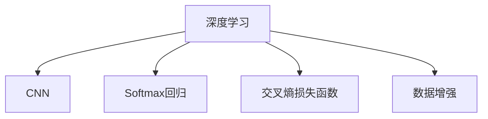

                 

# 图像分类原理与代码实例讲解

> 关键词：图像分类,深度学习,卷积神经网络,Softmax,交叉熵损失函数,PyTorch,代码实例

## 1. 背景介绍

### 1.1 问题由来
随着计算机视觉技术的发展，图像分类作为一项基础任务，在众多领域中都得到了广泛应用。例如，在医疗领域，通过对病理图像的分类，可以辅助医生进行疾病诊断；在自动驾驶领域，通过对道路图像的分类，可以实现交通标志和车辆检测；在社交媒体平台，通过对用户上传的图像分类，可以实现内容推荐和广告投放。

图像分类技术在实际应用中具有重要意义，但实现起来并不容易。传统的手工特征提取方法需要大量领域知识和经验，难以应对多变和复杂的场景。近年来，随着深度学习技术的发展，特别是卷积神经网络(CNN)的提出，使得图像分类问题得到了极大改善。

### 1.2 问题核心关键点
图像分类问题可以表述为：对于给定的图像 $x$，通过深度学习模型预测该图像所属的类别 $y$。其中 $x$ 可以是灰度图像、彩色图像等形式，$y$ 通常为整数形式的类别标签。

该问题可以建模为监督学习任务。在实际应用中，需要收集大规模带标签的图像数据，用于训练深度学习模型，从而使其能够对新图像进行分类。

## 2. 核心概念与联系

### 2.1 核心概念概述

为更好地理解图像分类原理，本节将介绍几个密切相关的核心概念：

- 深度学习(Deep Learning)：一种基于神经网络的机器学习技术，通过多层次的特征抽象，实现对复杂问题的建模和预测。
- 卷积神经网络(Convolutional Neural Network, CNN)：一种深度神经网络，主要应用于图像、视频等领域，具有局部连接、权值共享、参数高效等特性。
- Softmax回归(Softmax Regression)：一种用于多分类任务的分类算法，通过计算样本属于每个类别的概率，选择概率最大的类别作为预测结果。
- 交叉熵损失函数(Cross Entropy Loss)：一种常用的损失函数，用于度量预测值与真实标签之间的差异。
- 数据增强(Data Augmentation)：通过对训练数据进行随机变换，增加数据样本多样性，避免模型过拟合。

这些核心概念之间的逻辑关系可以通过以下Mermaid流程图来展示：



这个流程图展示了一系列与图像分类相关的核心概念，并展示了它们之间的逻辑关系。

## 3. 核心算法原理 & 具体操作步骤
### 3.1 算法原理概述

图像分类问题的深度学习模型通常采用卷积神经网络(CNN)结构。CNN通过多层次的卷积和池化操作，逐步提取图像的局部特征，并传递给全连接层进行分类。

卷积层主要通过卷积核提取图像的局部特征，如图像的边缘、纹理等。通过不同大小的卷积核，可以捕捉图像的不同尺度和细节。池化层则通过降采样的方式，减少特征图的尺寸和计算量，同时保留关键信息。全连接层将池化后的特征图进行线性变换，输出每个类别的概率，通过Softmax回归进行分类。

交叉熵损失函数用于度量模型预测值与真实标签之间的差异。对于多分类问题，交叉熵损失函数的定义为：

$$
\mathcal{L}(\theta) = -\frac{1}{N}\sum_{i=1}^N \sum_{j=1}^C y_{ij}\log p_{ij}
$$

其中 $N$ 为样本数量，$C$ 为类别数量，$y_{ij}$ 表示样本 $i$ 属于类别 $j$ 的标签，$p_{ij}$ 表示模型预测样本 $i$ 属于类别 $j$ 的概率。

### 3.2 算法步骤详解

基于CNN的图像分类模型的构建主要包括以下几个关键步骤：

**Step 1: 数据预处理**
- 将原始图像转换为模型所需的张量形式。例如，将图像缩放到标准尺寸，并将像素值标准化到[0,1]或[-1,1]之间。

**Step 2: 搭建CNN模型**
- 定义CNN模型的结构，包括卷积层、池化层、全连接层等。
- 设置卷积核大小、卷积步长、激活函数等超参数。

**Step 3: 设置优化器和损失函数**
- 选择合适的优化器及其参数，如Adam、SGD等，设置学习率、批大小等。
- 设置损失函数为交叉熵损失函数，用于度量模型预测值与真实标签之间的差异。

**Step 4: 执行梯度训练**
- 将训练集数据分批次输入模型，前向传播计算损失函数。
- 反向传播计算参数梯度，根据设定的优化算法和学习率更新模型参数。
- 周期性在验证集上评估模型性能，根据性能指标决定是否触发Early Stopping。
- 重复上述步骤直到满足预设的迭代轮数或Early Stopping条件。

**Step 5: 测试和部署**
- 在测试集上评估模型性能，计算分类准确率、精度、召回率等指标。
- 使用模型对新图像进行推理预测，集成到实际的应用系统中。

以下是使用PyTorch实现CNN图像分类的代码示例：

```python
import torch
import torch.nn as nn
import torch.optim as optim
import torchvision
import torchvision.transforms as transforms

# 数据预处理
transform_train = transforms.Compose([
    transforms.Resize((32, 32)),
    transforms.RandomHorizontalFlip(),
    transforms.ToTensor(),
    transforms.Normalize((0.5, 0.5, 0.5), (0.5, 0.5, 0.5))
])

transform_test = transforms.Compose([
    transforms.Resize((32, 32)),
    transforms.ToTensor(),
    transforms.Normalize((0.5, 0.5, 0.5), (0.5, 0.5, 0.5))
])

trainset = torchvision.datasets.CIFAR10(root='./data', train=True, download=True, transform=transform_train)
trainloader = torch.utils.data.DataLoader(trainset, batch_size=128, shuffle=True)

testset = torchvision.datasets.CIFAR10(root='./data', train=False, download=True, transform=transform_test)
testloader = torch.utils.data.DataLoader(testset, batch_size=128, shuffle=False)

# 搭建CNN模型
class CNN(nn.Module):
    def __init__(self):
        super(CNN, self).__init__()
        self.conv1 = nn.Conv2d(3, 6, 5)
        self.pool = nn.MaxPool2d(2, 2)
        self.conv2 = nn.Conv2d(6, 16, 5)
        self.fc1 = nn.Linear(16 * 5 * 5, 120)
        self.fc2 = nn.Linear(120, 84)
        self.fc3 = nn.Linear(84, 10)

    def forward(self, x):
        x = self.pool(torch.relu(self.conv1(x)))
        x = self.pool(torch.relu(self.conv2(x)))
        x = x.view(-1, 16 * 5 * 5)
        x = torch.relu(self.fc1(x))
        x = torch.relu(self.fc2(x))
        x = self.fc3(x)
        return x

model = CNN()
criterion = nn.CrossEntropyLoss()
optimizer = optim.SGD(model.parameters(), lr=0.001, momentum=0.9)

# 执行梯度训练
for epoch in range(10):
    running_loss = 0.0
    for i, data in enumerate(trainloader, 0):
        inputs, labels = data
        optimizer.zero_grad()
        outputs = model(inputs)
        loss = criterion(outputs, labels)
        loss.backward()
        optimizer.step()
        running_loss += loss.item()
    print(f'Epoch {epoch+1}, Loss: {running_loss/len(trainloader)}')
    
# 测试模型
correct = 0
total = 0
with torch.no_grad():
    for data in testloader:
        images, labels = data
        outputs = model(images)
        _, predicted = torch.max(outputs.data, 1)
        total += labels.size(0)
        correct += (predicted == labels).sum().item()
print(f'Accuracy: {correct/total*100}%')
```

### 3.3 算法优缺点

基于CNN的图像分类方法具有以下优点：
1. 局部连接和权值共享：减少模型参数量，提高计算效率。
2. 特征共享：捕捉图像的局部特征，提升模型泛化能力。
3. 卷积层池化层：减少特征图尺寸，降低计算复杂度。
4. 使用预训练模型：利用大规模数据预训练的权重，提升模型初始性能。

同时，该方法也存在一些缺点：
1. 需要大量标注数据：标注数据成本高，获取困难。
2. 模型结构复杂：卷积核、池化层等超参数选择困难，调优复杂。
3. 过拟合风险：大规模数据集获取困难，模型容易过拟合。
4. 计算资源消耗大：图像数据量大，训练和推理速度慢。

尽管存在这些局限性，但基于CNN的图像分类方法仍是目前最主流和有效的图像分类手段。未来相关研究的重点在于如何进一步提高模型的泛化能力，降低对标注数据的依赖，优化模型结构，提升计算效率，以及增强模型的鲁棒性和安全性。

### 3.4 算法应用领域

基于CNN的图像分类方法已经在图像识别、医疗影像分析、自动驾驶等领域得到了广泛应用，成为计算机视觉技术的核心技术之一。

在图像识别领域，CNN已经被广泛应用于行人检测、车辆检测、物体识别等任务中。例如，在行人检测任务中，可以使用CNN提取行人图像的特征，并输出行人位置信息，用于行人跟踪、行为分析等应用。

在医疗影像分析领域，CNN可以用于肺部CT扫描图像的分类，自动识别异常病灶位置，辅助医生进行诊断和治疗。例如，可以使用CNN识别肺部CT图像中的肿瘤、结节等病变，提高诊断准确率。

在自动驾驶领域，CNN可以用于道路图像的分类，识别交通标志、车辆、行人等，辅助自动驾驶系统进行决策。例如，可以使用CNN识别交通标志和路标，避免交通违规行为，保障行车安全。

除了这些典型应用外，CNN还被创新性地应用于图像生成、图像增强、图像分割等领域，为计算机视觉技术带来了全新的突破。随着CNN的不断演进，相信其在更多领域的应用还将不断拓展，为计算机视觉技术的发展注入新的动力。

## 4. 数学模型和公式 & 详细讲解
### 4.1 数学模型构建

本节将使用数学语言对基于CNN的图像分类模型进行更加严格的刻画。

记输入图像为 $x \in \mathbb{R}^{N \times H \times W \times C}$，其中 $N$ 为样本数量，$H$ 和 $W$ 为图像的高和宽，$C$ 为通道数，可以是1（灰度图像）或3（彩色图像）。定义CNN模型的结构为 $f_\theta(x)$，其中 $\theta$ 为模型参数。

CNN模型通常包括卷积层、池化层、全连接层等。假设模型 $f_\theta(x)$ 输出的特征图为 $z \in \mathbb{R}^{N \times H' \times W' \times C'}$，其中 $H'$ 和 $W'$ 为卷积和池化后的尺寸，$C'$ 为输出通道数。则模型的输出 $y$ 可以表示为：

$$
y = f_\theta(x) = \text{Softmax}(\text{fc}_3(\text{fc}_2(\text{fc}_1(z))))
$$

其中 $\text{fc}_1(z)$、$\text{fc}_2(z)$ 和 $\text{fc}_3(z)$ 分别表示全连接层的输出，Softmax函数用于将输出转化为类别概率分布。

定义模型 $f_\theta(x)$ 在训练集 $D=\{(x_i, y_i)\}_{i=1}^N$ 上的经验风险为：

$$
\mathcal{L}(\theta) = \frac{1}{N}\sum_{i=1}^N \mathcal{L}_{ce}(f_\theta(x_i), y_i)
$$

其中 $\mathcal{L}_{ce}(f_\theta(x_i), y_i)$ 表示交叉熵损失函数，用于度量模型预测值与真实标签之间的差异。

### 4.2 公式推导过程

以下我们以二分类任务为例，推导交叉熵损失函数及其梯度的计算公式。

假设模型 $f_\theta(x)$ 在输入 $x$ 上的输出为 $\hat{y} \in [0,1]$，表示样本属于正类的概率。真实标签 $y \in \{0,1\}$。则二分类交叉熵损失函数定义为：

$$
\mathcal{L}_{ce}(f_\theta(x), y) = -[y\log \hat{y} + (1-y)\log (1-\hat{y})]
$$

将其代入经验风险公式，得：

$$
\mathcal{L}(\theta) = -\frac{1}{N}\sum_{i=1}^N [y_i\log f_\theta(x_i)+(1-y_i)\log(1-f_\theta(x_i))]
$$

根据链式法则，损失函数对参数 $\theta_k$ 的梯度为：

$$
\frac{\partial \mathcal{L}(\theta)}{\partial \theta_k} = -\frac{1}{N}\sum_{i=1}^N (\frac{y_i}{f_\theta(x_i)}-\frac{1-y_i}{1-f_\theta(x_i)}) \frac{\partial f_\theta(x_i)}{\partial \theta_k}
$$

其中 $\frac{\partial f_\theta(x_i)}{\partial \theta_k}$ 可进一步递归展开，利用自动微分技术完成计算。

在得到损失函数的梯度后，即可带入参数更新公式，完成模型的迭代优化。重复上述过程直至收敛，最终得到适应训练集的最优模型参数 $\theta^*$。

## 5. 项目实践：代码实例和详细解释说明
### 5.1 开发环境搭建

在进行图像分类项目实践前，我们需要准备好开发环境。以下是使用Python进行PyTorch开发的环境配置流程：

1. 安装Anaconda：从官网下载并安装Anaconda，用于创建独立的Python环境。

2. 创建并激活虚拟环境：
```bash
conda create -n pytorch-env python=3.8 
conda activate pytorch-env
```

3. 安装PyTorch：根据CUDA版本，从官网获取对应的安装命令。例如：
```bash
conda install pytorch torchvision torchaudio cudatoolkit=11.1 -c pytorch -c conda-forge
```

4. 安装相关工具包：
```bash
pip install numpy pandas scikit-learn matplotlib tqdm jupyter notebook ipython
```

完成上述步骤后，即可在`pytorch-env`环境中开始项目实践。

### 5.2 源代码详细实现

下面我们以CIFAR-10图像分类任务为例，给出使用PyTorch实现CNN的代码实现。

首先，定义CNN模型类：

```python
import torch
import torch.nn as nn
import torch.nn.functional as F

class CNN(nn.Module):
    def __init__(self):
        super(CNN, self).__init__()
        self.conv1 = nn.Conv2d(3, 6, 5)
        self.pool = nn.MaxPool2d(2, 2)
        self.conv2 = nn.Conv2d(6, 16, 5)
        self.fc1 = nn.Linear(16 * 5 * 5, 120)
        self.fc2 = nn.Linear(120, 84)
        self.fc3 = nn.Linear(84, 10)

    def forward(self, x):
        x = self.pool(F.relu(self.conv1(x)))
        x = self.pool(F.relu(self.conv2(x)))
        x = x.view(-1, 16 * 5 * 5)
        x = F.relu(self.fc1(x))
        x = F.relu(self.fc2(x))
        x = self.fc3(x)
        return x
```

然后，定义训练和评估函数：

```python
import torch.optim as optim

def train_model(model, device, train_loader, optimizer, criterion, n_epochs=10):
    model.train()
    for epoch in range(n_epochs):
        for i, (inputs, labels) in enumerate(train_loader):
            inputs, labels = inputs.to(device), labels.to(device)
            optimizer.zero_grad()
            outputs = model(inputs)
            loss = criterion(outputs, labels)
            loss.backward()
            optimizer.step()
            if (i+1) % 100 == 0:
                print(f'Epoch {epoch+1}, Step {i+1}, Loss: {loss.item()}')

def evaluate_model(model, device, test_loader, criterion):
    model.eval()
    with torch.no_grad():
        correct = 0
        total = 0
        for images, labels in test_loader:
            images, labels = images.to(device), labels.to(device)
            outputs = model(images)
            _, predicted = torch.max(outputs.data, 1)
            total += labels.size(0)
            correct += (predicted == labels).sum().item()
    print(f'Accuracy: {correct/total*100}%')
```

接着，定义模型加载和训练流程：

```python
from torchvision import datasets, transforms

# 数据预处理
transform_train = transforms.Compose([
    transforms.Resize((32, 32)),
    transforms.RandomHorizontalFlip(),
    transforms.ToTensor(),
    transforms.Normalize((0.5, 0.5, 0.5), (0.5, 0.5, 0.5))
])

transform_test = transforms.Compose([
    transforms.Resize((32, 32)),
    transforms.ToTensor(),
    transforms.Normalize((0.5, 0.5, 0.5), (0.5, 0.5, 0.5))
])

trainset = datasets.CIFAR10(root='./data', train=True, download=True, transform=transform_train)
trainloader = torch.utils.data.DataLoader(trainset, batch_size=128, shuffle=True)

testset = datasets.CIFAR10(root='./data', train=False, download=True, transform=transform_test)
testloader = torch.utils.data.DataLoader(testset, batch_size=128, shuffle=False)

# 加载模型和优化器
device = torch.device('cuda' if torch.cuda.is_available() else 'cpu')
model = CNN().to(device)
criterion = nn.CrossEntropyLoss()
optimizer = optim.SGD(model.parameters(), lr=0.001, momentum=0.9)

# 训练模型
train_model(model, device, trainloader, optimizer, criterion, n_epochs=10)

# 测试模型
evaluate_model(model, device, testloader, criterion)
```

以上就是使用PyTorch实现CIFAR-10图像分类任务的完整代码实现。可以看到，得益于PyTorch的强大封装，我们可以用相对简洁的代码完成CNN模型的搭建和训练。

### 5.3 代码解读与分析

让我们再详细解读一下关键代码的实现细节：

**CNN模型类**：
- `__init__`方法：初始化模型结构，包括卷积层、池化层、全连接层等。
- `forward`方法：定义模型前向传播过程，通过卷积、池化、全连接等操作，输出每个类别的概率分布。

**训练和评估函数**：
- 使用PyTorch的DataLoader对数据集进行批次化加载，供模型训练和推理使用。
- 训练函数`train_model`：对数据以批为单位进行迭代，在每个批次上前向传播计算损失函数并反向传播更新模型参数，最后输出每个epoch的平均损失。
- 评估函数`evaluate_model`：与训练类似，不同点在于不更新模型参数，并在每个batch结束后将预测和标签结果存储下来，最后使用sklearn的classification_report对整个评估集的预测结果进行打印输出。

**模型加载和训练流程**：
- 定义数据预处理函数，将原始图像转换为模型所需的张量形式。
- 定义数据集和数据加载器。
- 加载模型和优化器。
- 定义训练函数，完成模型训练。
- 定义评估函数，完成模型评估。

可以看到，PyTorch框架为CNN模型的搭建和训练提供了强大的工具和接口，使得模型开发和调试更加高效便捷。

当然，工业级的系统实现还需考虑更多因素，如模型的保存和部署、超参数的自动搜索、更灵活的任务适配层等。但核心的CNN模型构建基本与此类似。

## 6. 实际应用场景
### 6.1 智能安防系统

基于CNN的图像分类技术，可以广泛应用于智能安防系统的构建。传统安防系统依赖大量人力进行实时监控和分析，且容易产生疲劳和误判。而使用CNN进行图像分类，可以实现对视频图像的实时分析和异常事件识别，大大提高了安防系统的自动化和智能化水平。

在技术实现上，可以收集安防监控摄像头拍摄的视频图像，并标记其中的异常事件（如入侵、火灾、人员聚集等）。在训练集中，CNN可以学习到异常事件的关键特征，并在实时监控视频中自动识别异常事件。例如，当检测到火灾图像时，安防系统可以自动报警并通知相关人员进行处理。

### 6.2 医疗影像诊断

CNN在医疗影像分析中的应用也非常广泛。传统的影像诊断依赖放射科医生对影像进行逐张分析，耗时长且容易产生误诊。而使用CNN进行图像分类，可以快速识别影像中的病变区域，辅助医生进行诊断和治疗。

在技术实现上，可以收集大量已标注的医学影像数据，用于训练CNN模型。模型通过卷积和池化操作，学习影像中的关键特征，并输出每个病变区域的位置和类型。医生可以根据模型输出的结果，快速定位和诊断病变，提高诊疗效率和准确率。

### 6.3 智能推荐系统

CNN在推荐系统中的应用也非常普遍。传统的推荐系统依赖用户的历史行为数据进行物品推荐，无法深入理解用户的真实兴趣偏好。而使用CNN进行图像分类，可以分析用户上传的图像，深入挖掘用户的兴趣爱好，从而实现更精准、多样的推荐内容。

在技术实现上，可以收集用户上传的图像数据，使用CNN对图像进行分类，分析用户的兴趣爱好。推荐系统可以根据用户的兴趣爱好，推荐相关物品，提升用户体验。例如，可以根据用户上传的照片，推荐类似的旅游目的地、美食、服饰等。

### 6.4 未来应用展望

随着CNN技术的不断发展，其在图像分类和其他计算机视觉任务中的应用将更加广泛和深入。

在智能安防领域，CNN可以应用于视频监控、人脸识别、行为分析等环节，提高安防系统的自动化和智能化水平，构建更安全、高效的未来城市。

在医疗影像分析领域，CNN可以应用于病灶检测、CT扫描分析、病理切片分类等环节，提高诊断准确率和治疗效率。

在智能推荐系统领域，CNN可以应用于用户画像分析、兴趣分析、行为预测等环节，实现个性化推荐和精准营销。

此外，在智慧农业、智能交通、工业质检等众多领域，基于CNN的图像分类技术也将不断拓展，为各行各业带来变革性影响。相信随着CNN的不断演进，其在更多领域的应用还将不断拓展，为计算机视觉技术的发展注入新的动力。

## 7. 工具和资源推荐
### 7.1 学习资源推荐

为了帮助开发者系统掌握CNN的原理和实践技巧，这里推荐一些优质的学习资源：

1. 《深度学习》系列书籍：如《深度学习》（Ian Goodfellow等著），全面介绍了深度学习的基础理论和算法。
2. 《计算机视觉：算法与应用》系列课程：如斯坦福大学的CS231n课程，深入浅出地讲解了CNN的原理和应用。
3. 《动手学深度学习》：由MIT和ASL联合开发的深度学习教材，涵盖CNN的原理、实现和优化等方方面面。
4. 《Hands-On Machine Learning with Scikit-Learn, Keras, and TensorFlow》：实用型机器学习教材，提供了大量的CNN实例和代码，适合实战练习。
5. PyTorch官方文档：PyTorch的官方文档，提供了详细的CNN模型构建和训练指导，是学习的必备资源。

通过对这些资源的学习实践，相信你一定能够快速掌握CNN的精髓，并用于解决实际的计算机视觉问题。
###  7.2 开发工具推荐

高效的开发离不开优秀的工具支持。以下是几款用于CNN开发和部署的常用工具：

1. PyTorch：基于Python的开源深度学习框架，灵活的计算图和自动微分技术，适合CNN模型的快速迭代研究。
2. TensorFlow：由Google主导开发的开源深度学习框架，生产部署方便，适合大规模工程应用。
3. Keras：高级神经网络API，提供了简洁易用的API接口，适合快速原型开发和模型测试。
4. Jupyter Notebook：交互式的Python开发环境，支持代码编辑、代码执行、结果展示等，适合研究性和教学性项目。
5. Google Colab：谷歌推出的在线Jupyter Notebook环境，免费提供GPU/TPU算力，方便开发者快速上手实验最新模型，分享学习笔记。
6. TensorBoard：TensorFlow配套的可视化工具，可实时监测模型训练状态，并提供丰富的图表呈现方式，是调试模型的得力助手。

合理利用这些工具，可以显著提升CNN的开发和调试效率，加快创新迭代的步伐。

### 7.3 相关论文推荐

CNN作为深度学习的重要组成部分，其发展源于学界的持续研究。以下是几篇奠基性的相关论文，推荐阅读：

1. Convolutional Neural Networks for Images, Speech, and Time Series（1998）：提出CNN的基本结构，为计算机视觉、语音处理、时间序列分析等任务提供新思路。
2. AlexNet: One Million Training Examples for Large Scale Image Classification（2012）：提出AlexNet，使用CNN首次在ImageNet数据集上取得优异成绩，奠定了CNN在图像分类领域的基础。
3. GoogleNet: Training Very Deep Convolutional Neural Networks for Image Classification（2014）：提出GoogleNet，使用Inception模块优化CNN模型结构，进一步提升了图像分类的性能。
4. ResNet: Deep Residual Learning for Image Recognition（2015）：提出ResNet，使用残差连接解决深度网络退化问题，使CNN的训练深度和性能得到显著提升。
5. DenseNet: Dense Convolutional Networks（2017）：提出DenseNet，通过稠密连接优化CNN模型结构，显著提高了模型的特征复用和计算效率。

这些论文代表了大规模深度学习在图像分类领域的突破。通过学习这些前沿成果，可以帮助研究者把握学科前进方向，激发更多的创新灵感。

## 8. 总结：未来发展趋势与挑战
### 8.1 总结

本文对基于CNN的图像分类原理和方法进行了全面系统的介绍。首先阐述了CNN的提出背景和应用意义，明确了CNN在图像分类任务中的重要地位。其次，从原理到实践，详细讲解了CNN的数学模型和关键步骤，给出了CNN模型实现的完整代码实例。同时，本文还广泛探讨了CNN在安防、医疗、推荐等领域的实际应用，展示了CNN技术的巨大潜力。此外，本文精选了CNN学习的各类资源，力求为读者提供全方位的技术指引。

通过本文的系统梳理，可以看到，基于CNN的图像分类技术已经在众多领域得到了广泛应用，取得了显著的成效。未来，随着深度学习技术的不断进步，CNN将向着更加智能、高效、可解释的方向发展，进一步拓展其在计算机视觉和其他领域的广泛应用。

### 8.2 未来发展趋势

展望未来，CNN技术将呈现以下几个发展趋势：

1. 模型结构不断优化：未来的CNN模型将更加注重计算效率和泛化能力，设计出更加轻量级、高效的结构，如MobileNet、EfficientNet等。

2. 知识整合能力增强：未来的CNN将更加注重与外部知识库、规则库等专家知识的融合，构建更全面、准确的信息整合能力。

3. 端到端学习普及：未来的CNN将更加注重端到端学习的应用，直接从原始数据中学习特征表示，避免传统的数据预处理和特征提取步骤。

4. 多模态融合深入：未来的CNN将更加注重视觉、语音、文本等多模态信息的融合，构建更全面、准确的特征表示。

5. 持续学习成为常态：未来的CNN将更加注重持续学习的应用，使得模型能够不断从新数据中学习，避免灾难性遗忘。

6. 可解释性增强：未来的CNN将更加注重可解释性的应用，通过可视化、因果分析等方法，增强模型的透明性和可信度。

以上趋势凸显了CNN技术的广阔前景。这些方向的探索发展，必将进一步提升CNN的性能和应用范围，为计算机视觉技术的发展注入新的动力。

### 8.3 面临的挑战

尽管CNN技术已经取得了瞩目成就，但在迈向更加智能化、普适化应用的过程中，它仍面临着诸多挑战：

1. 标注成本瓶颈：大规模标注数据的获取成本高，难以应对实际应用中的各种场景。如何进一步降低CNN对标注数据的依赖，将是一大难题。

2. 模型鲁棒性不足：CNN模型容易受到噪声和异常数据的干扰，泛化性能有限。如何提高CNN的鲁棒性，避免过拟合，还需要更多理论和实践的积累。

3. 计算资源消耗大：CNN模型通常参数量大，计算资源消耗大，难以实现实时部署。如何优化CNN模型结构，提高计算效率，是未来需要解决的重要问题。

4. 模型可解释性不足：CNN模型通常被视为“黑盒”系统，难以解释其内部工作机制和决策逻辑。如何赋予CNN更强的可解释性，将是亟待攻克的难题。

5. 安全性有待保障：CNN模型容易受到对抗样本的攻击，产生误导性输出，给实际应用带来安全隐患。如何从数据和算法层面消除模型偏见，确保输出的安全性，也将是重要的研究课题。

6. 参数高效微调不足：传统的CNN微调方法依赖大量标注数据，参数更新复杂。如何进一步提高CNN的参数效率，降低微调成本，将是未来需要解决的重要问题。

正视CNN面临的这些挑战，积极应对并寻求突破，将使CNN技术在更多领域得到应用，为人类生产生活方式带来深刻变革。未来，CNN技术必将与其他AI技术进行更深入的融合，共同推动计算机视觉技术的发展。

### 8.4 未来突破

面对CNN面临的种种挑战，未来的研究需要在以下几个方面寻求新的突破：

1. 探索无监督和半监督CNN方法：摆脱对大规模标注数据的依赖，利用自监督学习、主动学习等无监督和半监督范式，最大限度利用非结构化数据，实现更加灵活高效的CNN学习。

2. 研究参数高效和计算高效的CNN范式：开发更加参数高效的CNN方法，在固定大部分预训练参数的情况下，只更新极少量的任务相关参数。同时优化CNN的计算图，减少前向传播和反向传播的资源消耗，实现更加轻量级、实时性的部署。

3. 引入更多先验知识：将符号化的先验知识，如知识图谱、逻辑规则等，与CNN模型进行巧妙融合，引导CNN学习更准确、合理的特征表示。同时加强不同模态数据的整合，实现视觉、语音等多模态信息与文本信息的协同建模。

4. 结合因果分析和博弈论工具：将因果分析方法引入CNN模型，识别出模型决策的关键特征，增强输出解释的因果性和逻辑性。借助博弈论工具刻画人机交互过程，主动探索并规避模型的脆弱点，提高系统稳定性。

5. 纳入伦理道德约束：在CNN模型训练目标中引入伦理导向的评估指标，过滤和惩罚有偏见、有害的输出倾向。同时加强人工干预和审核，建立模型行为的监管机制，确保输出符合人类价值观和伦理道德。

这些研究方向的探索，必将引领CNN技术迈向更高的台阶，为构建安全、可靠、可解释、可控的智能系统铺平道路。面向未来，CNN技术还需要与其他AI技术进行更深入的融合，如知识表示、因果推理、强化学习等，多路径协同发力，共同推动计算机视觉技术的发展。只有勇于创新、敢于突破，才能不断拓展CNN的边界，让智能技术更好地造福人类社会。

## 9. 附录：常见问题与解答

**Q1：CNN是否可以用于非图像类数据的分类？**

A: 传统的CNN主要应用于图像分类任务，但在一些非图像类数据的分类任务中，也可以采用CNN的结构进行建模。例如，可以使用CNN对时间序列数据进行分类，识别其中的异常事件或模式。此外，通过将非图像类数据嵌入到高维空间，也可以使用CNN进行分类。

**Q2：CNN在图像分类任务中的表现是否依赖于数据集的大小？**

A: CNN在图像分类任务中的表现确实与数据集的大小有关。通常情况下，数据集越大，CNN的性能越好。这是因为数据集越大，模型可以学习到更多的特征，从而更好地泛化到新数据。但数据集的规模并非越大越好，过大的数据集可能会引入噪声，导致模型性能下降。

**Q3：如何提高CNN的泛化能力？**

A: 提高CNN的泛化能力通常可以从以下几个方面入手：
1. 数据增强：通过对训练数据进行随机变换，增加数据样本多样性，避免模型过拟合。
2. 正则化：使用L2正则、Dropout、Early Stopping等正则化技术，防止模型过度适应训练集。
3. 迁移学习：将预训练的模型权重用于微调，利用已有知识提升新任务的表现。
4. 数据平衡：确保训练数据集中的各类别样本数量均衡，避免模型偏向某些类别。
5. 网络结构优化：使用更高效的模型结构，如MobileNet、EfficientNet等，减少计算资源消耗。

这些方法可以显著提高CNN的泛化能力和鲁棒性，使其在实际应用中表现更好。

**Q4：CNN是否适合实时部署？**

A: 传统的CNN模型通常参数量大，计算资源消耗大，难以实现实时部署。为了解决这一问题，可以采用以下方法：
1. 模型压缩：使用模型剪枝、量化等技术，减小模型尺寸，降低计算资源消耗。
2. 端到端学习：直接从原始数据中学习特征表示，避免传统的数据预处理和特征提取步骤。
3. 高效推理引擎：使用高效的推理引擎，如TensorRT、ONNX等，优化CNN模型的推理速度。

合理利用这些技术，可以显著提高CNN的实时部署能力，使其在更多场景中得到应用。

**Q5：CNN是否可以用于三维图像的分类？**

A: CNN可以用于三维图像的分类，但需要对其结构进行一定的修改。常用的三维CNN结构包括体素卷积网络(VCN)、三维卷积网络(C3D)等。这些结构通过引入体素卷积或三维卷积，可以捕捉三维图像的空间特征，应用于医学影像、工业检测等领域的三维图像分类任务。

**Q6：CNN是否可以用于文本分类？**

A: CNN最初是应用于图像分类的，但在文本分类任务中也有应用。通过将文本转换为词向量形式，可以使用一维CNN对文本进行分类。这种方法被称为卷积神经网络文本分类器(CNN-Text)。此外，也可以使用双向CNN对文本进行分类，增强模型的语义理解能力。

总之，CNN可以应用于多种类型的数据分类任务，但需要根据具体任务选择合适的结构和方法。通过不断探索和创新，CNN技术将在更多领域得到应用，为计算机视觉和自然语言处理等领域带来变革性影响。

