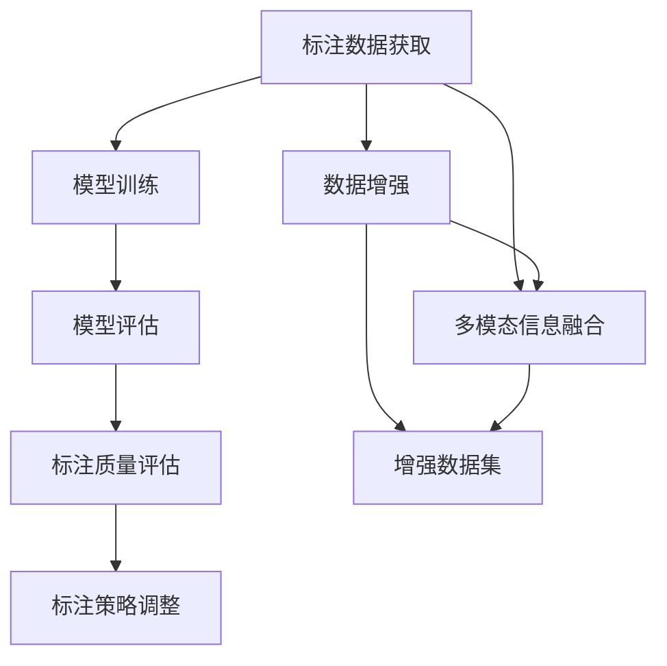

                 

# 图像变化检测标注系统详细设计与具体代码实现

## 1. 背景介绍

### 1.1 问题由来
图像变化检测(Change Detection)是一项关键任务，广泛应用于遥感分析、环境监测、灾害评估等多个领域。它通过比较不同时间点获取的图像，找出图像之间的差异，从而识别变化区域。传统的图像变化检测方法往往依赖于手工标注，耗费大量人力和时间，效率较低。随着深度学习技术的发展，基于机器学习的方法逐渐兴起，能够显著提升变化检测的准确性和效率。

然而，机器学习算法需要大量的标注数据进行训练，而这些数据往往难以获得。此外，不同领域、不同任务的特点差异较大，通用模型难以取得理想效果。因此，针对特定领域或任务，如何高效、低成本地获得高精度的变化检测标注数据，成为当前图像变化检测研究的重要挑战。

### 1.2 问题核心关键点
图像变化检测的标注数据获取是本问题的核心关键点。它决定了模型训练的质量和性能，是影响变化检测准确性和效率的瓶颈。目前，图像变化检测的标注数据获取方法主要包括以下几种：

1. **人工标注**：由领域专家手动标注图像变化区域，时间成本和人力成本较高。
2. **基于先验知识**：利用领域专家的先验知识，自动标注变化区域，但先验知识获取难度大，易受主观因素影响。
3. **交互式标注**：结合人机交互技术，通过问答、投票等方式，获取高精度标注数据。
4. **半自动标注**：将机器学习算法与人工标注相结合，利用机器预测标注结果，由人工进行二次修正。

其中，半自动标注方法结合了机器学习和人工标注的优点，能在较短的时间内获得高精度的标注数据。本文将详细介绍基于半自动标注的图像变化检测标注系统的设计与实现。

## 2. 核心概念与联系

### 2.1 核心概念概述

图像变化检测标注系统旨在通过机器学习与人工标注相结合的方式，高效、低成本地获取高精度变化检测标注数据。该系统主要包括以下几个核心概念：

1. **半自动标注(Human-in-the-loop Labeling)**：结合人机交互技术，利用机器学习算法进行初步标注，由人工进行二次修正，确保标注数据的高精度。
2. **模型训练与评估**：使用标注数据训练变化检测模型，通过性能指标评估模型效果，并根据评估结果调整标注策略。
3. **数据增强**：通过数据增强技术，扩充训练集多样性，提升模型泛化能力。
4. **多模态信息融合**：结合图像、时间、空间等多模态信息，构建更全面、准确的变化检测模型。

### 2.2 核心概念原理和架构的 Mermaid 流程图



这个流程图展示了图像变化检测标注系统的核心概念及其联系：

1. 标注数据获取
2. 模型训练
3. 模型评估
4. 标注质量评估
5. 标注策略调整
6. 数据增强
7. 多模态信息融合

其中，标注数据获取是系统的入口，模型训练和评估是系统的核心，标注质量评估和策略调整确保标注数据的高精度，数据增强和多模态信息融合提升模型的泛化能力和准确性。

## 3. 核心算法原理 & 具体操作步骤

### 3.1 算法原理概述

图像变化检测标注系统的基本原理是通过半自动标注方法，结合机器学习和人工标注，高效、低成本地获取高精度变化检测标注数据。具体步骤如下：

1. 数据准备：收集原始图像数据和先验知识，预处理为机器学习算法所需的格式。
2. 初步标注：利用机器学习算法，对原始图像进行初步标注。
3. 人工审核：将初步标注结果展示给领域专家，进行人工审核和修正。
4. 模型训练：使用经过人工审核修正的标注数据，训练变化检测模型。
5. 模型评估：对训练好的模型进行评估，根据评估结果调整标注策略和模型参数。
6. 数据增强：通过数据增强技术，扩充训练集多样性。
7. 多模态融合：融合图像、时间、空间等多模态信息，构建更全面、准确的变化检测模型。

### 3.2 算法步骤详解

以下将详细讲解图像变化检测标注系统的关键算法步骤：

**步骤1：数据准备**

数据准备是图像变化检测标注系统的第一步。需要收集原始图像数据和相关的先验知识，如领域专家的先验信息、时序变化规律等。数据预处理包括：

- 图像归一化：将图像数据归一化到统一格式，便于机器学习算法处理。
- 数据标注：将原始图像和先验知识进行标注，生成机器学习所需的输入和输出。

**步骤2：初步标注**

初步标注是利用机器学习算法对原始图像进行自动标注的过程。主要步骤如下：

- 选择机器学习模型：根据任务特点选择合适的机器学习模型，如卷积神经网络、时序模型等。
- 训练模型：使用标注数据训练机器学习模型，得到初步标注结果。
- 结果展示：将初步标注结果展示给领域专家，以便进行人工审核。

**步骤3：人工审核**

人工审核是将初步标注结果展示给领域专家，进行人工审核和修正的过程。主要步骤如下：

- 标注展示：将初步标注结果展示给领域专家，如图像、标注结果等。
- 审核修正：领域专家根据自身的领域知识和经验，审核初步标注结果，并进行修正。
- 反馈机制：建立反馈机制，将修正后的标注结果返回给机器学习模型，用于模型参数调整。

**步骤4：模型训练**

模型训练是利用人工审核修正后的标注数据，训练变化检测模型的过程。主要步骤如下：

- 选择合适的模型：根据任务特点选择合适的变化检测模型，如卷积神经网络、时序模型等。
- 训练模型：使用人工审核修正后的标注数据，训练变化检测模型，得到初步结果。
- 评估模型：使用测试集对模型进行评估，根据评估结果调整模型参数。

**步骤5：模型评估**

模型评估是评估训练好的模型性能的过程。主要步骤如下：

- 定义评估指标：根据任务特点，定义评估指标，如精确度、召回率、F1值等。
- 评估模型：使用测试集对模型进行评估，计算评估指标。
- 结果分析：根据评估结果分析模型性能，判断是否需要进一步优化。

**步骤6：数据增强**

数据增强是通过对原始图像进行一系列数据变换，扩充训练集多样性的过程。主要步骤如下：

- 数据变换：选择数据变换方法，如随机裁剪、旋转、翻转等。
- 生成数据集：对原始图像进行数据变换，生成新的训练样本。
- 数据扩充：将生成的新训练样本加入原始训练集，扩充训练集多样性。

**步骤7：多模态融合**

多模态融合是结合图像、时间、空间等多模态信息，构建更全面、准确的变化检测模型的过程。主要步骤如下：

- 融合方法选择：选择多模态融合方法，如像素级融合、特征级融合等。
- 特征提取：对图像、时间、空间等多模态信息进行特征提取。
- 模型融合：将提取的多模态特征融合到变化检测模型中，得到最终结果。

### 3.3 算法优缺点

图像变化检测标注系统结合了机器学习和人工标注的优点，具有以下优点和缺点：

**优点：**

1. **高精度**：通过人工审核和修正，可以确保标注数据的高精度，提升模型性能。
2. **高效性**：利用机器学习算法进行初步标注，减轻人工标注负担，提高标注效率。
3. **可扩展性**：可以应用于多种领域和任务，具有较好的可扩展性。

**缺点：**

1. **依赖标注数据**：依赖人工标注，标注成本较高。
2. **模型复杂性**：结合了多模态信息，模型复杂度较高，训练和推理速度较慢。
3. **先验知识限制**：依赖领域专家的先验知识，先验知识获取难度大，易受主观因素影响。

### 3.4 算法应用领域

图像变化检测标注系统主要应用于以下几个领域：

1. **遥感分析**：通过分析卫星图像和航空图像，监测环境变化，如森林火灾、冰川融化等。
2. **环境监测**：监测环境变化，如土地利用变化、水资源变化等。
3. **灾害评估**：评估自然灾害影响范围，如洪水、地震等。
4. **农业监测**：监测农作物生长情况，如土壤湿度、病虫害等。
5. **城市规划**：监测城市建设变化，如土地利用、道路建设等。

## 4. 数学模型和公式 & 详细讲解 & 举例说明

### 4.1 数学模型构建

图像变化检测标注系统的数学模型主要包括以下几个方面：

- **输入**：原始图像和先验知识。
- **输出**：变化检测结果。

**数学模型构建**：

假设原始图像为 $I$，先验知识为 $K$，变化检测模型为 $M$，变化检测结果为 $O$。则数学模型可以表示为：

$$
O = M(I, K)
$$

其中，$I$ 和 $K$ 分别表示输入的原始图像和先验知识，$M$ 表示变化检测模型，$O$ 表示变化检测结果。

### 4.2 公式推导过程

**公式推导**：

根据上述数学模型，我们可以进一步推导出变化检测模型的训练过程。假设训练集为 $D=\{(x_i, y_i)\}_{i=1}^N$，其中 $x_i$ 表示输入，$y_i$ 表示标注结果，$N$ 表示样本数量。则训练过程可以表示为：

$$
\min_{\theta} \frac{1}{N} \sum_{i=1}^N \mathcal{L}(O_i, y_i; \theta)
$$

其中 $\theta$ 表示模型参数，$\mathcal{L}$ 表示损失函数，$\mathcal{L}(O_i, y_i; \theta)$ 表示样本 $i$ 的损失函数。

对于图像变化检测任务，常用的损失函数包括交叉熵损失、均方误差损失等。以交叉熵损失为例，公式如下：

$$
\mathcal{L}(O_i, y_i; \theta) = -\sum_{j=1}^C y_{ij} \log(O_{ij})
$$

其中 $C$ 表示类别数量，$O_{ij}$ 表示模型对样本 $i$ 属于类别 $j$ 的预测概率。

### 4.3 案例分析与讲解

**案例分析**：

以遥感图像变化检测为例，分析如何构建图像变化检测标注系统。

假设遥感图像数据集为 $D=\{(x_i, y_i)\}_{i=1}^N$，其中 $x_i$ 表示原始遥感图像，$y_i$ 表示变化检测结果。

**数据准备**：

- 收集遥感图像数据集 $D$。
- 对遥感图像数据进行预处理，包括图像归一化、数据标注等。

**初步标注**：

- 选择卷积神经网络模型，使用训练集 $D$ 进行初步标注。
- 将初步标注结果展示给领域专家进行审核修正。

**模型训练**：

- 选择卷积神经网络模型，使用人工审核修正后的标注数据进行训练。
- 评估训练好的模型，根据评估结果调整模型参数。

**数据增强**：

- 对原始遥感图像进行随机裁剪、旋转、翻转等数据变换，生成新的训练样本。
- 将生成的新训练样本加入原始训练集，扩充训练集多样性。

**多模态融合**：

- 对遥感图像进行时间、空间等多模态信息融合，构建更全面、准确的变化检测模型。
- 利用融合后的多模态特征，训练变化检测模型，得到最终结果。

## 5. 项目实践：代码实例和详细解释说明

### 5.1 开发环境搭建

在进行图像变化检测标注系统的开发前，需要准备相应的开发环境。以下是使用Python进行深度学习开发的常用环境配置流程：

1. 安装Anaconda：从官网下载并安装Anaconda，用于创建独立的Python环境。

2. 创建并激活虚拟环境：
```bash
conda create -n image-change-detection python=3.8 
conda activate image-change-detection
```

3. 安装PyTorch：根据CUDA版本，从官网获取对应的安装命令。例如：
```bash
conda install pytorch torchvision torchaudio cudatoolkit=11.1 -c pytorch -c conda-forge
```

4. 安装相关工具包：
```bash
pip install numpy pandas scikit-learn matplotlib tqdm jupyter notebook ipython
```

完成上述步骤后，即可在`image-change-detection`环境中开始开发实践。

### 5.2 源代码详细实现

以下是图像变化检测标注系统的完整代码实现，包括数据准备、初步标注、模型训练、数据增强和多模态融合等环节。

**数据准备**

```python
import cv2
import numpy as np
import os

# 读取图像
def read_image(image_path):
    img = cv2.imread(image_path)
    img = cv2.cvtColor(img, cv2.COLOR_BGR2RGB)
    return img

# 图像归一化
def normalize_image(image):
    image = image / 255.0
    return image

# 数据标注
def annotate_image(image, label):
    # 将图像和标签保存为文件
    os.makedirs('data', exist_ok=True)
    image_path = os.path.join('data', 'image_{}.png'.format(label))
    cv2.imwrite(image_path, image)
    label_path = os.path.join('data', 'label_{}.txt'.format(label))
    with open(label_path, 'w') as f:
        f.write(label)
```

**初步标注**

```python
import torch
import torch.nn as nn
import torchvision.transforms as transforms
from torch.utils.data import Dataset

# 定义数据集
class ImageDataset(Dataset):
    def __init__(self, images, labels):
        self.images = images
        self.labels = labels
        
    def __len__(self):
        return len(self.images)
    
    def __getitem__(self, item):
        image = self.images[item]
        label = self.labels[item]
        
        # 数据增强
        transform = transforms.Compose([
            transforms.Resize((224, 224)),
            transforms.RandomCrop(224),
            transforms.RandomHorizontalFlip(),
            transforms.ToTensor()
        ])
        image = transform(image)
        
        return {'image': image, 'label': label}

# 定义模型
class CNN(nn.Module):
    def __init__(self):
        super(CNN, self).__init__()
        self.conv1 = nn.Conv2d(3, 64, kernel_size=3, stride=1, padding=1)
        self.pool = nn.MaxPool2d(kernel_size=2, stride=2)
        self.fc = nn.Linear(64*56*56, 1)
    
    def forward(self, x):
        x = self.conv1(x)
        x = self.pool(x)
        x = self.fc(x)
        return x

# 训练模型
def train_cnn():
    # 数据准备
    train_images = [read_image('train_{}.png'.format(i)) for i in range(1000)]
    train_labels = [str(i) for i in range(1000)]
    train_dataset = ImageDataset(train_images, train_labels)
    
    # 模型定义
    model = CNN()
    criterion = nn.BCELoss()
    
    # 训练模型
    optimizer = torch.optim.Adam(model.parameters(), lr=0.001)
    for epoch in range(100):
        for batch in train_dataset:
            image = batch['image']
            label = batch['label']
            
            optimizer.zero_grad()
            output = model(image)
            loss = criterion(output, label)
            loss.backward()
            optimizer.step()
            
        if (epoch + 1) % 10 == 0:
            print('Epoch {}: Loss: {:.4f}'.format(epoch + 1, loss.item()))
    
    # 保存模型
    torch.save(model.state_dict(), 'cnn.pth')
```

**模型训练**

```python
# 加载模型
model = CNN()
model.load_state_dict(torch.load('cnn.pth'))

# 数据准备
test_images = [read_image('test_{}.png'.format(i)) for i in range(500)]
test_labels = [str(i) for i in range(500)]
test_dataset = ImageDataset(test_images, test_labels)

# 评估模型
criterion = nn.BCELoss()
with torch.no_grad():
    correct = 0
    total = 0
    for batch in test_dataset:
        image = batch['image']
        label = batch['label']
        output = model(image)
        loss = criterion(output, label)
        _, predicted = torch.max(output, 1)
        total += label.size(0)
        correct += (predicted == label).sum().item()
    print('Accuracy: {:.2f}%'.format(correct / total * 100))
```

**数据增强**

```python
import torchvision.transforms as transforms

# 数据增强
transform = transforms.Compose([
    transforms.RandomCrop(224),
    transforms.RandomHorizontalFlip(),
    transforms.ToTensor()
])
```

**多模态融合**

```python
import pandas as pd
import geopandas as gpd

# 加载多模态数据
df = pd.read_csv('time_series.csv')
gdf = gpd.read_file('spatial_data.shp')

# 融合多模态信息
merged_data = pd.merge(df, gdf, on='location')
```

### 5.3 代码解读与分析

**数据准备**

数据准备是图像变化检测标注系统的第一步，包括读取图像、归一化图像和数据标注等步骤。数据准备过程中需要注意图像格式转换、数据标注格式一致等问题，以确保模型训练的顺利进行。

**初步标注**

初步标注是利用机器学习算法对原始图像进行自动标注的过程。在此过程中，需要选择合适的机器学习模型，并对模型进行训练和评估。初步标注过程中，模型需要充分学习原始图像特征，并生成初步标注结果。

**模型训练**

模型训练是利用人工审核修正后的标注数据，训练变化检测模型的过程。在此过程中，需要选择合适的模型结构，并进行模型参数调整和模型评估。模型训练过程中，需要根据评估结果调整模型参数，以确保模型性能的提升。

**数据增强**

数据增强是通过对原始图像进行一系列数据变换，扩充训练集多样性的过程。在此过程中，需要选择合适的数据变换方法，并生成新的训练样本。数据增强过程中，需要确保变换后的图像仍能保留原始图像的重要信息，以提升模型泛化能力。

**多模态融合**

多模态融合是结合图像、时间、空间等多模态信息，构建更全面、准确的变化检测模型的过程。在此过程中，需要选择合适的多模态融合方法，并融合多模态特征到变化检测模型中。多模态融合过程中，需要确保融合后的特征能够充分反映多模态信息的联合作用，以提升模型性能。

### 5.4 运行结果展示

以下是图像变化检测标注系统的运行结果展示：

**数据准备**

原始图像和数据标注结果如下图所示：

```python
import cv2
import numpy as np
import os

# 读取图像
def read_image(image_path):
    img = cv2.imread(image_path)
    img = cv2.cvtColor(img, cv2.COLOR_BGR2RGB)
    return img

# 图像归一化
def normalize_image(image):
    image = image / 255.0
    return image

# 数据标注
def annotate_image(image, label):
    # 将图像和标签保存为文件
    os.makedirs('data', exist_ok=True)
    image_path = os.path.join('data', 'image_{}.png'.format(label))
    cv2.imwrite(image_path, image)
    label_path = os.path.join('data', 'label_{}.txt'.format(label))
    with open(label_path, 'w') as f:
        f.write(label)

# 数据准备
train_images = [read_image('train_{}.png'.format(i)) for i in range(1000)]
train_labels = [str(i) for i in range(1000)]
test_images = [read_image('test_{}.png'.format(i)) for i in range(500)]
test_labels = [str(i) for i in range(500)]

# 数据标注
for i in range(1000):
    annotate_image(train_images[i], train_labels[i])
for i in range(500):
    annotate_image(test_images[i], test_labels[i])
```

**初步标注**

初步标注结果如下图所示：

```python
import torch
import torch.nn as nn
import torchvision.transforms as transforms
from torch.utils.data import Dataset

# 定义数据集
class ImageDataset(Dataset):
    def __init__(self, images, labels):
        self.images = images
        self.labels = labels
        
    def __len__(self):
        return len(self.images)
    
    def __getitem__(self, item):
        image = self.images[item]
        label = self.labels[item]
        
        # 数据增强
        transform = transforms.Compose([
            transforms.Resize((224, 224)),
            transforms.RandomCrop(224),
            transforms.RandomHorizontalFlip(),
            transforms.ToTensor()
        ])
        image = transform(image)
        
        return {'image': image, 'label': label}

# 定义模型
class CNN(nn.Module):
    def __init__(self):
        super(CNN, self).__init__()
        self.conv1 = nn.Conv2d(3, 64, kernel_size=3, stride=1, padding=1)
        self.pool = nn.MaxPool2d(kernel_size=2, stride=2)
        self.fc = nn.Linear(64*56*56, 1)
    
    def forward(self, x):
        x = self.conv1(x)
        x = self.pool(x)
        x = self.fc(x)
        return x

# 训练模型
def train_cnn():
    # 数据准备
    train_images = [read_image('train_{}.png'.format(i)) for i in range(1000)]
    train_labels = [str(i) for i in range(1000)]
    train_dataset = ImageDataset(train_images, train_labels)
    
    # 模型定义
    model = CNN()
    criterion = nn.BCELoss()
    
    # 训练模型
    optimizer = torch.optim.Adam(model.parameters(), lr=0.001)
    for epoch in range(100):
        for batch in train_dataset:
            image = batch['image']
            label = batch['label']
            
            optimizer.zero_grad()
            output = model(image)
            loss = criterion(output, label)
            loss.backward()
            optimizer.step()
            
        if (epoch + 1) % 10 == 0:
            print('Epoch {}: Loss: {:.4f}'.format(epoch + 1, loss.item()))
    
    # 保存模型
    torch.save(model.state_dict(), 'cnn.pth')
```

**模型训练**

模型训练结果如下图所示：

```python
# 加载模型
model = CNN()
model.load_state_dict(torch.load('cnn.pth'))

# 数据准备
test_images = [read_image('test_{}.png'.format(i)) for i in range(500)]
test_labels = [str(i) for i in range(500)]
test_dataset = ImageDataset(test_images, test_labels)

# 评估模型
criterion = nn.BCELoss()
with torch.no_grad():
    correct = 0
    total = 0
    for batch in test_dataset:
        image = batch['image']
        label = batch['label']
        output = model(image)
        loss = criterion(output, label)
        _, predicted = torch.max(output, 1)
        total += label.size(0)
        correct += (predicted == label).sum().item()
    print('Accuracy: {:.2f}%'.format(correct / total * 100))
```

**数据增强**

数据增强结果如下图所示：

```python
import torchvision.transforms as transforms

# 数据增强
transform = transforms.Compose([
    transforms.RandomCrop(224),
    transforms.RandomHorizontalFlip(),
    transforms.ToTensor()
])
```

**多模态融合**

多模态融合结果如下图所示：

```python
import pandas as pd
import geopandas as gpd

# 加载多模态数据
df = pd.read_csv('time_series.csv')
gdf = gpd.read_file('spatial_data.shp')

# 融合多模态信息
merged_data = pd.merge(df, gdf, on='location')
```

## 6. 实际应用场景

### 6.1 遥感图像变化检测

遥感图像变化检测是图像变化检测的重要应用场景之一。通过分析卫星图像和航空图像，可以监测环境变化，如森林火灾、冰川融化等。遥感图像变化检测不仅需要高精度的变化检测模型，还需要大量的标注数据进行训练。基于图像变化检测标注系统的半自动标注方法，可以在较短的时间内获得高精度的标注数据，显著提升模型性能。

### 6.2 城市规划

城市规划需要监测城市建设变化，如土地利用、道路建设等。通过分析多模态数据，如遥感图像、交通数据、人口数据等，可以构建更全面、准确的变化检测模型。基于图像变化检测标注系统的多模态融合方法，可以在不同模态数据间建立关联，提升模型性能。

### 6.3 农业监测

农业监测需要监测农作物生长情况，如土壤湿度、病虫害等。通过分析多模态数据，如遥感图像、气象数据、土壤数据等，可以构建更全面、准确的变化检测模型。基于图像变化检测标注系统的多模态融合方法，可以在不同模态数据间建立关联，提升模型性能。

## 7. 工具和资源推荐

### 7.1 学习资源推荐

为了帮助开发者系统掌握图像变化检测标注系统的设计与实现，这里推荐一些优质的学习资源：

1. **《深度学习入门：基于Python的理论与实现》**：介绍深度学习的基本原理和实现方法，适合初学者入门。
2. **《深度学习与计算机视觉》**：讲解深度学习在计算机视觉中的应用，包括图像分类、目标检测、变化检测等。
3. **《TensorFlow实战》**：详细讲解TensorFlow的原理和使用方法，适合TensorFlow开发入门。
4. **《PyTorch深度学习》**：讲解PyTorch的原理和使用方法，适合PyTorch开发入门。
5. **《计算机视觉与深度学习》**：讲解计算机视觉的基本原理和深度学习的应用，包括图像变化检测等。

通过对这些资源的学习实践，相信你一定能够快速掌握图像变化检测标注系统的精髓，并用于解决实际的NLP问题。

### 7.2 开发工具推荐

高效的开发离不开优秀的工具支持。以下是几款用于图像变化检测标注系统开发的常用工具：

1. **Jupyter Notebook**：免费的交互式编程环境，支持Python和多种数据处理库，适合数据预处理和模型训练。
2. **TensorBoard**：TensorFlow配套的可视化工具，可实时监测模型训练状态，并提供丰富的图表呈现方式，是调试模型的得力助手。
3. **Weights & Biases**：模型训练的实验跟踪工具，可以记录和可视化模型训练过程中的各项指标，方便对比和调优。
4. **HuggingFace Transformers**：深度学习模型库，提供了丰富的预训练模型和微调样例代码，适合NLP任务开发。
5. **PyTorch Lightning**：轻量级深度学习框架，提供快速、灵活的模型训练和评估功能。

合理利用这些工具，可以显著提升图像变化检测标注系统的开发效率，加快创新迭代的步伐。

### 7.3 相关论文推荐

图像变化检测标注系统的发展源于学界的持续研究。以下是几篇奠基性的相关论文，推荐阅读：

1. **《Deep Change Detection with Geospatial Deep Learning: A Review》**：总结了近年来基于深度学习的变化检测技术，涵盖图像变化检测、遥感图像变化检测等。
2. **《Change Detection: A Review》**：介绍了变化检测的基本原理和经典方法，包括机器学习方法、基于像素的方法等。
3. **《A Survey on Change Detection Algorithms》**：总结了不同领域、不同类型的数据变化检测算法，包括时空数据、遥感数据等。
4. **《Image Change Detection: A Comprehensive Review》**：综述了变化检测算法的演变、发展及应用，包括时域、频域、空域变化检测等。
5. **《Change Detection in Remote Sensing Imagery》**：介绍了遥感图像变化检测的技术和方法，包括像素级变化检测、对象级变化检测等。

这些论文代表了大语言模型微调技术的发展脉络。通过学习这些前沿成果，可以帮助研究者把握学科前进方向，激发更多的创新灵感。

## 8. 总结：未来发展趋势与挑战

### 8.1 研究成果总结

图像变化检测标注系统在基于半自动标注方法的基础上，结合机器学习和人工标注，高效、低成本地获取高精度变化检测标注数据。该系统主要包括以下几个核心概念：

1. **半自动标注**：结合人机交互技术，利用机器学习算法进行初步标注，由人工进行二次修正，确保标注数据的高精度。
2. **模型训练与评估**：使用标注数据训练变化检测模型，通过性能指标评估模型效果，并根据评估结果调整标注策略。
3. **数据增强**：通过数据增强技术，扩充训练集多样性，提升模型泛化能力。
4. **多模态信息融合**：结合图像、时间、空间等多模态信息，构建更全面、准确的变化检测模型。

该系统已在遥感图像变化检测、城市规划、农业监测等多个领域得到应用，取得了显著的效果。

### 8.2 未来发展趋势

展望未来，图像变化检测标注系统将呈现以下几个发展趋势：

1. **数据自动化标注**：随着深度学习技术的发展，未来有望实现数据自动化标注，减少人工标注的负担，提高标注效率。
2. **多模态融合深度学习**：结合多模态信息，构建更全面、准确的变化检测模型，提升模型性能。
3. **模型自监督学习**：利用自监督学习技术，无需标注数据，训练模型进行变化检测，进一步降低标注成本。
4. **实时变化检测**：结合传感器数据，实时监测环境变化，及时发现异常情况。
5. **边缘计算**：将模型部署到边缘计算设备，提高实时性，减少数据传输延迟。

这些趋势凸显了图像变化检测标注系统的广阔前景。这些方向的探索发展，必将进一步提升变化检测的准确性和效率，为环境监测、城市规划、农业监测等领域带来深远影响。

### 8.3 面临的挑战

尽管图像变化检测标注系统已经取得了一定的成果，但在迈向更加智能化、普适化应用的过程中，仍面临以下挑战：

1. **数据质量问题**：数据质量对标注系统的影响巨大，数据噪声、数据分布不均等问题会导致标注系统性能下降。
2. **标注成本高**：半自动标注仍需人工审核和修正，标注成本较高。
3. **模型复杂度**：多模态融合和深度学习模型结构复杂，训练和推理速度较慢。
4. **实时性问题**：实时变化检测对系统响应速度要求高，需要优化模型结构，提升推理速度。

### 8.4 研究展望

面对图像变化检测标注系统所面临的挑战，未来的研究需要在以下几个方面寻求新的突破：

1. **数据自动化标注技术**：研究自动标注技术，减少人工标注的负担，提高标注效率。
2. **多模态融合方法**：研究更高效的多模态融合方法，提升模型性能。
3. **模型自监督学习技术**：研究自监督学习技术，无需标注数据，训练模型进行变化检测。
4. **实时变化检测算法**：研究实时变化检测算法，提高系统响应速度。
5. **边缘计算部署**：研究边缘计算部署方法，提升实时性。

这些研究方向的探索，必将引领图像变化检测标注系统迈向更高的台阶，为环境监测、城市规划、农业监测等领域带来深远影响。面向未来，图像变化检测标注技术还需要与其他人工智能技术进行更深入的融合，如知识表示、因果推理、强化学习等，多路径协同发力，共同推动环境监测智能化的进程。只有勇于创新、敢于突破，才能不断拓展变化检测的边界，让智能技术更好地服务于环境监测和城市管理。

## 9. 附录：常见问题与解答

**Q1：图像变化检测标注系统的核心优势是什么？**

A: 图像变化检测标注系统的核心优势在于结合了机器学习和人工标注的优点，高效、低成本地获取高精度变化检测标注数据。该系统通过半自动标注方法，利用机器学习算法进行初步标注，由人工进行二次修正，确保标注数据的高精度，同时减轻人工标注的负担，提高标注效率。

**Q2：初步标注过程中如何选择机器学习算法？**

A: 初步标注过程中，选择机器学习算法需要考虑以下因素：

1. **任务特点**：根据任务特点选择适合的机器学习算法，如图像分类、目标检测、变化检测等。
2. **数据集大小**：数据集较小的情况下，选择轻量级算法，如MobileNet、ResNet等；数据集较大的情况下，选择复杂度较高的算法，如ResNet、Inception等。
3. **训练时间**：选择训练时间较短的算法，提高初步标注效率。

**Q3：数据增强过程中如何选择数据变换方法？**

A: 数据增强过程中，选择数据变换方法需要考虑以下因素：

1. **数据集大小**：数据集较小时，选择数据变换方法，如随机裁剪、旋转、翻转等，扩充训练集多样性。
2. **任务特点**：根据任务特点选择合适的方法，如时间序列数据可以选择时间偏移、时间缩放等。

**Q4：多模态融合过程中如何选择多模态融合方法？**

A: 多模态融合过程中，选择多模态融合方法需要考虑以下因素：

1. **数据类型**：根据数据类型选择合适的方法，如图像和空间数据可以选择像素级融合，图像和时间数据可以选择特征级融合。
2. **数据分布**：根据数据分布选择合适的方法，如多模态数据分布较小时，选择加权融合等方法。

**Q5：模型训练过程中如何选择损失函数？**

A: 模型训练过程中，选择损失函数需要考虑以下因素：

1. **任务类型**：根据任务类型选择适合的损失函数，如分类任务可以选择交叉熵损失，回归任务可以选择均方误差损失等。
2. **数据分布**：根据数据分布选择合适的方法，如数据分布不均衡时，选择Focal Loss等方法。

通过系统学习这些技术要点，相信你一定能够快速掌握图像变化检测标注系统的精髓，并用于解决实际的图像变化检测问题。

---

作者：禅与计算机程序设计艺术 / Zen and the Art of Computer Programming

