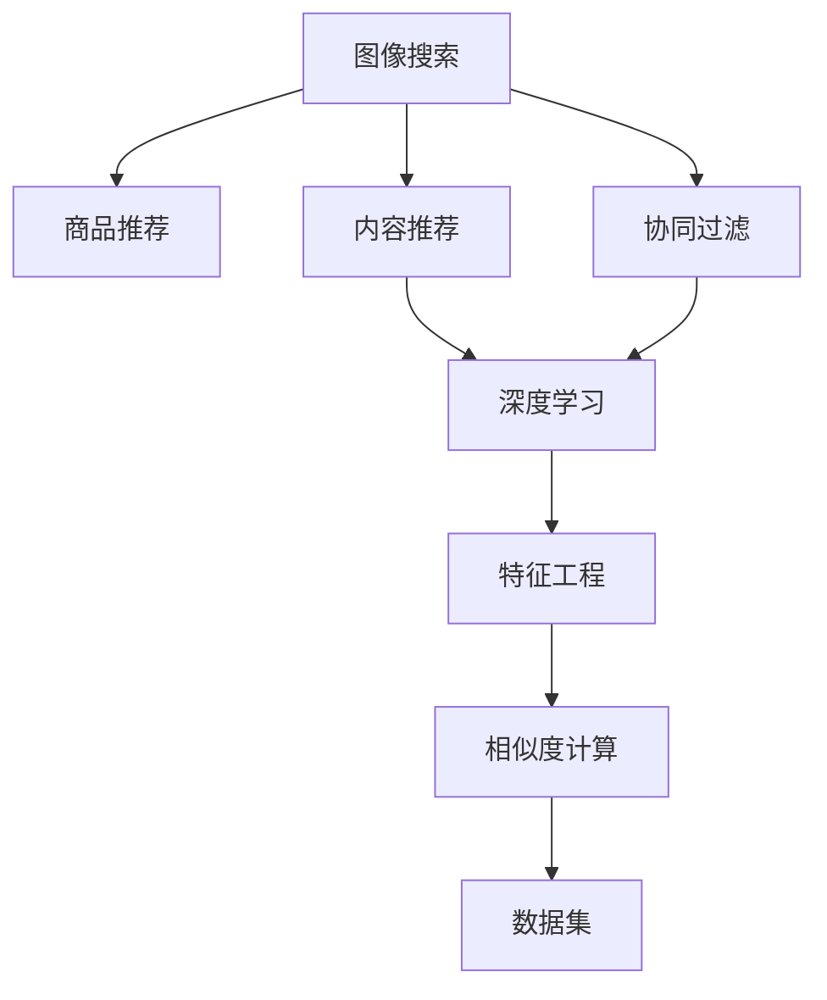

                 

# 图像搜索技术在电商领域的应用：发展趋势与未来

## 1. 背景介绍

### 1.1 问题由来

随着电子商务的飞速发展，传统的基于文本搜索的方法已经无法满足消费者的需求。消费者越来越多地通过搜索图片而非产品描述来寻找商品，这使得图像搜索技术在电商领域的应用变得越来越重要。图像搜索技术能够快速准确地从海量的商品图像中筛选出符合消费者需求的商品，极大地提升了购物体验和效率。

### 1.2 问题核心关键点

图像搜索技术在电商领域的应用核心关键点在于：

- 提高商品查找效率：图像搜索技术能够快速从大量商品图像中筛选出符合搜索意图的商品。
- 提升用户体验：图像搜索结果的直观性、准确性直接影响到用户的购买决策。
- 优化库存管理：通过图像搜索数据，商家可以更好地了解市场需求，优化库存管理。
- 增强市场竞争力：电商商家通过优化商品图像和搜索技术，能够吸引更多用户，提升市场份额。

## 2. 核心概念与联系

### 2.1 核心概念概述

为了更好地理解图像搜索技术在电商领域的应用，本节将介绍几个关键概念及其联系：

- **图像搜索(Visual Search)**：通过图像相似度匹配技术，从图像数据库中检索出与查询图像相似的图像。
- **商品推荐(Recommendation System)**：根据用户历史行为、偏好等，推荐可能感兴趣的商品。
- **内容推荐(Content-based Recommendation)**：基于商品属性（如颜色、尺码等）进行推荐。
- **协同过滤(Collaborative Filtering)**：基于用户和商品的互动历史推荐商品。
- **深度学习(Deep Learning)**：使用深度神经网络进行图像和商品特征提取、相似度计算等。
- **特征工程(Feature Engineering)**：对原始数据进行预处理和特征提取，为模型训练提供高质量输入。
- **相似度计算(Similarity Calculation)**：计算查询图像和商品图像之间的相似度，找出最相似的图像。
- **数据集(Dataset)**：电商平台上的商品图像及其标签信息。

这些概念之间的逻辑关系可以通过以下Mermaid流程图来展示：



这个流程图展示了这个框架中各个概念之间的关系：

1. 图像搜索通过相似度计算，找出与查询图像最相似的图像。
2. 基于相似度计算的结果，可以用于商品推荐系统中的内容推荐和协同过滤。
3. 深度学习技术被应用于特征提取和相似度计算中。
4. 特征工程对原始数据进行预处理，提高特征质量。
5. 数据集是所有这些技术的输入和输出，反映了电商平台的商品信息。

## 3. 核心算法原理 & 具体操作步骤
### 3.1 算法原理概述

图像搜索技术在电商领域的应用主要基于深度学习模型和相似度计算技术。其核心算法原理如下：

1. **深度学习模型**：使用卷积神经网络(CNN)、循环神经网络(RNN)等深度学习模型，提取商品图像和查询图像的特征表示。
2. **特征表示**：将图像转换为特征向量，使得相似度计算更加高效。
3. **相似度计算**：通过余弦相似度、欧式距离等方法，计算查询图像与商品图像之间的相似度。
4. **搜索结果排序**：根据相似度的大小，对搜索结果进行排序，展示最相关的商品。

### 3.2 算法步骤详解

以下是图像搜索技术在电商领域的具体操作步骤：

**Step 1: 数据收集和预处理**

- 收集电商平台的商品图像数据，包括商品的高清图片和标签信息。
- 对图像进行预处理，如调整大小、裁剪、增强等，以适应模型输入要求。
- 对标签信息进行标准化处理，包括去除噪声、填补缺失等。

**Step 2: 特征提取**

- 使用深度学习模型提取商品图像的特征表示。常用的深度学习模型包括ResNet、Inception等。
- 对查询图像也进行特征提取，得到与商品图像相同的特征表示。

**Step 3: 相似度计算**

- 通过余弦相似度、欧式距离等方法，计算查询图像与商品图像的相似度。
- 根据相似度的大小，对商品图像进行排序，找出最相关的商品。

**Step 4: 结果展示**

- 将搜索结果展示给用户，通常以图片、缩略图等形式展示。
- 可以支持多种展示方式，如网格展示、瀑布流展示等。

**Step 5: 用户反馈和模型优化**

- 收集用户对搜索结果的反馈，如点击率、停留时间等。
- 根据用户反馈，调整模型参数和特征提取方式，提升搜索结果的质量。

### 3.3 算法优缺点

图像搜索技术在电商领域的应用具有以下优点：

- **高效率**：快速准确地从大量商品图像中筛选出符合搜索意图的商品，提升搜索效率。
- **直观性**：图像搜索结果直观展示商品图片，更容易吸引用户关注。
- **个性化**：基于用户历史行为和偏好，推荐最相关的商品，提升用户体验。

同时，该技术也存在一定的局限性：

- **数据依赖**：需要大量高质量的商品图像数据，收集和预处理成本较高。
- **模型复杂**：深度学习模型计算复杂度高，对硬件资源要求较高。
- **冷启动问题**：新上架的商品没有足够的历史数据，无法进行推荐。

### 3.4 算法应用领域

图像搜索技术在电商领域的应用非常广泛，主要包括以下几个方面：

- **商品搜索**：用户输入查询图像，快速查找符合搜索意图的商品。
- **分类检索**：根据商品类别、品牌等标签，快速检索出相关信息。
- **相似商品推荐**：通过相似度计算，推荐与查询商品相似的商品。
- **时尚搭配**：用户上传搭配图片，推荐匹配的商品。
- **个性化定制**：根据用户上传的个性化设计，生成相似的商品。

此外，图像搜索技术还可应用于其他领域，如零售、医疗、旅游等，带来全新的用户体验和服务。

## 4. 数学模型和公式 & 详细讲解 & 举例说明（备注：数学公式请使用latex格式，latex嵌入文中独立段落使用 $$，段落内使用 $)
### 4.1 数学模型构建

本节将使用数学语言对图像搜索技术在电商领域的应用进行更加严格的刻画。

设商品图像集合为 $\mathcal{X}$，查询图像集合为 $\mathcal{Y}$。设 $f_{\theta}(x)$ 为深度学习模型，将图像 $x$ 映射到特征向量 $f_{\theta}(x) \in \mathbb{R}^d$。设查询图像与商品图像的相似度为 $s(y,x)$，使用余弦相似度进行计算，即：

$$
s(y,x) = \cos(\theta^T f_{\theta}(x))
$$

其中 $\theta$ 为模型的可训练参数，$f_{\theta}(x)$ 为模型的输出特征向量。

### 4.2 公式推导过程

余弦相似度的计算公式如下：

$$
\cos(\theta^T f_{\theta}(x)) = \frac{\theta^T f_{\theta}(x)}{\|\theta\| \cdot \|f_{\theta}(x)\|}
$$

其中 $\|\theta\|$ 和 $\|f_{\theta}(x)\|$ 分别为 $\theta$ 和 $f_{\theta}(x)$ 的范数。

设 $\mathcal{Y}_i$ 为与查询图像 $y_i$ 最相似的 $k$ 个商品图像，则查询图像的相似度向量为：

$$
s(y_i) = [s(y_i,x_1), s(y_i,x_2), ..., s(y_i,x_k)]
$$

通过余弦相似度计算，可以得到查询图像与商品图像的相似度向量。

### 4.3 案例分析与讲解

假设有一个电商平台，用户上传了一张时尚鞋子的图片进行搜索。平台使用ResNet模型提取该图片的特征向量，同时从商品库中选取与该图片最相似的10张鞋子图片作为搜索结果。用户可以查看这些图片，并进一步选择购买。

假设查询图像和商品图像的特征向量分别为 $f_q$ 和 $f_p$，则余弦相似度计算公式为：

$$
s = \frac{f_q^T f_p}{\|f_q\| \cdot \|f_p\|}
$$

通过计算相似度，平台可以根据余弦相似度的大小对商品图片进行排序，展示最相关的商品。

## 5. 项目实践：代码实例和详细解释说明
### 5.1 开发环境搭建

在进行图像搜索技术在电商领域的应用实践前，我们需要准备好开发环境。以下是使用Python进行TensorFlow开发的环境配置流程：

1. 安装Anaconda：从官网下载并安装Anaconda，用于创建独立的Python环境。

2. 创建并激活虚拟环境：
```bash
conda create -n tf-env python=3.8 
conda activate tf-env
```

3. 安装TensorFlow：根据CUDA版本，从官网获取对应的安装命令。例如：
```bash
conda install tensorflow -c pytorch -c conda-forge
```

4. 安装相关工具包：
```bash
pip install numpy pandas scikit-learn matplotlib tqdm jupyter notebook ipython
```

完成上述步骤后，即可在`tf-env`环境中开始图像搜索技术在电商领域的应用实践。

### 5.2 源代码详细实现

下面是使用TensorFlow实现图像搜索的Python代码实现：

```python
import tensorflow as tf
from tensorflow.keras.applications.resnet50 import ResNet50
from tensorflow.keras.preprocessing.image import img_to_array, load_img
from sklearn.metrics.pairwise import cosine_similarity
import numpy as np

# 加载ResNet50模型
model = ResNet50(weights='imagenet', include_top=False)

# 加载查询图像
query_image = load_img('query.jpg', target_size=(224, 224))
query_image_array = img_to_array(query_image)
query_image_array = np.expand_dims(query_image_array, axis=0)

# 提取查询图像的特征向量
query_features = model.predict(query_image_array)

# 加载商品图像数据集
data = np.load('products.npy')

# 提取商品图像的特征向量
product_features = model.predict(data)

# 计算查询图像与商品图像的余弦相似度
similarity_matrix = cosine_similarity(query_features, product_features)

# 找到最相似的10个商品图像
top_k_indices = np.argsort(-similarity_matrix[0])[1:11]

# 展示最相关的商品图片
for index in top_k_indices:
    print(f"商品ID: {index}, 相似度: {similarity_matrix[0, index]}")
    img_path = f'product_{index}.jpg'
    img = load_img(img_path)
    img.show()
```

### 5.3 代码解读与分析

让我们再详细解读一下关键代码的实现细节：

**query_image加载**：
- 使用`load_img`加载查询图像，并将其调整为网络所需的输入大小。
- 使用`img_to_array`将图像转换为数组格式，并使用`np.expand_dims`扩展维度，以满足模型输入要求。

**ResNet50模型加载**：
- 使用`ResNet50`模型，并设置`include_top=False`，表示不包含预训练的顶层分类器。
- 使用`weights='imagenet'`加载预训练的ResNet50模型。

**特征提取**：
- 使用`predict`方法提取查询图像和商品图像的特征向量。

**余弦相似度计算**：
- 使用`cosine_similarity`计算查询图像与商品图像的余弦相似度。

**结果展示**：
- 通过索引排序，找到与查询图像最相似的10个商品图像。
- 展示这些商品图片，并输出其相似度。

可以看到，使用TensorFlow实现图像搜索技术在电商领域的应用，可以简洁高效地完成商品特征提取、相似度计算和结果展示。开发者可以将更多精力放在数据处理、模型改进等高层逻辑上，而不必过多关注底层的实现细节。

## 6. 实际应用场景
### 6.1 智能客服

电商平台的智能客服系统可以通过图像搜索技术提升用户体验。当用户在智能客服系统中上传商品图片，系统可以通过相似度计算，快速找到用户需要的商品信息。这不仅可以提升服务效率，还可以减少用户等待时间，提升用户满意度。

**实施步骤**：
- 收集电商平台的商品图片和客服咨询记录。
- 使用图像搜索技术提取商品特征，构建商品图像数据库。
- 在智能客服系统中，当用户上传商品图片时，使用图像搜索技术找到最相关的商品信息。
- 根据商品信息，生成智能回复，或者将用户引导到相关商品页面。

### 6.2 个性化推荐

电商平台的个性化推荐系统可以通过图像搜索技术实现。通过分析用户的购买行为和浏览记录，可以构建用户的兴趣模型，然后使用图像搜索技术找到符合用户兴趣的商品。

**实施步骤**：
- 收集用户的历史行为数据，包括浏览记录、购买记录等。
- 使用图像搜索技术，从商品库中筛选出与用户兴趣相关的商品。
- 根据相似度排序，展示最相关的商品。
- 实时更新用户模型，确保推荐结果的准确性和时效性。

### 6.3 品牌和产品搜索

电商平台可以通过图像搜索技术，使用户能够更方便地找到品牌和产品。用户只需上传品牌标志或产品图片，即可快速检索出相关信息。

**实施步骤**：
- 收集品牌标志和产品图片。
- 使用图像搜索技术，检索出与查询图像最相似的品牌和产品信息。
- 展示搜索结果，并支持用户进一步浏览和购买。

### 6.4 未来应用展望

随着图像搜索技术的不断发展，未来将在更多电商应用场景中得到应用，为电商行业带来新的变革：

- **视频搜索**：用户上传商品视频，平台可以通过视频特征提取技术，检索出最相关的商品。
- **VR/AR体验**：用户通过VR/AR设备上传商品图片，平台可以提供更直观的购物体验。
- **跨平台搜索**：用户可以在不同平台（如社交媒体、搜索引擎等）上传图片，平台可以跨平台检索相关信息。
- **实时反馈**：通过用户反馈数据，不断优化图像搜索模型，提升搜索精度和效率。

这些新应用场景的出现，将进一步推动图像搜索技术在电商领域的发展，为电商行业带来更多的创新和机遇。

## 7. 工具和资源推荐
### 7.1 学习资源推荐

为了帮助开发者系统掌握图像搜索技术在电商领域的应用，这里推荐一些优质的学习资源：

1. **《Python深度学习》**：一本全面介绍深度学习原理和应用的经典书籍，适合初学者和进阶开发者阅读。
2. **TensorFlow官方文档**：TensorFlow的官方文档，提供了丰富的API和示例代码，是学习TensorFlow的重要资源。
3. **Keras官方文档**：Keras的官方文档，提供了简单易用的API和示例，适合快速上手深度学习模型开发。
4. **Google Cloud AI平台**：Google提供的云AI平台，提供了丰富的深度学习工具和资源，适合进行大规模深度学习开发。
5. **OpenCV库**：一个开源计算机视觉库，提供了图像处理、特征提取等功能，是图像搜索技术的重要基础。

通过对这些资源的学习实践，相信你一定能够快速掌握图像搜索技术在电商领域的应用，并用于解决实际的电商问题。

### 7.2 开发工具推荐

高效的开发离不开优秀的工具支持。以下是几款用于图像搜索技术在电商领域应用的常用工具：

1. **TensorFlow**：由Google主导开发的开源深度学习框架，生产部署方便，适合大规模工程应用。
2. **Keras**：Google开发的深度学习框架，提供了简单易用的API，适合快速开发深度学习模型。
3. **OpenCV**：一个开源计算机视觉库，提供了图像处理、特征提取等功能，是图像搜索技术的重要基础。
4. **Pillow**：Python的图像处理库，提供了丰富的图像处理功能，支持图像的加载、保存、转换等操作。
5. **Scikit-learn**：一个常用的Python机器学习库，提供了多种机器学习算法和工具，适合进行特征提取和相似度计算。

合理利用这些工具，可以显著提升图像搜索技术在电商领域的应用开发效率，加快创新迭代的步伐。

### 7.3 相关论文推荐

图像搜索技术在电商领域的发展得益于学界的持续研究。以下是几篇奠基性的相关论文，推荐阅读：

1. **Image Search via Robust Ranking with RankNet**：提出了一种基于RankNet的图像检索方法，在大型图像数据库上取得了不错的效果。
2. **Deep Image Similarity with Multi-scale Local Features**：提出了一种基于多尺度局部特征的图像相似度计算方法，提升了图像检索的准确性和鲁棒性。
3. **Convolutional Neural Networks for Scalable Image Classification**：提出了一种基于卷积神经网络的图像分类方法，为图像搜索技术提供了新的思路。
4. **Visual Search with Deep Learning**：综述了基于深度学习的图像检索方法，展示了深度学习在图像搜索中的应用前景。
5. **Image Retrieval with Scale-Aware CNNs**：提出了一种基于尺度感知卷积神经网络的图像检索方法，提升了检索的准确性和效率。

这些论文代表了大语言模型微调技术的发展脉络。通过学习这些前沿成果，可以帮助研究者把握学科前进方向，激发更多的创新灵感。

## 8. 总结：未来发展趋势与挑战
### 8.1 总结

本文对图像搜索技术在电商领域的应用进行了全面系统的介绍。首先阐述了图像搜索技术在电商领域的应用背景和意义，明确了图像搜索技术在电商中的应用价值。其次，从原理到实践，详细讲解了图像搜索技术的数学原理和关键步骤，给出了电商领域应用的具体代码实例。同时，本文还广泛探讨了图像搜索技术在智能客服、个性化推荐等多个电商应用场景中的未来应用前景，展示了图像搜索技术的巨大潜力。此外，本文精选了图像搜索技术的各类学习资源，力求为读者提供全方位的技术指引。

通过本文的系统梳理，可以看到，图像搜索技术在电商领域的应用极大地提升了商品搜索的效率和准确性，为用户带来了更好的购物体验。未来，伴随图像搜索技术的不断发展，将会有更多创新应用出现，为电商行业带来更多的变革和机遇。

### 8.2 未来发展趋势

展望未来，图像搜索技术在电商领域的应用将呈现以下几个发展趋势：

1. **智能化**：基于深度学习技术，图像搜索技术将变得更加智能化，能够自动提取图像特征、计算相似度等，提升搜索效率和准确性。
2. **实时化**：实时图像搜索技术将进一步发展，能够实时处理用户上传的图像，即时返回搜索结果。
3. **跨平台**：图像搜索技术将支持跨平台应用，用户可以在不同的设备和平台上进行图像搜索，提高搜索的便捷性。
4. **多模态**：图像搜索技术将与语音搜索、文本搜索等多模态技术融合，提供更丰富的搜索体验。
5. **个性化**：基于用户行为数据，图像搜索技术将更加个性化，提供更精准的搜索结果。

这些趋势将推动图像搜索技术在电商领域的发展，为电商行业带来更多的创新和机遇。

### 8.3 面临的挑战

尽管图像搜索技术在电商领域的应用取得了显著成就，但在迈向更加智能化、实时化的应用过程中，它仍面临诸多挑战：

1. **数据依赖**：需要大量高质量的商品图像数据，收集和预处理成本较高。
2. **模型复杂**：深度学习模型计算复杂度高，对硬件资源要求较高。
3. **冷启动问题**：新上架的商品没有足够的历史数据，无法进行推荐。
4. **隐私保护**：电商平台需要保护用户隐私，限制用户上传的商品图片。
5. **安全防护**：防止恶意攻击，保障用户数据和系统的安全。

这些挑战需要通过不断的技术创新和优化来解决，才能推动图像搜索技术在电商领域的发展。

### 8.4 研究展望

面对图像搜索技术在电商领域的应用挑战，未来的研究需要在以下几个方面寻求新的突破：

1. **无监督学习**：通过无监督学习技术，从大规模未标注数据中提取特征，降低对标注数据的依赖。
2. **多模态融合**：将图像、语音、文本等多模态数据融合，提供更丰富的搜索体验。
3. **跨平台搜索**：开发跨平台图像搜索技术，支持用户在不同设备和平台上进行图像搜索。
4. **实时化技术**：开发实时图像处理和搜索技术，提升搜索效率和用户体验。
5. **隐私保护**：开发隐私保护技术，确保用户数据的安全和隐私。

这些研究方向的探索，将推动图像搜索技术在电商领域的应用，为电商行业带来更多的创新和机遇。总之，图像搜索技术在未来将继续引领电商行业的发展，为电商行业带来更多的变革和机遇。

## 9. 附录：常见问题与解答
**Q1：图像搜索技术在电商领域的应用前景如何？**

A: 图像搜索技术在电商领域的应用前景非常广阔。随着用户对购物体验的要求越来越高，图像搜索技术能够提升搜索效率和准确性，带来更好的用户体验。同时，图像搜索技术还可以与其他技术融合，如语音搜索、文本搜索等，提供更丰富的搜索体验。未来，图像搜索技术将在电商领域得到更广泛的应用，推动电商行业的发展。

**Q2：图像搜索技术在电商领域如何处理冷启动问题？**

A: 冷启动问题是图像搜索技术在电商领域的一个主要挑战。对于新上架的商品，没有足够的历史数据进行推荐。为了解决这个问题，可以采用以下方法：

1. 使用无监督学习技术，从大规模未标注数据中提取特征，降低对标注数据的依赖。
2. 引入外部知识库，如商品属性、标签等，提升特征提取的准确性。
3. 开发实时搜索技术，根据用户当前浏览行为进行推荐，解决历史数据不足的问题。

这些方法可以帮助图像搜索技术更好地处理冷启动问题，提升推荐效果。

**Q3：图像搜索技术在电商领域如何保障用户隐私？**

A: 电商平台需要保护用户隐私，限制用户上传的商品图片。为了保障用户隐私，可以采用以下方法：

1. 开发隐私保护技术，如差分隐私、同态加密等，保护用户数据的隐私。
2. 提供匿名上传选项，允许用户选择不上传个人数据。
3. 对用户上传的商品图片进行匿名化处理，保护用户隐私。

这些方法可以帮助电商平台保障用户隐私，确保用户数据的安全。

**Q4：图像搜索技术在电商领域如何提升用户体验？**

A: 图像搜索技术可以通过以下方法提升用户体验：

1. 提供实时搜索结果，根据用户当前行为进行推荐。
2. 提供个性化推荐，根据用户历史行为和偏好进行推荐。
3. 提供多模态搜索体验，如语音搜索、文本搜索等，提升搜索的便捷性。
4. 提供丰富的搜索结果展示方式，如网格展示、瀑布流展示等，提升用户的浏览体验。

通过这些方法，图像搜索技术可以提升用户的购物体验，提升用户满意度和忠诚度。

**Q5：图像搜索技术在电商领域如何优化推荐结果？**

A: 图像搜索技术可以通过以下方法优化推荐结果：

1. 引入外部知识库，如商品属性、标签等，提升特征提取的准确性。
2. 使用协同过滤技术，根据用户和商品之间的互动历史进行推荐。
3. 使用深度学习技术，提取商品图像和用户行为的特征表示，提升推荐的精度。
4. 实时更新用户模型，确保推荐结果的准确性和时效性。

这些方法可以帮助电商平台优化推荐结果，提升用户满意度。

**Q6：图像搜索技术在电商领域如何实现跨平台搜索？**

A: 实现跨平台搜索，可以通过以下方法：

1. 开发跨平台的API接口，支持用户在不同的设备和平台上进行图像搜索。
2. 提供统一的搜索界面，支持用户在多个平台进行统一搜索。
3. 支持多种数据格式，如JPEG、PNG等，支持用户在不同的设备和平台上进行图像搜索。
4. 开发跨平台的搜索技术，支持用户在不同的平台和设备上进行图像搜索。

这些方法可以帮助电商平台实现跨平台搜索，提升搜索的便捷性和用户体验。

**Q7：图像搜索技术在电商领域如何处理实时搜索问题？**

A: 实现实时搜索，可以通过以下方法：

1. 使用流式处理技术，实时处理用户上传的图像。
2. 使用GPU加速技术，提升图像处理和相似度计算的速度。
3. 使用分布式计算技术，将搜索任务分布到多个计算节点上进行处理。
4. 使用缓存技术，保存热门商品的特征表示，提升搜索速度。

这些方法可以帮助电商平台实现实时搜索，提升搜索效率和用户体验。

