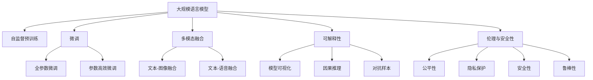

                 

# 图灵完备的LLM:通向通用人工智能之路

> 关键词：图灵完备, 大规模语言模型, 通用人工智能, 自然语言处理, 机器学习, 深度学习, 自动推理, 深度学习应用

## 1. 背景介绍

### 1.1 问题由来

自20世纪50年代图灵测试的提出以来，人工智能(AI)领域就一直在探索如何让机器具备图灵完备性，即具备与人类的对话和思考能力。直到近年来，随着深度学习技术尤其是Transformer和自监督预训练语言模型的兴起，大规模语言模型(LLM)才逐渐在理解和生成自然语言方面取得显著进展。

通用人工智能(GAI)是AI领域的终极目标之一，旨在创建一种具有广泛智能和复杂推理能力的机器。这包括理解自然语言、学习从环境中提取知识和经验，以及在不同领域和情境中执行各种任务。LLM的崛起，为这一目标的实现带来了新的曙光。

### 1.2 问题核心关键点

1. **图灵完备性**：LLM的灵感来源于图灵完备性，即模型应该能够执行任何算法，包括复杂的逻辑和推理任务。
2. **预训练-微调范式**：LLM通过在大规模无标签数据上自监督预训练，然后在小规模标签数据上微调，以适应特定任务。
3. **多模态融合**：LLM不仅能处理文本数据，还可以结合视觉、听觉等多模态数据，增强对现实世界的理解。
4. **参数高效微调**：为了应对小规模标注数据和计算资源限制，研究者提出了多种参数高效的微调方法。
5. **安全与可信性**：LLM的应用需要考虑安全性、透明度和伦理问题，以确保其可靠性和公正性。

### 1.3 问题研究意义

研究LLM对于实现通用人工智能具有重要意义：

1. **提升计算效率**：通过预训练-微调范式，模型能够在大规模无标签数据上预训练，在小规模标注数据上微调，极大地提升了计算效率。
2. **泛化能力强**：预训练使得模型能够学习到通用语言模式，微调则针对特定任务进行优化，增强了模型的泛化能力。
3. **应用范围广**：LLM可以应用于自然语言处理(NLP)的各个方面，如翻译、摘要、问答、情感分析等，加速了NLP技术的产业化。
4. **模型可解释性**：通过改进和解释模型推理过程，增强模型的透明度，帮助用户理解和信任AI决策。
5. **伦理与安全性**：研究LLM的伦理和社会影响，确保其应用过程中不会带来偏见和歧视，提高AI系统的可信度。

## 2. 核心概念与联系

### 2.1 核心概念概述

- **图灵完备**：指一个计算模型能够执行任何算法，与人类智能相当。
- **通用人工智能**：创建具备广泛智能和复杂推理能力的机器。
- **大规模语言模型**：通过在大规模数据集上进行预训练，学习到丰富的语言知识，并在特定任务上微调获得任务适应能力的模型。
- **自监督预训练**：使用大规模无标签数据训练模型，自动学习语言知识，无需人工标注。
- **微调**：在预训练基础上，使用下游任务的少量标注数据进行有监督优化，获得任务适应能力。
- **多模态融合**：将文本、图像、音频等多种信息融合，增强模型的多模态理解和生成能力。
- **参数高效微调**：仅更新少量的任务相关参数，避免过拟合，提高计算效率。
- **可解释性**：使AI模型的决策过程透明，便于用户理解和使用。
- **伦理与安全性**：在AI系统中考虑伦理和安全问题，确保系统的公正性和无害性。

这些核心概念共同构成了LLM研究的框架，旨在实现通用人工智能的目标。

### 2.2 核心概念原理和架构的 Mermaid 流程图



## 3. 核心算法原理 & 具体操作步骤

### 3.1 算法原理概述

LLM的原理基于自监督预训练和微调范式。其核心思想是：首先在大规模无标签数据上自监督预训练，学习到语言和世界的通用知识。然后在下游任务上微调，使用少量标注数据对预训练模型进行优化，使其适应特定任务。这种预训练-微调范式使得模型能够高效地学习和适应各种自然语言处理任务。

### 3.2 算法步骤详解

1. **数据准备**：收集并处理大规模无标签数据进行自监督预训练，同时收集下游任务的少量标注数据进行微调。
2. **模型初始化**：使用预训练模型作为初始化参数，如BERT、GPT等。
3. **微调参数**：根据下游任务的特性，选择合适的微调策略，如全参数微调或参数高效微调。
4. **训练优化**：使用优化器（如AdamW、SGD等）进行有监督优化，最小化任务损失函数。
5. **评估验证**：在验证集上评估模型性能，调整超参数和微调策略。
6. **测试部署**：在测试集上评估最终模型性能，并集成到实际应用中。

### 3.3 算法优缺点

**优点**：
- 预训练-微调范式高效，能够快速适应各种NLP任务。
- 利用大规模数据，学习到丰富的语言知识，泛化能力强。
- 参数高效微调方法，可以在有限资源下优化模型。

**缺点**：
- 依赖标注数据，获取高质量标注数据成本高。
- 对数据分布变化敏感，泛化能力受限。
- 模型的可解释性和公平性问题需要解决。

### 3.4 算法应用领域

LLM广泛应用于以下领域：

- **自然语言处理(NLP)**：包括文本分类、命名实体识别、关系抽取、问答、翻译、摘要等。
- **多模态融合**：结合文本、图像、音频等多种信息，提升理解和生成能力。
- **推荐系统**：基于用户行为和兴趣数据，推荐相关内容。
- **智能客服**：使用对话模型，回答用户问题，提供个性化服务。
- **智慧医疗**：用于医疗问答、病历分析、药物研发等。
- **金融领域**：监测市场舆情，辅助金融决策。
- **智能教育**：辅助教学、作业批改、个性化推荐等。
- **智慧城市**：用于城市事件监测、应急管理等。

## 4. 数学模型和公式 & 详细讲解 & 举例说明

### 4.1 数学模型构建

假设我们有一个预训练的语言模型 $M_{\theta}$，参数 $\theta$。在下游任务 $T$ 上微调，使用标注数据集 $D=\{(x_i,y_i)\}_{i=1}^N$，其中 $x_i$ 是输入，$y_i$ 是标签。

定义模型在输入 $x$ 上的预测概率分布为 $\hat{y}=M_{\theta}(x)$，损失函数 $\ell(\hat{y},y)$ 衡量模型预测与真实标签之间的差异。微调的目标是最小化经验风险：

$$
\mathcal{L}(\theta) = \frac{1}{N} \sum_{i=1}^N \ell(M_{\theta}(x_i),y_i)
$$

优化目标是最小化上述损失函数，即：

$$
\theta^* = \mathop{\arg\min}_{\theta} \mathcal{L}(\theta)
$$

在优化过程中，通常使用梯度下降算法，更新模型参数：

$$
\theta \leftarrow \theta - \eta \nabla_{\theta}\mathcal{L}(\theta)
$$

其中 $\eta$ 是学习率，$\nabla_{\theta}\mathcal{L}(\theta)$ 是损失函数对模型参数的梯度。

### 4.2 公式推导过程

以二分类任务为例，假设模型 $M_{\theta}$ 的输出 $\hat{y}$ 为二元逻辑回归形式：

$$
\hat{y} = \sigma(\theta^T \mathbf{x})
$$

其中 $\sigma$ 是Sigmoid函数，$\mathbf{x}$ 是输入特征向量。

交叉熵损失函数为：

$$
\ell(\hat{y},y) = -[y\log \hat{y} + (1-y)\log(1-\hat{y})]
$$

经验风险为：

$$
\mathcal{L}(\theta) = -\frac{1}{N}\sum_{i=1}^N [y_i\log M_{\theta}(x_i)+(1-y_i)\log(1-M_{\theta}(x_i))]
$$

对损失函数求导，得到梯度：

$$
\frac{\partial \mathcal{L}(\theta)}{\partial \theta} = -\frac{1}{N}\sum_{i=1}^N [\frac{y_i}{M_{\theta}(x_i)}-\frac{1-y_i}{1-M_{\theta}(x_i)}] x_i
$$

使用梯度下降算法更新参数：

$$
\theta \leftarrow \theta - \eta \frac{\partial \mathcal{L}(\theta)}{\partial \theta}
$$

### 4.3 案例分析与讲解

以BERT模型为例，使用自监督预训练任务进行微调。BERT在预训练阶段，使用两个任务：掩码语言模型（MLM）和下一句预测（NSP）。在微调时，定义微调任务为文本分类，使用交叉熵损失函数：

$$
\ell(M_{\theta}(x),y) = -y \log \hat{y} - (1-y) \log(1-\hat{y})
$$

微调步骤如下：

1. **数据预处理**：将文本数据转换为BERT模型的输入格式。
2. **自监督预训练**：在无标签数据上训练BERT模型，学习语言知识。
3. **微调准备**：准备下游任务的标注数据集，标记格式与预训练模型一致。
4. **微调模型**：在标注数据上使用微调目标函数和优化器，最小化损失函数。
5. **验证和测试**：在验证集和测试集上评估模型性能，调整参数。

## 5. 项目实践：代码实例和详细解释说明

### 5.1 开发环境搭建

1. **安装Python**：
   - 从官网下载并安装Python 3.8，建议安装Anaconda，用于创建虚拟环境。

2. **创建虚拟环境**：
   ```bash
   conda create -n pytorch-env python=3.8
   conda activate pytorch-env
   ```

3. **安装PyTorch**：
   - 根据CUDA版本，从官网获取对应的安装命令。例如：
     ```bash
     conda install pytorch torchvision torchaudio cudatoolkit=11.1 -c pytorch -c conda-forge
     ```

4. **安装TensorFlow**：
   - 从官网下载并安装TensorFlow 2.x版本。

5. **安装其他库**：
   ```bash
   pip install transformers numpy pandas scikit-learn matplotlib tqdm jupyter notebook ipython
   ```

### 5.2 源代码详细实现

以BERT模型为例，使用PyTorch框架进行微调。代码实现如下：

```python
import torch
import torch.nn as nn
import torch.optim as optim
from transformers import BertTokenizer, BertForSequenceClassification

# 加载数据集和模型
tokenizer = BertTokenizer.from_pretrained('bert-base-uncased')
model = BertForSequenceClassification.from_pretrained('bert-base-uncased', num_labels=2)
device = torch.device('cuda' if torch.cuda.is_available() else 'cpu')
model.to(device)

# 加载数据
train_dataset = ...
dev_dataset = ...
test_dataset = ...

# 定义优化器和损失函数
optimizer = optim.AdamW(model.parameters(), lr=2e-5)
loss_fn = nn.CrossEntropyLoss()

# 定义微调函数
def train_epoch(model, dataset, batch_size, optimizer):
    dataloader = DataLoader(dataset, batch_size=batch_size, shuffle=True)
    model.train()
    epoch_loss = 0
    for batch in dataloader:
        inputs = batch[0].to(device)
        labels = batch[1].to(device)
        outputs = model(inputs)
        loss = loss_fn(outputs, labels)
        epoch_loss += loss.item()
        optimizer.zero_grad()
        loss.backward()
        optimizer.step()
    return epoch_loss / len(dataloader)

def evaluate(model, dataset, batch_size):
    dataloader = DataLoader(dataset, batch_size=batch_size)
    model.eval()
    preds, labels = [], []
    with torch.no_grad():
        for batch in dataloader:
            inputs = batch[0].to(device)
            labels = batch[1].to(device)
            outputs = model(inputs)
            batch_preds = outputs.argmax(dim=1).to('cpu').tolist()
            batch_labels = labels.to('cpu').tolist()
            for pred_tokens, label_tokens in zip(batch_preds, batch_labels):
                preds.append(pred_tokens[:len(label_tokens)])
                labels.append(label_tokens)
    print(classification_report(labels, preds))
```

### 5.3 代码解读与分析

代码中包含以下关键步骤：

1. **数据预处理**：使用BERT Tokenizer将文本数据转换为模型输入格式。
2. **模型加载**：加载预训练模型和优化器。
3. **训练函数**：在训练集上使用梯度下降算法进行微调。
4. **评估函数**：在验证集上评估模型性能。
5. **训练和测试循环**：循环多次训练和评估，调整参数，直至模型收敛。

### 5.4 运行结果展示

运行代码后，可以得到模型在训练集和验证集上的交叉熵损失曲线，以及最终的测试精度。

## 6. 实际应用场景

### 6.1 智能客服系统

智能客服系统使用BERT等预训练模型进行微调，可以大幅提升客户体验和问题解决效率。系统能够在7x24小时不间断工作，快速响应客户咨询，并提供自然流畅的对话回答。

### 6.2 金融舆情监测

使用BERT等模型进行金融舆情监测，可以实时监测市场舆情动向，辅助金融机构及时应对负面信息传播，规避金融风险。

### 6.3 个性化推荐系统

在个性化推荐系统中，使用BERT等模型进行微调，可以更好地理解用户行为和兴趣，提供更加个性化和精准的推荐内容。

### 6.4 未来应用展望

随着BERT等模型的不断进步，其在更多领域的应用前景将更加广阔。未来，BERT等模型有望在医疗、教育、智慧城市等多个领域带来变革性影响，推动社会进步和经济发展。

## 7. 工具和资源推荐

### 7.1 学习资源推荐

- **《Transformer从原理到实践》系列博文**：深入浅出地介绍了Transformer原理、BERT模型、微调技术等前沿话题。
- **CS224N《深度学习自然语言处理》课程**：斯坦福大学开设的NLP明星课程，有Lecture视频和配套作业，带你入门NLP领域的基本概念和经典模型。
- **《Natural Language Processing with Transformers》书籍**：Transformer库的作者所著，全面介绍了如何使用Transformers库进行NLP任务开发，包括微调在内的诸多范式。
- **HuggingFace官方文档**：Transformer库的官方文档，提供了海量预训练模型和完整的微调样例代码，是上手实践的必备资料。
- **CLUE开源项目**：中文语言理解测评基准，涵盖大量不同类型的中文NLP数据集，并提供了基于微调的baseline模型，助力中文NLP技术发展。

### 7.2 开发工具推荐

- **PyTorch**：基于Python的开源深度学习框架，灵活动态的计算图，适合快速迭代研究。
- **TensorFlow**：由Google主导开发的开源深度学习框架，生产部署方便，适合大规模工程应用。
- **Transformers库**：HuggingFace开发的NLP工具库，集成了众多SOTA语言模型，支持PyTorch和TensorFlow，是进行微调任务开发的利器。
- **Weights & Biases**：模型训练的实验跟踪工具，可以记录和可视化模型训练过程中的各项指标，方便对比和调优。
- **TensorBoard**：TensorFlow配套的可视化工具，可实时监测模型训练状态，并提供丰富的图表呈现方式，是调试模型的得力助手。
- **Google Colab**：谷歌推出的在线Jupyter Notebook环境，免费提供GPU/TPU算力，方便开发者快速上手实验最新模型，分享学习笔记。

### 7.3 相关论文推荐

- **Attention is All You Need**：提出了Transformer结构，开启了NLP领域的预训练大模型时代。
- **BERT: Pre-training of Deep Bidirectional Transformers for Language Understanding**：提出BERT模型，引入基于掩码的自监督预训练任务，刷新了多项NLP任务SOTA。
- **Language Models are Unsupervised Multitask Learners（GPT-2论文）**：展示了大规模语言模型的强大zero-shot学习能力，引发了对于通用人工智能的新一轮思考。
- **Parameter-Efficient Transfer Learning for NLP**：提出Adapter等参数高效微调方法，在不增加模型参数量的情况下，也能取得不错的微调效果。
- **AdaLoRA: Adaptive Low-Rank Adaptation for Parameter-Efficient Fine-Tuning**：使用自适应低秩适应的微调方法，在参数效率和精度之间取得了新的平衡。
- **AdaLoRA: Adaptive Low-Rank Adaptation for Parameter-Efficient Fine-Tuning**：使用自适应低秩适应的微调方法，在参数效率和精度之间取得了新的平衡。
- **Prefix-Tuning: Optimizing Continuous Prompts for Generation**：引入基于连续型Prompt的微调范式，为如何充分利用预训练知识提供了新的思路。

## 8. 总结：未来发展趋势与挑战

### 8.1 研究成果总结

本文对基于图灵完备的大规模语言模型进行了全面系统的介绍。首先阐述了LLM在自然语言处理领域的突破和通用人工智能的愿景，明确了其重要性和应用前景。其次，从原理到实践，详细讲解了LLM的数学模型和微调过程，给出了微调任务开发的完整代码实例。同时，本文还探讨了LLM在智能客服、金融舆情、个性化推荐等多个领域的应用前景，展示了其巨大潜力。

### 8.2 未来发展趋势

1. **模型规模持续增大**：随着算力成本的下降和数据规模的扩张，预训练语言模型的参数量还将持续增长。超大规模语言模型蕴含的丰富语言知识，有望支撑更加复杂多变的下游任务微调。
2. **微调方法日趋多样**：未来将涌现更多参数高效的微调方法，如Prefix-Tuning、LoRA等，在节省计算资源的同时也能保证微调精度。
3. **持续学习成为常态**：随着数据分布的不断变化，微调模型也需要持续学习新知识以保持性能。如何在不遗忘原有知识的同时，高效吸收新样本信息，将成为重要的研究课题。
4. **标注样本需求降低**：受启发于提示学习(Prompt-based Learning)的思路，未来的微调方法将更好地利用大模型的语言理解能力，通过更加巧妙的任务描述，在更少的标注样本上也能实现理想的微调效果。
5. **多模态微调崛起**：将文本、图像、语音等多种信息融合，增强模型的多模态理解和生成能力。
6. **模型通用性增强**：经过海量数据的预训练和多领域任务的微调，未来的语言模型将具备更强大的常识推理和跨领域迁移能力，逐步迈向通用人工智能的目标。

### 8.3 面临的挑战

1. **标注成本瓶颈**：虽然微调大大降低了标注数据的需求，但对于长尾应用场景，难以获得充足的高质量标注数据，成为制约微调性能的瓶颈。如何进一步降低微调对标注样本的依赖，将是一大难题。
2. **模型鲁棒性不足**：当前微调模型面对域外数据时，泛化性能往往大打折扣。对于测试样本的微小扰动，微调模型的预测也容易发生波动。如何提高微调模型的鲁棒性，避免灾难性遗忘，还需要更多理论和实践的积累。
3. **推理效率有待提高**：大规模语言模型虽然精度高，但在实际部署时往往面临推理速度慢、内存占用大等效率问题。如何在保证性能的同时，简化模型结构，提升推理速度，优化资源占用，将是重要的优化方向。
4. **可解释性亟需加强**：当前微调模型更像是"黑盒"系统，难以解释其内部工作机制和决策逻辑。对于医疗、金融等高风险应用，算法的可解释性和可审计性尤为重要。如何赋予微调模型更强的可解释性，将是亟待攻克的难题。
5. **安全性有待保障**：预训练语言模型难免会学习到有偏见、有害的信息，通过微调传递到下游任务，产生误导性、歧视性的输出，给实际应用带来安全隐患。如何从数据和算法层面消除模型偏见，避免恶意用途，确保输出的安全性，也将是重要的研究课题。
6. **知识整合能力不足**：现有的微调模型往往局限于任务内数据，难以灵活吸收和运用更广泛的先验知识。如何让微调过程更好地与外部知识库、规则库等专家知识结合，形成更加全面、准确的信息整合能力，还有很大的想象空间。

### 8.4 研究展望

面对LLM面临的这些挑战，未来的研究需要在以下几个方面寻求新的突破：

1. **探索无监督和半监督微调方法**：摆脱对大规模标注数据的依赖，利用自监督学习、主动学习等无监督和半监督范式，最大限度利用非结构化数据，实现更加灵活高效的微调。
2. **研究参数高效和计算高效的微调范式**：开发更加参数高效的微调方法，在固定大部分预训练参数的同时，只更新极少量的任务相关参数。同时优化微调模型的计算图，减少前向传播和反向传播的资源消耗，实现更加轻量级、实时性的部署。
3. **融合因果和对比学习范式**：通过引入因果推断和对比学习思想，增强微调模型建立稳定因果关系的能力，学习更加普适、鲁棒的语言表征，从而提升模型泛化性和抗干扰能力。
4. **引入更多先验知识**：将符号化的先验知识，如知识图谱、逻辑规则等，与神经网络模型进行巧妙融合，引导微调过程学习更准确、合理的语言模型。同时加强不同模态数据的整合，实现视觉、语音等多模态信息与文本信息的协同建模。
5. **结合因果分析和博弈论工具**：将因果分析方法引入微调模型，识别出模型决策的关键特征，增强输出解释的因果性和逻辑性。借助博弈论工具刻画人机交互过程，主动探索并规避模型的脆弱点，提高系统稳定性。
6. **纳入伦理道德约束**：在模型训练目标中引入伦理导向的评估指标，过滤和惩罚有偏见、有害的输出倾向。同时加强人工干预和审核，建立模型行为的监管机制，确保输出的安全性。

这些研究方向的探索，必将引领LLM微调技术迈向更高的台阶，为构建安全、可靠、可解释、可控的智能系统铺平道路。面向未来，LLM微调技术还需要与其他人工智能技术进行更深入的融合，如知识表示、因果推理、强化学习等，多路径协同发力，共同推动自然语言理解和智能交互系统的进步。只有勇于创新、敢于突破，才能不断拓展语言模型的边界，让智能技术更好地造福人类社会。

---

作者：禅与计算机程序设计艺术 / Zen and the Art of Computer Programming

