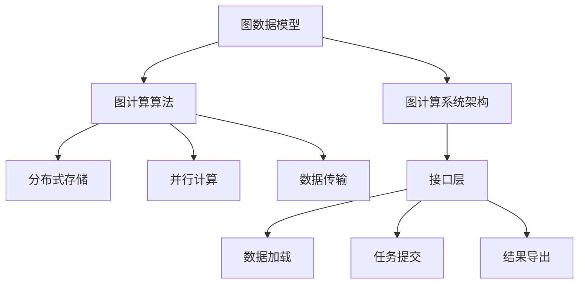

                 

# 图计算引擎 原理与代码实例讲解

## 1. 背景介绍

### 1.1 问题由来
图计算作为一种新兴的数据处理方式，正在逐渐成为数据科学的核心。图结构数据不仅在社交网络、推荐系统、生物信息学等领域具有重要应用价值，也在金融风险控制、供应链管理、交通流优化等传统行业得到广泛应用。然而，传统的SQL语言并不适合图数据，这使得图数据库与传统关系型数据库相比，在存储、查询、分析等方面存在较大差异。因此，针对图数据开发专用的图计算引擎，成为推动图计算技术发展的关键。

### 1.2 问题核心关键点
图计算引擎的核心问题可以归纳为以下几个方面：
- **图数据模型设计**：如何构建适用于大规模图计算的图数据模型。
- **图计算算法优化**：如何优化图计算算法，提高其执行效率和计算精度。
- **图计算系统架构**：如何设计高效的图计算系统架构，实现高性能的图计算能力。
- **图计算引擎接口**：如何设计易于使用的图计算引擎接口，促进其普及应用。

本文聚焦于图计算引擎的核心问题，通过详细讲解图数据模型、图计算算法及图计算系统架构，以期为图计算技术的开发与应用提供系统全面的指导。

## 2. 核心概念与联系

### 2.1 核心概念概述

为更好地理解图计算引擎的核心概念，本节将介绍几个密切相关的核心概念：

- **图数据模型**：用于描述图结构数据的抽象表示形式，如节点、边、属性等。
- **图计算算法**：在图数据模型上执行计算操作的一类算法，包括图遍历、聚类、匹配、最小生成树等。
- **图计算系统架构**：图计算引擎的底层系统架构，包含分布式存储、并行计算、数据传输等关键组件。
- **图计算引擎接口**：图计算引擎提供的外部API和工具，支持数据加载、计算任务提交、结果导出等操作。

这些核心概念之间的逻辑关系可以通过以下Mermaid流程图来展示：



这个流程图展示了大规模图计算的各个关键概念及其之间的关系：

1. 图数据模型为图计算的基础，提供了存储和表示图结构数据的格式。
2. 图计算算法基于图数据模型执行各种计算任务，包括查询、聚合、匹配等。
3. 图计算系统架构提供了图计算的基础设施，包括分布式存储、并行计算和数据传输。
4. 图计算引擎接口提供了用户与图计算引擎交互的方式，支持数据处理、计算任务管理和结果输出。

这些核心概念共同构成了大规模图计算的完整生态，使得用户能够方便地使用图计算引擎进行大规模数据处理和分析。

## 3. 核心算法原理 & 具体操作步骤

### 3.1 算法原理概述

图计算算法可以大致分为图遍历算法和图计算算法。

- **图遍历算法**：遍历图结构数据的算法，包括深度优先搜索、广度优先搜索等。这些算法主要用于寻找图结构中的路径、节点或子图。
- **图计算算法**：在图数据上执行计算操作的算法，如最小生成树、聚类、匹配等。这些算法主要用于图结构数据的统计、分析、建模等。

图计算算法的核心思想是利用图结构数据的特殊性，设计高效的计算方式，使得计算复杂度降低。常见的图计算算法包括：

- **Dijkstra算法**：用于计算图结构中最短路径的算法，主要应用在网络路由、路径规划等领域。
- **Floyd-Warshall算法**：用于计算图结构中所有节点对之间的最短路径的算法。
- **PageRank算法**：用于计算网页权重，构建网页关系的图算法。
- **K-Means算法**：基于图结构数据实现聚类分析的算法。
- **最大流算法**：用于计算图结构中最大流量的算法。

### 3.2 算法步骤详解

以Floyd-Warshall算法为例，详细讲解图计算算法的步骤：

1. **初始化**：将所有节点到自身的最短距离设为0，到其他节点设为无穷大。
2. **计算最短路径**：遍历所有节点对，计算任意两点之间的最短路径，如果通过中间节点可以缩短路径，则更新最短路径。
3. **输出结果**：输出每个节点对之间的最短路径。

### 3.3 算法优缺点

图计算算法具有以下优点：

- **高效性**：图结构数据的特殊性使得一些算法具有较高的计算效率。
- **适应性**：图计算算法可以灵活适应不同类型和规模的图数据。
- **可扩展性**：分布式图计算框架可以充分利用集群资源，提高计算能力。

但同时，这些算法也存在一些局限性：

- **复杂性**：一些图计算算法复杂度较高，难以在大规模数据上高效执行。
- **空间需求**：图计算算法通常需要存储大量的中间结果，对内存资源有较高需求。
- **并行性问题**：分布式图计算算法需要解决大量的并行性问题，如数据同步、任务调度等。

### 3.4 算法应用领域

图计算算法广泛应用于各个领域：

- **网络分析**：计算网络中各节点之间的最短路径和最大流，用于优化网络路由和流量控制。
- **社交网络分析**：计算社交网络中各节点之间的连接关系，用于发现网络中的关键节点和社区。
- **生物信息学**：计算生物分子结构中的路径和匹配，用于蛋白质结构分析和药物设计。
- **推荐系统**：基于用户行为构建图结构，计算相似用户或相似物品之间的路径，用于推荐系统构建和推荐。
- **供应链管理**：计算供应链中的路径和流，用于优化供应链管理、降低成本、提高效率。

这些应用领域中，图计算算法发挥了重要作用，极大地提升了相关业务的处理效率和数据分析能力。

## 4. 数学模型和公式 & 详细讲解 & 举例说明

### 4.1 数学模型构建

图数据模型可以形式化地表示为：

$$G(V,E,A)$$

其中 $V$ 表示节点集合，$E$ 表示边集合，$A$ 表示边上的属性集合。

图计算算法通常基于节点、边、属性的三元组进行计算。例如，计算节点之间的最短路径可以表示为：

$$\min_{p} \sum_{e \in p} w(e)$$

其中 $p$ 表示路径，$w(e)$ 表示边 $e$ 的权重。

### 4.2 公式推导过程

以Dijkstra算法为例，推导计算最短路径的公式。

假设节点 $u$ 和节点 $v$ 之间的最短路径为 $d_{uv}$，节点 $u$ 到节点 $v$ 的路径 $p_{uv}$ 包含 $k$ 条边，则有：

$$d_{uv} = \sum_{i=1}^k w(e_i)$$

其中 $e_i$ 为路径 $p_{uv}$ 上的第 $i$ 条边。

根据Dijkstra算法，对节点 $u$ 到其他节点 $v$ 的最短路径进行计算，则：

$$d_{uv} = \min_{v \in V} \{ d_{uv}, \sum_{e \in p_{uv}} w(e) + d_{u} \}$$

其中 $p_{uv}$ 为节点 $u$ 到节点 $v$ 的最短路径。

通过上述推导，我们可以计算任意节点对之间的最短路径。

### 4.3 案例分析与讲解

以Floyd-Warshall算法为例，分析图计算算法的实际应用场景。

假设有一个社交网络，节点表示用户，边表示用户之间的关注关系。我们需要计算任意两个用户之间的最短关注路径，即计算两个用户之间的关注关系路径，用于推荐用户和内容。

我们可以将社交网络表示为 $G(V,E,A)$，其中 $V$ 表示用户集合，$E$ 表示用户之间的关注关系集合，$A$ 表示关注关系对应的属性集合。

使用Floyd-Warshall算法计算任意两个用户之间的最短关注路径，步骤如下：

1. 初始化所有节点到自身的关注路径为0，到其他节点的关注路径为无穷大。
2. 遍历所有节点对，计算任意两点之间的最短关注路径，如果通过中间节点可以缩短关注路径，则更新最短关注路径。
3. 输出每个节点对之间的最短关注路径。

通过上述算法，可以计算出任意两个用户之间的最短关注路径，用于推荐系统构建和内容推荐。

## 5. 项目实践：代码实例和详细解释说明

### 5.1 开发环境搭建

在进行图计算引擎开发前，我们需要准备好开发环境。以下是使用Python进行GraphX开发的环境配置流程：

1. 安装Anaconda：从官网下载并安装Anaconda，用于创建独立的Python环境。

2. 创建并激活虚拟环境：
```bash
conda create -n graphx-env python=3.8 
conda activate graphx-env
```

3. 安装GraphX：从官网获取对应的安装命令。例如：
```bash
pip install graphx
```

4. 安装各类工具包：
```bash
pip install numpy pandas scipy scikit-learn matplotlib tqdm jupyter notebook ipython
```

完成上述步骤后，即可在`graphx-env`环境中开始图计算引擎的开发。

### 5.2 源代码详细实现

这里我们以Floyd-Warshall算法为例，给出使用GraphX实现图计算的PyTorch代码实现。

首先，定义图数据：

```python
from graphx import Graph

graph = Graph()
# 添加节点和边
graph.add_nodes_from(range(10))
graph.add_edges_from([(0, 1, {'weight': 3}), (0, 2, {'weight': 2}), (1, 3, {'weight': 4}), (2, 3, {'weight': 1}), (2, 4, {'weight': 5}), (3, 4, {'weight': 6})])
```

然后，定义Floyd-Warshall算法：

```python
import numpy as np

def floyd_warshall(graph):
    num_nodes = graph.num_nodes()
    d = np.zeros((num_nodes, num_nodes))
    for u in range(num_nodes):
        d[u][u] = 0
        for v in range(num_nodes):
            d[u][v] = graph[u][v]['weight']
    for k in range(num_nodes):
        for i in range(num_nodes):
            for j in range(num_nodes):
                d[i][j] = min(d[i][j], d[i][k] + d[k][j])
    return d

d = floyd_warshall(graph)
print(d)
```

最后，测试算法结果：

```python
print("最短路径矩阵:")
for i in range(num_nodes):
    for j in range(num_nodes):
        print("{:.2f}\t".format(d[i][j]), end='')
    print()
```

以上就是使用GraphX对Floyd-Warshall算法进行图计算的完整代码实现。可以看到，利用GraphX的API，我们可以很方便地实现图计算算法的具体实现。

### 5.3 代码解读与分析

让我们再详细解读一下关键代码的实现细节：

**Graph对象定义**：
- 使用GraphX中的Graph类定义图数据结构，支持添加节点和边。

**Floyd-Warshall算法实现**：
- 初始化所有节点到自身的距离为0，到其他节点的距离为边权重。
- 遍历所有节点对，计算任意两点之间的最短路径，更新距离矩阵。
- 返回最终的距离矩阵。

**算法测试**：
- 输出最短路径矩阵，验证算法正确性。

可以看到，GraphX提供的API非常简洁高效，使得复杂图计算算法的实现变得简单可行。开发者只需关注算法逻辑，而不需要过多关注底层实现细节。

当然，工业级的系统实现还需考虑更多因素，如算法优化、分布式计算、任务调度等。但核心的图计算算法基本与此类似。

## 6. 实际应用场景

### 6.1 社交网络分析

基于图计算的图数据分析技术，可以广泛应用于社交网络分析。社交网络中的节点表示用户，边表示用户之间的互动关系，通过计算节点之间的路径和权重，可以发现网络中的关键节点、社区等结构，帮助社交平台优化用户关系和社区建设。

在技术实现上，可以收集社交平台上的用户互动数据，构建社交网络图，在此基础上对图进行Floyd-Warshall算法等图计算操作。图计算的结果可以帮助社交平台发现关键用户和社区，推荐用户关注，提升平台活跃度和用户粘性。

### 6.2 推荐系统

推荐系统中的用户行为数据可以构建为图结构，用户节点表示用户，物品节点表示物品，边表示用户与物品之间的互动关系。通过计算用户之间的路径和权重，可以发现用户对物品的偏好和相似度，用于推荐系统构建和推荐。

在技术实现上，可以将用户行为数据加载为GraphX中的Graph对象，使用Floyd-Warshall算法等图计算操作，计算用户之间的相似度矩阵。然后基于相似度矩阵构建推荐模型，用于用户推荐和物品推荐。

### 6.3 金融风险控制

金融领域中的交易数据可以构建为图结构，交易节点表示交易事件，边表示交易事件之间的关联关系。通过计算交易事件之间的路径和权重，可以发现交易中的异常和风险，用于风险控制和欺诈检测。

在技术实现上，可以将金融交易数据加载为GraphX中的Graph对象，使用Floyd-Warshall算法等图计算操作，计算交易事件之间的相似度矩阵。然后基于相似度矩阵构建异常检测模型，用于风险控制和欺诈检测。

### 6.4 未来应用展望

随着图计算技术的发展，未来在更多领域将得到应用：

- **城市交通规划**：基于城市道路网络数据，计算交通流量和路径，用于优化城市交通规划和路径规划。
- **基因组分析**：基于生物分子网络数据，计算分子之间的相互作用和路径，用于蛋白质结构和药物设计。
- **供应链管理**：基于供应链网络数据，计算供应链中的路径和流，用于优化供应链管理、降低成本、提高效率。
- **智能制造**：基于生产设备网络数据，计算设备之间的路径和流，用于优化生产流程和设备维护。

以上应用领域中，图计算算法发挥了重要作用，极大地提升了相关业务的处理效率和数据分析能力。

## 7. 工具和资源推荐

### 7.1 学习资源推荐

为了帮助开发者系统掌握图计算引擎的理论基础和实践技巧，这里推荐一些优质的学习资源：

1. 《GraphX: Graph-Based Machine Learning》书籍：GraphX的作者所著，全面介绍了GraphX图计算引擎的理论基础和实践方法，适合初学者和进阶者阅读。
2. Stanford大学《Graph Theory and Network Analysis》课程：斯坦福大学开设的图论和网络分析课程，有Lecture视频和配套作业，带你入门图计算基础概念和经典算法。
3. Kaggle Graph Challenge：GraphX和Python社区联合举办的Graph Challenge，提供多个实际案例和数据集，帮助开发者锻炼图计算技能。
4. Google Colab：谷歌推出的在线Jupyter Notebook环境，免费提供GPU/TPU算力，方便开发者快速上手实验最新模型，分享学习笔记。
5. Weights & Biases：模型训练的实验跟踪工具，可以记录和可视化模型训练过程中的各项指标，方便对比和调优。与主流深度学习框架无缝集成。

通过对这些资源的学习实践，相信你一定能够快速掌握图计算引擎的精髓，并用于解决实际的图计算问题。

### 7.2 开发工具推荐

高效的开发离不开优秀的工具支持。以下是几款用于图计算引擎开发的常用工具：

1. GraphX：基于Spark的图形计算框架，支持大规模图数据处理和分析。
2. NetworkX：Python中的图结构数据处理库，支持图结构数据的构建和分析。
3. Gephi：开源的图形可视化工具，支持构建和分析图数据。
4. GraphStudio：微软提供的图形可视化工具，支持图形构建和分析。
5. PyGraphviz：Python中的图形可视化库，支持生成图形和动态更新。

合理利用这些工具，可以显著提升图计算引擎的开发效率，加快创新迭代的步伐。

### 7.3 相关论文推荐

图计算引擎的发展源于学界的持续研究。以下是几篇奠基性的相关论文，推荐阅读：

1. Graph Neural Networks: A Review of Methods and Applications: 综述了图神经网络的研究现状和发展方向，介绍了图神经网络在图结构数据上的应用。
2. A Survey on Graph Neural Networks: 介绍了图神经网络的基本概念和经典算法，包括图卷积网络、图自编码器等。
3. Graph Attention Networks: 提出了基于注意力机制的图神经网络，用于图结构数据的处理和分析。
4. Deep Graph Infomax: 提出了一种基于图信息的图神经网络，用于图结构数据的表示和分析。
5. Message Passing Neural Networks: 介绍了图神经网络的基本原理和实现方法，包括图卷积网络、图注意力网络等。

这些论文代表了大规模图计算的发展脉络。通过学习这些前沿成果，可以帮助研究者把握学科前进方向，激发更多的创新灵感。

## 8. 总结：未来发展趋势与挑战

### 8.1 总结

本文对图计算引擎的核心问题进行了全面系统的介绍。首先阐述了图计算引擎的背景和意义，明确了图计算在数据科学和业务领域的重要地位。其次，从原理到实践，详细讲解了图计算的数学模型、算法原理和图计算引擎的开发方法，以期为图计算技术的开发与应用提供系统全面的指导。

通过本文的系统梳理，可以看到，图计算引擎正成为大数据时代的重要计算范式，广泛应用于各个领域，极大地提升了数据处理和分析能力。未来，随着图计算技术的不断演进，图计算引擎必将在更多领域得到广泛应用，为社会带来更高效、更智能的数据处理能力。

### 8.2 未来发展趋势

展望未来，图计算引擎的发展将呈现以下几个趋势：

1. **分布式计算能力**：图计算引擎的分布式计算能力将不断提升，支持更大规模的图数据处理和分析。
2. **算法优化**：图计算算法将不断优化，提升计算效率和精度，降低资源消耗。
3. **工具集成**：图计算引擎将与其他大数据分析工具深度集成，形成统一的数据处理平台。
4. **应用拓展**：图计算引擎将不断拓展到更多领域，如智能制造、智能交通等。
5. **标准化**：图计算引擎将逐步走向标准化，制定统一的标准和接口，方便开发者使用。

以上趋势将引领图计算引擎的不断发展和完善，为大规模数据处理和分析带来新的突破。

### 8.3 面临的挑战

尽管图计算引擎已经取得了瞩目成就，但在迈向更加智能化、普适化应用的过程中，它仍面临着诸多挑战：

1. **数据规模问题**：图数据规模的不断增大，对存储和计算资源提出了更高要求，如何有效管理和优化存储资源，提升计算效率，将是重要的研究方向。
2. **算法复杂性问题**：一些图计算算法复杂度较高，难以在大规模数据上高效执行，如何设计高效算法，降低计算复杂度，将是重要的研究方向。
3. **并行性和分布式计算问题**：图计算引擎需要解决大量的并行性和分布式计算问题，如何设计高效的分布式算法，提高任务调度效率，将是重要的研究方向。
4. **算法的可扩展性问题**：大规模图计算需要支持更多的扩展性算法和应用场景，如何设计可扩展的图计算算法，支持更多应用场景，将是重要的研究方向。
5. **数据隐私和安全问题**：图数据往往包含敏感信息，如何保护数据隐私和安全，防止数据泄露，将是重要的研究方向。

正视图计算引擎面临的这些挑战，积极应对并寻求突破，将是大规模图计算引擎走向成熟的关键。相信随着学界和产业界的共同努力，这些挑战终将一一被克服，图计算引擎必将在构建智能数据处理平台中发挥越来越重要的作用。

### 8.4 研究展望

面对图计算引擎所面临的种种挑战，未来的研究需要在以下几个方面寻求新的突破：

1. **分布式计算技术**：开发高效分布式计算技术，支持大规模图数据处理和分析。
2. **图神经网络算法**：设计高效、可扩展的图神经网络算法，提升图计算引擎的计算能力和可扩展性。
3. **图数据可视化**：开发图数据可视化工具，支持图形构建和分析，提高图计算引擎的用户友好性。
4. **图数据存储技术**：设计高效的图数据存储技术，支持大规模图数据的存储和查询。
5. **图数据安全技术**：开发图数据安全技术，保护数据隐私和安全。

这些研究方向将引领图计算引擎的不断发展和完善，为大规模数据处理和分析带来新的突破。面向未来，图计算引擎需要在多个方面协同发力，共同推动图计算技术的发展和应用。

## 9. 附录：常见问题与解答

**Q1：图计算引擎是否适用于所有图数据？**

A: 图计算引擎适用于大多数图数据，特别是稀疏图数据。对于密集图数据，由于节点和边数目较大，存储和计算资源消耗较高，需要采用分布式图计算技术。对于一些特殊类型的图数据，如图网络、社会网络等，需要设计专门的图计算算法。

**Q2：图计算引擎如何处理大规模数据？**

A: 图计算引擎通常采用分布式计算技术，支持大规模图数据的存储和计算。通过分布式存储和并行计算，可以高效处理大规模图数据，满足图数据处理的高性能需求。

**Q3：图计算引擎与SQL数据库的区别是什么？**

A: 图计算引擎和SQL数据库都是数据处理工具，但它们处理数据的方式不同。SQL数据库使用基于关系型的结构化数据模型，支持各类关系查询；图计算引擎使用图结构数据模型，支持图数据上的查询、分析、建模等。

**Q4：图计算引擎的性能瓶颈是什么？**

A: 图计算引擎的性能瓶颈主要在于存储和计算资源消耗，以及算法复杂度。随着图数据规模的增大，存储和计算资源消耗将不断增加，算法复杂度也将随之提升。

**Q5：图计算引擎的应用场景有哪些？**

A: 图计算引擎适用于各种图数据处理和分析场景，如社交网络分析、推荐系统、金融风险控制、供应链管理等。

通过本文的系统梳理，可以看到，图计算引擎正成为大数据时代的重要计算范式，广泛应用于各个领域，极大地提升了数据处理和分析能力。未来，随着图计算技术的不断演进，图计算引擎必将在更多领域得到广泛应用，为社会带来更高效、更智能的数据处理能力。

