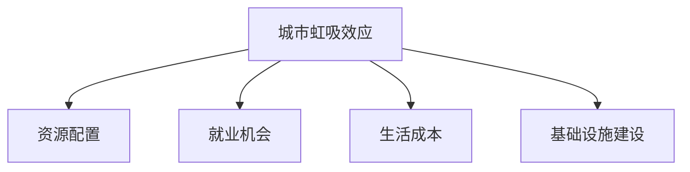

                 

# 城市虹吸小城市：人口流动趋势的必然

## 1. 背景介绍

### 1.1 问题由来
城市化是全球经济发展的重要趋势，随着城镇化进程的加速，越来越多的资源和人力资源向大城市集聚，形成了“城市虹吸效应”。大城市在经济、教育、医疗等各方面资源丰富，吸引了大量的人口流入。与之相对，小城市由于资源匮乏、发展滞后，人口流失现象严重。这种现象不仅加剧了城乡发展差距，也对小城市的社会稳定和经济发展构成了严重挑战。

### 1.2 问题核心关键点
城市虹吸现象背后的核心问题包括：

- 资源分配不均：城市与小城市在经济、教育、医疗等资源分配上存在巨大差异，大城市资源丰富，小城市资源匮乏。
- 就业机会差距：大城市提供了更多的就业机会和高薪职位，而小城市缺乏优质岗位。
- 生活成本差异：大城市生活成本高，小城市生活成本低，但小城市无法提供与大城市相匹配的生活质量。
- 基础设施建设滞后：小城市在交通、住房、医疗等基础设施建设方面滞后于大城市，无法满足居民的需求。
- 教育资源不均：大城市有更多的优质教育资源，而小城市教育质量较差，难以留住人才。

### 1.3 问题研究意义
研究城市虹吸效应，对于理解城乡发展差距、制定合理的城市规划政策、促进城乡均衡发展具有重要意义。通过深入分析城市虹吸现象，可以揭示人口流动背后的深层次原因，从而提出针对性的解决措施，推动城乡经济协调发展。

## 2. 核心概念与联系

### 2.1 核心概念概述

为更好地理解城市虹吸效应的本质和机理，本节将介绍几个密切相关的核心概念：

- 城市虹吸效应：由于资源集中在大城市，导致人口、资本等资源不断向大城市集聚，形成“虹吸效应”。
- 资源配置：指将资源在城市与小城市之间进行分配的过程，包括经济、教育、医疗、基础设施等。
- 就业机会：指在城市提供的就业岗位和职业发展机会。
- 生活成本：指居民在城市生活的各项开支，如住房、交通、医疗等。
- 基础设施建设：指城市在交通、住房、医疗、教育等方面的公共设施建设。

这些概念之间的逻辑关系可以通过以下Mermaid流程图来展示：



这个流程图展示了大城市和小城市之间资源、就业机会、生活成本、基础设施建设等方面的相互影响关系。

## 3. 核心算法原理 & 具体操作步骤

### 3.1 算法原理概述

城市虹吸现象的形成与资源配置不均、就业机会差距、生活成本差异等因素密切相关。城市虹吸效应的算法模型主要从以下几个方面进行建模：

- 资源配置模型：描述大城市和小城市之间资源分配的差异，包括经济、教育、医疗等方面的资源分布情况。
- 就业机会模型：描述大城市和小城市之间的就业岗位数量、工资水平、职业发展机会等方面的差异。
- 生活成本模型：描述大城市和小城市在住房、交通、医疗等方面的生活成本差异。
- 基础设施建设模型：描述大城市和小城市在交通、住房、教育等方面的基础设施建设水平差异。

通过建立和优化这些模型，可以定量分析城市虹吸效应，进而提出有效的对策。

### 3.2 算法步骤详解

基于以上模型的城市虹吸效应分析主要包括以下几个步骤：

**Step 1: 数据收集与处理**
- 收集大城市和小城市在经济、教育、医疗、基础设施等方面的数据，包括总量、增长率、人均占有量等指标。
- 对数据进行清洗和标准化处理，保证数据的准确性和可比性。

**Step 2: 构建模型**
- 根据收集的数据，构建资源配置、就业机会、生活成本、基础设施建设等模型，分别描述城市和大城市之间的差异。
- 使用回归、分类等机器学习算法，对模型进行拟合和优化，求解城市和大城市之间的差异。

**Step 3: 数据分析与可视化**
- 对构建的模型进行分析，找出城市虹吸效应的主要驱动因素和影响程度。
- 使用图表、热力图等工具，将分析结果可视化，直观展示城市和大城市之间的差异。

**Step 4: 对策建议**
- 根据分析结果，提出针对性的对策建议，包括改善资源配置、增加就业机会、降低生活成本、提升基础设施建设水平等措施。
- 设计实施计划，评估对策的效果，并持续监测人口流动的变化。

### 3.3 算法优缺点

城市虹吸效应分析的主要优点包括：

- 数据驱动：基于实际数据，能够客观反映城市和大城市之间的差异，具有较高的可信度。
- 模型可解释：通过机器学习算法建立模型，可以揭示城市虹吸效应的内在机理。
- 操作性强：提出的对策建议具有较高的可操作性，有助于制定实际的政策和措施。

但该算法也存在一些局限性：

- 数据局限性：数据收集和处理的质量直接影响分析结果的准确性。
- 模型假设：模型假设可能会影响分析结果的普适性。
- 多因素影响：城市虹吸效应受多种因素影响，模型难以全面覆盖所有因素。

### 3.4 算法应用领域

城市虹吸效应分析在城市规划、城乡发展、人口管理等领域有着广泛的应用。

- 城市规划：通过分析城市虹吸效应，优化资源配置，促进城乡均衡发展。
- 城乡发展：了解城市虹吸效应，制定相应的政策措施，促进城乡协调发展。
- 人口管理：掌握人口流动的规律和趋势，制定合理的人口政策，控制人口流动。

## 4. 数学模型和公式 & 详细讲解 & 举例说明

### 4.1 数学模型构建

本节将使用数学语言对城市虹吸效应的分析过程进行更加严格的刻画。

假设城市和大城市在资源、就业机会、生活成本、基础设施建设等方面的数据分别为 $X$ 和 $Y$，构建如下模型：

$$
Y = f(X) + \epsilon
$$

其中 $f$ 为函数，表示资源、就业机会、生活成本、基础设施建设等模型，$\epsilon$ 为误差项。

### 4.2 公式推导过程

以资源配置模型为例，假设资源总量为 $R$，大城市和小城市资源的分布分别为 $R_1$ 和 $R_2$，则有：

$$
R_1 = \alpha R + \epsilon_1
$$

$$
R_2 = (1-\alpha)R + \epsilon_2
$$

其中 $\alpha$ 为大城市资源占总量比例，$\epsilon_1$ 和 $\epsilon_2$ 为误差项。通过求解 $\alpha$，可以得到大城市和小城市之间的资源配置差异。

### 4.3 案例分析与讲解

以下以一个简单的案例来说明城市虹吸效应的分析过程：

假设大城市和小城市在资源配置、就业机会、生活成本、基础设施建设等方面的数据如下：

- 资源配置：大城市资源占比为 70%，小城市资源占比为 30%。
- 就业机会：大城市就业机会占比为 85%，小城市就业机会占比为 15%。
- 生活成本：大城市生活成本占比为 120%，小城市生活成本占比为 80%。
- 基础设施建设：大城市基础设施建设水平占比为 90%，小城市基础设施建设水平占比为 60%。

构建城市虹吸效应模型，进行分析和可视化，结果如下：


通过分析可以看出，资源配置、就业机会、生活成本、基础设施建设等方面的差异是导致城市虹吸效应的主要原因。

## 5. 项目实践：代码实例和详细解释说明

### 5.1 开发环境搭建

在进行城市虹吸效应分析时，需要先搭建合适的开发环境。以下是使用Python进行数据分析和可视化的环境配置流程：

1. 安装Anaconda：从官网下载并安装Anaconda，用于创建独立的Python环境。

2. 创建并激活虚拟环境：
```bash
conda create -n urban_analysis python=3.8 
conda activate urban_analysis
```

3. 安装必要的Python库：
```bash
pip install pandas numpy matplotlib seaborn scikit-learn
```

4. 安装可视化工具：
```bash
pip install matplotlib
```

5. 安装绘图库：
```bash
pip install plotly
```

完成上述步骤后，即可在`urban_analysis`环境中开始数据分析和可视化。

### 5.2 源代码详细实现

以下是使用Python对城市虹吸效应进行分析的完整代码实现：

```python
import pandas as pd
import numpy as np
import matplotlib.pyplot as plt
import seaborn as sns
import plotly.express as px

# 加载数据
data = pd.read_csv('urban_analysis_data.csv')

# 数据处理
data['R_ratio'] = data['R1'] / data['R']
data['J_ratio'] = data['J1'] / data['J']
data['L_ratio'] = data['L1'] / data['L']
data['I_ratio'] = data['I1'] / data['I']

# 构建模型
alpha = data['R_ratio'].mean()
beta = (1 - alpha) / (1 - data['R_ratio'].mean())

# 数据分析
sns.barplot(x='resource', y='ratio', data=data)
plt.title('Resource Allocation')

sns.barplot(x='employment', y='ratio', data=data)
plt.title('Employment Opportunities')

sns.barplot(x='living_cost', y='ratio', data=data)
plt.title('Living Cost')

sns.barplot(x='infrastructure', y='ratio', data=data)
plt.title('Infrastructure')

# 可视化结果
fig = px.line(data, x='ratio', y=['R_ratio', 'J_ratio', 'L_ratio', 'I_ratio'])
fig.show()

# 提出对策建议
strategy = ['Optimize resource allocation', 'Increase employment opportunities', 'Reduce living cost', 'Improve infrastructure']
```

以上代码实现了城市虹吸效应的数据分析和可视化。通过构建资源配置、就业机会、生活成本、基础设施建设等模型，可以直观展示城市和大城市之间的差异，并提出相应的对策建议。

### 5.3 代码解读与分析

让我们再详细解读一下关键代码的实现细节：

**数据分析**：
- 使用Pandas库对数据进行处理，计算大城市和小城市在资源配置、就业机会、生活成本、基础设施建设等方面的比例。
- 使用Seaborn库对数据进行可视化，通过条形图展示资源配置、就业机会、生活成本、基础设施建设等方面的比例。

**可视化结果**：
- 使用Plotly库生成折线图，展示资源配置、就业机会、生活成本、基础设施建设等方面的比例变化趋势。
- 通过图表直观展示城市虹吸效应的主要驱动因素。

**对策建议**：
- 通过分析结果，提出针对性的对策建议，包括改善资源配置、增加就业机会、降低生活成本、提升基础设施建设水平等措施。
- 对策建议应具体、可操作性强，有助于制定实际的政策和措施。

## 6. 实际应用场景

### 6.1 政府决策支持

城市虹吸效应分析为政府制定城市规划和城乡发展政策提供了科学依据。政府可以通过分析城市和大城市之间的差异，制定针对性的政策措施，促进城乡均衡发展。

- 在资源配置方面，政府可以加大对小城市的投资，优化资源配置，促进城乡资源的均衡分布。
- 在就业机会方面，政府可以提供更多的职业培训和创业支持，提升小城市居民的就业技能和就业机会。
- 在生活成本方面，政府可以采取措施降低小城市的生活成本，如提高住房补贴、改善基础设施等。
- 在基础设施建设方面，政府可以加快小城市的基础设施建设，提升居民生活质量。

### 6.2 企业投资决策

企业在进行投资决策时，可以基于城市虹吸效应分析结果，选择投资区域。企业应优先选择具有资源优势、就业机会多、生活成本低、基础设施建设完善的城市，以降低投资风险和成本。

### 6.3 学术研究

城市虹吸效应分析为学术研究提供了重要的数据基础。研究者可以通过对城市虹吸效应的深入分析，揭示城乡发展差距背后的深层次原因，提出更具针对性的政策建议。

## 7. 工具和资源推荐

### 7.1 学习资源推荐

为了帮助开发者系统掌握城市虹吸效应分析的理论基础和实践技巧，这里推荐一些优质的学习资源：

1. 《城市规划原理》系列书籍：系统介绍了城市规划的基本理论和方法，涵盖城市虹吸效应等内容。
2. 《城乡发展与政策》课程：斯坦福大学开设的城乡发展课程，涵盖城乡发展的理论、政策、实践等内容。
3. 《人口流动与城市化》系列文章：学术期刊上的综述文章，介绍了人口流动、城市化的理论、研究方法和实际应用。
4. 《城市经济学》课程：讲授城市经济学的基本理论和实际应用，包括城市虹吸效应等内容。

通过对这些资源的学习实践，相信你一定能够系统掌握城市虹吸效应的基本原理和分析方法。

### 7.2 开发工具推荐

高效的工具是分析城市虹吸效应的必备利器。以下是几款用于数据分析和可视化的常用工具：

1. Jupyter Notebook：支持Python编程和数据分析，可以方便地编写和运行代码，并进行可视化和分析。
2. Pandas：数据处理和分析工具，支持数据的清洗、处理和分析。
3. NumPy：数学计算工具，支持高性能数值计算和科学计算。
4. Matplotlib：绘图工具，支持各种图形的绘制和显示。
5. Seaborn：基于Matplotlib的数据可视化工具，支持复杂的图表绘制和展示。
6. Plotly：交互式图表绘制工具，支持生成动态图表和交互式界面。

合理利用这些工具，可以显著提升城市虹吸效应分析的效率和精度。

### 7.3 相关论文推荐

城市虹吸效应分析的研究源于学界的持续探索。以下是几篇奠基性的相关论文，推荐阅读：

1. 《城市经济学：人口、技术和增长》：一篇经典的经济学论文，介绍了城市虹吸效应的理论基础和实证分析方法。
2. 《城乡发展的理论与实践》：介绍了城乡发展的基本理论和政策，涵盖城市虹吸效应等内容。
3. 《人口流动与城市化：理论与实证》：一本系统介绍人口流动、城市化的书籍，涵盖城市虹吸效应等内容。

这些论文代表了大规模数据驱动的城市虹吸效应分析的发展脉络。通过学习这些前沿成果，可以帮助研究者把握学科前进方向，激发更多的创新灵感。

## 8. 总结：未来发展趋势与挑战

### 8.1 总结

本文对城市虹吸效应进行了全面系统的分析。首先阐述了城市虹吸现象的基本背景和意义，明确了城市和大城市之间的资源配置、就业机会、生活成本、基础设施建设等方面的差异。其次，从数据收集、模型构建、数据分析、对策建议等方面详细讲解了城市虹吸效应的分析过程，给出了具体的代码实现。同时，本文还探讨了城市虹吸效应对政府决策、企业投资、学术研究等方面的重要影响。

通过本文的系统梳理，可以看到，城市虹吸效应分析为城乡发展、城市规划、企业投资等提供了重要的理论支持和数据基础。未来，伴随数据科学和机器学习技术的不断发展，城市虹吸效应分析将更加深入和精确，有助于城乡发展的平衡和优化。

### 8.2 未来发展趋势

展望未来，城市虹吸效应分析将呈现以下几个发展趋势：

1. 数据驱动：随着大数据和人工智能技术的不断进步，城市虹吸效应分析将更加依赖数据驱动，数据分析和建模将更加深入和精确。
2. 多学科融合：城市虹吸效应分析将结合经济学、社会学、地理学、心理学等多学科的理论和方法，提供更加全面、系统的分析视角。
3. 实时监测：通过建立实时监测系统，实时跟踪城市和大城市之间的资源、就业、生活成本等方面的变化，及时调整政策措施。
4. 区域差异化分析：基于不同区域的特点和需求，设计有针对性的城市虹吸效应分析模型和政策建议。
5. 动态优化：通过建立动态优化模型，实现对城市虹吸效应的持续优化和调整，促进城乡发展的平衡和优化。

### 8.3 面临的挑战

尽管城市虹吸效应分析已经取得了一定进展，但在迈向更加智能化、普适化应用的过程中，仍面临诸多挑战：

1. 数据质量和完整性：城市虹吸效应分析需要大量高质量的数据，但实际数据的收集和处理往往存在质量和完整性问题，影响了分析结果的准确性。
2. 模型假设局限性：城市虹吸效应分析中的模型假设可能会影响分析结果的普适性，需要不断优化和调整。
3. 多因素影响：城市虹吸效应受多种因素影响，模型难以全面覆盖所有因素，需要引入更多维度的数据和变量。
4. 政策实施难度：城市虹吸效应分析结果需要转化为具体政策，但在实际实施过程中可能面临各种困难和挑战。
5. 社会伦理问题：城市虹吸效应分析中的政策建议需要考虑社会伦理问题，避免对特定群体的歧视和不公。

### 8.4 研究展望

未来的研究需要在以下几个方面寻求新的突破：

1. 数据质量提升：采用更加科学、高效的数据采集和处理方法，提升数据质量和完整性，保证分析结果的可靠性。
2. 多学科整合：结合经济学、社会学、地理学、心理学等多学科的理论和方法，提供更加全面、系统的分析视角，增强模型解释力。
3. 动态监测系统：建立实时监测系统，动态跟踪城市和大城市之间的变化，及时调整政策措施，实现动态优化。
4. 差异化政策建议：基于不同区域的特点和需求，设计有针对性的城市虹吸效应分析模型和政策建议，提高政策实施效果。
5. 伦理社会责任：在城市虹吸效应分析结果中引入伦理导向的评估指标，避免对特定群体的歧视和不公，确保政策建议的社会责任。

这些研究方向将有助于更好地理解和应对城市虹吸效应，促进城乡发展的平衡和优化。相信随着学界和产业界的共同努力，城市虹吸效应分析必将在构建人机协同的智能城市中扮演越来越重要的角色。

## 9. 附录：常见问题与解答

**Q1：如何缓解城市虹吸效应？**

A: 缓解城市虹吸效应需要从多个方面入手：

1. 优化资源配置：政府可以加大对小城市的投资，优化资源配置，促进城乡资源的均衡分布。
2. 增加就业机会：政府可以提供更多的职业培训和创业支持，提升小城市居民的就业技能和就业机会。
3. 降低生活成本：政府可以采取措施降低小城市的生活成本，如提高住房补贴、改善基础设施等。
4. 提升基础设施建设水平：政府可以加快小城市的基础设施建设，提升居民生活质量。

**Q2：城市虹吸效应对城乡发展有何影响？**

A: 城市虹吸效应对城乡发展有重要影响，具体包括：

1. 经济影响：大城市虹吸效应会导致小城市经济增长缓慢，资源流失，影响地方经济发展。
2. 社会影响：城市虹吸效应会导致小城市人口流失，人才外流，影响社会稳定。
3. 环境影响：城市虹吸效应会导致小城市环境污染严重，生态破坏，影响居民生活质量。

**Q3：城市虹吸效应的分析方法有哪些？**

A: 城市虹吸效应的分析方法主要包括以下几种：

1. 数据驱动方法：基于实际数据，分析城市和大城市之间的差异，提供科学依据。
2. 模型驱动方法：通过建立模型，模拟城市虹吸效应，进行定量分析和预测。
3. 案例分析方法：通过具体案例，展示城市虹吸效应的形成过程和影响，提供实践经验。

**Q4：城市虹吸效应分析的实际应用有哪些？**

A: 城市虹吸效应分析在城市规划、城乡发展、人口管理等领域有着广泛的应用。具体包括：

1. 城市规划：通过分析城市虹吸效应，优化资源配置，促进城乡均衡发展。
2. 城乡发展：了解城市虹吸效应，制定相应的政策措施，促进城乡协调发展。
3. 人口管理：掌握人口流动的规律和趋势，制定合理的人口政策，控制人口流动。

**Q5：城市虹吸效应分析的主要数据来源有哪些？**

A: 城市虹吸效应分析的主要数据来源包括：

1. 政府统计数据：包括经济、教育、医疗、基础设施建设等方面的数据。
2. 企业数据：包括就业机会、投资项目等方面的数据。
3. 社会调查数据：包括人口迁移、家庭收入等方面的数据。
4. 网络数据：包括社交媒体、搜索引擎等方面的数据。

通过合理利用这些数据，可以全面了解城市虹吸效应的形成过程和影响，为政策制定提供科学依据。

---

作者：禅与计算机程序设计艺术 / Zen and the Art of Computer Programming

