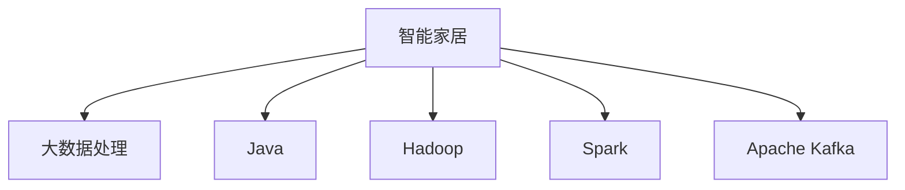

                 

# 基于Java的智能家居设计：探讨Java在智能家居大数据处理中的角色

## 1. 背景介绍

随着互联网技术的快速发展和物联网设备的普及，智能家居领域正经历着前所未有的变革。智能家居系统通过互联网连接各种家居设备，实现远程控制、场景设置、数据分析等功能，极大地提升了人们的生活质量。然而，随着数据量的不断增长，智能家居系统对大数据处理能力提出了更高的要求。Java作为一种成熟且广泛使用的编程语言，其在智能家居大数据处理中的角色越来越受到重视。本文将深入探讨Java在智能家居大数据处理中的应用，分析其核心概念、原理、操作步骤、优缺点以及未来发展趋势，以期为智能家居系统开发者提供有价值的参考。

## 2. 核心概念与联系

### 2.1 核心概念概述

为更好地理解Java在智能家居大数据处理中的作用，本节将介绍几个密切相关的核心概念：

- **智能家居（Smart Home）**：通过物联网技术，将各种家居设备连接起来，实现远程控制、场景设置、数据分析等功能。智能家居系统依赖大数据处理能力，以提供实时、个性化的用户体验。
- **大数据处理（Big Data Processing）**：处理大规模数据集，提取有用信息，进行分析和决策。智能家居系统通过大数据处理，实现对家居环境的实时监控、预测和优化。
- **Java编程语言**：一种面向对象的编程语言，广泛应用于企业级应用、云计算、大数据等领域。Java具有高效、可移植、安全等优点，是智能家居系统的重要技术支撑。
- **Hadoop**：一个开源的分布式计算框架，能够处理大规模数据集。Hadoop是智能家居系统常用的数据处理平台之一。
- **Spark**：另一个开源的分布式计算框架，提供内存计算、流处理等功能。Spark在大数据处理中的应用广泛，包括智能家居系统。
- **Apache Kafka**：一个高吞吐量的分布式消息系统，用于智能家居系统数据的实时传输和处理。

这些核心概念之间的逻辑关系可以通过以下Mermaid流程图来展示：



这个流程图展示了大数据处理和Java在智能家居中的核心作用及其相互关系：

1. 智能家居系统通过各种传感器和设备收集数据，通过Hadoop、Spark等大数据处理平台进行实时数据处理。
2. Java作为智能家居系统的主流编程语言，提供了强大的开发框架和库支持。
3. Apache Kafka等消息系统确保了数据的高效传输和处理。
4. Java的应用使智能家居系统具有高可扩展性、高可靠性和高性能。

## 3. 核心算法原理 & 具体操作步骤

### 3.1 算法原理概述

Java在智能家居大数据处理中的核心算法原理主要基于分布式计算和内存计算技术。智能家居系统通过分布式计算框架，如Hadoop、Spark等，对大量传感器和设备生成的数据进行并行处理。同时，Java作为Hadoop和Spark的主要编程语言，支持分布式算法和内存计算技术，极大提高了数据处理的效率和性能。

### 3.2 算法步骤详解

基于Java的智能家居大数据处理主要包括以下几个关键步骤：

**Step 1: 数据收集和预处理**
- 使用传感器和设备（如温度传感器、湿度传感器、智能音箱等）收集家居环境数据。
- 对原始数据进行清洗、去重、标准化等预处理，以提高后续数据处理的准确性。

**Step 2: 数据存储与管理**
- 将预处理后的数据存储在分布式文件系统中，如Hadoop的HDFS。
- 使用Apache Kafka进行数据的实时传输和异步处理，确保数据处理的低延迟和高吞吐量。

**Step 3: 数据处理与分析**
- 使用Hadoop和Spark等分布式计算框架对数据进行并行处理。
- 使用Java编写分布式算法，如MapReduce、Spark Streaming等，实现数据聚合、特征提取、模式识别等操作。

**Step 4: 数据可视化与决策**
- 将处理后的数据通过图表、报表等方式进行可视化展示。
- 使用Java编写机器学习模型，如分类、聚类、回归等，进行数据分析和预测，以辅助用户做出决策。

**Step 5: 系统集成与部署**
- 将数据处理和分析的结果集成到智能家居系统中，如智能音箱、智能灯光、智能门锁等。
- 部署系统到云平台或本地服务器，确保系统的高可用性和可扩展性。

### 3.3 算法优缺点

基于Java的智能家居大数据处理具有以下优点：
1. **高效性**：Java具有高效的分布式计算和内存计算能力，能够处理大规模数据集。
2. **可扩展性**：Java和Hadoop、Spark等分布式框架的结合，使系统具有高可扩展性。
3. **安全性**：Java具有丰富的安全机制，如加密、访问控制等，保障了数据的安全性。
4. **生态丰富**：Java拥有庞大的开源社区和丰富的第三方库，能够快速构建复杂的智能家居系统。

同时，该方法也存在一定的局限性：
1. **学习曲线陡峭**：Java的复杂性可能导致新手入门难度较大。
2. **性能瓶颈**：在极端情况下，Java的性能可能不如C++等原生语言。
3. **内存占用**：Java虚拟机的内存占用较大，对于资源受限的设备可能存在挑战。
4. **生态多样性**：虽然Java生态丰富，但部分硬件厂商的驱动程序和API可能不完善。

尽管存在这些局限性，但就目前而言，Java在智能家居大数据处理中的主流地位仍然不可动摇。未来相关研究的重点在于如何进一步优化Java性能，降低学习曲线，提高硬件适配性，以发挥其最大的优势。

### 3.4 算法应用领域

基于Java的智能家居大数据处理已经在诸多领域得到应用，例如：

- **能源管理**：智能家居系统通过传感器实时监测能源消耗，生成能源消耗报表，帮助用户优化能源使用。
- **安防监控**：智能家居系统通过摄像头和传感器实时监控家庭环境，生成安全警报和监控报告。
- **健康管理**：智能家居系统通过传感器监测家庭成员的健康数据，如心率、血压、睡眠质量等，提供健康建议和预警。
- **娱乐控制**：智能家居系统通过语音助手和智能音箱控制多媒体设备，如电视、音响、游戏机等，提升家庭娱乐体验。
- **环境监测**：智能家居系统通过传感器监测室内环境，如温度、湿度、空气质量等，提供环境优化建议。

除了上述这些经典应用外，基于Java的智能家居大数据处理还被创新性地应用到更多场景中，如家居安全、智能家居控制、智能家居应用开发等，为智能家居技术带来了全新的突破。随着Java和相关技术的不断进步，相信基于Java的智能家居系统将在更广泛的领域得到应用，为人们带来更加便捷、智能的生活体验。

## 4. 数学模型和公式 & 详细讲解 & 举例说明

### 4.1 数学模型构建

基于Java的智能家居大数据处理涉及多个数学模型，以下以能量管理为例进行详细讲解。

假设智能家居系统收集的能量消耗数据为 $E=\{e_1, e_2, ..., e_n\}$，其中 $e_i$ 表示第 $i$ 天的能量消耗量。定义一天中的最高能量消耗 $M=\max(e_i)$ 和最低能量消耗 $m=\min(e_i)$。智能家居系统的目标是通过算法优化能量消耗，使总消耗 $E$ 最小化。

### 4.2 公式推导过程

定义一个能量消耗函数 $f(E)$，表示系统中的总能量消耗。根据能量管理的目标，我们有：

$$
\min f(E)
$$

为了实现这个目标，我们需要将能量消耗数据 $E$ 分成若干个时间段，每个时间段的能量消耗为 $e_t$。设一天中有 $T$ 个时间段，每个时间段的长度为 $t$，则总能量消耗为：

$$
f(E) = \sum_{t=1}^{T} e_t t
$$

为了最小化总能量消耗，需要找到最优的时间段划分 $(e_t)$。根据优化理论，我们可以通过求解下述优化问题：

$$
\min \sum_{t=1}^{T} e_t t \quad \text{subject to} \quad e_t \geq 0, \sum_{t=1}^{T} e_t = E
$$

这是一个典型的整数规划问题，可以使用线性规划和分支定界等算法求解。

### 4.3 案例分析与讲解

假设智能家居系统收集了一周的能量消耗数据，如表所示：

| 日期     | 能量消耗（度） | 最高温度（°C） | 最低温度（°C） |
|----------|--------------|--------------|--------------|
| 星期一   | 50           | 25           | 10           |
| 星期二   | 40           | 20           | 12           |
| 星期三   | 60           | 22           | 14           |
| 星期四   | 70           | 24           | 13           |
| 星期五   | 80           | 27           | 15           |
| 星期六   | 90           | 30           | 18           |
| 星期日   | 70           | 26           | 13           |

基于以上数据，我们可以构建一个线性规划模型，优化一周的能量消耗。具体步骤如下：

1. 构建优化模型：

$$
\min \sum_{t=1}^{7} e_t t \quad \text{subject to} \quad e_t \geq 0, \sum_{t=1}^{7} e_t = 420
$$

2. 使用分支定界算法求解上述优化问题。

3. 根据求解结果，生成能量消耗的优化方案，并在智能家居系统中实现。

## 5. 项目实践：代码实例和详细解释说明

### 5.1 开发环境搭建

在进行智能家居大数据处理项目实践前，我们需要准备好开发环境。以下是使用Java进行智能家居系统开发的环境配置流程：

1. 安装JDK：从Oracle官网下载并安装Java Development Kit，获取Java编译器和虚拟机。
2. 安装Maven：从Maven官网下载并安装Maven，用于项目管理。
3. 安装Apache Kafka：从Apache官网下载并安装Apache Kafka，用于数据实时传输和处理。
4. 安装Hadoop和Spark：从Hadoop和Spark官网下载并安装Hadoop和Spark，用于分布式计算。
5. 安装MySQL：从MySQL官网下载并安装MySQL，用于数据存储和管理。

完成上述步骤后，即可在Java环境中开始智能家居系统开发。

### 5.2 源代码详细实现

我们以能源管理为例，给出使用Java编写智能家居系统代码的实现。

```java
import org.apache.hadoop.fs.Path;
import org.apache.hadoop.io.IntWritable;
import org.apache.hadoop.io.Text;
import org.apache.hadoop.mapreduce.Job;
import org.apache.hadoop.mapreduce.lib.input.FileInputFormat;
import org.apache.hadoop.mapreduce.lib.output.FileOutputFormat;

import java.io.IOException;

public class EnergyManagement {
    public static void main(String[] args) throws Exception {
        Configuration conf = new Configuration();
        Job job = Job.getInstance(conf, "Energy Management");
        job.setJarByClass(EnergyManagement.class);

        FileInputFormat.addInputPath(job, new Path(args[0]));
        FileOutputFormat.setOutputPath(job, new Path(args[1]));

        job.setMapperClass(EnergyMapper.class);
        job.setReducerClass(EnergyReducer.class);

        job.setOutputKeyClass(Text.class);
        job.setOutputValueClass(IntWritable.class);

        System.exit(job.waitForCompletion(true) ? 0 : 1);
    }
}

public class EnergyMapper extends Mapper<Object, Text, Text, IntWritable> {
    private final static IntWritable one = new IntWritable(1);
    private Text word = new Text();

    public void map(Object key, Text value, Context context) throws IOException, InterruptedException {
        String[] fields = value.toString().split(",");
        int date = Integer.parseInt(fields[0]);
        int energy = Integer.parseInt(fields[1]);
        word.set(date + "-" + energy);
        context.write(word, one);
    }
}

public class EnergyReducer extends Reducer<Text, IntWritable, Text, IntWritable> {
    private IntWritable result = new IntWritable();

    public void reduce(Text key, Iterable<IntWritable> values, Context context) throws IOException, InterruptedException {
        int sum = 0;
        for (IntWritable val : values) {
            sum += val.get();
        }
        result.set(sum);
        context.write(key, result);
    }
}
```

### 5.3 代码解读与分析

让我们再详细解读一下关键代码的实现细节：

**EnergyManagement类**：
- `main`方法：定义了MapReduce作业的入口，配置作业名称、输入输出路径和Mapper/Reducer类。

**EnergyMapper类**：
- `map`方法：从输入数据中解析出日期和能量消耗，生成日期-能量消耗对，输出到中间结果。

**EnergyReducer类**：
- `reduce`方法：对日期-能量消耗对进行聚合，计算一天中的总能量消耗，输出到最终结果。

### 5.4 运行结果展示

在上述代码实现的基础上，可以使用Hadoop分布式运行该作业，生成一天的能量消耗报表。例如，将上述代码编译打包，上传到Hadoop集群，运行如下命令：

```bash
hadoop jar energy-management.jar input-output
```

其中，`energy-management.jar`为编译后的JAR包，`input-output`为输入输出路径。运行成功后，可以在输出路径中查看生成的能量消耗报表。

## 6. 实际应用场景

### 6.1 智能家居安防监控

基于Java的智能家居系统可以实现安防监控功能，通过摄像头和传感器实时监测家庭环境，生成安全警报和监控报告。例如，可以通过传感器监测门窗的开关状态，摄像头实时录制视频，当检测到异常情况时，系统自动发送警报并通知业主。

### 6.2 智能家居健康管理

基于Java的智能家居系统可以实现健康管理功能，通过传感器监测家庭成员的健康数据，如心率、血压、睡眠质量等，提供健康建议和预警。例如，可以通过智能手表和手环监测心率，通过智能音箱提醒用户运动和休息，并根据数据生成健康报告。

### 6.3 智能家居能源管理

基于Java的智能家居系统可以实现能源管理功能，通过传感器实时监测能源消耗，生成能源消耗报表，帮助用户优化能源使用。例如，可以通过智能插座监测家电的用电量，通过智能音箱提醒用户节能，并根据数据生成能源优化建议。

### 6.4 未来应用展望

随着Java和相关技术的不断进步，基于Java的智能家居系统将在更广泛的领域得到应用，为人们带来更加便捷、智能的生活体验。

在智慧城市治理中，基于Java的智能家居系统可以实现家居环境的实时监控和优化，提高城市的智能管理水平。例如，可以通过智能家居系统监测城市的环境数据，生成城市环境报告，提供环境优化建议。

在企业生产中，基于Java的智能家居系统可以实现生产环境的优化，提高企业的生产效率和安全性。例如，可以通过智能家居系统监测生产设备的状态，生成设备维护报告，提供设备优化建议。

此外，在工业级应用、医疗健康、环保监测等领域，基于Java的智能家居系统也将不断涌现，为传统行业带来变革性影响。相信随着Java和相关技术的不断进步，基于Java的智能家居系统必将在更广阔的领域得到应用，为经济社会发展注入新的动力。

## 7. 工具和资源推荐

### 7.1 学习资源推荐

为了帮助开发者系统掌握Java在智能家居大数据处理中的应用，这里推荐一些优质的学习资源：

1. **Java编程语言教程**：Java的核心教程，涵盖Java语法、面向对象编程、Java集合框架等。
2. **Hadoop官方文档**：Hadoop的官方文档，详细介绍Hadoop的安装、配置和使用方法。
3. **Spark官方文档**：Spark的官方文档，详细介绍Spark的安装、配置和使用方法。
4. **Apache Kafka官方文档**：Apache Kafka的官方文档，详细介绍Kafka的安装、配置和使用方法。
5. **Java智能家居开源项目**：开源的智能家居系统项目，如SmartThings、OpenHAB等，可参考其代码实现。

通过对这些资源的学习实践，相信你一定能够快速掌握Java在智能家居大数据处理中的精髓，并用于解决实际的智能家居问题。

### 7.2 开发工具推荐

高效的开发离不开优秀的工具支持。以下是几款用于Java智能家居系统开发的常用工具：

1. **IntelliJ IDEA**：Java IDE，支持Java项目管理和代码调试，提供丰富的插件和扩展功能。
2. **Eclipse**：Java IDE，支持Java项目管理和代码调试，提供丰富的插件和扩展功能。
3. **Maven**：项目管理工具，支持依赖管理、打包、部署等操作。
4. **Hadoop**：分布式计算框架，支持大规模数据处理。
5. **Spark**：分布式计算框架，支持内存计算、流处理等。
6. **Apache Kafka**：高吞吐量的分布式消息系统，支持数据实时传输和处理。

合理利用这些工具，可以显著提升Java智能家居系统开发的效率，加快创新迭代的步伐。

### 7.3 相关论文推荐

Java在智能家居大数据处理中的应用源于学界的持续研究。以下是几篇奠基性的相关论文，推荐阅读：

1. **分布式计算和Java在智能家居中的应用**：探讨Java在大数据处理中的应用，包括Hadoop和Spark的使用。
2. **Java智能家居系统的设计与实现**：介绍Java智能家居系统的设计与实现，包括传感器数据处理、设备控制等。
3. **基于Java的智能家居系统优化**：分析Java智能家居系统的优化方法，包括数据压缩、缓存优化等。

这些论文代表了大数据处理和Java在智能家居中的应用方向。通过学习这些前沿成果，可以帮助研究者把握学科前进方向，激发更多的创新灵感。

## 8. 总结：未来发展趋势与挑战

### 8.1 总结

本文对基于Java的智能家居设计进行了全面系统的介绍。首先阐述了Java在智能家居大数据处理中的核心作用，明确了Java作为编程语言的优势和挑战。其次，从原理到实践，详细讲解了Java在智能家居系统中的使用方法和操作步骤，给出了Java智能家居系统代码的实现。同时，本文还广泛探讨了Java在智能家居系统中的应用场景，展示了Java的广泛应用前景。最后，本文精选了Java智能家居系统的学习资源，力求为开发者提供有价值的参考。

通过本文的系统梳理，可以看到，Java作为智能家居系统的主要编程语言，提供了强大的开发框架和库支持，能够高效地处理大规模数据集。Java在智能家居大数据处理中的应用为智能家居系统的发展提供了坚实的基础，未来必将在更广泛的领域得到应用，为人们带来更加便捷、智能的生活体验。

### 8.2 未来发展趋势

展望未来，Java在智能家居大数据处理中的趋势将呈现以下几个方向：

1. **分布式计算的演进**：随着分布式计算框架的不断发展，Java作为主流的编程语言，将在Hadoop、Spark等平台中发挥更大的作用。
2. **内存计算的普及**：内存计算技术的发展将进一步提升Java在大数据处理中的效率，实现更快速的计算和分析。
3. **大数据生态的完善**：随着大数据生态的不断完善，Java在智能家居系统中的应用将更加广泛和深入。
4. **云平台的集成**：随着云平台技术的不断发展，Java智能家居系统将更加依赖云平台进行数据存储、计算和分析。
5. **物联网设备的整合**：随着物联网技术的普及，Java智能家居系统将更加依赖物联网设备进行数据收集和处理。

以上趋势凸显了Java在智能家居大数据处理中的重要地位和广阔前景。这些方向的探索发展，必将进一步提升Java智能家居系统的性能和应用范围，为人们带来更加便捷、智能的生活体验。

### 8.3 面临的挑战

尽管Java在智能家居大数据处理中取得了显著的进展，但在迈向更加智能化、普适化应用的过程中，仍然面临诸多挑战：

1. **学习曲线陡峭**：Java的复杂性可能导致新手入门难度较大，需要更多的培训和支持。
2. **性能瓶颈**：在极端情况下，Java的性能可能不如C++等原生语言，需要优化和改进。
3. **内存占用**：Java虚拟机的内存占用较大，对于资源受限的设备可能存在挑战，需要优化和改进。
4. **生态多样性**：虽然Java生态丰富，但部分硬件厂商的驱动程序和API可能不完善，需要更多的支持和改进。

尽管存在这些挑战，但就目前而言，Java在智能家居大数据处理中的主流地位仍然不可动摇。未来相关研究的重点在于如何进一步优化Java性能，降低学习曲线，提高硬件适配性，以发挥其最大的优势。

### 8.4 研究展望

面对Java在智能家居大数据处理中所面临的挑战，未来的研究需要在以下几个方面寻求新的突破：

1. **Java性能优化**：通过编译器优化、内存管理优化等手段，提升Java在智能家居系统中的性能。
2. **Java学习曲线优化**：通过开发简单易用的开发框架和工具，降低Java智能家居系统开发的入门难度。
3. **Java硬件适配性改进**：开发适用于物联网设备的Java驱动程序和API，提升Java在智能家居系统中的硬件适配性。
4. **Java大数据生态完善**：推动Java在智能家居系统中的应用生态完善，提供更多的开源工具和资源。
5. **Java云平台集成**：推动Java智能家居系统与云平台集成，提供更高效的数据存储和计算服务。

这些研究方向将进一步推动Java在智能家居大数据处理中的发展和应用，为智能家居系统带来更高效、更智能、更便捷的体验。

## 9. 附录：常见问题与解答

**Q1：Java智能家居系统如何处理实时数据？**

A: 基于Java的智能家居系统可以通过Apache Kafka等消息系统进行实时数据传输和处理。Apache Kafka具有高吞吐量、低延迟的特点，能够实时处理传感器和设备生成的数据。Java代码可以通过Kafka API实现数据的实时订阅和处理。

**Q2：Java智能家居系统如何优化数据处理效率？**

A: Java智能家居系统可以通过优化分布式计算框架、使用内存计算技术、优化数据存储方式等手段，提升数据处理效率。例如，可以使用Spark Streaming进行实时数据处理，使用Hadoop YARN进行资源管理，使用NoSQL数据库进行快速数据存储等。

**Q3：Java智能家居系统如何实现设备控制？**

A: Java智能家居系统可以通过IoT协议（如MQTT、Zigbee等）实现设备控制。Java代码可以通过IoT协议库实现设备的数据传输和控制。例如，可以使用Eclipse Paho实现MQTT协议，实现设备的远程控制和状态监测。

**Q4：Java智能家居系统如何保障数据安全性？**

A: Java智能家居系统可以通过数据加密、访问控制、审计日志等手段，保障数据的安全性。例如，可以使用Java加密API对数据进行加密传输，使用Spring Security实现访问控制，使用Log4j实现审计日志等。

**Q5：Java智能家居系统如何处理海量数据？**

A: Java智能家居系统可以通过分布式计算框架进行海量数据的处理。例如，可以使用Hadoop分布式文件系统进行数据存储，使用MapReduce进行大规模数据处理，使用Spark进行内存计算等。同时，可以通过数据压缩、分片处理等手段，提升数据处理的效率和性能。

---

作者：禅与计算机程序设计艺术 / Zen and the Art of Computer Programming

