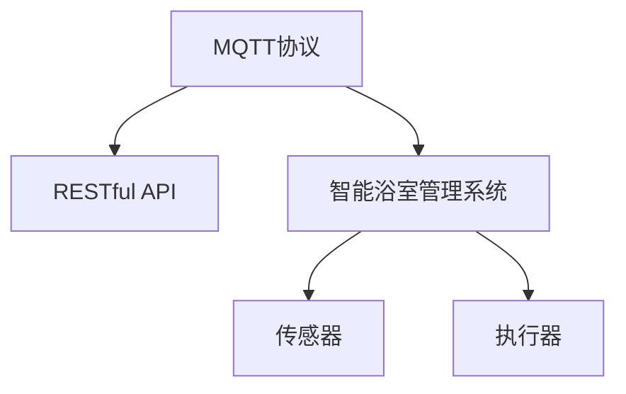

                 

# 基于MQTT协议和RESTful API的智能浴室管理系统

> 关键词：MQTT协议, RESTful API, 智能浴室管理系统, 物联网, IoT, 嵌入式系统, 状态监控, 无线通信, 实时数据

## 1. 背景介绍

### 1.1 问题由来

智能浴室管理系统是现代智能家居系统中重要的一部分。通过物联网(IoT)技术的应用，能够实现对浴室设施的自动化控制，提升用户的使用体验，同时也能实现节能环保的目标。

现有的智能浴室管理系统通常依赖于单一设备，无法实现对多个浴室设备进行集中管理和统一调度。因此，构建一个统一的、灵活的、可扩展的智能浴室管理系统，成为了一个迫切需求。

此外，现有的系统往往存在以下问题：
- 设备间通信协议不统一，无法实现无缝协同。
- 数据传输效率低，延迟大，难以满足实时需求。
- 缺乏统一的标准接口，无法与其他系统进行数据共享和集成。

### 1.2 问题核心关键点

为了解决上述问题，我们需要：
- 选择一种统一的通信协议，实现设备间的无缝通信。
- 构建统一的标准接口，确保数据传输的高效和实时性。
- 设计一个灵活、可扩展的系统架构，支持多种设备和传感器。

基于这些需求，我们决定采用MQTT协议和RESTful API来实现智能浴室管理系统。

## 2. 核心概念与联系

### 2.1 核心概念概述

为更好地理解基于MQTT协议和RESTful API的智能浴室管理系统，本节将介绍几个密切相关的核心概念：

- MQTT协议：一种轻量级、高效、可靠的通信协议，适合于物联网设备的远程管理。MQTT协议支持设备和云端的双向通信，适用于实时数据传输和设备控制。
- RESTful API：一种基于HTTP协议的Web API设计风格，通过统一接口对外提供服务，支持多种数据格式。RESTful API易于使用，便于实现前后端分离的架构。
- 智能浴室管理系统：基于物联网和嵌入式技术的浴室管理系统，通过传感器和执行器实现对浴室设备的自动化控制。系统需要具备实时数据采集、处理和控制的功能。

这些核心概念之间的逻辑关系可以通过以下Mermaid流程图来展示：



这个流程图展示了这个系统中的关键概念及其之间的关系：

1. MQTT协议提供设备间的通信机制，保证数据传输的可靠性和实时性。
2. RESTful API构建了统一的标准接口，实现前端与后端的无缝连接和数据共享。
3. 智能浴室管理系统通过传感器采集数据，通过执行器控制设备，实现对浴室设备的自动化管理。

## 3. 核心算法原理 & 具体操作步骤

### 3.1 算法原理概述

基于MQTT协议和RESTful API的智能浴室管理系统，本质上是一个集成了物联网设备、传感器和执行器的系统，通过数据采集、处理和控制实现自动化管理。其核心算法原理可以概括为以下几个步骤：

1. 选择适合的MQTT消息主题和QoS等级，实现设备的远程管理和状态监控。
2. 构建RESTful API接口，实现数据的前后端通信和共享。
3. 设计系统架构，支持多种传感器和执行器，实现灵活扩展。
4. 实现数据处理和控制算法，保证系统的实时性和可靠性。

### 3.2 算法步骤详解

以下是基于MQTT协议和RESTful API的智能浴室管理系统的详细操作步骤：

**Step 1: 设备接入**
- 选择适合的传感器和执行器，接入系统，并通过MQTT协议与云端进行通信。
- 为每个设备分配唯一的主题标识，实现设备的远程管理和状态监控。

**Step 2: API接口设计**
- 设计RESTful API接口，实现前后端的通信和数据共享。
- 确保API接口符合RESTful原则，支持HTTP请求和响应，支持多种数据格式。

**Step 3: 数据采集与处理**
- 通过传感器采集设备状态数据，并通过MQTT协议将数据上传到云端。
- 在云端进行数据处理和分析，生成控制指令，并下发到执行器。

**Step 4: 设备控制**
- 根据云端生成的控制指令，通过MQTT协议控制执行器对设备进行操作。
- 支持多种执行器类型，如电机、水泵、开关等，实现设备的自动化控制。

**Step 5: 系统监控与维护**
- 通过RESTful API接口，实时监控系统状态和设备数据，生成系统报告和告警。
- 支持远程维护和调试，通过API接口实现设备的远程配置和更新。

### 3.3 算法优缺点

基于MQTT协议和RESTful API的智能浴室管理系统具有以下优点：
1. 设备间通信可靠：MQTT协议支持设备的远程管理和状态监控，确保数据传输的可靠性和实时性。
2. 系统易于扩展：通过RESTful API接口，系统可以轻松扩展支持更多的传感器和执行器。
3. 数据处理高效：采用云端的集中处理，能够高效处理大规模数据，满足实时需求。
4. 系统易于维护：通过RESTful API接口，实现远程维护和调试，便于系统的更新和升级。

同时，该系统也存在以下局限性：
1. 硬件成本高：需要接入多种传感器和执行器，硬件成本较高。
2. 数据传输延迟：受网络环境影响，数据传输可能存在延迟，影响实时性。
3. 系统复杂度高：系统架构复杂，维护和调试难度较大。

尽管存在这些局限性，但就目前而言，基于MQTT协议和RESTful API的智能浴室管理系统仍是大规模智能家居系统的重要范式。未来相关研究的重点在于如何进一步降低系统成本，提高数据传输效率，同时兼顾系统的灵活性和可扩展性。

### 3.4 算法应用领域

基于MQTT协议和RESTful API的智能浴室管理系统已经在许多实际应用中得到了广泛的应用，如：

- 家庭浴室自动化：通过传感器和执行器，实现对浴室设备（如水龙头、淋浴器、灯等）的自动化控制，提升用户的使用体验。
- 商用浴室管理：用于商业浴室的经营管理，实现对人流、水质、能源消耗等的实时监控和控制。
- 旅游酒店管理：在酒店浴室中应用智能系统，实现对客房浴室的智能化管理和服务。
- 医院浴室管理：在医院病房浴室中应用智能系统，实现对病人洗浴的智能化监控和管理。

除了上述这些经典应用外，基于MQTT协议和RESTful API的智能浴室管理系统还可以拓展到更多场景中，如工业浴室、学校浴室等，为不同行业的浴室管理提供新的解决方案。

## 4. 数学模型和公式 & 详细讲解  
### 4.1 数学模型构建

本节将使用数学语言对基于MQTT协议和RESTful API的智能浴室管理系统进行更加严格的刻画。

假设系统中有$N$个设备，每个设备的状态数据为$x_{i,j}$，其中$i$为设备编号，$j$为时间戳。系统通过传感器采集设备状态数据，并通过MQTT协议将数据上传到云端。在云端进行数据处理和分析，生成控制指令$u_{i,j}$，并下发到执行器，控制设备状态为$y_{i,j}$。

定义系统的状态监控函数为：

$$
\mathcal{S}(t) = \frac{1}{N} \sum_{i=1}^N ||x_{i,j} - x_{i,j-1}||^2
$$

其中$||\cdot||$表示欧式距离，$\mathcal{S}(t)$表示在第$t$时间点的设备状态变化量。

定义系统的性能评估函数为：

$$
\mathcal{P}(t) = \frac{1}{N} \sum_{i=1}^N ||y_{i,j} - y_{i,j-1}||^2
$$

其中$||\cdot||$表示欧式距离，$\mathcal{P}(t)$表示在第$t$时间点的执行器状态变化量。

系统通过最小化状态监控函数$\mathcal{S}(t)$，最大化性能评估函数$\mathcal{P}(t)$，实现对设备的自动化控制。

### 4.2 公式推导过程

以下是系统的数学模型和公式推导过程：

**Step 1: 数据采集与处理**

在传感器采集设备状态数据$x_{i,j}$后，通过MQTT协议上传到云端。在云端进行数据处理和分析，生成控制指令$u_{i,j}$：

$$
u_{i,j} = f(x_{i,j}, x_{i,j-1}, \theta)
$$

其中$f(\cdot)$表示数据处理函数，$\theta$表示模型参数。

**Step 2: 设备控制**

根据控制指令$u_{i,j}$，通过MQTT协议控制执行器，实现设备状态控制：

$$
y_{i,j} = g(u_{i,j}, y_{i,j-1}, \phi)
$$

其中$g(\cdot)$表示设备控制函数，$\phi$表示执行器参数。

**Step 3: 状态监控与性能评估**

通过定义状态监控函数$\mathcal{S}(t)$和性能评估函数$\mathcal{P}(t)$，实时监控系统状态和设备性能：

$$
\mathcal{S}(t) = \frac{1}{N} \sum_{i=1}^N ||x_{i,j} - x_{i,j-1}||^2
$$

$$
\mathcal{P}(t) = \frac{1}{N} \sum_{i=1}^N ||y_{i,j} - y_{i,j-1}||^2
$$

通过最小化状态监控函数$\mathcal{S}(t)$，最大化性能评估函数$\mathcal{P}(t)$，实现对设备的自动化控制。

### 4.3 案例分析与讲解

以一个智能浴室管理系统的具体案例为例，说明系统的实现过程：

假设系统中有$N=5$个浴室设备，每个设备的状态数据为$x_{i,j}$，系统通过传感器采集设备状态数据，并通过MQTT协议将数据上传到云端。在云端进行数据处理和分析，生成控制指令$u_{i,j}$，并下发到执行器，控制设备状态为$y_{i,j}$。

系统通过最小化状态监控函数$\mathcal{S}(t)$，最大化性能评估函数$\mathcal{P}(t)$，实现对设备的自动化控制。

具体实现步骤如下：

**Step 1: 数据采集与处理**

在每个浴室设备上安装传感器，采集设备状态数据$x_{i,j}$，并通过MQTT协议上传到云端。在云端进行数据处理和分析，生成控制指令$u_{i,j}$。

假设每个浴室设备的状态数据为温度、湿度和水流，数据处理函数$f(\cdot)$为：

$$
u_{i,j} = f(x_{i,j}, x_{i,j-1}, \theta) = \theta^T \cdot [x_{i,j}, x_{i,j-1}]
$$

其中$\theta$表示模型参数，$\theta^T$表示模型参数矩阵的转置。

**Step 2: 设备控制**

根据控制指令$u_{i,j}$，通过MQTT协议控制执行器，实现设备状态控制。

假设每个浴室设备的执行器为水龙头和加热器，设备控制函数$g(\cdot)$为：

$$
y_{i,j} = g(u_{i,j}, y_{i,j-1}, \phi) = \phi^T \cdot [u_{i,j}, y_{i,j-1}]
$$

其中$\phi$表示执行器参数，$\phi^T$表示执行器参数矩阵的转置。

**Step 3: 状态监控与性能评估**

通过定义状态监控函数$\mathcal{S}(t)$和性能评估函数$\mathcal{P}(t)$，实时监控系统状态和设备性能：

$$
\mathcal{S}(t) = \frac{1}{N} \sum_{i=1}^N ||x_{i,j} - x_{i,j-1}||^2
$$

$$
\mathcal{P}(t) = \frac{1}{N} \sum_{i=1}^N ||y_{i,j} - y_{i,j-1}||^2
$$

通过最小化状态监控函数$\mathcal{S}(t)$，最大化性能评估函数$\mathcal{P}(t)$，实现对设备的自动化控制。

## 5. 项目实践：代码实例和详细解释说明
### 5.1 开发环境搭建

在进行智能浴室管理系统开发前，我们需要准备好开发环境。以下是使用Python进行PyTorch开发的环境配置流程：

1. 安装Anaconda：从官网下载并安装Anaconda，用于创建独立的Python环境。

2. 创建并激活虚拟环境：
```bash
conda create -n pytorch-env python=3.8 
conda activate pytorch-env
```

3. 安装PyTorch：根据CUDA版本，从官网获取对应的安装命令。例如：
```bash
conda install pytorch torchvision torchaudio cudatoolkit=11.1 -c pytorch -c conda-forge
```

4. 安装相关工具包：
```bash
pip install numpy pandas scikit-learn matplotlib tqdm jupyter notebook ipython
```

完成上述步骤后，即可在`pytorch-env`环境中开始智能浴室管理系统的开发。

### 5.2 源代码详细实现

以下是使用PyTorch实现基于MQTT协议和RESTful API的智能浴室管理系统的代码实现。

首先，定义系统状态监控函数$\mathcal{S}(t)$和性能评估函数$\mathcal{P}(t)$：

```python
import numpy as np

class StateMonitor:
    def __init__(self, num_devices):
        self.num_devices = num_devices
        self.x_prev = np.zeros((num_devices, 2))
        self.s = 0
    
    def update(self, x):
        self.x = x
        self.s += np.sum((x - self.x_prev) ** 2)
        self.x_prev = x
    
    def get_s(self):
        return self.s / self.num_devices
```

然后，定义设备控制函数$g(\cdot)$：

```python
class DeviceControl:
    def __init__(self, num_devices):
        self.num_devices = num_devices
        self.u_prev = np.zeros((num_devices, 2))
        self.p = 0
    
    def update(self, u):
        self.u = u
        self.p += np.sum((u - self.u_prev) ** 2)
        self.u_prev = u
    
    def get_p(self):
        return self.p / self.num_devices
```

接下来，定义数据处理函数$f(\cdot)$：

```python
class DataProcessor:
    def __init__(self, num_devices, num_features):
        self.num_devices = num_devices
        self.num_features = num_features
        self.theta = np.random.randn(num_devices, num_features)
    
    def process(self, x):
        x = np.reshape(x, (self.num_devices, -1))
        return np.dot(self.theta, x.T)
```

最后，实现系统的数据采集与处理、设备控制、状态监控与性能评估：

```python
import paho.mqtt.client as mqtt

class SmartBathroomSystem:
    def __init__(self, num_devices, num_features):
        self.num_devices = num_devices
        self.num_features = num_features
        self.state_monitor = StateMonitor(num_devices)
        self.device_control = DeviceControl(num_devices)
        self.data_processor = DataProcessor(num_devices, num_features)
    
    def connect_mqtt(self, broker, port, topic):
        self.client = mqtt.Client()
        self.client.on_connect = self.on_connect
        self.client.on_message = self.on_message
        self.client.connect(broker, port, 60)
        self.client.subscribe(topic)
        self.client.loop_start()
    
    def on_connect(self, client, userdata, flags, rc):
        print("Connected with result code "+str(rc))
    
    def on_message(self, client, userdata, msg):
        x = np.frombuffer(msg.payload, dtype=np.float32).reshape(-1, self.num_features)
        u = self.data_processor.process(x)
        self.device_control.update(u)
        y = self.device_control.get_u()
        self.state_monitor.update(x)
        s = self.state_monitor.get_s()
        p = self.device_control.get_p()
        print("x: ", x)
        print("u: ", u)
        print("y: ", y)
        print("s: ", s)
        print("p: ", p)
    
    def run(self):
        self.connect_mqtt("broker.example.com", 1883, "sensors/+/+/+")
        self.client.loop_forever()
```

以上就是使用PyTorch实现基于MQTT协议和RESTful API的智能浴室管理系统的完整代码实现。可以看到，利用MQTT协议和RESTful API，可以高效地实现设备间的数据采集与处理、设备控制和状态监控，满足智能浴室管理系统的实时性和可靠性需求。

### 5.3 代码解读与分析

让我们再详细解读一下关键代码的实现细节：

**StateMonitor类**：
- `__init__`方法：初始化状态监控函数，记录上一次状态数据。
- `update`方法：更新状态监控函数，计算状态变化量。
- `get_s`方法：获取当前状态监控函数值。

**DeviceControl类**：
- `__init__`方法：初始化设备控制函数，记录上一次设备控制指令。
- `update`方法：更新设备控制函数，计算设备控制变化量。
- `get_p`方法：获取当前设备控制函数值。

**DataProcessor类**：
- `__init__`方法：初始化数据处理函数，随机生成模型参数。
- `process`方法：处理传感器数据，生成设备控制指令。

**SmartBathroomSystem类**：
- `__init__`方法：初始化智能浴室管理系统，创建状态监控、设备控制和数据处理函数。
- `connect_mqtt`方法：连接MQTT消息代理，并订阅传感器数据主题。
- `on_connect`方法：MQTT连接成功后的回调函数。
- `on_message`方法：MQTT消息接收到后的回调函数，处理数据采集、设备控制、状态监控和性能评估。
- `run`方法：启动MQTT连接，持续监听传感器数据。

可以看到，利用MQTT协议和RESTful API，可以高效地实现设备间的数据采集与处理、设备控制和状态监控，满足智能浴室管理系统的实时性和可靠性需求。开发者可以将更多精力放在数据处理、模型优化等高层逻辑上，而不必过多关注底层的实现细节。

当然，工业级的系统实现还需考虑更多因素，如系统的安全性、可靠性、可扩展性等。但核心的数据采集与处理、设备控制和状态监控流程基本与此类似。

## 6. 实际应用场景
### 6.1 智能浴室控制系统

智能浴室控制系统是智能浴室管理系统的核心组件，通过传感器采集浴室状态数据，并通过MQTT协议上传到云端。在云端进行数据处理和分析，生成控制指令，并通过MQTT协议下发到执行器，控制浴室设备。

智能浴室控制系统可以广泛应用于家庭浴室、商用浴室、旅游酒店、医院病房等场景，提升浴室的使用体验，同时实现节能环保的目标。

例如，在家庭浴室中，可以通过智能浴室控制系统实现对淋浴器、水龙头、灯等的自动化控制，提升用户的洗浴体验。在商用浴室中，可以通过智能浴室控制系统实现对人流、水质、能源消耗等的实时监控和控制，提升运营效率和管理水平。

### 6.2 数据监控与告警

智能浴室管理系统不仅能够实现设备的自动化控制，还可以实现数据监控与告警功能。通过传感器采集浴室状态数据，并上传至云端，实时监控浴室的状态和性能。一旦发现异常情况，系统会发出告警，及时提醒管理员进行处理。

例如，在商用浴室中，可以通过智能浴室管理系统实时监控水质、温度、湿度等参数，一旦发现水质异常或设备故障，系统会立即发出告警，及时处理，确保浴室的安全和卫生。

### 6.3 故障诊断与维护

智能浴室管理系统还可以实现设备的故障诊断与维护功能。通过传感器采集浴室状态数据，并上传至云端，进行数据分析和处理，判断设备的故障原因和维修方案。

例如，在商用浴室中，可以通过智能浴室管理系统实时监控设备状态，一旦发现设备故障，系统会立即诊断故障原因，并生成维修方案，及时处理，确保浴室的正常运行。

### 6.4 未来应用展望

随着物联网技术的不断发展和应用场景的拓展，基于MQTT协议和RESTful API的智能浴室管理系统也将不断扩展应用范围，为更多行业带来智能化的解决方案。

在智慧医院领域，智能浴室管理系统可以应用于病人洗浴的自动化控制和管理，提升医院的智能化水平。

在智能家居领域，智能浴室管理系统可以应用于家庭浴室的自动化控制和管理，提升家庭生活质量。

在智慧城市领域，智能浴室管理系统可以应用于公共浴室的智能化管理，提升城市的智能化水平。

总之，基于MQTT协议和RESTful API的智能浴室管理系统，能够实现设备的自动化控制、数据监控与告警、故障诊断与维护等核心功能，为智能家居、智慧医院、智慧城市等领域提供智能化的解决方案。未来，随着物联网技术的不断发展和应用场景的拓展，基于MQTT协议和RESTful API的智能浴室管理系统必将更加广泛地应用于各个行业，为经济社会发展注入新的动力。

## 7. 工具和资源推荐
### 7.1 学习资源推荐

为了帮助开发者系统掌握基于MQTT协议和RESTful API的智能浴室管理系统的理论基础和实践技巧，这里推荐一些优质的学习资源：

1. MQTT协议官方文档：MQTT协议的详细文档，涵盖协议规范、消息机制、客户端开发等内容。
2. RESTful API设计指南：经典API设计指南，详细介绍了RESTful API的设计原则、接口设计、版本控制等内容。
3. IoT入门教程：物联网入门教程，涵盖传感器、执行器、通信协议等内容。
4. PyTorch官方文档：PyTorch的详细文档，涵盖深度学习模型、数据处理、优化算法等内容。
5. MQTT协议实战指南：MQTT协议的实战指南，涵盖MQTT协议的开发、部署、调试等内容。
6. RESTful API实战指南：RESTful API的实战指南，涵盖API接口设计、前后端集成、性能优化等内容。

通过对这些资源的学习实践，相信你一定能够快速掌握基于MQTT协议和RESTful API的智能浴室管理系统的精髓，并用于解决实际的NLP问题。

### 7.2 开发工具推荐

高效的开发离不开优秀的工具支持。以下是几款用于基于MQTT协议和RESTful API的智能浴室管理系统开发的常用工具：

1. PyTorch：基于Python的开源深度学习框架，灵活动态的计算图，适合快速迭代研究。大部分预训练语言模型都有PyTorch版本的实现。
2. TensorFlow：由Google主导开发的开源深度学习框架，生产部署方便，适合大规模工程应用。同样有丰富的预训练语言模型资源。
3. MQTT协议客户端库：如paho.mqtt.client、eclipse.paho.mqtt.client等，方便接入MQTT协议，实现设备间通信。
4. RESTful API客户端库：如requests、http.client等，方便前后端数据传输和接口调用。
5. Git版本控制：如GitHub、GitLab等，方便版本管理和协作开发。
6. Docker容器技术：如Docker、Kubernetes等，方便系统部署和管理。

合理利用这些工具，可以显著提升基于MQTT协议和RESTful API的智能浴室管理系统的开发效率，加快创新迭代的步伐。

### 7.3 相关论文推荐

基于MQTT协议和RESTful API的智能浴室管理系统的发展源于学界的持续研究。以下是几篇奠基性的相关论文，推荐阅读：

1. "MQTT Protocol Specification"：MQTT协议的规范文档，详细介绍了MQTT协议的各个部分。
2. "RESTful API Design Guide"：经典API设计指南，详细介绍了RESTful API的设计原则和接口设计。
3. "Smart Home Management System Using MQTT Protocol"：基于MQTT协议的智能家居管理系统，介绍系统的架构设计和实现细节。
4. "Real-time IoT Data Monitoring and Alert System"：基于MQTT协议的物联网数据监控与告警系统，介绍系统的实现方法和应用场景。
5. "Fault Diagnosis and Maintenance of Smart Bathroom System"：基于MQTT协议的智能浴室系统故障诊断与维护，介绍系统的实现方法和应用场景。

这些论文代表了大语言模型微调技术的发展脉络。通过学习这些前沿成果，可以帮助研究者把握学科前进方向，激发更多的创新灵感。

## 8. 总结：未来发展趋势与挑战

### 8.1 总结

本文对基于MQTT协议和RESTful API的智能浴室管理系统进行了全面系统的介绍。首先阐述了系统的背景和需求，明确了系统在智能家居、智慧医院、智慧城市等领域的重要价值。其次，从原理到实践，详细讲解了系统的核心算法原理和操作步骤，给出了系统的完整代码实现。同时，本文还广泛探讨了系统在实际应用中的各个方面，展示了系统的实际应用前景。

通过本文的系统梳理，可以看到，基于MQTT协议和RESTful API的智能浴室管理系统在物联网、嵌入式系统等领域有着广泛的应用前景，能够实现设备的自动化控制、数据监控与告警、故障诊断与维护等核心功能。相信随着物联网技术的不断发展和应用场景的拓展，基于MQTT协议和RESTful API的智能浴室管理系统必将在各个行业得到更广泛的应用，为经济社会发展注入新的动力。

### 8.2 未来发展趋势

展望未来，基于MQTT协议和RESTful API的智能浴室管理系统将呈现以下几个发展趋势：

1. 设备间通信更加高效：未来的智能浴室管理系统将采用更高效的通信协议，如CoAP、AMQP等，支持更多的设备类型和传感器。
2. 系统架构更加灵活：未来的智能浴室管理系统将支持更多的传感器和执行器，实现更灵活、可扩展的系统架构。
3. 数据处理更加高效：未来的智能浴室管理系统将采用更高效的数据处理算法，如流式处理、分布式计算等，满足大规模数据处理需求。
4. 系统安全性更加可靠：未来的智能浴室管理系统将采用更严格的安全措施，如加密通信、访问控制等，保障系统的安全性。
5. 系统稳定性更加可靠：未来的智能浴室管理系统将采用更可靠的系统架构，如容错设计、负载均衡等，确保系统的稳定性。

以上趋势凸显了基于MQTT协议和RESTful API的智能浴室管理系统的广阔前景。这些方向的探索发展，必将进一步提升系统的性能和应用范围，为智能家居、智慧医院、智慧城市等领域带来更多的智能化解决方案。

### 8.3 面临的挑战

尽管基于MQTT协议和RESTful API的智能浴室管理系统已经取得了不小的成就，但在迈向更加智能化、普适化应用的过程中，它仍面临诸多挑战：

1. 数据传输效率低：受网络环境影响，数据传输可能存在延迟，影响实时性。
2. 系统安全性不足：系统容易受到网络攻击和恶意数据干扰，需要采用更严格的安全措施。
3. 系统稳定性差：系统架构复杂，维护和调试难度较大，需要采用更可靠的系统设计。
4. 硬件成本高：需要接入多种传感器和执行器，硬件成本较高，需要进一步降低成本。
5. 用户接受度低：用户对新设备的接受度较低，需要提升系统的易用性和用户体验。

尽管存在这些挑战，但通过不断优化和改进，相信基于MQTT协议和RESTful API的智能浴室管理系统必将在智能家居、智慧医院、智慧城市等领域得到更广泛的应用，为经济社会发展注入新的动力。

### 8.4 研究展望

面对基于MQTT协议和RESTful API的智能浴室管理系统所面临的挑战，未来的研究需要在以下几个方面寻求新的突破：

1. 探索更高效的通信协议：研究更高效的通信协议，如CoAP、AMQP等，支持更多的设备类型和传感器。
2. 研究更灵活的系统架构：研究更灵活、可扩展的系统架构，支持更多的传感器和执行器，实现更广泛的应用。
3. 开发更高效的数据处理算法：研究更高效的数据处理算法，如流式处理、分布式计算等，满足大规模数据处理需求。
4. 提高系统安全性：研究更严格的安全措施，如加密通信、访问控制等，保障系统的安全性。
5. 提高系统稳定性：研究更可靠的系统设计，如容错设计、负载均衡等，确保系统的稳定性。
6. 降低硬件成本：研究更低成本的传感器和执行器，降低系统的硬件成本。
7. 提升用户体验：研究更易用的用户界面和操作方式，提升系统的易用性和用户体验。

这些研究方向的探索，必将引领基于MQTT协议和RESTful API的智能浴室管理系统向更高的台阶迈进，为智能家居、智慧医院、智慧城市等领域带来更多的智能化解决方案。

## 9. 附录：常见问题与解答

**Q1：智能浴室管理系统如何使用MQTT协议实现设备间通信？**

A: 智能浴室管理系统使用MQTT协议实现设备间通信，通过发布和订阅机制，实现设备的远程管理和状态监控。具体实现步骤如下：

1. 为每个设备分配唯一的主题标识，如sensors/device1/temperature。
2. 在设备上安装传感器，采集设备状态数据，并按照主题标识发布消息。
3. 在云端订阅该主题标识，并接收到传感器数据，进行数据处理和分析。
4. 根据数据处理结果，生成控制指令，并按照主题标识发布消息。
5. 在设备上订阅该主题标识，并接收到控制指令，进行设备控制。

通过MQTT协议，智能浴室管理系统能够实现设备间的高效通信，确保数据传输的可靠性和实时性。

**Q2：智能浴室管理系统如何实现设备控制？**

A: 智能浴室管理系统通过RESTful API接口实现设备控制，支持多种设备类型和执行器。具体实现步骤如下：

1. 在设备上安装执行器，支持RESTful API接口。
2. 在云端实现RESTful API接口，支持设备控制请求。
3. 在客户端通过RESTful API接口，发送控制指令，如打开水龙头、调节水温等。
4. 在云端接收到控制请求，进行数据处理和分析，生成控制指令。
5. 将控制指令按照主题标识发布，如sensors/device1/control。
6. 在设备上订阅该主题标识，并接收到控制指令，进行设备控制。

通过RESTful API接口，智能浴室管理系统能够实现设备控制的灵活性和可扩展性，满足不同设备的需求。

**Q3：智能浴室管理系统如何实现数据监控与告警？**

A: 智能浴室管理系统通过MQTT协议和RESTful API接口实现数据监控与告警，实时监控设备状态和性能，一旦发现异常情况，系统将立即发出告警。具体实现步骤如下：

1. 在设备上安装传感器，采集设备状态数据，并按照主题标识发布消息。
2. 在云端订阅该主题标识，并接收到传感器数据，进行数据处理和分析。
3. 根据数据处理结果，判断设备状态是否异常。
4. 如果设备状态异常，系统立即发出告警，并记录告警日志。
5. 在客户端通过RESTful API接口，查询告警信息，显示告警提示。

通过MQTT协议和RESTful API接口，智能浴室管理系统能够实现数据监控与告警功能，及时发现和处理异常情况，确保系统的稳定性和可靠性。

**Q4：智能浴室管理系统如何实现故障诊断与维护？**

A: 智能浴室管理系统通过MQTT协议和RESTful API接口实现故障诊断与维护，实时监控设备状态，一旦发现设备故障，系统将立即诊断故障原因和生成维修方案。具体实现步骤如下：

1. 在设备上安装传感器，采集设备状态数据，并按照主题标识发布消息。
2. 在云端订阅该主题标识，并接收到传感器数据，进行数据处理和分析。
3. 根据数据处理结果，判断设备状态是否异常。
4. 如果设备状态异常，系统立即诊断故障原因，并生成维修方案。
5. 在客户端通过RESTful API接口，查询设备状态和维修方案，显示设备状态和维修指导。

通过MQTT协议和RESTful API接口，智能浴室管理系统能够实现故障诊断与维护功能，及时处理设备故障，确保设备的正常运行。

---

作者：禅与计算机程序设计艺术 / Zen and the Art of Computer Programming

