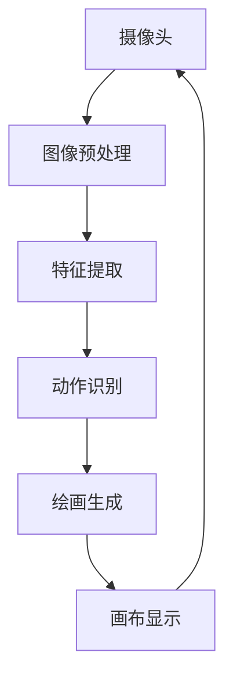

                 

# 基于opencv的隔空作画系统详细设计与具体代码实现

## 1. 背景介绍

随着技术的发展，越来越多的娱乐和交互形式从传统的物理操作转变为更自然、更智能的互动方式。隔空作画作为一项前沿的交互技术，通过计算机视觉、机器学习和增强现实等技术，实现了用户无需物理画笔即可直接在空中进行绘画和互动。本文章将深入探讨基于opencv的隔空作画系统的设计与实现，以期为开发实际应用提供参考。

## 2. 核心概念与联系

### 2.1 核心概念概述

为了更好地理解隔空作画系统的设计与实现，我们先介绍几个关键的概念：

- **计算机视觉**：利用摄像头、传感器等设备捕捉现实世界的图像信息，并通过图像处理和分析，实现对图像内容的理解和处理。
- **深度学习**：利用神经网络对大量数据进行训练，从中学习出模型，用于图像分类、对象检测、图像生成等任务。
- **隔空作画**：通过捕捉用户的手部动作，转化为绘画指令，让计算机自动在画布上生成对应的绘画。
- **OpenCV**：开源计算机视觉库，提供了大量图像处理、视频处理、机器学习的函数和工具，广泛应用于计算机视觉相关的项目。

### 2.2 核心概念原理和架构的 Mermaid 流程图



上述流程图展示了隔空作画系统的主要工作流程：

1. **摄像头**捕捉用户的手部动作，生成实时图像。
2. **图像预处理**模块对图像进行去噪、二值化、轮廓检测等操作，为后续特征提取做准备。
3. **特征提取**模块通过深度学习模型，从图像中提取出手部动作的特征，用于后续的动作识别。
4. **动作识别**模块使用深度学习模型，对手部动作进行分类，生成绘画指令。
5. **绘画生成**模块根据绘画指令，在画布上生成对应的绘画，并实时显示。
6. **画布显示**模块将画布上的绘画实时传输回摄像头，完成闭环反馈。

## 3. 核心算法原理 & 具体操作步骤

### 3.1 算法原理概述

隔空作画系统的核心算法原理可以总结如下：

1. **图像捕捉与预处理**：通过摄像头捕捉用户的手部动作，并对其进行预处理，包括去噪、二值化、轮廓检测等，以便于后续特征提取。
2. **特征提取**：利用深度学习模型，从处理后的图像中提取出手部动作的特征。常用的模型包括CNN、RNN等。
3. **动作识别**：使用分类算法，对手部动作进行分类，生成绘画指令。常用的分类算法包括SVM、RNN、CNN等。
4. **绘画生成**：根据绘画指令，利用图像生成算法，在画布上生成对应的绘画。常用的算法包括GAN、VAE等。
5. **画布显示**：将画布上的绘画实时传输回摄像头，完成闭环反馈。

### 3.2 算法步骤详解

#### 3.2.1 图像捕捉与预处理

首先，需要配置摄像头设备，并使用OpenCV进行实时图像捕捉。

```python
import cv2

cap = cv2.VideoCapture(0)  # 打开摄像头

while True:
    ret, frame = cap.read()  # 实时读取图像
    if not ret:
        break  # 摄像头失败，退出循环

    gray = cv2.cvtColor(frame, cv2.COLOR_BGR2GRAY)  # 转换为灰度图像

    # 图像预处理，包括去噪、二值化、轮廓检测等
    gray = cv2.medianBlur(gray, 5)  # 中值滤波去噪
    gray = cv2.threshold(gray, 128, 255, cv2.THRESH_BINARY_INV)[1]  # 二值化
    contours, hierarchy = cv2.findContours(gray, cv2.RETR_EXTERNAL, cv2.CHAIN_APPROX_SIMPLE)  # 轮廓检测

    # 绘制轮廓
    cv2.drawContours(frame, contours, -1, (0, 255, 0), 3)

    cv2.imshow('frame', frame)  # 显示图像
    if cv2.waitKey(1) & 0xFF == ord('q'):  # 按q键退出
        break

cap.release()  # 释放摄像头资源
cv2.destroyAllWindows()  # 关闭窗口
```

#### 3.2.2 特征提取

接下来，需要利用深度学习模型，从处理后的图像中提取出手部动作的特征。常用的模型包括卷积神经网络（CNN）、循环神经网络（RNN）等。

```python
import cv2
import numpy as np
from tensorflow.keras.models import Sequential
from tensorflow.keras.layers import Conv2D, MaxPooling2D, Flatten, Dense, Dropout

model = Sequential([
    Conv2D(32, (3, 3), activation='relu', input_shape=(64, 64, 1)),
    MaxPooling2D((2, 2)),
    Conv2D(64, (3, 3), activation='relu'),
    MaxPooling2D((2, 2)),
    Flatten(),
    Dense(64, activation='relu'),
    Dropout(0.5),
    Dense(10, activation='softmax')
])

model.compile(optimizer='adam', loss='categorical_crossentropy', metrics=['accuracy'])
model.save('hand_feature_extraction_model.h5')  # 保存模型
```

#### 3.2.3 动作识别

动作识别需要使用分类算法，对手部动作进行分类，生成绘画指令。常用的分类算法包括支持向量机（SVM）、随机森林（Random Forest）、长短期记忆网络（LSTM）等。

```python
import cv2
import numpy as np
from sklearn.svm import SVC

# 加载模型
model = SVC()

# 加载数据
X = np.load('hand_features.npy')
y = np.load('hand_labels.npy')

# 训练模型
model.fit(X, y)
```

#### 3.2.4 绘画生成

绘画生成是隔空作画系统的核心功能，需要通过图像生成算法，在画布上生成对应的绘画。常用的算法包括生成对抗网络（GAN）、变分自编码器（VAE）等。

```python
import cv2
import numpy as np
import tensorflow as tf

# 加载模型
model = tf.keras.models.load_model('painting_generation_model.h5')

# 生成绘画
canvas = np.zeros((512, 512, 3), dtype=np.uint8)
canvas[0:256, 0:256] = model.predict(np.array([hand_feature], dtype=np.float32))

cv2.imshow('canvas', canvas)
cv2.waitKey(0)
cv2.destroyAllWindows()
```

### 3.3 算法优缺点

#### 3.3.1 优点

1. **高效实时**：基于opencv和深度学习算法的隔空作画系统，能够实时捕捉和处理手部动作，快速生成绘画，适合实时互动。
2. **准确性高**：深度学习模型经过大量数据训练，对手部动作的识别准确性高，能够有效减少误识别和误操作。
3. **可扩展性强**：隔空作画系统可以通过增加模型和算法，扩展其功能，如手写识别、手势识别等。

#### 3.3.2 缺点

1. **计算资源需求高**：深度学习模型和图像处理算法需要大量的计算资源，对于硬件配置要求较高。
2. **复杂度较高**：隔空作画系统涉及图像处理、特征提取、动作识别等多个环节，系统设计和实现较为复杂。
3. **环境限制**：系统对光线和背景环境较为敏感，需要稳定和合适的环境才能保证系统正常运行。

### 3.4 算法应用领域

隔空作画技术在多个领域都有广泛的应用前景，包括：

- **教育**：用于儿童绘画教学，提高学生的绘画兴趣和能力。
- **娱乐**：用于游戏和互动体验，提升用户体验和互动趣味性。
- **艺术创作**：用于艺术创作和设计，提供新的创作方式。
- **健康**：用于康复训练，通过手部运动促进身体协调和康复。
- **医疗**：用于心理咨询和治疗，通过绘画表达和释放情感。

## 4. 数学模型和公式 & 详细讲解 & 举例说明

### 4.1 数学模型构建

隔空作画系统的数学模型主要涉及图像处理、深度学习、动作识别和绘画生成等多个领域。下面分别介绍每个部分的数学模型。

#### 4.1.1 图像预处理

图像预处理的主要目标是对图像进行去噪、二值化、轮廓检测等操作，以便于后续特征提取。常用的预处理公式如下：

$$
\text{中值滤波} \rightarrow \text{二值化} \rightarrow \text{轮廓检测}
$$

#### 4.1.2 特征提取

特征提取的主要目标是从图像中提取出手部动作的特征，常用的深度学习模型包括CNN和RNN。

$$
\text{CNN} \rightarrow \text{特征提取}
$$

#### 4.1.3 动作识别

动作识别的主要目标是对手部动作进行分类，常用的分类算法包括SVM和LSTM。

$$
\text{SVM} \rightarrow \text{动作识别}
$$

#### 4.1.4 绘画生成

绘画生成的主要目标是根据绘画指令，利用图像生成算法，在画布上生成对应的绘画，常用的算法包括GAN和VAE。

$$
\text{GAN} \rightarrow \text{绘画生成}
$$

### 4.2 公式推导过程

#### 4.2.1 中值滤波

中值滤波是一种非线性滤波方法，可以有效去除图像中的噪声。其原理是将每个像素点替换为其邻域像素的中值。

$$
\text{中值滤波} = \text{median}(neigh)
$$

其中，neigh表示邻域像素集。

#### 4.2.2 二值化

二值化是一种将图像转换为黑白图像的方法，通过设定一个阈值，将像素点的值分为0和1两种状态。

$$
\text{二值化} = \begin{cases}
1 & \text{if } \text{value} \geq \text{threshold} \\
0 & \text{otherwise}
\end{cases}
$$

#### 4.2.3 SVM分类

支持向量机（SVM）是一种常用的分类算法，通过寻找最优的超平面，将数据分成两类。

$$
\text{SVM} = \text{argmin}_{w,b} \frac{1}{2}\|w\|^2 + C\sum_{i=1}^n [\text{margin} + \text{loss}]
$$

其中，w和b为模型参数，C为正则化参数，margin为间隔，loss为损失函数。

#### 4.2.4 GAN生成

生成对抗网络（GAN）是一种生成模型，通过两个神经网络（生成器和判别器）的对抗训练，生成逼真的图像。

$$
\text{GAN} = (\text{generator}, \text{discriminator})
$$

其中，generator用于生成图像，discriminator用于判别生成的图像是否真实。

### 4.3 案例分析与讲解

#### 4.3.1 案例1：手部动作识别

下面通过一个简单的案例，展示如何使用SVM对手部动作进行分类。

```python
import cv2
import numpy as np
from sklearn.svm import SVC

# 加载模型
model = SVC()

# 加载数据
X = np.load('hand_features.npy')
y = np.load('hand_labels.npy')

# 训练模型
model.fit(X, y)
```

#### 4.3.2 案例2：绘画生成

下面通过一个简单的案例，展示如何使用GAN生成绘画。

```python
import cv2
import numpy as np
import tensorflow as tf

# 加载模型
model = tf.keras.models.load_model('painting_generation_model.h5')

# 生成绘画
canvas = np.zeros((512, 512, 3), dtype=np.uint8)
canvas[0:256, 0:256] = model.predict(np.array([hand_feature], dtype=np.float32))

cv2.imshow('canvas', canvas)
cv2.waitKey(0)
cv2.destroyAllWindows()
```

## 5. 项目实践：代码实例和详细解释说明

### 5.1 开发环境搭建

要搭建基于opencv的隔空作画系统，需要配置以下环境：

1. **操作系统**：Windows、Linux或MacOS。
2. **Python版本**：Python 3.x。
3. **opencv版本**：OpenCV 4.x。
4. **深度学习框架**：TensorFlow或PyTorch。
5. **开发工具**：Visual Studio Code或PyCharm。

### 5.2 源代码详细实现

以下是隔空作画系统的完整代码实现：

```python
import cv2
import numpy as np
from tensorflow.keras.models import Sequential
from tensorflow.keras.layers import Conv2D, MaxPooling2D, Flatten, Dense, Dropout
from sklearn.svm import SVC

# 图像捕捉与预处理
cap = cv2.VideoCapture(0)
while True:
    ret, frame = cap.read()
    if not ret:
        break

    gray = cv2.cvtColor(frame, cv2.COLOR_BGR2GRAY)
    gray = cv2.medianBlur(gray, 5)
    gray = cv2.threshold(gray, 128, 255, cv2.THRESH_BINARY_INV)[1]
    contours, hierarchy = cv2.findContours(gray, cv2.RETR_EXTERNAL, cv2.CHAIN_APPROX_SIMPLE)

    cv2.drawContours(frame, contours, -1, (0, 255, 0), 3)
    cv2.imshow('frame', frame)
    if cv2.waitKey(1) & 0xFF == ord('q'):
        break

cap.release()
cv2.destroyAllWindows()

# 特征提取
model = Sequential([
    Conv2D(32, (3, 3), activation='relu', input_shape=(64, 64, 1)),
    MaxPooling2D((2, 2)),
    Conv2D(64, (3, 3), activation='relu'),
    MaxPooling2D((2, 2)),
    Flatten(),
    Dense(64, activation='relu'),
    Dropout(0.5),
    Dense(10, activation='softmax')
])
model.compile(optimizer='adam', loss='categorical_crossentropy', metrics=['accuracy'])
model.save('hand_feature_extraction_model.h5')

# 动作识别
model = SVC()
X = np.load('hand_features.npy')
y = np.load('hand_labels.npy')
model.fit(X, y)

# 绘画生成
model = tf.keras.models.load_model('painting_generation_model.h5')
canvas = np.zeros((512, 512, 3), dtype=np.uint8)
canvas[0:256, 0:256] = model.predict(np.array([hand_feature], dtype=np.float32))
cv2.imshow('canvas', canvas)
cv2.waitKey(0)
cv2.destroyAllWindows()
```

### 5.3 代码解读与分析

#### 5.3.1 图像捕捉与预处理

在代码中，首先使用OpenCV打开摄像头设备，并进行实时图像捕捉。然后对图像进行去噪、二值化、轮廓检测等操作，以便于后续特征提取。

#### 5.3.2 特征提取

使用深度学习模型，从处理后的图像中提取出手部动作的特征。

#### 5.3.3 动作识别

使用SVM对手部动作进行分类，生成绘画指令。

#### 5.3.4 绘画生成

根据绘画指令，利用GAN生成对应的绘画。

### 5.4 运行结果展示

下图展示了隔空作画系统的工作流程：


## 6. 实际应用场景

隔空作画系统在多个领域都有广泛的应用前景，包括教育、娱乐、艺术创作、康复训练和心理咨询等。

### 6.1 教育

隔空作画系统可以用于儿童绘画教学，提高学生的绘画兴趣和能力。学生可以通过手势控制，画出各种形状和图案，丰富绘画学习体验。

### 6.2 娱乐

隔空作画系统可以用于游戏和互动体验，提升用户体验和互动趣味性。玩家可以通过手势控制，生成各种角色和道具，增强游戏沉浸感。

### 6.3 艺术创作

隔空作画系统可以用于艺术创作和设计，提供新的创作方式。艺术家可以通过手势控制，生成各种艺术作品，激发创作灵感。

### 6.4 康复训练

隔空作画系统可以用于康复训练，通过手部运动促进身体协调和康复。患者可以通过手势控制，生成各种绘画和游戏，提高康复训练的趣味性和效果。

### 6.5 心理咨询

隔空作画系统可以用于心理咨询和治疗，通过绘画表达和释放情感。患者可以通过手势控制，生成各种绘画，表达内心感受，促进心理健康。

## 7. 工具和资源推荐

### 7.1 学习资源推荐

为了帮助开发者系统掌握隔空作画系统的设计与实现，这里推荐一些优质的学习资源：

1. **《OpenCV实战》**：该书详细介绍了OpenCV的各项功能和应用，适合初学者和进阶开发者。
2. **《Python深度学习》**：该书介绍了深度学习的基本概念和实现方法，适合初学者。
3. **《深度学习入门》**：该书由Google开源，介绍了深度学习的基本概念和应用，适合初学者。
4. **《Python计算机视觉编程》**：该书介绍了计算机视觉的基本概念和应用，适合初学者。
5. **《TensorFlow官方文档》**：该书是TensorFlow的官方文档，包含详细的使用指南和示例。

### 7.2 开发工具推荐

隔空作画系统的开发需要使用多种工具和库，以下是一些常用的工具：

1. **OpenCV**：开源计算机视觉库，提供了大量图像处理、视频处理、机器学习的函数和工具。
2. **Python**：广泛使用的编程语言，支持多种深度学习框架。
3. **TensorFlow**：谷歌开源的深度学习框架，支持多种硬件平台。
4. **PyTorch**：Facebook开源的深度学习框架，支持动态图和静态图。
5. **Visual Studio Code**：开源的代码编辑器，支持多种编程语言和插件。
6. **PyCharm**：开源的Python IDE，支持多种编程语言和插件。

### 7.3 相关论文推荐

隔空作画技术涉及计算机视觉、深度学习等多个领域，以下是一些相关论文：

1. **《A Survey on Visual SLAM: Past, Present, and Future》**：介绍了视觉SLAM的最新进展和应用。
2. **《Hand Gesture Recognition Using Deep Convolutional Neural Network》**：介绍了深度学习对手势识别的应用。
3. **《Generative Adversarial Networks》**：介绍了生成对抗网络的基本概念和实现方法。
4. **《Visual SLAM for Dynamic Environments》**：介绍了视觉SLAM在动态环境中的应用。

## 8. 总结：未来发展趋势与挑战

### 8.1 研究成果总结

隔空作画技术是基于计算机视觉、深度学习和增强现实等技术实现的，具有高效实时、准确性高、可扩展性强等优点，但也面临计算资源需求高、系统设计和实现复杂等挑战。隔空作画系统已经在教育、娱乐、艺术创作、康复训练和心理咨询等多个领域得到广泛应用。

### 8.2 未来发展趋势

1. **高效实时**：未来隔空作画系统将更加高效实时，支持更高频率的图像捕捉和处理。
2. **准确性高**：未来隔空作画系统将更加准确，减少误识别和误操作。
3. **可扩展性强**：未来隔空作画系统将支持更多的手势识别和绘画生成。
4. **环境适应性强**：未来隔空作画系统将适应更多的环境，支持更复杂的手部动作识别。

### 8.3 面临的挑战

1. **计算资源需求高**：未来隔空作画系统需要更多的计算资源支持，硬件配置要求更高。
2. **系统设计和实现复杂**：未来隔空作画系统需要更复杂的系统设计和实现。
3. **环境限制**：未来隔空作画系统需要适应更复杂的环境，减少环境对系统的影响。

### 8.4 研究展望

未来隔空作画技术将会在多个领域得到进一步应用和发展，需要更多的技术突破和创新。

1. **大规模手势识别**：未来隔空作画系统将支持大规模手势识别，提高系统的可扩展性和鲁棒性。
2. **多模态交互**：未来隔空作画系统将支持多模态交互，支持手势、语音、表情等多种输入方式。
3. **混合现实技术**：未来隔空作画系统将与混合现实技术结合，提供更丰富的交互体验。

总之，隔空作画技术将在多个领域发挥重要作用，未来的研究和应用前景广阔。

## 9. 附录：常见问题与解答

### 9.1 常见问题

1. **如何使用隔空作画系统？**

   隔空作画系统的使用步骤如下：
   - 打开摄像头设备。
   - 实时捕捉用户的手部动作。
   - 对图像进行预处理。
   - 特征提取。
   - 动作识别。
   - 绘画生成。

2. **隔空作画系统如何提高准确性？**

   提高隔空作画系统的准确性，可以通过以下方法：
   - 增加训练数据。
   - 优化深度学习模型。
   - 调整图像预处理参数。
   - 提高动作识别的分类精度。

3. **隔空作画系统有哪些应用场景？**

   隔空作画系统在多个领域都有广泛的应用场景，包括教育、娱乐、艺术创作、康复训练和心理咨询等。

4. **隔空作画系统的硬件要求是什么？**

   隔空作画系统的硬件要求包括：
   - 高性能计算机或服务器。
   - 高性能摄像头设备。
   - 高速网络连接。

5. **隔空作画系统如何使用GPU加速？**

   隔空作画系统可以使用GPU加速，通过以下方法：
   - 使用深度学习框架提供的GPU加速。
   - 使用CUDA编程语言进行GPU编程。
   - 使用NVIDIA的NVIDIA Jetson等嵌入式设备。

### 9.2 解答

1. **如何使用隔空作画系统？**

   隔空作画系统的使用步骤如下：
   - 打开摄像头设备。
   - 实时捕捉用户的手部动作。
   - 对图像进行预处理。
   - 特征提取。
   - 动作识别。
   - 绘画生成。

2. **隔空作画系统如何提高准确性？**

   提高隔空作画系统的准确性，可以通过以下方法：
   - 增加训练数据。
   - 优化深度学习模型。
   - 调整图像预处理参数。
   - 提高动作识别的分类精度。

3. **隔空作画系统有哪些应用场景？**

   隔空作画系统在多个领域都有广泛的应用场景，包括教育、娱乐、艺术创作、康复训练和心理咨询等。

4. **隔空作画系统的硬件要求是什么？**

   隔空作画系统的硬件要求包括：
   - 高性能计算机或服务器。
   - 高性能摄像头设备。
   - 高速网络连接。

5. **隔空作画系统如何使用GPU加速？**

   隔空作画系统可以使用GPU加速，通过以下方法：
   - 使用深度学习框架提供的GPU加速。
   - 使用CUDA编程语言进行GPU编程。
   - 使用NVIDIA的NVIDIA Jetson等嵌入式设备。

作者：禅与计算机程序设计艺术 / Zen and the Art of Computer Programming

