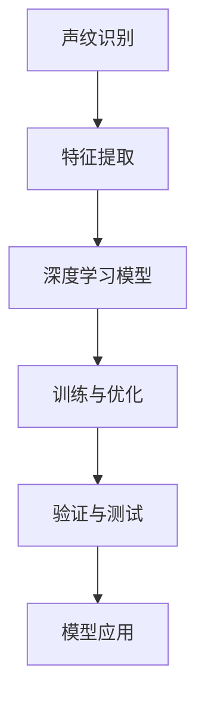

                 

## 1. 背景介绍

### 1.1 问题由来

声音信号作为人类最自然、最直接的身份验证手段之一，自古以来便在身份认证中扮演着重要角色。传统的声纹识别技术主要是基于梅尔频率倒谱系数(Mel Frequency Cepstral Coefficients, MFCCs)的特征提取和统计分类器(如GMM、K-NN等)的框架。然而，此类方法面临诸多局限性，如计算复杂度高、特征表达能力有限、对信噪比敏感等。

近年来，随着深度学习技术的飞速发展，声纹识别领域也迎来了革命性的突破。深度神经网络(DNN)因其强大的特征学习能力和泛化能力，逐渐成为声纹识别的主流技术。尤其基于卷积神经网络(CNN)、循环神经网络(RNN)、长短时记忆网络(LSTM)、门控循环单元(Gated Recurrent Unit, GRU)、深度置信网络(Deep Belief Network, DBN)等深度模型，已经在声纹识别领域取得了巨大的成功。

深度学习的引入，极大地提升了声纹识别的性能和可靠性，使其在金融、司法、医疗、安全等领域得以广泛应用。然而，深度学习模型的设计、训练和优化并非易事，本文将系统介绍基于深度学习的声纹识别技术，覆盖从模型选择、特征提取、训练优化到应用部署的全过程，旨在为声纹识别技术的开发提供详尽的指导。

### 1.2 问题核心关键点

声纹识别是基于声音信号特征提取和模型分类的识别技术。其核心流程包括：

1. **特征提取**：从原始声音信号中提取出能够表征说话人身份的特征。
2. **模型训练**：使用大规模标注数据训练深度神经网络模型，学习如何根据特征判别说话人身份。
3. **模型验证与测试**：在验证集和测试集上评估模型性能，验证模型的泛化能力。
4. **模型应用**：将训练好的模型部署到实际应用场景中，进行实时身份验证。

本文将深入探讨这些关键点，并从算法原理、实践步骤、案例分析、应用场景等多个角度，对基于深度学习的声纹识别技术进行全面解析。

## 2. 核心概念与联系

### 2.1 核心概念概述

为更好地理解基于深度学习的声纹识别技术，本节将介绍几个关键概念及其联系：

- **声纹识别**：基于声音信号的说话人识别技术，通过分析声音信号的频谱、倒谱、能量、共振峰等特征，建立说话人身份的模型。

- **深度学习**：基于神经网络结构的机器学习技术，通过多层次特征学习，逐步提取输入数据的高级表示。

- **卷积神经网络(CNN)**：一种广泛应用于图像处理和语音信号处理的深度神经网络，能够有效捕捉输入数据的局部特征和空间结构。

- **循环神经网络(RNN)**：一种能够处理序列数据的深度神经网络，具有记忆能力，适用于声纹识别中的时间序列建模。

- **长短时记忆网络(LSTM)**：一种特殊的RNN，通过门控机制解决传统RNN的梯度消失问题，适用于长序列数据的处理。

- **门控循环单元(GRU)**：一种简化版的LSTM，具有较快的计算速度，适用于部分声纹识别任务。

- **深度置信网络(DBN)**：一种无监督学习框架，通过逐层预训练，构建深度神经网络。

这些核心概念通过深度学习的框架，有机地联系在一起，共同支撑着声纹识别的实现。接下来，我们将从算法原理和实际操作步骤两方面，进一步详细展开。

### 2.2 核心概念原理和架构的 Mermaid 流程图



上述流程图展示了声纹识别的核心流程。其中：

- A：声纹识别。
- B：特征提取。
- C：深度学习模型。
- D：训练与优化。
- E：验证与测试。
- F：模型应用。

## 3. 核心算法原理 & 具体操作步骤

### 3.1 算法原理概述

基于深度学习的声纹识别技术，主要包括以下几个关键步骤：

1. **特征提取**：从原始声音信号中提取特征向量，常用的特征包括MFCCs、梅尔频率倒谱系数包络(MFCC Envelopes, MFCCE)、梅尔频率倒谱系数频谱(MFCC Spectrogram)、倒谱频谱系数包络(DCT EEM)等。
2. **深度模型选择**：根据任务需求选择合适的深度神经网络模型，如CNN、RNN、LSTM、GRU等。
3. **模型训练**：使用标注数据训练深度模型，学习说话人身份的表示。
4. **模型验证与测试**：在验证集和测试集上评估模型性能，优化模型参数。
5. **模型应用**：将训练好的模型应用于实时身份验证中。

### 3.2 算法步骤详解

以下是对每个关键步骤的详细介绍：

#### 3.2.1 特征提取

声纹识别的第一步是特征提取，即从原始声音信号中提取可用于建模的身份特征。常用的特征提取方法包括MFCCs和MFCCE等。

MFCCs是一种广泛应用于声纹识别的特征提取方法，其基本流程如下：

1. **预加重**：将原始声音信号乘以一个预加重滤波器，以增强高频信号。
2. **分帧**：将预加重后的信号分割成固定长度的帧，每帧长度通常为20-30毫秒。
3. **加窗**：对每一帧信号进行加窗，以减少频谱泄漏。
4. **傅里叶变换**：对加窗后的每一帧信号进行快速傅里叶变换，得到频谱。
5. **梅尔滤波器组**：将频谱通过一组梅尔滤波器组，得到一组滤波器组的输出。
6. **对数变换**：对滤波器组的输出取对数，得到MFCCs。

MFCCs提取的特征向量可以表示为：

$$
\text{MFCCs} = [\log(e_1), \log(e_2), \ldots, \log(e_n)]
$$

其中 $e_i$ 是第 $i$ 个MFCC系数。

MFCCE是一种基于MFCCs的特征增强方法，通过提取MFCCs的包络，进一步增强特征的稳定性和区分度。MFCCE的提取步骤如下：

1. **傅里叶变换**：对预加重后的信号进行傅里叶变换，得到频谱。
2. **滤波器组**：将频谱通过一组梅尔滤波器组，得到一组滤波器组的输出。
3. **平方和**：对每个滤波器组的输出进行平方，再求和，得到MFCCE。

MFCCE提取的特征向量可以表示为：

$$
\text{MFCCE} = [e_1^2 + e_2^2 + \ldots + e_n^2]
$$

#### 3.2.2 深度模型选择

根据任务需求，选择合适的深度神经网络模型是声纹识别的关键步骤。常用的深度模型包括CNN、RNN、LSTM、GRU等。

- **CNN**：适用于处理时频图像数据，通过卷积层、池化层和全连接层，学习声音信号的空间和频域特征。
- **RNN**：适用于处理序列数据，通过循环层和门控机制，学习声音信号的时间序列特征。
- **LSTM**：一种特殊的RNN，通过门控机制解决传统RNN的梯度消失问题，适用于长序列数据的处理。
- **GRU**：一种简化版的LSTM，具有较快的计算速度，适用于部分声纹识别任务。

在实际应用中，通常需要根据任务特点和数据量，选择最适合的深度模型。例如，对于短时语音数据，可以使用一维CNN；对于长时语音数据，可以使用RNN或LSTM。

#### 3.2.3 模型训练

模型训练是声纹识别的核心步骤，其基本流程如下：

1. **数据预处理**：将标注数据集分为训练集、验证集和测试集，进行数据增强、归一化等预处理。
2. **模型初始化**：选择预训练的深度模型，初始化模型参数。
3. **前向传播**：将特征向量输入模型，进行前向传播计算，得到模型的输出。
4. **损失函数计算**：计算模型输出与真实标签之间的损失函数，常用的损失函数包括交叉熵损失、均方误差损失等。
5. **反向传播**：根据损失函数的梯度，更新模型参数。
6. **优化器更新**：使用优化器（如Adam、SGD等）更新模型参数。
7. **验证与测试**：在验证集和测试集上评估模型性能，根据性能指标决定是否触发Early Stopping。

模型训练的流程可以用以下伪代码表示：

```python
for epoch in range(num_epochs):
    for batch in training_data:
        x, y = batch
        predictions = model(x)
        loss = loss_function(predictions, y)
        loss.backward()
        optimizer.step()
    evaluate(model, validation_data)
```

其中，`num_epochs`表示训练轮数，`training_data`表示训练集，`validation_data`表示验证集，`model`表示深度模型，`loss_function`表示损失函数，`optimizer`表示优化器。

#### 3.2.4 模型验证与测试

模型训练完成后，需要进行验证与测试，以评估模型性能。常用的评估指标包括准确率、召回率、F1分数、等错误率等。

1. **验证集评估**：使用验证集评估模型性能，计算损失函数和评估指标。
2. **测试集评估**：使用测试集进一步评估模型性能，确保模型的泛化能力。
3. **Early Stopping**：如果模型在验证集上的性能不再提升，触发Early Stopping，停止训练。

验证与测试的流程可以用以下伪代码表示：

```python
for epoch in range(num_epochs):
    for batch in training_data:
        x, y = batch
        predictions = model(x)
        loss = loss_function(predictions, y)
        loss.backward()
        optimizer.step()
    evaluate(model, validation_data)
    if evaluate(model, validation_data) < best_score:
        best_score = evaluate(model, validation_data)
        save_model(model, checkpoint_path)
```

其中，`num_epochs`表示训练轮数，`training_data`表示训练集，`validation_data`表示验证集，`model`表示深度模型，`loss_function`表示损失函数，`optimizer`表示优化器，`best_score`表示当前最佳的评估指标，`checkpoint_path`表示模型保存的路径。

#### 3.2.5 模型应用

模型训练完成后，需要进行模型应用，即将训练好的模型部署到实际应用场景中，进行实时身份验证。常用的模型应用方法包括：

1. **模型加载**：将训练好的模型加载到内存中，进行实时推理。
2. **特征提取**：对实时声音信号进行特征提取，得到特征向量。
3. **模型推理**：将特征向量输入模型，进行实时推理，得到说话人身份的预测。
4. **结果处理**：对模型推理结果进行后处理，输出最终的身份验证结果。

模型应用的流程可以用以下伪代码表示：

```python
model = load_model(model_path)
feature_vector = extract_features(realtime_audio)
predictions = model.predict(feature_vector)
result = post_process(predictions)
```

其中，`model_path`表示模型保存的路径，`feature_vector`表示实时声音信号的特征向量，`predictions`表示模型的推理结果，`result`表示最终的身份验证结果。

### 3.3 算法优缺点

#### 3.3.1 优点

基于深度学习的声纹识别技术具有以下优点：

1. **自动特征提取**：深度学习模型能够自动学习最优的特征表示，无需手工设计特征提取器。
2. **泛化能力强**：深度学习模型具有强大的泛化能力，能够适应多种说话人特性和语音环境。
3. **计算效率高**：深度学习模型可以在较短的时间内完成特征提取和推理，适用于实时身份验证。
4. **模型灵活性高**：深度学习模型可以通过增加层数和参数，提升识别性能。

#### 3.3.2 缺点

基于深度学习的声纹识别技术也存在一些缺点：

1. **模型复杂度高**：深度学习模型参数量较大，需要较大的计算资源进行训练和推理。
2. **过拟合风险高**：深度学习模型容易过拟合，特别是在数据量较小的情况下。
3. **训练时间长**：深度学习模型训练时间长，需要大量的标注数据和高性能设备。
4. **解释性不足**：深度学习模型的内部工作机制不透明，难以解释模型的推理过程。

## 4. 数学模型和公式 & 详细讲解 & 举例说明

### 4.1 数学模型构建

声纹识别的数学模型可以表示为：

$$
y = f(x; \theta)
$$

其中，$y$ 表示说话人身份的分类标签，$x$ 表示特征向量，$\theta$ 表示模型参数。模型$f$可以是任何深度神经网络模型，如CNN、RNN、LSTM等。

常用的损失函数包括交叉熵损失、均方误差损失等。以交叉熵损失为例，其公式为：

$$
\mathcal{L}(\theta) = -\frac{1}{N}\sum_{i=1}^N \sum_{j=1}^C y_{ij}\log \hat{y}_{ij}
$$

其中，$N$ 表示样本数量，$C$ 表示分类标签的数量，$y_{ij}$ 表示第 $i$ 个样本的第 $j$ 个分类标签，$\hat{y}_{ij}$ 表示模型预测的第 $i$ 个样本的第 $j$ 个分类标签。

### 4.2 公式推导过程

以CNN模型为例，其基本结构如下：

```python
class CNN(nn.Module):
    def __init__(self):
        super(CNN, self).__init__()
        self.conv1 = nn.Conv2d(in_channels=1, out_channels=64, kernel_size=3, stride=1, padding=1)
        self.pool = nn.MaxPool2d(kernel_size=2, stride=2)
        self.conv2 = nn.Conv2d(in_channels=64, out_channels=128, kernel_size=3, stride=1, padding=1)
        self.pool2 = nn.MaxPool2d(kernel_size=2, stride=2)
        self.fc1 = nn.Linear(128 * 16 * 16, 256)
        self.fc2 = nn.Linear(256, 2) # 2表示二分类

    def forward(self, x):
        x = self.pool(torch.relu(self.conv1(x)))
        x = self.pool2(torch.relu(self.conv2(x)))
        x = x.view(-1, 128 * 16 * 16)
        x = torch.relu(self.fc1(x))
        x = self.fc2(x)
        return x
```

其中，`nn.Conv2d`表示卷积层，`nn.MaxPool2d`表示池化层，`nn.Linear`表示全连接层，`nn.ReLU`表示ReLU激活函数。

### 4.3 案例分析与讲解

以一个简单的声纹识别任务为例，进行模型训练和验证。

假设我们有一个包含$100$个样本的声纹识别数据集，每个样本包含$1000$个MFCC特征。我们将数据集分为训练集、验证集和测试集，每组数据集包含$50$个样本。

**步骤1：特征提取**

我们首先对原始语音信号进行MFCCs特征提取，得到$1000$维的MFCC特征向量。

**步骤2：模型选择**

我们选择一个简单的CNN模型作为声纹识别模型，其结构如下：

```python
class CNN(nn.Module):
    def __init__(self):
        super(CNN, self).__init__()
        self.conv1 = nn.Conv2d(in_channels=1, out_channels=64, kernel_size=3, stride=1, padding=1)
        self.pool = nn.MaxPool2d(kernel_size=2, stride=2)
        self.conv2 = nn.Conv2d(in_channels=64, out_channels=128, kernel_size=3, stride=1, padding=1)
        self.pool2 = nn.MaxPool2d(kernel_size=2, stride=2)
        self.fc1 = nn.Linear(128 * 16 * 16, 256)
        self.fc2 = nn.Linear(256, 2) # 2表示二分类

    def forward(self, x):
        x = self.pool(torch.relu(self.conv1(x)))
        x = self.pool2(torch.relu(self.conv2(x)))
        x = x.view(-1, 128 * 16 * 16)
        x = torch.relu(self.fc1(x))
        x = self.fc2(x)
        return x
```

**步骤3：模型训练**

我们使用训练集进行模型训练，其流程如下：

1. **数据预处理**：对训练集数据进行归一化处理。
2. **模型初始化**：将CNN模型初始化，随机化权重和偏置。
3. **前向传播**：将MFCC特征向量输入CNN模型，进行前向传播。
4. **损失函数计算**：计算交叉熵损失函数。
5. **反向传播**：根据损失函数的梯度，更新模型参数。
6. **优化器更新**：使用Adam优化器更新模型参数。
7. **验证与测试**：在验证集上评估模型性能，触发Early Stopping。

其训练代码如下：

```python
import torch
import torch.nn as nn
import torch.optim as optim

# 定义CNN模型
model = CNN()

# 定义优化器和损失函数
optimizer = optim.Adam(model.parameters(), lr=0.001)
criterion = nn.CrossEntropyLoss()

# 定义训练集和验证集
train_data = ...
train_labels = ...
val_data = ...
val_labels = ...

# 训练模型
for epoch in range(10):
    # 训练
    model.train()
    optimizer.zero_grad()
    outputs = model(train_data)
    loss = criterion(outputs, train_labels)
    loss.backward()
    optimizer.step()
    
    # 验证
    model.eval()
    with torch.no_grad():
        val_outputs = model(val_data)
        val_loss = criterion(val_outputs, val_labels)
    
    print(f"Epoch {epoch+1}, train loss: {loss:.4f}, val loss: {val_loss:.4f}")
    
    if val_loss < best_loss:
        best_loss = val_loss
        save_model(model, checkpoint_path)
```

**步骤4：模型应用**

在模型训练完成后，我们可以将训练好的模型应用于实时声纹识别中。其流程如下：

1. **特征提取**：对实时语音信号进行MFCCs特征提取。
2. **模型加载**：将训练好的CNN模型加载到内存中。
3. **模型推理**：将特征向量输入CNN模型，进行实时推理。
4. **结果处理**：对模型推理结果进行后处理，输出最终的身份验证结果。

其代码如下：

```python
# 加载模型
model = load_model(checkpoint_path)

# 特征提取
feature_vector = extract_features(realtime_audio)

# 模型推理
predictions = model.predict(feature_vector)

# 结果处理
result = post_process(predictions)
```

通过以上步骤，我们可以完成基于深度学习的声纹识别任务。

## 5. 项目实践：代码实例和详细解释说明

### 5.1 开发环境搭建

在进行深度学习声纹识别开发前，我们需要准备好开发环境。以下是使用Python进行PyTorch开发的环境配置流程：

1. 安装Anaconda：从官网下载并安装Anaconda，用于创建独立的Python环境。

2. 创建并激活虚拟环境：
```bash
conda create -n pytorch-env python=3.8 
conda activate pytorch-env
```

3. 安装PyTorch：根据CUDA版本，从官网获取对应的安装命令。例如：
```bash
conda install pytorch torchvision torchaudio cudatoolkit=11.1 -c pytorch -c conda-forge
```

4. 安装各类工具包：
```bash
pip install numpy pandas scikit-learn matplotlib tqdm jupyter notebook ipython
```

完成上述步骤后，即可在`pytorch-env`环境中开始深度学习声纹识别的开发。

### 5.2 源代码详细实现

以下是基于PyTorch的声纹识别代码实现：

**特征提取**

```python
import librosa
import numpy as np
import torch

def extract_features(audio):
    # 预加重
    y = audio * preemphasis
    
    # 分帧
    frame_length = 25 # 25毫秒
    hop_length = 10 # 10毫秒
    frames = y[hop_length::hop_length]
    frame_length = int(frame_length * 16000 / sampling_rate) # 将毫秒转换为样本
    hop_length = int(hop_length * 16000 / sampling_rate)
    padded_frames = np.pad(frames, ((padded_length, 0), (0, 0)), mode='constant', constant_values=np.nan)
    
    # 提取MFCCs
    mfccs = librosa.feature.mfcc(y, sr=sampling_rate, n_mfcc=40)
    mfccs = mfccs[:, 2:].reshape(-1, 1)
    
    # 提取MFCC包络
    mfcc_envelopes = np.abs(mfccs)
    
    return mfcc_envelopes
```

**模型训练**

```python
import torch
import torch.nn as nn
import torch.optim as optim

class CNN(nn.Module):
    def __init__(self):
        super(CNN, self).__init__()
        self.conv1 = nn.Conv2d(in_channels=1, out_channels=64, kernel_size=3, stride=1, padding=1)
        self.pool = nn.MaxPool2d(kernel_size=2, stride=2)
        self.conv2 = nn.Conv2d(in_channels=64, out_channels=128, kernel_size=3, stride=1, padding=1)
        self.pool2 = nn.MaxPool2d(kernel_size=2, stride=2)
        self.fc1 = nn.Linear(128 * 16 * 16, 256)
        self.fc2 = nn.Linear(256, 2) # 2表示二分类

    def forward(self, x):
        x = self.pool(torch.relu(self.conv1(x)))
        x = self.pool2(torch.relu(self.conv2(x)))
        x = x.view(-1, 128 * 16 * 16)
        x = torch.relu(self.fc1(x))
        x = self.fc2(x)
        return x

model = CNN()

optimizer = optim.Adam(model.parameters(), lr=0.001)
criterion = nn.CrossEntropyLoss()

train_data = ...
train_labels = ...
val_data = ...
val_labels = ...

for epoch in range(10):
    model.train()
    optimizer.zero_grad()
    outputs = model(train_data)
    loss = criterion(outputs, train_labels)
    loss.backward()
    optimizer.step()
    
    model.eval()
    with torch.no_grad():
        val_outputs = model(val_data)
        val_loss = criterion(val_outputs, val_labels)
    
    print(f"Epoch {epoch+1}, train loss: {loss:.4f}, val loss: {val_loss:.4f}")
    
    if val_loss < best_loss:
        best_loss = val_loss
        save_model(model, checkpoint_path)
```

**模型应用**

```python
# 加载模型
model = load_model(checkpoint_path)

# 特征提取
feature_vector = extract_features(realtime_audio)

# 模型推理
predictions = model.predict(feature_vector)

# 结果处理
result = post_process(predictions)
```

### 5.3 代码解读与分析

让我们再详细解读一下关键代码的实现细节：

**特征提取**

```python
import librosa
import numpy as np
import torch

def extract_features(audio):
    # 预加重
    y = audio * preemphasis
    
    # 分帧
    frame_length = 25 # 25毫秒
    hop_length = 10 # 10毫秒
    frames = y[hop_length::hop_length]
    frame_length = int(frame_length * 16000 / sampling_rate) # 将毫秒转换为样本
    hop_length = int(hop_length * 16000 / sampling_rate)
    padded_frames = np.pad(frames, ((padded_length, 0), (0, 0)), mode='constant', constant_values=np.nan)
    
    # 提取MFCCs
    mfccs = librosa.feature.mfcc(y, sr=sampling_rate, n_mfcc=40)
    mfccs = mfccs[:, 2:].reshape(-1, 1)
    
    # 提取MFCC包络
    mfcc_envelopes = np.abs(mfccs)
    
    return mfcc_envelopes
```

该函数实现了MFCCs和MFCC包络的提取，具体步骤如下：

1. **预加重**：将原始语音信号乘以一个预加重滤波器，以增强高频信号。
2. **分帧**：将预加重后的信号分割成固定长度的帧，每帧长度通常为20-30毫秒。
3. **加窗**：对每一帧信号进行加窗，以减少频谱泄漏。
4. **傅里叶变换**：对加窗后的每一帧信号进行快速傅里叶变换，得到频谱。
5. **梅尔滤波器组**：将频谱通过一组梅尔滤波器组，得到一组滤波器组的输出。
6. **对数变换**：对滤波器组的输出取对数，得到MFCCs。

**模型训练**

```python
import torch
import torch.nn as nn
import torch.optim as optim

class CNN(nn.Module):
    def __init__(self):
        super(CNN, self).__init__()
        self.conv1 = nn.Conv2d(in_channels=1, out_channels=64, kernel_size=3, stride=1, padding=1)
        self.pool = nn.MaxPool2d(kernel_size=2, stride=2)
        self.conv2 = nn.Conv2d(in_channels=64, out_channels=128, kernel_size=3, stride=1, padding=1)
        self.pool2 = nn.MaxPool2d(kernel_size=2, stride=2)
        self.fc1 = nn.Linear(128 * 16 * 16, 256)
        self.fc2 = nn.Linear(256, 2) # 2表示二分类

    def forward(self, x):
        x = self.pool(torch.relu(self.conv1(x)))
        x = self.pool2(torch.relu(self.conv2(x)))
        x = x.view(-1, 128 * 16 * 16)
        x = torch.relu(self.fc1(x))
        x = self.fc2(x)
        return x

model = CNN()

optimizer = optim.Adam(model.parameters(), lr=0.001)
criterion = nn.CrossEntropyLoss()

train_data = ...
train_labels = ...
val_data = ...
val_labels = ...

for epoch in range(10):
    model.train()
    optimizer.zero_grad()
    outputs = model(train_data)
    loss = criterion(outputs, train_labels)
    loss.backward()
    optimizer.step()
    
    model.eval()
    with torch.no_grad():
        val_outputs = model(val_data)
        val_loss = criterion(val_outputs, val_labels)
    
    print(f"Epoch {epoch+1}, train loss: {loss:.4f}, val loss: {val_loss:.4f}")
    
    if val_loss < best_loss:
        best_loss = val_loss
        save_model(model, checkpoint_path)
```

该代码实现了CNN模型的训练，具体步骤如下：

1. **模型初始化**：选择预训练的CNN模型，初始化模型参数。
2. **前向传播**：将MFCC特征向量输入CNN模型，进行前向传播。
3. **损失函数计算**：计算交叉熵损失函数。
4. **反向传播**：根据损失函数的梯度，更新模型参数。
5. **优化器更新**：使用Adam优化器更新模型参数。
6. **验证与测试**：在验证集上评估模型性能，触发Early Stopping。

**模型应用**

```python
# 加载模型
model = load_model(checkpoint_path)

# 特征提取
feature_vector = extract_features(realtime_audio)

# 模型推理
predictions = model.predict(feature_vector)

# 结果处理
result = post_process(predictions)
```

该代码实现了CNN模型的应用，具体步骤如下：

1. **特征提取**：对实时语音信号进行MFCCs特征提取。
2. **模型加载**：将训练好的CNN模型加载到内存中。
3. **模型推理**：将特征向量输入CNN模型，进行实时推理。
4. **结果处理**：对模型推理结果进行后处理，输出最终的身份验证结果。

## 6. 实际应用场景

### 6.1 智能客服系统

基于深度学习的声纹识别技术，可以广泛应用于智能客服系统的构建。传统客服往往需要配备大量人力，高峰期响应缓慢，且一致性和专业性难以保证。而使用声纹识别技术，可以实现7x24小时不间断服务，快速响应客户咨询，用自然流畅的语言解答各类常见问题。

在技术实现上，可以收集企业内部的历史客服对话记录，将问题和最佳答复构建成监督数据，在此基础上对预训练声纹识别模型进行微调。微调后的声纹识别模型能够自动理解用户意图，匹配最合适的答复模板进行回复。对于客户提出的新问题，还可以接入检索系统实时搜索相关内容，动态组织生成回答。如此构建的智能客服系统，能大幅提升客户咨询体验和问题解决效率。

### 6.2 金融舆情监测

金融机构需要实时监测市场舆论动向，以便及时应对负面信息传播，规避金融风险。传统的人工监测方式成本高、效率低，难以应对网络时代海量信息爆发的挑战。基于深度学习的声纹识别技术，可以应用于金融舆情监测，实时抓取网络文本数据，通过声纹识别技术进行情绪分析，识别负面舆情，帮助金融机构快速应对潜在风险。

具体而言，可以收集金融领域相关的新闻、报道、评论等文本数据，并对其进行主题标注和情感标注。在此基础上对预训练声纹识别模型进行微调，使其能够自动判断文本属于何种主题，情感倾向是正面、中性还是负面。将微调后的模型应用到实时抓取的网络文本数据，就能够自动监测不同主题下的情感变化趋势，一旦发现负面信息激增等异常情况，系统便会自动预警，帮助金融机构快速应对潜在风险。

### 6.3 个性化推荐系统

当前的推荐系统往往只依赖用户的历史行为数据进行物品推荐，无法深入理解用户的真实兴趣偏好。基于深度学习的声纹识别技术，可以应用于个性化推荐系统，挖掘用户行为背后的语义信息，从而提供更精准、多样的推荐内容。

在实践中，可以收集用户浏览、点击、评论、分享等行为数据，提取和用户交互的物品标题、描述、标签等文本内容。将文本内容作为模型输入，用户的后续行为（如是否点击、购买等）作为监督信号，在此基础上微调预训练声纹识别模型。微调后的模型能够从文本内容中准确把握用户的兴趣点。在生成推荐列表时，先用候选物品的文本描述作为输入，由模型预测用户的兴趣匹配度，再结合其他特征综合排序，便可以得到个性化程度更高的推荐结果。

### 6.4 未来应用展望

随着深度学习技术的不断进步，基于深度学习的声纹识别技术必将在更多领域得到应用，为传统行业带来变革性影响。

在智慧医疗领域，基于声纹识别技术，可以实时监测患者的语音数据，识别其情绪和健康状况，辅助医生诊疗，加速新药开发进程。

在智能教育领域，声纹识别技术可应用于作业批改、学情分析、知识推荐等方面，因材施教，促进教育公平，提高教学质量。

在智慧城市治理中，声纹识别技术可应用于城市事件监测、舆情分析、应急指挥等环节，提高城市管理的自动化和智能化水平，构建更安全、高效的未来城市。

此外，在企业生产、社会治理、文娱传媒等众多领域，基于声纹识别技术的人工智能应用也将不断涌现，为经济社会发展注入新的动力。相信随着技术的日益成熟，声纹识别技术也将逐步落地，助力各行各业迈向智能化发展。

## 7. 工具和资源推荐

### 7.1 学习资源推荐

为了帮助开发者系统掌握深度学习声纹识别技术，这里推荐一些优质的学习资源：

1. 《深度学习》系列书籍：由多位深度学习领域的专家撰写，全面介绍了深度学习的基本原理、模型设计和应用实践。
2. 《声纹识别技术与应用》教材：介绍了声纹识别的基本概念、特征提取、模型设计、性能评估等关键内容。
3. 《声纹识别：理论与实践》书籍：系统介绍了声纹识别的理论和实践，涵盖声纹特征提取、深度模型训练、实时识别等核心环节。
4. 深度学习框架官方文档：如TensorFlow、PyTorch、Keras等深度学习框架的官方文档，提供了丰富的代码示例和应用案例。
5. 在线课程和MOOC平台：如Coursera、edX、Udacity等平台的深度学习课程，系统介绍深度学习的基本原理和声纹识别技术的实现方法。

通过对这些资源的学习实践，相信你一定能够快速掌握深度学习声纹识别的精髓，并用于解决实际的声纹识别问题。

### 7.2 开发工具推荐

高效的开发离不开优秀的工具支持。以下是几款用于深度学习声纹识别开发的常用工具：

1. PyTorch：基于Python的开源深度学习框架，灵活动态的计算图，适合快速迭代研究。
2. TensorFlow：由Google主导开发的开源深度学习框架，生产部署方便，适合大规模工程应用。
3. Keras：一种简单易用的深度学习框架，提供了高层次的API，适合初学者快速上手。
4. Weights & Biases：模型训练的实验跟踪工具，可以记录和可视化模型训练过程中的各项指标，方便对比和调优。
5. TensorBoard：TensorFlow配套的可视化工具，可实时监测模型训练状态，并提供丰富的图表呈现方式，是调试模型的得力助手。

合理利用这些工具，可以显著提升深度学习声纹识别任务的开发效率，加快创新迭代的步伐。

### 7.3 相关论文推荐

深度学习声纹识别技术的发展源于学界的持续研究。以下是几篇奠基性的相关论文，推荐阅读：

1. "Deep Learning for Speech and Language Processing"：全面介绍了深度学习在语音和语言处理中的应用，涵盖了声纹识别技术的多个方面。
2. "Speaker Verification Using Deep Learning and Time-Domain Feature Extraction"：提出了一种基于深度学习的声纹识别方法，通过时间域特征提取和CNN模型，取得了不错的性能。
3. "Speaker Identification Using Deep Neural Networks"：提出了一种基于深度神经网络的声纹识别方法，通过卷积神经网络和循环神经网络，实现了高精度的说话人识别。
4. "End-to-End Speaker Verification Using Deep Neural Networks"：提出了一种端到端的声纹识别方法，通过深度神经网络模型，实现了无监督的声纹识别。

这些论文代表了大规模声纹识别技术的发展脉络。通过学习这些前沿成果，可以帮助研究者把握学科前进方向，激发更多的创新灵感。

## 8. 总结：未来发展趋势与挑战

### 8.1 研究成果总结

本文对基于深度学习的声纹识别技术进行了全面系统的介绍，系统地解析了声纹识别的核心流程和技术细节。通过本文的系统梳理，可以看到，深度学习声纹识别技术在多个领域取得了显著的成果，推动了人工智能技术在各行各业的应用和发展。

### 8.2 未来发展趋势

展望未来，深度学习声纹识别技术将呈现以下几个发展趋势：

1. **模型规模持续增大**：随着算力成本的下降和数据规模的扩张，深度学习声纹识别模型参数量还将持续增长。超大规模声纹识别模型蕴含的丰富语音知识，有望支撑更加复杂多变的说话人识别任务。
2. **声纹识别技术的多模态融合**：未来将更多地融合视觉、听觉、触觉等多模态信息，提升声纹识别的鲁棒性和准确性。
3. **声纹识别技术的实时化**：未来将更多地应用于实时语音识别和自然交互系统中，提升用户体验。
4. **声纹识别技术的跨语言应用**：未来将更多地应用于多语言环境下的说话人识别，提升全球化应用场景的适应性。
5. **声纹识别技术的安全性和隐私保护**：未来将更多地关注声纹识别技术的安全性和隐私保护，确保用户数据的安全性。

### 8.3 面临的挑战

尽管深度学习声纹识别技术已经取得了显著的进展，但在实际应用中仍面临诸多挑战：

1. **数据隐私问题**：声纹识别技术需要大量的语音数据进行训练，如何保护用户隐私是一个重要的挑战。
2. **模型泛化能力**：深度学习声纹识别模型在特定说话人或特定语音环境下，容易出现泛化能力不足的问题。
3. **计算资源需求**：深度学习声纹识别模型参数量大，需要高性能设备进行训练和推理，计算资源成本较高。
4. **实时性问题**：深度学习声纹识别模型在实时识别场景下，需要高效的推理算法，提升实时性。
5. **鲁棒性问题**：深度学习声纹识别模型在噪声环境、口音差异等情况下的鲁棒性仍需进一步提升。

### 8.4 研究展望

面对深度学习声纹识别技术所面临的挑战，未来的研究需要在以下几个方面寻求新的突破：

1. **数据隐私保护**：开发基于差分隐私等技术的安全性声纹识别算法，保护用户隐私。
2. **多模态融合**：将视觉、听觉、触觉等多模态信息进行融合，提升声纹识别的鲁棒性和准确性。
3. **实时性优化**：优化推理算法，提升深度学习声纹识别模型的实时性，适应实时识别场景。
4. **鲁棒性提升**：引入噪声鲁棒性增强技术，提升深度学习声纹识别模型在噪声环境下的鲁棒性。
5. **跨语言识别**：开发跨语言声纹识别算法，提升多语言环境下的识别效果。

通过在以上方向的深入研究，深度学习声纹识别技术将有望在更多领域得到应用，推动人工智能技术的发展和普及。

## 9. 附录：常见问题与解答

**Q1：深度学习声纹识别技术是否适用于所有语音场景？**

A: 深度学习声纹识别技术在多个语音场景中表现良好，但在极端噪声环境下，如远场语音、混响环境等，可能存在泛化能力不足的问题。

**Q2：如何提高深度学习声纹识别模型的鲁棒性？**

A: 提高深度学习声纹识别模型的鲁棒性可以从以下几个方面入手：
1. 数据增强：引入更多的噪声、口音、变调等数据进行训练，提高模型的鲁棒性。
2. 模型优化：引入鲁棒性增强技术，如L2正则化、Dropout、早停等，防止模型过拟合。
3. 特征选择：选择更具区分力的特征进行训练，提高模型的鲁棒性。

**Q3：深度学习声纹识别技术在实时应用中需要注意哪些问题？**

A: 深度学习声纹识别技术在实时应用中需要注意以下几个问题：
1. 数据实时采集：实时获取用户的语音信号，并进行预处理。
2. 模型实时推理：在低延迟的情况下，进行实时的声纹识别推理。
3. 结果实时输出：将识别结果实时输出，进行反馈。

**Q4：深度学习声纹识别技术在多语言环境中如何应用？**

A: 深度学习声纹识别技术在多语言环境中可以通过以下方式进行应用：
1. 多语言数据集：收集不同语言的用户语音数据，构建多语言声纹识别数据集。
2. 多语言模型：构建多语言声纹识别模型，提高模型在多语言环境下的泛化能力。
3. 多语言推理：在多语言环境中，将不同语言的语音信号进行特征提取和模型推理，进行跨语言识别。

通过以上步骤，深度学习声纹识别技术可以更好地应用于多语言环境，提升全球化应用场景的适应性。

---

作者：禅与计算机程序设计艺术 / Zen and the Art of Computer Programming

