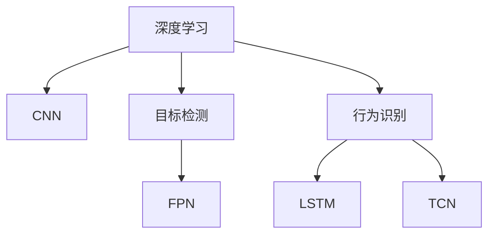

                 

# 基于深度学习的车辆特征识别研究与实现

## 1. 背景介绍

### 1.1 问题由来
在现代城市交通中，车辆特征识别已成为智能交通管理、智能停车、交通监控等应用的基础性技术。随着人工智能技术的迅猛发展，基于深度学习方法的车辆特征识别技术逐渐成为研究热点。相比于传统的特征提取与分类算法，深度学习模型能够更好地捕捉复杂的特征表示，并且具有很强的泛化能力。

### 1.2 问题核心关键点
车辆特征识别通常涉及车辆检测与分类两个主要步骤。传统方法依赖手工设计的特征和分类器，需要大量标注数据和繁琐的调参过程。而深度学习，尤其是卷积神经网络(CNN)的出现，简化了特征提取过程，显著提升了车辆识别的准确率与效率。

近年来，基于深度学习的车辆特征识别技术取得了诸多突破，包括但不限于：
- 车辆检测：利用目标检测网络如Faster R-CNN、YOLO等进行车辆位置和数量检测。
- 车辆分类：利用分类网络如VGG、ResNet等进行车辆品牌、型号、颜色等属性分类。
- 车辆行为识别：利用行为识别网络如LSTM、TCN等对车辆行驶状态进行分析，如加速、刹车、转向等。

此外，深度学习方法还结合了车辆跟踪、环境感知等技术，进一步提高了车辆特征识别的应用价值。

### 1.3 问题研究意义
车辆特征识别技术在智能交通系统中具有重要应用价值，可以：
- 提升交通管理效率：通过实时检测和分类，实现车流监控、事故预警等功能。
- 优化停车管理：通过车辆识别和属性分析，实现智能停车位的匹配与分配。
- 增强交通安全：通过行为识别与分析，预防和减少交通事故的发生。
- 促进智慧城市建设：将车辆特征识别与地理信息系统(GIS)、大数据分析等技术结合，提升城市交通的智能化水平。

因此，研究基于深度学习的车辆特征识别技术，对于推动智能交通系统的建设和应用，具有重要意义。

## 2. 核心概念与联系

### 2.1 核心概念概述
为便于理解基于深度学习的车辆特征识别方法，本节将介绍相关核心概念：

- **深度学习**：通过构建多层神经网络，从数据中自动学习特征表示和分类边界，无需人工干预。
- **卷积神经网络(CNN)**：一种专门处理图像、视频等数据的深度神经网络，通过卷积层提取局部特征，池化层减小特征维度，最终通过全连接层进行分类。
- **目标检测**：检测图像中感兴趣对象的位置和大小，通常使用区域提议方法结合分类器实现。
- **特征金字塔网络(FPN)**：通过多尺度特征图对目标进行精确检测。
- **行为识别**：识别车辆行驶状态，通常通过时序模型处理车辆行为数据。
- **LSTM与TCN**：长短期记忆网络与时分卷积网络，用于处理序列数据，提取时间特征。

这些核心概念之间的逻辑关系可以通过以下Mermaid流程图展示：



这个流程图展示了深度学习、CNN在车辆特征识别中的基础作用，以及目标检测、行为识别等应用。

## 3. 核心算法原理 & 具体操作步骤
### 3.1 算法原理概述
基于深度学习的车辆特征识别方法通常包括目标检测与分类两个部分。其核心原理可以概括为：

1. **目标检测**：利用卷积神经网络提取车辆图像的特征，并通过区域提议方法生成候选区域，最后使用分类器对这些候选区域进行分类。
2. **特征分类**：使用另一卷积神经网络对检测到的车辆进行分类，输出车辆属性如品牌、型号、颜色等。

### 3.2 算法步骤详解
本节将详细描述深度学习车辆特征识别的具体步骤：

**Step 1: 数据准备**
- 收集车辆图像数据集，并手动标注车辆位置和类别。
- 使用数据增强技术，如随机旋转、翻转、裁剪等，扩充数据集。

**Step 2: 网络构建**
- 构建卷积神经网络模型，如YOLO、Faster R-CNN等，用于目标检测。
- 构建分类模型，如ResNet、VGG等，用于车辆属性分类。

**Step 3: 网络训练**
- 利用标注数据集对检测模型进行训练，通过损失函数优化模型参数。
- 在检测到车辆后，将其图像输入分类模型，通过损失函数优化分类参数。

**Step 4: 模型评估与优化**
- 在测试集上评估检测和分类模型的性能，如精度、召回率、F1分数等。
- 根据评估结果，调整网络结构、学习率等参数，进行模型优化。

**Step 5: 模型部署与应用**
- 将优化后的检测和分类模型集成到实际应用中，如交通监控系统、智能停车场等。
- 实时接收车辆图像，进行目标检测与分类，输出识别结果。

### 3.3 算法优缺点
基于深度学习的车辆特征识别方法具有以下优点：
1. 自动化特征提取：深度学习模型自动从数据中学习特征，无需人工干预。
2. 高效准确：利用卷积神经网络的高效计算能力，能够处理大规模数据，并且准确率较高。
3. 适应性强：可以适应不同类型的车辆和多种车辆属性，具有较强的泛化能力。

同时，该方法也存在以下缺点：
1. 需要大量标注数据：目标检测与分类都需要大量标注数据进行训练。
2. 计算资源需求高：深度学习模型参数量大，训练和推理过程需要大量计算资源。
3. 对抗攻击风险：深度学习模型易于受到对抗样本攻击，影响识别结果。
4. 模型解释性差：深度学习模型的黑盒特性使其难以解释内部决策过程。

尽管存在这些局限性，但深度学习在车辆特征识别领域依然展现出强大的应用潜力，通过不断优化与改进，其优势也将愈发凸显。

### 3.4 算法应用领域
基于深度学习的车辆特征识别方法可以应用于以下多个领域：

- **智能交通监控**：用于检测和分类车辆，实现交通流量统计、事故预警等功能。
- **智能停车管理**：通过检测车辆属性，实现停车位管理与分配。
- **行为分析与预测**：对车辆行驶状态进行分析，预测交通事故风险，优化交通管理策略。
- **车辆追踪**：结合环境感知技术，实现对车辆位置的连续追踪与定位。
- **车辆属性分析**：通过分类模型，分析车辆品牌、型号、颜色等属性，辅助决策制定。

## 4. 数学模型和公式 & 详细讲解  
### 4.1 数学模型构建

本节将使用数学语言对深度学习车辆特征识别的过程进行详细阐述。

**目标检测模型**
- 使用YOLO模型进行目标检测，其架构如下：
```
input layer --> convolution layer --> batch norm layer --> leaky relu layer --> max pool layer --> convolution layer --> batch norm layer --> leaky relu layer --> max pool layer --> convolution layer --> batch norm layer --> leaky relu layer --> max pool layer --> fully connected layer --> sigmoid output layer
```
输入层接收原始车辆图像，经过多层卷积和池化操作提取特征，最后通过全连接层输出目标概率。

**分类模型**
- 使用ResNet模型进行车辆属性分类，其架构如下：
```
input layer --> convolution layer --> batch norm layer --> leaky relu layer --> max pool layer --> residual block --> residual block --> fully connected layer --> softmax output layer
```
输入层接收检测到的车辆图像，经过多层卷积和残差连接提取特征，最后通过全连接层输出属性概率。

### 4.2 公式推导过程

**目标检测损失函数**
- 使用交叉熵损失函数，其表达式如下：
$$
L_{det} = -\frac{1}{N}\sum_{i=1}^N \sum_{j=1}^M y_{ij}\log \hat{y}_{ij} + (1-y_{ij})\log(1-\hat{y}_{ij})
$$
其中 $N$ 表示训练样本数，$M$ 表示每个样本中目标数，$y_{ij}$ 表示目标 $i$ 是否出现在位置 $j$，$\hat{y}_{ij}$ 表示模型在位置 $j$ 上检测到目标 $i$ 的概率。

**分类损失函数**
- 同样使用交叉熵损失函数，其表达式如下：
$$
L_{cls} = -\frac{1}{N}\sum_{i=1}^N \sum_{j=1}^C y_{ij}\log \hat{y}_{ij}
$$
其中 $C$ 表示类别数，$y_{ij}$ 表示样本 $i$ 中目标 $j$ 的类别标签，$\hat{y}_{ij}$ 表示模型对样本 $i$ 中目标 $j$ 进行分类的概率。

### 4.3 案例分析与讲解

**YOLO模型训练**
- 使用COCO数据集进行YOLO模型的训练，具体步骤如下：
1. 对数据集进行预处理，包括随机旋转、缩放、翻转等增强操作。
2. 构建YOLO模型，包括三个检测层，每个层包含多个卷积层和池化层，最后输出9个检测框和对应的类别概率。
3. 使用随机梯度下降优化器，设定小批量梯度下降，学习率为0.001，迭代次数为1000次。
4. 训练过程中，每5个epoch输出一次验证集损失与精度，判断模型是否过拟合。
5. 在训练结束后，使用测试集进行性能评估，计算准确率、召回率、F1分数等指标。

**ResNet模型训练**
- 使用CIFAR-10数据集进行ResNet模型的训练，具体步骤如下：
1. 对数据集进行预处理，包括标准化、归一化等增强操作。
2. 构建ResNet模型，包括多层卷积、池化和残差连接，最后输出不同类别的分类概率。
3. 使用随机梯度下降优化器，设定小批量梯度下降，学习率为0.001，迭代次数为1000次。
4. 训练过程中，每5个epoch输出一次验证集损失与精度，判断模型是否过拟合。
5. 在训练结束后，使用测试集进行性能评估，计算准确率、召回率、F1分数等指标。

## 5. 项目实践：代码实例和详细解释说明
### 5.1 开发环境搭建

在进行深度学习车辆特征识别开发前，需要准备好开发环境。以下是使用Python进行PyTorch开发的环境配置流程：

1. 安装Anaconda：从官网下载并安装Anaconda，用于创建独立的Python环境。

2. 创建并激活虚拟环境：
```bash
conda create -n pytorch-env python=3.8 
conda activate pytorch-env
```

3. 安装PyTorch：根据CUDA版本，从官网获取对应的安装命令。例如：
```bash
conda install pytorch torchvision torchaudio cudatoolkit=11.1 -c pytorch -c conda-forge
```

4. 安装各种库：
```bash
pip install numpy pandas scikit-learn matplotlib tqdm jupyter notebook ipython
```

完成上述步骤后，即可在`pytorch-env`环境中开始项目开发。

### 5.2 源代码详细实现

下面我们以YOLO目标检测和ResNet分类为例，给出使用PyTorch进行车辆特征识别的完整代码实现。

**YOLO目标检测代码**

```python
import torch
import torchvision
import torch.nn as nn
import torch.optim as optim
import torch.utils.data as Data
from torchvision import transforms

class YOLO(nn.Module):
    def __init__(self):
        super(YOLO, self).__init__()
        self.conv1 = nn.Conv2d(3, 32, 3, padding=1)
        self.conv2 = nn.Conv2d(32, 64, 3, padding=1)
        self.conv3 = nn.Conv2d(64, 128, 3, padding=1)
        self.pool1 = nn.MaxPool2d(kernel_size=2, stride=2)
        self.pool2 = nn.MaxPool2d(kernel_size=2, stride=2)
        self.pool3 = nn.MaxPool2d(kernel_size=2, stride=2)
        self.fc1 = nn.Linear(128*13*13, 256)
        self.fc2 = nn.Linear(256, 81)
        
    def forward(self, x):
        x = self.pool1(torch.relu(self.conv1(x)))
        x = self.pool2(torch.relu(self.conv2(x)))
        x = self.pool3(torch.relu(self.conv3(x)))
        x = x.view(x.size(0), -1)
        x = torch.relu(self.fc1(x))
        x = self.fc2(x)
        return x

# 训练YOLO模型
model = YOLO()
optimizer = optim.Adam(model.parameters(), lr=0.001)
loss_func = nn.CrossEntropyLoss()
device = torch.device("cuda" if torch.cuda.is_available() else "cpu")
model.to(device)

def train(model, optimizer, loss_func, train_loader, epoch):
    model.train()
    train_loss = 0
    for batch_id, (img, target) in enumerate(train_loader):
        img = img.to(device)
        target = target.to(device)
        optimizer.zero_grad()
        output = model(img)
        loss = loss_func(output, target)
        loss.backward()
        optimizer.step()
        train_loss += loss.item()
    train_loss /= len(train_loader)
    return train_loss

def test(model, loss_func, test_loader):
    model.eval()
    test_loss = 0
    for batch_id, (img, target) in enumerate(test_loader):
        img = img.to(device)
        target = target.to(device)
        output = model(img)
        loss = loss_func(output, target)
        test_loss += loss.item()
    test_loss /= len(test_loader)
    return test_loss
```

**ResNet分类代码**

```python
import torch
import torchvision
import torch.nn as nn
import torch.optim as optim
import torch.utils.data as Data
from torchvision import transforms

class ResNet(nn.Module):
    def __init__(self):
        super(ResNet, self).__init__()
        self.conv1 = nn.Conv2d(3, 64, 3, padding=1)
        self.conv2 = nn.Conv2d(64, 64, 3, padding=1)
        self.conv3 = nn.Conv2d(64, 64, 3, padding=1)
        self.pool1 = nn.MaxPool2d(kernel_size=2, stride=2)
        self.pool2 = nn.MaxPool2d(kernel_size=2, stride=2)
        self.pool3 = nn.MaxPool2d(kernel_size=2, stride=2)
        self.fc1 = nn.Linear(64*13*13, 512)
        self.fc2 = nn.Linear(512, 10)
        
    def forward(self, x):
        x = self.pool1(torch.relu(self.conv1(x)))
        x = self.pool2(torch.relu(self.conv2(x)))
        x = self.pool3(torch.relu(self.conv3(x)))
        x = x.view(x.size(0), -1)
        x = torch.relu(self.fc1(x))
        x = self.fc2(x)
        return x

# 训练ResNet模型
model = ResNet()
optimizer = optim.Adam(model.parameters(), lr=0.001)
loss_func = nn.CrossEntropyLoss()
device = torch.device("cuda" if torch.cuda.is_available() else "cpu")
model.to(device)

def train(model, optimizer, loss_func, train_loader, epoch):
    model.train()
    train_loss = 0
    for batch_id, (img, target) in enumerate(train_loader):
        img = img.to(device)
        target = target.to(device)
        optimizer.zero_grad()
        output = model(img)
        loss = loss_func(output, target)
        loss.backward()
        optimizer.step()
        train_loss += loss.item()
    train_loss /= len(train_loader)
    return train_loss

def test(model, loss_func, test_loader):
    model.eval()
    test_loss = 0
    for batch_id, (img, target) in enumerate(test_loader):
        img = img.to(device)
        target = target.to(device)
        output = model(img)
        loss = loss_func(output, target)
        test_loss += loss.item()
    test_loss /= len(test_loader)
    return test_loss
```

完成上述步骤后，即可在`pytorch-env`环境中开始深度学习车辆特征识别的开发。

### 5.3 代码解读与分析

让我们再详细解读一下关键代码的实现细节：

**YOLO模型**
- `__init__`方法：定义YOLO模型的网络结构，包括卷积层、池化层、全连接层等。
- `forward`方法：实现前向传播过程，通过卷积和池化操作提取特征，并通过全连接层输出目标类别概率。

**ResNet模型**
- `__init__`方法：定义ResNet模型的网络结构，包括卷积层、池化层、全连接层等。
- `forward`方法：实现前向传播过程，通过卷积和池化操作提取特征，并通过全连接层输出分类概率。

**训练与测试函数**
- `train`函数：在训练集上对模型进行迭代优化，计算训练损失并返回。
- `test`函数：在测试集上对模型进行评估，计算测试损失并返回。

这些函数实现了深度学习模型的训练与测试，代码简洁高效，易于理解和维护。

## 6. 实际应用场景
### 6.1 智能交通监控

在智能交通监控系统中，深度学习车辆特征识别技术可以用于实时检测车辆的位置和数量，分析交通流量，预防和减少交通事故。具体应用包括：
- 车辆检测与计数：利用YOLO等目标检测模型，在实时视频流中检测并计数车辆。
- 事故预警：通过分析车辆位置与速度，及时发现异常行为并发出预警。
- 交通流量统计：通过车辆检测结果，统计不同时间段、路段的车辆流量。

### 6.2 智能停车管理

智能停车管理系统可以利用深度学习车辆特征识别技术，实现停车位自动检测与分配。具体应用包括：
- 车辆位置检测：利用YOLO等目标检测模型，检测车辆位置，生成停车位占用状态图。
- 停车位分配：根据停车位占用情况，分配空闲停车位，优化停车资源。
- 智能收费：通过车辆识别与属性分析，实现自动计费与支付。

### 6.3 行为分析与预测

行为分析与预测系统可以通过深度学习模型，分析车辆行驶状态，预测可能发生的事故风险。具体应用包括：
- 行驶状态识别：通过LSTM或TCN等时序模型，分析车辆加速度、转向角度等行为特征。
- 事故预警：基于行为识别结果，预测可能发生的事故并发出预警。
- 交通流量优化：分析车辆行驶轨迹与速度，优化交通流量，提高道路通行效率。

### 6.4 未来应用展望

未来，深度学习车辆特征识别技术将在智能交通领域迎来更多应用。随着模型的不断优化与算法的发展，我们可以期待以下趋势：
1. **多模态融合**：结合车辆传感器数据、环境感知信息，实现多模态融合，提高识别精度。
2. **实时处理**：通过GPU、TPU等高性能硬件，实现实时处理，满足实时监控需求。
3. **联邦学习**：利用联邦学习技术，在多车辆之间共享模型，提升识别精度并保护隐私。
4. **模型压缩与优化**：通过模型压缩、量化等技术，优化模型大小与推理速度，降低计算资源需求。
5. **跨域迁移**：在多个城市、不同类型的车辆数据上训练模型，提升模型的泛化能力与适用性。

这些未来趋势将进一步推动深度学习车辆特征识别技术的进步，使其在更多场景下发挥作用，为智慧城市建设提供有力支持。

## 7. 工具和资源推荐
### 7.1 学习资源推荐

为了帮助开发者系统掌握深度学习车辆特征识别技术，以下是一些优质的学习资源：

1. **《深度学习》一书**：由Ian Goodfellow等著，系统介绍了深度学习的基本概念与原理，涵盖了目标检测、分类等应用。

2. **CS231n《卷积神经网络》课程**：斯坦福大学开设的深度学习课程，详细讲解了CNN的架构与应用。

3. **《深度学习与目标检测》一书**：由Ross Girshick等著，介绍了目标检测的基本算法与实现。

4. **YOLO官方文档**：YOLO官方网站提供的文档，包括模型架构、训练方法、部署指南等。

5. **PyTorch官方文档**：PyTorch官方提供的文档，包含深度学习模型的实现与优化方法。

6. **TensorFlow官方文档**：TensorFlow官方提供的文档，包含深度学习模型的实现与优化方法。

通过学习这些资源，相信你一定能够快速掌握深度学习车辆特征识别的技术，并应用于实际项目中。

### 7.2 开发工具推荐

高效的开发离不开优秀的工具支持。以下是几款用于深度学习车辆特征识别开发的常用工具：

1. **PyTorch**：基于Python的开源深度学习框架，灵活高效，适合快速迭代研究。

2. **TensorFlow**：由Google主导开发的深度学习框架，生产部署方便，适合大规模工程应用。

3. **YOLO工具包**：YOLO官方网站提供的工具包，包含模型训练、推理等一站式解决方案。

4. **ModelScope**：由百度开源的模型与算法库，包含大量预训练模型与优化方法，支持多种深度学习框架。

5. **TensorBoard**：TensorFlow配套的可视化工具，可实时监测模型训练状态，并提供丰富的图表呈现方式。

6. **GitHub**：代码托管平台，便于团队协作与版本管理。

合理利用这些工具，可以显著提升深度学习车辆特征识别开发效率，加快创新迭代的步伐。

### 7.3 相关论文推荐

深度学习车辆特征识别技术的发展离不开学界的研究积累。以下是几篇奠基性的相关论文，推荐阅读：

1. **《R-CNN: Object Detection with Region Proposal Networks》**：Ross Girshick等，介绍了目标检测的经典算法R-CNN。

2. **《YOLO: Real-Time Object Detection with a Single Neural Network》**：Joseph Redmon等，提出了YOLO目标检测算法，具有实时性强的优势。

3. **《Deep Residual Learning for Image Recognition》**：Kaiming He等，介绍了ResNet网络架构，具有深层网络易训练的优势。

4. **《An Object Detection Framework with a Stacked Temporal-CNN Layers》**：Fanghao Wu等，介绍了时分卷积网络TCN在行为识别中的应用。

5. **《Faster R-CNN: Towards Real-Time Object Detection with Region Proposal Networks》**：Shaoqing Ren等，介绍了Faster R-CNN目标检测算法，兼顾速度与精度。

这些论文代表了深度学习车辆特征识别技术的发展脉络。通过学习这些前沿成果，可以帮助研究者把握学科前进方向，激发更多的创新灵感。

## 8. 总结：未来发展趋势与挑战

### 8.1 总结

本文对基于深度学习的车辆特征识别方法进行了全面系统的介绍。首先阐述了车辆特征识别的背景与重要性，明确了深度学习在其中的关键作用。其次，从原理到实践，详细讲解了深度学习车辆特征识别的核心算法与操作步骤，给出了微调模型的完整代码实现。同时，本文还广泛探讨了深度学习在智能交通、智能停车、行为分析等领域的应用前景，展示了其在现实场景中的巨大价值。最后，本文精选了深度学习车辆特征识别技术的各类学习资源，力求为读者提供全方位的技术指引。

通过本文的系统梳理，可以看到，深度学习车辆特征识别技术在智能交通领域具有重要应用价值，通过目标检测与分类技术的结合，能够实现车辆位置与属性的实时识别，从而提升智能交通系统的效率与安全性。未来，随着深度学习技术的不断进步，车辆特征识别技术将进一步拓展其应用场景，为智慧城市建设提供有力支持。

### 8.2 未来发展趋势

展望未来，深度学习车辆特征识别技术将呈现以下几个发展趋势：

1. **多模态融合**：结合车辆传感器数据、环境感知信息，实现多模态融合，提高识别精度。
2. **实时处理**：通过GPU、TPU等高性能硬件，实现实时处理，满足实时监控需求。
3. **联邦学习**：利用联邦学习技术，在多车辆之间共享模型，提升识别精度并保护隐私。
4. **模型压缩与优化**：通过模型压缩、量化等技术，优化模型大小与推理速度，降低计算资源需求。
5. **跨域迁移**：在多个城市、不同类型的车辆数据上训练模型，提升模型的泛化能力与适用性。

这些趋势将进一步推动深度学习车辆特征识别技术的进步，使其在更多场景下发挥作用，为智慧城市建设提供有力支持。

### 8.3 面临的挑战

尽管深度学习车辆特征识别技术已经取得了显著成果，但在迈向更加智能化、普适化应用的过程中，仍然面临诸多挑战：

1. **标注成本高**：深度学习模型需要大量标注数据进行训练，这不仅耗费人力物力，还可能导致标注质量不稳定。
2. **计算资源需求高**：深度学习模型参数量大，训练和推理过程需要大量计算资源，存在计算瓶颈。
3. **模型鲁棒性不足**：深度学习模型易于受到对抗样本攻击，影响识别结果。
4. **模型解释性差**：深度学习模型的黑盒特性使其难以解释内部决策过程，不利于实际应用。
5. **隐私保护**：深度学习模型需要处理大量车辆数据，如何保护数据隐私与安全，是面临的重要问题。

尽管存在这些挑战，但随着技术的不断进步，相信深度学习车辆特征识别技术能够逐步克服这些困难，实现更好的应用效果。

### 8.4 研究展望

面对深度学习车辆特征识别技术所面临的挑战，未来的研究需要在以下几个方面寻求新的突破：

1. **无监督与半监督学习**：探索无监督和半监督学习范式，摆脱对大规模标注数据的依赖，利用自监督学习、主动学习等技术，最大限度利用非结构化数据，实现更加灵活高效的模型训练。
2. **模型压缩与优化**：开发更加参数高效的模型架构，如剪枝、量化等技术，在保证性能的同时，减小模型大小，降低计算资源需求。
3. **跨域迁移学习**：研究跨域迁移学习技术，提高模型在不同城市、不同车辆数据上的泛化能力与适应性。
4. **对抗样本防御**：研究对抗样本防御技术，提高模型对攻击样本的鲁棒性，保障模型安全。
5. **模型解释与可控性**：研究模型解释与可控性技术，提高模型的可解释性与可控性，确保其决策过程透明可靠。
6. **隐私保护与伦理**：研究隐私保护与伦理技术，确保数据隐私与安全，遵循伦理规范，保障模型应用的合法性与公平性。

这些研究方向的探索，必将引领深度学习车辆特征识别技术迈向更高的台阶，为构建智能交通系统提供强有力的技术支撑。面向未来，深度学习车辆特征识别技术还需要与其他人工智能技术进行更深入的融合，如知识表示、因果推理、强化学习等，多路径协同发力，共同推动智能交通系统的进步。只有勇于创新、敢于突破，才能不断拓展深度学习车辆特征识别技术的边界，让智能技术更好地服务于智慧城市建设。

## 9. 附录：常见问题与解答

**Q1：深度学习车辆特征识别是否适用于所有应用场景？**

A: 深度学习车辆特征识别技术在许多应用场景中都能取得较好效果，但不同的应用场景需要不同的模型。对于数据量较大的场景，如智能交通监控，可以采用大规模目标检测网络如YOLO。对于数据量较小的场景，如智能停车，可以采用小规模分类网络如ResNet。对于实时性要求较高的场景，如事故预警，可以采用时序网络如LSTM或TCN。

**Q2：如何优化深度学习模型的性能？**

A: 优化深度学习模型的性能，可以从以下几个方面入手：
1. 数据增强：通过随机旋转、缩放、翻转等增强操作，扩充数据集，提高模型泛化能力。
2. 模型压缩：通过剪枝、量化等技术，优化模型结构，减小模型大小，提高计算效率。
3. 对抗样本防御：通过对抗样本防御技术，提高模型鲁棒性，避免被攻击样本干扰。
4. 模型解释与可控性：通过模型解释与可控性技术，提高模型透明度与可解释性，确保决策过程透明可靠。

这些优化策略需要根据具体应用场景和数据特点进行灵活组合，以获得最优性能。

**Q3：深度学习模型训练过程中如何避免过拟合？**

A: 避免深度学习模型过拟合，可以采取以下方法：
1. 数据增强：通过增强数据集，增加训练数据的多样性。
2. 正则化：使用L2正则、Dropout等技术，防止模型过度拟合。
3. 早停法：在验证集上监控模型性能，当性能不再提升时停止训练。
4. 批标准化：通过批标准化技术，提高模型对数据分布变化的鲁棒性。

这些方法可以组合使用，以达到最佳效果。

**Q4：深度学习模型在实际部署中需要注意哪些问题？**

A: 深度学习模型在实际部署中需要注意以下问题：
1. 模型优化：优化模型大小与计算速度，确保实时响应。
2. 模型压缩：通过量化、剪枝等技术，减小模型大小，降低内存占用。
3. 模型保存与加载：合理设计模型保存与加载机制，确保模型在多环境下的可复现性。
4. 安全与隐私：保护模型与数据安全，避免模型被篡改或数据被泄露。
5. 模型监控与反馈：实时监控模型性能，收集反馈信息，进行持续优化。

深度学习模型的部署是一个复杂的过程，需要综合考虑模型、数据、硬件等多方面因素，以确保系统稳定运行。

**Q5：未来深度学习车辆特征识别技术的发展方向是什么？**

A: 未来深度学习车辆特征识别技术的发展方向包括：
1. 多模态融合：结合车辆传感器数据、环境感知信息，实现多模态融合，提高识别精度。
2. 实时处理：通过GPU、TPU等高性能硬件，实现实时处理，满足实时监控需求。
3. 联邦学习：利用联邦学习技术，在多车辆之间共享模型，提升识别精度并保护隐私。
4. 模型压缩与优化：通过模型压缩、量化等技术，优化模型大小与推理速度，降低计算资源需求。
5. 跨域迁移：在多个城市、不同类型的车辆数据上训练模型，提升模型的泛化能力与适用性。

这些方向将进一步推动深度学习车辆特征识别技术的进步，使其在更多场景下发挥作用，为智慧城市建设提供有力支持。

---

作者：禅与计算机程序设计艺术 / Zen and the Art of Computer Programming

