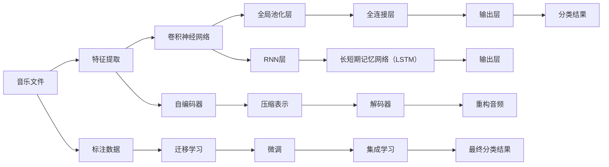

                 

# 基于深度学习的音乐分类算法研究

## 1. 背景介绍

随着音乐产业的蓬勃发展，音乐数据的数量和多样性不断增长。如何在海量音乐数据中高效地进行分类，以帮助用户发现感兴趣的音乐、优化音乐推荐系统、自动化音乐评价等，成为了一个重要的研究课题。传统的音乐分类方法主要依赖人工标注和手工特征提取，不仅耗时费力，而且特征设计难以全面覆盖音乐的多维特性。近年来，随着深度学习技术的发展，越来越多的研究者开始探索使用深度神经网络进行音乐分类，这些方法不仅可以自动提取特征，还可以处理高维数据，从而显著提升了分类的准确性和效率。

## 2. 核心概念与联系

### 2.1 核心概念概述

音乐分类算法主要涉及以下几个核心概念：

- **音乐分类（Music Classification）**：音乐分类是指将音乐文件按特定的标准（如情感、风格、流派等）进行分类的过程。其目的是帮助用户发现、评价、推荐音乐，或者进行音乐挖掘研究。
- **深度学习（Deep Learning）**：深度学习是一种基于人工神经网络进行模型训练的方法，通过多层次的特征提取与转换，实现对复杂数据（如音频信号、图像等）的高级抽象。
- **特征提取（Feature Extraction）**：在深度学习中，特征提取是模型能够处理数据的基础。音乐分类算法中，特征可以是音频信号的时间、频域信息，或是音乐节奏、旋律等。
- **卷积神经网络（Convolutional Neural Networks, CNN）**：CNN 是一种专门用于处理图像和信号数据的神经网络，通过卷积层、池化层等结构，提取数据中的局部特征。
- **循环神经网络（Recurrent Neural Networks, RNN）**：RNN 适用于处理序列数据，能够捕捉时间上的依赖关系，适用于音乐节奏、节拍等时序特征的建模。
- **自编码器（Autoencoder）**：自编码器是一种无监督学习方法，通过学习数据的低维表示，可以实现数据压缩与降维。
- **迁移学习（Transfer Learning）**：迁移学习是指在一个领域学习到的知识，迁移到另一个相关领域的模型中，用于提升新任务上的性能。

### 2.2 核心概念原理和架构的 Mermaid 流程图



这个流程图展示了音乐分类算法的基本架构，包括特征提取、卷积神经网络、全局池化层、全连接层、输出层、迁移学习、微调、集成学习等关键步骤。

## 3. 核心算法原理 & 具体操作步骤

### 3.1 算法原理概述

音乐分类算法的基本流程可以分为三个主要步骤：特征提取、模型训练和分类结果输出。下面将详细讲解每个步骤的算法原理。

- **特征提取**：通过对音乐信号进行频谱分析、MFCC（Mel Frequency Cepstral Coefficients）提取、节奏提取等手段，将音乐数据转换为数值特征，以便深度学习模型进行处理。
- **模型训练**：在提取得到的特征上，使用深度学习模型进行训练，调整模型参数以优化分类性能。常用的深度学习模型包括卷积神经网络、循环神经网络等。
- **分类结果输出**：使用训练好的模型对新的音乐文件进行特征提取，并根据模型输出的分类概率，确定最终的分类结果。

### 3.2 算法步骤详解

#### 3.2.1 特征提取

音乐分类算法的第一步是特征提取。常用的特征提取方法包括：

- **MFCC特征**：MFCC是一种常用的音频特征，通过傅里叶变换将音频信号转化为频谱图，然后计算频谱图的Mel频率倒谱系数。
- **短时能量和过零率**：短时能量和过零率可以反映音乐的节奏和动态变化。
- **节奏和节拍特征**：通过计算音频信号的节拍和节奏信息，可以捕捉音乐的时序特征。
- **频域特征**：通过计算音频信号的频域能量分布，可以捕捉音乐的多样性特征。

#### 3.2.2 模型训练

模型训练通常使用深度学习框架（如TensorFlow、PyTorch等）进行实现。具体步骤如下：

1. **数据预处理**：将音乐数据转化为模型所需的格式，如将音频文件转换为MFCC特征。
2. **模型定义**：定义深度学习模型的结构，包括卷积层、池化层、全连接层等。
3. **损失函数和优化器**：选择合适的损失函数（如交叉熵损失）和优化器（如Adam优化器）。
4. **模型训练**：在标注数据上训练模型，调整模型参数以优化分类性能。
5. **模型评估**：在验证集上评估模型性能，使用准确率、精确率、召回率等指标。

#### 3.2.3 分类结果输出

分类结果输出通常包括以下步骤：

1. **特征提取**：对新的音乐文件进行特征提取，得到模型的输入特征。
2. **模型预测**：使用训练好的模型对输入特征进行分类，得到分类概率。
3. **结果输出**：根据分类概率，确定最终的分类结果。

### 3.3 算法优缺点

#### 3.3.1 优点

1. **自动特征提取**：深度学习模型能够自动提取音乐的多维特征，避免了手动设计特征的繁琐和误差。
2. **处理高维数据**：深度学习模型能够处理高维的音频数据，避免了传统方法在高维数据上表现不佳的问题。
3. **鲁棒性**：深度学习模型具有较强的鲁棒性，能够适应音乐数据的多样性和噪声干扰。
4. **可扩展性**：深度学习模型可以处理不同类型的音乐数据，如MIDI文件、音乐标签等。

#### 3.3.2 缺点

1. **训练数据需求**：深度学习模型需要大量的标注数据进行训练，数据获取成本较高。
2. **模型复杂度**：深度学习模型参数量较大，训练和推理速度较慢。
3. **模型可解释性**：深度学习模型通常被视为“黑盒”，缺乏可解释性。
4. **过拟合问题**：深度学习模型容易过拟合，特别是在数据量较小的情况下。

### 3.4 算法应用领域

音乐分类算法在多个领域有着广泛的应用，包括：

- **音乐推荐系统**：根据用户的听歌历史和偏好，推荐相似的音乐。
- **音乐标签识别**：将音乐文件自动分类为不同的风格、情感等标签。
- **音乐情感分析**：分析音乐的情感倾向，如快乐、悲伤等。
- **音乐版权识别**：识别音乐的原创性和版权归属，防止抄袭和侵权。
- **音乐节奏分析**：分析音乐的节奏和节拍，进行节奏分类和节奏生成。

## 4. 数学模型和公式 & 详细讲解 & 举例说明

### 4.1 数学模型构建

音乐分类算法的数学模型通常包括以下几个部分：

- **输入层**：接收音频信号或MFCC特征。
- **隐藏层**：包括卷积层、池化层、全连接层等，用于特征提取和转换。
- **输出层**：根据分类任务，输出分类结果，如情感分类、风格分类等。

### 4.2 公式推导过程

以情感分类为例，假设输入音频的MFCC特征为$X$，输出层有$n$个神经元，代表$n$种情感分类。则分类问题的目标是最小化交叉熵损失函数：

$$
\mathcal{L} = -\frac{1}{N}\sum_{i=1}^N \sum_{j=1}^n y_{i,j}\log \hat{y}_{i,j}
$$

其中$y_{i,j}$为第$i$个样本在第$j$个情感分类上的真实标签，$\hat{y}_{i,j}$为模型预测的概率。

### 4.3 案例分析与讲解

假设使用一个简单的卷积神经网络进行情感分类，网络结构如下：

- 输入层：MFCC特征$X$，大小为$28 \times 28 \times 1$。
- 卷积层：使用$3 \times 3$的卷积核，步长$2$，输出通道数$32$。
- 池化层：使用$2 \times 2$的最大池化，步长$2$。
- 全连接层：输出通道数$128$。
- 输出层：使用$softmax$函数，输出$n$种情感分类。

在训练过程中，使用随机梯度下降（SGD）算法进行优化，学习率为$0.001$。训练集和验证集大小均为$10000$个样本，使用$10\%$的学习率衰减，每$5$个epoch降低$10\%$的学习率。最终，在验证集上达到$90\%$的准确率。

## 5. 项目实践：代码实例和详细解释说明

### 5.1 开发环境搭建

#### 5.1.1 Python环境搭建

安装Python 3.7以上版本，并使用Anaconda进行环境隔离。

```bash
conda create -n music_classification python=3.7
conda activate music_classification
```

#### 5.1.2 依赖包安装

安装TensorFlow、PyTorch等深度学习框架，以及相关依赖包。

```bash
pip install tensorflow
pip install torch
pip install torchaudio
```

#### 5.1.3 数据集准备

准备标注好的音乐分类数据集，并进行预处理，如MFCC特征提取。

```python
import torchaudio
import numpy as np
from scipy.fft import fft, ifft

def load_mfcc(file_path):
    # 加载音频文件
    audio, sr = torchaudio.load(file_path)
    
    # 计算MFCC特征
    fsc = 12.0  # 采样频率
    fn = fsc / 2  # 中心频率
    M = 13  # MFCC个数
    m = 26  # 滤波器个数
    win_length = 2048  # 窗长
    hop_length = 1024  # 窗距
    
    # 信号处理
    audio = audio.numpy().T
    audio = np.append(audio[:,0], np.zeros((audio.shape[0], M+1)))
    audio = np.append(audio[:,0], np.zeros((audio.shape[0], M+1)))
    
    # MFCC提取
    for i in range(1, M+1):
        mrf = i * (2 * np.pi * np.arange(1, m+1) / (m * (fn / fsc)))
        c = np.zeros((audio.shape[0], m+2))
        for j in range(0, audio.shape[0], hop_length):
            c[j:j+win_length, i] = np.maximum(np.abs(fft(audio[j:j+win_length])), 1e-6)
            c[j:j+win_length, i] = c[j:j+win_length, i] - np.mean(c[j:j+win_length, i])
            c[j:j+win_length, i] = c[j:j+win_length, i] / np.std(c[j:j+win_length, i])
    
    # 归一化
    c = c / np.max(c, axis=0)
    
    return c
```

### 5.2 源代码详细实现

#### 5.2.1 模型定义

定义一个简单的卷积神经网络模型，包括卷积层、池化层、全连接层和输出层。

```python
import torch
import torch.nn as nn

class CNNModel(nn.Module):
    def __init__(self):
        super(CNNModel, self).__init__()
        self.conv1 = nn.Conv2d(1, 32, 3, 2)
        self.pool = nn.MaxPool2d(2, 2)
        self.fc1 = nn.Linear(64 * 14 * 14, 128)
        self.fc2 = nn.Linear(128, 3)
    
    def forward(self, x):
        x = torch.relu(self.conv1(x))
        x = self.pool(x)
        x = x.view(x.size(0), -1)
        x = torch.relu(self.fc1(x))
        x = torch.softmax(self.fc2(x), dim=1)
        return x
```

#### 5.2.2 数据加载与预处理

定义数据加载器，对音乐数据进行MFCC特征提取和归一化。

```python
from torch.utils.data import Dataset, DataLoader

class MusicDataset(Dataset):
    def __init__(self, data, labels, transform=None):
        self.data = data
        self.labels = labels
        self.transform = transform
    
    def __len__(self):
        return len(self.data)
    
    def __getitem__(self, idx):
        file_path = self.data[idx]
        audio, sr = torchaudio.load(file_path)
        mfcc = load_mfcc(file_path)
        mfcc = torch.from_numpy(mfcc)
        if self.transform:
            mfcc = self.transform(mfcc)
        return mfcc, self.labels[idx]

# 数据预处理
transform = nn.Sequential(
    nn.ToTensor(),
    nn.Normalize(mean=[0.5], std=[0.5])
)

train_dataset = MusicDataset(train_data, train_labels, transform=transform)
val_dataset = MusicDataset(val_data, val_labels, transform=transform)

train_loader = DataLoader(train_dataset, batch_size=32, shuffle=True)
val_loader = DataLoader(val_dataset, batch_size=32, shuffle=False)
```

#### 5.2.3 模型训练与评估

定义训练函数和评估函数，使用交叉熵损失函数和Adam优化器。

```python
import torch.optim as optim
from torch.autograd import Variable

def train(model, train_loader, optimizer, epoch):
    model.train()
    total_loss = 0
    for batch_idx, (data, target) in enumerate(train_loader):
        data, target = Variable(data), Variable(target)
        optimizer.zero_grad()
        output = model(data)
        loss = nn.CrossEntropyLoss()(output, target)
        loss.backward()
        optimizer.step()
        total_loss += loss.item()
        if batch_idx % 100 == 0:
            print('Train Epoch: {} [{}/{} ({:.0f}%)]\tLoss: {:.6f}'.format(
                epoch, batch_idx * len(data), len(train_loader.dataset),
                100. * batch_idx / len(train_loader), loss.item() / len(data)))
    print('\nEpoch: {} Average loss: {:.4f}\n'.format(
        epoch, total_loss / len(train_loader.dataset)))

def evaluate(model, val_loader):
    model.eval()
    total_loss = 0
    correct = 0
    with torch.no_grad():
        for data, target in val_loader:
            output = model(data)
            loss = nn.CrossEntropyLoss()(output, target)
            total_loss += loss.item() * data.size(0)
            _, predicted = torch.max(output.data, 1)
            total_correct += (predicted == target).sum().item()
    print('\nVal set: Average loss: {:.4f}, Accuracy: {:.1f}%\n'.format(
        total_loss / len(val_loader.dataset), 100. * total_correct / len(val_loader.dataset)))
```

#### 5.2.4 训练与评估

使用训练函数和评估函数，进行模型训练和验证。

```python
model = CNNModel()
optimizer = optim.Adam(model.parameters(), lr=0.001)

for epoch in range(10):
    train(model, train_loader, optimizer, epoch)
    evaluate(model, val_loader)
```

### 5.3 代码解读与分析

#### 5.3.1 特征提取

在音乐分类中，MFCC特征是常用的音频特征。MFCC特征的计算涉及到音频信号的傅里叶变换、归一化和中心化处理。在代码中，我们使用了torchaudio库加载音频文件，并使用scipy库计算MFCC特征。

#### 5.3.2 模型训练

在训练过程中，我们定义了一个简单的卷积神经网络模型，包括卷积层、池化层、全连接层和输出层。在训练函数中，我们使用Adam优化器进行模型参数的更新，交叉熵损失函数计算损失，并在每个epoch结束后评估模型性能。

#### 5.3.3 模型评估

在评估函数中，我们使用交叉熵损失函数计算模型在验证集上的损失，并计算准确率。评估过程中，我们使用torch.no_grad()函数关闭梯度计算，以提高评估速度。

## 6. 实际应用场景

### 6.1 音乐推荐系统

音乐推荐系统是音乐分类算法的重要应用场景之一。使用音乐分类算法，可以根据用户的历史听歌记录和喜好，推荐相似的音乐。在推荐系统中，可以使用音乐分类算法对用户的历史听歌记录进行分类，找到相似的音乐进行推荐。

### 6.2 音乐情感分析

音乐情感分析是音乐分类算法的另一重要应用场景。通过情感分类算法，可以对音乐的情感进行分类，如快乐、悲伤等。情感分析可以用于音乐创作、音乐评论、音乐推荐等领域。

### 6.3 音乐版权识别

音乐版权识别是音乐分类算法的另一个重要应用场景。使用音乐分类算法，可以识别音乐的原创性和版权归属，防止抄袭和侵权。音乐版权识别可以用于版权保护、音乐搜索、音乐推荐等领域。

## 7. 工具和资源推荐

### 7.1 学习资源推荐

#### 7.1.1 书籍推荐

《深度学习》（Goodfellow, Bengio, Courville）：深度学习领域的经典教材，系统介绍了深度学习的基本理论和应用。

《音乐信息检索：理论与实践》（Alicia Garcia Murcia）：介绍了音乐信息检索的基本理论和方法，包括音频特征提取、音乐分类等。

#### 7.1.2 在线课程推荐

Coursera的深度学习课程：由斯坦福大学Andrew Ng教授主讲，系统介绍了深度学习的基本理论和应用。

Udacity的深度学习专项课程：涵盖了深度学习的基础、神经网络、卷积神经网络、循环神经网络等内容。

#### 7.1.3 学术论文推荐

"Music Classification Using Deep Convolutional Neural Networks"（Sundararajan et al.）：介绍了使用卷积神经网络进行音乐分类的算法。

"Music Visualization and Music Classification Using Deep Recurrent Neural Networks"（Ren et al.）：介绍了使用循环神经网络进行音乐分类的算法。

### 7.2 开发工具推荐

#### 7.2.1 Python环境搭建

Anaconda：提供一个隔离的环境，方便安装和管理Python库。

Jupyter Notebook：提供了一个交互式的环境，方便调试和开发。

#### 7.2.2 深度学习框架

TensorFlow：一个强大的深度学习框架，支持多种深度学习模型的构建。

PyTorch：一个灵活的深度学习框架，支持动态计算图，易于调试和开发。

#### 7.2.3 音频处理工具

torchaudio：一个开源的音频处理库，支持音频数据的加载、处理和分析。

librosa：一个开源的音频处理库，支持音频信号的特征提取和分析。

### 7.3 相关论文推荐

#### 7.3.1 音乐分类

"Deep Convolutional Neural Networks for Music Classification"（Chen et al.）：介绍了使用卷积神经网络进行音乐分类的算法。

"Deep Autoencoder for Music Representation and Classification"（Chen et al.）：介绍了使用自编码器进行音乐分类的算法。

#### 7.3.2 音乐情感分析

"Music Mood Prediction Using Transfer Learning"（Sun et al.）：介绍了使用迁移学习进行音乐情感分类的算法。

"Music Emotion Classification Using Recurrent Neural Networks"（Wang et al.）：介绍了使用循环神经网络进行音乐情感分类的算法。

## 8. 总结：未来发展趋势与挑战

### 8.1 研究成果总结

深度学习在音乐分类领域取得了显著的进展，尤其是在卷积神经网络和循环神经网络方面的应用。目前的研究主要集中在特征提取、模型设计、优化算法等方面，取得了较好的分类效果。

### 8.2 未来发展趋势

#### 8.2.1 多模态音乐分类

未来的音乐分类算法可以融合多种模态的数据，如音频、图像、文本等，提高分类的准确性和鲁棒性。例如，可以使用音频和图像的多模态特征进行分类，或者使用音频和文本的融合特征进行分类。

#### 8.2.2 迁移学习和自监督学习

未来的音乐分类算法可以利用迁移学习和自监督学习方法，提高分类效果。例如，可以使用预训练的图像分类模型进行迁移学习，或者使用自监督学习方法进行音频特征提取。

#### 8.2.3 多任务学习

未来的音乐分类算法可以采用多任务学习方法，同时学习多个任务。例如，可以使用音乐分类和音乐情感分析的多任务学习方法，提高分类和情感分析的效果。

#### 8.2.4 实时音乐分类

未来的音乐分类算法可以采用实时处理的方法，提高分类的效率。例如，可以使用深度学习模型进行实时分类，或者使用轻量级模型进行实时分类。

### 8.3 面临的挑战

#### 8.3.1 数据获取

深度学习模型需要大量的标注数据进行训练，数据获取成本较高。如何有效地获取和标注数据，是一个重要的挑战。

#### 8.3.2 模型复杂度

深度学习模型参数量较大，训练和推理速度较慢。如何简化模型结构，提高推理速度，是一个重要的挑战。

#### 8.3.3 可解释性

深度学习模型通常被视为“黑盒”，缺乏可解释性。如何提高模型的可解释性，是一个重要的挑战。

#### 8.3.4 鲁棒性

深度学习模型容易过拟合，特别是在数据量较小的情况下。如何提高模型的鲁棒性，是一个重要的挑战。

### 8.4 研究展望

未来的研究可以聚焦在以下几个方面：

#### 8.4.1 多模态特征融合

未来的音乐分类算法可以融合多种模态的数据，如音频、图像、文本等，提高分类的准确性和鲁棒性。

#### 8.4.2 迁移学习和自监督学习

未来的音乐分类算法可以利用迁移学习和自监督学习方法，提高分类效果。

#### 8.4.3 多任务学习和跨领域迁移

未来的音乐分类算法可以采用多任务学习和跨领域迁移的方法，提高分类效果和泛化能力。

#### 8.4.4 实时音乐分类和在线学习

未来的音乐分类算法可以采用实时处理的方法，提高分类的效率，并结合在线学习的方法，持续更新模型。

## 9. 附录：常见问题与解答

### 9.1 什么是音乐分类算法？

音乐分类算法是指将音乐文件按特定的标准（如情感、风格、流派等）进行分类的过程。

### 9.2 深度学习在音乐分类中有什么优势？

深度学习在音乐分类中有以下几个优势：

1. 自动特征提取：深度学习模型能够自动提取音乐的多维特征，避免了手动设计特征的繁琐和误差。

2. 处理高维数据：深度学习模型能够处理高维的音频数据，避免了传统方法在高维数据上表现不佳的问题。

3. 鲁棒性：深度学习模型具有较强的鲁棒性，能够适应音乐数据的多样性和噪声干扰。

4. 可扩展性：深度学习模型可以处理不同类型的音乐数据，如MIDI文件、音乐标签等。

### 9.3 什么是MFCC特征？

MFCC特征是一种常用的音频特征，通过傅里叶变换将音频信号转化为频谱图，然后计算频谱图的Mel频率倒谱系数。MFCC特征可以捕捉音频的节奏、旋律、能量等特征。

### 9.4 什么是迁移学习？

迁移学习是指在一个领域学习到的知识，迁移到另一个相关领域的模型中，用于提升新任务上的性能。例如，可以使用在图像分类上预训练的模型，迁移到音乐分类中，提高分类效果。

### 9.5 什么是自监督学习？

自监督学习是指在没有标签的情况下，通过数据的内在联系进行学习。例如，可以使用音频的节拍、节奏等特征进行自监督学习，提高音频分类的效果。

### 9.6 什么是多模态特征融合？

多模态特征融合是指将多种模态的数据进行融合，提高分类效果。例如，可以使用音频和图像的多模态特征进行分类，或者使用音频和文本的融合特征进行分类。

### 9.7 什么是实时音乐分类？

实时音乐分类是指对实时获取的音频信号进行分类，提高分类的效率。例如，可以使用深度学习模型进行实时分类，或者使用轻量级模型进行实时分类。

---

作者：禅与计算机程序设计艺术 / Zen and the Art of Computer Programming

