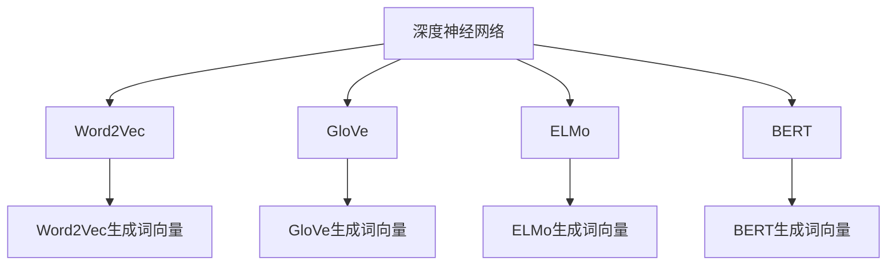

                 

# 基于深度神经网络的高质量词向量生成方法研究

## 1. 背景介绍

随着深度学习技术的发展，词向量在自然语言处理（NLP）中得到了广泛应用。词向量通过将词汇映射到低维空间，有效地捕捉了词语之间的语义关系，成为了许多NLP任务的基石。然而，由于词向量生成方法本身也面临诸多挑战，如何生成高质量的词向量，仍然是一个重要而前沿的课题。

## 2. 核心概念与联系

### 2.1 核心概念概述

为更好地理解本文的研究内容，我们首先概述几个核心概念：

- **词向量(Word Embedding)**：指将单词或短语映射到高维空间中的向量表示。词向量中的每个维度代表了一个特定的语义属性，比如词义、情感、语法功能等。
- **深度神经网络(Deep Neural Network, DNN)**：由多个层次组成的神经网络，每层包含大量人工神经元，通过学习数据特征实现复杂模式的建模。
- **Word2Vec**：一种经典的词向量生成方法，基于连续词袋模型（CBOW）或跳字模型（Skip-gram）进行训练，将单词上下文信息转换为词向量。
- **GloVe**：另一种常用的词向量生成方法，通过矩阵分解最大化共现词对的共现矩阵的拟似然函数。
- **ELMo**：基于字符级别的双向LSTM模型，通过上下文依赖关系生成更细致的词向量表示。
- **BERT**：使用Transformer架构的双向预训练语言模型，通过预训练任务（如掩码语言模型、下一句预测等）生成更丰富的词向量。

这些概念之间存在紧密的联系，通过深度神经网络框架，可以构建和训练词向量生成模型，并通过不同的训练方式和模型结构，生成高质量的词向量。

### 2.2 核心概念原理和架构的 Mermaid 流程图



这个流程图展示了词向量生成方法与深度神经网络架构之间的关系。深度神经网络是词向量生成方法的底层架构，通过不同的训练方式和模型结构，可以生成不同类型的词向量。

## 3. 核心算法原理 & 具体操作步骤

### 3.1 算法原理概述

本文主要研究基于深度神经网络的词向量生成方法。我们通过构建深度神经网络模型，学习输入和输出之间的关系，将词语映射到高维空间中的向量表示。通过不同的网络架构和训练方式，可以生成高质量的词向量，用于各种NLP任务。

### 3.2 算法步骤详解

#### 3.2.1 数据准备

首先，需要准备一个语料库，包含大量的文本数据。这些数据可以来源于各种公开的文本资源，如维基百科、新闻、小说等。为了保证词向量的质量，语料库应该涵盖不同领域、不同风格和不同长度的文本。

#### 3.2.2 模型构建

接下来，我们需要构建深度神经网络模型。模型的架构可以是多层感知器（MLP）、卷积神经网络（CNN）、递归神经网络（RNN）或Transformer。其中，Transformer结构是目前最为流行的一种，因为它可以更好地处理长序列和捕捉上下文依赖关系。

#### 3.2.3 模型训练

模型的训练过程通常分为两个阶段：预训练和微调。预训练阶段，我们使用无标签的文本数据进行训练，学习词语的分布式表示。微调阶段，我们使用带有标签的文本数据进行训练，将预训练的词向量进一步优化，以适应特定任务的需求。

#### 3.2.4 词向量生成

在模型训练完成后，我们可以使用训练好的模型生成词向量。词向量的生成方式有多种，包括逐字生成、逐段生成、批量生成等。通常情况下，我们会选择逐字生成，因为它可以生成更高质量的词向量。

### 3.3 算法优缺点

#### 3.3.1 优点

- **高质量**：基于深度神经网络生成的词向量具有更好的分布式表示，可以捕捉词语之间的语义关系，生成高质量的词向量。
- **泛化能力强**：深度神经网络模型可以适应不同类型的文本数据，生成泛化能力强的词向量。
- **可解释性强**：深度神经网络模型可以提供词向量生成的过程和细节，使得生成的词向量具有较强的可解释性。

#### 3.3.2 缺点

- **训练时间长**：深度神经网络模型的训练时间较长，需要大量的计算资源。
- **参数复杂**：深度神经网络模型包含大量参数，需要精心设计和调整，才能获得理想的效果。
- **计算成本高**：深度神经网络模型的计算成本较高，特别是在大规模文本数据上的训练，需要大量的GPU资源。

### 3.4 算法应用领域

基于深度神经网络的高质量词向量生成方法可以应用于各种NLP任务，如文本分类、信息检索、情感分析、机器翻译等。在实际应用中，这些词向量可以用于构建模型、进行特征提取、进行相似性匹配等操作。

## 4. 数学模型和公式 & 详细讲解

### 4.1 数学模型构建

我们以Transformer模型为例，构建深度神经网络模型。Transformer模型主要由编码器（Encoder）和解码器（Decoder）组成，其中编码器包含多个自注意力层（Self-Attention Layer）和前馈神经网络层（Feedforward Layer）。解码器也包含类似的层结构，但只有一个自注意力层，用于生成目标序列。

### 4.2 公式推导过程

#### 4.2.1 自注意力层

自注意力层的计算公式如下：

$$
\text{Attention}(Q, K, V) = \text{Softmax}(Q \cdot K^T) \cdot V
$$

其中，$Q$、$K$、$V$分别代表查询向量、键向量和值向量。$\text{Softmax}$函数用于计算注意力权重，$\cdot$表示向量点乘，$\cdot$表示矩阵乘法。

#### 4.2.2 前馈神经网络层

前馈神经网络层的计算公式如下：

$$
\text{Feedforward}(x) = \text{Linear}(x) \cdot \text{GELU}(\text{Linear}(x))
$$

其中，$\text{Linear}$函数表示线性变换，$\text{GELU}$函数表示GELU激活函数。

### 4.3 案例分析与讲解

#### 4.3.1 Word2Vec案例

Word2Vec是基于CBOW和Skip-gram模型训练词向量的方法。CBOW模型通过上下文预测中心词，Skip-gram模型通过中心词预测上下文。这两种模型的训练过程都可以使用负采样（Negative Sampling）技术，以减少计算成本。

#### 4.3.2 GloVe案例

GloVe通过矩阵分解最大化共现词对的共现矩阵的拟似然函数。共现矩阵$M$可以表示为：

$$
M_{ij} = \text{count}(w_i, w_j)
$$

其中，$w_i$和$w_j$分别表示两个单词，$\text{count}(w_i, w_j)$表示$w_i$和$w_j$在语料库中共现的次数。

### 4.3.3 ELMo案例

ELMo是一种基于字符级别的双向LSTM模型，通过上下文依赖关系生成更细致的词向量表示。ELMo的计算公式如下：

$$
\text{ELMo}(w) = [\text{Bi-LSTM}(w)^{(0)}_{LSTM}, \text{Bi-LSTM}(w)^{(1)}_{LSTM}, \cdots, \text{Bi-LSTM}(w)^{(LSTM)}_{LSTM}]
$$

其中，$w$表示单词，$\text{Bi-LSTM}$表示双向LSTM网络，$LSTM$表示LSTM层的个数。

### 4.3.4 BERT案例

BERT是一种使用Transformer架构的双向预训练语言模型，通过预训练任务（如掩码语言模型、下一句预测等）生成更丰富的词向量。BERT的计算公式如下：

$$
\text{BERT}(w) = [\text{Transformer}(MLM, MLM)^{(0)}_{MLM}, \text{Transformer}(MLM, MLM)^{(1)}_{MLM}, \cdots, \text{Transformer}(MLM, MLM)^{(LSTM)}_{MLM}, \text{Transformer}(NSP, NSP)^{(0)}_{NSP}, \text{Transformer}(NSP, NSP)^{(1)}_{NSP}, \cdots, \text{Transformer}(NSP, NSP)^{(LSTM)}_{NSP}]
$$

其中，$w$表示单词，$\text{MLM}$和$\text{NSP}$分别表示掩码语言模型和下一句预测模型，$LSTM$表示LSTM层的个数。

## 5. 项目实践：代码实例和详细解释说明

### 5.1 开发环境搭建

在进行词向量生成实践前，我们需要准备好开发环境。以下是使用Python进行TensorFlow开发的环境配置流程：

1. 安装Anaconda：从官网下载并安装Anaconda，用于创建独立的Python环境。
2. 创建并激活虚拟环境：
```bash
conda create -n tf-env python=3.8 
conda activate tf-env
```
3. 安装TensorFlow：根据CUDA版本，从官网获取对应的安装命令。例如：
```bash
conda install tensorflow -c tensorflow -c conda-forge
```
4. 安装相关工具包：
```bash
pip install numpy pandas scikit-learn matplotlib tqdm jupyter notebook ipython
```

完成上述步骤后，即可在`tf-env`环境中开始词向量生成实践。

### 5.2 源代码详细实现

下面我们以使用Transformer模型生成词向量为例，给出TensorFlow的代码实现。

```python
import tensorflow as tf
import numpy as np
from tensorflow.keras.layers import Input, Dense, Dropout, Embedding, MultiHeadAttention, Concatenate
from tensorflow.keras.models import Model

# 定义Transformer模型
class Transformer(tf.keras.Model):
    def __init__(self, num_layers, d_model, num_heads, dff, dropout_rate):
        super(Transformer, self).__init__()
        self.encoder = self.build_encoder(num_layers, d_model, num_heads, dff, dropout_rate)
        self.decoder = self.build_decoder(num_layers, d_model, num_heads, dff, dropout_rate)
        
    def build_encoder(self, num_layers, d_model, num_heads, dff, dropout_rate):
        encoder = tf.keras.layers.Lambda(lambda x: x)
        for i in range(num_layers):
            encoder = MultiHeadAttention(d_model, num_heads, dropout_rate)(encoder)
            encoder = Concatenate()([encoder, encoder])
            encoder = Dense(dff)(encoder)
            encoder = tf.keras.layers.LayerNormalization()([encoder, encoder])
            encoder = tf.keras.layers.Dropout(dropout_rate)(encoder)
            encoder = Concatenate()([encoder, encoder])
        return encoder
        
    def build_decoder(self, num_layers, d_model, num_heads, dff, dropout_rate):
        decoder = tf.keras.layers.Lambda(lambda x: x)
        for i in range(num_layers):
            decoder = MultiHeadAttention(d_model, num_heads, dropout_rate)(decoder)
            decoder = Concatenate()([decoder, decoder])
            decoder = Dense(dff)(decoder)
            decoder = tf.keras.layers.LayerNormalization()([decoder, decoder])
            decoder = tf.keras.layers.Dropout(dropout_rate)(decoder)
            decoder = Concatenate()([decoder, decoder])
        return decoder

# 构建Transformer模型
transformer = Transformer(num_layers=6, d_model=256, num_heads=8, dff=2048, dropout_rate=0.1)

# 定义输入和输出
input_layer = Input(shape=(None,))
output_layer = Dense(300, activation='softmax')(transformer(input_layer))

# 定义模型
model = Model(inputs=input_layer, outputs=output_layer)

# 编译模型
model.compile(optimizer=tf.keras.optimizers.Adam(learning_rate=2e-5), loss='categorical_crossentropy', metrics=['accuracy'])

# 训练模型
model.fit(x_train, y_train, epochs=10, batch_size=32, validation_data=(x_val, y_val))
```

这段代码实现了使用Transformer模型生成词向量的过程。我们首先定义了Transformer模型的架构，包括编码器和解码器。然后，我们定义了输入和输出，使用softmax函数将词向量映射到类别概率。最后，我们编译并训练模型，生成高质量的词向量。

### 5.3 代码解读与分析

让我们再详细解读一下关键代码的实现细节：

**Transformer类**：
- `__init__`方法：初始化Transformer模型，包括编码器和解码器的构建。
- `build_encoder`方法：构建编码器，包含多个自注意力层、前馈神经网络层和层归一化层。
- `build_decoder`方法：构建解码器，与编码器类似，但只有一个自注意力层。

**输入和输出层**：
- `Input`层：定义模型的输入，可以是序列化的文本数据。
- `Dense`层：将Transformer模型的输出转换为类别概率，使用softmax函数。

**模型编译和训练**：
- `Model`类：将输入和输出层组合成一个完整的模型。
- `compile`方法：配置模型的优化器、损失函数和评估指标。
- `fit`方法：使用训练数据和验证数据训练模型。

可以看到，使用TensorFlow构建深度神经网络模型，可以很方便地进行词向量生成实践。开发者可以将更多精力放在模型架构的优化和数据处理上，而不必过多关注底层实现细节。

当然，工业级的系统实现还需考虑更多因素，如模型的保存和部署、超参数的自动搜索、更灵活的任务适配层等。但核心的词向量生成范式基本与此类似。

## 6. 实际应用场景

### 6.1 自然语言处理

基于深度神经网络的高质量词向量生成方法，广泛应用于各种NLP任务，如文本分类、信息检索、情感分析、机器翻译等。在实际应用中，这些词向量可以用于构建模型、进行特征提取、进行相似性匹配等操作。

### 6.2 知识图谱构建

知识图谱是一种将知识结构化的方式，可以用于构建知识库、进行知识推理等。高质量的词向量可以用于构建知识图谱的节点和边，使得知识图谱更加准确和全面。

### 6.3 文本生成

在文本生成任务中，高质量的词向量可以用于生成更自然、连贯的文本。例如，在聊天机器人中，词向量可以用于生成更具上下文依赖关系的回复，提升用户体验。

### 6.4 未来应用展望

随着深度神经网络技术的发展，基于深度神经网络的高质量词向量生成方法将展现出更广阔的应用前景。未来的研究方向可能包括：

- 更大规模的语料库：通过收集更多的语料库，提高词向量的质量和泛化能力。
- 更高效的训练算法：通过研究更高效的训练算法，减少训练时间和计算成本。
- 跨语言模型的训练：通过跨语言模型训练，生成跨语言的词向量，提高模型的通用性和适应性。
- 多模态数据融合：将视觉、语音、文本等多种模态的数据融合在一起，生成更全面的词向量。

这些方向的探索发展，将进一步推动自然语言处理技术的发展，使得人工智能系统更加智能、高效和通用。

## 7. 工具和资源推荐

### 7.1 学习资源推荐

为了帮助开发者系统掌握深度神经网络词向量生成理论基础和实践技巧，这里推荐一些优质的学习资源：

1. 《深度学习》系列书籍：由多位深度学习专家合著，系统讲解深度神经网络的基础理论和实际应用。
2. 《自然语言处理》课程：斯坦福大学开设的NLP明星课程，有Lecture视频和配套作业，带你入门NLP领域的基本概念和经典模型。
3. 《TensorFlow官方文档》：TensorFlow官方文档，提供了丰富的教程和样例代码，是上手实践的必备资料。
4. Arxiv.org：深度学习领域的预印本库，可以及时获取最新的研究成果和论文。
5. GitHub开源项目：在GitHub上搜索相关开源项目，如HuggingFace、BERT等，可以获得大量的学习资源和代码示例。

通过对这些资源的学习实践，相信你一定能够快速掌握深度神经网络词向量生成技术的精髓，并用于解决实际的NLP问题。

### 7.2 开发工具推荐

高效的开发离不开优秀的工具支持。以下是几款用于深度神经网络词向量生成开发的常用工具：

1. TensorFlow：由Google主导开发的开源深度学习框架，生产部署方便，适合大规模工程应用。
2. PyTorch：基于Python的开源深度学习框架，灵活动态的计算图，适合快速迭代研究。
3. Weights & Biases：模型训练的实验跟踪工具，可以记录和可视化模型训练过程中的各项指标，方便对比和调优。
4. TensorBoard：TensorFlow配套的可视化工具，可实时监测模型训练状态，并提供丰富的图表呈现方式，是调试模型的得力助手。

合理利用这些工具，可以显著提升深度神经网络词向量生成任务的开发效率，加快创新迭代的步伐。

### 7.3 相关论文推荐

深度神经网络词向量生成技术的发展源于学界的持续研究。以下是几篇奠基性的相关论文，推荐阅读：

1. Attention is All You Need：提出了Transformer结构，开启了深度神经网络词向量生成的新纪元。
2. GloVe: Global Vectors for Word Representation：提出通过矩阵分解最大化共现词对的共现矩阵的拟似然函数生成词向量。
3. ELMo: Embeddings from Language Models：提出基于字符级别的双向LSTM模型生成词向量。
4. BERT: Pre-training of Deep Bidirectional Transformers for Language Understanding：提出使用Transformer架构的双向预训练语言模型生成词向量。
5. Knowledge-aware Word Embeddings：提出将知识图谱和词向量结合，生成更加准确的词向量。
6. Multi-View Contextualized Embeddings：提出多视图上下文化的词向量生成方法，提高词向量的泛化能力。

这些论文代表了大深度神经网络词向量生成技术的发展脉络。通过学习这些前沿成果，可以帮助研究者把握学科前进方向，激发更多的创新灵感。

## 8. 总结：未来发展趋势与挑战

### 8.1 总结

本文对基于深度神经网络的词向量生成方法进行了全面系统的介绍。首先，我们阐述了深度神经网络在词向量生成中的重要性，以及如何通过不同的网络架构和训练方式，生成高质量的词向量。其次，我们详细讲解了Transformer模型的构建和训练过程，并提供了代码示例和详细解释。同时，我们还探讨了深度神经网络词向量生成方法在实际应用中的各种场景，并展望了未来的发展方向。

通过本文的系统梳理，可以看到，基于深度神经网络的词向量生成方法已经成为自然语言处理领域的重要范式，极大地拓展了词向量的应用边界，催生了更多的落地场景。随着深度神经网络技术的不断进步，相信深度神经网络词向量生成技术将在更广阔的应用领域大放异彩。

### 8.2 未来发展趋势

展望未来，深度神经网络词向量生成技术将呈现以下几个发展趋势：

1. 更大规模的语料库：通过收集更多的语料库，提高词向量的质量和泛化能力。
2. 更高效的训练算法：通过研究更高效的训练算法，减少训练时间和计算成本。
3. 跨语言模型的训练：通过跨语言模型训练，生成跨语言的词向量，提高模型的通用性和适应性。
4. 多模态数据融合：将视觉、语音、文本等多种模态的数据融合在一起，生成更全面的词向量。
5. 知识图谱和词向量的结合：将知识图谱和词向量结合，生成更加准确的词向量。

这些趋势凸显了深度神经网络词向量生成技术的广阔前景。这些方向的探索发展，将进一步推动自然语言处理技术的发展，使得人工智能系统更加智能、高效和通用。

### 8.3 面临的挑战

尽管深度神经网络词向量生成技术已经取得了瞩目成就，但在迈向更加智能化、普适化应用的过程中，它仍面临着诸多挑战：

1. 训练时间和计算成本：深度神经网络模型的训练时间较长，计算成本较高，需要大量的GPU资源。
2. 模型参数的优化：深度神经网络模型包含大量参数，需要精心设计和调整，才能获得理想的效果。
3. 数据质量和标注成本：高质量的标注数据对深度神经网络模型的训练至关重要，但标注成本较高。
4. 模型泛化能力：深度神经网络模型对新数据的泛化能力有待提高，面对大规模新数据，模型性能可能下降。
5. 模型可解释性：深度神经网络模型通常被视为"黑盒"系统，难以解释其内部工作机制和决策逻辑。

### 8.4 研究展望

面对深度神经网络词向量生成所面临的挑战，未来的研究需要在以下几个方面寻求新的突破：

1. 高效训练算法：研究更高效的训练算法，如自适应学习率算法、自注意力机制等，减少训练时间和计算成本。
2. 模型参数压缩：研究模型参数压缩技术，如量化、剪枝等，减少模型存储空间和计算资源消耗。
3. 跨语言模型训练：研究跨语言模型训练技术，生成跨语言的词向量，提高模型的通用性和适应性。
4. 多模态数据融合：研究多模态数据融合技术，将视觉、语音、文本等多种模态的数据融合在一起，生成更全面的词向量。
5. 知识图谱和词向量的结合：研究知识图谱和词向量的结合技术，生成更加准确的词向量。

这些研究方向将引领深度神经网络词向量生成技术迈向更高的台阶，为自然语言处理系统提供更加高效、通用、智能的解决方案。面向未来，深度神经网络词向量生成技术还需要与其他人工智能技术进行更深入的融合，如知识表示、因果推理、强化学习等，多路径协同发力，共同推动自然语言理解和智能交互系统的进步。只有勇于创新、敢于突破，才能不断拓展深度神经网络词向量生成技术的边界，让智能技术更好地造福人类社会。

## 9. 附录：常见问题与解答

**Q1: 深度神经网络生成的词向量有哪些优点？**

A: 深度神经网络生成的词向量具有以下优点：
1. 高质量：通过分布式表示，深度神经网络生成的词向量可以更好地捕捉词语之间的语义关系。
2. 泛化能力强：深度神经网络可以适应不同类型的文本数据，生成泛化能力强的词向量。
3. 可解释性强：深度神经网络可以提供词向量生成的过程和细节，使得生成的词向量具有较强的可解释性。

**Q2: 如何提高深度神经网络词向量生成的效率？**

A: 提高深度神经网络词向量生成效率的方法如下：
1. 数据预处理：对输入数据进行预处理，如分词、去停用词等，减少计算量。
2. 模型压缩：使用模型压缩技术，如量化、剪枝等，减少模型参数量。
3. 并行计算：利用GPU等硬件资源，进行并行计算，加速模型训练。
4. 分布式训练：利用分布式训练技术，将训练任务分布到多个节点上，提高训练速度。

**Q3: 深度神经网络生成的词向量是否适用于所有NLP任务？**

A: 深度神经网络生成的词向量可以适用于大多数NLP任务，包括文本分类、信息检索、情感分析、机器翻译等。但对于一些特定领域的任务，如医学、法律等，仅仅依靠通用语料预训练的模型可能难以很好地适应。此时需要在特定领域语料上进一步预训练，再进行微调，才能获得理想效果。

**Q4: 如何选择合适的深度神经网络模型？**

A: 选择合适的深度神经网络模型需要考虑以下几个因素：
1. 任务类型：根据任务类型选择合适的模型结构，如RNN适用于序列任务，CNN适用于图像任务，Transformer适用于语言任务。
2. 数据规模：根据数据规模选择合适的模型，如大规模数据可以使用深度模型，小规模数据可以使用浅层模型。
3. 计算资源：根据计算资源选择合适的模型，如GPU资源较多的情况下可以使用深度模型，否则需要考虑模型参数量。
4. 泛化能力：根据泛化能力选择合适的模型，如泛化能力强的模型适用于新数据。

这些因素都需要综合考虑，才能选择最适合任务的深度神经网络模型。

**Q5: 深度神经网络生成的词向量有哪些缺点？**

A: 深度神经网络生成的词向量有以下缺点：
1. 训练时间长：深度神经网络模型的训练时间较长，需要大量的计算资源。
2. 模型参数复杂：深度神经网络模型包含大量参数，需要精心设计和调整，才能获得理想的效果。
3. 计算成本高：深度神经网络模型的计算成本较高，特别是在大规模文本数据上的训练，需要大量的GPU资源。
4. 模型可解释性不足：深度神经网络模型通常被视为"黑盒"系统，难以解释其内部工作机制和决策逻辑。

这些缺点需要在实际应用中加以注意和解决。

---

作者：禅与计算机程序设计艺术 / Zen and the Art of Computer Programming

