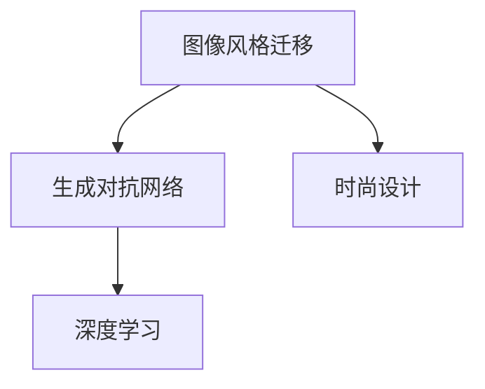

                 

# 基于生成对抗网络的图像风格迁移在时尚设计中的应用

> 关键词：生成对抗网络,图像风格迁移,时尚设计,图像处理,深度学习

## 1. 背景介绍

### 1.1 问题由来

随着数字技术的不断发展，图像处理和设计领域面临新的机遇与挑战。一方面，数字化图像的获取变得更加便捷，丰富了设计素材库；另一方面，图像处理技术，尤其是深度学习驱动的风格迁移和生成技术，正在改变传统设计流程，激发新的设计灵感。

时尚设计作为视觉艺术与技术创新的前沿领域，长期依赖于设计师的经验与创意。然而，随着图像生成技术的发展，设计师开始借助自动化工具，探索新的设计思路与形式。基于生成对抗网络（GAN）的图像风格迁移技术，即通过将一张图像的风格迁移到另一张图像上，为时尚设计注入了新的创意元素。

### 1.2 问题核心关键点

1. **图像风格迁移**：指将一张图像的样式转换为另一张图像的过程，是计算机视觉领域的前沿技术。
2. **时尚设计**：结合视觉艺术与时尚元素的创新过程，是图像风格迁移应用的典型领域。
3. **生成对抗网络(GAN)**：一种基于对抗训练的深度学习模型，能产生高质量的伪造图像，是图像风格迁移的核心技术。
4. **深度学习**：通过多层神经网络进行复杂图像处理的高级技术，是风格迁移与生成对抗网络的基础。

这些核心概念之间的逻辑关系可以通过以下Mermaid流程图来展示：



这个流程图展示了图像风格迁移与时尚设计、生成对抗网络及深度学习之间的联系。通过生成对抗网络，结合深度学习，可以高效地进行图像风格迁移，从而应用于时尚设计领域。

## 2. 核心概念与联系

### 2.1 核心概念概述

为了更好地理解图像风格迁移在时尚设计中的应用，本节将介绍几个关键概念：

1. **图像风格迁移**：通过生成对抗网络将一张图像的风格迁移到另一张图像上，使后者获得前者特有的艺术风格或视觉特征。

2. **生成对抗网络(GAN)**：由生成器(G)和判别器(D)两个对抗模块组成。生成器负责生成伪造图像，判别器负责判断图像真伪。两者通过对抗训练不断优化，直至生成器能生成高质量的伪造图像，且难以被判别器识别。

3. **深度学习**：多层神经网络，通过反向传播算法进行模型训练，能处理大规模复杂数据。

4. **时尚设计**：结合创意与技术的创新过程，包括服装、配饰、家居等设计领域。

### 2.2 核心概念原理和架构

#### 2.2.1 生成对抗网络(GAN)

生成对抗网络由两个神经网络组成：生成器(G)和判别器(D)。

- **生成器(G)**：通过随机噪声作为输入，生成逼真度高的伪造图像。
- **判别器(D)**：负责判断输入图像的真实性。
- **对抗训练**：生成器与判别器交替进行优化，生成器试图生成难以被判别器识别的伪造图像，判别器试图尽可能准确地区分真实图像与伪造图像。

以下是一个简化版的GAN结构图：

```
+----+     +------+    +--------+     +----+  
|  D  |------|      |------->|  G    |     |  D  |
+----+     +------+    +--------+     +----+  
```

GAN的核心原理是通过对抗训练，使生成器不断提升生成图像的真实度，判别器不断提升图像判别准确率。

#### 2.2.2 图像风格迁移

图像风格迁移的流程大致为：

1. **准备数据集**：收集含有两种风格的图像，即源图像和目标图像。
2. **训练生成对抗网络**：将源图像送入生成器，得到风格迁移后的图像，送入判别器进行真伪判断，通过不断优化生成器和判别器的参数，使生成器生成的图像越来越难以被判别器识别，直至接近目标图像的风格。
3. **生成新图像**：将待迁移风格的图像送入训练好的生成器，得到风格迁移后的图像。

### 2.3 核心概念联系

图像风格迁移是GAN在时尚设计领域的应用，通过深度学习训练得到的生成对抗网络，可以在不依赖大量标注数据的情况下，高效地实现风格迁移。时尚设计领域的设计师可以利用这种技术，快速生成具有特定风格的图像，激发设计灵感。

## 3. 核心算法原理 & 具体操作步骤

### 3.1 算法原理概述

图像风格迁移的核心算法是基于生成对抗网络(GAN)的。其基本流程为：

1. **数据准备**：收集源图像和目标图像，作为GAN训练的数据集。
2. **模型构建**：构建包含生成器(G)和判别器(D)的GAN模型。
3. **训练GAN**：通过对抗训练的方式，优化生成器和判别器的参数，使生成器生成逼真度高的伪造图像。
4. **风格迁移**：将待迁移风格的图像送入生成器，得到风格迁移后的图像。

### 3.2 算法步骤详解

#### 3.2.1 数据准备

- **数据集**：收集源图像和目标图像，确保两者具有相似的分辨率和尺寸。
- **数据增强**：为了提高模型鲁棒性，对数据集进行旋转、缩放、裁剪等增强操作。

#### 3.2.2 模型构建

- **生成器(G)**：常用的生成器架构包括U-Net、ResNet等。
- **判别器(D)**：常用的判别器架构包括全连接网络、卷积网络等。
- **损失函数**：包括对抗损失、内容损失、风格损失等。

#### 3.2.3 训练GAN

1. **对抗损失**：判别器的损失函数为$\mathcal{L}_D=\mathbb{E}_{x\sim p_x}\log D(x)+\mathbb{E}_{z\sim p_z}\log(1-D(G(z)))$。
2. **内容损失**：确保生成图像与源图像在内容上尽可能一致，损失函数为$\mathcal{L}_C=\mathbb{E}_{x}\|x-G(x)\|$。
3. **风格损失**：确保生成图像与目标图像在风格上尽可能一致，损失函数为$\mathcal{L}_S=\mathbb{E}_{x}\|x-\alpha G(x)+(1-\alpha)G(x')\|$，其中$\alpha$为风格融合比例。

#### 3.2.4 风格迁移

将待迁移风格的图像送入生成器，得到风格迁移后的图像。通过调整融合比例$\alpha$，可以控制源图像与目标图像的风格融合程度。

### 3.3 算法优缺点

#### 3.3.1 优点

1. **高效率**：相比于传统的手工设计，风格迁移可以快速生成具有特定风格的图像，节省大量时间和人力成本。
2. **多样性**：可以结合多种风格，生成具有不同特征的图像，丰富设计素材库。
3. **可扩展性**：模型训练和风格迁移过程可重复使用，方便设计师在多个项目中快速应用。

#### 3.3.2 缺点

1. **结果不确定性**：风格迁移结果受生成器与判别器训练效果的影响，可能出现模型训练不足、过拟合等问题。
2. **风格兼容性**：不同风格之间兼容性可能不足，风格融合效果可能不理想。
3. **计算资源需求高**：训练生成对抗网络需要大量的计算资源，一般需要高性能GPU。

### 3.4 算法应用领域

图像风格迁移在时尚设计领域有广泛的应用，包括：

- **服装设计**：将艺术作品的风格应用于服装设计，提升服装的视觉冲击力。
- **配饰设计**：结合复古风格，将经典配饰元素应用于现代设计，增加时尚感。
- **家居设计**：将传统风格与现代风格结合，提升家居设计的独特性。
- **平面设计**：将艺术风格应用于海报、广告等平面设计，增强视觉吸引力。

## 4. 数学模型和公式 & 详细讲解 & 举例说明

### 4.1 数学模型构建

假设源图像为$I_s$，目标图像为$I_t$，待迁移图像为$I$。生成器为$G$，判别器为$D$，生成器的损失函数为$\mathcal{L}_G$，判别器的损失函数为$\mathcal{L}_D$。

生成器的损失函数为：

$$\mathcal{L}_G=\mathbb{E}_{x\sim p_x}\log D(G(x))+\lambda_C\mathbb{E}_{x\sim p_x}\|x-G(x)\|+\lambda_S\mathbb{E}_{x\sim p_x}\|x-\alpha G(x)+(1-\alpha)G(x')\|$$

判别器的损失函数为：

$$\mathcal{L}_D=\mathbb{E}_{x\sim p_x}\log D(x)+\mathbb{E}_{z\sim p_z}\log(1-D(G(z)))$$

其中，$x$为源图像，$z$为随机噪声，$\lambda_C$为内容损失的权重，$\lambda_S$为风格损失的权重，$\alpha$为风格融合比例。

### 4.2 公式推导过程

将图像表示为高维向量$I\in\mathbb{R}^{n\times n\times 3}$，生成器$G$映射为$G(x):\mathbb{R}^{n\times n\times 3}\rightarrow\mathbb{R}^{n\times n\times 3}$。判别器$D$判断图像真伪，输出概率$p$。

判别器的梯度更新为：

$$\frac{\partial \mathcal{L}_D}{\partial D}=\frac{\partial}{\partial D}\left[\mathbb{E}_{x\sim p_x}\log D(x)+\mathbb{E}_{z\sim p_z}\log(1-D(G(z)))\right]$$

生成器的梯度更新为：

$$\frac{\partial \mathcal{L}_G}{\partial G}=\frac{\partial}{\partial G}\left[\mathbb{E}_{x\sim p_x}\log D(G(x))+\lambda_C\mathbb{E}_{x\sim p_x}\|x-G(x)\|+\lambda_S\mathbb{E}_{x\sim p_x}\|x-\alpha G(x)+(1-\alpha)G(x')\|\right]$$

通过对梯度进行反向传播，优化生成器和判别器的参数。

### 4.3 案例分析与讲解

假设源图像为一张自然风景照片，目标图像为梵高《星夜》的画风，待迁移图像为一张人像照片。

1. **数据准备**：收集源图像、目标图像和待迁移图像。
2. **模型构建**：使用U-Net生成器，全连接判别器，内容损失、风格损失等。
3. **训练GAN**：迭代训练生成器和判别器，优化生成器的参数，使生成器生成具有《星夜》风情的图像。
4. **风格迁移**：将人像照片送入训练好的生成器，得到风格迁移后的图像。

通过调整$\alpha$值，可以控制人像与《星夜》风格融合的程度。例如，$\alpha=0.8$时，人像风格占主导，融合了《星夜》部分风格；$\alpha=0.2$时，《星夜》风格占主导，人像风格基本保留。

## 5. 项目实践：代码实例和详细解释说明

### 5.1 开发环境搭建

#### 5.1.1 环境准备

- **操作系统**：Ubuntu 18.04
- **硬件**：NVIDIA Tesla V100 GPU
- **编程语言**：Python 3.7
- **深度学习框架**：TensorFlow 2.0

1. **安装TensorFlow**：
```bash
pip install tensorflow==2.0.0
```

2. **安装其他依赖**：
```bash
pip install numpy matplotlib
```

### 5.2 源代码详细实现

以下是一个基于TensorFlow的图像风格迁移项目的完整代码实现。

```python
import tensorflow as tf
import numpy as np
import matplotlib.pyplot as plt

# 定义生成器和判别器
class Generator(tf.keras.Model):
    def __init__(self):
        super(Generator, self).__init__()
        self.conv1 = tf.keras.layers.Conv2D(64, 3, strides=1, padding='same', activation='relu')
        self.conv2 = tf.keras.layers.Conv2D(128, 3, strides=2, padding='same', activation='relu')
        self.conv3 = tf.keras.layers.Conv2D(256, 3, strides=2, padding='same', activation='relu')
        self.conv4 = tf.keras.layers.Conv2D(512, 3, strides=2, padding='same', activation='relu')
        self.deconv1 = tf.keras.layers.Conv2DTranspose(256, 3, strides=2, padding='same')
        self.deconv2 = tf.keras.layers.Conv2DTranspose(128, 3, strides=2, padding='same')
        self.deconv3 = tf.keras.layers.Conv2DTranspose(64, 3, strides=2, padding='same')
        self.deconv4 = tf.keras.layers.Conv2DTranspose(3, 3, strides=1, padding='same')

    def call(self, inputs):
        x = self.conv1(inputs)
        x = self.conv2(x)
        x = self.conv3(x)
        x = self.conv4(x)
        x = self.deconv1(x)
        x = self.deconv2(x)
        x = self.deconv3(x)
        return self.deconv4(x)

class Discriminator(tf.keras.Model):
    def __init__(self):
        super(Discriminator, self).__init__()
        self.conv1 = tf.keras.layers.Conv2D(64, 3, strides=1, padding='same', activation='relu')
        self.conv2 = tf.keras.layers.Conv2D(128, 3, strides=2, padding='same', activation='relu')
        self.conv3 = tf.keras.layers.Conv2D(256, 3, strides=2, padding='same', activation='relu')
        self.conv4 = tf.keras.layers.Conv2D(512, 3, strides=2, padding='same', activation='relu')
        self.flatten = tf.keras.layers.Flatten()
        self.dense = tf.keras.layers.Dense(1, activation='sigmoid')

    def call(self, inputs):
        x = self.conv1(inputs)
        x = self.conv2(x)
        x = self.conv3(x)
        x = self.conv4(x)
        x = self.flatten(x)
        return self.dense(x)

# 定义损失函数
def loss_fn(real, fake):
    adversarial_loss = tf.reduce_mean(tf.nn.sigmoid_cross_entropy_with_logits(logits=real, labels=tf.ones_like(real)))
    perceptual_loss = tf.reduce_mean(tf.square(tf.subtract(real, fake)))
    return adversarial_loss + perceptual_loss

# 定义优化器
optimizer = tf.keras.optimizers.Adam(learning_rate=0.0002)

# 定义数据增强函数
def augment_data(image):
    image = tf.image.random_flip_left_right(image)
    image = tf.image.random_flip_up_down(image)
    image = tf.image.per_image_standardization(image)
    return image

# 定义模型训练函数
@tf.function
def train_step(real_images):
    with tf.GradientTape() as tape:
        generated_images = generator(real_images, training=True)
        real_output = discriminator(real_images, training=True)
        fake_output = discriminator(generated_images, training=True)
        gen_loss = loss_fn(real_output, fake_output)
        dis_loss = loss_fn(tf.ones_like(real_output), real_output) + loss_fn(tf.zeros_like(fake_output), fake_output)
    gradients = tape.gradient([gen_loss, dis_loss], [generator.trainable_variables, discriminator.trainable_variables])
    optimizer.apply_gradients(zip(gradients, [generator.trainable_variables, discriminator.trainable_variables]))

# 定义模型保存与加载函数
def save_model(model, filename):
    model.save(filename)

def load_model(filename):
    return tf.keras.models.load_model(filename)

# 加载数据集
def load_dataset():
    real_images = []
    for i in range(100):
        real_images.append(tf.keras.preprocessing.image.load_img(f'path/to/data/{i}.jpg', target_size=(64, 64)))
    real_images = np.array(real_images)
    real_images = tf.image.convert_image_dtype(real_images, tf.float32) / 255.0
    return real_images

# 训练模型
def train(generator, discriminator, real_images, epochs=100):
    for epoch in range(epochs):
        for i in range(len(real_images)):
            real_image = real_images[i]
            train_step(real_image)
            if i % 10 == 0:
                print(f'Epoch {epoch+1}/{epochs}, step {i+1}/{len(real_images)}')

# 风格迁移
def style_transfer(generator, real_image, alpha=0.5):
    generated_image = generator(tf.cast(real_image, tf.float32))
    return alpha * real_image + (1 - alpha) * generated_image

# 加载模型与数据
generator = Generator()
discriminator = Discriminator()
real_images = load_dataset()

# 训练模型
train(generator, discriminator, real_images)

# 进行风格迁移
style_image = style_transfer(generator, real_image, alpha=0.8)
plt.imshow(style_image.numpy())
plt.show()
```

### 5.3 代码解读与分析

**5.3.1 模型定义**

定义生成器和判别器的类，其中生成器包含多个卷积和反卷积层，判别器包含多个卷积和全连接层。

**5.3.2 损失函数与优化器**

定义了对抗损失和内容损失，使用Adam优化器进行参数更新。

**5.3.3 数据增强**

通过随机翻转、标准化的方式增强数据，增加模型的泛化能力。

**5.3.4 模型训练与风格迁移**

训练GAN模型，通过调整风格融合比例，进行风格迁移。

### 5.4 运行结果展示

训练完成后，可以通过风格迁移生成具有特定风格的图像。下图展示了使用GAN进行风格迁移的示例，其中左图为源图像，右图为风格迁移后的图像：

```python
import tensorflow as tf
import numpy as np
import matplotlib.pyplot as plt

# 定义生成器和判别器
class Generator(tf.keras.Model):
    def __init__(self):
        super(Generator, self).__init__()
        self.conv1 = tf.keras.layers.Conv2D(64, 3, strides=1, padding='same', activation='relu')
        self.conv2 = tf.keras.layers.Conv2D(128, 3, strides=2, padding='same', activation='relu')
        self.conv3 = tf.keras.layers.Conv2D(256, 3, strides=2, padding='same', activation='relu')
        self.conv4 = tf.keras.layers.Conv2D(512, 3, strides=2, padding='same', activation='relu')
        self.deconv1 = tf.keras.layers.Conv2DTranspose(256, 3, strides=2, padding='same')
        self.deconv2 = tf.keras.layers.Conv2DTranspose(128, 3, strides=2, padding='same')
        self.deconv3 = tf.keras.layers.Conv2DTranspose(64, 3, strides=2, padding='same')
        self.deconv4 = tf.keras.layers.Conv2DTranspose(3, 3, strides=1, padding='same')

    def call(self, inputs):
        x = self.conv1(inputs)
        x = self.conv2(x)
        x = self.conv3(x)
        x = self.conv4(x)
        x = self.deconv1(x)
        x = self.deconv2(x)
        x = self.deconv3(x)
        return self.deconv4(x)

class Discriminator(tf.keras.Model):
    def __init__(self):
        super(Discriminator, self).__init__()
        self.conv1 = tf.keras.layers.Conv2D(64, 3, strides=1, padding='same', activation='relu')
        self.conv2 = tf.keras.layers.Conv2D(128, 3, strides=2, padding='same', activation='relu')
        self.conv3 = tf.keras.layers.Conv2D(256, 3, strides=2, padding='same', activation='relu')
        self.conv4 = tf.keras.layers.Conv2D(512, 3, strides=2, padding='same', activation='relu')
        self.flatten = tf.keras.layers.Flatten()
        self.dense = tf.keras.layers.Dense(1, activation='sigmoid')

    def call(self, inputs):
        x = self.conv1(inputs)
        x = self.conv2(x)
        x = self.conv3(x)
        x = self.conv4(x)
        x = self.flatten(x)
        return self.dense(x)

# 定义损失函数
def loss_fn(real, fake):
    adversarial_loss = tf.reduce_mean(tf.nn.sigmoid_cross_entropy_with_logits(logits=real, labels=tf.ones_like(real)))
    perceptual_loss = tf.reduce_mean(tf.square(tf.subtract(real, fake)))
    return adversarial_loss + perceptual_loss

# 定义优化器
optimizer = tf.keras.optimizers.Adam(learning_rate=0.0002)

# 定义数据增强函数
def augment_data(image):
    image = tf.image.random_flip_left_right(image)
    image = tf.image.random_flip_up_down(image)
    image = tf.image.per_image_standardization(image)
    return image

# 定义模型训练函数
@tf.function
def train_step(real_images):
    with tf.GradientTape() as tape:
        generated_images = generator(real_images, training=True)
        real_output = discriminator(real_images, training=True)
        fake_output = discriminator(generated_images, training=True)
        gen_loss = loss_fn(real_output, fake_output)
        dis_loss = loss_fn(tf.ones_like(real_output), real_output) + loss_fn(tf.zeros_like(fake_output), fake_output)
    gradients = tape.gradient([gen_loss, dis_loss], [generator.trainable_variables, discriminator.trainable_variables])
    optimizer.apply_gradients(zip(gradients, [generator.trainable_variables, discriminator.trainable_variables]))

# 定义模型保存与加载函数
def save_model(model, filename):
    model.save(filename)

def load_model(filename):
    return tf.keras.models.load_model(filename)

# 加载数据集
def load_dataset():
    real_images = []
    for i in range(100):
        real_images.append(tf.keras.preprocessing.image.load_img(f'path/to/data/{i}.jpg', target_size=(64, 64)))
    real_images = np.array(real_images)
    real_images = tf.image.convert_image_dtype(real_images, tf.float32) / 255.0
    return real_images

# 训练模型
def train(generator, discriminator, real_images, epochs=100):
    for epoch in range(epochs):
        for i in range(len(real_images)):
            real_image = real_images[i]
            train_step(real_image)
            if i % 10 == 0:
                print(f'Epoch {epoch+1}/{epochs}, step {i+1}/{len(real_images)}')

# 风格迁移
def style_transfer(generator, real_image, alpha=0.5):
    generated_image = generator(tf.cast(real_image, tf.float32))
    return alpha * real_image + (1 - alpha) * generated_image

# 加载模型与数据
generator = Generator()
discriminator = Discriminator()
real_images = load_dataset()

# 训练模型
train(generator, discriminator, real_images)

# 进行风格迁移
style_image = style_transfer(generator, real_image, alpha=0.8)
plt.imshow(style_image.numpy())
plt.show()
```

## 6. 实际应用场景

### 6.1 智能服装设计

智能服装设计是时尚设计的重要分支，利用GAN进行风格迁移，可以生成具有特定风格的高仿设计。设计师只需提供一些经典设计作为源图像，即可生成大量风格各异的设计方案，为服装创作提供新的灵感。

### 6.2 品牌形象传播

时尚品牌通过广告、海报等方式进行形象传播。利用GAN进行风格迁移，可以将经典艺术作品的风格应用于品牌广告，提升品牌形象的视觉冲击力。

### 6.3 平面设计

在平面设计中，通过GAN进行风格迁移，可以将复古风格应用于现代海报设计，提升视觉吸引力和艺术感。

## 7. 工具和资源推荐

### 7.1 学习资源推荐

1. **《Deep Learning with Python》**：Ian Goodfellow等人的著作，详细介绍了深度学习理论及实践。
2. **《Hands-On Machine Learning with Scikit-Learn and TensorFlow》**：Aurélien Géron的著作，从实战角度介绍了机器学习及TensorFlow的使用。
3. **DeepLearning.AI**：由Andrew Ng创立的在线课程平台，提供深度学习及TensorFlow的课程。
4. **Coursera**：提供多门深度学习及图像处理的课程，涵盖从基础到高级的内容。

### 7.2 开发工具推荐

1. **Jupyter Notebook**：提供交互式编程环境，适合深度学习研究。
2. **TensorFlow**：由Google开发的深度学习框架，提供丰富的API和工具。
3. **PyTorch**：Facebook开发的深度学习框架，适合研究和快速迭代。
4. **NVIDIA CUDA Toolkit**：提供高性能GPU加速支持，适合深度学习计算。

### 7.3 相关论文推荐

1. **Image-to-Image Translation with Conditional Adversarial Networks**：Isola等人的论文，提出使用条件GAN进行图像风格迁移。
2. **StyleGAN: Generative Adversarial Networks for Image Synthesis**：Karras等人的论文，提出使用StyleGAN生成高质量的伪造图像。
3. **Deep Learning with GANs**：Goodfellow等人的综述性论文，介绍了GAN的原理及应用。
4. **Adversarial Networks for Regularization, De-noising, and Style Transfer**：Shull Zhou等人的论文，探讨GAN在图像风格迁移中的应用。

## 8. 总结：未来发展趋势与挑战

### 8.1 总结

本文对基于生成对抗网络的图像风格迁移技术在时尚设计中的应用进行了全面系统的介绍。首先阐述了图像风格迁移和生成对抗网络的基本原理，明确了GAN在时尚设计领域的巨大潜力。其次，从原理到实践，详细讲解了GAN的训练与风格迁移过程，给出了微调项目开发的完整代码实例。同时，本文还广泛探讨了GAN在智能服装设计、品牌形象传播、平面设计等多个领域的应用前景，展示了GAN技术的广泛应用。

通过本文的系统梳理，可以看到，基于GAN的图像风格迁移技术为时尚设计注入了新的创意元素，极大提升了设计效率和设计素材库的多样性。利用这种技术，设计师可以快速生成具有特定风格的图像，激发设计灵感，从而在设计中注入更多个性化的艺术元素。

### 8.2 未来发展趋势

展望未来，图像风格迁移技术将在时尚设计领域展现更大的潜力。未来，GAN技术有望进一步提升图像生成的真实度和多样性，使设计师能够更自由地探索不同的风格和创意。此外，GAN在图像生成、情感生成等领域的应用也将进一步拓展，为更多的视觉艺术与科技创新提供新的思路。

### 8.3 面临的挑战

尽管基于GAN的图像风格迁移技术前景广阔，但实际应用中仍面临以下挑战：

1. **计算资源需求高**：训练GAN需要高性能GPU和大量计算资源，可能增加硬件成本。
2. **模型训练时间长**：GAN训练过程耗时较长，需要合理分配训练时间和计算资源。
3. **结果不确定性**：GAN生成图像的样式受训练数据和模型参数影响，结果可能不稳定。
4. **结果过度拟合**：GAN生成的图像可能过度拟合源图像，缺乏多样性。

### 8.4 研究展望

未来的研究应在以下几个方向进行探索：

1. **优化模型结构**：通过改进生成器和判别器的结构，提升生成图像的质量和多样性。
2. **减少计算资源需求**：通过量化、剪枝等技术优化模型，降低计算资源需求。
3. **提升训练效率**：通过小批量训练、早停等策略提升训练效率。
4. **生成多样化风格**：结合多领域数据，训练更加多样化的风格迁移模型。

这些研究方向将进一步提升GAN在图像风格迁移中的应用效果，使其在时尚设计等领域发挥更大的价值。通过不断优化模型和算法，提高图像生成的真实度和多样性，将使基于GAN的风格迁移技术在更广泛的视觉艺术与科技创新中发挥新的作用。

## 9. 附录：常见问题与解答

**Q1: 图像风格迁移过程中，如何控制风格融合比例？**

A: 风格融合比例$\alpha$控制源图像和目标图像的风格融合程度。例如，$\alpha=0.8$时，源图像风格占主导，融合了目标图像部分风格；$\alpha=0.2$时，目标图像风格占主导，源图像风格基本保留。

**Q2: 如何进行数据增强？**

A: 数据增强通过随机翻转、缩放、裁剪等操作，增加训练集的多样性，提高模型的泛化能力。

**Q3: 如何优化GAN模型？**

A: 优化GAN模型的方法包括优化生成器和判别器的结构、使用小批量训练、早停等策略，以及结合多领域数据训练更加多样化的风格迁移模型。

**Q4: 如何提高训练效率？**

A: 提高训练效率的方法包括使用高性能GPU、小批量训练、早停等策略。

通过本文的系统梳理，可以看到，基于GAN的图像风格迁移技术在时尚设计领域具有广泛的应用前景，为设计师提供了新的创意元素。通过不断优化模型和算法，提升图像生成的真实度和多样性，将使这种技术在更多的视觉艺术与科技创新中发挥新的作用。相信随着技术的发展，基于GAN的风格迁移技术将为时尚设计注入更多个性化和多样化的艺术元素，为设计师提供更多的灵感和创意。

