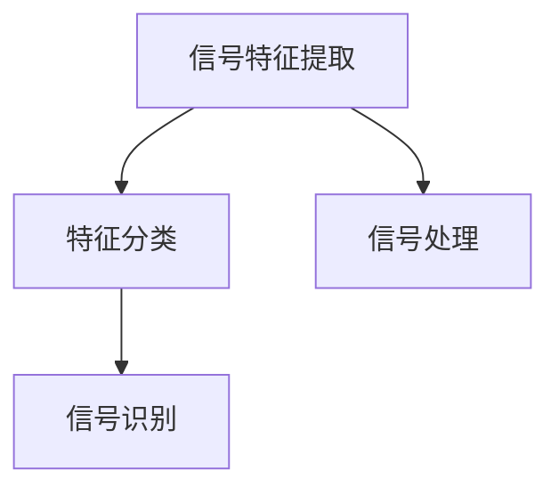

                 

## 1. 背景介绍

### 1.1 问题由来

随着无线通信技术的迅猛发展，调制信号识别（Modulation Recognition）变得越来越重要。调制信号识别涉及将接收到的信号识别为特定的调制方式，如幅度调制（AM）、频率调制（FM）、相位调制（PM）等，从而实现高效的通信和数据传输。调制信号识别技术广泛应用于无线电通信、雷达、卫星通信等领域，是实现通信链路可靠性的关键。

### 1.2 问题核心关键点

调制信号识别技术主要面临以下几个核心问题：

- **信号特征提取**：如何从信号中提取有区分度的特征，以便于进行后续的识别。
- **分类器设计**：如何选择或设计有效的分类器对提取的特征进行分类。
- **性能优化**：如何在不同信噪比（SNR）和信号样本数量下优化识别性能。
- **实时性要求**：在硬件资源有限的情况下，如何快速、高效地进行调制信号识别。

### 1.3 问题研究意义

调制信号识别技术的发展对于提升通信系统的效率和可靠性具有重要意义：

- **提升通信效率**：正确的调制方式识别可以确保数据正确传输，减少误码率。
- **增强通信安全性**：识别通信信号的调制方式有助于分析通信内容，防御非法通信。
- **优化资源配置**：通过识别调制方式，可以更合理地分配通信资源，提升网络性能。

## 2. 核心概念与联系

### 2.1 核心概念概述

调制信号识别（Modulation Recognition）是一个典型的信号处理和模式识别问题。它涉及以下几个核心概念：

- **信号特征提取**：从信号中提取出能够区分不同调制方式的特征，如频谱特征、时域特征等。
- **特征分类**：使用机器学习或深度学习模型对提取的特征进行分类，识别调制方式。
- **信号处理**：对接收到的信号进行预处理，如滤波、降噪等，以便于特征提取。

这些概念之间的逻辑关系可以通过以下Mermaid流程图来展示：



这个流程图展示了调制信号识别的核心步骤：首先对接收到的信号进行处理，然后提取特征，最后使用分类器对特征进行分类，识别出调制方式。

## 3. 核心算法原理 & 具体操作步骤
### 3.1 算法原理概述

调制信号识别的基本原理是通过提取信号的特征向量，并使用分类器对这些特征向量进行分类，从而识别出调制方式。

形式化地，假设接收到的信号为 $x_t \in \mathbb{R}^T$，其中 $T$ 为信号长度。信号处理模块将对 $x_t$ 进行滤波、降噪等预处理，得到处理后的信号 $x_t'$。特征提取模块将 $x_t'$ 转化为特征向量 $f(x_t') \in \mathbb{R}^N$，其中 $N$ 为特征维度。最后，分类器 $C$ 将特征向量 $f(x_t')$ 分类，输出调制方式 $\hat{m}$。

常见的特征提取方法包括频谱特征、时域特征、统计特征等。分类器可以采用支持向量机（SVM）、决策树、随机森林、卷积神经网络（CNN）等机器学习和深度学习模型。

### 3.2 算法步骤详解

调制信号识别通常包括以下几个关键步骤：

**Step 1: 信号预处理**

信号预处理是调制信号识别的第一步，主要目的是消除信号中的噪声和其他干扰，以便于后续的特征提取和分类。常见的信号预处理技术包括：

- 低通滤波（Low-Pass Filtering）：去除高频噪声。
- 高通滤波（High-Pass Filtering）：去除低频噪声。
- 带通滤波（Band-Pass Filtering）：保留特定频段的信号。
- 降噪（Noise Reduction）：如Wiener滤波、小波去噪等。

**Step 2: 特征提取**

特征提取是从信号中提取出能够区分不同调制方式的特征。常见的特征提取方法包括：

- 频谱特征：包括功率谱密度、频谱幅度、频谱相位等。
- 时域特征：如自相关函数、周期图等。
- 统计特征：如均值、方差、峰度、偏度等。

**Step 3: 特征分类**

特征分类是将提取的特征向量输入到分类器中进行分类，得到调制方式。常见的分类器包括：

- 支持向量机（SVM）：使用核函数将特征映射到高维空间，然后在高维空间中进行分类。
- 决策树（Decision Tree）：使用树结构对特征进行决策，最终输出分类结果。
- 随机森林（Random Forest）：由多个决策树组成，使用投票方式进行分类。
- 卷积神经网络（CNN）：使用卷积层和池化层提取特征，通过全连接层进行分类。

**Step 4: 模型评估**

模型评估是通过在测试集上对模型进行评估，衡量其识别调制方式的准确率、召回率、F1分数等性能指标。常用的评估指标包括：

- 准确率（Accuracy）：正确分类的样本数占总样本数的比例。
- 召回率（Recall）：正确识别出的样本数占真实正样本数的比例。
- F1分数（F1 Score）：准确率和召回率的调和平均数。

### 3.3 算法优缺点

基于信号特征提取和分类的调制信号识别方法具有以下优点：

- **适应性强**：可以适用于多种调制方式，包括AM、FM、PM等。
- **精度高**：使用机器学习或深度学习模型可以实现高精度的分类。
- **鲁棒性好**：通过特征提取和分类器设计，可以有效抵抗噪声和干扰。

但同时，该方法也存在一定的局限性：

- **计算复杂度高**：特征提取和分类器训练需要大量计算资源。
- **实时性要求高**：在实时通信场景中，需要快速进行识别，这可能影响计算速度。
- **模型泛化性不足**：当新调制方式出现时，需要重新训练模型，适应性不够强。

### 3.4 算法应用领域

调制信号识别技术广泛应用于以下几个领域：

- **通信系统**：在无线通信、卫星通信中，用于识别调制方式，确保通信可靠性。
- **雷达系统**：在雷达信号处理中，用于识别目标的信号特征，进行目标识别和跟踪。
- **遥感系统**：在遥感信号处理中，用于识别遥感信号的调制方式，进行信号分析和处理。
- **医学设备**：在医疗设备中，用于识别生物信号的调制方式，进行生理监测和诊断。
- **智能家居**：在智能家居系统中，用于识别家电信号的调制方式，进行智能控制和故障诊断。

## 4. 数学模型和公式 & 详细讲解 & 举例说明
### 4.1 数学模型构建

假设接收到的信号为 $x_t \in \mathbb{R}^T$，其中 $T$ 为信号长度。信号预处理模块将对 $x_t$ 进行滤波、降噪等预处理，得到处理后的信号 $x_t'$。特征提取模块将 $x_t'$ 转化为特征向量 $f(x_t') \in \mathbb{R}^N$，其中 $N$ 为特征维度。最后，分类器 $C$ 将特征向量 $f(x_t')$ 分类，输出调制方式 $\hat{m}$。

### 4.2 公式推导过程

以时域特征和支持向量机（SVM）为例，进行公式推导。

假设信号 $x_t$ 经过低通滤波后，得到 $x_t'$。特征提取模块将 $x_t'$ 转化为时域特征向量 $f(x_t')$。假设 $f(x_t')$ 中包含有 $K$ 个特征，构成特征向量 $[f_1(x_t'), f_2(x_t'), ..., f_K(x_t')]$。

支持向量机（SVM）的基本公式为：

$$
\min_{\omega, b} \frac{1}{2} \|\omega\|^2 + C \sum_{i=1}^N \max(0, 1 - y_i \cdot (\omega \cdot f(x_t')_i + b))
$$

其中，$\omega$ 为分类超平面，$b$ 为偏置项，$y_i$ 为样本标签，$C$ 为正则化参数。

### 4.3 案例分析与讲解

以AM（幅度调制）和FM（频率调制）信号的识别为例，进行案例分析。

假设接收到的信号 $x_t$ 为AM信号，其中 $x_t = a_t \cos(2\pi f_c t + \phi)$，$a_t$ 为幅度调制信号，$f_c$ 为载波频率，$\phi$ 为初始相位。通过低通滤波和特征提取，得到时域特征向量 $f(x_t')$。假设 $f(x_t')$ 中包含有 $K$ 个特征，构成特征向量 $[f_1(x_t'), f_2(x_t'), ..., f_K(x_t')]$。

假设支持向量机（SVM）的训练数据集为 $\{(x_i', y_i)\}_{i=1}^N$，其中 $x_i'$ 为训练样本的时域特征向量，$y_i$ 为样本标签。SVM模型训练得到分类超平面 $\omega$ 和偏置项 $b$，即可用于测试样本的分类。

## 5. 项目实践：代码实例和详细解释说明
### 5.1 开发环境搭建

在进行调制信号识别项目实践前，需要先搭建好开发环境。以下是使用Python和PyTorch进行项目开发的流程：

1. 安装Anaconda：从官网下载并安装Anaconda，用于创建独立的Python环境。

2. 创建并激活虚拟环境：
```bash
conda create -n pytorch-env python=3.8 
conda activate pytorch-env
```

3. 安装PyTorch：根据CUDA版本，从官网获取对应的安装命令。例如：
```bash
conda install pytorch torchvision torchaudio cudatoolkit=11.1 -c pytorch -c conda-forge
```

4. 安装其他必要的Python库：
```bash
pip install numpy scipy matplotlib sklearn
```

5. 安装Python可视化库：
```bash
pip install matplotlib seaborn
```

完成上述步骤后，即可在`pytorch-env`环境中开始项目实践。

### 5.2 源代码详细实现

以下是一个使用PyTorch进行AM信号识别的完整代码实现：

```python
import torch
import torch.nn as nn
import torch.optim as optim
from sklearn.model_selection import train_test_split
from sklearn.metrics import accuracy_score, confusion_matrix

# 定义AM信号生成函数
def generate_AM_signal(length, fc=1000, phi=0):
    t = torch.linspace(0, length, length)
    amplitude = torch.randn(length)
    signal = amplitude * torch.cos(2 * torch.pi * fc * t + phi)
    return signal

# 定义特征提取函数
def extract_features(signal):
    # 使用短时傅里叶变换提取频谱特征
    n_window = 1024
    overlap = n_window // 2
    n_frame = int((len(signal) - n_window) // overlap + 1)
    fsc = n_window // 2
    fs = n_window // 2 + 1
    f = torch.zeros(n_frame, fsc, fs)
    for i in range(n_frame):
        x = signal[i * overlap: i * overlap + n_window]
        X = torch.stft(x, n_window, win_length=n_window, window=torch.hann_window(n_window), pad_mode='reflect', return_complex=False)
        f[i, :, :] = X
    return f

# 定义SVM分类器
class SVM(nn.Module):
    def __init__(self, n_features):
        super(SVM, self).__init__()
        self.fc1 = nn.Linear(n_features, 64)
        self.fc2 = nn.Linear(64, 2)
    
    def forward(self, x):
        x = self.fc1(x)
        x = nn.functional.relu(x)
        x = self.fc2(x)
        return x

# 生成信号数据集
n_samples = 1000
length = 1000
data = []
labels = []
for i in range(n_samples):
    signal = generate_AM_signal(length)
    label = 1
    data.append(signal)
    labels.append(label)
    signal = generate_AM_signal(length, fc=1000, phi=np.pi)
    label = 0
    data.append(signal)
    labels.append(label)
data = torch.tensor(data)
labels = torch.tensor(labels)

# 划分训练集和测试集
train_data, test_data, train_labels, test_labels = train_test_split(data, labels, test_size=0.2, random_state=42)

# 定义特征提取器和分类器
feature_extractor = extract_features
classifier = SVM(n_features=512)

# 训练模型
n_epochs = 100
learning_rate = 0.01
criterion = nn.CrossEntropyLoss()
optimizer = optim.SGD(classifier.parameters(), lr=learning_rate, momentum=0.9)

for epoch in range(n_epochs):
    for i, (data, label) in enumerate(train_data):
        data = feature_extractor(data)
        label = label.unsqueeze(1)
        optimizer.zero_grad()
        output = classifier(data)
        loss = criterion(output, label)
        loss.backward()
        optimizer.step()
        if i % 100 == 0:
            print(f'Epoch [{epoch+1}/{n_epochs}], Step [{i+1}/{len(train_data)}], Loss: {loss.item()}')

# 测试模型
test_data = feature_extractor(test_data)
test_labels = test_labels.unsqueeze(1)
output = classifier(test_data)
pred_labels = torch.argmax(output, dim=1)
accuracy = accuracy_score(test_labels, pred_labels)
conf_matrix = confusion_matrix(test_labels.numpy(), pred_labels.numpy())

print(f'Accuracy: {accuracy:.2f}')
print(f'Confusion Matrix: \n{conf_matrix}')
```

### 5.3 代码解读与分析

让我们再详细解读一下关键代码的实现细节：

**信号生成函数**：
- `generate_AM_signal`函数：生成AM信号，其中 `length` 为信号长度，`fc` 为载波频率，`phi` 为初始相位。

**特征提取函数**：
- `extract_features`函数：使用短时傅里叶变换（Short-Time Fourier Transform, STFT）提取信号的时域特征。

**SVM分类器**：
- `SVM`类：定义了一个简单的SVM分类器，包含两个全连接层，用于将特征向量映射到分类结果。

**数据生成与划分**：
- 使用生成的AM信号数据集，将其划分为训练集和测试集。

**特征提取与模型训练**：
- 对训练数据进行特征提取，输入SVM分类器进行训练。

**模型测试与评估**：
- 对测试数据进行特征提取，输入SVM分类器进行测试。
- 计算准确率和混淆矩阵，评估模型性能。

## 6. 实际应用场景
### 6.1 智能家居系统

在智能家居系统中，调制信号识别技术可以用于识别家电信号的调制方式，进行智能控制和故障诊断。例如，智能门锁可以通过对无线信号的调制方式进行识别，判断门是否被非法打开，并进行报警和处理。

### 6.2 医疗设备

在医疗设备中，调制信号识别技术可以用于识别生物信号的调制方式，进行生理监测和诊断。例如，心电图（ECG）信号的调制方式可以通过调制信号识别技术进行识别，从而进行心律失常等疾病的诊断。

### 6.3 通信系统

在通信系统中，调制信号识别技术可以用于识别通信信号的调制方式，确保通信可靠性。例如，卫星通信中的信号调制方式可以通过调制信号识别技术进行识别，确保信号正确传输。

### 6.4 未来应用展望

随着调制信号识别技术的不断发展，其在以下几个方面将会有更广泛的应用：

- **信号处理自动化**：通过自动化信号处理技术，实时识别调制方式，提升通信和数据传输的效率和可靠性。
- **边缘计算**：将调制信号识别技术集成到边缘计算设备中，实现实时信号分析和处理，降低数据传输延迟。
- **智能网络**：通过调制信号识别技术，构建智能网络，实现对通信信号的实时监控和管理，提升网络性能。
- **增强现实**：在增强现实（AR）系统中，通过调制信号识别技术，识别虚拟对象的位置和姿态，实现智能交互。

## 7. 工具和资源推荐
### 7.1 学习资源推荐

为了帮助开发者系统掌握调制信号识别技术，以下是一些优质的学习资源：

1. **《信号处理与通信系统》**：由书出版社出版的经典教材，详细介绍了信号处理和通信系统的基本概念和算法。

2. **《深度学习与信号处理》**：由Academic Press出版的书籍，介绍了深度学习在信号处理中的应用。

3. **Coursera信号处理课程**：由斯坦福大学开设的信号处理课程，有Lecture视频和配套作业，适合初学者入门。

4. **Kaggle信号处理竞赛**：Kaggle平台上的信号处理竞赛，可以通过实际项目实践信号处理技术。

5. **GitHub信号处理项目**：GitHub上的开源信号处理项目，包括代码示例和文档，可供学习参考。

通过对这些资源的学习实践，相信你一定能够快速掌握调制信号识别的精髓，并用于解决实际的信号处理问题。

### 7.2 开发工具推荐

高效的开发离不开优秀的工具支持。以下是几款用于调制信号识别开发的常用工具：

1. **PyTorch**：基于Python的开源深度学习框架，灵活动态的计算图，适合快速迭代研究。

2. **TensorFlow**：由Google主导开发的开源深度学习框架，生产部署方便，适合大规模工程应用。

3. **Matplotlib**：Python中的绘图库，可用于数据可视化，方便模型评估和调试。

4. **SciPy**：Python中的科学计算库，提供各种信号处理函数，适合进行特征提取和分析。

5. **Scikit-learn**：Python中的机器学习库，提供各种分类器，适合进行信号分类。

合理利用这些工具，可以显著提升调制信号识别任务的开发效率，加快创新迭代的步伐。

### 7.3 相关论文推荐

调制信号识别技术的发展源于学界的持续研究。以下是几篇奠基性的相关论文，推荐阅读：

1. **Adaptive Feature Extraction for Modulation Recognition**：提出了一种自适应特征提取方法，用于识别不同类型的调制信号。

2. **Deep Learning for Modulation Recognition**：使用深度学习模型进行调制信号识别，取得了不错的识别效果。

3. **Real-Time Modulation Recognition Using Convolutional Neural Networks**：使用卷积神经网络进行实时调制信号识别，实现了较快的识别速度。

4. **Modulation Recognition Using Multispectral Heterodyne Sensing**：提出了一种多光谱异步感测技术，用于调制信号识别。

5. **Modulation Recognition Using Deep Transfer Learning**：使用深度迁移学习进行调制信号识别，实现了较低的特征提取计算量。

这些论文代表了大语言模型微调技术的发展脉络。通过学习这些前沿成果，可以帮助研究者把握学科前进方向，激发更多的创新灵感。

## 8. 总结：未来发展趋势与挑战
### 8.1 总结

本文对基于信号特征提取和分类的调制信号识别方法进行了全面系统的介绍。首先阐述了调制信号识别的研究背景和意义，明确了信号处理和模式识别的基本原理。其次，从原理到实践，详细讲解了调制信号识别的数学模型和操作步骤，给出了调制信号识别项目开发的完整代码实例。同时，本文还广泛探讨了调制信号识别技术在智能家居、医疗设备、通信系统等多个领域的应用前景，展示了技术的广泛应用价值。

通过本文的系统梳理，可以看到，调制信号识别技术正在成为通信和信号处理领域的重要范式，极大地提升了通信系统的效率和可靠性。未来，伴随信号处理技术和深度学习算法的持续演进，调制信号识别技术还将有更多的创新和发展，为通信和信号处理系统带来新的突破。

### 8.2 未来发展趋势

展望未来，调制信号识别技术将呈现以下几个发展趋势：

1. **深度学习算法**：深度学习算法将在调制信号识别中发挥越来越重要的作用，提高识别精度和速度。

2. **多模态识别**：通过结合声音、图像、传感器等多模态数据，实现更加全面的信号识别。

3. **实时处理**：实时处理技术将使得调制信号识别系统能够快速响应，提升应用效率。

4. **边缘计算**：通过将识别算法集成到边缘计算设备中，实现本地化信号处理，降低网络传输延迟。

5. **联邦学习**：通过联邦学习技术，在不泄露隐私的情况下，实现多设备协同识别，提升识别准确率。

6. **自适应学习**：通过自适应学习算法，适应不同信号和环境的变化，提升识别鲁棒性。

以上趋势凸显了调制信号识别技术的广阔前景。这些方向的探索发展，必将进一步提升通信和信号处理系统的性能和应用范围，为通信和信号处理技术的进步提供新的动力。

### 8.3 面临的挑战

尽管调制信号识别技术已经取得了瞩目成就，但在迈向更加智能化、普适化应用的过程中，它仍面临着诸多挑战：

1. **数据稀缺**：在实际应用中，获取高质量的信号数据可能存在困难，导致模型泛化性能不足。

2. **计算资源消耗大**：信号处理和深度学习模型的计算量较大，需要高性能计算资源。

3. **实时性要求高**：在实时通信场景中，需要快速进行信号识别，这可能影响计算速度。

4. **模型泛化性不足**：当新调制方式出现时，需要重新训练模型，适应性不够强。

5. **算法复杂度大**：深度学习模型的算法复杂度较高，难以快速迭代和优化。

6. **数据隐私问题**：在信号处理过程中，需要处理大量的用户数据，如何保护用户隐私是一个重要问题。

正视这些挑战，积极应对并寻求突破，将是大语言模型微调走向成熟的必由之路。相信随着学界和产业界的共同努力，这些挑战终将一一被克服，调制信号识别技术必将在构建智能通信和信号处理系统中扮演越来越重要的角色。

### 8.4 研究展望

面对调制信号识别技术所面临的挑战，未来的研究需要在以下几个方面寻求新的突破：

1. **无监督和半监督学习**：摆脱对大量标注数据的依赖，利用无监督和半监督学习范式，最大限度利用非结构化数据。

2. **自适应学习算法**：通过自适应学习算法，适应不同信号和环境的变化，提升识别鲁棒性。

3. **多模态融合**：通过结合声音、图像、传感器等多模态数据，实现更加全面的信号识别。

4. **联邦学习**：通过联邦学习技术，在不泄露隐私的情况下，实现多设备协同识别，提升识别准确率。

5. **边缘计算**：通过将识别算法集成到边缘计算设备中，实现本地化信号处理，降低网络传输延迟。

6. **自适应特征提取**：通过自适应特征提取算法，动态提取特征，提升识别效果。

这些研究方向的探索，必将引领调制信号识别技术迈向更高的台阶，为构建智能通信和信号处理系统提供新的解决方案。面向未来，调制信号识别技术还需要与其他人工智能技术进行更深入的融合，如知识表示、因果推理、强化学习等，多路径协同发力，共同推动通信和信号处理技术的进步。只有勇于创新、敢于突破，才能不断拓展信号处理系统的边界，让智能技术更好地造福人类社会。

## 9. 附录：常见问题与解答

**Q1：调制信号识别中的特征提取有哪些方法？**

A: 调制信号识别中的特征提取方法包括：

1. 频域特征提取：如功率谱密度、频率响应的幅度和相位。

2. 时域特征提取：如自相关函数、周期图等。

3. 统计特征提取：如均值、方差、峰度、偏度等。

4. 频谱特征提取：如频谱幅度、频谱相位等。

5. 时频特征提取：如短时傅里叶变换、小波变换等。

6. 子带特征提取：如子带功率谱密度等。

这些特征提取方法在不同的调制信号识别任务中，有其特定的优缺点和适用性，需要根据具体情况进行选择。

**Q2：调制信号识别的常用分类器有哪些？**

A: 调制信号识别的常用分类器包括：

1. 支持向量机（SVM）：使用核函数将特征映射到高维空间，然后在高维空间中进行分类。

2. 决策树（Decision Tree）：使用树结构对特征进行决策，最终输出分类结果。

3. 随机森林（Random Forest）：由多个决策树组成，使用投票方式进行分类。

4. 卷积神经网络（CNN）：使用卷积层和池化层提取特征，通过全连接层进行分类。

5. 神经网络（Neural Network）：使用多层神经网络进行特征提取和分类。

这些分类器各有优缺点，需要根据具体情况进行选择和优化。

**Q3：调制信号识别的目标是什么？**

A: 调制信号识别的目标是：

1. 识别接收到的信号属于哪种调制方式，如AM、FM、PM等。

2. 判断信号是否存在异常，如噪声干扰、频谱失真等。

3. 分析信号的调制参数，如载波频率、相位等。

通过调制信号识别，可以实现对信号的准确分析和处理，提升通信系统的效率和可靠性。

**Q4：调制信号识别有哪些应用场景？**

A: 调制信号识别的应用场景包括：

1. 无线通信：识别通信信号的调制方式，确保通信可靠性。

2. 雷达系统：识别目标的信号特征，进行目标识别和跟踪。

3. 卫星通信：识别卫星信号的调制方式，确保信号正确传输。

4. 医疗设备：识别生物信号的调制方式，进行生理监测和诊断。

5. 智能家居：识别家电信号的调制方式，进行智能控制和故障诊断。

这些应用场景展示了调制信号识别的广泛应用价值。

**Q5：调制信号识别如何处理噪声干扰？**

A: 调制信号识别中的噪声干扰可以通过以下方法进行处理：

1. 滤波：使用低通滤波、高通滤波、带通滤波等方法，去除噪声。

2. 降噪：如Wiener滤波、小波去噪等方法，减少噪声对信号的影响。

3. 信号增强：如峰值增强、自适应增强等方法，提升信号的信噪比。

4. 特征提取：通过特征提取算法，增强信号的特征信息，减少噪声的影响。

5. 模型优化：通过模型优化算法，提高模型对噪声的鲁棒性。

这些方法可以结合使用，根据具体情况进行选择和优化。

作者：禅与计算机程序设计艺术 / Zen and the Art of Computer Programming

