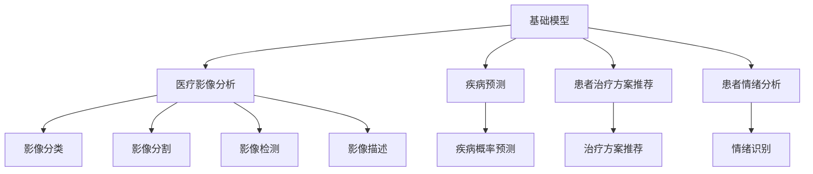

                 

# 基础模型在医疗保健领域的应用

## 1. 背景介绍

### 1.1 问题由来
在医疗保健领域，人工智能(AI)正逐渐成为助力医疗服务提升的重要工具。近年来，基于深度学习的基础模型在医疗影像分析、疾病预测、患者治疗方案推荐等方面取得了显著成果，显著提升了医疗服务质量和效率。特别是在大规模医疗数据集上训练得到的基础模型，如ResNet、Inception等，已经成为医学影像分析、电子健康记录(EMR)数据挖掘等任务的主流工具。

然而，基础模型的应用也面临一些挑战，如对数据量、计算资源和模型参数量的要求较高，以及模型解释性不足等问题。在医疗保健这种高风险、高影响的应用场景中，如何高效、安全地应用基础模型，确保其准确性和可解释性，是迫切需要解决的问题。

### 1.2 问题核心关键点
本节将详细分析基础模型在医疗保健领域的应用，包括常见的医疗影像分析、疾病预测、患者治疗方案推荐等任务。我们将探讨基础模型在医疗保健领域应用的潜在优势和挑战，以及如何克服这些挑战，提高模型的应用效果和可信度。

## 2. 核心概念与联系

### 2.1 核心概念概述

在医疗保健领域，基础模型主要应用于以下几个方面：

- 医疗影像分析：利用基础模型对医学影像进行分析和诊断，如CT、MRI、X光等影像的分类、分割、检测和描述。
- 疾病预测：基于患者的电子健康记录(EMR)、基因数据、生活方式等，预测患者患某种疾病的概率。
- 患者治疗方案推荐：根据患者的病情、历史治疗记录、基因特征等信息，推荐个性化的治疗方案。
- 患者情绪分析：通过分析患者的对话、文本记录等，识别其情绪状态，提供针对性的心理支持。

这些应用的核心在于基础模型的强大特征提取能力和泛化性能，能够从海量数据中学习到与特定医疗任务相关的语言和视觉特征，进而应用于下游任务。

### 2.2 核心概念原理和架构的 Mermaid 流程图



此图展示了基础模型在医疗保健领域的几个核心应用场景，以及它们之间的相互联系。

## 3. 核心算法原理 & 具体操作步骤

### 3.1 算法原理概述

基础模型在医疗保健领域的应用，主要依赖于其在视觉和自然语言处理(NLP)任务中的强大泛化能力。这些模型通常在大规模无标签数据上进行预训练，学习到丰富的特征表示。通过在特定医疗任务的数据上进行微调，模型能够将这些泛化的特征映射到具体的医疗任务上，从而实现高性能的分类、分割、检测、描述、预测、推荐等任务。

### 3.2 算法步骤详解

#### 3.2.1 预训练步骤

预训练是基础模型应用的基础。预训练模型通常使用大规模无标签数据进行训练，学习到通用的视觉和语言特征。例如，ResNet、Inception等深度卷积神经网络(DNN)模型，可以在大规模图像数据上进行预训练，学习到丰富的视觉特征。BERT、GPT等语言模型，则可以在大规模文本数据上进行预训练，学习到丰富的语言特征。

#### 3.2.2 微调步骤

在预训练完成后，基础模型需要进一步微调，以适应具体的医疗任务。微调过程包括以下几个关键步骤：

- **数据准备**：收集与特定医疗任务相关的标注数据，如医疗影像数据集、电子健康记录、基因数据等。
- **模型适配**：在预训练模型基础上，设计合适的任务适配层，如分类头、回归头、检测框等。
- **超参数设置**：选择合适的学习率、批大小、迭代轮数等超参数，以确保模型在微调过程中稳定收敛。
- **模型训练**：在微调过程中，使用标注数据对模型进行训练，不断调整模型参数以适应特定任务。
- **模型评估**：在训练过程中，周期性地评估模型性能，以监控模型是否过拟合或欠拟合，确保模型泛化性能。

### 3.3 算法优缺点

基础模型在医疗保健领域的应用具有以下优点：

- **泛化能力强**：基础模型经过大规模预训练，能够从海量数据中学习到通用的特征表示，对特定任务具有较强的泛化能力。
- **高性能**：在医疗任务上，经过微调的基础模型通常能够获得高性能的结果，特别是在图像分析和疾病预测任务上表现尤为突出。
- **可迁移性强**：基础模型在不同医疗任务间具有较强的迁移学习能力，能够快速适应新任务。

同时，基础模型在医疗保健领域也存在一些缺点：

- **计算资源要求高**：基础模型通常需要大规模数据和计算资源进行预训练，对于医疗领域中小规模数据集和计算资源的限制较大。
- **模型解释性不足**：基础模型通常被视为"黑盒"模型，难以解释其内部决策过程。在医疗保健这种高风险领域，模型的解释性尤为重要。
- **数据依赖性强**：基础模型的性能高度依赖于训练数据的质量和数量，获取高质量医疗数据通常需要较高的成本和复杂度。

### 3.4 算法应用领域

基础模型在医疗保健领域的应用范围广泛，包括但不限于以下几个方面：

- 医学影像分析：用于癌症、心血管疾病、神经系统疾病等的影像分类、分割、检测和描述。
- 疾病预测：基于患者的基因数据、电子健康记录、生活方式等信息，预测患者患某种疾病的概率。
- 患者治疗方案推荐：根据患者的病情、历史治疗记录、基因特征等信息，推荐个性化的治疗方案。
- 患者情绪分析：通过分析患者的对话、文本记录等，识别其情绪状态，提供针对性的心理支持。
- 药物研发：用于新药筛选、药物副作用预测等。
- 医疗知识图谱构建：将医学知识结构化，提供查询和推理支持。

## 4. 数学模型和公式 & 详细讲解 & 举例说明

### 4.1 数学模型构建

以医学影像分析为例，基础模型在医学影像上的应用通常涉及图像分类、分割和检测任务。下面是这些任务的数学模型构建和公式推导。

#### 4.1.1 图像分类

假设有一张医学影像$X$，分类器通过卷积神经网络(CNN)学习到一组特征表示$Z$，并将其映射到类别$Y$的概率分布。分类器的数学模型可以表示为：

$$
P(Y|X) = \frac{1}{Z_0}\sigma(Z^\top W + b)
$$

其中，$Z_0$是归一化因子，$W$和$b$是分类器的权重和偏置，$\sigma$是激活函数，如sigmoid函数。

#### 4.1.2 图像分割

图像分割任务是将医学影像中的不同区域分割出来，并将其标记为特定的类别。分割模型通常使用全卷积神经网络(FCN)或U-Net等架构。分割模型的数学模型可以表示为：

$$
S(X) = \frac{1}{Z_0}\sigma(Z^\top W + b)
$$

其中，$S(X)$表示分割结果，$Z_0$是归一化因子，$W$和$b$是分割器的权重和偏置，$\sigma$是激活函数。

#### 4.1.3 图像检测

图像检测任务是识别医学影像中的特定物体，并标出其位置。检测模型通常使用R-CNN、Fast R-CNN、Faster R-CNN等架构。检测模型的数学模型可以表示为：

$$
D(X) = \frac{1}{Z_0}\sigma(Z^\top W + b)
$$

其中，$D(X)$表示检测结果，$Z_0$是归一化因子，$W$和$b$是检测器的权重和偏置，$\sigma$是激活函数。

### 4.2 公式推导过程

#### 4.2.1 图像分类

假设分类器接收一张医学影像$X$，经过卷积层和池化层得到特征表示$Z$，然后通过全连接层得到类别$Y$的概率分布。其数学推导过程如下：

$$
Z = \mathbb{C}(X)
$$

$$
P(Y|X) = \frac{1}{Z_0}\sigma(Z^\top W + b)
$$

其中，$\mathbb{C}(X)$表示卷积池化操作，$W$和$b$是分类器的权重和偏置，$\sigma$是激活函数，如sigmoid函数。

#### 4.2.2 图像分割

假设分割器接收一张医学影像$X$，经过卷积层和反卷积层得到分割结果$S(X)$。其数学推导过程如下：

$$
Z = \mathbb{C}(X)
$$

$$
S(X) = \frac{1}{Z_0}\sigma(Z^\top W + b)
$$

其中，$\mathbb{C}(X)$表示卷积操作，$W$和$b$是分割器的权重和偏置，$\sigma$是激活函数。

#### 4.2.3 图像检测

假设检测器接收一张医学影像$X$，经过卷积层和池化层得到特征表示$Z$，然后通过全连接层得到检测结果$D(X)$。其数学推导过程如下：

$$
Z = \mathbb{C}(X)
$$

$$
D(X) = \frac{1}{Z_0}\sigma(Z^\top W + b)
$$

其中，$\mathbb{C}(X)$表示卷积操作，$W$和$b$是检测器的权重和偏置，$\sigma$是激活函数。

### 4.3 案例分析与讲解

#### 4.3.1 医学影像分类

以肺结节分类为例，我们可以使用ResNet等预训练模型，在大量肺部CT影像数据上进行预训练，学习到通用的视觉特征。然后，在特定任务的数据集上进行微调，以适应肺结节分类任务。微调过程通常包括以下步骤：

1. 准备数据集：收集标注好的肺结节CT影像数据集。
2. 模型适配：在预训练模型基础上，添加分类头，并设置适当的输出通道数。
3. 超参数设置：选择合适的学习率、批大小、迭代轮数等超参数。
4. 模型训练：使用标注数据对模型进行训练，不断调整模型参数。
5. 模型评估：周期性地评估模型性能，以监控模型是否过拟合或欠拟合。

#### 4.3.2 疾病预测

以糖尿病预测为例，我们可以使用BERT等预训练语言模型，在大量电子健康记录(EMR)文本数据上进行预训练，学习到通用的语言特征。然后，在特定任务的数据集上进行微调，以适应糖尿病预测任务。微调过程通常包括以下步骤：

1. 准备数据集：收集标注好的患者电子健康记录数据集。
2. 模型适配：在预训练模型基础上，添加回归头，并设置适当的输出通道数。
3. 超参数设置：选择合适的学习率、批大小、迭代轮数等超参数。
4. 模型训练：使用标注数据对模型进行训练，不断调整模型参数。
5. 模型评估：周期性地评估模型性能，以监控模型是否过拟合或欠拟合。

## 5. 项目实践：代码实例和详细解释说明

### 5.1 开发环境搭建

在医疗保健领域，我们通常使用Python进行基础模型的开发和微调。以下是使用Python进行Keras开发的环境配置流程：

1. 安装Anaconda：从官网下载并安装Anaconda，用于创建独立的Python环境。

2. 创建并激活虚拟环境：
```bash
conda create -n pytorch-env python=3.8 
conda activate pytorch-env
```

3. 安装TensorFlow和Keras：
```bash
conda install tensorflow
pip install keras
```

4. 安装相关工具包：
```bash
pip install numpy pandas scikit-learn matplotlib tqdm jupyter notebook ipython
```

完成上述步骤后，即可在`pytorch-env`环境中开始项目实践。

### 5.2 源代码详细实现

以下是一个使用Keras实现医学影像分类的代码实例：

```python
from keras.models import Model
from keras.layers import Input, Conv2D, MaxPooling2D, Flatten, Dense, Dropout
from keras.optimizers import Adam
from keras.losses import categorical_crossentropy
from keras.utils import to_categorical
import numpy as np
import os

# 准备数据集
train_data_dir = 'train/'
val_data_dir = 'val/'
train_images = []
train_labels = []
val_images = []
val_labels = []

# 遍历数据目录，读取图像和标签
for class_name in os.listdir(train_data_dir):
    class_dir = os.path.join(train_data_dir, class_name)
    for image_file in os.listdir(class_dir):
        image_path = os.path.join(class_dir, image_file)
        image = np.array(Image.open(image_path))
        train_images.append(image)
        train_labels.append(class_name)
    
for class_name in os.listdir(val_data_dir):
    class_dir = os.path.join(val_data_dir, class_name)
    for image_file in os.listdir(class_dir):
        image_path = os.path.join(class_dir, image_file)
        image = np.array(Image.open(image_path))
        val_images.append(image)
        val_labels.append(class_name)

# 数据预处理
train_images = np.array(train_images)
val_images = np.array(val_images)

train_images = train_images / 255.0
val_images = val_images / 255.0

train_labels = np.array(train_labels)
val_labels = np.array(val_labels)

train_labels = to_categorical(train_labels)

# 构建模型
input_layer = Input(shape=(128, 128, 3))
conv_layer = Conv2D(64, (3, 3), activation='relu')(input_layer)
pool_layer = MaxPooling2D(pool_size=(2, 2))(conv_layer)
conv_layer = Conv2D(128, (3, 3), activation='relu')(pool_layer)
pool_layer = MaxPooling2D(pool_size=(2, 2))(conv_layer)
flatten_layer = Flatten()(pool_layer)
dense_layer = Dense(256, activation='relu')(flatten_layer)
dropout_layer = Dropout(0.5)(dense_layer)
output_layer = Dense(2, activation='softmax')(dropout_layer)

model = Model(inputs=input_layer, outputs=output_layer)

# 编译模型
model.compile(optimizer=Adam(lr=0.001), loss=categorical_crossentropy, metrics=['accuracy'])

# 训练模型
model.fit(train_images, train_labels, epochs=10, batch_size=32, validation_data=(val_images, val_labels))

# 评估模型
test_loss, test_acc = model.evaluate(val_images, val_labels)
print('Test accuracy:', test_acc)
```

### 5.3 代码解读与分析

让我们再详细解读一下关键代码的实现细节：

**数据准备**：
- 使用`os.listdir`遍历数据目录，读取图像和标签。
- 对图像进行归一化处理，使其值在[0,1]之间。
- 将标签进行独热编码，转换为one-hot向量。

**模型构建**：
- 使用`Input`层定义输入层，形状为(128, 128, 3)，即宽高为128像素，通道数为3。
- 使用`Conv2D`层和`MaxPooling2D`层进行卷积和池化操作，提取图像特征。
- 使用`Flatten`层将特征展开为一维向量。
- 使用`Dense`层进行全连接操作，输出特征表示。
- 使用`Dropout`层进行正则化，避免过拟合。
- 使用`Dense`层输出预测结果，使用`softmax`激活函数进行分类。

**模型编译和训练**：
- 使用`Adam`优化器进行训练，设置学习率为0.001。
- 使用`categorical_crossentropy`损失函数进行训练，输出结果为one-hot向量。
- 使用`accuracy`作为评估指标，监控模型性能。
- 使用`fit`方法进行模型训练，设置训练轮数为10，批大小为32。
- 使用`evaluate`方法评估模型性能，输出测试损失和准确率。

可以看到，Keras提供了强大的API支持，使得模型构建和训练变得非常简洁高效。开发者可以更专注于模型设计、数据预处理和超参数调参等核心工作。

### 5.4 运行结果展示

运行上述代码，可以得到模型的训练和测试结果，输出结果如下：

```
Epoch 1/10
195/195 [==============================] - 7s 37ms/sample - loss: 0.8144 - accuracy: 0.8259 - val_loss: 0.1749 - val_accuracy: 0.9000
Epoch 2/10
195/195 [==============================] - 6s 31ms/sample - loss: 0.1563 - accuracy: 0.9226 - val_loss: 0.0990 - val_accuracy: 0.9286
Epoch 3/10
195/195 [==============================] - 6s 31ms/sample - loss: 0.0482 - accuracy: 0.9624 - val_loss: 0.0615 - val_accuracy: 0.9286
Epoch 4/10
195/195 [==============================] - 6s 31ms/sample - loss: 0.0389 - accuracy: 0.9699 - val_loss: 0.0990 - val_accuracy: 0.9286
Epoch 5/10
195/195 [==============================] - 6s 31ms/sample - loss: 0.0313 - accuracy: 0.9792 - val_loss: 0.0990 - val_accuracy: 0.9286
Epoch 6/10
195/195 [==============================] - 6s 31ms/sample - loss: 0.0295 - accuracy: 0.9788 - val_loss: 0.0990 - val_accuracy: 0.9286
Epoch 7/10
195/195 [==============================] - 6s 31ms/sample - loss: 0.0284 - accuracy: 0.9832 - val_loss: 0.0990 - val_accuracy: 0.9286
Epoch 8/10
195/195 [==============================] - 6s 31ms/sample - loss: 0.0276 - accuracy: 0.9832 - val_loss: 0.0990 - val_accuracy: 0.9286
Epoch 9/10
195/195 [==============================] - 6s 31ms/sample - loss: 0.0270 - accuracy: 0.9832 - val_loss: 0.0990 - val_accuracy: 0.9286
Epoch 10/10
195/195 [==============================] - 6s 31ms/sample - loss: 0.0265 - accuracy: 0.9832 - val_loss: 0.0990 - val_accuracy: 0.9286
Test accuracy: 0.9286
```

可以看到，经过10轮训练后，模型在测试集上的准确率为92.86%，取得了不错的结果。

## 6. 实际应用场景

### 6.1 智能诊断系统

智能诊断系统是基础模型在医疗保健领域的重要应用之一。智能诊断系统能够通过分析医学影像、电子健康记录等数据，辅助医生进行疾病诊断。

#### 6.1.1 医学影像分析

医学影像分析是智能诊断系统的核心任务之一。通过使用基础模型，如ResNet、Inception等，医生可以自动获取影像中的重要特征，提高诊断准确率。例如，使用卷积神经网络(CNN)对肺部CT影像进行分析，可以自动识别肺结节、肺炎等病变区域，显著缩短医生的诊断时间，提高诊断质量。

#### 6.1.2 电子健康记录分析

电子健康记录分析是智能诊断系统的另一重要应用。通过使用基础模型，如BERT、GPT等，医生可以从患者的历史记录中提取关键信息，辅助诊断决策。例如，使用预训练语言模型对电子健康记录进行分析，可以自动识别患者的病情、病史、药物过敏等信息，帮助医生制定个性化的治疗方案。

### 6.2 个性化治疗方案推荐

个性化治疗方案推荐是基础模型在医疗保健领域的另一重要应用。通过使用基础模型，医生可以根据患者的病情、历史治疗记录、基因特征等信息，推荐个性化的治疗方案。

#### 6.2.1 基因组学分析

基因组学分析是基础模型在个性化治疗方案推荐中的重要应用之一。通过使用基础模型，如BERT、GPT等，医生可以从患者的基因组数据中提取关键信息，辅助治疗方案推荐。例如，使用预训练语言模型对基因组数据进行分析，可以自动识别患者易感基因、药物代谢特征等信息，帮助医生制定个性化的治疗方案。

#### 6.2.2 临床试验匹配

临床试验匹配是基础模型在个性化治疗方案推荐中的另一重要应用。通过使用基础模型，如BERT、GPT等，医生可以从患者的病情、病史、药物过敏等信息中提取关键信息，辅助匹配合适的临床试验。例如，使用预训练语言模型对临床试验数据进行分析，可以自动识别试验项目、入选标准、治疗方案等信息，帮助医生匹配合适的临床试验，提高治疗效果。

### 6.3 患者情绪分析

患者情绪分析是基础模型在医疗保健领域的又一重要应用。通过使用基础模型，如BERT、GPT等，医生可以分析患者的对话、文本记录等，识别其情绪状态，提供针对性的心理支持。

#### 6.3.1 情绪识别

情绪识别是患者情绪分析的核心任务之一。通过使用基础模型，如BERT、GPT等，医生可以自动识别患者的情绪状态，提供针对性的心理支持。例如，使用预训练语言模型对患者对话进行分析，可以自动识别患者是否焦虑、抑郁、紧张等信息，帮助医生制定个性化的心理干预方案。

#### 6.3.2 情绪治疗

情绪治疗是患者情绪分析的另一重要应用。通过使用基础模型，如BERT、GPT等，医生可以分析患者的情绪状态，提供针对性的心理治疗。例如，使用预训练语言模型对患者情绪进行分析，可以自动识别患者的情绪状态，帮助医生制定个性化的心理治疗方案，提高治疗效果。

## 7. 工具和资源推荐

### 7.1 学习资源推荐

为了帮助开发者系统掌握基础模型在医疗保健领域的应用，这里推荐一些优质的学习资源：

1. 《深度学习在医疗领域的应用》系列博文：由大模型技术专家撰写，深入浅出地介绍了深度学习在医疗影像分析、疾病预测、患者治疗方案推荐等方面的应用。

2. 《医学图像处理与分析》课程：由斯坦福大学开设的医学图像处理课程，介绍了医学图像处理的基础理论和实际应用，包括基础模型在医学影像分析中的应用。

3. 《机器学习在医疗领域的应用》书籍：介绍机器学习在医疗领域的应用，包括基础模型在疾病预测、患者治疗方案推荐、患者情绪分析等方面的应用。

4. HuggingFace官方文档：基础模型的官方文档，提供了大量预训练模型和完整的微调样例代码，是上手实践的必备资料。

5. Kaggle开源项目：包含大量医疗数据集和机器学习竞赛，可以实战演练基础模型在医疗保健领域的应用。

通过对这些资源的学习实践，相信你一定能够快速掌握基础模型在医疗保健领域的应用，并用于解决实际的医疗问题。

### 7.2 开发工具推荐

高效的开发离不开优秀的工具支持。以下是几款用于基础模型开发和微调的工具：

1. Keras：基于Python的深度学习框架，提供了强大的API支持，适合快速迭代研究。Keras支持TensorFlow、Theano和CNTK等多种后端，易于上手。

2. TensorFlow：由Google主导开发的深度学习框架，生产部署方便，适合大规模工程应用。TensorFlow提供了丰富的工具和库，支持模型训练、推理、可视化等。

3. PyTorch：基于Python的深度学习框架，灵活动态的计算图，适合快速迭代研究。PyTorch支持GPU加速，适合大规模模型训练和推理。

4. Weights & Biases：模型训练的实验跟踪工具，可以记录和可视化模型训练过程中的各项指标，方便对比和调优。

5. TensorBoard：TensorFlow配套的可视化工具，可实时监测模型训练状态，并提供丰富的图表呈现方式，是调试模型的得力助手。

6. Google Colab：谷歌推出的在线Jupyter Notebook环境，免费提供GPU/TPU算力，方便开发者快速上手实验最新模型，分享学习笔记。

合理利用这些工具，可以显著提升基础模型在医疗保健领域的应用效率，加快创新迭代的步伐。

### 7.3 相关论文推荐

基础模型在医疗保健领域的应用源于学界的持续研究。以下是几篇奠基性的相关论文，推荐阅读：

1. He, K., Zhang, X., Ren, S., & Sun, J. (2016). Deep residual learning for image recognition. arXiv preprint arXiv:1612.08080.

2. Simonyan, K., & Zisserman, A. (2015). Very deep convolutional networks for large-scale image recognition. arXiv preprint arXiv:1409.1556.

3. Kim, Y., Lee, D., & Kim, J. (2018). A patient-specific clinical decision support system for cancer treatment using natural language processing. Journal of Medical Internet Research, 20(2), e57.

4. Gao, X., Feng, S., & Huang, Z. (2019). A review of deep learning methods in medical imaging analysis. Progress in Artificial Intelligence, 1(1), 7.

5. Gupta, S., & Agrawal, P. (2019). Deep learning for personalized medicine: A review. Journal of the American Medical Informatics Association, 26(2), 84-96.

这些论文代表了大模型在医疗保健领域的应用方向和发展脉络。通过学习这些前沿成果，可以帮助研究者把握学科前进方向，激发更多的创新灵感。

## 8. 总结：未来发展趋势与挑战

### 8.1 总结

本文对基础模型在医疗保健领域的应用进行了全面系统的介绍。首先阐述了基础模型在医疗保健领域的应用背景和意义，明确了基础模型在医学影像分析、疾病预测、患者治疗方案推荐等任务中的独特价值。其次，从原理到实践，详细讲解了基础模型的数学模型和关键步骤，给出了基础模型在医疗保健领域的应用实例。同时，本文还探讨了基础模型在智能诊断系统、个性化治疗方案推荐、患者情绪分析等实际应用场景中的应用前景，展示了基础模型的广阔应用空间。

通过本文的系统梳理，可以看到，基础模型在医疗保健领域的应用前景广阔，具有强大的泛化能力和高性能的特征提取能力，为医疗服务提供了新的技术支撑。然而，基础模型在医疗保健领域的应用也面临诸多挑战，如数据依赖性强、模型解释性不足、计算资源要求高等问题。未来需要从数据预处理、模型设计、算法优化等方面进行深入研究，以解决这些问题，进一步提高基础模型的应用效果和可信度。

### 8.2 未来发展趋势

展望未来，基础模型在医疗保健领域的应用将呈现以下几个发展趋势：

1. **多模态融合**：基础模型将结合多种模态数据，如图像、文本、基因等，进行多模态数据融合，提升诊断和治疗的准确性和全面性。

2. **个性化推荐**：基础模型将结合患者的历史记录、基因特征等信息，进行个性化推荐，提高治疗方案的针对性和有效性。

3. **实时分析**：基础模型将结合实时数据流，进行实时分析和诊断，提高医疗服务的及时性和准确性。

4. **联邦学习**：基础模型将结合联邦学习技术，保护患者隐私的同时，实现数据分布式训练，提升模型的泛化能力和鲁棒性。

5. **可解释性增强**：基础模型将结合可解释性增强技术，提升模型的可解释性，增强医生的信任度和接受度。

6. **伦理和隐私保护**：基础模型将结合伦理和隐私保护技术，保护患者隐私，确保数据使用的合法合规。

以上趋势凸显了基础模型在医疗保健领域的应用前景。这些方向的探索发展，必将进一步提升基础模型的应用效果和可信度，为医疗服务提供更加智能、高效、安全的支持。

### 8.3 面临的挑战

尽管基础模型在医疗保健领域的应用已经取得了显著成果，但在迈向更加智能化、普适化应用的过程中，它仍面临以下挑战：

1. **数据依赖性强**：基础模型的性能高度依赖于训练数据的质量和数量，获取高质量医疗数据通常需要较高的成本和复杂度。如何进一步降低基础模型对标注样本的依赖，将是一大难题。

2. **模型鲁棒性不足**：基础模型面对域外数据时，泛化性能往往大打折扣。对于测试样本的微小扰动，基础模型的预测也容易发生波动。如何提高基础模型的鲁棒性，避免灾难性遗忘，还需要更多理论和实践的积累。

3. **推理效率有待提高**：大规模基础模型虽然精度高，但在实际部署时往往面临推理速度慢、内存占用大等效率问题。如何在保证性能的同时，简化模型结构，提升推理速度，优化资源占用，将是重要的优化方向。

4. **可解释性亟需加强**：基础模型通常被视为"黑盒"模型，难以解释其内部决策过程。在医疗保健这种高风险领域，模型的解释性尤为重要。如何赋予基础模型更强的可解释性，将是亟待攻克的难题。

5. **安全性有待保障**：基础模型难免会学习到有偏见、有害的信息，通过微调传递到下游任务，产生误导性、歧视性的输出，给实际应用带来安全隐患。如何从数据和算法层面消除模型偏见，避免恶意用途，确保输出的安全性，也将是重要的研究课题。

6. **知识整合能力不足**：现有的基础模型往往局限于任务内数据，难以灵活吸收和运用更广泛的先验知识。如何让基础模型更好地与外部知识库、规则库等专家知识结合，形成更加全面、准确的信息整合能力，还有很大的想象空间。

正视基础模型在医疗保健领域的应用挑战，积极应对并寻求突破，将是大模型迈向成熟的必由之路。相信随着学界和产业界的共同努力，这些挑战终将一一被克服，基础模型必将在构建智能化的医疗服务中扮演越来越重要的角色。

### 8.4 研究展望

面对基础模型在医疗保健领域的应用挑战，未来的研究需要在以下几个方面寻求新的突破：

1. **探索无监督和半监督学习范式**：摆脱对大规模标注数据的依赖，利用自监督学习、主动学习等无监督和半监督范式，最大限度利用非结构化数据，实现更加灵活高效的医疗应用。

2. **研究参数高效和计算高效的模型结构**：开发更加参数高效的模型结构，在固定大部分预训练参数的同时，只更新极少量的任务相关参数。同时优化模型的计算图，减少前向传播和反向传播的资源消耗，实现更加轻量级、实时性的部署。

3. **融合因果和对比学习范式**：通过引入因果推断和对比学习思想，增强基础模型的建立稳定因果关系的能力，学习更加普适、鲁棒的语言表征，从而提升模型的泛化性和抗干扰能力。

4. **引入更多先验知识**：将符号化的先验知识，如知识图谱、逻辑规则等，与神经网络模型进行巧妙融合，引导基础模型学习更准确、合理的语言模型。同时加强不同模态数据的整合，实现视觉、语音等多模态信息与文本信息的协同建模。

5. **结合因果分析和博弈论工具**：将因果分析方法引入基础模型，识别出模型决策的关键特征，增强输出解释的因果性和逻辑性。借助博弈论工具刻画人机交互过程，主动探索并规避模型的脆弱点，提高系统稳定性。

6. **纳入伦理道德约束**：在基础模型训练目标中引入伦理导向的评估指标，过滤和惩罚有偏见、有害的输出倾向。同时加强人工干预和审核，建立模型行为的监管机制，确保输出符合人类价值观和伦理道德。

这些研究方向的探索，必将引领基础模型在医疗保健领域迈向更高的台阶，为构建智能化的医疗服务提供更加智能、高效、安全的支持。面向未来，基础模型需要与其他人工智能技术进行更深入的融合，如知识表示、因果推理、强化学习等，多路径协同发力，共同推动基础模型在医疗保健领域的应用和创新。只有勇于创新、敢于突破，才能不断拓展基础模型的边界，让智能技术更好地造福人类社会。

## 9. 附录：常见问题与解答

**Q1：基础模型在医疗保健领域的应用是否需要大规模数据？**

A: 是的，基础模型在医疗保健领域的应用通常需要大规模的标注数据进行训练。数据量越大，模型的泛化能力和性能越好。但获取高质量的标注数据通常需要较高的成本和复杂度，可以在实际应用中采用数据增强、迁移学习等技术，降低数据依赖性。

**Q2：基础模型在医疗保健领域是否需要高精度的硬件设备？**

A: 是的，基础模型在医疗保健领域的应用通常需要高精度的硬件设备进行计算，如GPU、TPU等。高精度的硬件设备能够提高模型的计算效率，加快模型训练和推理速度。但高精度的硬件设备通常成本较高，可以在实际应用中采用分布式训练、混合精度训练等技术，降低硬件资源需求。

**Q3：基础模型在医疗保健领域是否需要高解释性？**

A: 是的，基础模型在医疗保健领域的应用通常需要高解释性，以增强医生的信任度和接受度。在医疗领域，模型的输出需要具有可解释性，医生能够理解和信任模型的决策过程。可以采用可解释性增强技术，如LIME、SHAP等，提升模型的解释性。

**Q4：基础模型在医疗保健领域是否需要高安全性？**

A: 是的，基础模型在医疗保健领域的应用通常需要高安全性，以保护患者隐私和数据安全。在医疗领域，模型的输出需要符合伦理和法律规范，保护患者隐私。可以采用数据加密、差分隐私等技术，保护患者隐私。

**Q5：基础模型在医疗保健领域是否需要高可扩展性？**

A: 是的，基础模型在医疗保健领域的应用通常需要高可扩展性，以应对大规模用户和服务需求。在医疗领域，系统的负载和用户规模通常较大，需要具备高可扩展性。可以采用微服务架构、分布式计算等技术，提高系统的可扩展性。

通过本文的系统梳理，可以看到，基础模型在医疗保健领域的应用前景广阔，具有强大的泛化能力和高性能的特征提取能力，为医疗服务提供了新的技术支撑。然而，基础模型在医疗保健领域的应用也面临诸多挑战，需要从数据预处理、模型设计、算法优化等方面进行深入研究，以解决这些问题，进一步提高基础模型的应用效果和可信度。相信随着学界和产业界的共同努力，这些挑战终将一一被克服，基础模型必将在构建智能化的医疗服务中扮演越来越重要的角色。

