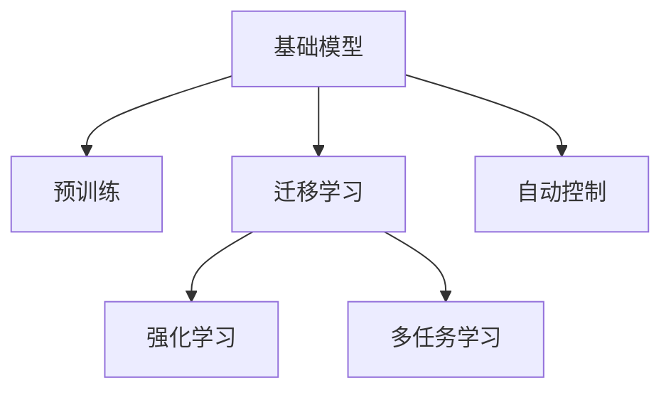

                 

# 基础模型的机器人学能力

> 关键词：基础模型, 机器人学, 机器学习, 强化学习, 迁移学习, 参数共享, 多任务学习, 自动控制, 应用案例

## 1. 背景介绍

### 1.1 问题由来

随着人工智能技术的不断进步，机器人学领域迎来了前所未有的发展机遇。传统的机器人学以机械设计、传感器和控制算法为核心，但缺乏对复杂环境与任务的智能理解与适应能力。近年来，随着深度学习和大规模预训练模型的发展，基础模型(如BERT、GPT等)开始被引入机器人学中，赋予机器人以更强的学习能力和智能推理能力。

基础模型通过在大规模数据上预训练，学习到了丰富的语言知识和常识，具备强大的语言理解和生成能力。这些模型能够被广泛应用于机器人与人类交互、环境感知、路径规划、任务执行等各个环节，大大提升了机器人的智能化水平和自动化能力。本文将系统介绍基础模型在机器人学中的应用，涵盖模型原理、算法实现、实际案例和未来展望等方面，以期为机器人学领域的从业者提供参考。

### 1.2 问题核心关键点

基础模型在机器人学中的核心关键点包括：

- 基础模型的预训练与迁移学习：通过在无标签数据上预训练，获得丰富的语言知识和常识，并在下游机器人学任务上进行迁移学习，提升模型的适应性和智能推理能力。

- 参数共享与多任务学习：利用基础模型共享的部分参数，在不同机器人学任务中取得良好的迁移效果，提高模型的资源利用率和泛化性能。

- 强化学习与自动控制：通过强化学习技术，让机器人自主学习决策策略，实现对复杂环境的自主适应和任务执行的自动化。

- 自监督学习与任务适配：利用自监督学习任务训练模型，并通过微调等方式对模型进行任务适配，增强模型的任务相关性和智能推理能力。

## 2. 核心概念与联系

### 2.1 核心概念概述

为了更好地理解基础模型在机器人学中的应用，本节将介绍几个密切相关的核心概念：

- 基础模型(Base Model)：如BERT、GPT等大规模预训练语言模型。通过在大规模无标签数据上进行预训练，学习通用的语言表示，具备强大的语言理解和生成能力。

- 迁移学习(Transfer Learning)：指将一个领域学习到的知识，迁移应用到另一个不同但相关的领域的学习范式。基础模型能够通过迁移学习，应用于机器人学中的各类任务，提升模型在特定任务上的表现。

- 强化学习(Reinforcement Learning)：一种通过智能体与环境的交互，在多次试错中学习最优决策策略的学习方法。在机器人学中，强化学习能够使机器人通过自主探索和试错，学习到更高效的行动策略。

- 多任务学习(Multi-task Learning)：指同时训练多个相关但不同的任务，利用共享的参数，提高模型在不同任务上的泛化性能。基础模型通过多任务学习，能够更高效地进行模型训练和迁移应用。

- 自动控制(Autonomous Control)：指机器人自主规划和执行控制策略，无需人工干预，能够适应动态环境变化，执行复杂任务。基础模型通过自动控制，能够使机器人自主适应环境，执行任务。

这些核心概念之间的逻辑关系可以通过以下Mermaid流程图来展示：



这个流程图展示的基础模型核心概念及其之间的关系：

1. 基础模型通过预训练获得基础能力。
2. 迁移学习使基础模型能够在机器人学中的下游任务上进行微调，提升模型性能。
3. 强化学习使机器人能够通过自主学习决策策略，实现自动控制。
4. 多任务学习使基础模型能够同时训练多个相关任务，提高模型的泛化性能。

## 3. 核心算法原理 & 具体操作步骤
### 3.1 算法原理概述

基础模型在机器人学中的应用主要基于迁移学习、强化学习和多任务学习的原理。其核心思想是：利用预训练基础模型中的通用知识，对特定机器人学任务进行微调，提升模型的适应性和智能推理能力。

具体而言，假设基础模型为 $M_{\theta}$，其中 $\theta$ 为预训练得到的模型参数。给定机器人学任务 $T$ 的标注数据集 $D=\{(x_i, y_i)\}_{i=1}^N$，模型的迁移学习目标是最小化损失函数：

$$
\hat{\theta}=\mathop{\arg\min}_{\theta} \mathcal{L}(M_{\theta},D)
$$

其中 $\mathcal{L}$ 为针对任务 $T$ 设计的损失函数，用于衡量模型预测输出与真实标签之间的差异。

通过梯度下降等优化算法，模型不断更新参数 $\theta$，最小化损失函数 $\mathcal{L}$，使得模型输出逼近真实标签。由于 $\theta$ 已经通过预训练获得了较好的初始化，因此即便在特定任务上标注数据量较小，也能较快收敛到理想模型参数 $\hat{\theta}$。

### 3.2 算法步骤详解

基础模型在机器人学中的应用，通常包括以下几个关键步骤：

**Step 1: 准备预训练模型和数据集**
- 选择合适的预训练语言模型 $M_{\theta}$ 作为初始化参数，如 BERT、GPT 等。
- 准备机器人学任务 $T$ 的标注数据集 $D$，划分为训练集、验证集和测试集。一般要求标注数据与预训练数据的分布不要差异过大。

**Step 2: 添加任务适配层**
- 根据任务类型，在预训练模型顶层设计合适的输出层和损失函数。
- 对于分类任务，通常在顶层添加线性分类器和交叉熵损失函数。
- 对于生成任务，通常使用语言模型的解码器输出概率分布，并以负对数似然为损失函数。

**Step 3: 设置迁移学习超参数**
- 选择合适的优化算法及其参数，如 AdamW、SGD 等，设置学习率、批大小、迭代轮数等。
- 设置正则化技术及强度，包括权重衰减、Dropout、Early Stopping等。
- 确定冻结预训练参数的策略，如仅微调顶层，或全部参数都参与迁移学习。

**Step 4: 执行迁移学习**
- 将训练集数据分批次输入模型，前向传播计算损失函数。
- 反向传播计算参数梯度，根据设定的优化算法和学习率更新模型参数。
- 周期性在验证集上评估模型性能，根据性能指标决定是否触发 Early Stopping。
- 重复上述步骤直到满足预设的迭代轮数或 Early Stopping 条件。

**Step 5: 测试和部署**
- 在测试集上评估迁移后模型 $M_{\hat{\theta}}$ 的性能，对比迁移前后的精度提升。
- 使用迁移后的模型对新样本进行推理预测，集成到实际的应用系统中。

以上是基础模型在机器人学中的应用一般流程。在实际应用中，还需要针对具体任务的特点，对迁移学习过程的各个环节进行优化设计，如改进训练目标函数，引入更多的正则化技术，搜索最优的超参数组合等，以进一步提升模型性能。

### 3.3 算法优缺点

基础模型在机器人学中的应用具有以下优点：
1. 简单高效。只需准备少量标注数据，即可对预训练模型进行快速适配，获得较大的性能提升。
2. 通用适用。适用于各种机器人学下游任务，包括分类、匹配、生成等，设计简单的任务适配层即可实现迁移学习。
3. 参数共享。利用基础模型共享的部分参数，在不同机器人学任务中取得良好的迁移效果，提高模型的资源利用率和泛化性能。
4. 效果显著。在学术界和工业界的诸多任务上，迁移学习的方法已经刷新了多项机器人学任务SOTA。

同时，该方法也存在一定的局限性：
1. 依赖标注数据。迁移学习的效果很大程度上取决于标注数据的质量和数量，获取高质量标注数据的成本较高。
2. 迁移能力有限。当目标任务与预训练数据的分布差异较大时，迁移学习的性能提升有限。
3. 可解释性不足。迁移后的模型决策过程通常缺乏可解释性，难以对其推理逻辑进行分析和调试。

尽管存在这些局限性，但就目前而言，迁移学习方法仍是大语言模型应用的最主流范式。未来相关研究的重点在于如何进一步降低迁移学习对标注数据的依赖，提高模型的少样本学习和跨领域迁移能力，同时兼顾可解释性和伦理安全性等因素。

### 3.4 算法应用领域

基础模型在机器人学中的应用已经涵盖了诸多领域，例如：

- 环境感知与地图构建：利用基础模型进行场景语义分割、对象检测、路径规划等任务。通过在标注数据上微调，使模型具备强大的环境感知能力。
- 语音识别与对话系统：通过将语音转换为文本，利用基础模型进行意图理解、对话生成等任务。在特定领域数据集上微调，提高模型的领域相关性和对话效果。
- 机器人控制与自主导航：利用基础模型进行机器人行为规划、路径规划等任务。在机器人控制任务上微调，使机器人能够自主适应动态环境，执行复杂任务。
- 动作识别与生成：利用基础模型进行人体动作识别、姿态估计等任务。在动作识别数据集上微调，提升模型对动作细节的理解和生成能力。
- 智能家居与健康监测：利用基础模型进行用户行为分析、健康监测等任务。在特定领域数据集上微调，提高模型的领域相关性和智能推理能力。

除了上述这些经典任务外，基础模型还被创新性地应用到更多场景中，如自主驾驶、智能客服、智能制造等，为机器人学技术带来了全新的突破。随着基础模型的不断发展，相信机器人学领域将迎来更多应用的可能，推动机器人技术向更高的智能化水平发展。

## 4. 数学模型和公式 & 详细讲解  
### 4.1 数学模型构建

本节将使用数学语言对基础模型在机器人学中的应用进行更加严格的刻画。

记基础模型为 $M_{\theta}$，其中 $\theta$ 为预训练得到的模型参数。假设迁移学习任务的训练集为 $D=\{(x_i,y_i)\}_{i=1}^N, x_i \in \mathcal{X}, y_i \in \mathcal{Y}$。

定义模型 $M_{\theta}$ 在数据样本 $(x,y)$ 上的损失函数为 $\ell(M_{\theta}(x),y)$，则在数据集 $D$ 上的经验风险为：

$$
\mathcal{L}(\theta) = \frac{1}{N} \sum_{i=1}^N \ell(M_{\theta}(x_i),y_i)
$$

迁移学习的优化目标是最小化经验风险，即找到最优参数：

$$
\theta^* = \mathop{\arg\min}_{\theta} \mathcal{L}(\theta)
$$

在实践中，我们通常使用基于梯度的优化算法（如SGD、Adam等）来近似求解上述最优化问题。设 $\eta$ 为学习率，$\lambda$ 为正则化系数，则参数的更新公式为：

$$
\theta \leftarrow \theta - \eta \nabla_{\theta}\mathcal{L}(\theta) - \eta\lambda\theta
$$

其中 $\nabla_{\theta}\mathcal{L}(\theta)$ 为损失函数对参数 $\theta$ 的梯度，可通过反向传播算法高效计算。

### 4.2 公式推导过程

以下我们以二分类任务为例，推导交叉熵损失函数及其梯度的计算公式。

假设模型 $M_{\theta}$ 在输入 $x$ 上的输出为 $\hat{y}=M_{\theta}(x) \in [0,1]$，表示样本属于正类的概率。真实标签 $y \in \{0,1\}$。则二分类交叉熵损失函数定义为：

$$
\ell(M_{\theta}(x),y) = -[y\log \hat{y} + (1-y)\log (1-\hat{y})]
$$

将其代入经验风险公式，得：

$$
\mathcal{L}(\theta) = -\frac{1}{N}\sum_{i=1}^N [y_i\log M_{\theta}(x_i)+(1-y_i)\log(1-M_{\theta}(x_i))]
$$

根据链式法则，损失函数对参数 $\theta_k$ 的梯度为：

$$
\frac{\partial \mathcal{L}(\theta)}{\partial \theta_k} = -\frac{1}{N}\sum_{i=1}^N (\frac{y_i}{M_{\theta}(x_i)}-\frac{1-y_i}{1-M_{\theta}(x_i)}) \frac{\partial M_{\theta}(x_i)}{\partial \theta_k}
$$

其中 $\frac{\partial M_{\theta}(x_i)}{\partial \theta_k}$ 可进一步递归展开，利用自动微分技术完成计算。

在得到损失函数的梯度后，即可带入参数更新公式，完成模型的迭代优化。重复上述过程直至收敛，最终得到适应下游任务的最优模型参数 $\theta^*$。

## 5. 项目实践：代码实例和详细解释说明
### 5.1 开发环境搭建

在进行迁移学习实践前，我们需要准备好开发环境。以下是使用Python进行PyTorch开发的环境配置流程：

1. 安装Anaconda：从官网下载并安装Anaconda，用于创建独立的Python环境。

2. 创建并激活虚拟环境：
```bash
conda create -n pytorch-env python=3.8 
conda activate pytorch-env
```

3. 安装PyTorch：根据CUDA版本，从官网获取对应的安装命令。例如：
```bash
conda install pytorch torchvision torchaudio cudatoolkit=11.1 -c pytorch -c conda-forge
```

4. 安装Transformers库：
```bash
pip install transformers
```

5. 安装各类工具包：
```bash
pip install numpy pandas scikit-learn matplotlib tqdm jupyter notebook ipython
```

完成上述步骤后，即可在`pytorch-env`环境中开始迁移学习实践。

### 5.2 源代码详细实现

这里我们以命名实体识别(NER)任务为例，给出使用Transformers库对BERT模型进行迁移学习的PyTorch代码实现。

首先，定义迁移学习任务的数据处理函数：

```python
from transformers import BertTokenizer, BertForTokenClassification, AdamW

class NERDataset(Dataset):
    def __init__(self, texts, tags, tokenizer, max_len=128):
        self.texts = texts
        self.tags = tags
        self.tokenizer = tokenizer
        self.max_len = max_len
        
    def __len__(self):
        return len(self.texts)
    
    def __getitem__(self, item):
        text = self.texts[item]
        tags = self.tags[item]
        
        encoding = self.tokenizer(text, return_tensors='pt', max_length=self.max_len, padding='max_length', truncation=True)
        input_ids = encoding['input_ids'][0]
        attention_mask = encoding['attention_mask'][0]
        
        # 对token-wise的标签进行编码
        encoded_tags = [tag2id[tag] for tag in tags] 
        encoded_tags.extend([tag2id['O']] * (self.max_len - len(encoded_tags)))
        labels = torch.tensor(encoded_tags, dtype=torch.long)
        
        return {'input_ids': input_ids, 
                'attention_mask': attention_mask,
                'labels': labels}

# 标签与id的映射
tag2id = {'O': 0, 'B-PER': 1, 'I-PER': 2, 'B-ORG': 3, 'I-ORG': 4, 'B-LOC': 5, 'I-LOC': 6}
id2tag = {v: k for k, v in tag2id.items()}

# 创建dataset
tokenizer = BertTokenizer.from_pretrained('bert-base-cased')

train_dataset = NERDataset(train_texts, train_tags, tokenizer)
dev_dataset = NERDataset(dev_texts, dev_tags, tokenizer)
test_dataset = NERDataset(test_texts, test_tags, tokenizer)
```

然后，定义迁移学习模型和优化器：

```python
model = BertForTokenClassification.from_pretrained('bert-base-cased', num_labels=len(tag2id))

optimizer = AdamW(model.parameters(), lr=2e-5)
```

接着，定义训练和评估函数：

```python
from torch.utils.data import DataLoader
from tqdm import tqdm
from sklearn.metrics import classification_report

device = torch.device('cuda') if torch.cuda.is_available() else torch.device('cpu')
model.to(device)

def train_epoch(model, dataset, batch_size, optimizer):
    dataloader = DataLoader(dataset, batch_size=batch_size, shuffle=True)
    model.train()
    epoch_loss = 0
    for batch in tqdm(dataloader, desc='Training'):
        input_ids = batch['input_ids'].to(device)
        attention_mask = batch['attention_mask'].to(device)
        labels = batch['labels'].to(device)
        model.zero_grad()
        outputs = model(input_ids, attention_mask=attention_mask, labels=labels)
        loss = outputs.loss
        epoch_loss += loss.item()
        loss.backward()
        optimizer.step()
    return epoch_loss / len(dataloader)

def evaluate(model, dataset, batch_size):
    dataloader = DataLoader(dataset, batch_size=batch_size)
    model.eval()
    preds, labels = [], []
    with torch.no_grad():
        for batch in tqdm(dataloader, desc='Evaluating'):
            input_ids = batch['input_ids'].to(device)
            attention_mask = batch['attention_mask'].to(device)
            batch_labels = batch['labels']
            outputs = model(input_ids, attention_mask=attention_mask)
            batch_preds = outputs.logits.argmax(dim=2).to('cpu').tolist()
            batch_labels = batch_labels.to('cpu').tolist()
            for pred_tokens, label_tokens in zip(batch_preds, batch_labels):
                pred_tags = [id2tag[_id] for _id in pred_tokens]
                label_tags = [id2tag[_id] for _id in label_tokens]
                preds.append(pred_tags[:len(label_tags)])
                labels.append(label_tags)
                
    print(classification_report(labels, preds))
```

最后，启动迁移学习流程并在测试集上评估：

```python
epochs = 5
batch_size = 16

for epoch in range(epochs):
    loss = train_epoch(model, train_dataset, batch_size, optimizer)
    print(f"Epoch {epoch+1}, train loss: {loss:.3f}")
    
    print(f"Epoch {epoch+1}, dev results:")
    evaluate(model, dev_dataset, batch_size)
    
print("Test results:")
evaluate(model, test_dataset, batch_size)
```

以上就是使用PyTorch对BERT进行命名实体识别任务迁移学习的完整代码实现。可以看到，得益于Transformers库的强大封装，我们可以用相对简洁的代码完成BERT模型的加载和迁移学习。

### 5.3 代码解读与分析

让我们再详细解读一下关键代码的实现细节：

**NERDataset类**：
- `__init__`方法：初始化文本、标签、分词器等关键组件。
- `__len__`方法：返回数据集的样本数量。
- `__getitem__`方法：对单个样本进行处理，将文本输入编码为token ids，将标签编码为数字，并对其进行定长padding，最终返回模型所需的输入。

**tag2id和id2tag字典**：
- 定义了标签与数字id之间的映射关系，用于将token-wise的预测结果解码回真实的标签。

**训练和评估函数**：
- 使用PyTorch的DataLoader对数据集进行批次化加载，供模型训练和推理使用。
- 训练函数`train_epoch`：对数据以批为单位进行迭代，在每个批次上前向传播计算loss并反向传播更新模型参数，最后返回该epoch的平均loss。
- 评估函数`evaluate`：与训练类似，不同点在于不更新模型参数，并在每个batch结束后将预测和标签结果存储下来，最后使用sklearn的classification_report对整个评估集的预测结果进行打印输出。

**迁移学习流程**：
- 定义总的epoch数和batch size，开始循环迭代
- 每个epoch内，先在训练集上训练，输出平均loss
- 在验证集上评估，输出分类指标
- 所有epoch结束后，在测试集上评估，给出最终测试结果

可以看到，PyTorch配合Transformers库使得BERT迁移学习的代码实现变得简洁高效。开发者可以将更多精力放在数据处理、模型改进等高层逻辑上，而不必过多关注底层的实现细节。

当然，工业级的系统实现还需考虑更多因素，如模型的保存和部署、超参数的自动搜索、更灵活的任务适配层等。但核心的迁移学习范式基本与此类似。

## 6. 实际应用场景
### 6.1 智能家居系统

基础模型在智能家居系统中，能够实现对用户行为的智能分析和健康监测。通过对用户日常生活的文本数据进行迁移学习，基础模型能够理解用户的作息习惯、健康状态、情感变化等信息，并据此提供个性化的家居控制建议和生活建议。

具体而言，可以收集用户与智能家居设备交互的日志数据，将对话和行为数据作为训练样本，利用基础模型进行意图理解、对话生成等任务。在特定领域数据集上微调，使模型具备强大的领域相关性和智能推理能力。利用迁移学习后模型，可以在用户表达需求时，智能推荐相应的家居控制指令，实现家庭自动化控制，提升用户生活质量。

### 6.2 医疗健康监控

在医疗健康监控领域，基础模型可以应用于智能诊断、病历记录、健康预测等任务。通过将医疗文本、病历数据作为迁移学习数据，利用基础模型进行自然语言处理，能够理解患者的症状描述、病史记录等，提供初步诊断和健康建议。

例如，在智能诊断任务中，基础模型可以通过迁移学习，学习到医学领域的专业术语和疾病知识，从而对患者的疾病描述进行智能分类，辅助医生进行初步诊断。在病历记录任务中，基础模型可以通过迁移学习，自动整理患者的病历记录，生成标准化的病历文本，提高医疗记录的准确性和效率。在健康预测任务中，基础模型可以通过迁移学习，利用患者的历史健康数据，预测未来健康趋势，提供个性化的健康管理建议。

### 6.3 自动驾驶系统

基础模型在自动驾驶系统中，能够实现对道路环境的智能感知和行为决策。通过对车载传感器数据和车载日志数据进行迁移学习，基础模型能够理解道路环境、交通信号、障碍物等场景信息，并据此生成最优的驾驶行为决策。

具体而言，可以收集车载传感器数据和车载日志数据，利用基础模型进行场景理解、行为决策等任务。在特定领域数据集上微调，使模型具备强大的领域相关性和智能推理能力。利用迁移学习后模型，可以在驾驶过程中，实时感知道路环境，智能规划路径，避免交通事故，提升驾驶安全性。

### 6.4 未来应用展望

随着基础模型的不断发展，其在机器人学中的应用将不断拓展，为机器人技术带来更多可能。

在智慧城市治理中，基础模型可以应用于智能交通管理、环境监测、应急指挥等环节，提高城市管理的自动化和智能化水平，构建更安全、高效的未来城市。

在工业自动化领域，基础模型可以应用于智能制造、智能物流、智能仓储等环节，实现工业流程的自动化控制和优化，提高生产效率，降低运营成本。

在金融、教育、娱乐等领域，基础模型可以应用于智能客服、智能辅导、智能推荐等任务，提升服务质量和用户体验，推动各行业的数字化转型升级。

此外，在农业、能源、航空航天等领域，基础模型也具备广泛的应用前景，为各行各业提供更高效、智能的解决方案。相信随着技术的不断演进，基础模型在机器人学领域将发挥更大的作用，推动机器人技术的进一步发展。

## 7. 工具和资源推荐
### 7.1 学习资源推荐

为了帮助开发者系统掌握基础模型在机器人学中的应用，这里推荐一些优质的学习资源：

1. 《Transformer从原理到实践》系列博文：由大模型技术专家撰写，深入浅出地介绍了Transformer原理、BERT模型、迁移学习等前沿话题。

2. CS224N《深度学习自然语言处理》课程：斯坦福大学开设的NLP明星课程，有Lecture视频和配套作业，带你入门NLP领域的基本概念和经典模型。

3. 《Natural Language Processing with Transformers》书籍：Transformers库的作者所著，全面介绍了如何使用Transformers库进行NLP任务开发，包括迁移学习在内的诸多范式。

4. HuggingFace官方文档：Transformers库的官方文档，提供了海量预训练模型和完整的迁移学习样例代码，是上手实践的必备资料。

5. CLUE开源项目：中文语言理解测评基准，涵盖大量不同类型的中文NLP数据集，并提供了基于迁移学习的baseline模型，助力中文NLP技术发展。

通过对这些资源的学习实践，相信你一定能够快速掌握基础模型在机器人学中的应用精髓，并用于解决实际的NLP问题。
###  7.2 开发工具推荐

高效的开发离不开优秀的工具支持。以下是几款用于基础模型迁移学习的常用工具：

1. PyTorch：基于Python的开源深度学习框架，灵活动态的计算图，适合快速迭代研究。大部分预训练语言模型都有PyTorch版本的实现。

2. TensorFlow：由Google主导开发的开源深度学习框架，生产部署方便，适合大规模工程应用。同样有丰富的预训练语言模型资源。

3. Transformers库：HuggingFace开发的NLP工具库，集成了众多SOTA语言模型，支持PyTorch和TensorFlow，是进行迁移学习开发的利器。

4. Weights & Biases：模型训练的实验跟踪工具，可以记录和可视化模型训练过程中的各项指标，方便对比和调优。与主流深度学习框架无缝集成。

5. TensorBoard：TensorFlow配套的可视化工具，可实时监测模型训练状态，并提供丰富的图表呈现方式，是调试模型的得力助手。

6. Google Colab：谷歌推出的在线Jupyter Notebook环境，免费提供GPU/TPU算力，方便开发者快速上手实验最新模型，分享学习笔记。

合理利用这些工具，可以显著提升基础模型迁移学习的开发效率，加快创新迭代的步伐。

### 7.3 相关论文推荐

基础模型在机器人学领域的研究源于学界的持续研究。以下是几篇奠基性的相关论文，推荐阅读：

1. Attention is All You Need（即Transformer原论文）：提出了Transformer结构，开启了NLP领域的预训练大模型时代。

2. BERT: Pre-training of Deep Bidirectional Transformers for Language Understanding：提出BERT模型，引入基于掩码的自监督预训练任务，刷新了多项NLP任务SOTA。

3. Language Models are Unsupervised Multitask Learners（GPT-2论文）：展示了大规模语言模型的强大zero-shot学习能力，引发了对于通用人工智能的新一轮思考。

4. Parameter-Efficient Transfer Learning for NLP：提出Adapter等参数高效微调方法，在不增加模型参数量的情况下，也能取得不错的迁移学习效果。

5. AdaLoRA: Adaptive Low-Rank Adaptation for Parameter-Efficient Fine-Tuning：使用自适应低秩适应的迁移学习方法，在参数效率和精度之间取得了新的平衡。

这些论文代表了大语言模型迁移学习的发展脉络。通过学习这些前沿成果，可以帮助研究者把握学科前进方向，激发更多的创新灵感。

## 8. 总结：未来发展趋势与挑战

### 8.1 总结

本文对基础模型在机器人学中的应用进行了全面系统的介绍。首先阐述了基础模型的预训练与迁移学习、参数共享和多任务学习、强化学习与自动控制的原理，明确了基础模型在机器人学中的核心关键点。其次，从原理到实践，详细讲解了迁移学习的数学模型和关键步骤，给出了迁移学习任务开发的完整代码实例。同时，本文还广泛探讨了基础模型在智能家居、医疗健康、自动驾驶等领域的实际应用场景，展示了基础模型的巨大潜力。此外，本文精选了迁移学习的各类学习资源，力求为开发者提供全方位的技术指引。

通过本文的系统梳理，可以看到，基础模型在机器人学中的应用正在成为机器人学领域的重要范式，极大地拓展了预训练语言模型的应用边界，催生了更多的落地场景。受益于大规模语料的预训练，基础模型在迁移学习中的表现，显著提升了机器人学系统的智能化水平和自动化能力。未来，伴随基础模型的不断发展，基于迁移学习的方法必将在机器人学领域得到更广泛的应用，推动机器人技术的进一步发展。

### 8.2 未来发展趋势

展望未来，基础模型在机器人学中的应用将呈现以下几个发展趋势：

1. 模型规模持续增大。随着算力成本的下降和数据规模的扩张，预训练基础模型参数量还将持续增长。超大规模基础模型蕴含的丰富语言知识，有望支撑更加复杂多变的机器人学任务迁移学习。

2. 迁移方法日趋多样。除了传统的迁移学习外，未来会涌现更多参数高效的迁移方法，如Parameter-Efficient Transfer Learning、AdaLoRA等，在节省计算资源的同时也能保证迁移精度。

3. 强化学习与自动控制更深入结合。未来的机器人学系统将更加依赖强化学习进行决策，基础模型将更好地与强化学习技术结合，提升系统自主适应环境和执行任务的能力。

4. 持续学习成为常态。随着数据分布的不断变化，基础模型也需要持续学习新知识以保持性能。如何在不遗忘原有知识的同时，高效吸收新样本信息，将成为重要的研究课题。

5. 标注样本需求降低。受启发于提示学习(Prompt-based Learning)的思路，未来的迁移学习方法将更好地利用基础模型语言理解能力，通过更加巧妙的任务描述，在更少的标注样本上也能实现理想的迁移学习效果。

6. 多模态迁移学习崛起。当前迁移学习主要聚焦于文本数据，未来会进一步拓展到图像、视频、语音等多模态数据迁移。多模态信息的融合，将显著提升基础模型的环境和任务理解能力。

以上趋势凸显了基础模型在机器人学中的应用前景。这些方向的探索发展，必将进一步提升机器人学系统的性能和应用范围，为机器人技术带来新的突破。

### 8.3 面临的挑战

尽管基础模型在机器人学中的应用已经取得了瞩目成就，但在迈向更加智能化、普适化应用的过程中，它仍面临着诸多挑战：

1. 标注成本瓶颈。尽管迁移学习已经降低了标注数据的需求，但对于长尾应用场景，获取高质量标注数据仍是成本较高的问题。如何进一步降低迁移学习对标注样本的依赖，将是一大难题。

2. 模型鲁棒性不足。当前迁移模型面对域外数据时，泛化性能往往大打折扣。对于测试样本的微小扰动，迁移模型的预测也容易发生波动。如何提高迁移模型的鲁棒性，避免灾难性遗忘，还需要更多理论和实践的积累。

3. 推理效率有待提高。大规模基础模型虽然精度高，但在实际部署时往往面临推理速度慢、内存占用大等效率问题。如何在保证性能的同时，简化模型结构，提升推理速度，优化资源占用，将是重要的优化方向。

4. 可解释性亟需加强。当前迁移模型更像是"黑盒"系统，难以解释其内部工作机制和决策逻辑。对于医疗、金融等高风险应用，算法的可解释性和可审计性尤为重要。如何赋予迁移模型更强的可解释性，将是亟待攻克的难题。

5. 安全性有待保障。预训练基础模型难免会学习到有偏见、有害的信息，通过迁移传递到下游任务，产生误导性、歧视性的输出，给实际应用带来安全隐患。如何从数据和算法层面消除模型偏见，避免恶意用途，确保输出的安全性，也将是重要的研究课题。

6. 知识整合能力不足。现有的迁移模型往往局限于任务内数据，难以灵活吸收和运用更广泛的先验知识。如何让迁移过程更好地与外部知识库、规则库等专家知识结合，形成更加全面、准确的信息整合能力，还有很大的想象空间。

正视迁移学习面临的这些挑战，积极应对并寻求突破，将是大语言模型迁移学习走向成熟的必由之路。相信随着学界和产业界的共同努力，这些挑战终将一一被克服，基础模型在机器人学中的应用必将在构建人机协同的智能时代中扮演越来越重要的角色。

### 8.4 未来突破

面对基础模型在机器人学中面临的种种挑战，未来的研究需要在以下几个方面寻求新的突破：

1. 探索无监督和半监督迁移方法。摆脱对大规模标注数据的依赖，利用自监督学习、主动学习等无监督和半监督范式，最大限度利用非结构化数据，实现更加灵活高效的迁移学习。

2. 研究参数高效和计算高效的迁移范式。开发更加参数高效的迁移方法，在固定大部分预训练参数的同时，只更新极少量的任务相关参数。同时优化迁移模型的计算图，减少前向传播和反向传播的资源消耗，实现更加轻量级、实时性的部署。

3. 融合因果和对比学习范式。通过引入因果推断和对比学习思想，增强迁移模型建立稳定因果关系的能力，学习更加普适、鲁棒的语言表征，从而提升模型泛化性和抗干扰能力。

4. 引入更多先验知识。将符号化的先验知识，如知识图谱、逻辑规则等，与神经网络模型进行巧妙融合，引导迁移过程学习更准确、合理的语言模型。同时加强不同模态数据的整合，实现视觉、语音等多模态信息与文本信息的协同建模。

5. 结合因果分析和博弈论工具。将因果分析方法引入迁移模型，识别出模型决策的关键特征，增强输出解释的因果性和逻辑性。借助博弈论工具刻画人机交互过程，主动探索并规避模型的脆弱点，提高系统稳定性。

6. 纳入伦理道德约束。在迁移学习目标中引入伦理导向的评估指标，过滤和惩罚有偏见、有害的输出倾向。同时加强人工干预和审核，建立模型行为的监管机制，确保输出符合人类价值观和伦理道德。

这些研究方向的探索，必将引领基础模型在机器人学领域迈向更高的台阶，为构建安全、可靠、可解释、可控的智能系统铺平道路。面向未来，基础模型在机器人学领域还需要与其他人工智能技术进行更深入的融合，如知识表示、因果推理、强化学习等，多路径协同发力，共同推动自然语言理解和智能交互系统的进步。只有勇于创新、敢于突破，才能不断拓展语言模型的边界，让智能技术更好地造福人类社会。

## 9. 附录：常见问题与解答

**Q1：基础模型的迁移学习是否适用于所有机器人学任务？**

A: 基础模型的迁移学习在大多数机器人学下游任务上都能取得不错的效果，特别是对于数据量较小的任务。但对于一些特定领域的任务，如医学、法律等，仅仅依靠通用语料预训练的模型可能难以很好地适应。此时需要在特定领域语料上进一步预训练，再进行迁移学习，才能获得理想效果。此外，对于一些需要时效性、个性化很强的任务，如对话、推荐等，迁移方法也需要针对性的改进优化。

**Q2：迁移学习过程中如何选择合适的学习率？**

A: 迁移学习的学习率一般要比预训练时小1-2个数量级，如果使用过大的学习率，容易破坏预训练权重，导致过拟合。一般建议从1e-5开始调参，逐步减小学习率，直至收敛。也可以使用warmup策略，在开始阶段使用较小的学习率，再逐渐过渡到预设值。需要注意的是，不同的优化器(如AdamW、Adafactor等)以及不同的学习率调度策略，可能需要设置不同的学习率阈值。

**Q3：迁移学习过程中面临哪些资源瓶颈？**

A: 目前主流的预训练基础模型动辄以亿计的参数规模，对算力、内存、存储都提出了很高的要求。GPU/TPU等高性能设备是必不可少的，但即便如此，超大批次的训练和推理也可能遇到显存不足的问题。因此需要采用一些资源优化技术，如梯度积累、混合精度训练、模型并行等，来突破硬件瓶颈。同时，模型的存储和读取也可能占用大量时间和空间，需要采用模型压缩、稀疏化存储等方法进行优化。

**Q4：如何缓解迁移学习过程中的过拟合问题？**

A: 过拟合是迁移学习面临的主要挑战，尤其是在标注数据不足的情况下。常见的缓解策略包括：
1. 数据增强：通过回译、近义替换等方式扩充训练集
2. 正则化：使用L2正则、Dropout、Early Stopping等避免过拟合
3. 对抗训练：引入对抗样本，提高模型鲁棒性
4. 参数高效迁移：只调整少量参数(如Adapter、Prefix等)，减小过拟合风险
5. 多模型集成：训练多个迁移模型，取平均输出，抑制过拟合

这些策略往往需要根据具体任务和数据特点进行灵活组合。只有在数据、模型、训练、推理等各环节进行全面优化，才能最大限度地发挥基础模型迁移学习的威力。

**Q5：迁移学习模型在落地部署时需要注意哪些问题？**

A: 将迁移学习模型转化为实际应用，还需要考虑以下因素：
1. 模型裁剪：去除不必要的层和参数，减小模型尺寸，加快推理速度
2. 量化加速：将浮点模型转为定点模型，压缩存储空间，提高计算效率
3. 服务化封装：将模型封装为标准化服务接口，便于集成调用
4. 弹性伸缩：根据请求流量动态调整资源配置，平衡服务质量和成本
5. 监控告警：实时采集系统指标，设置异常告警阈值，确保服务稳定性
6. 安全防护：采用访问鉴权、数据脱敏等措施，保障数据和模型安全

基础模型迁移学习为机器人学应用开启了广阔的想象空间，但如何将强大的性能转化为稳定、高效、安全的业务价值，还需要工程实践的不断打磨。唯有从数据、算法、工程、业务等多个维度协同发力，才能真正实现人工智能技术在垂直行业的规模化落地。总之，迁移学习需要开发者根据具体任务，不断迭代和优化模型、数据和算法，方能得到理想的效果。

---

作者：禅与计算机程序设计艺术 / Zen and the Art of Computer Programming

