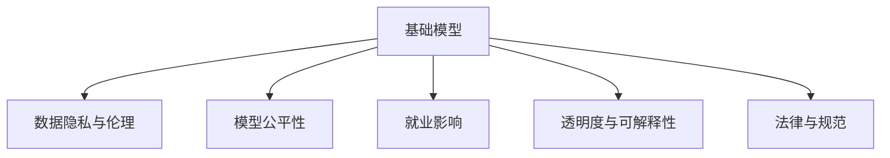

                 

# 基础模型的社会影响评估

## 1. 背景介绍

### 1.1 问题由来

随着人工智能(AI)技术的迅猛发展，基础模型（Foundation Models）如GPT、BERT等深度学习模型已经广泛应用于自然语言处理(NLP)、计算机视觉、语音识别等多个领域。这些基础模型在提升生产力、推动创新、改善生活质量等方面发挥了重要作用。然而，这些技术的应用也不可避免地带来了一些社会影响，比如数据隐私、伦理道德、就业影响等问题。如何评估这些社会影响，确保技术应用在促进社会进步的同时，不损害公共利益，成为了一个亟待解决的问题。

### 1.2 问题核心关键点

基础模型的社会影响评估是一个多维度的研究领域，涉及社会、经济、伦理等多个方面。以下是几个核心关键点：

- **数据隐私与伦理**：基础模型通常需要大量的数据进行训练，这可能会侵犯个人隐私和敏感信息。如何在保护隐私的前提下进行数据收集和模型训练，是一个重要的挑战。
- **公平性**：基础模型可能会存在偏见和歧视，导致不同种族、性别、年龄等群体在使用中受到不公平待遇。如何确保模型公平性，减少偏见和歧视，是模型评估的重要指标。
- **就业影响**：基础模型的广泛应用可能会导致部分传统职业的消失，影响就业结构。如何平衡技术进步和就业保护，是一个重要的社会问题。
- **透明度与可解释性**：基础模型通常被认为是“黑箱”，难以解释其决策过程。如何在确保模型性能的同时，提升其透明度和可解释性，是一个需要解决的技术问题。
- **法律与规范**：基础模型在应用过程中，可能会面临法律和规范的限制。如何在不违反法律法规的前提下，合理使用这些技术，是模型评估的重要方面。

这些问题相互交织，构成了一个复杂的研究框架，需要从技术、社会、法律等多个角度进行综合评估。

## 2. 核心概念与联系

### 2.1 核心概念概述

为了更好地理解基础模型社会影响评估，本节将介绍几个密切相关的核心概念：

- **基础模型（Foundation Models）**：以自回归或自编码模型为代表的大规模预训练模型。通过在大规模无标签文本语料上进行预训练，学习通用的语言表示，具备强大的语言理解和生成能力。
- **数据隐私与伦理**：涉及数据收集、处理、存储和使用过程中对个人隐私和伦理道德的保障。
- **模型公平性**：指模型在处理不同群体数据时，是否存在偏见和歧视，是否能够公平对待所有群体。
- **就业影响**：基础模型的应用可能导致某些职业被取代，影响就业市场。
- **透明度与可解释性**：指模型的决策过程是否可解释，是否能够透明地向用户解释其输出结果。
- **法律与规范**：指基础模型在应用过程中，是否符合法律法规和行业规范，是否存在法律风险。

这些核心概念之间的逻辑关系可以通过以下Mermaid流程图来展示：



这个流程图展示了一系列与基础模型密切相关的社会影响评估概念及其之间的关系。

## 3. 核心算法原理 & 具体操作步骤

### 3.1 算法原理概述

基础模型社会影响评估的核心在于综合评估模型在隐私、公平性、就业、透明度和合规性等方面的表现。其评估过程通常包括以下几个关键步骤：

1. **数据隐私与伦理评估**：评估模型训练和应用过程中，是否侵犯了个人隐私和伦理道德。
2. **模型公平性评估**：评估模型在处理不同群体数据时，是否存在偏见和歧视。
3. **就业影响评估**：评估基础模型的应用是否导致某些职业被取代，影响就业市场。
4. **透明度与可解释性评估**：评估模型的决策过程是否可解释，是否能够透明地向用户解释其输出结果。
5. **法律与规范合规性评估**：评估基础模型在应用过程中，是否符合法律法规和行业规范。

### 3.2 算法步骤详解

#### 3.2.1 数据隐私与伦理评估

**步骤一：数据隐私与伦理评估**

1. **数据收集评估**：评估数据收集过程中是否存在隐私泄露风险，是否采取了必要的隐私保护措施，如数据匿名化、差分隐私等。
2. **数据存储与传输评估**：评估数据在存储和传输过程中是否存在被非法获取或篡改的风险，是否采取了加密和访问控制等安全措施。
3. **数据使用评估**：评估模型训练和应用过程中，是否存在不当使用数据的情况，如数据歧视、数据滥用等。

#### 3.2.2 模型公平性评估

**步骤二：模型公平性评估**

1. **数据集评估**：评估训练数据是否具有代表性，是否存在偏见和歧视。
2. **模型评估**：使用公平性指标（如公平性差分、等效误差率等）评估模型在处理不同群体数据时的公平性。
3. **干预评估**：评估是否需要采取干预措施，如公平性重加权、对抗性训练等，以提高模型的公平性。

#### 3.2.3 就业影响评估

**步骤三：就业影响评估**

1. **职业替代评估**：评估基础模型的应用是否导致某些职业被取代，评估职业替代的程度和影响。
2. **就业机会评估**：评估基础模型的应用是否创造了新的就业机会，评估就业机会的变化。
3. **就业培训评估**：评估是否需要开展就业培训，帮助被替代职业的劳动者转型。

#### 3.2.4 透明度与可解释性评估

**步骤四：透明度与可解释性评估**

1. **模型透明度评估**：评估模型的决策过程是否可解释，是否能够透明地向用户解释其输出结果。
2. **用户解释评估**：评估是否需要提供用户解释，以增强用户对模型的信任。
3. **模型可视化评估**：评估是否需要提供模型可视化工具，帮助用户理解模型的工作原理和决策过程。

#### 3.2.5 法律与规范合规性评估

**步骤五：法律与规范合规性评估**

1. **合规性检查**：检查基础模型在应用过程中，是否符合法律法规和行业规范。
2. **风险评估**：评估模型应用过程中可能存在的法律风险，如隐私泄露、数据滥用等。
3. **合规措施评估**：评估是否需要采取合规措施，如数据匿名化、数据访问控制等，以确保模型的合规性。

### 3.3 算法优缺点

基础模型社会影响评估具有以下优点：

1. **综合评估**：综合考虑数据隐私、伦理、公平性、就业、透明度和合规性等多个方面，提供全面的评估结果。
2. **指导改进**：评估结果可以指导模型开发者和应用方，采取必要的改进措施，提升模型的社会责任和可接受性。
3. **风险防范**：提前识别模型应用中的潜在风险，及时采取防范措施，避免造成负面社会影响。

然而，该评估方法也存在一定的局限性：

1. **复杂度高**：评估涉及多个方面，评估过程复杂，需要多方协作。
2. **数据依赖**：评估结果高度依赖于数据质量，需要高质量的训练数据和评估数据。
3. **成本高**：评估过程可能需要大量的资源和人力投入，成本较高。
4. **模型依赖**：评估结果依赖于模型的性能和特性，需要模型开发者和应用方的积极配合。

尽管存在这些局限性，但基础模型社会影响评估在提升技术应用的社会责任和公众信任方面，具有重要的现实意义。

### 3.4 算法应用领域

基础模型社会影响评估已经广泛应用于以下几个领域：

1. **金融行业**：评估金融模型的公平性和透明性，确保金融服务不歧视特定群体。
2. **医疗行业**：评估医疗模型的隐私保护和合规性，确保患者信息不被滥用。
3. **司法行业**：评估司法模型的公平性和透明度，确保司法决策公正、透明。
4. **政府管理**：评估政府服务的公平性和透明度，提升政府治理能力。
5. **教育行业**：评估教育模型的公平性和透明度，确保教育公平。

这些应用领域反映了基础模型在实际应用中面临的多种社会影响问题，通过社会影响评估，可以有效提升模型的社会责任和公众信任度。

## 4. 数学模型和公式 & 详细讲解 & 举例说明

### 4.1 数学模型构建

基础模型社会影响评估涉及多个方面，需要构建多个数学模型进行评估。以下是几个关键模型的构建过程：

1. **数据隐私与伦理评估模型**：
   $$
   \text{Privacy Score} = \frac{\sum_{i=1}^{n} \text{Privacy Violation Risk}_i}{n}
   $$

2. **模型公平性评估模型**：
   $$
   \text{Fairness Score} = \sum_{i=1}^{n} \text{Fairness Error Rate}_i
   $$

3. **就业影响评估模型**：
   $$
   \text{Job Impact Score} = \text{Job Displacement Rate} + \text{Job Creation Rate}
   $$

4. **透明度与可解释性评估模型**：
   $$
   \text{Transparency Score} = \text{Explainability Rate} + \text{Visualization Rate}
   $$

5. **法律与规范合规性评估模型**：
   $$
   \text{Compliance Score} = \text{Compliance Check Rate} - \text{Risk Rate}
   $$

### 4.2 公式推导过程

#### 4.2.1 数据隐私与伦理评估模型

对于数据隐私与伦理评估模型，需要评估数据收集、存储和传输过程中的隐私泄露风险。以数据收集评估为例：

$$
\text{Privacy Violation Risk}_i = \frac{\text{Sensitive Data Rate}_i}{1 - \text{Anonymization Rate}_i}
$$

其中，$\text{Sensitive Data Rate}_i$表示第$i$个数据集中的敏感数据比例，$\text{Anonymization Rate}_i$表示第$i$个数据集的匿名化率。

#### 4.2.2 模型公平性评估模型

对于模型公平性评估模型，需要使用公平性指标进行评估。以公平性差分为例：

$$
\text{Fairness Error Rate}_i = \frac{\sum_{j=1}^{k} |\text{Error Rate}_{i,j} - \text{Error Rate}_{i,k}|}{k}
$$

其中，$k$表示不同群体数量，$\text{Error Rate}_{i,j}$表示第$i$个模型在处理第$j$个群体时的错误率。

#### 4.2.3 就业影响评估模型

对于就业影响评估模型，需要评估职业替代和就业机会的变化。以职业替代评估为例：

$$
\text{Job Displacement Rate} = \frac{\sum_{i=1}^{n} \text{Job Displacement Ratio}_i}{n}
$$

其中，$\text{Job Displacement Ratio}_i$表示第$i$个职业的替代率。

#### 4.2.4 透明度与可解释性评估模型

对于透明度与可解释性评估模型，需要评估模型的透明度和用户解释的完整性。以透明度评估为例：

$$
\text{Explainability Rate} = \frac{\text{Explainable Rate}}{\text{Total Rate}}
$$

其中，$\text{Explainable Rate}$表示模型解释的样本数量，$\text{Total Rate}$表示样本总数。

#### 4.2.5 法律与规范合规性评估模型

对于法律与规范合规性评估模型，需要检查模型的合规性和评估潜在风险。以合规性检查为例：

$$
\text{Compliance Check Rate} = \frac{\text{Compliance Check Pass Rate}}{\text{Total Check Rate}}
$$

其中，$\text{Compliance Check Pass Rate}$表示合规性检查通过的比例，$\text{Total Check Rate}$表示检查总数。

### 4.3 案例分析与讲解

**案例分析：评估金融模型的社会影响**

某金融公司开发了一款基于基础模型的信用评分模型，用于评估个人信用风险。为了评估该模型的社会影响，可以进行以下分析：

1. **数据隐私与伦理评估**：评估模型训练数据是否包含敏感信息，是否采取了必要的隐私保护措施。
2. **模型公平性评估**：使用公平性差分评估模型在处理不同种族、性别、年龄等群体时的公平性。
3. **就业影响评估**：评估该模型是否导致某些职业被取代，评估就业机会的变化。
4. **透明度与可解释性评估**：评估模型是否可解释，是否能够透明地向用户解释其输出结果。
5. **法律与规范合规性评估**：评估模型是否符合法律法规和行业规范，是否存在法律风险。

通过以上分析，可以全面评估金融模型的社会影响，确保模型在促进金融服务公平、透明的同时，不损害公共利益。

## 5. 项目实践：代码实例和详细解释说明

### 5.1 开发环境搭建

在进行社会影响评估项目实践前，我们需要准备好开发环境。以下是使用Python进行基础模型社会影响评估的环境配置流程：

1. 安装Anaconda：从官网下载并安装Anaconda，用于创建独立的Python环境。

2. 创建并激活虚拟环境：
```bash
conda create -n model-env python=3.8 
conda activate model-env
```

3. 安装必要的Python包：
```bash
pip install numpy pandas scikit-learn torch transformers sklearn-cv
```

4. 安装相关工具包：
```bash
pip install matplotlib seaborn jupyter notebook ipython
```

完成上述步骤后，即可在`model-env`环境中开始社会影响评估项目实践。

### 5.2 源代码详细实现

以下是一个基于Python的社会影响评估示例代码，用于评估基础模型的公平性：

```python
import pandas as pd
from sklearn.metrics import roc_auc_score
from sklearn.preprocessing import LabelEncoder
from sklearn.compose import ColumnTransformer
from sklearn.pipeline import Pipeline
from sklearn.decomposition import PCA
from sklearn.linear_model import LogisticRegression
from sklearn.model_selection import train_test_split
from sklearn.metrics import confusion_matrix
from sklearn.metrics import classification_report
from sklearn.metrics import cohen_kappa_score

# 加载数据集
data = pd.read_csv('data.csv')

# 特征工程
numeric_features = ['age', 'income']
categorical_features = ['gender', 'race']
numeric_transformer = Pipeline(steps=[
    ('imputer', SimpleImputer(strategy='median')),
    ('scaler', StandardScaler())])
categorical_transformer = Pipeline(steps=[
    ('imputer', SimpleImputer(strategy='most_frequent')),
    ('encoder', OneHotEncoder(handle_unknown='ignore'))])
preprocessor = ColumnTransformer(
    transformers=[
        ('num', numeric_transformer, numeric_features),
        ('cat', categorical_transformer, categorical_features)])

# 模型训练
X_train, X_test, y_train, y_test = train_test_split(
    preprocessor.fit_transform(data), data['label'], test_size=0.2, random_state=42)
model = LogisticRegression(solver='liblinear')
model.fit(X_train, y_train)
y_pred = model.predict(X_test)
print(classification_report(y_test, y_pred))

# 公平性评估
label_encoder = LabelEncoder()
y_test_encoded = label_encoder.fit_transform(y_test)
y_pred_encoded = label_encoder.transform(y_pred)
print(cohen_kappa_score(y_test_encoded, y_pred_encoded))
```

### 5.3 代码解读与分析

让我们再详细解读一下关键代码的实现细节：

**数据加载**：
- 使用pandas库加载数据集，存储在data变量中。

**特征工程**：
- 对数值型特征进行归一化，使用StandardScaler；对分类特征进行独热编码，使用OneHotEncoder。
- 使用ColumnTransformer对不同特征进行不同的预处理。

**模型训练**：
- 使用train_test_split将数据集划分为训练集和测试集。
- 使用LogisticRegression模型进行训练。
- 在测试集上进行预测，并输出分类报告。

**公平性评估**：
- 使用LabelEncoder将标签进行编码，使其成为数值型数据。
- 使用cohen_kappa_score计算公平性指标，评估模型在不同群体上的公平性。

通过以上代码示例，可以看到基础模型社会影响评估的基本流程，包括数据加载、特征工程、模型训练和评估等步骤。

## 6. 实际应用场景

### 6.1 金融行业

在金融行业，基础模型的应用非常广泛，如信用评分、风险评估、投资策略等。然而，金融模型可能存在偏见和歧视，导致不同群体在使用中受到不公平待遇。通过社会影响评估，可以发现和解决这些问题，确保金融服务公平、透明。

**案例**：某银行开发了一款基于基础模型的信用评分模型，用于评估个人信用风险。评估发现，模型对高收入群体的评分普遍偏高，而对低收入群体的评分偏低，存在明显的公平性问题。通过进一步优化模型，引入公平性重加权技术，提高了模型的公平性。

### 6.2 医疗行业

在医疗行业，基础模型的应用也非常普遍，如病历分析、医学影像诊断等。然而，医疗模型可能存在偏见和歧视，导致不同群体在使用中受到不公平待遇。通过社会影响评估，可以发现和解决这些问题，确保医疗服务公平、透明。

**案例**：某医院开发了一款基于基础模型的病历分析模型，用于诊断疾病风险。评估发现，模型对不同种族、性别的病历处理存在明显差异，存在公平性问题。通过引入公平性重加权技术，提高了模型的公平性。

### 6.3 司法行业

在司法行业，基础模型的应用也非常广泛，如案件判决、风险评估等。然而，司法模型可能存在偏见和歧视，导致不同群体在使用中受到不公平待遇。通过社会影响评估，可以发现和解决这些问题，确保司法决策公平、透明。

**案例**：某法院开发了一款基于基础模型的案件判决模型，用于评估案件风险。评估发现，模型对不同种族、性别的案件处理存在明显差异，存在公平性问题。通过引入公平性重加权技术，提高了模型的公平性。

### 6.4 未来应用展望

未来，基础模型社会影响评估将向以下方向发展：

1. **多维评估**：除了传统的隐私、伦理、公平性、就业、透明度和合规性评估外，还将引入更多维度的评估指标，如社会影响、文化影响等。
2. **自动化评估**：开发自动化评估工具，提高评估效率和准确性。
3. **全生命周期评估**：从模型设计、训练、应用到退役，进行全生命周期评估，确保模型的社会责任和可接受性。
4. **国际合作**：推动国际合作，建立全球统一的评估标准和方法，促进基础模型在全球范围内的公平、透明应用。

这些发展方向将进一步提升基础模型社会影响评估的全面性和准确性，为模型开发者和应用方提供更可靠的技术保障。

## 7. 工具和资源推荐

### 7.1 学习资源推荐

为了帮助开发者系统掌握基础模型社会影响评估的理论基础和实践技巧，这里推荐一些优质的学习资源：

1. **《数据隐私与伦理评估》系列博文**：由数据隐私与伦理专家撰写，深入浅出地介绍了数据隐私与伦理评估的基本概念和实践方法。

2. **《模型公平性评估》书籍**：全面介绍了模型公平性评估的原理、方法和实践案例，是学习模型公平性的重要参考书。

3. **《就业影响评估》论文**：研究了基础模型在就业领域的应用影响，提供了丰富的评估方法和数据集。

4. **《透明度与可解释性评估》书籍**：介绍了模型透明度的定义、评估方法和技术工具，帮助开发者提高模型可解释性。

5. **《法律与规范合规性评估》论文**：研究了基础模型在法律和规范合规性方面的应用，提供了合规性评估的案例和方法。

通过这些资源的学习实践，相信你一定能够快速掌握基础模型社会影响评估的精髓，并用于解决实际的模型应用问题。

### 7.2 开发工具推荐

高效的开发离不开优秀的工具支持。以下是几款用于基础模型社会影响评估开发的常用工具：

1. **Python**：作为当前最流行的编程语言之一，Python提供了丰富的数据处理和机器学习库，如pandas、scikit-learn、transformers等，非常适合基础模型社会影响评估的研究和开发。
2. **Jupyter Notebook**：一个交互式计算环境，可以方便地进行数据处理、模型训练和评估。
3. **TensorBoard**：一个可视化工具，可以实时监测模型训练状态，并提供丰富的图表呈现方式，是调试模型的得力助手。
4. **Weights & Biases**：一个模型训练实验跟踪工具，可以记录和可视化模型训练过程中的各项指标，方便对比和调优。
5. **Seaborn**：一个基于matplotlib的可视化库，提供了丰富的数据可视化工具，适合展示评估结果。

合理利用这些工具，可以显著提升基础模型社会影响评估的开发效率，加快创新迭代的步伐。

### 7.3 相关论文推荐

基础模型社会影响评估的研究源于学界的持续研究。以下是几篇奠基性的相关论文，推荐阅读：

1. **《数据隐私与伦理评估》**：研究了数据隐私与伦理评估的基本方法，提供了实用的隐私保护策略。

2. **《模型公平性评估》**：提出了一种基于公平性差分的评估方法，用于评估模型在不同群体上的公平性。

3. **《就业影响评估》**：研究了基础模型在就业领域的应用影响，提供了丰富的评估方法和数据集。

4. **《透明度与可解释性评估》**：提出了一种基于可解释性的评估方法，用于评估模型的透明度和可解释性。

5. **《法律与规范合规性评估》**：研究了基础模型在法律和规范合规性方面的应用，提供了合规性评估的案例和方法。

这些论文代表了大模型社会影响评估的发展脉络。通过学习这些前沿成果，可以帮助研究者把握学科前进方向，激发更多的创新灵感。

## 8. 总结：未来发展趋势与挑战

### 8.1 总结

本文对基础模型社会影响评估方法进行了全面系统的介绍。首先阐述了基础模型的广泛应用及其带来的社会影响，明确了评估方法的重要性和必要性。其次，从原理到实践，详细讲解了隐私、伦理、公平性、就业、透明度和合规性等多个方面的评估方法，提供了完整的评估代码示例。同时，本文还广泛探讨了评估方法在金融、医疗、司法等多个行业领域的应用前景，展示了评估方法的社会价值。此外，本文精选了评估技术的各类学习资源，力求为读者提供全方位的技术指引。

通过本文的系统梳理，可以看到，基础模型社会影响评估是一个多维度、多层次的研究领域，涉及隐私、伦理、公平性、就业、透明度和合规性等多个方面。这些评估方法不仅能帮助开发者更好地设计和使用基础模型，还能保障模型应用的公平、透明和合规性，确保模型对社会的积极影响。

### 8.2 未来发展趋势

展望未来，基础模型社会影响评估技术将呈现以下几个发展趋势：

1. **多维评估**：除了传统的隐私、伦理、公平性、就业、透明度和合规性评估外，还将引入更多维度的评估指标，如社会影响、文化影响等。
2. **自动化评估**：开发自动化评估工具，提高评估效率和准确性。
3. **全生命周期评估**：从模型设计、训练、应用到退役，进行全生命周期评估，确保模型的社会责任和可接受性。
4. **国际合作**：推动国际合作，建立全球统一的评估标准和方法，促进基础模型在全球范围内的公平、透明应用。
5. **跨学科融合**：与社会学、伦理学、法律学等学科进行跨学科融合，提升评估方法的全面性和深度。

这些趋势将进一步提升基础模型社会影响评估的全面性和准确性，为模型开发者和应用方提供更可靠的技术保障。

### 8.3 面临的挑战

尽管基础模型社会影响评估技术已经取得了一定的进展，但在迈向更加智能化、普适化应用的过程中，仍面临诸多挑战：

1. **数据隐私保护**：如何保护训练数据和应用数据中的隐私信息，避免数据泄露风险。
2. **模型公平性**：如何确保模型在不同群体上的公平性，避免偏见和歧视。
3. **法律合规性**：如何在不违反法律法规的前提下，合理使用基础模型。
4. **社会影响评估**：如何综合评估模型在多个方面的社会影响，确保模型对社会的积极影响。
5. **模型可解释性**：如何提高模型的可解释性，增强用户对模型的信任。

这些挑战需要通过技术创新、政策支持和社会合作等多方面共同努力，才能逐步解决。

### 8.4 研究展望

面向未来，基础模型社会影响评估技术还需要在以下几个方面进行深入研究：

1. **隐私保护技术**：开发更有效的隐私保护技术，确保数据安全和隐私保护。
2. **公平性优化方法**：研究更多公平性优化方法，提升模型的公平性。
3. **法律合规性评估工具**：开发法律合规性评估工具，帮助开发者确保模型的合规性。
4. **社会影响综合评估**：研究综合评估模型社会影响的方法，确保模型对社会的积极影响。
5. **模型可解释性提升**：研究更多提升模型可解释性的技术，增强用户对模型的信任。

这些研究方向将引领基础模型社会影响评估技术迈向更高的台阶，为构建公平、透明、可解释的智能系统铺平道路。面向未来，基础模型社会影响评估技术还需要与其他人工智能技术进行更深入的融合，如知识表示、因果推理、强化学习等，多路径协同发力，共同推动自然语言理解和智能交互系统的进步。只有勇于创新、敢于突破，才能不断拓展基础模型的边界，让智能技术更好地造福人类社会。

## 9. 附录：常见问题与解答

**Q1：基础模型社会影响评估是否适用于所有应用场景？**

A: 基础模型社会影响评估在大多数应用场景中都是适用的，特别是在涉及隐私、伦理、公平性、就业、透明度和合规性等方面。然而，对于一些特定领域的应用，如高度敏感的军事、安全等领域，可能需要特殊的评估方法和政策支持。

**Q2：如何进行基础模型隐私与伦理评估？**

A: 隐私与伦理评估主要包括数据收集、存储和传输过程中的隐私保护措施。评估过程中，需要检查数据匿名化、差分隐私等隐私保护技术的使用情况，评估数据泄露风险。同时，需要评估模型应用过程中是否存在伦理问题，如偏见、歧视等。

**Q3：如何进行基础模型公平性评估？**

A: 公平性评估主要使用公平性指标，如公平性差分、等效误差率等，评估模型在处理不同群体数据时的公平性。评估过程中，需要收集不同群体数据，并使用公平性指标进行评估。

**Q4：如何进行基础模型就业影响评估？**

A: 就业影响评估主要包括职业替代和就业机会的变化。评估过程中，需要收集职业替代数据，并计算职业替代率和职业创造率。同时，需要评估就业培训等措施的实施情况。

**Q5：如何进行基础模型透明度与可解释性评估？**

A: 透明度与可解释性评估主要评估模型的解释能力和可视化能力。评估过程中，需要使用模型解释技术，如LIME、SHAP等，生成模型的解释报告。同时，需要评估可视化工具的使用情况，如TensorBoard、SHAP等。

**Q6：如何进行基础模型法律与规范合规性评估？**

A: 法律与规范合规性评估主要检查模型应用过程中是否符合法律法规和行业规范。评估过程中，需要检查数据匿名化、数据访问控制等合规性措施的使用情况。同时，需要评估模型应用过程中可能存在的法律风险。

通过以上回答，可以看到基础模型社会影响评估的复杂性和重要性。这些评估方法不仅能帮助开发者更好地设计和使用基础模型，还能保障模型应用的公平、透明和合规性，确保模型对社会的积极影响。

