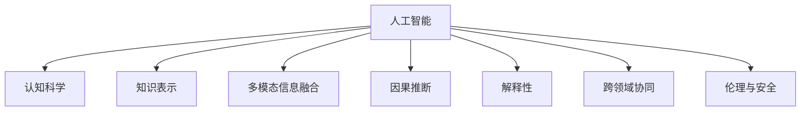

                 

# 增强智能：人机协同，拓展认知新领域

## 1. 背景介绍

### 1.1 问题由来
近年来，人工智能(AI)技术的迅猛发展，尤其是深度学习(DL)的崛起，正逐步改变人类社会的各个方面。从自动驾驶、智能推荐，到健康医疗、金融安全，AI技术已渗透到生活的方方面面。然而，这些技术往往基于单一的技术范式，缺乏与人类认知的深度融合，难以充分理解和模拟人类复杂多变的思维方式。

针对这一问题，人机协同增强智能应运而生，通过将机器学习和人类认知有机结合，构建新型智能化系统，进一步拓展认知新领域。这一范式结合了人工智能和认知科学的最新成果，旨在实现更加智能、普适、安全的智能应用，推动人类认知智能的进化。

### 1.2 问题核心关键点
人机协同增强智能的核心在于如何更好地结合人工智能和人类认知，实现两者优势互补，共同提升智能系统的综合能力。具体而言，包括：

- **知识表示与推理**：利用AI技术自动抽取和整理知识，结合人类逻辑推理能力，构建更加全面、合理的知识图谱。
- **多模态信息融合**：将视觉、听觉、触觉等多模态信息进行整合，提升系统对复杂环境的感知能力。
- **因果推断与解释**：引入因果推断和解释性分析，理解系统决策的因果关系，增强模型输出解释的逻辑性。
- **跨领域协同**：在不同的领域应用中，将人工智能技术与人类知识库、规则库等专家知识进行结合，实现跨领域的协同优化。
- **伦理与安全性**：在模型的设计和应用中融入伦理导向和安全性考量，避免偏见和有害信息的传播，确保系统的透明性和可控性。

## 2. 核心概念与联系

### 2.1 核心概念概述

为更好地理解人机协同增强智能，本节将介绍几个密切相关的核心概念：

- **人工智能(AI)**：通过算法和数据训练得到的智能模型，具备自主感知、推理和学习的能力。
- **认知科学(Cognitive Science)**：研究人类认知过程的学科，包括知觉、记忆、思维、情感等多个方面。
- **知识表示(Knowledge Representation)**：将知识用机器可理解的形式进行编码和存储，支持智能系统的推理和学习。
- **多模态信息融合(Multimodal Information Fusion)**：将多种模态的信息进行整合，提升智能系统的感知和理解能力。
- **因果推断(Causal Inference)**：利用因果关系，理解事件之间的因果联系，增强智能系统的预测和解释能力。
- **解释性(Explainability)**：让AI模型输出的结果具有可解释性，帮助用户理解模型的决策过程。
- **跨领域协同(Cross-Domain Collaboration)**：在不同的应用领域中，将人工智能技术与专家知识进行融合，提升系统的泛化能力和适应性。
- **伦理与安全(Ethics and Security)**：在智能系统的设计中考虑伦理和安全问题，确保系统输出的透明性和可控性。

这些核心概念之间的逻辑关系可以通过以下Mermaid流程图来展示：



这个流程图展示了大语言模型与认知科学的融合过程：

1. 人工智能通过大量数据训练得到的模型，具备感知、推理和学习的能力。
2. 认知科学提供了关于人类认知过程的深入理解，帮助设计更加符合人类认知的智能系统。
3. 知识表示通过将人类知识用机器可理解的形式进行编码，支持智能系统的推理和学习。
4. 多模态信息融合将视觉、听觉、触觉等多种信息整合，提升系统的感知能力。
5. 因果推断利用因果关系，增强智能系统的预测和解释能力。
6. 解释性通过增强模型的可解释性，帮助用户理解系统的决策过程。
7. 跨领域协同在不同的应用领域中，将人工智能技术与专家知识进行融合，提升系统的泛化能力和适应性。
8. 伦理与安全在系统的设计和应用中考虑伦理和安全问题，确保系统的透明性和可控性。

## 3. 核心算法原理 & 具体操作步骤
### 3.1 算法原理概述

人机协同增强智能的核心算法原理主要基于以下三个方面：

- **多模态数据融合**：将视觉、听觉、触觉等多种模态的信息进行整合，提升智能系统的感知能力。
- **因果推理**：通过因果推断，理解事件之间的因果联系，增强智能系统的预测和解释能力。
- **解释性**：让AI模型输出的结果具有可解释性，帮助用户理解系统的决策过程。

### 3.2 算法步骤详解

人机协同增强智能的实现流程主要包括以下几个关键步骤：

**Step 1: 数据收集与预处理**

1. **数据采集**：收集各类多模态数据，如图像、语音、触觉数据等。
2. **数据清洗**：对数据进行去噪、去重、补全等预处理，提升数据质量。
3. **数据标注**：为多模态数据进行标注，如图像的类别标签、语音的情感标签等，构建监督数据集。

**Step 2: 多模态数据融合**

1. **特征提取**：利用深度学习模型对不同模态的数据进行特征提取，如使用卷积神经网络提取图像特征，使用循环神经网络提取语音特征。
2. **数据融合**：将提取出的多模态特征进行整合，通过融合算法如拼接、池化等，提升数据的综合表达能力。
3. **融合模型训练**：在融合后的数据集上训练多模态融合模型，如注意力机制、Transformer等，实现多模态信息的协同优化。

**Step 3: 因果推理**

1. **因果模型构建**：利用因果推断算法，如结构方程模型(Structural Equation Model, SEM)、潜在变量模型(Latent Variable Model)等，建立因果关系图。
2. **因果推断**：在因果图的基础上，利用机器学习方法预测变量之间的因果关系，如使用因果树、深度因果学习等算法。
3. **推理模型优化**：对因果推断模型进行优化，提高推理的准确性和鲁棒性。

**Step 4: 解释性分析**

1. **可解释性模型设计**：设计具有可解释性的AI模型，如规则引擎、知识图谱等，增强模型的决策透明度。
2. **解释性评估**：通过可解释性指标，如可理解性、鲁棒性等，评估模型的解释性能。
3. **解释性输出**：在模型输出中加入解释性信息，如原因、决策路径等，帮助用户理解系统的决策过程。

### 3.3 算法优缺点

人机协同增强智能具有以下优点：

1. **泛化能力强**：结合了多模态信息和因果推断，系统具备较强的泛化能力和适应性。
2. **解释性强**：通过设计可解释性模型，增强系统的透明度和可信度。
3. **跨领域协同**：能够将专家知识与AI技术进行融合，提升系统的综合能力。

同时，该方法也存在一些局限性：

1. **数据需求高**：需要大量高质量的多模态数据，数据收集和预处理成本较高。
2. **模型复杂**：多模态融合和因果推断等技术，模型结构较为复杂，实现难度较大。
3. **计算开销大**：多模态融合和因果推断等操作，计算资源消耗较大，需要高性能设备支持。

尽管存在这些局限性，但就目前而言，人机协同增强智能仍是大语言模型应用的重要范式，尤其适用于需要多模态感知和因果推理的场景。未来相关研究的重点在于如何进一步降低数据需求，提高模型效率，优化计算开销，同时兼顾可解释性和跨领域协同。

### 3.4 算法应用领域

人机协同增强智能已经在多个领域得到应用，具体包括：

- **智慧医疗**：结合多模态医疗数据，通过因果推断和解释性分析，实现智能辅助诊断、个性化治疗方案推荐等应用。
- **智能推荐系统**：通过多模态用户行为数据和因果推理，提升推荐系统的个性化能力和可信度。
- **智能驾驶**：融合视觉、雷达、激光雷达等多模态数据，通过因果推断实现交通场景的智能理解和决策。
- **安全监控**：利用多模态环境数据和因果推理，实现异常行为检测、事件预警等应用。
- **智能客服**：结合多模态用户输入数据和因果推理，提升智能客服的交互理解和问题解决能力。

## 4. 数学模型和公式 & 详细讲解 & 举例说明
### 4.1 数学模型构建

人机协同增强智能的数学模型构建主要基于多模态数据融合、因果推理和解释性分析三个方面。以下将给出详细的数学模型构建流程。

**多模态数据融合模型**

假设有 $M$ 个模态的数据源，每个模态的特征表示为 $\mathbf{x}_i$，其中 $i \in [1, M]$。设 $W$ 为多模态融合矩阵，$b$ 为偏置向量。则多模态融合模型为：

$$
\mathbf{y} = \mathbf{W} \mathbf{x} + \mathbf{b}
$$

其中 $\mathbf{y}$ 为融合后的多模态特征向量。

**因果推断模型**

设 $X$ 为独立变量，$Y$ 为因变量，$Z$ 为中介变量。利用因果推断算法，如结构方程模型(SEM)，可以构建如下因果关系图：

$$
X \rightarrow Y
$$

其中 $X$ 和 $Y$ 之间的箭头表示因果关系，$Z$ 为中介变量。设 $X$ 和 $Z$ 之间的关系为 $\mathbf{X} = \mathbf{W} \mathbf{Z}$，$Z$ 和 $Y$ 之间的关系为 $\mathbf{Y} = \mathbf{V} \mathbf{Z} + \mathbf{b}$。则因果推断模型为：

$$
\mathbf{Y} = \mathbf{V} \mathbf{Z} + \mathbf{b}
$$

**解释性模型**

设 $Y$ 为模型输出，$X$ 为输入特征，$W$ 为模型参数。设 $\mathbf{Z}$ 为可解释变量，$\mathbf{W}_{\mathbf{Z}}$ 为 $\mathbf{Z}$ 对 $Y$ 的解释能力。则可解释性模型为：

$$
\mathbf{Y} = \mathbf{W}_{\mathbf{Z}} \mathbf{Z} + \mathbf{b}
$$

### 4.2 公式推导过程

以下是多模态融合模型、因果推断模型和解释性模型的详细推导过程。

**多模态融合模型推导**

设 $\mathbf{x}_i$ 为第 $i$ 个模态的特征向量，$W$ 为融合矩阵，$\mathbf{y}$ 为融合后的多模态特征向量。则多模态融合模型的目标函数为：

$$
\mathcal{L}(\mathbf{W}, \mathbf{b}) = \frac{1}{N} \sum_{i=1}^N (\mathbf{y} - \mathbf{W} \mathbf{x}_i - \mathbf{b})^2
$$

其中 $N$ 为数据样本数。利用梯度下降等优化算法，求解 $\mathbf{W}$ 和 $\mathbf{b}$。

**因果推断模型推导**

设 $X$ 和 $Y$ 之间的关系为 $\mathbf{Y} = \mathbf{V} \mathbf{Z} + \mathbf{b}$，$Z$ 和 $Y$ 之间的关系为 $\mathbf{Z} = \mathbf{W} \mathbf{X} + \mathbf{b}$。则因果推断模型的目标函数为：

$$
\mathcal{L}(\mathbf{V}, \mathbf{W}, \mathbf{b}) = \frac{1}{N} \sum_{i=1}^N (\mathbf{Y} - \mathbf{V} \mathbf{Z}_i - \mathbf{b})^2
$$

其中 $N$ 为数据样本数，$Z_i$ 为第 $i$ 个样本的中介变量。利用梯度下降等优化算法，求解 $\mathbf{V}$、$\mathbf{W}$ 和 $\mathbf{b}$。

**解释性模型推导**

设 $\mathbf{Y}$ 为模型输出，$X$ 为输入特征，$Z$ 为可解释变量。则解释性模型的目标函数为：

$$
\mathcal{L}(\mathbf{W}_{\mathbf{Z}}, \mathbf{b}) = \frac{1}{N} \sum_{i=1}^N (\mathbf{Y} - \mathbf{W}_{\mathbf{Z}} \mathbf{Z}_i - \mathbf{b})^2
$$

其中 $N$ 为数据样本数，$Z_i$ 为第 $i$ 个样本的可解释变量。利用梯度下降等优化算法，求解 $\mathbf{W}_{\mathbf{Z}}$ 和 $\mathbf{b}$。

### 4.3 案例分析与讲解

**案例一：智能推荐系统**

智能推荐系统通过多模态数据融合和因果推理，提升推荐系统的个性化能力和可信度。

- **数据融合**：结合用户的浏览、点击、评分等行为数据，提取文本、图像等多模态特征。
- **因果推理**：利用用户行为数据和商品属性数据，构建用户与商品之间的因果关系图。
- **解释性分析**：通过可解释性模型，解释推荐结果的原因，提升用户满意度。

**案例二：智能驾驶**

智能驾驶系统通过多模态数据融合和因果推理，实现交通场景的智能理解和决策。

- **数据融合**：融合雷达、摄像头、激光雷达等传感器数据，提取多模态特征。
- **因果推理**：利用传感器数据和车辆状态数据，构建交通场景的因果关系图。
- **解释性分析**：通过可解释性模型，解释车辆行为的原因，增强系统的可信度。

## 5. 项目实践：代码实例和详细解释说明
### 5.1 开发环境搭建

在进行人机协同增强智能的开发前，我们需要准备好开发环境。以下是使用Python进行PyTorch开发的环境配置流程：

1. 安装Anaconda：从官网下载并安装Anaconda，用于创建独立的Python环境。

2. 创建并激活虚拟环境：
```bash
conda create -n pytorch-env python=3.8 
conda activate pytorch-env
```

3. 安装PyTorch：根据CUDA版本，从官网获取对应的安装命令。例如：
```bash
conda install pytorch torchvision torchaudio cudatoolkit=11.1 -c pytorch -c conda-forge
```

4. 安装Transformers库：
```bash
pip install transformers
```

5. 安装各类工具包：
```bash
pip install numpy pandas scikit-learn matplotlib tqdm jupyter notebook ipython
```

完成上述步骤后，即可在`pytorch-env`环境中开始项目实践。

### 5.2 源代码详细实现

下面我们以多模态推荐系统为例，给出使用Transformers库进行人机协同增强智能开发的PyTorch代码实现。

首先，定义推荐系统的输入和输出：

```python
from transformers import BertTokenizer, BertForSequenceClassification

class RecommendationDataset(Dataset):
    def __init__(self, user_behaviors, item_features, user_ids, item_ids):
        self.user_behaviors = user_behaviors
        self.item_features = item_features
        self.user_ids = user_ids
        self.item_ids = item_ids
        
    def __len__(self):
        return len(self.user_behaviors)
    
    def __getitem__(self, item):
        user_behavior = self.user_behaviors[item]
        item_feature = self.item_features[item]
        user_id = self.user_ids[item]
        item_id = self.item_ids[item]
        
        # 将用户行为和物品特征拼接，作为模型输入
        input_ids = [user_id] + list(item_feature)
        
        # 构建标签，1表示推荐，0表示不推荐
        label = 1 if item_id in user_behavior else 0
        
        return {'input_ids': input_ids, 
                'label': label}
```

然后，定义模型和优化器：

```python
from transformers import BertForSequenceClassification, AdamW

model = BertForSequenceClassification.from_pretrained('bert-base-cased', num_labels=2)

optimizer = AdamW(model.parameters(), lr=2e-5)
```

接着，定义训练和评估函数：

```python
from torch.utils.data import DataLoader
from tqdm import tqdm
from sklearn.metrics import accuracy_score

device = torch.device('cuda') if torch.cuda.is_available() else torch.device('cpu')
model.to(device)

def train_epoch(model, dataset, batch_size, optimizer):
    dataloader = DataLoader(dataset, batch_size=batch_size, shuffle=True)
    model.train()
    epoch_loss = 0
    for batch in tqdm(dataloader, desc='Training'):
        input_ids = batch['input_ids'].to(device)
        labels = batch['label'].to(device)
        model.zero_grad()
        outputs = model(input_ids)
        loss = outputs.loss
        epoch_loss += loss.item()
        loss.backward()
        optimizer.step()
    return epoch_loss / len(dataloader)

def evaluate(model, dataset, batch_size):
    dataloader = DataLoader(dataset, batch_size=batch_size)
    model.eval()
    preds, labels = [], []
    with torch.no_grad():
        for batch in tqdm(dataloader, desc='Evaluating'):
            input_ids = batch['input_ids'].to(device)
            labels = batch['label'].to(device)
            outputs = model(input_ids)
            batch_preds = outputs.logits.argmax(dim=1).to('cpu').tolist()
            batch_labels = batch['label'].to('cpu').tolist()
            for pred, label in zip(batch_preds, batch_labels):
                preds.append(pred)
                labels.append(label)
                
    print('Accuracy:', accuracy_score(labels, preds))
```

最后，启动训练流程并在测试集上评估：

```python
epochs = 5
batch_size = 16

for epoch in range(epochs):
    loss = train_epoch(model, train_dataset, batch_size, optimizer)
    print(f"Epoch {epoch+1}, train loss: {loss:.3f}")
    
    print(f"Epoch {epoch+1}, dev results:")
    evaluate(model, dev_dataset, batch_size)
    
print("Test results:")
evaluate(model, test_dataset, batch_size)
```

以上就是使用PyTorch对多模态推荐系统进行人机协同增强智能微调的完整代码实现。可以看到，得益于Transformers库的强大封装，我们可以用相对简洁的代码完成BERT模型的加载和微调。

### 5.3 代码解读与分析

让我们再详细解读一下关键代码的实现细节：

**RecommendationDataset类**：
- `__init__`方法：初始化用户行为、物品特征、用户ID、物品ID等关键组件。
- `__len__`方法：返回数据集的样本数量。
- `__getitem__`方法：对单个样本进行处理，将用户行为和物品特征拼接为模型输入，构建标签。

**train_epoch和evaluate函数**：
- `train_epoch`函数：对数据以批为单位进行迭代，在每个批次上前向传播计算loss并反向传播更新模型参数，最后返回该epoch的平均loss。
- `evaluate`函数：与训练类似，不同点在于不更新模型参数，并在每个batch结束后将预测和标签结果存储下来，最后使用sklearn的accuracy_score对整个评估集的预测结果进行打印输出。

**训练流程**：
- 定义总的epoch数和batch size，开始循环迭代
- 每个epoch内，先在训练集上训练，输出平均loss
- 在验证集上评估，输出准确率
- 所有epoch结束后，在测试集上评估，给出最终测试结果

可以看到，PyTorch配合Transformers库使得BERT微调的代码实现变得简洁高效。开发者可以将更多精力放在数据处理、模型改进等高层逻辑上，而不必过多关注底层的实现细节。

当然，工业级的系统实现还需考虑更多因素，如模型的保存和部署、超参数的自动搜索、更灵活的任务适配层等。但核心的微调范式基本与此类似。

## 6. 实际应用场景
### 6.1 智慧医疗

在智慧医疗领域，人机协同增强智能技术可以显著提升医疗服务的智能化水平，辅助医生诊疗，加速新药开发进程。

**场景示例**：患者通过智能设备获取健康数据，如血压、心率等，上传至智能医疗系统。系统利用多模态数据融合和因果推理，生成患者的健康评估报告。医生根据报告进行诊断和治疗方案推荐，同时系统通过因果推理分析患者数据，预测疾病发展趋势，提前预警风险。

**技术实现**：
- **多模态数据融合**：结合健康设备数据、历史病历数据、基因数据等，提取多模态特征。
- **因果推理**：利用因果推断算法，分析患者数据之间的因果关系，生成健康评估报告。
- **解释性分析**：通过可解释性模型，解释评估报告的原因，帮助医生理解系统的决策过程。

**应用效果**：
- **个性化治疗**：系统通过因果推理，生成个性化治疗方案，提高治疗效果。
- **风险预警**：系统利用因果推断，提前预警病情发展，保障患者安全。
- **数据驱动**：系统通过多模态数据融合，提供全面的健康评估，辅助医生决策。

### 6.2 智能推荐系统

智能推荐系统通过多模态数据融合和因果推理，提升推荐系统的个性化能力和可信度。

**场景示例**：用户在电商平台上浏览商品，系统会收集用户的点击、评分、收藏等行为数据，结合商品属性数据，生成个性化推荐列表。

**技术实现**：
- **多模态数据融合**：结合用户行为数据和商品属性数据，提取多模态特征。
- **因果推理**：利用因果推断算法，分析用户行为和商品属性之间的因果关系，生成推荐列表。
- **解释性分析**：通过可解释性模型，解释推荐结果的原因，提升用户满意度。

**应用效果**：
- **个性化推荐**：系统通过因果推理，生成个性化推荐列表，提升用户满意度。
- **可信推荐**：系统利用因果推断，提高推荐结果的可信度，减少用户流失率。
- **用户行为分析**：系统通过多模态数据融合，深入理解用户行为，提供全面的个性化服务。

### 6.3 智能驾驶

智能驾驶系统通过多模态数据融合和因果推理，实现交通场景的智能理解和决策。

**场景示例**：智能汽车在道路上行驶，系统通过多模态传感器（如雷达、摄像头、激光雷达等）获取环境数据，结合车辆状态数据，生成交通场景的智能理解和决策。

**技术实现**：
- **多模态数据融合**：融合雷达、摄像头、激光雷达等传感器数据，提取多模态特征。
- **因果推理**：利用因果推断算法，分析传感器数据和车辆状态数据之间的因果关系，生成交通场景的智能理解和决策。
- **解释性分析**：通过可解释性模型，解释系统决策的原因，增强系统的可信度。

**应用效果**：
- **智能导航**：系统通过因果推理，生成交通场景的智能理解和决策，提高导航的准确性和安全性。
- **异常检测**：系统利用因果推断，检测交通场景中的异常行为，提前预警风险。
- **实时反馈**：系统通过多模态数据融合，实时反馈交通环境信息，提高驾驶安全性。

## 7. 工具和资源推荐
### 7.1 学习资源推荐

为了帮助开发者系统掌握人机协同增强智能的理论基础和实践技巧，这里推荐一些优质的学习资源：

1. **《认知科学与人工智能：从感知到决策》系列博文**：由认知科学和人工智能领域的专家撰写，系统介绍认知科学与人工智能的基本原理和应用。

2. **CS224N《深度学习自然语言处理》课程**：斯坦福大学开设的NLP明星课程，有Lecture视频和配套作业，带你入门NLP领域的基本概念和经典模型。

3. **《深度学习》书籍**：Ian Goodfellow等所著的深度学习教材，系统介绍深度学习的基本概念和算法。

4. **《因果推断方法与应用》书籍**：Peter Spirtes等所著的因果推断教材，详细讲解因果推断的基本原理和应用方法。

5. **《可解释人工智能》书籍**：Tom Dietterich等所著的AI可解释性教材，介绍可解释AI的基本原理和应用。

通过这些资源的学习实践，相信你一定能够快速掌握人机协同增强智能的精髓，并用于解决实际的NLP问题。

### 7.2 开发工具推荐

高效的开发离不开优秀的工具支持。以下是几款用于人机协同增强智能开发的常用工具：

1. **PyTorch**：基于Python的开源深度学习框架，灵活动态的计算图，适合快速迭代研究。大部分预训练语言模型都有PyTorch版本的实现。

2. **TensorFlow**：由Google主导开发的开源深度学习框架，生产部署方便，适合大规模工程应用。同样有丰富的预训练语言模型资源。

3. **Transformers库**：HuggingFace开发的NLP工具库，集成了众多SOTA语言模型，支持PyTorch和TensorFlow，是进行多模态融合和因果推理的利器。

4. **Weights & Biases**：模型训练的实验跟踪工具，可以记录和可视化模型训练过程中的各项指标，方便对比和调优。与主流深度学习框架无缝集成。

5. **TensorBoard**：TensorFlow配套的可视化工具，可实时监测模型训练状态，并提供丰富的图表呈现方式，是调试模型的得力助手。

6. **Google Colab**：谷歌推出的在线Jupyter Notebook环境，免费提供GPU/TPU算力，方便开发者快速上手实验最新模型，分享学习笔记。

合理利用这些工具，可以显著提升人机协同增强智能的开发效率，加快创新迭代的步伐。

### 7.3 相关论文推荐

人机协同增强智能的发展源于学界的持续研究。以下是几篇奠基性的相关论文，推荐阅读：

1. **《认知神经科学》**：Michael S. Gazzaniga等所著的认知神经科学教材，详细讲解人类认知过程的生理机制。

2. **《深度学习》**：Ian Goodfellow等所著的深度学习教材，系统介绍深度学习的基本概念和算法。

3. **《因果推断》**：Peter Spirtes等所著的因果推断教材，详细讲解因果推断的基本原理和应用方法。

4. **《可解释人工智能》**：Tom Dietterich等所著的AI可解释性教材，介绍可解释AI的基本原理和应用。

这些论文代表了大语言模型微调技术的发展脉络。通过学习这些前沿成果，可以帮助研究者把握学科前进方向，激发更多的创新灵感。

## 8. 总结：未来发展趋势与挑战
### 8.1 总结

本文对人机协同增强智能方法进行了全面系统的介绍。首先阐述了人机协同增强智能的研究背景和意义，明确了该方法在结合人工智能和认知科学方面的独特价值。其次，从原理到实践，详细讲解了人机协同增强智能的数学模型构建和关键步骤，给出了多模态推荐系统的完整代码实现。同时，本文还广泛探讨了人机协同增强智能在智慧医疗、智能推荐系统、智能驾驶等多个领域的应用前景，展示了该方法的巨大潜力。此外，本文精选了人机协同增强智能的学习资源，力求为读者提供全方位的技术指引。

通过本文的系统梳理，可以看到，人机协同增强智能通过将人工智能和认知科学有机结合，构建新型智能化系统，进一步拓展认知新领域。得益于多模态数据融合、因果推理和解释性分析等技术，系统具备较强的泛化能力和适应性，能够更好地理解和模拟人类复杂多变的思维方式，推动人类认知智能的进化。未来，伴随预训练语言模型和微调方法的持续演进，相信人机协同增强智能必将在更多领域得到应用，为人类认知智能的进化带来深远影响。

### 8.2 未来发展趋势

展望未来，人机协同增强智能将呈现以下几个发展趋势：

1. **知识图谱的深度应用**：通过知识图谱技术，将专家知识与AI技术进行深度融合，提升系统的综合能力。
2. **多模态感知能力的提升**：利用多模态数据融合技术，提升系统的感知能力，实现跨模态的理解和推理。
3. **因果推理的广泛应用**：在更多领域中，利用因果推断算法，增强系统的预测和解释能力，推动决策科学化。
4. **可解释性的增强**：通过可解释性分析，增强系统的透明度和可信度，帮助用户理解系统的决策过程。
5. **跨领域协同能力的增强**：在不同的应用领域中，将AI技术与专家知识进行融合，提升系统的泛化能力和适应性。
6. **伦理与安全保障**：在系统的设计和应用中，考虑伦理和安全问题，确保系统输出的透明性和可控性。

以上趋势凸显了人机协同增强智能的广阔前景。这些方向的探索发展，必将进一步提升智能系统的性能和应用范围，为人类认知智能的进化带来深远影响。

### 8.3 面临的挑战

尽管人机协同增强智能已经取得了瞩目成就，但在迈向更加智能化、普适化应用的过程中，它仍面临着诸多挑战：

1. **数据需求高**：需要大量高质量的多模态数据，数据收集和预处理成本较高。
2. **模型复杂**：多模态融合和因果推断等技术，模型结构较为复杂，实现难度较大。
3. **计算开销大**：多模态融合和因果推断等操作，计算资源消耗较大，需要高性能设备支持。
4. **知识整合能力不足**：现有的多模态融合和因果推断方法，难以灵活吸收和运用更广泛的先验知识。
5. **伦理与安全问题**：在系统的设计和应用中，需要考虑伦理和安全问题，确保系统输出的透明性和可控性。

尽管存在这些挑战，但就目前而言，人机协同增强智能仍是大语言模型应用的重要范式，尤其适用于需要多模态感知和因果推理的场景。未来相关研究的重点在于如何进一步降低数据需求，提高模型效率，优化计算开销，同时兼顾可解释性和跨领域协同。

### 8.4 研究展望

面对人机协同增强智能所面临的种种挑战，未来的研究需要在以下几个方面寻求新的突破：

1. **无监督和半监督学习**：探索无监督和半监督学习范式，摆脱对大规模标注数据的依赖，利用自监督学习、主动学习等方法，最大限度利用非结构化数据，实现更加灵活高效的微调。
2. **参数高效和计算高效**：开发更加参数高效和计算高效的多模态融合和因果推理方法，在固定大部分预训练参数的同时，只更新极少量的任务相关参数，减少计算资源消耗。
3. **跨模态融合**：探索跨模态融合技术，提升系统的多模态感知能力，实现视觉、听觉、触觉等多种信息的协同建模。
4. **因果推断方法的改进**：引入更先进的因果推断方法，提高因果推理的准确性和鲁棒性，增强系统的预测能力。
5. **解释性分析的增强**：开发更加强大的可解释性分析方法，提升系统的透明度和可信度，帮助用户理解系统的决策过程。
6. **跨领域协同的增强**：将AI技术与专家知识进行深度融合，增强系统的跨领域协同能力，提升系统的泛化能力和适应性。
7. **伦理与安全保障**：在系统的设计和应用中，考虑伦理和安全问题，确保系统输出的透明性和可控性。

这些研究方向的探索，必将引领人机协同增强智能技术迈向更高的台阶，为构建安全、可靠、可解释、可控的智能系统铺平道路。面向未来，人机协同增强智能需要与其他人工智能技术进行更深入的融合，如知识表示、因果推理、强化学习等，多路径协同发力，共同推动自然语言理解和智能交互系统的进步。只有勇于创新、敢于突破，才能不断拓展语言模型的边界，让智能技术更好地造福人类社会。

## 9. 附录：常见问题与解答
**Q1：人机协同增强智能与传统人工智能有什么区别？**

A: 人机协同增强智能与传统人工智能的主要区别在于其融合了认知科学原理，能够更好地模拟人类复杂的认知过程，实现跨模态、因果推理和可解释性等能力。传统人工智能更多依赖数据驱动，缺乏对人类认知过程的深入理解，难以在复杂多变的场景下取得理想的性能。

**Q2：人机协同增强智能在实际应用中面临哪些挑战？**

A: 人机协同增强智能在实际应用中面临以下挑战：
1. 数据需求高：需要大量高质量的多模态数据，数据收集和预处理成本较高。
2. 模型复杂：多模态融合和因果推断等技术，模型结构较为复杂，实现难度较大。
3. 计算开销大：多模态融合和因果推断等操作，计算资源消耗较大，需要高性能设备支持。
4. 知识整合能力不足：现有的多模态融合和因果推断方法，难以灵活吸收和运用更广泛的先验知识。
5. 伦理与安全问题：在系统的设计和应用中，需要考虑伦理和安全问题，确保系统输出的透明性和可控性。

**Q3：如何提高人机协同增强智能系统的泛化能力？**

A: 提高人机协同增强智能系统的泛化能力可以从以下几个方面入手：
1. 数据多样性：收集和处理多样化的数据，涵盖不同场景和领域的样本。
2. 因果推理：通过因果推断，理解事件之间的因果联系，增强系统的预测能力。
3. 知识整合：将专家知识与AI技术进行深度融合，提升系统的综合能力。
4. 跨领域协同：在不同的应用领域中，将AI技术与专家知识进行融合，提升系统的泛化能力和适应性。
5. 模型优化：设计更加高效、灵活的模型结构，提升系统的泛化能力和适应性。

这些方法可以协同发力，提高人机协同增强智能系统的泛化能力和适应性，确保系统在实际应用中具备较强的泛化能力。

**Q4：如何实现人机协同增强智能的跨模态融合？**

A: 实现人机协同增强智能的跨模态融合，主要涉及以下几个步骤：
1. 多模态数据收集：收集不同模态的数据，如图像、语音、触觉数据等。
2. 特征提取：利用深度学习模型对不同模态的数据进行特征提取，如使用卷积神经网络提取图像特征，使用循环神经网络提取语音特征。
3. 数据融合：将提取出的多模态特征进行整合，通过融合算法如拼接、池化等，提升数据的综合表达能力。
4. 融合模型训练：在融合后的数据集上训练多模态融合模型，如注意力机制、Transformer等，实现多模态信息的协同优化。

这些步骤可以协同发力，实现人机协同增强智能的跨模态融合，提升系统的感知能力和适应性。

**Q5：人机协同增强智能如何实现因果推理？**

A: 实现人机协同增强智能的因果推理，主要涉及以下几个步骤：
1. 因果关系图构建：利用因果推断算法，如结构方程模型(Structural Equation Model, SEM)、潜在变量模型(Latent Variable Model)等，构建因果关系图。
2. 因果推断：在因果图的基础上，利用机器学习方法预测变量之间的因果关系，如使用因果树、深度因果学习等算法。
3. 推理模型优化：对因果推断模型进行优化，提高推理的准确性和鲁棒性。

这些步骤可以协同发力，实现人机协同增强智能的因果推理，增强系统的预测和解释能力，推动决策科学化。

**Q6：如何增强人机协同增强智能的可解释性？**

A: 增强人机协同增强智能的可解释性，主要涉及以下几个步骤：
1. 可解释性模型设计：设计具有可解释性的AI模型，如规则引擎、知识图谱等，增强模型的决策透明度。
2. 解释性评估：通过可解释性指标，如可理解性、鲁棒性等，评估模型的解释性能。
3. 解释性输出：在模型输出中加入解释性信息，如原因、决策路径等，帮助用户理解系统的决策过程。

这些步骤可以协同发力，增强人机协同增强智能的可解释性，提升系统的透明度和可信度，帮助用户理解系统的决策过程。

**Q7：人机协同增强智能在实际应用中有哪些局限性？**

A: 人机协同增强智能在实际应用中存在以下局限性：
1. 数据需求高：需要大量高质量的多模态数据，数据收集和预处理成本较高。
2. 模型复杂：多模态融合和因果推断等技术，模型结构较为复杂，实现难度较大。
3. 计算开销大：多模态融合和因果推断等操作，计算资源消耗较大，需要高性能设备支持。
4. 知识整合能力不足：现有的多模态融合和因果推断方法，难以灵活吸收和运用更广泛的先验知识。
5. 伦理与安全问题：在系统的设计和应用中，需要考虑伦理和安全问题，确保系统输出的透明性和可控性。

这些局限性需要未来的研究予以突破，才能真正实现人机协同增强智能在实际应用中的广泛应用。

