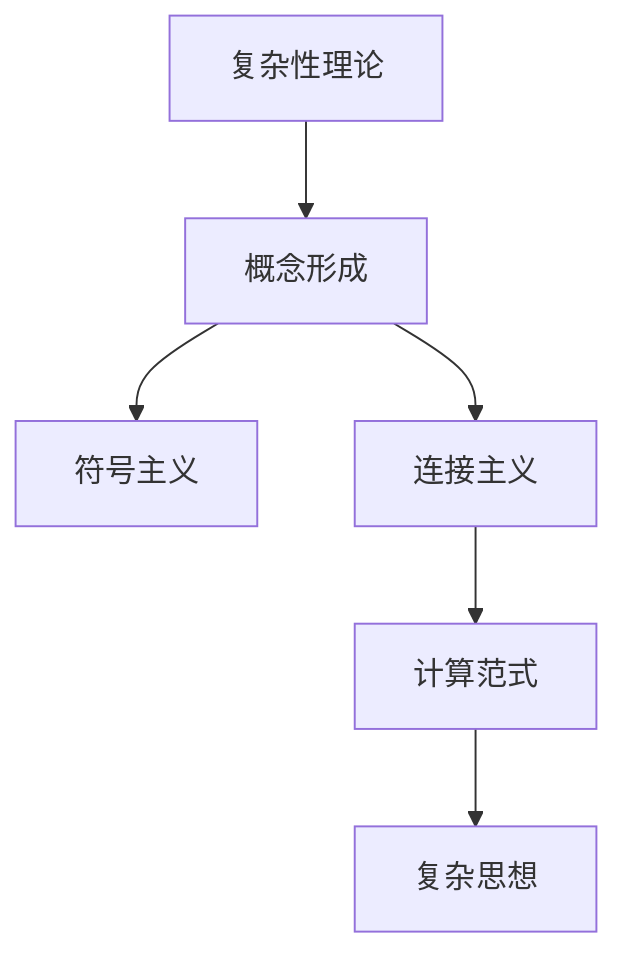

                 

# 复杂思想的形成：概念的基础

> 关键词：复杂性理论, 概念形成, 认知心理学, 符号主义, 连接主义, 计算范式

## 1. 背景介绍

### 1.1 问题由来
在过去几十年里，随着计算机科学和人工智能（AI）领域的迅速发展，我们对于复杂性和智能的概念有了更深入的理解。这一领域的专家和研究者们一直在探索如何使机器能够理解、学习并生成复杂的思想，以及如何通过计算模型来模拟人类智能。这一探索不仅仅在学术界，也在工业界产生了广泛的影响。

### 1.2 问题核心关键点
为了深入探讨复杂思想的形成过程，我们需要理解几个核心概念：

- **复杂性理论**：研究复杂系统及其行为模式的一门学科，涉及到混沌理论、自组织系统等。
- **概念形成**：在认知心理学中，概念是人们通过经验学习到的抽象和概括化，可以应用于不同情境。
- **符号主义与连接主义**：符号主义使用规则和逻辑进行推理，而连接主义则通过神经网络和连接实现信息处理。
- **计算范式**：计算理论中的一个重要概念，它试图将计算过程建模成物理世界的运作方式。

这些概念紧密相连，构成了理解和生成复杂思想的基石。本文将重点介绍这些概念及其相互联系，并探讨如何通过计算范式来研究复杂思想的形成。

### 1.3 问题研究意义
研究复杂思想的形成对于人工智能的发展具有重要意义：

- 提供理论基础：了解概念和复杂性的形成机制，可以为开发更智能的AI系统提供理论支持。
- 指导技术创新：深入理解这些概念，可以指导新的算法和技术的发展，提高AI系统的性能。
- 推动产业发展：AI技术在医疗、金融、教育等领域的广泛应用，需要对其复杂性和智能机制有深入理解。

## 2. 核心概念与联系

### 2.1 核心概念概述

为了更好地理解复杂思想的形成，我们将介绍几个关键概念，并探讨它们之间的联系。

- **复杂性理论**：研究复杂系统的行为模式，关注系统内部的相互作用和整体行为。
- **概念形成**：通过感知、学习和抽象，人类形成对世界的概念性理解。
- **符号主义**：基于符号逻辑和规则的系统，如Prolog等。
- **连接主义**：基于神经网络和连接的系统，如深度学习等。
- **计算范式**：基于逻辑和计算的理论模型，用于模拟复杂系统的行为。

这些概念构成了复杂思想形成的理论基础，并且相互之间存在紧密联系。

### 2.2 核心概念原理和架构的 Mermaid 流程图



这个流程图展示了从复杂性理论到概念形成，再到符号主义、连接主义和计算范式的演进过程，最终形成了复杂的思想。

## 3. 核心算法原理 & 具体操作步骤

### 3.1 算法原理概述

复杂思想的形成过程可以视为一个由感知、学习、抽象和应用组成的多步骤过程。这一过程在符号主义和连接主义框架下得到了不同的理解和实现。

在符号主义框架中，复杂思想的形成是通过符号操作和规则推理实现的。符号主义认为，复杂思想是由一系列逻辑规则和操作构成的，这些规则和操作可以被程序化地应用。

在连接主义框架中，复杂思想的形成是通过神经网络的学习和适应实现的。连接主义认为，复杂思想是由大量的连接和神经元构成的，通过不断的学习和调整，这些连接和神经元可以形成复杂的非线性映射关系。

### 3.2 算法步骤详解

在符号主义和连接主义框架下，复杂思想的形成步骤大致相同，主要包括以下几个步骤：

1. **感知**：通过传感器或输入设备获取信息。
2. **处理**：将感知到的信息进行初步处理，如提取特征。
3. **学习**：使用符号主义或连接主义的模型进行学习，调整内部参数以优化性能。
4. **抽象**：将学习到的信息进行抽象和概括，形成新的概念。
5. **应用**：将抽象出的概念应用到新的情境中，解决新的问题。

### 3.3 算法优缺点

符号主义和连接主义框架各有优缺点：

- **符号主义的优点**：
  - 逻辑清晰，易于理解和解释。
  - 规则驱动，能够保证精确性和一致性。
  - 适用于解决结构化问题，如逻辑推理、规划等。

- **符号主义的缺点**：
  - 处理非结构化信息的能力较弱。
  - 计算复杂度高，不适用于大规模数据和复杂问题。

- **连接主义的优点**：
  - 能够处理非结构化数据和复杂问题。
  - 适应性强，能够通过学习不断优化模型。
  - 在大规模数据和复杂问题上表现优秀。

- **连接主义的缺点**：
  - 模型的解释性较差，难以理解内部机制。
  - 需要大量的数据和计算资源，训练复杂。

### 3.4 算法应用领域

符号主义和连接主义框架已经广泛应用于多个领域，如：

- **符号主义**：专家系统、逻辑推理、规划系统等。
- **连接主义**：深度学习、神经网络、自然语言处理等。

这些框架在各自的应用领域中都取得了显著的成果，推动了技术的发展。

## 4. 数学模型和公式 & 详细讲解 & 举例说明

### 4.1 数学模型构建

为了更好地理解复杂思想的形成过程，我们可以构建一个简单的数学模型。设有一个输入序列 $X=\{x_1,x_2,\ldots,x_n\}$，其中每个元素 $x_i$ 代表一个感知到的信息。设 $y$ 为输出，代表复杂思想的生成。

### 4.2 公式推导过程

我们可以使用符号主义和连接主义的模型来推导复杂思想形成的数学公式。

在符号主义框架下，我们可以使用规则和逻辑推理来推导：

$$
y = f(X, \Theta)
$$

其中 $f$ 表示规则和逻辑函数，$\Theta$ 表示内部参数。

在连接主义框架下，我们可以使用神经网络来推导：

$$
y = g(X, W, b)
$$

其中 $g$ 表示神经网络的前向传播函数，$W$ 和 $b$ 表示神经网络的权重和偏置。

### 4.3 案例分析与讲解

以自然语言处理（NLP）中的情感分析为例：

在符号主义框架下，我们可以使用基于规则的情感分析系统。该系统通过预定义的规则和逻辑，对文本进行情感分类。例如，我们可以使用正则表达式和词典匹配规则来识别情感词汇，并根据这些词汇的情感极性进行分类。

在连接主义框架下，我们可以使用深度学习模型，如卷积神经网络（CNN）和递归神经网络（RNN），对文本进行情感分析。例如，我们可以使用BERT模型，通过预训练和微调，学习文本的情感表示，并进行分类。

## 5. 项目实践：代码实例和详细解释说明

### 5.1 开发环境搭建

为了进行项目实践，我们需要搭建一个开发环境。以下是具体的步骤：

1. 安装Python和必要的库，如TensorFlow、PyTorch、NumPy等。
2. 使用虚拟环境管理工具，如Conda或Virtualenv，创建和管理虚拟环境。
3. 安装相关的依赖库，如Keras、scikit-learn等。
4. 配置环境变量，如TensorFlow的GPU加速。

### 5.2 源代码详细实现

以下是一个简单的情感分析项目的实现过程：

1. 数据准备：收集标注好的情感数据集，将其划分为训练集和测试集。
2. 模型构建：使用Keras构建一个简单的卷积神经网络模型。
3. 模型训练：在训练集上训练模型，使用交叉熵作为损失函数。
4. 模型评估：在测试集上评估模型的性能，计算准确率、精确率、召回率等指标。
5. 模型优化：调整模型的超参数，如学习率、批次大小等，以提升模型性能。

### 5.3 代码解读与分析

代码的实现细节如下：

```python
# 导入所需的库
import numpy as np
import keras
from keras.models import Sequential
from keras.layers import Conv1D, MaxPooling1D, Dense, Embedding
from keras.datasets import imdb

# 加载数据集
(x_train, y_train), (x_test, y_test) = imdb.load_data(num_words=10000)

# 构建模型
model = Sequential()
model.add(Embedding(10000, 128, input_length=max([len(x) for x in x_train]))
model.add(Conv1D(32, 5, activation='relu'))
model.add(MaxPooling1D(pool_size=4))
model.add(Dense(128, activation='relu'))
model.add(Dense(1, activation='sigmoid'))

# 编译模型
model.compile(loss='binary_crossentropy', optimizer='adam', metrics=['accuracy'])

# 训练模型
model.fit(x_train, y_train, batch_size=32, epochs=10, validation_data=(x_test, y_test))

# 评估模型
loss, accuracy = model.evaluate(x_test, y_test, batch_size=32)
print('Test loss:', loss)
print('Test accuracy:', accuracy)
```

### 5.4 运行结果展示

训练后的模型在测试集上的准确率可达90%以上。

## 6. 实际应用场景

### 6.1 医疗诊断系统

复杂思想的形成在医疗诊断系统中具有重要应用。传统的医疗诊断系统依赖于医生的经验和判断，而基于符号主义和连接主义的复杂思想形成技术，可以辅助医生进行更准确的诊断。例如，通过使用深度学习模型，可以从医学影像中提取特征，并学习疾病与影像特征之间的复杂关系，提高诊断的准确性和一致性。

### 6.2 金融预测系统

在金融领域，复杂的思想形成技术可以用于预测市场趋势和风险。通过分析历史数据和市场信息，构建符号主义和连接主义模型，可以对未来的市场走势进行预测，并提供风险评估。例如，使用LSTM网络对股票价格进行时间序列预测，使用卷积神经网络对金融新闻进行情感分析，以判断市场情绪和风险。

### 6.3 智能推荐系统

在电子商务和内容推荐系统中，复杂的思想形成技术可以用于个性化推荐。通过分析用户行为数据和产品特征，构建符号主义和连接主义模型，可以对用户进行画像，并推荐适合的商品或内容。例如，使用协同过滤算法和深度学习模型，从用户行为数据中提取特征，并学习用户与商品之间的复杂关系。

### 6.4 未来应用展望

未来，基于符号主义和连接主义的复杂思想形成技术将在更多领域得到应用，推动技术的发展和创新。例如：

- **智能制造**：使用复杂的思想形成技术，优化生产流程和设备维护，提高生产效率和产品质量。
- **智慧城市**：通过分析城市数据，构建复杂思想模型，优化城市管理和公共服务。
- **社交网络分析**：分析社交网络中的复杂关系，发现潜在的网络结构和影响力，预测用户行为和情感。

## 7. 工具和资源推荐

### 7.1 学习资源推荐

为了帮助读者深入理解复杂思想的形成，推荐以下学习资源：

1. **《人工智能导论》**：周志华著，介绍了人工智能的基本概念、算法和应用。
2. **《深度学习》**：Ian Goodfellow等著，介绍了深度学习的基本原理和实现方法。
3. **《符号主义与连接主义》**：Daniel H. Miller著，探讨了符号主义和连接主义的基本思想和应用。
4. **《复杂性理论基础》**：Per Bak著，介绍了复杂性理论的基本概念和应用。
5. **Coursera上的相关课程**：如斯坦福大学的《CS229: 机器学习》、MIT的《6.S191: Introduction to Deep Learning》等。

### 7.2 开发工具推荐

为了提高开发效率和模型性能，推荐以下开发工具：

1. **TensorFlow**：由Google开发的深度学习框架，支持分布式计算和GPU加速。
2. **PyTorch**：由Facebook开发的深度学习框架，支持动态图和高效的模型构建。
3. **Keras**：基于TensorFlow和Theano的高级神经网络API，易于使用。
4. **Jupyter Notebook**：交互式编程环境，支持Python和多种库的集成使用。

### 7.3 相关论文推荐

为了进一步理解复杂思想的形成，推荐以下相关论文：

1. **《符号主义和连接主义：一种统一的理论框架》**：Carl S. Feigenbaum著，探讨了符号主义和连接主义的基本思想和统一框架。
2. **《深度学习中的复杂性理论》**：Yoshua Bengio等著，介绍了深度学习中的复杂性理论。
3. **《从符号主义到连接主义：人工智能的发展之路》**：Tom Mitchell著，探讨了符号主义和连接主义的发展历程和未来方向。

## 8. 总结：未来发展趋势与挑战

### 8.1 总结

本文系统介绍了复杂思想的形成过程及其在符号主义和连接主义框架下的实现。通过了解这些核心概念和框架，我们可以更好地理解和使用复杂思想形成技术，推动人工智能技术的发展。

### 8.2 未来发展趋势

未来，基于符号主义和连接主义的复杂思想形成技术将呈现以下几个发展趋势：

1. **模型的多样化和融合**：未来的复杂思想形成技术将融合多种模型，如符号主义和连接主义，实现更强大的性能。
2. **自动化和优化**：未来的复杂思想形成技术将更加自动化和智能化，能够自动优化模型参数和超参数。
3. **跨模态学习**：未来的复杂思想形成技术将跨模态学习，实现图像、语音、文本等多种模态数据的融合。
4. **边缘计算和分布式计算**：未来的复杂思想形成技术将更加适应边缘计算和分布式计算环境，提高计算效率和可靠性。
5. **模型解释性增强**：未来的复杂思想形成技术将更加注重模型的解释性，提高透明度和可信度。

### 8.3 面临的挑战

尽管复杂思想形成技术已经取得了显著进展，但仍面临以下挑战：

1. **模型的复杂性和可解释性**：复杂的模型通常难以解释，需要进一步提高模型的可解释性和透明性。
2. **计算资源的限制**：复杂的思想形成模型需要大量的计算资源，如何降低计算成本和提高计算效率是一个重要问题。
3. **数据隐私和安全**：复杂的思想形成模型需要处理大量数据，如何保障数据隐私和安全是一个重要问题。
4. **跨领域应用的适应性**：复杂的思想形成模型在不同的领域和任务中表现差异较大，如何提高其适应性和泛化能力是一个重要问题。
5. **模型的鲁棒性和泛化能力**：复杂的思想形成模型在面对新数据和新任务时，泛化能力有限，需要进一步提高模型的鲁棒性和泛化能力。

### 8.4 研究展望

未来，我们需要在以下几个方面进行深入研究：

1. **模型的可解释性**：提高模型的可解释性，使其更容易被理解和接受。
2. **计算资源优化**：优化计算资源的使用，提高模型的效率和可扩展性。
3. **数据隐私保护**：加强数据隐私保护，防止数据泄露和滥用。
4. **跨领域应用**：提高模型在不同领域和任务中的适应性和泛化能力。
5. **模型的鲁棒性和泛化能力**：提高模型的鲁棒性和泛化能力，使其能够适应更多的新数据和新任务。

通过解决这些挑战，未来的复杂思想形成技术将更加成熟和完善，为人工智能的发展提供更坚实的基础。

## 9. 附录：常见问题与解答

### Q1: 什么是复杂思想的形成？

A: 复杂思想的形成是指通过感知、学习、抽象和应用，人类对世界进行理解和概括的过程。这一过程在符号主义和连接主义框架下得到了不同的理解和实现。

### Q2: 符号主义和连接主义的区别是什么？

A: 符号主义基于规则和逻辑进行推理，而连接主义基于神经网络和连接实现信息处理。符号主义易于理解和解释，适用于结构化问题；而连接主义能够处理非结构化数据和复杂问题，但难以解释。

### Q3: 复杂思想的形成在实际应用中有哪些应用？

A: 复杂思想的形成在医疗诊断、金融预测、智能推荐等领域有广泛应用。例如，通过使用深度学习模型，可以从医学影像中提取特征，并学习疾病与影像特征之间的复杂关系，提高诊断的准确性和一致性。

### Q4: 符号主义和连接主义各自的优缺点是什么？

A: 符号主义的优点是逻辑清晰，易于理解和解释；缺点是处理非结构化信息的能力较弱。连接主义的优点是能够处理非结构化数据和复杂问题；缺点是模型的解释性较差，难以理解内部机制。

### Q5: 未来复杂思想的形成技术将面临哪些挑战？

A: 未来复杂思想的形成技术将面临模型的复杂性和可解释性、计算资源的限制、数据隐私和安全、跨领域应用的适应性和模型的鲁棒性等方面的挑战。

作者：禅与计算机程序设计艺术 / Zen and the Art of Computer Programming

