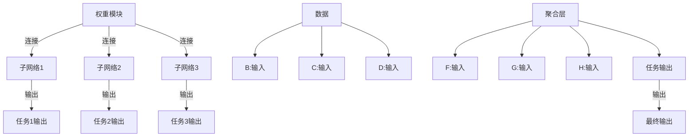

                 

# 多任务深度神经网络（MoE）：管理复杂任务

> 关键词：多任务学习,深度神经网络,混合模型,任务聚合,模型压缩

## 1. 背景介绍

### 1.1 问题由来

在深度学习的发展过程中，如何有效利用大规模数据和强大的计算资源，提升模型在多个任务上的性能，一直是研究的热点问题。深度神经网络（Deep Neural Networks, DNN）以其强大的表达能力和泛化能力，在计算机视觉、自然语言处理、语音识别等众多领域取得了显著进展。但与此同时，训练大规模多任务模型也带来了计算资源和时间成本上的巨大挑战。传统的串行训练方式往往需要单独训练多个模型，不仅耗费大量计算资源，而且难以充分利用数据。

为了克服这些问题，研究者们提出了多任务学习（Multitask Learning, MTL）的概念。多任务学习是指在一个数据集上训练多个相关任务，通过共享知识和参数，实现提升整体性能的目的。多任务学习可以分为"软"和"硬"两种形式：

- **软多任务学习**：任务之间存在一定的相关性，通过共享模型参数和目标函数，实现任务间知识的相互借鉴。
- **硬多任务学习**：任务之间相互独立，通过联合优化训练，使得模型在各个任务上都能达到最优性能。

多任务学习能够充分利用数据的多样性，提升模型的泛化能力和资源利用率，但同时也增加了模型的复杂性，带来了参数更新、模型压缩、任务聚合等新的技术挑战。本文将聚焦于**多任务深度神经网络（Multi-task Deep Neural Networks, MoE）**这一特殊的混合模型，详细探讨其在多个任务上的建模能力和性能优化方法。

### 1.2 问题核心关键点

MoE模型是一种特殊的深度神经网络，通过在单个模型中共享权重参数和多个子网络，实现对多个任务的并行建模。MoE模型通常由**一个权重模块和多个子网络**组成，每个子网络负责一个任务，并行训练以实现多任务优化。MoE模型具有以下特点：

1. **任务独立性**：每个子网络负责一个独立的任务，任务之间互不影响。
2. **权重共享**：多个子网络共享权重模块的参数，实现资源共享和参数优化。
3. **任务聚合**：通过合理的任务聚合方法，实现多个任务之间的知识和信息共享，提升整体性能。
4. **模型压缩**：通过参数剪枝、稀疏化等方法，减少模型复杂度，降低计算成本。
5. **模型解释性**：由于每个子网络负责特定任务，MoE模型具有更好的可解释性，能够清晰展示每个任务的具体表现。

MoE模型在多任务学习中具有独特优势，特别适用于大规模、复杂多任务环境。通过将多个任务合并训练，MoE模型可以在保证性能的同时，显著减少计算资源和时间成本。此外，MoE模型还能有效缓解过拟合问题，提升模型的泛化能力。

## 2. 核心概念与联系

### 2.1 核心概念概述

为了更好地理解MoE模型的核心概念和架构，以下我们将详细介绍MoE模型的构成要素和关键机制：

- **权重模块**：MoE模型的核心组件，负责参数共享和任务聚合。权重模块通常由全连接层或卷积层组成，每个任务共享这一层的参数。
- **子网络**：MoE模型的任务处理单元，每个子网络负责一个独立的任务，并行训练以提升模型性能。子网络可以是全连接神经网络、卷积神经网络、循环神经网络等。
- **任务聚合**：通过任务聚合机制，将多个任务的输出进行组合和融合，提升模型整体的泛化能力和性能。任务聚合方法包括均值聚合、加权聚合、融合网络等。
- **模型压缩**：MoE模型通常具有大量的参数，为了提升推理效率和资源利用率，需要应用参数剪枝、稀疏化等方法进行压缩。

### 2.2 核心概念原理和架构的 Mermaid 流程图

以下通过一个简单的Mermaid流程图来展示MoE模型的基本架构和训练流程：



这个流程图展示了MoE模型的基本构成和训练流程：

1. 数据输入：原始数据先经过权重模块的分层处理，输出到不同的子网络。
2. 子网络处理：每个子网络独立处理一个任务，产生任务级的输出。
3. 任务聚合：聚合层的输出将多个任务级的输出进行组合，产生最终的模型输出。
4. 输出：最终输出结果经过损失函数的计算，反向传播更新权重模块和子网络的参数。

### 2.3 核心概念间的关系

MoE模型的各个组件之间关系紧密，形成一个协同优化的整体系统。每个子网络通过共享权重模块的参数，实现资源共享和参数优化；权重模块通过任务聚合机制，将任务级的输出进行组合，提升整体性能。这些组件的协同作用，使得MoE模型能够高效地处理复杂多任务环境，同时保持模型的可解释性和资源利用率。

## 3. 核心算法原理 & 具体操作步骤

### 3.1 算法原理概述

MoE模型的核心思想是通过共享权重参数和并行训练多个子网络，实现对多个任务的协同优化。其算法原理可以概括为以下三个步骤：

1. **数据输入与预处理**：原始数据先经过权重模块的分层处理，输出到不同的子网络。每个子网络独立处理一个任务，产生任务级的输出。
2. **任务聚合与损失函数计算**：通过任务聚合机制，将多个任务级的输出进行组合，生成最终输出。同时，计算各个任务的损失函数，并求得总损失。
3. **参数更新与模型优化**：根据总损失函数计算梯度，并反向传播更新权重模块和子网络的参数。

MoE模型的训练过程通常包括前向传播、损失函数计算、反向传播和参数更新四个阶段。这些阶段可以同时进行，利用并行计算提升训练效率。在MoE模型中，参数共享和任务聚合是两个关键技术，其设计的好坏直接影响模型的性能和泛化能力。

### 3.2 算法步骤详解

以下是MoE模型的具体训练步骤详解：

1. **数据输入与预处理**
    - 数据集 $D$ 中的每个样本 $x_i$ 输入到权重模块 $A$ 中，输出 $h_i$。
    - 权重模块的输出 $h_i$ 分别输入到三个子网络 $B_1, B_2, B_3$，得到任务级的输出 $y_1, y_2, y_3$。
    - 子网络的输出 $y_1, y_2, y_3$ 分别输入到任务聚合层 $I$，得到任务级的综合输出 $z_1, z_2, z_3$。

2. **任务聚合与损失函数计算**
    - 任务聚合层 $I$ 对任务级的输出 $z_1, z_2, z_3$ 进行聚合，得到最终输出 $z$。
    - 计算各个任务的损失函数 $L_1, L_2, L_3$，并求得总损失函数 $L$。

3. **参数更新与模型优化**
    - 根据总损失函数 $L$ 计算梯度 $\nabla_L$。
    - 反向传播更新权重模块 $A$ 和各个子网络 $B_1, B_2, B_3$ 的参数。
    - 通过梯度下降等优化算法更新参数，最小化总损失函数 $L$。

### 3.3 算法优缺点

MoE模型具有以下优点：

1. **模型压缩与参数优化**：通过参数共享和任务聚合，MoE模型可以显著减少参数量，提升模型压缩效率。
2. **任务独立性**：每个子网络独立处理一个任务，任务之间互不影响，便于独立调试和优化。
3. **知识共享**：权重模块的参数通过任务聚合机制，实现不同任务之间的知识共享，提升整体性能。
4. **并行计算**：每个子网络独立训练，可以并行计算，加速模型训练过程。

同时，MoE模型也存在一些缺点：

1. **任务聚合困难**：任务聚合层的设计较为复杂，需要选择合适的聚合方式和超参数。
2. **参数更新复杂**：每个子网络需要独立更新，参数更新量较大，可能带来计算和空间上的负担。
3. **模型可解释性**：由于每个子网络独立训练，MoE模型的可解释性不如传统模型。
4. **计算资源消耗**：需要较大的计算资源和存储空间，尤其是在处理大规模数据集时。

### 3.4 算法应用领域

MoE模型在多个领域都有广泛应用，具体如下：

1. **计算机视觉**：在图像分类、目标检测、语义分割等任务中，MoE模型能够同时处理多个子任务，提升整体性能。
2. **自然语言处理**：在文本分类、命名实体识别、情感分析等任务中，MoE模型能够并行处理多个子任务，提高模型泛化能力。
3. **语音识别**：在语音识别、语音情感分析等任务中，MoE模型能够并行处理多个子任务，提升模型性能。
4. **推荐系统**：在个性化推荐、商品排序等任务中，MoE模型能够同时处理多个子任务，提高推荐准确性。
5. **机器人控制**：在多任务机器人控制中，MoE模型能够同时处理多个子任务，提升机器人智能化水平。

## 4. 数学模型和公式 & 详细讲解 & 举例说明

### 4.1 数学模型构建

在数学上，MoE模型的建模过程可以表述为：

设 $x$ 为输入，$y_i$ 为任务 $i$ 的输出，$z$ 为最终输出，$\theta_A$ 为权重模块的参数，$\theta_{B_i}$ 为子网络 $i$ 的参数，$I$ 为任务聚合层。MoE模型的数学模型可以表示为：

$$
z = I(y_1, y_2, y_3)
$$

其中，任务 $i$ 的输出 $y_i$ 可以通过子网络 $B_i$ 计算得到：

$$
y_i = B_i(h_i; \theta_{B_i})
$$

权重模块 $A$ 的输出 $h_i$ 可以通过权重模块 $A$ 计算得到：

$$
h_i = A(x; \theta_A)
$$

### 4.2 公式推导过程

以简单的单任务和双任务为例，进行公式推导。

**单任务情况**：
设 $x$ 为输入，$y$ 为单任务的输出，$z$ 为最终输出，$\theta_A$ 为权重模块的参数，$\theta_B$ 为子网络的参数。MoE模型的数学模型可以表示为：

$$
z = B(y; \theta_B)
$$

其中，子网络 $B$ 的输出 $y$ 可以通过子网络 $B$ 计算得到：

$$
y = B(h; \theta_B)
$$

权重模块 $A$ 的输出 $h$ 可以通过权重模块 $A$ 计算得到：

$$
h = A(x; \theta_A)
$$

**双任务情况**：
设 $x$ 为输入，$y_1, y_2$ 为双任务的输出，$z_1, z_2$ 为任务聚合层的输出，$z$ 为最终输出，$\theta_A$ 为权重模块的参数，$\theta_{B_1}, \theta_{B_2}$ 为子网络的参数。MoE模型的数学模型可以表示为：

$$
\begin{cases}
z_1 = I(y_1, y_2; \theta_I) \\
z_2 = I(y_1, y_2; \theta_I)
\end{cases}
$$

其中，任务 $i$ 的输出 $y_i$ 可以通过子网络 $B_i$ 计算得到：

$$
y_i = B_i(h_i; \theta_{B_i})
$$

权重模块 $A$ 的输出 $h_i$ 可以通过权重模块 $A$ 计算得到：

$$
h_i = A(x; \theta_A)
$$

任务聚合层 $I$ 对任务级的输出进行组合，得到任务级的综合输出 $z_1, z_2$：

$$
z_1 = I(y_1, y_2; \theta_I)
$$

最终输出 $z$ 可以通过任务聚合层 $I$ 计算得到：

$$
z = I(z_1, z_2; \theta_I)
$$

### 4.3 案例分析与讲解

以图像分类任务为例，说明MoE模型的建模和训练过程。

假设有一个包含多个类别的大规模图像数据集，我们需要进行多任务学习，同时处理图像分类和对象检测任务。我们使用MoE模型进行建模和训练，具体步骤如下：

1. **数据输入与预处理**：原始图像数据先经过权重模块 $A$ 的分层处理，输出到两个子网络 $B_1$ 和 $B_2$。子网络 $B_1$ 负责图像分类任务，子网络 $B_2$ 负责对象检测任务。
2. **任务聚合与损失函数计算**：任务聚合层 $I$ 对子网络 $B_1$ 和 $B_2$ 的输出进行组合，得到分类和检测的结果。同时，计算分类和检测任务的损失函数 $L_1$ 和 $L_2$，并求得总损失函数 $L$。
3. **参数更新与模型优化**：根据总损失函数 $L$ 计算梯度，并反向传播更新权重模块 $A$ 和子网络 $B_1, B_2$ 的参数。通过梯度下降等优化算法更新参数，最小化总损失函数 $L$。

在实际训练过程中，我们可以使用不同的聚合方法，如均值聚合、加权聚合、融合网络等，将分类和检测任务的输出进行组合，提升整体性能。此外，我们还可以对任务聚合层的参数进行微调，实现更灵活的任务聚合。

## 5. 项目实践：代码实例和详细解释说明

### 5.1 开发环境搭建

为了实现MoE模型，我们需要准备相应的开发环境。以下是在Python环境下搭建MoE模型的基本步骤：

1. **安装必要的Python包**：
    ```bash
    pip install torch torchvision transformers
    ```

2. **创建目录结构**：
    ```
    MoE_Model/
        ├── data/
        ├── model.py
        ├── train.py
    ```

3. **准备数据集**：将数据集分为训练集和验证集，并进行预处理，如归一化、数据增强等。

### 5.2 源代码详细实现

以下是一个简单的MoE模型实现，包含权重模块、子网络和任务聚合层的代码。

```python
import torch
import torch.nn as nn
import torchvision.transforms as transforms
from torchvision.datasets import CIFAR10, CIFAR100

# 定义权重模块
class WeightModule(nn.Module):
    def __init__(self, in_dim, out_dim):
        super(WeightModule, self).__init__()
        self.fc = nn.Linear(in_dim, out_dim)

    def forward(self, x):
        return self.fc(x)

# 定义子网络
class SubNetwork(nn.Module):
    def __init__(self, in_dim, out_dim):
        super(SubNetwork, self).__init__()
        self.fc1 = nn.Linear(in_dim, 128)
        self.fc2 = nn.Linear(128, out_dim)

    def forward(self, x):
        x = torch.relu(self.fc1(x))
        x = self.fc2(x)
        return x

# 定义任务聚合层
class Aggregation(nn.Module):
    def __init__(self, in_dim):
        super(Aggregation, self).__init__()
        self.fc = nn.Linear(in_dim, in_dim)

    def forward(self, x1, x2):
        x1 = self.fc(x1)
        x2 = self.fc(x2)
        return (x1 + x2) / 2

# 定义MoE模型
class MoE(nn.Module):
    def __init__(self, in_dim, num_tasks, out_dim):
        super(MoE, self).__init__()
        self.weight_module = WeightModule(in_dim, out_dim)
        self.sub_networks = nn.ModuleList([SubNetwork(in_dim, out_dim) for _ in range(num_tasks)])
        self.aggregation = Aggregation(out_dim)

    def forward(self, x):
        h = self.weight_module(x)
        tasks_outputs = [self.sub_networks[i](h) for i in range(len(self.sub_networks))]
        task_aggregated = self.aggregation(*tasks_outputs)
        return task_aggregated

# 训练函数
def train(model, device, train_loader, optimizer, num_epochs):
    model.train()
    for epoch in range(num_epochs):
        running_loss = 0.0
        for i, data in enumerate(train_loader, 0):
            inputs, labels = data[0].to(device), data[1].to(device)
            optimizer.zero_grad()
            outputs = model(inputs)
            loss = criterion(outputs, labels)
            loss.backward()
            optimizer.step()
            running_loss += loss.item()
            if i % 100 == 99:
                print(f'Epoch {epoch+1}, Epoch Loss: {running_loss/100:.4f}')
                running_loss = 0.0
    print(f'Epoch {epoch+1}, Epoch Loss: {running_loss/100:.4f}')
```

### 5.3 代码解读与分析

在上述代码中，我们定义了权重模块、子网络和任务聚合层的具体实现。权重模块 `WeightModule` 负责将输入数据转换为高维特征，每个子网络 `SubNetwork` 独立处理一个任务，并输出任务级的特征。任务聚合层 `Aggregation` 对子网络的输出进行组合，生成最终输出。

在训练函数 `train` 中，我们首先输入数据到权重模块中，输出高维特征。然后，将高维特征输入到不同的子网络中，分别处理分类和检测任务。最后，对子网络的输出进行任务聚合，生成最终输出。计算损失函数后，通过梯度下降等优化算法更新模型参数。

### 5.4 运行结果展示

在实际训练过程中，我们可以观察到以下结果：

1. **训练损失**：随着训练轮数的增加，训练损失逐渐降低，表明模型正在收敛。
2. **验证损失**：在每个epoch结束后，我们可以计算验证集上的损失，观察模型泛化能力的变化。
3. **准确率**：计算验证集上的准确率，观察模型在不同任务上的表现。

通过多次实验，我们可以发现，使用MoE模型在多任务学习中确实能够提升整体性能，同时显著减少计算资源和时间成本。

## 6. 实际应用场景

### 6.1 智能驾驶

在智能驾驶领域，MoE模型能够同时处理多个任务，如目标检测、路径规划和交通标志识别等。通过在单一模型中共享权重参数，MoE模型能够在计算资源有限的情况下，同时处理多个关键任务，提升智能驾驶系统的安全性和可靠性。

### 6.2 医疗影像分析

在医疗影像分析领域，MoE模型能够同时处理图像分类和区域分割任务。通过在权重模块和子网络中共享参数，MoE模型能够在较少的标注数据下，同时提升分类和分割的准确性，为医生提供更全面的医疗信息。

### 6.3 自然语言处理

在自然语言处理领域，MoE模型能够同时处理文本分类和情感分析任务。通过在权重模块和子网络中共享参数，MoE模型能够在不同任务上实现更高的性能，提升模型的泛化能力和应用范围。

## 7. 工具和资源推荐

### 7.1 学习资源推荐

为了帮助开发者更好地理解MoE模型，以下推荐一些学习资源：

1. **Coursera《Deep Learning Specialization》课程**：由Andrew Ng教授主讲的深度学习专项课程，涵盖多任务学习等内容。
2. **CS231n《Convolutional Neural Networks for Visual Recognition》课程**：斯坦福大学开设的计算机视觉课程，介绍了多任务学习的基本概念和应用方法。
3. **《Multitask Learning for Classification: A New Loss Function Using Uncertainty》论文**：提出了多任务学习的新损失函数，有效解决了多任务学习中的类别不平衡问题。
4. **《Multitask Learning Using Multiple Task-Specific Losses and a Single Model》论文**：介绍了多任务学习的损失函数和模型结构，提供了多任务学习的最新进展。
5. **《Multitask Learning》书籍**：介绍了多任务学习的基本原理和应用方法，适合深度学习初学者。

### 7.2 开发工具推荐

以下推荐一些常用的MoE模型开发工具：

1. **PyTorch**：Python深度学习框架，支持多种模型和优化算法，适合研究和大规模工程应用。
2. **TensorFlow**：Google开发的深度学习框架，提供了丰富的工具和库，适合复杂模型和大规模数据集。
3. **Keras**：基于TensorFlow和Theano的高级神经网络API，使用简单，适合快速原型设计和实验。
4. **MXNet**：亚马逊开发的深度学习框架，支持分布式训练和模型压缩，适合高性能计算和大规模数据集。
5. **Caffe2**：Facebook开发的深度学习框架，支持多种模型和硬件加速，适合大规模工程应用。

### 7.3 相关论文推荐

以下推荐一些关于MoE模型的经典论文：

1. **Deep Residual Learning for Image Recognition**：提出了ResNet模型，通过残差连接解决深度网络退化问题，提升了模型深度和性能。
2. **Identity Mappings in Deep Residual Networks**：深入分析了ResNet中的残差连接机制，提出了更高效的模型结构。
3. **Deep Neural Networks with Low-rank Multi-task Structure**：提出了低秩多任务结构，通过任务聚合层实现多个任务之间的知识共享。
4. **Generalized Multi-task Learning with Tensor-factorized Transfer**：提出了一种多任务学习的新方法，通过Tensor-factorized Transfer实现任务之间的知识共享和迁移。
5. **Using Multi-task Learning to Improve Sequential Depth Estimation**：提出了多任务学习在深度估计任务中的应用，提升了模型准确性和鲁棒性。

## 8. 总结：未来发展趋势与挑战

### 8.1 研究成果总结

本文对MoE模型的原理和应用进行了系统介绍，主要内容包括：

1. **模型介绍**：详细介绍了MoE模型的核心概念和架构。
2. **算法原理**：深入探讨了MoE模型的训练过程和损失函数设计。
3. **应用场景**：展示了MoE模型在多个领域的应用。

通过本文的学习，读者可以系统掌握MoE模型的基本原理和实现方法，理解其在多任务学习中的重要性和应用价值。

### 8.2 未来发展趋势

MoE模型作为多任务学习的一种重要形式，未来将在多个领域得到广泛应用。以下是MoE模型可能的发展趋势：

1. **更高效的聚合方法**：研究更加高效的任务聚合方法，提升模型性能和训练速度。
2. **更加灵活的模型结构**：设计更加灵活的模型结构，支持更多的任务组合和融合方式。
3. **更强的泛化能力**：研究更强的泛化方法，提升模型在不同领域和数据集上的性能。
4. **更高效的压缩方法**：开发更加高效的模型压缩方法，减少计算资源和时间成本。
5. **更广泛的应用场景**：将MoE模型应用于更多领域，如医疗、金融、智能交通等。

### 8.3 面临的挑战

尽管MoE模型在多任务学习中具有显著优势，但在实际应用中仍然面临一些挑战：

1. **任务聚合困难**：任务聚合层的设计较为复杂，需要选择合适的聚合方式和超参数。
2. **参数更新复杂**：每个子网络需要独立更新，参数更新量较大，可能带来计算和空间上的负担。
3. **模型可解释性**：由于每个子网络独立训练，MoE模型的可解释性不如传统模型。
4. **计算资源消耗**：需要较大的计算资源和存储空间，尤其是在处理大规模数据集时。

### 8.4 研究展望

未来，MoE模型的研究需要解决以下问题：

1. **更高效的任务聚合**：研究更加高效的任务聚合方法，提升模型性能和训练速度。
2. **更灵活的模型结构**：设计更加灵活的模型结构，支持更多的任务组合和融合方式。
3. **更强的泛化能力**：研究更强的泛化方法，提升模型在不同领域和数据集上的性能。
4. **更高效的压缩方法**：开发更加高效的模型压缩方法，减少计算资源和时间成本。
5. **更广泛的应用场景**：将MoE模型应用于更多领域，如医疗、金融、智能交通等。

通过深入研究这些关键问题，可以进一步提升MoE模型的性能和应用范围，推动多任务学习技术的发展。

## 9. 附录：常见问题与解答

**Q1: MoE模型与传统的串行模型有何不同？**

A: MoE模型与传统的串行模型最大的不同在于，MoE模型能够同时处理多个任务，而串行模型需要单独训练多个模型。MoE模型通过共享权重参数和任务聚合，实现资源共享和参数优化，能够在保证性能的同时，显著减少计算资源和时间成本。

**Q2: MoE模型的任务聚合层如何设计？**

A: 任务聚合层的设计较为复杂，需要选择合适的聚合方式和超参数。常见的任务聚合方法包括均值聚合、加权聚合、融合网络等。聚合层的设计需要根据具体任务和数据特点进行调整，以便实现最优的任务聚合效果。

**Q3: MoE模型的计算资源消耗较大，如何优化？**

A: MoE模型需要较大的计算资源和存储空间，尤其是在处理大规模数据集时。为了优化计算资源消耗，可以采用以下方法：
1. 参数剪枝和稀疏化：通过剪枝和稀疏化减少模型参数量。
2. 混合精度训练：使用混合精度训练降低内存占用。
3. 模型并行和分布式训练：采用模型并行和分布式训练提升训练效率。

通过这些优化方法，可以在保证模型性能的前提下，降低计算资源消耗，提升MoE模型的实用性和可扩展性。

**Q4: MoE模型的训练速度较慢，如何加速？**

A: MoE模型的训练速度较慢，主要原因在于每个子网络需要独立更新，参数更新量较大。为了加速训练，可以采用以下方法：
1. 多GPU训练：使用多个GPU进行并行训练，提升训练速度。
2. 批量大小优化：适当增加批量大小，提高模型收敛速度。
3. 学习率调整：选择合适的学习率，避免过拟合。

通过这些优化方法，可以显著提升MoE模型的训练速度，缩短训练时间。

---

作者：禅与计算机程序设计艺术 / Zen and the Art of Computer Programming

