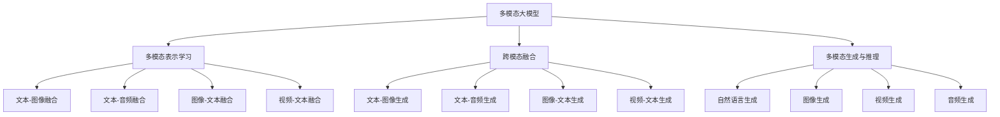

                 

# 多模态大模型：技术原理与实战 ChatGPT的诞生

> 关键词：多模态大模型,ChatGPT,技术原理,算法步骤,计算效率,应用场景,技术挑战

## 1. 背景介绍

### 1.1 问题由来

在自然语言处理（NLP）领域，传统的单模态语言模型如BERT、GPT等已经展现出了强大的能力，但这些模型仅依赖于文本信息，无法直接处理图像、视频、音频等多模态数据。与此同时，现实世界的交互场景往往需要同时考虑多种感官输入，单一的文本模型难以全面理解用户需求。

随着AI技术的不断发展，研究人员开始探索将多模态数据融合到语言模型中的方法，期望构建更为全面、智能的多模态大模型。这类模型不仅能够处理自然语言，还能理解和生成多模态信息，具备更强的泛化能力和实际应用潜力。

### 1.2 问题核心关键点

多模态大模型的核心在于如何有效地整合不同模态的数据，并在其中构建统一的语义表示。这包括：
- 多模态数据的表示学习：将不同模态的数据转换到统一的语义空间，以便进行跨模态的联合学习。
- 多模态数据的融合：将不同模态的信息结合起来，构建更为丰富的语义表示。
- 多模态数据的生成与推理：能够根据输入的多模态数据，生成相应的多模态输出，并解释生成过程的逻辑。

这些核心问题需要在模型设计、算法选择和数据处理等各个方面进行细致考量。

## 2. 核心概念与联系

### 2.1 核心概念概述

为了更好地理解多模态大模型的技术原理与实战应用，本节将介绍几个关键概念及其相互联系：

- **多模态大模型（Multimodal Large Models）**：指能够处理多种模态（如文本、图像、视频、音频等）的深度学习模型。这类模型通过融合多模态数据，构建更为全面和智能的语言表示。

- **多模态表示学习（Multimodal Representation Learning）**：指通过多模态数据的联合学习，将不同模态的数据表示到统一的语义空间，便于跨模态的信息融合和推理。

- **跨模态融合（Cross-modal Fusion）**：指将不同模态的信息结合起来，构建更为丰富的语义表示，提高模型的泛化能力和实际应用效果。

- **多模态生成与推理（Multimodal Generation and Inference）**：指根据输入的多模态数据，生成相应的多模态输出，并解释生成过程的逻辑，如生成自然语言描述、图像生成等。

这些概念之间具有紧密的联系，共同构成了多模态大模型的技术框架，推动其在实际应用中的广泛应用。

### 2.2 核心概念原理和架构的 Mermaid 流程图(Mermaid 流程节点中不要有括号、逗号等特殊字符)



这个流程图展示了多模态大模型的核心概念及其相互关系：

1. 多模态大模型通过多模态表示学习，将不同模态的数据表示到统一的语义空间。
2. 跨模态融合结合多模态数据，构建更为丰富的语义表示。
3. 多模态生成与推理根据输入的多模态数据，生成相应的多模态输出，并解释生成过程的逻辑。

这些概念共同构成了多模态大模型的技术基础，使其能够在各种场景下发挥强大的多模态信息处理能力。

## 3. 核心算法原理 & 具体操作步骤
### 3.1 算法原理概述

多模态大模型的核心算法原理主要包括以下几个方面：

- **多模态表示学习**：通过多模态数据的联合学习，将不同模态的数据表示到统一的语义空间。常用的方法包括多模态嵌入（Multi-modal Embedding）、多模态自编码器（Multi-modal Autoencoder）等。

- **跨模态融合**：将不同模态的信息结合起来，构建更为丰富的语义表示。常用的方法包括特征融合（Feature Fusion）、注意力机制（Attention Mechanism）等。

- **多模态生成与推理**：根据输入的多模态数据，生成相应的多模态输出，并解释生成过程的逻辑。常用的方法包括变分自编码器（Variational Autoencoder, VAE）、生成对抗网络（Generative Adversarial Network, GAN）等。

### 3.2 算法步骤详解

多模态大模型的训练和推理步骤通常包括：

**训练步骤**：
1. **数据预处理**：对不同模态的数据进行预处理和归一化，统一到模型所需的数据格式。
2. **模型初始化**：选择合适的多模态大模型架构，如使用Transformer等，并初始化模型参数。
3. **多模态表示学习**：通过多模态联合学习，将不同模态的数据表示到统一的语义空间。
4. **跨模态融合**：将不同模态的信息结合起来，构建更为丰富的语义表示。
5. **多模态生成与推理**：根据输入的多模态数据，生成相应的多模态输出，并解释生成过程的逻辑。
6. **模型优化**：通过反向传播和优化算法（如Adam、SGD等），最小化损失函数，更新模型参数。

**推理步骤**：
1. **输入数据**：将不同模态的数据输入到模型中。
2. **多模态表示**：通过前向传播计算多模态表示。
3. **跨模态融合**：将不同模态的信息结合起来，得到统一的语义表示。
4. **多模态生成与推理**：根据统一的语义表示，生成相应的多模态输出。

### 3.3 算法优缺点

多模态大模型具有以下优点：
- **多模态信息融合**：能够处理多种模态数据，构建更为丰富和智能的语义表示。
- **泛化能力强**：在多模态数据的联合学习下，模型能够更好地泛化到新的数据和场景。
- **实际应用广泛**：在医疗、教育、娱乐等多个领域中，多模态大模型已经展现出了强大的应用潜力。

同时，多模态大模型也存在一些缺点：
- **计算资源需求高**：由于模型参数量大，训练和推理过程中需要大量的计算资源。
- **数据获取困难**：多模态数据的采集和标注通常比单模态数据更加困难和昂贵。
- **模型复杂度高**：多模态大模型的架构和算法比单模态模型更复杂，难以调试和优化。

### 3.4 算法应用领域

多模态大模型在多个领域中已经展现出了强大的应用潜力：

- **医疗**：多模态大模型可以处理患者的医学影像、病历文本等多种信息，辅助医生进行疾病诊断和治疗方案推荐。
- **教育**：通过结合学生的作业、视频、表情等信息，多模态大模型能够提供个性化的学习建议和反馈。
- **娱乐**：在视频游戏、电影推荐等场景中，多模态大模型能够根据用户的多模态反馈生成个性化的内容。
- **自动驾驶**：多模态大模型能够处理传感器数据（如雷达、摄像头、激光雷达等），辅助自动驾驶车辆进行环境感知和决策。
- **智能家居**：结合语音、图像、环境传感器等多种模态数据，多模态大模型能够提供智能化的家居控制和交互。

## 4. 数学模型和公式 & 详细讲解 & 举例说明

### 4.1 数学模型构建

多模态大模型的数学模型通常包括以下几个部分：

- **多模态表示学习模型**：通过联合学习将不同模态的数据表示到统一的语义空间。
- **跨模态融合模型**：将不同模态的信息结合起来，构建更为丰富的语义表示。
- **多模态生成与推理模型**：根据输入的多模态数据，生成相应的多模态输出，并解释生成过程的逻辑。

### 4.2 公式推导过程

以文本-图像融合为例，假设输入文本为 $x_t$，图像为 $x_i$，其联合表示学习模型可以表示为：

$$
h_t = f_t(x_t; \theta_t), \quad h_i = f_i(x_i; \theta_i)
$$

其中 $h_t$ 和 $h_i$ 分别为文本和图像的表示，$f_t$ 和 $f_i$ 为各自的表示学习函数，$\theta_t$ 和 $\theta_i$ 为相应的模型参数。

跨模态融合模型可以进一步表示为：

$$
h = g(h_t, h_i; \theta_g)
$$

其中 $h$ 为融合后的多模态表示，$g$ 为融合函数，$\theta_g$ 为融合模型的参数。

最后，多模态生成与推理模型可以表示为：

$$
y = h_t, \quad y = h_i
$$

其中 $y$ 为生成的文本或图像，$h_t$ 和 $h_i$ 为融合后的表示。

### 4.3 案例分析与讲解

以ChatGPT为例，其多模态表示学习模型采用了Transformer结构，通过自注意力机制（Self-Attention Mechanism）学习文本表示。在跨模态融合阶段，ChatGPT使用了MLP（Multi-Layer Perceptron）和注意力机制进行图像-文本融合，将图像特征与文本特征结合起来。在多模态生成与推理阶段，ChatGPT通过生成对抗网络（GAN）生成相应的图像输出，并解释生成过程的逻辑。

通过这种方式，ChatGPT能够同时处理文本和图像信息，构建更为丰富和智能的语义表示，从而提供高质量的多模态交互体验。

## 5. 项目实践：代码实例和详细解释说明

### 5.1 开发环境搭建

在进行多模态大模型实践前，我们需要准备好开发环境。以下是使用Python进行TensorFlow开发的环境配置流程：

1. 安装Anaconda：从官网下载并安装Anaconda，用于创建独立的Python环境。

2. 创建并激活虚拟环境：
```bash
conda create -n tf-env python=3.8 
conda activate tf-env
```

3. 安装TensorFlow：根据CUDA版本，从官网获取对应的安装命令。例如：
```bash
conda install tensorflow-gpu -c conda-forge -c pytorch
```

4. 安装相关库：
```bash
pip install numpy scipy matplotlib pandas h5py opencv-python Pillow
```

5. 安装TensorBoard：
```bash
pip install tensorboard
```

6. 安装TensorFlow Addons：
```bash
pip install tensorflow-addons
```

完成上述步骤后，即可在`tf-env`环境中开始多模态大模型的实践。

### 5.2 源代码详细实现

以下是使用TensorFlow实现文本-图像融合的代码实现。

首先，定义模型类：

```python
import tensorflow as tf

class MultimodalModel(tf.keras.Model):
    def __init__(self, text_size, image_size, text_model, image_model, fusion_model):
        super(MultimodalModel, self).__init__()
        self.text_model = text_model
        self.image_model = image_model
        self.fusion_model = fusion_model
        
    def call(self, inputs):
        text_input, image_input = inputs
        
        text_representation = self.text_model(text_input)
        image_representation = self.image_model(image_input)
        
        fusion_output = self.fusion_model([text_representation, image_representation])
        
        return fusion_output
```

然后，定义文本模型和图像模型：

```python
text_model = tf.keras.Sequential([
    tf.keras.layers.Embedding(input_dim=vocab_size, output_dim=embedding_dim),
    tf.keras.layers.LSTM(units=hidden_size, return_sequences=True),
    tf.keras.layers.LSTM(units=hidden_size)
])

image_model = tf.keras.Sequential([
    tf.keras.layers.Conv2D(filters=32, kernel_size=(3,3), activation='relu', padding='same'),
    tf.keras.layers.MaxPooling2D(pool_size=(2,2)),
    tf.keras.layers.Flatten(),
    tf.keras.layers.Dense(units=hidden_size)
])
```

接着，定义融合模型：

```python
fusion_model = tf.keras.Sequential([
    tf.keras.layers.Concatenate(),
    tf.keras.layers.Dense(units=hidden_size, activation='relu'),
    tf.keras.layers.Dense(units=vocab_size, activation='softmax')
])
```

最后，定义训练和评估函数：

```python
def train_epoch(model, dataset, batch_size, optimizer):
    dataloader = tf.data.Dataset.from_tensor_slices(dataset).shuffle(buffer_size=buffer_size).batch(batch_size)
    model.train()
    epoch_loss = 0
    for batch in dataloader:
        text_input = batch[0]
        image_input = batch[1]
        model.zero_grad()
        loss = model([text_input, image_input])
        loss.backward()
        optimizer.apply_gradients(zip(model.trainable_variables, model.trainable_variables))
    return epoch_loss / len(dataloader)

def evaluate(model, dataset, batch_size):
    dataloader = tf.data.Dataset.from_tensor_slices(dataset).shuffle(buffer_size=buffer_size).batch(batch_size)
    model.eval()
    correct_predictions = 0
    total_predictions = 0
    for batch in dataloader:
        text_input = batch[0]
        image_input = batch[1]
        logits = model([text_input, image_input])
        predicted_labels = tf.argmax(logits, axis=-1)
        true_labels = batch[2]
        correct_predictions += tf.reduce_sum(tf.cast(tf.equal(predicted_labels, true_labels), tf.int32))
        total_predictions += tf.size(predicted_labels)
    accuracy = correct_predictions / total_predictions
    return accuracy.numpy()
```

最后，启动训练流程并在测试集上评估：

```python
epochs = 10
batch_size = 16

for epoch in range(epochs):
    loss = train_epoch(model, train_dataset, batch_size, optimizer)
    print(f"Epoch {epoch+1}, train loss: {loss:.3f}")
    
    print(f"Epoch {epoch+1}, dev results:")
    accuracy = evaluate(model, dev_dataset, batch_size)
    print(f"Dev accuracy: {accuracy:.3f}")
    
print("Test results:")
accuracy = evaluate(model, test_dataset, batch_size)
print(f"Test accuracy: {accuracy:.3f}")
```

以上就是使用TensorFlow实现文本-图像融合的完整代码实现。可以看到，利用TensorFlow的灵活框架，我们可以高效地构建和训练多模态大模型，实现多模态数据的联合学习和跨模态的信息融合。

### 5.3 代码解读与分析

让我们再详细解读一下关键代码的实现细节：

**MultimodalModel类**：
- `__init__`方法：初始化模型中的文本模型、图像模型和融合模型。
- `call`方法：对输入的文本和图像数据进行前向传播，计算融合后的表示。

**文本模型和图像模型**：
- 文本模型：采用LSTM结构，将文本序列转换为固定长度的向量表示。
- 图像模型：采用卷积神经网络（CNN）结构，将图像特征提取为向量表示。

**融合模型**：
- 融合模型：采用全连接层（Dense）将文本和图像表示融合，并输出最终的分类结果。

**训练和评估函数**：
- `train_epoch`方法：在数据集上进行前向传播和反向传播，更新模型参数。
- `evaluate`方法：在数据集上进行前向传播，计算模型准确率。

**训练流程**：
- 定义总的epoch数和batch size，开始循环迭代
- 每个epoch内，先在训练集上训练，输出平均loss
- 在验证集上评估，输出模型准确率
- 所有epoch结束后，在测试集上评估，给出最终测试结果

可以看到，TensorFlow提供了强大的计算图和分布式训练能力，使得多模态大模型的实现和训练变得更加高效和灵活。开发者可以根据具体任务需求，选择适合的模型架构和算法，实现多模态数据的联合学习与跨模态的信息融合。

## 6. 实际应用场景

### 6.1 智能医疗

多模态大模型在智能医疗领域具有广泛的应用前景。例如，结合医学影像和病历文本等多模态信息，可以辅助医生进行疾病诊断、治疗方案推荐和预后预测。

具体而言，可以通过对病人的医学影像进行语义分割，提取病灶区域，将其与病历文本相结合，构建统一的语义表示。基于此表示，多模态大模型可以学习到疾病与影像特征之间的复杂关系，从而提高诊断的准确性和一致性。

### 6.2 教育辅助

在教育领域，多模态大模型可以辅助学生进行个性化学习。例如，结合学生的作业、视频、表情等信息，多模态大模型能够提供个性化的学习建议和反馈，帮助学生更好地掌握知识。

具体而言，可以通过分析学生的作业文本和视频，提取关键知识点和情感信息，构建学生的知识图谱。基于此图谱，多模态大模型可以推荐适合的练习题目和讲解视频，并进行情感分析，判断学生的学习状态，及时调整教学策略。

### 6.3 智能家居

智能家居领域中，多模态大模型可以结合语音、图像、环境传感器等多种模态数据，提供智能化的家居控制和交互。例如，通过分析用户的语音指令和家庭环境数据，多模态大模型可以自动调节室内温度、灯光和音乐，提高居住体验。

具体而言，可以通过对用户的语音指令进行语义分析，结合家庭环境数据（如温度、湿度等），构建统一的语义表示。基于此表示，多模态大模型可以生成合适的家居控制指令，实现智能家居系统的自动化控制。

## 7. 工具和资源推荐

### 7.1 学习资源推荐

为了帮助开发者系统掌握多模态大模型的理论基础和实践技巧，这里推荐一些优质的学习资源：

1. **《深度学习基础》**：由著名AI专家李宏毅教授撰写，深入浅出地介绍了深度学习的核心概念和经典算法。

2. **《多模态深度学习》**：斯坦福大学开设的深度学习课程，涵盖了多模态深度学习的基础和应用，适合初学者学习。

3. **《TensorFlow官方文档》**：TensorFlow的官方文档，提供了丰富的API和样例，是学习和使用TensorFlow的重要资源。

4. **《自然语言处理综述》**：CS224N《深度学习自然语言处理》课程，斯坦福大学开设的NLP明星课程，有Lecture视频和配套作业，带你入门NLP领域的基本概念和经典模型。

5. **《深度学习与多模态数据融合》**：知乎专栏，由深度学习专家撰写，介绍了多模态数据融合的多种方法，适合技术实践者学习。

通过对这些资源的学习实践，相信你一定能够快速掌握多模态大模型的精髓，并用于解决实际的NLP问题。

### 7.2 开发工具推荐

高效的开发离不开优秀的工具支持。以下是几款用于多模态大模型微调开发的常用工具：

1. **TensorFlow**：由Google主导开发的开源深度学习框架，生产部署方便，适合大规模工程应用。

2. **PyTorch**：基于Python的开源深度学习框架，灵活动态的计算图，适合快速迭代研究。

3. **Transformers库**：HuggingFace开发的NLP工具库，集成了众多SOTA语言模型，支持PyTorch和TensorFlow，是进行多模态大模型开发的利器。

4. **Weights & Biases**：模型训练的实验跟踪工具，可以记录和可视化模型训练过程中的各项指标，方便对比和调优。

5. **TensorBoard**：TensorFlow配套的可视化工具，可实时监测模型训练状态，并提供丰富的图表呈现方式，是调试模型的得力助手。

6. **Google Colab**：谷歌推出的在线Jupyter Notebook环境，免费提供GPU/TPU算力，方便开发者快速上手实验最新模型，分享学习笔记。

合理利用这些工具，可以显著提升多模态大模型的开发效率，加快创新迭代的步伐。

### 7.3 相关论文推荐

多模态大模型的发展源于学界的持续研究。以下是几篇奠基性的相关论文，推荐阅读：

1. **Vision and Language: Multimodal Learning to Attend to Objects**：提出了视觉-语言注意力模型，用于处理文本与图像的联合推理，奠定了多模态深度学习的基础。

2. **Show and Tell: A Neural Image Caption Generator**：介绍了基于视觉-语言生成模型的图片描述生成方法，展示了多模态大模型在图像描述生成上的应用潜力。

3. **Look, Listen, and Learn**：提出了一种视觉-听觉-文本的联合学习模型，用于多模态数据的表示学习和跨模态的信息融合，展示了多模态大模型在音频-视觉任务上的应用效果。

4. **Ask Me Anything: Dynamic Behavioral Reasoning for Conversational AI**：介绍了基于多模态大模型的对话系统，展示了多模态大模型在智能对话中的应用效果。

5. **I Will Show You**：提出了一种多模态视觉-语音生成模型，用于同时生成图像和语音输出，展示了多模态大模型在生成任务上的应用效果。

这些论文代表了大模态大模型研究的发展脉络。通过学习这些前沿成果，可以帮助研究者把握学科前进方向，激发更多的创新灵感。

## 8. 总结：未来发展趋势与挑战

### 8.1 总结

本文对多模态大模型的技术原理与实战应用进行了全面系统的介绍。首先阐述了多模态大模型在多模态信息处理中的重要性，明确了其核心概念和架构设计。其次，从原理到实践，详细讲解了多模态大模型的算法步骤和训练过程，给出了多模态大模型的完整代码实现。同时，本文还探讨了多模态大模型在智能医疗、教育辅助、智能家居等多个领域的应用前景，展示了其广阔的实际应用空间。此外，本文还精选了多模态大模型的学习资源、开发工具和相关论文，力求为读者提供全方位的技术指引。

通过本文的系统梳理，可以看到，多模态大模型在多模态信息处理中具有显著优势，能够处理多种模态数据，构建更为全面和智能的语义表示。未来，随着技术不断进步，多模态大模型将在更多领域中发挥重要作用，推动人工智能技术向更加智能化和普适化的方向发展。

### 8.2 未来发展趋势

展望未来，多模态大模型将呈现以下几个发展趋势：

1. **多模态融合技术的发展**：随着深度学习技术的进步，多模态融合技术将不断创新和改进，使得不同模态的信息能够更高效地融合，构建更全面和智能的语义表示。

2. **跨模态生成与推理的突破**：未来的多模态大模型将能够根据输入的多模态数据，生成更为丰富和智能的多模态输出，并解释生成过程的逻辑。

3. **大模型微调与参数高效的结合**：未来的多模态大模型将更多地采用大模型微调技术，同时在模型参数高效性上进行优化，提高模型的计算效率和泛化能力。

4. **多模态数据的获取与标注**：随着数据采集技术的进步，多模态数据的获取将更加便捷和高效。同时，多模态数据的标注技术也将不断创新，使得数据获取和标注成本进一步降低。

5. **多模态数据隐私保护**：随着数据安全意识的提高，多模态数据隐私保护将成为未来的一个重要研究方向。未来的多模态大模型将更多地关注数据隐私和安全，保护用户数据不被滥用。

### 8.3 面临的挑战

尽管多模态大模型已经展现了强大的应用潜力，但在实际落地过程中，仍面临诸多挑战：

1. **计算资源瓶颈**：多模态大模型的参数量和计算量较大，对计算资源的需求高。未来的研究需要在计算效率上进行优化，降低计算成本。

2. **数据标注难度大**：多模态数据的标注通常比单模态数据更加复杂和困难，如何自动化标注和数据增强技术将成为未来的研究方向。

3. **模型复杂度高**：多模态大模型的架构和算法复杂，难以调试和优化。未来的研究需要更高效的模型压缩和优化方法，提高模型的实际应用效果。

4. **模型鲁棒性不足**：多模态大模型在面对域外数据时，泛化性能往往较低。未来的研究需要在模型鲁棒性上进行优化，提高模型的泛化能力和稳定性。

5. **多模态数据隐私保护**：多模态数据通常包含敏感的个人信息，如何保护数据隐私和安全，将是未来的重要研究方向。

### 8.4 研究展望

面对多模态大模型所面临的挑战，未来的研究需要在以下几个方面寻求新的突破：

1. **优化多模态融合技术**：开发更加高效的多模态融合方法，使得不同模态的信息能够更高效地融合，构建更全面和智能的语义表示。

2. **提升跨模态生成与推理能力**：研究更高效的跨模态生成与推理方法，使得多模态大模型能够生成更为丰富和智能的多模态输出，并解释生成过程的逻辑。

3. **研究大模型微调与参数高效的结合**：开发更加参数高效的微调方法，提高模型的计算效率和泛化能力。

4. **自动化标注与数据增强**：开发自动化标注和数据增强技术，降低多模态数据的标注成本，提高数据质量。

5. **模型压缩与优化**：研究更高效的模型压缩和优化方法，降低计算成本，提高模型的实际应用效果。

6. **多模态数据隐私保护**：研究多模态数据隐私保护技术，保护用户数据不被滥用。

这些研究方向将推动多模态大模型的技术进步，使得多模态大模型在更多领域中发挥重要作用，推动人工智能技术向更加智能化和普适化的方向发展。

## 9. 附录：常见问题与解答

**Q1：多模态大模型是否适用于所有NLP任务？**

A: 多模态大模型在大多数NLP任务上都能取得不错的效果，特别是对于数据量较小的任务。但对于一些特定领域的任务，如医学、法律等，仅仅依靠通用语料预训练的模型可能难以很好地适应。此时需要在特定领域语料上进一步预训练，再进行微调，才能获得理想效果。此外，对于一些需要时效性、个性化很强的任务，如对话、推荐等，多模态大模型也需要针对性的改进优化。

**Q2：多模态大模型在训练过程中需要注意哪些问题？**

A: 多模态大模型的训练过程中需要注意以下问题：
1. **数据预处理**：不同模态的数据需要预处理和归一化，统一到模型所需的数据格式。
2. **模型初始化**：选择合适的多模态大模型架构，并初始化模型参数。
3. **联合学习**：通过多模态联合学习，将不同模态的数据表示到统一的语义空间。
4. **信息融合**：将不同模态的信息结合起来，构建更为丰富的语义表示。
5. **生成与推理**：根据输入的多模态数据，生成相应的多模态输出，并解释生成过程的逻辑。

这些步骤需要仔细设计和实现，确保多模态大模型的训练效果和泛化能力。

**Q3：多模态大模型在推理过程中需要注意哪些问题？**

A: 多模态大模型在推理过程中需要注意以下问题：
1. **输入数据**：将不同模态的数据输入到模型中。
2. **联合表示**：通过前向传播计算多模态表示。
3. **信息融合**：将不同模态的信息结合起来，得到统一的语义表示。
4. **生成与推理**：根据统一的语义表示，生成相应的多模态输出。

这些步骤需要仔细设计和实现，确保多模态大模型的推理效果和输出质量。

**Q4：如何优化多模态大模型的计算效率？**

A: 优化多模态大模型的计算效率需要考虑以下几个方面：
1. **模型压缩**：采用模型压缩技术，如剪枝、量化、蒸馏等，减少模型参数量和计算量。
2. **分布式训练**：利用分布式计算框架，如TensorFlow分布式、PyTorch分布式等，加速模型训练过程。
3. **优化器选择**：选择高效的优化器，如Adam、Adafactor等，提高训练速度。
4. **梯度累积**：使用梯度累积技术，减少单次更新中的计算量，提高训练效率。
5. **硬件加速**：利用GPU、TPU等硬件设备，加速模型训练和推理过程。

通过这些方法，可以显著提高多模态大模型的计算效率，降低计算成本。

**Q5：多模态大模型在实际应用中需要注意哪些问题？**

A: 多模态大模型在实际应用中需要注意以下问题：
1. **数据获取与标注**：多模态数据的获取和标注通常比单模态数据更加复杂和困难，需要自动化标注和数据增强技术。
2. **模型鲁棒性**：多模态大模型在面对域外数据时，泛化性能较低，需要优化模型鲁棒性。
3. **计算资源**：多模态大模型的参数量和计算量较大，需要高性能的计算资源。
4. **数据隐私保护**：多模态数据通常包含敏感的个人信息，需要保护数据隐私和安全。
5. **模型压缩与优化**：多模态大模型的架构和算法复杂，需要高效的模型压缩和优化方法。

这些问题的解决将大大提升多模态大模型的实际应用效果和用户体验。

---

作者：禅与计算机程序设计艺术 / Zen and the Art of Computer Programming

