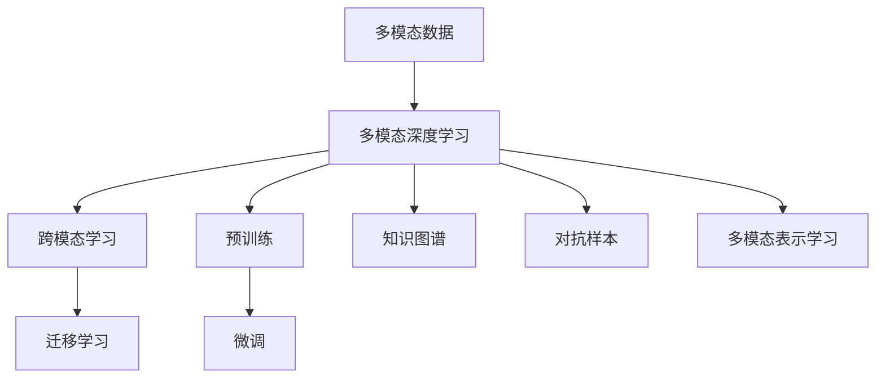

                 

# 多模态大模型：技术原理与实战 多模态大模型发展的重大里程碑

## 1. 背景介绍

### 1.1 问题由来
在人工智能的快速发展中，多模态学习（Multimodal Learning）成为了一种热门的研究方向。多模态学习是指学习同时涉及多个类型（如文本、图像、语音等）的数据，从而提升模型对于复杂、真实世界的理解和预测能力。而多模态大模型（Multimodal Large Models）则是指在这些多模态数据上预训练和微调的大型深度学习模型。

近年来，大语言模型如BERT、GPT系列在自然语言处理（NLP）领域取得了巨大成功，而多模态大模型的研究也在图像、视频、语音等模态上取得了显著进展。多模态大模型能够同时理解并处理文本、视觉、听觉等多种信息，从而提供了更为全面、准确的多模态表示能力。

### 1.2 问题核心关键点
多模态大模型研究的核心问题包括以下几个方面：
- 如何有效地整合不同模态的信息，构建多模态联合表示；
- 如何在大规模多模态数据上进行预训练，学习共性特征；
- 如何针对特定任务进行微调，提升模型性能；
- 如何设计高效、可扩展的多模态深度学习框架。

### 1.3 问题研究意义
研究多模态大模型对于拓展AI应用场景，提升模型泛化能力和适应性具有重要意义：

1. **提升综合理解能力**：多模态大模型能够整合多模态信息，提升对于复杂、真实世界的理解能力，广泛应用于医疗诊断、自动驾驶、智能客服等场景。
2. **增强泛化能力**：通过在大规模多模态数据上预训练，模型能够学习到共性特征，提升在不同任务上的泛化能力。
3. **加速落地应用**：预训练模型可以作为基础架构，快速适应各种下游任务，减少从头开始开发的时间成本。
4. **推动技术创新**：多模态大模型的研究催生了新的研究方向和技术方法，如跨模态学习、半监督学习等，推动了AI技术的创新发展。
5. **促进产业升级**：多模态大模型技术的应用将推动更多传统行业的数字化转型，提升工作效率和决策质量。

## 2. 核心概念与联系

### 2.1 核心概念概述

为更好地理解多模态大模型的技术原理与实战，本节将介绍几个密切相关的核心概念：

- **多模态数据（Multimodal Data）**：指同时包含文本、图像、语音等不同类型数据的信息集合。
- **多模态深度学习（Multimodal Deep Learning）**：使用深度学习模型对多模态数据进行建模和处理的技术。
- **跨模态学习（Cross-modal Learning）**：学习不同模态数据之间的关系，以实现跨模态信息的相互转换和理解。
- **预训练（Pre-training）**：在大规模无标签数据上训练模型，学习通用的知识表示。
- **微调（Fine-tuning）**：在预训练模型的基础上，使用下游任务的少量标注数据进行微调，提升模型在特定任务上的性能。
- **迁移学习（Transfer Learning）**：将在一个模态上学习的知识迁移到另一个模态上，以提升泛化能力。
- **知识图谱（Knowledge Graph）**：一种用于表示实体与实体间关系的图形结构，有助于模型理解语义关系。
- **对抗样本（Adversarial Examples）**：精心设计的输入样本，能够欺骗模型，导致错误预测，用于测试模型的鲁棒性。
- **多模态表示学习（Multimodal Representation Learning）**：学习如何将不同模态的信息联合表示，提升模型理解能力。

这些核心概念之间的逻辑关系可以通过以下Mermaid流程图来展示：



这个流程图展示了大语言模型研究的核心概念及其之间的关系：

1. 多模态数据是模型的输入。
2. 多模态深度学习模型用于对多模态数据进行建模和处理。
3. 跨模态学习用于学习不同模态数据之间的关系。
4. 预训练模型在大规模无标签数据上学习通用的知识表示。
5. 微调模型在预训练模型的基础上，针对特定任务进行优化。
6. 迁移学习将在一个模态上学习的知识迁移到另一个模态上。
7. 知识图谱用于表示实体与实体间的关系。
8. 对抗样本用于测试模型的鲁棒性。
9. 多模态表示学习用于将不同模态的信息联合表示。

这些概念共同构成了多模态大模型的学习和应用框架，使其能够在各种场景下发挥强大的多模态理解和生成能力。通过理解这些核心概念，我们可以更好地把握多模态大模型的工作原理和优化方向。

## 3. 核心算法原理 & 具体操作步骤
### 3.1 算法原理概述

多模态大模型研究的核心算法原理包括预训练、微调和迁移学习等。

### 3.2 算法步骤详解

**Step 1: 准备多模态数据**
- 收集不同类型的多模态数据，如文本、图像、语音等。
- 清洗数据，去除噪声和不相关数据。
- 划分训练集、验证集和测试集。

**Step 2: 选择预训练模型**
- 选择适合多模态数据类型的预训练模型，如BERT、ResNet、Inception等。
- 根据任务的复杂度和数据量，选择合适的预训练任务，如掩码语言模型、图像分类等。

**Step 3: 预训练模型微调**
- 在预训练模型的基础上，使用下游任务的少量标注数据进行微调。
- 选择合适的损失函数和优化算法，如交叉熵、Adam、SGD等。
- 设置合适的学习率和正则化技术，如L2正则、Dropout等。
- 训练模型，并在验证集上评估性能。
- 根据评估结果，调整超参数，继续训练。

**Step 4: 迁移学习**
- 在不同模态上使用预训练模型进行迁移学习，学习共性特征。
- 将迁移学习得到的知识应用到特定任务上，进行微调。
- 设计合适的任务适配层，如分类器、解码器等。

**Step 5: 多模态表示学习**
- 设计多模态融合机制，如concat、attention等，将不同模态的信息联合表示。
- 使用多模态融合后的表示进行下游任务的微调。
- 在训练集上迭代优化模型，直到收敛。

### 3.3 算法优缺点

多模态大模型研究具有以下优点：
- 能够处理多种类型的数据，提升模型的综合理解能力。
- 在大规模数据上进行预训练，学习共性特征，提升泛化能力。
- 通过微调和迁移学习，能够快速适应不同任务，提升模型性能。

同时，该方法也存在以下局限性：
- 多模态数据的收集和标注成本较高。
- 不同模态数据之间的信息转换和融合难度较大。
- 模型复杂度高，计算资源需求大。
- 模型泛化能力受限于预训练数据的质量和数量。

尽管存在这些局限性，但多模态大模型在多模态数据处理、跨模态信息融合等方面具有巨大的应用前景。未来相关研究的重点在于如何进一步降低数据成本，提高模型效率，优化信息融合机制，从而提升多模态大模型的实用性和适应性。

### 3.4 算法应用领域

多模态大模型在多个领域得到了广泛应用，包括：

- **医疗影像分析**：通过融合图像和文本信息，辅助医生进行疾病诊断和治疗方案制定。
- **自动驾驶**：利用视频、雷达等多模态数据，进行环境感知和行为决策。
- **智能客服**：结合语音、文本和情感信息，提供自然流畅的对话服务。
- **情感分析**：同时处理文本、语音和面部表情等，提升情感识别的准确性。
- **跨模态检索**：通过多模态数据的联合表示，提升检索效果。
- **虚拟现实**：利用语音、手势等多模态输入，增强虚拟现实的交互体验。

除了这些经典应用外，多模态大模型还在可穿戴设备、社交媒体分析、智能家居等多个领域展现出广泛的应用前景，为AI技术的发展注入了新的活力。

## 4. 数学模型和公式 & 详细讲解
### 4.1 数学模型构建

本节将使用数学语言对多模态大模型的预训练和微调过程进行更加严格的刻画。

记多模态数据为 $(\text{text}, \text{img}, \text{audio})$，其中 $\text{text}$ 为文本，$\text{img}$ 为图像，$\text{audio}$ 为音频。预训练模型为 $M_{\theta}$，其中 $\theta$ 为模型参数。假设预训练任务为 $(\text{masked language modeling}, \text{image classification})$。

定义模型 $M_{\theta}$ 在输入 $(\text{text}, \text{img}, \text{audio})$ 上的损失函数为 $\ell(M_{\theta}(\text{text}, \text{img}, \text{audio}), \text{label})$，则在数据集 $D=\{(\text{x}, \text{y})\}_{i=1}^N$ 上的经验风险为：

$$
\mathcal{L}(\theta) = \frac{1}{N}\sum_{i=1}^N \ell(M_{\theta}(\text{x}_i, \text{y}_i))
$$

其中 $\text{x}_i=(\text{text}_i, \text{img}_i, \text{audio}_i)$ 为输入，$\text{y}_i$ 为标注。

预训练过程中，使用掩码语言模型和图像分类任务进行联合训练，目标是最小化损失函数：

$$
\min_{\theta} \mathcal{L}(M_{\theta}(\text{text}, \text{img}, \text{audio}))
$$

微调过程中，使用下游任务的少量标注数据进行有监督学习，目标是最小化损失函数：

$$
\min_{\theta} \mathcal{L}(M_{\theta}(\text{text}, \text{img}, \text{audio}), \text{label})
$$

其中 $\text{label}$ 为下游任务的标注。

### 4.2 公式推导过程

以下我们以医疗影像分类为例，推导多模态大模型在医疗影像分类任务上的预训练和微调过程的数学公式。

**预训练过程：**

假设预训练任务为掩码语言模型和图像分类。模型在文本输入 $x_{\text{text}}$ 上的输出为 $M_{\theta}(\text{text})$，在图像输入 $x_{\text{img}}$ 上的输出为 $M_{\theta}(\text{img})$。文本的掩码语言模型损失函数为：

$$
\ell_{\text{text}} = -\sum_{i=1}^n [y_i \log \hat{y}_i + (1-y_i) \log (1-\hat{y}_i)]
$$

图像分类的损失函数为：

$$
\ell_{\text{img}} = \sum_{i=1}^c [y_i \log \hat{y}_i + (1-y_i) \log (1-\hat{y}_i)]
$$

其中 $n$ 为文本长度，$c$ 为分类数。

将两个损失函数加权求和，得：

$$
\mathcal{L}_{\text{pre}} = \lambda_{\text{text}}\ell_{\text{text}} + \lambda_{\text{img}}\ell_{\text{img}}
$$

其中 $\lambda_{\text{text}}$ 和 $\lambda_{\text{img}}$ 为不同模态任务的权重，一般设置 $\lambda_{\text{text}}=1$，$\lambda_{\text{img}}=1$。

**微调过程：**

假设微调任务为二分类。模型在文本输入 $x_{\text{text}}$ 和图像输入 $x_{\text{img}}$ 上的输出分别为 $M_{\theta}(\text{text})$ 和 $M_{\theta}(\text{img})$。微调的目标是最大化分类准确率，即最小化交叉熵损失：

$$
\ell_{\text{micro}} = -\frac{1}{N}\sum_{i=1}^N [y_i \log \hat{y}_i + (1-y_i) \log (1-\hat{y}_i)]
$$

其中 $y_i$ 为标注，$\hat{y}_i$ 为模型预测。

在微调过程中，使用交叉熵损失函数和Adam优化器进行训练：

$$
\min_{\theta} \mathcal{L}_{\text{micro}}(M_{\theta}(\text{text}, \text{img}), y)
$$

### 4.3 案例分析与讲解

以医疗影像分类为例，假设模型在CT影像上进行预训练，学习通用医学影像特征。预训练过程中，模型学习了CT影像的纹理、形态等特征，同时结合了医学报告文本的信息，提升了对影像的理解能力。预训练后，将模型应用于医疗影像分类的微调任务上，进一步学习了特定疾病的特征，提升了影像分类的准确性。

在微调过程中，可以设计合适的任务适配层，如多模态分类器，将文本和图像信息联合表示，提升分类效果。通过使用多模态融合技术，如concat、attention等，模型能够更好地整合不同模态的信息，提升对影像的感知能力。

## 5. 项目实践：代码实例和详细解释说明
### 5.1 开发环境搭建

在进行多模态大模型的实践前，我们需要准备好开发环境。以下是使用Python进行PyTorch开发的环境配置流程：

1. 安装Anaconda：从官网下载并安装Anaconda，用于创建独立的Python环境。

2. 创建并激活虚拟环境：
```bash
conda create -n pytorch-env python=3.8 
conda activate pytorch-env
```

3. 安装PyTorch：根据CUDA版本，从官网获取对应的安装命令。例如：
```bash
conda install pytorch torchvision torchaudio cudatoolkit=11.1 -c pytorch -c conda-forge
```

4. 安装Transformers库：
```bash
pip install transformers
```

5. 安装各类工具包：
```bash
pip install numpy pandas scikit-learn matplotlib tqdm jupyter notebook ipython
```

完成上述步骤后，即可在`pytorch-env`环境中开始多模态大模型的实践。

### 5.2 源代码详细实现

下面我们以医疗影像分类为例，给出使用Transformers库对BERT模型进行多模态预训练和微调的PyTorch代码实现。

首先，定义预训练任务：

```python
from transformers import BertModel, BertTokenizer, BertForSequenceClassification
from torch.utils.data import Dataset
import torch

class MultimodalDataset(Dataset):
    def __init__(self, texts, images, labels, tokenizer):
        self.texts = texts
        self.images = images
        self.labels = labels
        self.tokenizer = tokenizer
        self.max_len = 256
        
    def __len__(self):
        return len(self.texts)
    
    def __getitem__(self, item):
        text = self.texts[item]
        image = self.images[item]
        label = self.labels[item]
        
        encoding = self.tokenizer(text, return_tensors='pt', max_length=self.max_len, padding='max_length', truncation=True)
        input_ids = encoding['input_ids'][0]
        attention_mask = encoding['attention_mask'][0]
        
        # 图像特征提取
        img_tensor = torch.tensor(image)
        
        return {'input_ids': input_ids, 
                'attention_mask': attention_mask,
                'img_tensor': img_tensor,
                'labels': torch.tensor(label, dtype=torch.long)}
```

然后，定义模型和优化器：

```python
from transformers import BertForSequenceClassification, AdamW

model = BertForSequenceClassification.from_pretrained('bert-base-cased', num_labels=2)

optimizer = AdamW(model.parameters(), lr=2e-5)
```

接着，定义训练和评估函数：

```python
from torch.utils.data import DataLoader
from tqdm import tqdm
from sklearn.metrics import classification_report

device = torch.device('cuda') if torch.cuda.is_available() else torch.device('cpu')
model.to(device)

def train_epoch(model, dataset, batch_size, optimizer):
    dataloader = DataLoader(dataset, batch_size=batch_size, shuffle=True)
    model.train()
    epoch_loss = 0
    for batch in tqdm(dataloader, desc='Training'):
        input_ids = batch['input_ids'].to(device)
        attention_mask = batch['attention_mask'].to(device)
        img_tensor = batch['img_tensor'].to(device)
        labels = batch['labels'].to(device)
        model.zero_grad()
        outputs = model(input_ids, attention_mask=attention_mask, img_tensor=img_tensor)
        loss = outputs.loss
        epoch_loss += loss.item()
        loss.backward()
        optimizer.step()
    return epoch_loss / len(dataloader)

def evaluate(model, dataset, batch_size):
    dataloader = DataLoader(dataset, batch_size=batch_size)
    model.eval()
    preds, labels = [], []
    with torch.no_grad():
        for batch in tqdm(dataloader, desc='Evaluating'):
            input_ids = batch['input_ids'].to(device)
            attention_mask = batch['attention_mask'].to(device)
            img_tensor = batch['img_tensor'].to(device)
            batch_labels = batch['labels']
            outputs = model(input_ids, attention_mask=attention_mask, img_tensor=img_tensor)
            batch_preds = outputs.logits.argmax(dim=2).to('cpu').tolist()
            batch_labels = batch_labels.to('cpu').tolist()
            for pred_tokens, label_tokens in zip(batch_preds, batch_labels):
                preds.append(pred_tokens[:len(label_tokens)])
                labels.append(label_tokens)
                
    print(classification_report(labels, preds))
```

最后，启动训练流程并在测试集上评估：

```python
epochs = 5
batch_size = 16

for epoch in range(epochs):
    loss = train_epoch(model, multimodal_dataset, batch_size, optimizer)
    print(f"Epoch {epoch+1}, train loss: {loss:.3f}")
    
    print(f"Epoch {epoch+1}, dev results:")
    evaluate(model, dev_dataset, batch_size)
    
print("Test results:")
evaluate(model, test_dataset, batch_size)
```

以上就是使用PyTorch对BERT模型进行医疗影像分类任务的多模态预训练和微调的完整代码实现。可以看到，得益于Transformers库的强大封装，我们可以用相对简洁的代码完成BERT模型的加载和微调。

### 5.3 代码解读与分析

让我们再详细解读一下关键代码的实现细节：

**MultimodalDataset类**：
- `__init__`方法：初始化文本、图像、标签等关键组件。
- `__len__`方法：返回数据集的样本数量。
- `__getitem__`方法：对单个样本进行处理，将文本和图像输入编码为token ids，将标签编码为数字，并对其进行定长padding，最终返回模型所需的输入。

**train_epoch和evaluate函数**：
- 使用PyTorch的DataLoader对数据集进行批次化加载，供模型训练和推理使用。
- 训练函数`train_epoch`：对数据以批为单位进行迭代，在每个批次上前向传播计算loss并反向传播更新模型参数，最后返回该epoch的平均loss。
- 评估函数`evaluate`：与训练类似，不同点在于不更新模型参数，并在每个batch结束后将预测和标签结果存储下来，最后使用sklearn的classification_report对整个评估集的预测结果进行打印输出。

**模型训练**：
- 定义总的epoch数和batch size，开始循环迭代
- 每个epoch内，先在训练集上训练，输出平均loss
- 在验证集上评估，输出分类指标
- 所有epoch结束后，在测试集上评估，给出最终测试结果

可以看到，PyTorch配合Transformers库使得BERT多模态微调的代码实现变得简洁高效。开发者可以将更多精力放在数据处理、模型改进等高层逻辑上，而不必过多关注底层的实现细节。

当然，工业级的系统实现还需考虑更多因素，如模型的保存和部署、超参数的自动搜索、更灵活的任务适配层等。但核心的微调范式基本与此类似。

## 6. 实际应用场景
### 6.1 智能医疗影像诊断

基于多模态大模型的智能医疗影像诊断系统，能够快速准确地对医学影像进行分类和标注，辅助医生进行疾病诊断和治疗方案制定。

在技术实现上，可以收集医院内部的医学影像和相关报告文本数据，将文本-影像对作为监督数据，在此基础上对预训练模型进行微调。微调后的模型能够自动理解影像和文本中的医学信息，结合图像分类和自然语言处理技术，进行疾病诊断和病理分析。对于新患者的数据，模型能够实时给出诊断结果，大大提升了医生的工作效率和诊断准确性。

### 6.2 自动驾驶环境感知

在自动驾驶领域，多模态大模型能够整合视觉、雷达、激光雷达等传感器数据，提升环境感知的准确性和鲁棒性。

具体而言，多模态大模型能够将视觉传感器捕获的图像数据、雷达传感器探测的距离和速度信息、激光雷达传感器扫描的环境数据，联合表示并进行融合，生成高精度的环境表示。通过对不同模态信息的联合建模和理解，模型能够更好地识别道路、车辆、行人等对象，预测其行为，提升驾驶决策的准确性和安全性。

### 6.3 智能家居语音控制

智能家居系统通过多模态大模型，能够实现自然流畅的语音控制。用户可以通过语音指令与家居设备进行交互，进行开关、调节亮度、播放音乐等操作。

在技术实现上，可以收集家庭环境中的语音指令和设备反馈数据，将语音文本和设备状态数据作为监督数据，训练多模态大模型。微调后的模型能够理解和处理用户的语音指令，自动控制家居设备，实现智能家居系统的自动化和智能化。

### 6.4 未来应用展望

随着多模态大模型和微调方法的不断发展，基于微调范式将在更多领域得到应用，为传统行业带来变革性影响。

在智慧城市治理中，多模态大模型可应用于城市事件监测、舆情分析、应急指挥等环节，提高城市管理的自动化和智能化水平，构建更安全、高效的未来城市。

在工业生产中，多模态大模型可以用于设备故障诊断、生产流程优化、产品检测等任务，提升生产效率和产品质量。

在教育领域，多模态大模型能够辅助学生进行学习，通过整合文本、音频、视频等多种教学资源，提供个性化的学习方案和评估反馈，提升学习效果和教育质量。

除此之外，在金融、农业、物流等多个领域，多模态大模型的应用也将不断涌现，为经济社会发展注入新的动力。相信随着技术的日益成熟，多模态大模型微调技术将成为人工智能落地应用的重要范式，推动人工智能技术向更广阔的领域加速渗透。

## 7. 工具和资源推荐
### 7.1 学习资源推荐

为了帮助开发者系统掌握多模态大模型微调的理论基础和实践技巧，这里推荐一些优质的学习资源：

1. 《Multimodal Deep Learning with Transformers》书籍：系统介绍了多模态深度学习的基本概念和前沿技术，包括多模态表示学习、跨模态学习等。

2. CS231n《深度学习视觉识别》课程：斯坦福大学开设的计算机视觉明星课程，有Lecture视频和配套作业，带你入门计算机视觉的基本概念和经典模型。

3. 《Deep Multimodal Learning with Python》书籍：详细介绍了使用Python进行多模态深度学习模型开发的实践方法，包括数据处理、模型训练、模型评估等。

4. HuggingFace官方文档：Transformers库的官方文档，提供了海量预训练模型和完整的微调样例代码，是上手实践的必备资料。

5. CLUE开源项目：中文语言理解测评基准，涵盖大量不同类型的中文NLP数据集，并提供了基于多模态微调的baseline模型，助力中文NLP技术发展。

通过对这些资源的学习实践，相信你一定能够快速掌握多模态大模型微调的精髓，并用于解决实际的NLP问题。
###  7.2 开发工具推荐

高效的开发离不开优秀的工具支持。以下是几款用于多模态大模型微调开发的常用工具：

1. PyTorch：基于Python的开源深度学习框架，灵活动态的计算图，适合快速迭代研究。大部分预训练语言模型都有PyTorch版本的实现。

2. TensorFlow：由Google主导开发的开源深度学习框架，生产部署方便，适合大规模工程应用。同样有丰富的预训练语言模型资源。

3. Transformers库：HuggingFace开发的NLP工具库，集成了众多SOTA语言模型，支持PyTorch和TensorFlow，是进行多模态深度学习模型开发的利器。

4. Weights & Biases：模型训练的实验跟踪工具，可以记录和可视化模型训练过程中的各项指标，方便对比和调优。与主流深度学习框架无缝集成。

5. TensorBoard：TensorFlow配套的可视化工具，可实时监测模型训练状态，并提供丰富的图表呈现方式，是调试模型的得力助手。

6. Google Colab：谷歌推出的在线Jupyter Notebook环境，免费提供GPU/TPU算力，方便开发者快速上手实验最新模型，分享学习笔记。

合理利用这些工具，可以显著提升多模态大模型微调任务的开发效率，加快创新迭代的步伐。

### 7.3 相关论文推荐

多模态大模型和微调技术的发展源于学界的持续研究。以下是几篇奠基性的相关论文，推荐阅读：

1. Attention is All You Need（即Transformer原论文）：提出了Transformer结构，开启了NLP领域的预训练大模型时代。

2. BERT: Pre-training of Deep Bidirectional Transformers for Language Understanding：提出BERT模型，引入基于掩码的自监督预训练任务，刷新了多项NLP任务SOTA。

3. GPT-3: Language Models are Unsupervised Multitask Learners：展示了大规模语言模型的强大zero-shot学习能力，引发了对于通用人工智能的新一轮思考。

4. Cross-modal Feature Learning with Weakly Supervised Multimodal Embeddings：提出基于弱监督的多模态特征学习技术，提升了跨模态信息融合的效果。

5. Multimodal Transformers for Image Captioning with Cross-modal Attention：引入多模态注意力机制，提升了图像描述生成的效果。

6. Multimodal Fusion Networks for Object Recognition：提出了多模态融合网络，用于提升对象识别任务的准确性。

这些论文代表了大语言模型微调技术的发展脉络。通过学习这些前沿成果，可以帮助研究者把握学科前进方向，激发更多的创新灵感。

## 8. 总结：未来发展趋势与挑战
### 8.1 总结

本文对多模态大模型微调方法进行了全面系统的介绍。首先阐述了多模态大模型的研究背景和意义，明确了微调在拓展预训练模型应用、提升模型泛化能力和适应性方面的独特价值。其次，从原理到实践，详细讲解了多模态大模型的预训练、微调和迁移学习等核心算法原理和操作步骤，给出了多模态大模型的完整代码实例。同时，本文还广泛探讨了多模态大模型在医疗影像诊断、自动驾驶、智能家居等多个行业领域的应用前景，展示了多模态大模型的巨大潜力。此外，本文精选了多模态大模型的各类学习资源，力求为读者提供全方位的技术指引。

通过本文的系统梳理，可以看到，多模态大模型微调技术正在成为NLP领域的重要范式，极大地拓展了预训练模型应用边界，催生了更多的落地场景。受益于大规模语料的预训练和多模态深度学习框架的构建，多模态大模型能够在多模态数据处理、跨模态信息融合等方面提供强有力的技术支持，为AI技术的发展注入了新的活力。未来，伴随预训练语言模型和微调方法的持续演进，相信多模态大模型微调技术必将在更广泛的领域中得到应用，为人类认知智能的进化带来深远影响。

### 8.2 未来发展趋势

展望未来，多模态大模型微调技术将呈现以下几个发展趋势：

1. 模型规模持续增大。随着算力成本的下降和数据规模的扩张，预训练语言模型的参数量还将持续增长。超大规模语言模型蕴含的丰富语言知识，有望支撑更加复杂多变的下游任务微调。

2. 微调方法日趋多样。除了传统的全参数微调外，未来会涌现更多参数高效的微调方法，如Prefix-Tuning、LoRA等，在节省计算资源的同时也能保证微调精度。

3. 持续学习成为常态。随着数据分布的不断变化，微调模型也需要持续学习新知识以保持性能。如何在不遗忘原有知识的同时，高效吸收新样本信息，将成为重要的研究课题。

4. 标注样本需求降低。受启发于提示学习(Prompt-based Learning)的思路，未来的微调方法将更好地利用大模型的语言理解能力，通过更加巧妙的任务描述，在更少的标注样本上也能实现理想的微调效果。

5. 多模态表示学习提升。未来的模型将通过更好的多模态融合机制，学习到更加丰富、准确的多模态表示，提升模型理解能力。

6. 模型通用性增强。经过海量数据的预训练和多模态任务的微调，未来的模型将具备更强大的常识推理和跨领域迁移能力，逐步迈向通用人工智能(AGI)的目标。

以上趋势凸显了多模态大模型微调技术的广阔前景。这些方向的探索发展，必将进一步提升多模态大模型的实用性和适应性，为AI技术的发展注入新的活力。

### 8.3 面临的挑战

尽管多模态大模型微调技术已经取得了瞩目成就，但在迈向更加智能化、普适化应用的过程中，它仍面临着诸多挑战：

1. 标注成本瓶颈。虽然多模态大模型在一定程度上缓解了对标注样本的依赖，但对于长尾应用场景，难以获得充足的高质量标注数据，成为制约微调性能的瓶颈。如何进一步降低微调对标注样本的依赖，将是一大难题。

2. 模型鲁棒性不足。当前多模态大模型面对域外数据时，泛化性能往往大打折扣。对于测试样本的微小扰动，模型的预测也容易发生波动。如何提高模型的鲁棒性，避免灾难性遗忘，还需要更多理论和实践的积累。

3. 推理效率有待提高。大规模语言模型虽然精度高，但在实际部署时往往面临推理速度慢、内存占用大等效率问题。如何在保证性能的同时，简化模型结构，提升推理速度，优化资源占用，将是重要的优化方向。

4. 可解释性亟需加强。当前多模态大模型更像是"黑盒"系统，难以解释其内部工作机制和决策逻辑。对于医疗、金融等高风险应用，算法的可解释性和可审计性尤为重要。如何赋予模型更强的可解释性，将是亟待攻克的难题。

5. 安全性有待保障。预训练语言模型难免会学习到有偏见、有害的信息，通过微调传递到下游任务，产生误导性、歧视性的输出，给实际应用带来安全隐患。如何从数据和算法层面消除模型偏见，避免恶意用途，确保输出的安全性，也将是重要的研究课题。

6. 知识整合能力不足。现有的多模态大模型往往局限于任务内数据，难以灵活吸收和运用更广泛的先验知识。如何让模型更好地与外部知识库、规则库等专家知识结合，形成更加全面、准确的信息整合能力，还有很大的想象空间。

正视多模态大模型微调面临的这些挑战，积极应对并寻求突破，将是大语言模型微调走向成熟的必由之路。相信随着学界和产业界的共同努力，这些挑战终将一一被克服，多模态大模型微调必将在构建人机协同的智能时代中扮演越来越重要的角色。

### 8.4 研究展望

面对多模态大模型微调所面临的种种挑战，未来的研究需要在以下几个方面寻求新的突破：

1. 探索无监督和半监督微调方法。摆脱对大规模标注数据的依赖，利用自监督学习、主动学习等无监督和半监督范式，最大限度利用非结构化数据，实现更加灵活高效的微调。

2. 研究参数高效和计算高效的微调范式。开发更加参数高效的微调方法，在固定大部分预训练参数的同时，只更新极少量的任务相关参数。同时优化微调模型的计算图，减少前向传播和反向传播的资源消耗，实现更加轻量级、实时性的部署。

3. 融合因果和对比学习范式。通过引入因果推断和对比学习思想，增强多模态大模型的建立稳定因果关系的能力，学习更加普适、鲁棒的语言表征，从而提升模型泛化性和抗干扰能力。

4. 引入更多先验知识。将符号化的先验知识，如知识图谱、逻辑规则等，与神经网络模型进行巧妙融合，引导多模态大模型学习更准确、合理的语言模型。同时加强不同模态数据的整合，实现视觉、语音等多模态信息与文本信息的协同建模。

5. 结合因果分析和博弈论工具。将因果分析方法引入多模态大模型，识别出模型决策的关键特征，增强输出解释的因果性和逻辑性。借助博弈论工具刻画人机交互过程，主动探索并规避模型的脆弱点，提高系统稳定性。

6. 纳入伦理道德约束。在模型训练目标中引入伦理导向的评估指标，过滤和惩罚有偏见、有害的输出倾向。同时加强人工干预和审核，建立模型行为的监管机制，确保输出符合人类价值观和伦理道德。

这些研究方向的探索，必将引领多模态大模型微调技术迈向更高的台阶，为构建安全、可靠、可解释、可控的智能系统铺平道路。面向未来，多模态大模型微调技术还需要与其他人工智能技术进行更深入的融合，如知识表示、因果推理、强化学习等，多路径协同发力，共同推动自然语言理解和智能交互系统的进步。只有勇于创新、敢于突破，才能不断拓展语言模型的边界，让智能技术更好地造福人类社会。

## 9. 附录：常见问题与解答

**Q1：多模态大模型是否适用于所有NLP任务？**

A: 多模态大模型在大多数NLP任务上都能取得不错的效果，特别是对于数据量较小的任务。但对于一些特定领域的任务，如医学、法律等，仅仅依靠通用语料预训练的模型可能难以很好地适应。此时需要在特定领域语料上进一步预训练，再进行微调，才能获得理想效果。此外，对于一些需要时效性、个性化很强的任务，如对话、推荐等，多模态大模型的微调方法也需要针对性的改进优化。

**Q2：微调过程中如何选择合适的学习率？**

A: 微调的学习率一般要比预训练时小1-2个数量级，如果使用过大的学习率，容易破坏预训练权重，导致过拟合。一般建议从1e-5开始调参，逐步减小学习率，直至收敛。也可以使用warmup策略，在开始阶段使用较小的学习率，再逐渐过渡到预设值。需要注意的是，不同的优化器(如AdamW、Adafactor等)以及不同的学习率调度策略，可能需要设置不同的学习率阈值。

**Q3：采用多模态大模型微调时会面临哪些资源瓶颈？**

A: 目前主流的预训练大模型动辄以亿计的参数规模，对算力、内存、存储都提出了很高的要求。GPU/TPU等高性能设备是必不可少的，但即便如此，超大批次的训练和推理也可能遇到显存不足的问题。因此需要采用一些资源优化技术，如梯度积累、混合精度训练、模型并行等，来突破硬件瓶颈。同时，模型的存储和读取也可能占用大量时间和空间，需要采用模型压缩、稀疏化存储等方法进行优化。

**Q4：如何缓解多模态大模型微调过程中的过拟合问题？**

A: 过拟合是多模态大模型微调面临的主要挑战，尤其是在标注数据不足的情况下。常见的缓解策略包括：
1. 数据增强：通过回译、近义替换等方式扩充训练集
2. 正则化：使用L2正则、Dropout、Early Stopping等避免过拟合
3. 对抗训练：引入对抗样本，提高模型鲁棒性
4. 参数高效微调：只调整少量参数(如Adapter、Prefix等)，减小过拟合风险
5. 多模型集成：训练多个多模态大模型，取平均输出，抑制过拟合

这些策略往往需要根据具体任务和数据特点进行灵活组合。只有在数据、模型、训练、推理等各环节进行全面优化，才能最大限度地发挥多模态大模型的威力。

**Q5：多模态大模型在落地部署时需要注意哪些问题？**

A: 将多模态大模型转化为实际应用，还需要考虑以下因素：
1. 模型裁剪：去除不必要的层和参数，减小模型尺寸，加快推理速度
2. 量化加速：将浮点模型转为定点模型，压缩存储空间，提高计算效率
3. 服务化封装：将模型封装为标准化服务接口，便于集成调用
4. 弹性伸缩：根据请求流量动态调整资源配置，平衡服务质量和成本
5. 监控告警：实时采集系统指标，设置异常告警阈值，确保服务稳定性
6. 安全防护：采用访问鉴权、数据脱敏等措施，保障数据和模型安全

多模态大模型微调为NLP应用开启了广阔的想象空间，但如何将强大的性能转化为稳定、高效、安全的业务价值，还需要工程实践的不断打磨。唯有从数据、算法、工程、业务等多个维度协同发力，才能真正实现人工智能技术在垂直行业的规模化落地。总之，多模态大模型微调需要开发者根据具体任务，不断迭代和优化模型、数据和算法，方能得到理想的效果。

---

作者：禅与计算机程序设计艺术 / Zen and the Art of Computer Programming

