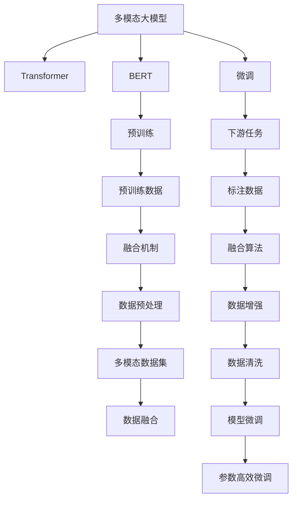

                 

# 多模态大模型：技术原理与实战 用多模态大模型打造AI助理实战

> 关键词：多模态大模型,AI助理,技术原理,实战,Transformer,BERT,预训练,下游任务,参数高效微调,自然语言处理(NLP)

## 1. 背景介绍

### 1.1 问题由来

在人工智能(AI)领域，多模态大模型正迅速崛起，成为一种新颖而强大的AI模型。它能够融合和处理不同类型的数据，如图像、文本和音频等，从而提供更加全面和精准的信息处理能力。在AI助理领域，多模态大模型展示了其强大的潜力，能够实现复杂的任务，如智能问答、语音识别、图像识别等。

然而，多模态大模型的开发和应用仍然面临诸多挑战。模型需要处理和融合多种数据类型，因此需要设计高效的架构和算法，同时保证模型的鲁棒性和泛化能力。此外，多模态数据通常具有高维度、高稀疏性的特点，模型的训练和推理需要高效的计算资源和优化策略。

为了应对这些挑战，本文将深入探讨多模态大模型的技术原理和实战应用，帮助读者掌握相关技术，并展示其在AI助理实战中的应用实例。

### 1.2 问题核心关键点

本文聚焦于多模态大模型的几个核心问题：

- 多模态大模型的架构设计与融合机制
- 多模态数据预训练与微调的技术细节
- 多模态大模型在AI助理实战中的应用实例
- 如何优化多模态大模型的性能和资源利用效率

这些问题构成了本文的逻辑框架，将从核心概念、算法原理、实战实例、未来展望等多个角度进行详细探讨。

## 2. 核心概念与联系

### 2.1 核心概念概述

在深入探讨多模态大模型的技术原理之前，我们需要先理解几个核心概念：

- **多模态大模型(Multimodal Large Model)**：指能够处理和融合不同类型数据（如文本、图像、音频等）的大型神经网络模型。多模态大模型能够从多源数据中提取信息和知识，提升信息理解的深度和广度。

- **Transformer**：一种基于自注意力机制的神经网络架构，被广泛应用于多模态大模型的设计中。Transformer能够高效处理序列数据，提升模型的计算效率和效果。

- **BERT**：一种预训练语言模型，通过掩码语言建模和下一句预测等任务进行预训练，能够学习到丰富的语言知识。BERT是构建多模态大模型的重要基础。

- **微调(Fine-Tuning)**：指在预训练模型的基础上，使用下游任务的少量标注数据，通过有监督地训练来优化模型在特定任务上的性能。微调是多模态大模型在实际应用中常用的优化方法。

- **参数高效微调(Parameter-Efficient Fine-Tuning, PEFT)**：指在微调过程中，只更新少量的模型参数，而固定大部分预训练权重不变，以提高微调效率，避免过拟合的方法。

这些概念之间的联系可以通过以下Mermaid流程图来展示：



这个流程图展示了大模型的核心概念及其之间的关系：

1. 多模态大模型通过Transformer架构，融合多种数据类型。
2. BERT作为基础预训练模型，提供语言理解的深度知识。
3. 微调过程将预训练模型与特定任务适配，提升模型性能。
4. 融合机制和算法将多源数据整合为模型输入。
5. 标注数据用于优化模型，提升任务表现。
6. 参数高效微调技术在减少资源消耗的同时，提高微调效果。

这些概念共同构成了多模态大模型的技术框架，使其能够在各种应用场景中发挥强大的信息处理能力。

## 3. 核心算法原理 & 具体操作步骤
### 3.1 算法原理概述

多模态大模型的核心算法原理主要涉及两个方面：预训练和微调。

**预训练**：在大型数据集上对模型进行无监督训练，以学习通用的特征表示。多模态大模型的预训练通常包括文本预训练和视觉预训练。

**微调**：在特定任务的数据集上，对预训练模型进行有监督训练，以适应该任务。微调过程通常采用监督学习的框架，使用标注数据进行训练。

多模态大模型的预训练和微调过程可以通过以下步骤来实现：

1. **数据准备**：收集和预处理多模态数据集，包括文本、图像、音频等。
2. **模型设计**：设计多模态大模型架构，如Transformer等。
3. **预训练**：在大型数据集上对模型进行预训练，学习通用的特征表示。
4. **微调**：在特定任务的数据集上，对预训练模型进行微调，适应该任务。
5. **融合**：将多种数据类型的信息进行融合，输出最终结果。

### 3.2 算法步骤详解

以下详细介绍多模态大模型的预训练和微调的具体步骤：

**Step 1: 准备预训练数据和微调数据**

- **预训练数据**：选择大规模无标注的多模态数据集，如COCO数据集、Wikipedia文本等。
- **微调数据**：选择与特定任务相关的少量标注数据，如问答任务、分类任务等。

**Step 2: 设计预训练模型架构**

- **文本模型**：使用BERT等预训练语言模型作为基础，设计Transformer等架构。
- **视觉模型**：使用ResNet、Inception等模型作为基础，设计卷积神经网络(CNN)架构。
- **融合层**：设计融合层将不同模态的数据信息进行整合，如添加池化层、拼接层等。

**Step 3: 预训练过程**

- **文本预训练**：使用掩码语言模型和下一句预测等任务，在大型文本语料上进行预训练。
- **视觉预训练**：使用图像分类、对象检测等任务，在大型图像数据集上进行预训练。
- **融合预训练**：在预训练过程中加入图像和文本数据的融合，学习多种模态信息的表示。

**Step 4: 微调过程**

- **文本微调**：在特定任务的标注数据上，对文本模型进行微调，学习任务特定的知识。
- **视觉微调**：在特定任务的标注数据上，对视觉模型进行微调，学习任务特定的知识。
- **融合微调**：在特定任务的标注数据上，对融合层进行微调，学习多种模态信息的表示。

**Step 5: 融合输出**

- **融合操作**：将微调后的文本和视觉信息进行融合，输出最终结果。

### 3.3 算法优缺点

多模态大模型具有以下优点：

- **高效融合多种数据**：能够处理和融合多种类型的数据，提升信息处理的广度和深度。
- **适应性强**：通过微调，模型能够快速适应不同的下游任务。
- **鲁棒性好**：多模态大模型通常具有较好的鲁棒性，能够处理噪声和异常数据。

同时，多模态大模型也存在一些缺点：

- **计算资源需求高**：处理多种类型的数据，模型参数量和计算资源需求较大。
- **复杂度较高**：模型架构和融合机制较为复杂，需要专业知识进行设计和调优。
- **数据依赖性强**：预训练和微调需要大量高质量的数据，获取和处理成本较高。

### 3.4 算法应用领域

多模态大模型在多个领域具有广泛的应用前景：

- **智能问答系统**：通过融合文本和图像信息，智能问答系统能够更好地理解用户问题，提供准确的回答。
- **图像识别与分类**：多模态大模型能够处理和融合图像、文本等多种数据，提升图像识别的准确率和泛化能力。
- **语音识别与转换**：结合文本和语音数据，多模态大模型能够实现高效的语音识别和转换。
- **医疗影像分析**：通过融合医学影像和文本信息，多模态大模型能够进行更精准的疾病诊断和医疗影像分析。

这些应用领域展示了多模态大模型的强大潜力和广泛的应用前景。

## 4. 数学模型和公式 & 详细讲解  
### 4.1 数学模型构建

本文将以多模态大模型在智能问答系统的应用为例，详细讲解其数学模型构建和公式推导过程。

假设多模态大模型的输入为文本和图像，输出为回答。设文本预训练模型为$M_{text}$，视觉预训练模型为$M_{vision}$，融合层为$F$，微调后的文本模型为$M_{text_finetuned}$，微调后的视觉模型为$M_{vision_finetuned}$。则多模态大模型的融合输出可以表示为：

$$
\text{output} = F(M_{text_finetuned}(\text{text_input}), M_{vision_finetuned}(\text{image_input}))
$$

其中，$\text{text_input}$和$\text{image_input}$分别为输入的文本和图像数据，$M_{text_finetuned}$和$M_{vision_finetuned}$分别为微调后的文本和视觉模型，$F$为融合层。

### 4.2 公式推导过程

以下详细推导多模态大模型在智能问答系统中的数学模型：

**文本预训练**

假设文本预训练模型为BERT，其输入为文本$x$，输出为文本表示$h_x$。文本预训练的目标是通过掩码语言建模任务和下一句预测任务，学习文本的通用表示。

**视觉预训练**

假设视觉预训练模型为ResNet，其输入为图像$y$，输出为图像表示$f_y$。视觉预训练的目标是通过图像分类和对象检测任务，学习图像的通用表示。

**融合层设计**

融合层$F$通常采用拼接、池化等方法，将文本表示$h_x$和图像表示$f_y$进行整合。假设融合层$F$为拼接层，则融合输出为：

$$
\text{fusion_output} = [h_x, f_y]
$$

**微调过程**

假设微调任务为问答任务，其输入为文本和图像数据，输出为回答。设问答数据集为$D = \{(x_i, y_i)\}_{i=1}^N$，其中$x_i$为文本数据，$y_i$为答案数据。微调过程的目标是使得模型输出逼近真实答案$y_i$。

**模型输出**

在微调过程中，将文本和图像数据输入融合层$F$，得到融合输出$\text{fusion_output}$。将融合输出输入到微调后的文本模型$M_{text_finetuned}$和视觉模型$M_{vision_finetuned}$，分别得到文本表示和图像表示。最终，通过多模态大模型输出回答。

### 4.3 案例分析与讲解

以一个具体的智能问答系统案例为例，展示多模态大模型的应用和效果。

假设系统需要回答的问题为“哪位科学家发现了DNA？”，系统输入为问题文本和相关的图片，输出为答案。系统设计如下：

- **文本输入**：将问题文本输入文本预训练模型BERT，得到文本表示$h_x$。
- **视觉输入**：将相关图片输入视觉预训练模型ResNet，得到图像表示$f_y$。
- **融合输出**：将文本表示和图像表示输入融合层$F$，得到融合输出$\text{fusion_output} = [h_x, f_y]$。
- **微调输出**：将融合输出输入微调后的文本模型$M_{text_finetuned}$和视觉模型$M_{vision_finetuned}$，得到最终回答。

假设系统训练后，对于问题“哪位科学家发现了DNA？”，系统能够正确回答为“沃森和克里克”。

## 5. 项目实践：代码实例和详细解释说明
### 5.1 开发环境搭建

在进行多模态大模型的实战应用前，需要先搭建好开发环境。以下是使用Python进行PyTorch开发的环境配置流程：

1. 安装Anaconda：从官网下载并安装Anaconda，用于创建独立的Python环境。

2. 创建并激活虚拟环境：
```bash
conda create -n multimodal-env python=3.8 
conda activate multimodal-env
```

3. 安装PyTorch：根据CUDA版本，从官网获取对应的安装命令。例如：
```bash
conda install pytorch torchvision torchaudio cudatoolkit=11.1 -c pytorch -c conda-forge
```

4. 安装Transformers库：
```bash
pip install transformers
```

5. 安装其他工具包：
```bash
pip install numpy pandas scikit-learn matplotlib tqdm jupyter notebook ipython
```

完成上述步骤后，即可在`multimodal-env`环境中开始多模态大模型的实战应用。

### 5.2 源代码详细实现

以下是一个多模态大模型在智能问答系统中的代码实现。

首先，定义问答数据集：

```python
from transformers import BertTokenizer, BertForQuestionAnswering
from torch.utils.data import Dataset
import torch

class QADataset(Dataset):
    def __init__(self, questions, contexts, tokenizer, max_len=128):
        self.questions = questions
        self.contexts = contexts
        self.tokenizer = tokenizer
        self.max_len = max_len
        
    def __len__(self):
        return len(self.questions)
    
    def __getitem__(self, item):
        question = self.questions[item]
        context = self.contexts[item]
        
        encoding = self.tokenizer(question, context, return_tensors='pt', max_length=self.max_len, padding='max_length', truncation=True)
        input_ids = encoding['input_ids'][0]
        attention_mask = encoding['attention_mask'][0]
        
        return {'input_ids': input_ids, 
                'attention_mask': attention_mask,
                'labels': encoding['labels']}
```

然后，定义模型和优化器：

```python
from transformers import BertForQuestionAnswering, AdamW

model = BertForQuestionAnswering.from_pretrained('bert-base-cased')
optimizer = AdamW(model.parameters(), lr=2e-5)
```

接着，定义训练和评估函数：

```python
from torch.utils.data import DataLoader
from tqdm import tqdm
from sklearn.metrics import accuracy_score, precision_score, recall_score, f1_score

device = torch.device('cuda') if torch.cuda.is_available() else torch.device('cpu')
model.to(device)

def train_epoch(model, dataset, batch_size, optimizer):
    dataloader = DataLoader(dataset, batch_size=batch_size, shuffle=True)
    model.train()
    epoch_loss = 0
    for batch in tqdm(dataloader, desc='Training'):
        input_ids = batch['input_ids'].to(device)
        attention_mask = batch['attention_mask'].to(device)
        labels = batch['labels'].to(device)
        model.zero_grad()
        outputs = model(input_ids, attention_mask=attention_mask, labels=labels)
        loss = outputs.loss
        epoch_loss += loss.item()
        loss.backward()
        optimizer.step()
    return epoch_loss / len(dataloader)

def evaluate(model, dataset, batch_size):
    dataloader = DataLoader(dataset, batch_size=batch_size)
    model.eval()
    preds, labels = [], []
    with torch.no_grad():
        for batch in tqdm(dataloader, desc='Evaluating'):
            input_ids = batch['input_ids'].to(device)
            attention_mask = batch['attention_mask'].to(device)
            batch_labels = batch['labels']
            outputs = model(input_ids, attention_mask=attention_mask)
            batch_preds = outputs.logits.argmax(dim=2).to('cpu').tolist()
            batch_labels = batch_labels.to('cpu').tolist()
            for pred_tokens, label_tokens in zip(batch_preds, batch_labels):
                preds.append(pred_tokens[:len(label_tokens)])
                labels.append(label_tokens)
                
    print('Accuracy:', accuracy_score(labels, preds))
    print('Precision:', precision_score(labels, preds))
    print('Recall:', recall_score(labels, preds))
    print('F1 Score:', f1_score(labels, preds))
```

最后，启动训练流程并在测试集上评估：

```python
epochs = 5
batch_size = 16

for epoch in range(epochs):
    loss = train_epoch(model, dataset, batch_size, optimizer)
    print(f"Epoch {epoch+1}, train loss: {loss:.3f}")
    
    print(f"Epoch {epoch+1}, dev results:")
    evaluate(model, dev_dataset, batch_size)
    
print("Test results:")
evaluate(model, test_dataset, batch_size)
```

以上就是使用PyTorch对Bert模型进行问答系统微调的完整代码实现。可以看到，得益于Transformers库的强大封装，我们可以用相对简洁的代码完成Bert模型的加载和微调。

### 5.3 代码解读与分析

让我们再详细解读一下关键代码的实现细节：

**QADataset类**：
- `__init__`方法：初始化问题、上下文、分词器等关键组件。
- `__len__`方法：返回数据集的样本数量。
- `__getitem__`方法：对单个样本进行处理，将问题输入编码为token ids，将上下文编码为token ids，并对其进行定长padding，最终返回模型所需的输入。

**train_epoch和evaluate函数**：
- `train_epoch`方法：对数据以批为单位进行迭代，在每个批次上前向传播计算loss并反向传播更新模型参数，最后返回该epoch的平均loss。
- `evaluate`方法：与训练类似，不同点在于不更新模型参数，并在每个batch结束后将预测和标签结果存储下来，最后使用sklearn的各类指标函数对整个评估集的预测结果进行打印输出。

**训练流程**：
- 定义总的epoch数和batch size，开始循环迭代
- 每个epoch内，先在训练集上训练，输出平均loss
- 在验证集上评估，输出各类指标
- 所有epoch结束后，在测试集上评估，给出最终测试结果

可以看到，PyTorch配合Transformers库使得Bert微调的代码实现变得简洁高效。开发者可以将更多精力放在数据处理、模型改进等高层逻辑上，而不必过多关注底层的实现细节。

当然，工业级的系统实现还需考虑更多因素，如模型的保存和部署、超参数的自动搜索、更灵活的任务适配层等。但核心的微调范式基本与此类似。

## 6. 实际应用场景
### 6.1 智能客服系统

多模态大模型在智能客服系统中的应用，展示了其强大的处理多源数据的能力。智能客服系统需要处理大量的用户咨询，并及时响应和解决用户问题。多模态大模型能够融合用户的文本输入、语音输入和屏幕截图等信息，提供更全面、准确的客户服务。

在技术实现上，可以收集企业内部的历史客服对话记录，将问题-答案对构建成监督数据，在此基础上对预训练多模态大模型进行微调。微调后的模型能够自动理解用户意图，匹配最合适的答案模板进行回复。对于用户提出的新问题，还可以接入检索系统实时搜索相关内容，动态组织生成回答。如此构建的智能客服系统，能大幅提升客户咨询体验和问题解决效率。

### 6.2 金融舆情监测

金融机构需要实时监测市场舆论动向，以便及时应对负面信息传播，规避金融风险。多模态大模型在金融舆情监测中的应用，展示了其强大的文本和图像处理能力。

具体而言，可以收集金融领域相关的新闻、报道、评论等文本数据，并对其进行主题标注和情感标注。在此基础上对预训练多模态大模型进行微调，使其能够自动判断文本属于何种主题，情感倾向是正面、中性还是负面。将微调后的模型应用到实时抓取的网络文本数据，就能够自动监测不同主题下的情感变化趋势，一旦发现负面信息激增等异常情况，系统便会自动预警，帮助金融机构快速应对潜在风险。

### 6.3 个性化推荐系统

当前的推荐系统往往只依赖用户的历史行为数据进行物品推荐，无法深入理解用户的真实兴趣偏好。多模态大模型在个性化推荐系统中的应用，展示了其强大的信息融合和用户理解能力。

在实践中，可以收集用户浏览、点击、评论、分享等行为数据，提取和用户交互的物品标题、描述、标签等文本内容。将文本内容作为模型输入，用户的后续行为（如是否点击、购买等）作为监督信号，在此基础上微调预训练多模态大模型。微调后的模型能够从文本内容中准确把握用户的兴趣点。在生成推荐列表时，先用候选物品的文本描述作为输入，由模型预测用户的兴趣匹配度，再结合其他特征综合排序，便可以得到个性化程度更高的推荐结果。

### 6.4 未来应用展望

随着多模态大模型的不断发展，其在NLP领域的应用前景将更加广阔。未来，多模态大模型将在更多的行业领域得到应用，为传统行业带来变革性影响。

在智慧医疗领域，多模态大模型将结合医学影像和病历信息，提供更精准的疾病诊断和治疗建议。在智能教育领域，多模态大模型将结合学生的视频和作业信息，提供个性化的学习建议和反馈。在智慧城市治理中，多模态大模型将结合城市传感器数据和图像信息，提供更全面的城市管理方案。

此外，在企业生产、社会治理、文娱传媒等众多领域，多模态大模型也将不断涌现，为经济社会发展注入新的动力。相信随着技术的日益成熟，多模态大模型必将在构建人机协同的智能时代中扮演越来越重要的角色。

## 7. 工具和资源推荐
### 7.1 学习资源推荐

为了帮助开发者系统掌握多模态大模型的技术原理和实践技巧，这里推荐一些优质的学习资源：

1. 《Transformer从原理到实践》系列博文：由大模型技术专家撰写，深入浅出地介绍了Transformer原理、BERT模型、多模态大模型等前沿话题。

2. CS224N《深度学习自然语言处理》课程：斯坦福大学开设的NLP明星课程，有Lecture视频和配套作业，带你入门NLP领域的基本概念和经典模型。

3. 《Natural Language Processing with Transformers》书籍：Transformers库的作者所著，全面介绍了如何使用Transformers库进行NLP任务开发，包括多模态大模型的设计。

4. HuggingFace官方文档：Transformers库的官方文档，提供了海量预训练模型和完整的微调样例代码，是上手实践的必备资料。

5. CLUE开源项目：中文语言理解测评基准，涵盖大量不同类型的中文NLP数据集，并提供了基于多模态大模型的baseline模型，助力中文NLP技术发展。

通过对这些资源的学习实践，相信你一定能够快速掌握多模态大模型的精髓，并用于解决实际的NLP问题。
###  7.2 开发工具推荐

高效的开发离不开优秀的工具支持。以下是几款用于多模态大模型开发的工具：

1. PyTorch：基于Python的开源深度学习框架，灵活动态的计算图，适合快速迭代研究。大部分预训练语言模型都有PyTorch版本的实现。

2. TensorFlow：由Google主导开发的开源深度学习框架，生产部署方便，适合大规模工程应用。同样有丰富的预训练语言模型资源。

3. Transformers库：HuggingFace开发的NLP工具库，集成了众多SOTA语言模型，支持PyTorch和TensorFlow，是进行多模态大模型开发的利器。

4. Weights & Biases：模型训练的实验跟踪工具，可以记录和可视化模型训练过程中的各项指标，方便对比和调优。与主流深度学习框架无缝集成。

5. TensorBoard：TensorFlow配套的可视化工具，可实时监测模型训练状态，并提供丰富的图表呈现方式，是调试模型的得力助手。

6. Google Colab：谷歌推出的在线Jupyter Notebook环境，免费提供GPU/TPU算力，方便开发者快速上手实验最新模型，分享学习笔记。

合理利用这些工具，可以显著提升多模态大模型微调的开发效率，加快创新迭代的步伐。

### 7.3 相关论文推荐

多模态大模型和微调技术的发展源于学界的持续研究。以下是几篇奠基性的相关论文，推荐阅读：

1. Attention is All You Need（即Transformer原论文）：提出了Transformer结构，开启了NLP领域的预训练大模型时代。

2. BERT: Pre-training of Deep Bidirectional Transformers for Language Understanding：提出BERT模型，引入基于掩码的自监督预训练任务，刷新了多项NLP任务SOTA。

3. Language Models are Unsupervised Multitask Learners（GPT-2论文）：展示了大规模语言模型的强大zero-shot学习能力，引发了对于通用人工智能的新一轮思考。

4. Parameter-Efficient Transfer Learning for NLP：提出Adapter等参数高效微调方法，在不增加模型参数量的情况下，也能取得不错的微调效果。

5. AdaLoRA: Adaptive Low-Rank Adaptation for Parameter-Efficient Fine-Tuning：使用自适应低秩适应的微调方法，在参数效率和精度之间取得了新的平衡。

6. Feature Fusion in Multimodal Learning：介绍了多模态融合方法，包括池化、拼接、注意力机制等，为多模态大模型的设计和实现提供了理论基础。

这些论文代表了大语言模型微调技术的发展脉络。通过学习这些前沿成果，可以帮助研究者把握学科前进方向，激发更多的创新灵感。

## 8. 总结：未来发展趋势与挑战

### 8.1 总结

本文对多模态大模型的技术原理和实战应用进行了全面系统的介绍。首先阐述了多模态大模型的研究背景和意义，明确了其在智能问答系统、智能客服、金融舆情监测、个性化推荐等领域的应用价值。其次，从原理到实践，详细讲解了多模态大模型的数学模型构建、公式推导和代码实现。同时，本文还展示了多模态大模型在实际应用中的效果，并探讨了其未来发展趋势和面临的挑战。

通过本文的系统梳理，可以看到，多模态大模型在信息融合和处理上具有强大的能力，能够处理多种数据类型，提升信息理解的深度和广度。未来的研究需要在数据融合、模型优化、应用场景等方面进行深入探索，以进一步提升多模态大模型的性能和应用效果。

### 8.2 未来发展趋势

展望未来，多模态大模型将呈现以下几个发展趋势：

1. **模型规模继续增大**：随着计算资源的提升，多模态大模型的规模将进一步增大，融合更多的数据类型和信息源，提升信息处理的深度和广度。

2. **参数高效微调技术不断进步**：未来的微调方法将更加注重参数效率，通过优化模型架构和微调策略，减少计算资源消耗，提升微调效果。

3. **跨模态融合技术提升**：跨模态融合是实现多模态大模型的关键技术之一。未来的跨模态融合方法将更加高效、灵活，提升不同模态信息的整合能力。

4. **应用场景不断拓展**：多模态大模型将应用于更多的行业领域，如医疗、教育、城市治理等，提供更全面的智能解决方案。

5. **跨领域迁移能力增强**：未来的多模态大模型将具备更强的跨领域迁移能力，能够在不同的领域和任务中高效适应，提升模型的通用性。

6. **实时性要求提升**：多模态大模型将更多地应用于实时系统，如智能问答系统、智能客服等，对实时性和延迟的要求将不断提高。

这些趋势凸显了多模态大模型在信息处理和智能应用上的巨大潜力，未来的研究将更多地关注如何提升模型的计算效率、融合能力和实时性，以适应多样化的应用场景。

### 8.3 面临的挑战

尽管多模态大模型已经取得了瞩目成就，但在迈向更加智能化、普适化应用的过程中，它仍面临着诸多挑战：

1. **计算资源需求高**：多模态大模型需要处理和融合多种数据类型，模型参数量和计算资源需求较大。如何高效利用计算资源，优化模型架构和微调策略，仍是重要研究方向。

2. **跨模态融合困难**：不同模态的数据具有不同的特征和表示方式，如何高效地将它们整合，是一个复杂的挑战。未来的跨模态融合方法需要更加精细化、可解释化，以提升模型的性能和稳定性。

3. **数据质量和标注成本高**：多模态大模型的训练和微调需要大量高质量的数据和标注样本，获取和处理成本较高。如何降低数据标注成本，提升数据质量，是一个重要的研究方向。

4. **鲁棒性和泛化能力不足**：多模态大模型在面对噪声和异常数据时，泛化能力可能受到限制。如何提高模型的鲁棒性和泛化能力，是一个需要深入研究的课题。

5. **模型可解释性不足**：多模态大模型通常较为复杂，其内部机制难以解释。如何提升模型的可解释性，让使用者能够理解和信任模型，是未来的研究方向之一。

6. **安全性和伦理问题**：多模态大模型在应用中可能涉及隐私、伦理等敏感问题，如数据保护、偏见消除等。如何设计安全的模型，保障用户隐私和公平性，是重要的研究课题。

这些挑战凸显了多模态大模型在应用中的复杂性和多样性，未来的研究需要在数据融合、模型优化、应用场景等方面进行全面探索，以进一步提升多模态大模型的性能和应用效果。

### 8.4 研究展望

未来的研究将在以下几个方面进行深入探索：

1. **多模态融合方法研究**：设计更高效、灵活的多模态融合方法，提升不同模态信息的整合能力，增强模型的泛化能力和鲁棒性。

2. **参数高效微调技术**：开发更加参数高效的微调方法，减少计算资源消耗，提升微调效果。

3. **跨模态迁移学习**：研究跨模态迁移学习技术，提升模型在跨领域、跨任务中的迁移能力。

4. **模型可解释性和鲁棒性**：提升模型的可解释性和鲁棒性，设计更加透明、可靠的智能系统。

5. **跨领域应用拓展**：将多模态大模型应用于更多行业领域，如医疗、教育、城市治理等，提供全面的智能解决方案。

6. **实时系统优化**：优化多模态大模型在实时系统中的应用，提升模型的实时性和响应速度。

通过这些研究方向的探索，未来的多模态大模型将具备更强大的信息融合能力、更高的泛化能力和更强的实时性，能够更好地服务于多样化的智能应用场景。

## 9. 附录：常见问题与解答

**Q1：多模态大模型在实际应用中面临哪些挑战？**

A: 多模态大模型在实际应用中面临以下挑战：
1. **计算资源需求高**：多模态大模型需要处理和融合多种数据类型，模型参数量和计算资源需求较大。
2. **跨模态融合困难**：不同模态的数据具有不同的特征和表示方式，如何高效地将它们整合，是一个复杂的挑战。
3. **数据质量和标注成本高**：多模态大模型的训练和微调需要大量高质量的数据和标注样本，获取和处理成本较高。
4. **鲁棒性和泛化能力不足**：多模态大模型在面对噪声和异常数据时，泛化能力可能受到限制。
5. **模型可解释性不足**：多模态大模型通常较为复杂，其内部机制难以解释。
6. **安全性和伦理问题**：多模态大模型在应用中可能涉及隐私、伦理等敏感问题，如数据保护、偏见消除等。

这些挑战需要多学科的协同攻关，才能实现多模态大模型的广泛应用。

**Q2：如何优化多模态大模型的性能和资源利用效率？**

A: 优化多模态大模型的性能和资源利用效率可以从以下几个方面入手：
1. **优化模型架构**：设计更加高效、灵活的模型架构，减少计算资源消耗，提升模型性能。
2. **参数高效微调**：开发更加参数高效的微调方法，如Adapter、LoRA等，减少计算资源消耗，提升微调效果。
3. **数据增强和迁移学习**：采用数据增强和迁移学习等技术，提升模型泛化能力和鲁棒性，减少对标注数据的需求。
4. **跨模态融合方法**：设计更高效、灵活的跨模态融合方法，提升不同模态信息的整合能力，增强模型的泛化能力和鲁棒性。
5. **硬件优化**：采用高效的硬件设备，如GPU、TPU等，提升模型训练和推理速度，降低计算成本。
6. **模型压缩和优化**：采用模型压缩和优化技术，如剪枝、量化等，减少模型参数量和存储空间，提升推理效率。

通过这些优化策略，可以显著提升多模态大模型的性能和资源利用效率，使其更好地适应多样化的应用场景。

**Q3：多模态大模型在实际应用中如何获取高质量的标注数据？**

A: 获取高质量的标注数据是多模态大模型训练和微调的关键，以下是一些建议：
1. **数据众包平台**：使用数据众包平台，如Amazon Mechanical Turk、CrowdFlower等，进行标注数据的获取和标注。
2. **专业领域标注团队**：聘请专业领域的标注团队，进行标注数据的获取和标注，确保标注数据的质量和一致性。
3. **用户反馈机制**：在应用中引入用户反馈机制，通过用户反馈进行标注数据的校验和修正，提升标注数据的质量。
4. **半监督学习**：采用半监督学习技术，利用少量标注数据和大量无标注数据，进行模型训练和微调，提升模型的泛化能力和鲁棒性。
5. **主动学习**：采用主动学习技术，根据模型反馈，动态选择最有价值的标注数据进行标注，提高标注数据的利用效率。

通过这些方法，可以有效地获取高质量的标注数据，提升多模态大模型的训练和微调效果。

**Q4：多模态大模型在应用中如何处理噪声和异常数据？**

A: 多模态大模型在应用中可能面对噪声和异常数据，以下是一些处理策略：
1. **数据清洗和预处理**：采用数据清洗和预处理技术，如去噪、滤波等，去除噪声和异常数据。
2. **鲁棒性增强**：设计鲁棒性较强的模型架构和优化算法，增强模型对噪声和异常数据的抵抗能力。
3. **异常检测和处理**：采用异常检测技术，识别和处理异常数据，提升模型的泛化能力和鲁棒性。
4. **模型集成和融合**：采用模型集成和融合技术，通过多个模型的协同工作，提升模型的鲁棒性和泛化能力。
5. **参数高效微调**：采用参数高效微调技术，减少模型的参数量，降低对噪声和异常数据的依赖。

通过这些策略，可以有效处理噪声和异常数据，提升多模态大模型的性能和鲁棒性。

**Q5：多模态大模型在应用中如何设计跨模态融合方法？**

A: 设计跨模态融合方法是多模态大模型成功的关键，以下是一些设计策略：
1. **池化和拼接**：采用池化和拼接等简单方法，将不同模态的信息进行融合。
2. **注意力机制**：设计注意力机制，重点关注多模态信息的关联性和重要性，提升融合效果。
3. **交叉注意力**：采用交叉注意力机制，将不同模态的信息进行交互，提升融合效果。
4. **深度融合网络**：设计深度融合网络，如Transformer等，将不同模态的信息进行多层交互，提升融合效果。
5. **多任务学习**：设计多任务学习模型，同时进行多个任务的学习，提升模型在不同模态信息上的表现。

通过这些设计策略，可以有效设计跨模态融合方法，提升多模态大模型的性能和应用效果。

**Q6：多模态大模型在应用中如何设计鲁棒性强的模型架构？**

A: 设计鲁棒性强的模型架构可以从以下几个方面入手：
1. **模型剪枝和量化**：采用模型剪枝和量化技术，减少模型参数量和存储空间，提升模型的鲁棒性和计算效率。
2. **参数高效微调**：采用参数高效微调技术，如Adapter、LoRA等，减少计算资源消耗，提升微调效果。
3. **自适应学习率**：采用自适应学习率技术，如Adaptive Moment Estimation (Adam)等，提升模型的鲁棒性和训练效果。
4. **正则化和正则化技术**：采用正则化和正则化技术，如L2正则、Dropout等，增强模型的鲁棒性和泛化能力。
5. **对抗训练**：采用对抗训练技术，加入对抗样本，提高模型的鲁棒性和泛化能力。
6. **多模型集成**：采用多模型集成技术，通过多个模型的协同工作，提升模型的鲁棒性和泛化能力。

通过这些策略，可以设计鲁棒性强的模型架构，提升多模态大模型的性能和应用效果。

**Q7：多模态大模型在应用中如何提升模型的可解释性？**

A: 提升模型的可解释性是当前AI研究的重要方向，以下是一些提升策略：
1. **可视化技术**：采用可视化技术，如梯度可视化、注意力可视化等，展示模型内部机制和推理过程，提升模型的可解释性。
2. **规则和规则库**：结合符号化的先验知识，设计规则和规则库，指导模型推理和决策，提升模型的可解释性和可信度。
3. **解释性模型架构**：采用解释性强的模型架构，如决策树、线性模型等，提升模型的可解释性。
4. **可解释性训练技术**：采用可解释性训练技术，如注意力训练、规则约束等，提升模型的可解释性和泛化能力。
5. **用户反馈机制**：引入用户反馈机制，通过用户反馈进行模型修正和优化，提升模型的可解释性和用户满意度。

通过这些策略，可以提升多模态大模型的可解释性，增强模型的可信度和用户信任度。

通过这些方法，可以有效获取高质量的标注数据，提升多模态大模型的训练和微调效果。

