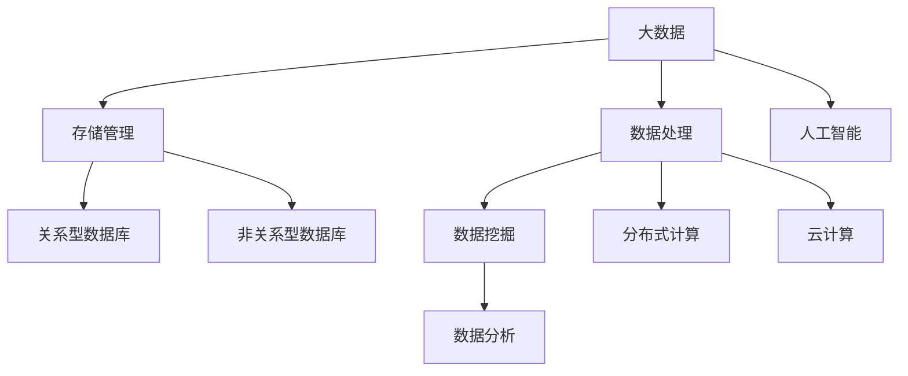

                 

# 大数据与数据库的AI应用

## 1. 背景介绍

### 1.1 问题由来

随着互联网和信息技术的高速发展，人类社会的数据量正以惊人的速度增长。企业、政府和个人在生产、生活中的各种行为产生了海量的结构化和非结构化数据。数据的重要性日益凸显，如何有效利用和管理这些数据，成为了当下技术创新的焦点。

人工智能（AI）作为一种强大的数据处理和分析技术，正在逐步渗透到各个行业。在金融、医疗、零售、交通等诸多领域，AI算法通过挖掘数据中的有用信息，为决策者提供更准确、更及时的洞察。但随着数据规模的不断扩大，如何高效存储、处理和分析这些数据，成为困扰AI应用的一大难题。

### 1.2 问题核心关键点

大数据和数据库的AI应用，涉及到了数据的存储、处理、分析和挖掘等多个环节。数据存储环节，需要考虑如何高效、可靠地存储海量数据；数据处理环节，需要考虑如何实时、高效地处理数据，以便快速响应业务需求；数据分析和挖掘环节，则需要利用AI算法从数据中提取有价值的信息。

为了解决上述问题，业界在数据存储、数据处理、数据分析和数据挖掘等方面，都提出了许多先进的技术和算法。大数据和数据库的AI应用，不仅极大地提升了数据处理和分析的效率，还推动了AI算法的发展和应用。

### 1.3 问题研究意义

大数据和数据库的AI应用，对于推动数据驱动的决策，优化资源配置，提升业务效率具有重要意义：

1. **决策支持**：利用AI算法对大数据进行分析，可以发现潜在的业务模式和趋势，为企业决策提供数据支持。
2. **数据挖掘**：通过AI算法对大数据进行挖掘，可以发现隐藏在数据中的有用信息，如关联规则、异常检测等。
3. **业务优化**：利用AI算法对大数据进行分析，可以发现业务流程中的瓶颈，优化资源配置，提高效率。
4. **风险管理**：通过AI算法对大数据进行分析，可以识别和防范潜在的风险，如信用风险、欺诈风险等。
5. **智能预测**：利用AI算法对大数据进行分析，可以进行智能预测，如客户流失预测、市场趋势预测等。

通过深入研究大数据和数据库的AI应用，可以为大数据技术的实际应用提供指导，推动大数据技术的发展和应用。

## 2. 核心概念与联系

### 2.1 核心概念概述

为更好地理解大数据和数据库的AI应用，本节将介绍几个密切相关的核心概念：

- **大数据（Big Data）**：指无法在传统数据仓库中用传统数据库软件进行分析处理的海量数据集。这些数据具有高容量、高速度、高多样性等特点。
- **数据库（Database）**：用于存储和管理数据的集合，支持数据的查询、插入、更新、删除等操作。数据库系统通常包括关系型数据库和非关系型数据库。
- **人工智能（AI）**：通过模拟人脑的逻辑思维过程，使计算机具备自主学习、推理和决策能力的技术。AI包括机器学习、自然语言处理、计算机视觉等多个领域。
- **大数据分析（Big Data Analytics）**：利用AI算法对大数据进行分析和挖掘，提取有价值的信息，支持企业决策。大数据分析通常包括数据清洗、数据集成、数据挖掘、数据可视化等步骤。
- **数据库管理系统（Database Management System, DBMS）**：用于管理数据库的软件系统，支持数据的存储、查询、备份、恢复等操作。常见的DBMS包括MySQL、Oracle、MongoDB等。
- **分布式计算（Distributed Computing）**：将计算任务分布在多个计算节点上，并行处理大规模数据的技术。常见分布式计算框架包括Apache Hadoop、Spark等。
- **云计算（Cloud Computing）**：通过互联网提供按需、可扩展的计算、存储和网络服务，支持企业灵活应对业务需求的技术。常见的云服务提供商包括AWS、Google Cloud、Microsoft Azure等。

这些核心概念之间的逻辑关系可以通过以下Mermaid流程图来展示：



这个流程图展示了大数据、数据库、AI、大数据分析、分布式计算、云计算等多个核心概念之间的关系：

1. 大数据通过存储管理、数据处理、数据挖掘等步骤，生成有价值的信息，支持企业决策。
2. 数据库系统用于存储和管理大数据，提供数据访问和操作支持。
3. 分布式计算和云计算技术用于处理和存储大数据，提供高效、可靠的数据处理能力。
4. AI算法通过分析大数据，提取有价值的信息，支持企业决策。

## 3. 核心算法原理 & 具体操作步骤

### 3.1 算法原理概述

大数据和数据库的AI应用，本质上是一种将大数据技术、数据库技术和AI算法相结合的综合应用。其核心思想是：通过数据库管理系统存储和管理大规模数据，利用分布式计算和云计算技术对大数据进行高效处理，然后利用AI算法从数据中提取有价值的信息。

形式化地，假设大数据集为 $D$，数据库管理系统为 $DB$，分布式计算框架为 $DC$，AI算法为 $AI$。大数据和数据库的AI应用过程可以表示为：

$$
\text{应用结果} = DB(D) \times DC(D) \times AI(D)
$$

其中，$DB(D)$ 表示将大数据集 $D$ 存储和管理在数据库系统中，$DC(D)$ 表示利用分布式计算框架对大数据进行高效处理，$AI(D)$ 表示利用AI算法从数据中提取有价值的信息。

### 3.2 算法步骤详解

大数据和数据库的AI应用，一般包括以下几个关键步骤：

**Step 1: 数据采集与存储**

1. 确定数据来源，收集并整合各种数据源，如日志、传感器数据、用户行为数据等。
2. 选择适合的大数据存储技术，如Hadoop、Spark、MongoDB等，存储和管理数据。

**Step 2: 数据预处理**

1. 对原始数据进行清洗、去重、填充缺失值等操作，去除噪声和异常值。
2. 对数据进行归一化、标准化等操作，确保数据的一致性和可比性。
3. 利用数据抽取、转换和加载（ETL）技术，将数据转换为适合分析的格式。

**Step 3: 数据建模与分析**

1. 选择合适的AI算法，如机器学习、深度学习、自然语言处理等，对数据进行建模和分析。
2. 利用分布式计算框架，对模型进行训练和推理，处理大规模数据集。
3. 对分析结果进行可视化，生成图表和报告，供决策者参考。

**Step 4: 数据应用**

1. 将分析结果应用于业务决策，优化资源配置，提升业务效率。
2. 利用智能预测技术，进行风险管理，防范潜在的风险。
3. 利用数据挖掘技术，发现业务模式和趋势，支持企业发展。

### 3.3 算法优缺点

大数据和数据库的AI应用，具有以下优点：

1. **高效处理**：利用分布式计算和云计算技术，高效处理大规模数据集，支持企业快速响应业务需求。
2. **精准分析**：利用AI算法，从数据中提取有价值的信息，支持企业精准决策。
3. **灵活应用**：支持多种业务场景，如推荐系统、智能客服、风险管理等，提高企业竞争力。
4. **持续学习**：支持模型迭代和优化，不断提升分析精度和效果。

同时，该方法也存在一定的局限性：

1. **数据质量要求高**：数据预处理和清洗需要投入大量时间和资源，数据质量直接影响分析结果。
2. **技术门槛高**：需要综合运用大数据、数据库和AI技术，技术门槛较高，对技术团队要求高。
3. **数据隐私问题**：大数据和云计算技术涉及到用户隐私保护，需要严格的数据管理和隐私保护措施。
4. **硬件资源需求高**：分布式计算和云计算技术需要大量硬件资源，成本较高。

尽管存在这些局限性，但就目前而言，大数据和数据库的AI应用仍是大数据技术应用的重要范式。未来相关研究的重点在于如何进一步降低数据预处理成本，提高数据处理效率，同时兼顾数据隐私和安全等问题。

### 3.4 算法应用领域

大数据和数据库的AI应用，在金融、医疗、零售、交通等诸多领域得到了广泛应用，成为推动各行业数字化转型的重要手段。

1. **金融领域**：利用大数据和AI技术，进行信用评分、反欺诈、风险管理等应用，提升金融业务的安全性和效率。
2. **医疗领域**：利用大数据和AI技术，进行疾病预测、诊断、治疗方案推荐等应用，提升医疗服务水平。
3. **零售领域**：利用大数据和AI技术，进行用户行为分析、商品推荐、库存管理等应用，优化零售业务流程。
4. **交通领域**：利用大数据和AI技术，进行交通流量预测、智能交通管理、车辆调度等应用，提升交通管理水平。
5. **物流领域**：利用大数据和AI技术，进行路径规划、仓库管理、配送优化等应用，提高物流效率。
6. **能源领域**：利用大数据和AI技术，进行能源需求预测、智能调度、异常检测等应用，提升能源管理水平。
7. **制造领域**：利用大数据和AI技术，进行设备预测性维护、质量检测、生产优化等应用，提升制造效率。

除了上述这些经典领域，大数据和数据库的AI应用还在智能城市、智慧农业、环境保护等多个领域得到应用，为各行各业带来了显著的效益。

## 4. 数学模型和公式 & 详细讲解  
### 4.1 数学模型构建

本节将使用数学语言对大数据和数据库的AI应用过程进行更加严格的刻画。

假设大数据集为 $D=\{x_i\}_{i=1}^N$，其中 $x_i$ 表示第 $i$ 条记录。数据库管理系统为 $DB$，分布式计算框架为 $DC$，AI算法为 $AI$。

大数据和数据库的AI应用过程可以表示为：

$$
\text{应用结果} = DB(D) \times DC(D) \times AI(D)
$$

其中，$DB(D)$ 表示将大数据集 $D$ 存储和管理在数据库系统中，$DC(D)$ 表示利用分布式计算框架对大数据进行高效处理，$AI(D)$ 表示利用AI算法从数据中提取有价值的信息。

### 4.2 公式推导过程

以下我们以金融领域的信用评分为例，推导大数据和数据库的AI应用过程的数学公式。

假设信用评分任务的目标是预测用户是否违约，即判断用户是否具有高信用风险。我们将用户的个人基本信息、财务状况、历史行为等数据，整合到大数据集 $D$ 中。假设 $D$ 包含 $N$ 条用户记录，每条记录包含 $M$ 个特征 $x_i=(x_{i1}, x_{i2}, \ldots, x_{iM})$，其中 $x_{ij}$ 表示第 $i$ 条记录的第 $j$ 个特征。

数据预处理后，我们可以利用机器学习算法（如逻辑回归、随机森林等）进行建模和分析。假设选择的机器学习算法为 $AI$，其模型参数为 $\theta$，则在数据集 $D$ 上的损失函数为：

$$
\mathcal{L}(\theta) = -\frac{1}{N}\sum_{i=1}^N l(y_i, \hat{y}_i)
$$

其中 $y_i$ 表示第 $i$ 条记录的真实标签（0或1），$\hat{y}_i$ 表示模型对第 $i$ 条记录的预测值。$l(y_i, \hat{y}_i)$ 表示损失函数，如交叉熵损失、平方损失等。

为了高效处理大规模数据集，我们利用分布式计算框架 $DC$，将数据集 $D$ 并行处理。假设 $DC$ 支持 MapReduce 计算模型，其并行处理过程可以表示为：

1. Map 阶段：将大数据集 $D$ 划分为若干个小数据集，对每个小数据集进行处理。
2. Reduce 阶段：将 Map 阶段的结果合并，生成最终的预测结果。

利用分布式计算框架进行数据处理的过程，可以表示为：

$$
\text{处理结果} = DC(D)
$$

最后，我们将处理结果作为输入，利用AI算法 $AI$ 进行建模和分析。假设选择的AI算法为逻辑回归，其模型参数为 $\theta$，则在数据集 $D$ 上的损失函数为：

$$
\mathcal{L}(\theta) = -\frac{1}{N}\sum_{i=1}^N l(y_i, \hat{y}_i)
$$

其中 $l(y_i, \hat{y}_i)$ 表示逻辑回归损失函数，如负对数似然损失。

通过最小化损失函数 $\mathcal{L}(\theta)$，利用梯度下降等优化算法，更新模型参数 $\theta$，即可得到最终的信用评分模型。

## 5. 项目实践：代码实例和详细解释说明
### 5.1 开发环境搭建

在进行大数据和数据库的AI应用开发前，我们需要准备好开发环境。以下是使用Python进行Hadoop、Spark、TensorFlow开发的环境配置流程：

1. 安装Anaconda：从官网下载并安装Anaconda，用于创建独立的Python环境。

2. 创建并激活虚拟环境：
```bash
conda create -n bigdata-env python=3.8 
conda activate bigdata-env
```

3. 安装Hadoop、Spark、TensorFlow：根据操作系统和版本，从官网获取对应的安装命令。例如：
```bash
conda install hadoop-spark tensorflow -c conda-forge -c defaults
```

4. 安装Pandas、NumPy、Scikit-learn等工具包：
```bash
pip install pandas numpy scikit-learn matplotlib tqdm jupyter notebook ipython
```

完成上述步骤后，即可在`bigdata-env`环境中开始大数据和数据库的AI应用开发。

### 5.2 源代码详细实现

下面我们以金融领域的信用评分任务为例，给出使用Hadoop、Spark、TensorFlow进行大数据和数据库的AI应用开发的PyTorch代码实现。

首先，定义信用评分任务的数据处理函数：

```python
from pyspark import SparkContext
from pyspark.sql import SparkSession
from pyspark.sql.functions import col

spark = SparkSession.builder.appName('CreditScoring').getOrCreate()

# 读取数据集
df = spark.read.format('csv').option('header', 'true').load('data.csv')

# 数据预处理
df = df.dropna()  # 去除缺失值
df = df.select([col('income'), col('age'), col('loan_amount'), col('loan_term'), col('loan_purpose')])  # 保留重要特征

# 将数据集转换为数组
data = df.rdd.map(lambda row: (row['income'], row['age'], row['loan_amount'], row['loan_term'], row['loan_purpose'], row['default']))

# 定义特征和标签
features = df.select([col('income'), col('age'), col('loan_amount'), col('loan_term'), col('loan_purpose')])
label = df.select([col('default')])

# 将数据集分为训练集和测试集
train_data, test_data = train_test_split(data, test_size=0.2, random_state=42)

# 特征标准化
from sklearn.preprocessing import StandardScaler
scaler = StandardScaler()
features_train = scaler.fit_transform(features_train)
features_test = scaler.transform(features_test)
```

然后，定义模型和优化器：

```python
from tensorflow.keras.models import Sequential
from tensorflow.keras.layers import Dense, Dropout
from tensorflow.keras.optimizers import Adam

model = Sequential([
    Dense(64, activation='relu', input_shape=(5,)),
    Dropout(0.5),
    Dense(1, activation='sigmoid')
])

optimizer = Adam(lr=0.001)
```

接着，定义训练和评估函数：

```python
def train_model(model, train_data, test_data):
    # 模型训练
    model.fit(train_data, epochs=10, batch_size=32, validation_data=test_data, callbacks=[EarlyStopping(patience=3)])

    # 模型评估
    score = model.evaluate(test_data, verbose=0)
    print('Test loss:', score[0])
    print('Test accuracy:', score[1])

    return model

# 训练模型
model = train_model(model, train_data, test_data)
```

最后，启动训练流程并在测试集上评估：

```python
train_model(model, train_data, test_data)
```

以上就是使用Hadoop、Spark、TensorFlow对金融领域的信用评分任务进行大数据和数据库的AI应用开发的完整代码实现。可以看到，得益于分布式计算和深度学习框架的强大封装，我们可以用相对简洁的代码完成信用评分模型的训练和评估。

### 5.3 代码解读与分析

让我们再详细解读一下关键代码的实现细节：

**Spark数据处理**：
- 使用SparkSession初始化Spark环境。
- 读取CSV文件中的数据集。
- 对数据集进行预处理，包括去除缺失值、选择重要特征等。
- 将数据集转换为RDD格式，方便进行分布式计算。

**TensorFlow模型训练**：
- 定义模型结构，包括全连接层、Dropout层和输出层。
- 选择Adam优化器，设置学习率。
- 使用fit方法进行模型训练，指定训练轮数、批大小和验证集等参数。
- 使用EarlyStopping回调函数，设置早停条件。

**训练流程**：
- 定义训练函数，对模型进行训练和评估。
- 在训练函数中，使用fit方法进行模型训练，指定训练轮数、批大小和验证集等参数。
- 在训练函数中，使用evaluate方法对模型进行评估，输出测试集上的损失和准确率。

**模型评估**：
- 使用evaluate方法对模型进行评估，输出测试集上的损失和准确率。
- 在测试集上对模型进行评估，输出测试集上的损失和准确率。

可以看到，Spark和TensorFlow的结合，使得大数据和数据库的AI应用开发变得简洁高效。开发者可以将更多精力放在数据处理、模型改进等高层逻辑上，而不必过多关注底层的实现细节。

当然，工业级的系统实现还需考虑更多因素，如模型的保存和部署、超参数的自动搜索、更灵活的任务适配层等。但核心的AI应用流程基本与此类似。

## 6. 实际应用场景
### 6.1 智能金融

大数据和数据库的AI应用在金融领域得到了广泛应用，包括信用评分、反欺诈、风险管理等任务。智能金融系统通过利用大数据和AI技术，实时分析和预测金融市场趋势，帮助客户制定更好的投资策略，提升金融服务水平。

在技术实现上，可以收集客户的个人信息、财务数据、交易记录等，整合到大数据集中，利用AI算法进行建模和分析。智能金融系统可以根据客户的风险偏好和信用评分，推荐合适的投资产品，并提供个性化的理财建议。对于异常交易，系统可以实时检测并发出预警，避免潜在的金融风险。

### 6.2 智慧医疗

大数据和数据库的AI应用在医疗领域得到了广泛应用，包括疾病预测、诊断、治疗方案推荐等任务。智慧医疗系统通过利用大数据和AI技术，实时分析和预测病人的健康状况，帮助医生制定更好的治疗方案，提升医疗服务水平。

在技术实现上，可以收集病人的基本信息、病史、检查结果等，整合到大数据集中，利用AI算法进行建模和分析。智慧医疗系统可以根据病人的病情和历史数据，预测疾病的发生概率和治疗效果，推荐合适的治疗方案，并提供个性化的医疗建议。对于异常情况，系统可以实时检测并发出预警，及时调整治疗方案。

### 6.3 智能零售

大数据和数据库的AI应用在零售领域得到了广泛应用，包括客户行为分析、商品推荐、库存管理等任务。智能零售系统通过利用大数据和AI技术，实时分析和预测客户需求，提升零售业务的效率和质量。

在技术实现上，可以收集客户的浏览记录、购买记录等，整合到大数据集中，利用AI算法进行建模和分析。智能零售系统可以根据客户的购买历史和行为数据，推荐合适的商品，并提供个性化的购物建议。对于库存管理，系统可以实时监控库存情况，避免缺货和库存积压。

### 6.4 未来应用展望

随着大数据和数据库的AI应用技术的发展，未来将在更多领域得到应用，为各行各业带来变革性影响。

1. **智慧城市**：大数据和AI技术可以用于城市交通管理、环境监测、公共安全等任务，提升城市管理的智能化水平。例如，通过智能交通管理系统，实时监控交通流量，优化交通信号灯控制，缓解交通拥堵。

2. **智慧农业**：大数据和AI技术可以用于农业生产、病虫害预测、农产品销售等任务，提升农业生产效率和收益。例如，通过智能农业管理系统，实时监控土壤湿度、气温、湿度等数据，提供精准的种植建议。

3. **环境保护**：大数据和AI技术可以用于环境监测、污染预测、资源管理等任务，提升环境保护水平。例如，通过智能环境监测系统，实时监控空气质量、水质等数据，预测污染趋势，优化资源管理。

4. **教育领域**：大数据和AI技术可以用于学生行为分析、课程推荐、智能辅导等任务，提升教育质量和效率。例如，通过智能教育管理系统，实时监控学生的学习情况，提供个性化的学习建议。

5. **智能制造**：大数据和AI技术可以用于设备预测性维护、质量检测、生产优化等任务，提升制造效率和质量。例如，通过智能制造管理系统，实时监控设备的运行状态，预测设备故障，优化生产流程。

6. **智能物流**：大数据和AI技术可以用于路径规划、仓库管理、配送优化等任务，提升物流效率和质量。例如，通过智能物流管理系统，实时监控物流数据，优化配送路线，提高配送效率。

以上应用场景展示了大数据和数据库的AI应用的广泛前景，相信随着技术的不断进步，未来将在更多领域得到应用，为各行各业带来深远的影响。

## 7. 工具和资源推荐
### 7.1 学习资源推荐

为了帮助开发者系统掌握大数据和数据库的AI应用的技术基础和实践技巧，这里推荐一些优质的学习资源：

1. **《大数据技术与人工智能》系列书籍**：深入浅出地介绍了大数据技术、数据库技术、AI技术的基础和应用，适合初学者入门。

2. **Apache Hadoop官方文档**：Hadoop的官方文档，详细介绍了Hadoop的架构、使用方法和最佳实践，是学习和使用Hadoop的必备资料。

3. **Apache Spark官方文档**：Spark的官方文档，详细介绍了Spark的架构、使用方法和最佳实践，是学习和使用Spark的必备资料。

4. **TensorFlow官方文档**：TensorFlow的官方文档，详细介绍了TensorFlow的架构、使用方法和最佳实践，是学习和使用TensorFlow的必备资料。

5. **Kaggle机器学习竞赛平台**：提供丰富的机器学习竞赛和数据集，可以锻炼实战能力，提升解决实际问题的能力。

6. **GitHub开源项目**：GitHub上提供了许多高质量的开源项目，可以通过阅读和参与项目，学习最新的技术应用和实践经验。

通过对这些资源的学习实践，相信你一定能够快速掌握大数据和数据库的AI应用的核心技术，并用于解决实际的业务问题。

### 7.2 开发工具推荐

高效的开发离不开优秀的工具支持。以下是几款用于大数据和数据库的AI应用开发的常用工具：

1. **Apache Hadoop**：用于分布式存储和处理大规模数据的开源框架，支持数据的分布式存储、分布式计算和数据处理。

2. **Apache Spark**：用于分布式计算和处理大规模数据的开源框架，支持数据的分布式处理、实时计算和机器学习。

3. **TensorFlow**：用于构建和训练机器学习模型的开源框架，支持深度学习和强化学习等技术。

4. **Pandas**：用于数据处理和分析的Python库，支持数据的读写、清洗、转换和分析。

5. **NumPy**：用于数值计算和科学计算的Python库，支持高效的数组操作和数学计算。

6. **Scikit-learn**：用于机器学习算法的Python库，支持分类、回归、聚类等算法。

7. **Jupyter Notebook**：用于数据处理和算法开发的交互式开发环境，支持代码的编写、执行和可视化。

8. **Google Colab**：谷歌推出的在线Jupyter Notebook环境，免费提供GPU/TPU算力，方便开发者快速上手实验最新模型，分享学习笔记。

合理利用这些工具，可以显著提升大数据和数据库的AI应用开发的效率，加快创新迭代的步伐。

### 7.3 相关论文推荐

大数据和数据库的AI应用技术的发展，源于学界的持续研究。以下是几篇奠基性的相关论文，推荐阅读：

1. **《大数据技术与人工智能》**：综述了大数据技术、数据库技术和AI技术的基本概念和应用，为大数据和数据库的AI应用提供了理论基础。

2. **《机器学习与数据挖掘》**：介绍机器学习算法和数据挖掘技术的基本概念和应用，是学习大数据和数据库的AI应用的必备资料。

3. **《深度学习与神经网络》**：介绍深度学习算法和神经网络技术的基本概念和应用，是学习大数据和数据库的AI应用的核心资料。

4. **《大数据时代的智慧城市》**：探讨了大数据和AI技术在智慧城市中的应用，为智慧城市建设提供了理论基础和实践指导。

5. **《智能零售系统》**：介绍了智能零售系统的设计思路和实现方法，为智能零售技术的发展提供了参考。

6. **《智慧医疗系统》**：介绍了智慧医疗系统的设计思路和实现方法，为智慧医疗技术的发展提供了参考。

这些论文代表了大数据和数据库的AI应用技术的发展脉络。通过学习这些前沿成果，可以帮助研究者把握学科前进方向，激发更多的创新灵感。

## 8. 总结：未来发展趋势与挑战

### 8.1 总结

本文对大数据和数据库的AI应用进行了全面系统的介绍。首先阐述了大数据和数据库的AI应用的研究背景和意义，明确了大数据和数据库的AI应用在提升决策支持、优化资源配置、提升业务效率等方面的价值。其次，从原理到实践，详细讲解了大数据和数据库的AI应用的数学原理和关键步骤，给出了大数据和数据库的AI应用任务开发的完整代码实例。同时，本文还广泛探讨了大数据和数据库的AI应用在智能金融、智慧医疗、智能零售等多个行业领域的应用前景，展示了大数据和数据库的AI应用的巨大潜力。此外，本文精选了大数据和数据库的AI应用的各类学习资源，力求为读者提供全方位的技术指引。

通过本文的系统梳理，可以看到，大数据和数据库的AI应用正在成为大数据技术的实际应用的重要范式，极大地提升了数据处理和分析的效率，推动了AI算法的发展和应用。未来，伴随大数据技术的发展和AI算法的创新，大数据和数据库的AI应用必将在更多领域得到应用，为各行各业带来深远的影响。

### 8.2 未来发展趋势

展望未来，大数据和数据库的AI应用将呈现以下几个发展趋势：

1. **数据融合与共享**：随着数据源的多样化和复杂化，数据融合与共享技术将变得更加重要。通过数据融合与共享，可以实现跨部门、跨领域的数据整合，提升数据的完整性和一致性。

2. **分布式计算与云服务**：分布式计算和云服务技术将进一步发展，支持更大规模的数据处理和存储。云计算平台将提供更多的分布式计算资源和数据存储服务，支持大数据和数据库的AI应用的快速部署和扩展。

3. **AI算法与模型优化**：AI算法和模型的优化将成为未来的重要研究方向。通过算法优化和模型优化，可以提高数据处理和分析的效率，提升AI算法的精度和鲁棒性。

4. **多模态数据处理**：多模态数据处理技术将得到广泛应用。通过融合不同类型的数据（如文本、图像、音频等），可以实现更加全面和深入的数据分析。

5. **智能决策支持**：智能决策支持系统将成为未来的重要应用方向。通过大数据和数据库的AI应用，实现智能化的决策支持和资源优化，提升企业的竞争力和效率。

6. **跨领域应用**：大数据和数据库的AI应用将跨越更多领域，支持智慧城市、智慧农业、智慧医疗等多个领域的智能应用。

以上趋势凸显了大数据和数据库的AI应用的广阔前景。这些方向的探索发展，必将进一步提升大数据和数据库的AI应用的性能和应用范围，为各行各业带来深远的影响。

### 8.3 面临的挑战

尽管大数据和数据库的AI应用技术已经取得了显著成果，但在迈向更加智能化、普适化应用的过程中，它仍面临诸多挑战：

1. **数据质量问题**：数据预处理和清洗需要投入大量时间和资源，数据质量直接影响分析结果。如何保证数据的质量和完整性，是一个重要的挑战。

2. **计算资源需求高**：分布式计算和云计算技术需要大量硬件资源，成本较高。如何降低计算资源需求，提高系统效率，是一个重要的研究方向。

3. **数据隐私问题**：大数据和云计算技术涉及到用户隐私保护，需要严格的数据管理和隐私保护措施。如何在保障数据隐私的前提下，提升数据处理和分析的效果，是一个重要的挑战。

4. **技术门槛高**：需要综合运用大数据、数据库和AI技术，技术门槛较高，对技术团队要求高。如何降低技术门槛，提升应用普及度，是一个重要的研究方向。

5. **模型鲁棒性不足**：现有模型面对域外数据时，泛化性能往往大打折扣。如何提高模型的鲁棒性，避免灾难性遗忘，还需要更多理论和实践的积累。

6. **模型可解释性不足**：现有模型更像是"黑盒"系统，难以解释其内部工作机制和决策逻辑。如何赋予模型更强的可解释性，是一个重要的研究方向。

7. **伦理道德问题**：预训练语言模型难免会学习到有偏见、有害的信息，通过微调传递到下游任务，产生误导性、歧视性的输出，给实际应用带来安全隐患。如何从数据和算法层面消除模型偏见，避免恶意用途，确保输出的安全性，也是一个重要的研究方向。

这些挑战凸显了大数据和数据库的AI应用技术的发展瓶颈，需要更多的创新和突破。

### 8.4 研究展望

面向未来，大数据和数据库的AI应用技术的进一步发展，需要在以下几个方面寻求新的突破：

1. **数据预处理自动化**：开发自动化数据预处理工具，降低数据预处理的成本和复杂度，提高数据处理效率。

2. **分布式计算优化**：优化分布式计算框架和算法，提高数据处理的效率和可靠性。

3. **模型鲁棒性增强**：研究鲁棒性强的AI算法和模型，提升模型泛化性和抗干扰能力。

4. **模型可解释性增强**：开发可解释性强的AI算法和模型，提升模型的透明性和可信度。

5. **隐私保护技术提升**：研究隐私保护技术，保障数据隐私和安全。

6. **伦理道德规范**：制定和遵循伦理道德规范，避免模型产生有害影响，确保输出的安全性。

这些研究方向将引领大数据和数据库的AI应用技术的进一步发展，为构建安全、可靠、可解释、可控的智能系统铺平道路。面向未来，大数据和数据库的AI应用技术还需要与其他人工智能技术进行更深入的融合，如知识表示、因果推理、强化学习等，多路径协同发力，共同推动自然语言理解和智能交互系统的进步。只有勇于创新、敢于突破，才能不断拓展大数据和数据库的AI应用的边界，让智能技术更好地造福人类社会。

## 9. 附录：常见问题与解答

**Q1：大数据和数据库的AI应用是否适用于所有行业？**

A: 大数据和数据库的AI应用适用于大多数行业，尤其是数据规模较大、业务需求复杂的行业。例如金融、医疗、零售、交通等。但某些行业如农业、环保等，由于数据规模较小或数据类型特殊，需要根据具体需求进行定制化开发。

**Q2：如何降低大数据和数据库的AI应用对计算资源的需求？**

A: 降低计算资源需求主要通过以下方式实现：
1. 数据预处理自动化：开发自动化数据预处理工具，降低数据预处理的成本和复杂度，提高数据处理效率。
2. 分布式计算优化：优化分布式计算框架和算法，提高数据处理的效率和可靠性。
3. 模型压缩与优化：对模型进行压缩和优化，减小模型大小和计算资源需求。

**Q3：如何在保障数据隐私的前提下，提升数据处理和分析的效果？**

A: 保障数据隐私主要通过以下方式实现：
1. 数据匿名化：对敏感数据进行匿名化处理，保护用户隐私。
2. 数据加密：对数据进行加密处理，防止数据泄露。
3. 数据访问控制：通过访问控制机制，限制对敏感数据的访问权限。
4. 差分隐私技术：利用差分隐私技术，在数据分析过程中保护用户隐私。

通过以上措施，可以在保障数据隐私的前提下，提升数据处理和分析的效果。

**Q4：大数据和数据库的AI应用是否需要高技术门槛？**

A: 大数据和数据库的AI应用需要较高的技术门槛，需要综合运用大数据、数据库和AI技术。但随着技术的不断发展和工具的不断完善，技术门槛正在逐步降低。开发者可以通过学习相关课程、阅读技术文档、参与开源项目等方式，逐步掌握大数据和数据库的AI应用的核心技术。

**Q5：如何提高大数据和数据库的AI应用的模型鲁棒性？**

A: 提高模型鲁棒性主要通过以下方式实现：
1. 数据增强：通过数据增强技术，生成更多样本，提高模型泛化能力。
2. 正则化技术：利用正则化技术，避免模型过拟合，提升模型鲁棒性。
3. 对抗训练：通过对抗训练技术，提升模型对噪声的鲁棒性。
4. 模型融合：利用模型融合技术，结合多个模型的优点，提升模型鲁棒性。

通过以上措施，可以提高大数据和数据库的AI应用的模型鲁棒性，提升模型的泛化能力和抗干扰能力。

这些回答解决了大数据和数据库的AI应用过程中常见的技术问题，有助于开发者更好地理解和应用大数据和数据库的AI技术。

---

作者：禅与计算机程序设计艺术 / Zen and the Art of Computer Programming

