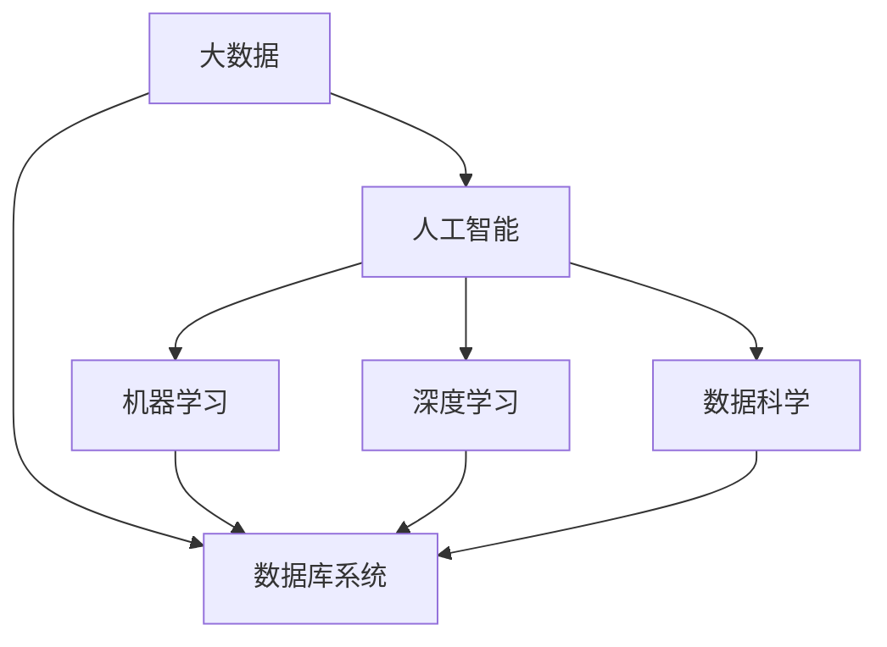

                 

# 大数据与数据库的AI应用

> 关键词：大数据,数据库,AI,人工智能,机器学习,深度学习,数据科学,数据库系统,智能分析,业务应用,数据存储,数据管理

## 1. 背景介绍

### 1.1 问题由来
随着互联网技术的飞速发展，数据量呈指数级增长。如何高效存储、管理和利用这些海量数据，成为企业和科研机构关注的焦点。传统的数据库系统在处理大规模数据时存在性能瓶颈和扩展性问题，难以满足数据密集型应用的需求。因此，结合人工智能技术，开发高性能、智能化的大数据与数据库系统，成为当前数据科学领域的重要研究方向。

大数据与数据库的AI应用，融合了人工智能技术和大数据处理能力，通过自动化、智能化的方式，提高数据管理的效率和精度，使企业能够快速响应市场变化，优化业务流程，提升决策质量。该领域的兴起，是大数据和人工智能技术的深度结合，也是未来信息时代发展的必然趋势。

### 1.2 问题核心关键点
大数据与数据库的AI应用，主要关注以下几个核心关键点：

1. **数据存储与管理**：如何在大规模数据环境中，实现数据的高效存储和灵活管理。
2. **智能分析与处理**：如何利用机器学习和深度学习技术，对大数据进行智能化分析和处理。
3. **数据库性能优化**：如何通过AI技术，优化数据库查询性能和数据更新效率。
4. **业务应用场景**：如何将大数据与数据库的AI应用，融入到实际的业务场景中，提升业务效率和效果。
5. **数据安全与隐私保护**：如何在智能化处理过程中，保证数据的安全和隐私。

这些关键点共同构成了大数据与数据库AI应用的研究框架，推动了该领域从理论到实践的全面发展。

## 2. 核心概念与联系

### 2.1 核心概念概述

为更好地理解大数据与数据库的AI应用，本节将介绍几个关键概念及其相互关系：

- **大数据 (Big Data)**：指数据量庞大、多样性高、高速变化的数据集合，通常具有4V特征（Volume、Velocity、Variety、Veracity）。
- **数据库系统 (Database System)**：指用于高效存储、管理和查询数据的软件系统，包括关系型数据库、NoSQL数据库等。
- **人工智能 (Artificial Intelligence, AI)**：通过模拟人类智能，使机器能够进行推理、决策、学习等智能行为的技术。
- **机器学习 (Machine Learning, ML)**：使机器通过学习数据，自动改进性能的算法和技术。
- **深度学习 (Deep Learning, DL)**：一种基于多层神经网络的机器学习技术，能够处理复杂的多层次数据特征。
- **数据科学 (Data Science)**：融合了数据挖掘、统计分析、机器学习等技术，从数据中提取知识和洞察力的学科。

这些概念之间的逻辑关系可以通过以下Mermaid流程图来展示：



这个流程图展示了大数据、数据库、人工智能、机器学习、深度学习和数据科学之间的相互关系：

1. 大数据是数据库系统和人工智能技术的基础。
2. 数据库系统存储和管理大规模数据，是人工智能算法的数据来源。
3. 机器学习和深度学习是人工智能的核心技术，用于数据的智能化分析和处理。
4. 数据科学综合了数据挖掘、统计分析和机器学习等技术，通过数据科学方法论，提取数据中的知识和洞察力。

这些概念共同构成了大数据与数据库AI应用的基础，为智能化数据处理和管理提供了技术支持。

## 3. 核心算法原理 & 具体操作步骤

### 3.1 算法原理概述

大数据与数据库的AI应用，主要基于以下几个核心算法原理：

- **分布式存储与计算**：利用分布式存储和计算技术，如Hadoop、Spark等，在大规模数据环境中，实现数据的并行存储和处理。
- **数据清洗与预处理**：通过数据清洗和预处理技术，去除数据中的噪声和异常值，提升数据质量。
- **特征工程与提取**：利用特征工程技术，从原始数据中提取有价值的特征，为机器学习模型的训练提供支持。
- **模型训练与优化**：使用机器学习和深度学习算法，训练智能分析模型，并通过超参数调优等技术，提升模型性能。
- **实时分析与决策**：结合时间序列分析、预测建模等技术，进行实时数据分析和决策支持，优化业务流程。

### 3.2 算法步骤详解

基于上述算法原理，大数据与数据库的AI应用主要包括以下几个关键步骤：

**Step 1: 数据采集与清洗**

- 通过爬虫、API接口、日志文件等方式，从不同的数据源中采集数据。
- 对采集的数据进行预处理，包括数据去重、格式化、缺失值填充等。
- 对数据进行质量检测，去除噪声和异常值，保证数据质量。

**Step 2: 数据存储与管理**

- 选择合适的数据库系统，将清洗后的数据存储到数据库中。
- 利用分布式存储技术，如Hadoop HDFS、Ceph等，实现数据的分布式存储。
- 建立数据索引和分片策略，提升查询效率。

**Step 3: 特征工程与提取**

- 分析业务需求，设计有针对性的特征工程流程。
- 利用特征提取算法，从原始数据中提取特征。
- 应用数据可视化工具，对特征进行分析和理解，优化特征工程流程。

**Step 4: 模型训练与优化**

- 选择合适的机器学习或深度学习算法，训练智能分析模型。
- 利用交叉验证等技术，对模型进行验证和评估。
- 调整模型超参数，提升模型性能。

**Step 5: 实时分析与决策**

- 利用时间序列分析和预测建模技术，对实时数据进行分析和预测。
- 结合业务场景，设计实时分析流程和决策规则。
- 通过可视化工具，将分析结果展示给业务人员，支持决策。

### 3.3 算法优缺点

大数据与数据库的AI应用，具有以下优点：

1. **高效性**：通过分布式存储和并行计算，显著提升数据处理效率。
2. **智能化**：利用机器学习和深度学习技术，实现数据的智能化分析和处理。
3. **可扩展性**：能够应对大规模数据和高并发访问，满足数据密集型应用的需求。
4. **准确性**：通过特征工程和模型优化，提高数据分析的准确性。

但同时也存在一些缺点：

1. **复杂性**：算法和技术栈复杂，需要具备较高的技术水平。
2. **成本高**：硬件和软件成本较高，需要投入大量资源。
3. **数据隐私风险**：在处理敏感数据时，需要关注数据隐私和安全问题。
4. **依赖数据质量**：数据清洗和特征提取的准确性，直接影响模型性能。

尽管存在这些缺点，但大数据与数据库的AI应用在大数据处理和管理方面的独特优势，使其成为当前数据科学领域的热门研究方向。

### 3.4 算法应用领域

大数据与数据库的AI应用，已经在多个领域得到了广泛应用，具体包括：

1. **金融行业**：通过智能化分析，提升风险管理、欺诈检测和市场分析等能力。
2. **零售行业**：通过消费者行为分析，优化库存管理、精准营销和客户服务。
3. **医疗行业**：通过数据分析，支持疾病预测、药物研发和个性化治疗。
4. **制造业**：通过设备监测和预测维护，提升生产效率和设备利用率。
5. **城市管理**：通过数据分析，优化交通管理、环境监测和公共安全。
6. **能源行业**：通过数据监控和预测分析，提升能源效率和电力供应可靠性。

除了这些传统领域，大数据与数据库的AI应用还在智慧农业、智能交通、公共安全等多个新兴领域发挥重要作用，推动各行各业向智能化转型。

## 4. 数学模型和公式 & 详细讲解  
### 4.1 数学模型构建

在本节中，我们将通过数学语言对大数据与数据库的AI应用进行更加严格的刻画。

假设大数据集为 $D=\{x_i\}_{i=1}^N$，其中 $x_i$ 为数据样本，可能包含连续值、离散值、文本等不同类型的特征。数据库系统用于高效存储和查询这些数据，同时结合机器学习模型 $M$，进行智能分析和决策。

定义模型 $M$ 在输入 $x$ 上的损失函数为 $\ell(M(x),y)$，其中 $y$ 为真实标签，表示模型的预测结果与真实值之间的差异。

通过最小化损失函数 $\mathcal{L}(M)$，求解最优模型参数 $\theta$：

$$
\theta^* = \mathop{\arg\min}_{\theta} \mathcal{L}(M)
$$

在实践中，我们通常使用梯度下降等优化算法来求解上述最优化问题。设 $\eta$ 为学习率，$\lambda$ 为正则化系数，则参数的更新公式为：

$$
\theta \leftarrow \theta - \eta \nabla_{\theta}\mathcal{L}(\theta) - \eta\lambda\theta
$$

其中 $\nabla_{\theta}\mathcal{L}(\theta)$ 为损失函数对参数 $\theta$ 的梯度，可通过反向传播算法高效计算。

### 4.2 公式推导过程

以下我们以回归任务为例，推导最小二乘损失函数及其梯度的计算公式。

假设模型 $M_{\theta}$ 在输入 $x$ 上的输出为 $\hat{y}=M_{\theta}(x)$，回归任务的目标是使 $\hat{y}$ 尽可能接近真实标签 $y$。则最小二乘损失函数定义为：

$$
\ell(M_{\theta}(x),y) = \frac{1}{N} \sum_{i=1}^N (\hat{y}_i - y_i)^2
$$

将其代入经验风险公式，得：

$$
\mathcal{L}(\theta) = \frac{1}{N} \sum_{i=1}^N (\hat{y}_i - y_i)^2
$$

根据链式法则，损失函数对参数 $\theta_k$ 的梯度为：

$$
\frac{\partial \mathcal{L}(\theta)}{\partial \theta_k} = -2\frac{1}{N}\sum_{i=1}^N (\hat{y}_i - y_i)\frac{\partial M_{\theta}(x)}{\partial \theta_k}
$$

其中 $\frac{\partial M_{\theta}(x)}{\partial \theta_k}$ 可进一步递归展开，利用自动微分技术完成计算。

在得到损失函数的梯度后，即可带入参数更新公式，完成模型的迭代优化。重复上述过程直至收敛，最终得到适应数据的模型参数 $\theta^*$。

## 5. 项目实践：代码实例和详细解释说明
### 5.1 开发环境搭建

在进行大数据与数据库的AI应用开发前，我们需要准备好开发环境。以下是使用Python进行PySpark开发的环境配置流程：

1. 安装Anaconda：从官网下载并安装Anaconda，用于创建独立的Python环境。

2. 创建并激活虚拟环境：
```bash
conda create -n pyspark-env python=3.8 
conda activate pyspark-env
```

3. 安装PySpark：根据CUDA版本，从官网获取对应的安装命令。例如：
```bash
conda install pytorch torchvision torchaudio cudatoolkit=11.1 -c pytorch -c conda-forge
```

4. 安装Spark：下载Spark安装包，并配置Spark环境变量，启动Spark集群。

5. 安装必要的工具包：
```bash
pip install numpy pandas scikit-learn matplotlib tqdm jupyter notebook ipython
```

完成上述步骤后，即可在`pyspark-env`环境中开始大数据与数据库的AI应用开发。

### 5.2 源代码详细实现

下面我们以金融行业的数据分析为例，给出使用PySpark进行大数据与数据库的AI应用的PyTorch代码实现。

首先，定义数据预处理函数：

```python
from pyspark.sql import SparkSession
from pyspark.sql.functions import col, avg, stddev, count, window

def data_preprocessing(df):
    # 清洗数据
    df = df.dropna()
    # 特征工程
    df = df.select(col('feature1'), col('feature2'), col('feature3'))
    # 数据标准化
    df = (df - df.mean()).divide(df.std().over(WINDOW.partitionBy('feature1')))
    return df
```

然后，定义机器学习模型：

```python
from pyspark.ml.classification import LogisticRegression
from pyspark.ml.evaluation import BinaryClassificationEvaluator

model = LogisticRegression(featuresCol='features', labelCol='label', maxIter=10, regParam=0.3)

# 训练模型
model.fit(trainData)

# 预测结果
predictions = model.transform(testData)

# 评估模型性能
evaluator = BinaryClassificationEvaluator(predictionCol='prediction', labelCol='label', metricName='areaUnderROC')
areaUnderROC = evaluator.evaluate(predictions)
print("areaUnderROC = ", areaUnderROC)
```

接着，定义特征工程和模型训练流程：

```python
# 数据读取和划分
spark = SparkSession.builder.appName('Data Science with Big Data and Database').getOrCreate()
trainData = spark.read.csv('train.csv', header=True)
testData = spark.read.csv('test.csv', header=True)
trainData = trainData.repartition(100)
testData = testData.repartition(100)

# 数据预处理
trainData = data_preprocessing(trainData)
testData = data_preprocessing(testData)

# 特征工程
features = 'feature1', 'feature2', 'feature3'
trainData = trainData.select(features)
testData = testData.select(features)

# 模型训练
model = LogisticRegression(featuresCol='features', labelCol='label', maxIter=10, regParam=0.3)
model.fit(trainData)

# 模型预测
predictions = model.transform(testData)

# 评估模型性能
evaluator = BinaryClassificationEvaluator(predictionCol='prediction', labelCol='label', metricName='areaUnderROC')
areaUnderROC = evaluator.evaluate(predictions)
print("areaUnderROC = ", areaUnderROC)
```

最后，运行整个大数据与数据库的AI应用流程：

```python
if __name__ == '__main__':
    if spark is None or not spark.assertTrue():
        spark = SparkSession.builder.appName('Data Science with Big Data and Database').getOrCreate()
    df = spark.read.csv('data.csv', header=True)
    df = data_preprocessing(df)
    features = 'feature1', 'feature2', 'feature3'
    df = df.select(features)
    model = LogisticRegression(featuresCol='features', labelCol='label', maxIter=10, regParam=0.3)
    model.fit(df)
    predictions = model.transform(df)
    evaluator = BinaryClassificationEvaluator(predictionCol='prediction', labelCol='label', metricName='areaUnderROC')
    areaUnderROC = evaluator.evaluate(predictions)
    print("areaUnderROC = ", areaUnderROC)
```

以上就是使用PySpark进行大数据与数据库的AI应用的完整代码实现。可以看到，通过Spark的便捷API，大数据与数据库的AI应用开发变得简单高效。

### 5.3 代码解读与分析

让我们再详细解读一下关键代码的实现细节：

**data_preprocessing函数**：
- 该函数用于对数据进行清洗、特征工程和数据标准化，保证数据质量。
- 清洗数据：删除缺失值，确保模型不会受到异常值的干扰。
- 特征工程：选择有代表性的特征，去除无关特征，提升模型性能。
- 数据标准化：对特征进行归一化处理，避免特征尺度不一致导致的模型偏差。

**LogisticRegression模型**：
- 选择逻辑回归模型作为分类器，使用Spark MLlib提供的LogisticRegression类实现。
- 训练模型：使用训练数据集训练模型，并设定最大迭代次数和正则化参数。
- 预测结果：在测试数据集上应用训练好的模型进行预测。
- 评估性能：使用二分类评估指标计算模型在测试集上的ROC曲线下面积，评估模型性能。

**特征工程和模型训练流程**：
- 数据读取和划分：通过Spark读取CSV文件，并按特征列进行重新分区，保证并行处理的效率。
- 数据预处理：调用数据预处理函数，对数据进行清洗和标准化。
- 特征工程：选择有意义的特征列，并将其作为模型的输入。
- 模型训练：使用逻辑回归模型训练数据，设定模型参数。
- 模型预测：在测试数据上应用训练好的模型进行预测。
- 性能评估：使用ROC曲线下面积（Area Under Curve, AUC）评估模型性能。

可以看到，通过Spark的便捷API，大数据与数据库的AI应用开发变得简单高效。开发者可以将更多精力放在数据处理、模型改进等高层逻辑上，而不必过多关注底层的实现细节。

当然，工业级的系统实现还需考虑更多因素，如模型的保存和部署、超参数的自动搜索、更灵活的任务适配层等。但核心的AI应用流程基本与此类似。

## 6. 实际应用场景
### 6.1 金融行业

在大数据与数据库的AI应用中，金融行业是典型应用场景之一。金融行业数据量大、种类多、实时性强，传统的数据库系统难以应对。通过引入大数据与数据库的AI技术，金融行业可以实现更高效的数据管理和智能化分析。

具体而言，大数据与数据库的AI技术可以应用于：

- **风险管理**：通过分析历史数据，预测信用风险和市场波动，实现智能化的风险预警和控制。
- **欺诈检测**：利用机器学习模型，识别和预防金融欺诈行为，保护客户资产安全。
- **市场分析**：通过分析股票、期货等金融市场数据，进行趋势预测和投资决策。
- **客户服务**：通过智能客服系统，快速响应客户咨询，提升客户满意度。

### 6.2 零售行业

大数据与数据库的AI技术在零售行业同样具有广泛的应用前景。零售行业数据涉及交易记录、客户行为、库存信息等，数据量庞大且实时更新，传统的数据库系统难以有效管理。

具体而言，大数据与数据库的AI技术可以应用于：

- **库存管理**：通过分析销售数据和库存数据，优化库存管理，减少库存积压和缺货风险。
- **客户行为分析**：利用机器学习模型，分析客户购买行为和偏好，实现个性化营销和推荐。
- **供应链优化**：通过数据分析，优化供应链管理，提升供应链效率和响应速度。
- **客户服务**：通过智能客服系统，提升客户服务质量，提升客户满意度。

### 6.3 医疗行业

大数据与数据库的AI技术在医疗行业也具有广泛的应用前景。医疗行业数据种类多、数据量大，且数据敏感性高，传统的数据库系统难以满足需求。

具体而言，大数据与数据库的AI技术可以应用于：

- **疾病预测**：通过分析患者历史数据，预测疾病发生概率，实现早期诊断和治疗。
- **药物研发**：利用机器学习模型，分析药物成分和效果，加速新药研发过程。
- **个性化治疗**：通过分析患者基因数据和病史，制定个性化治疗方案，提升治疗效果。
- **医疗影像分析**：通过深度学习模型，分析医疗影像数据，辅助医生诊断和手术。

## 7. 工具和资源推荐
### 7.1 学习资源推荐

为了帮助开发者系统掌握大数据与数据库的AI应用的理论基础和实践技巧，这里推荐一些优质的学习资源：

1. **《Python for Data Science Handbook》**：由Jake VanderPlas撰写，全面介绍了Python在大数据与数据库中的使用，包括NumPy、Pandas、Spark等库的使用方法。

2. **《Hadoop: The Definitive Guide》**：由Tom White撰写，详细介绍Hadoop生态系统的各个组件及其应用，适合入门Hadoop开发。

3. **《Deep Learning with PyTorch》**：由Eli Stevens等人撰写，全面介绍了PyTorch在深度学习中的应用，适合了解深度学习在大数据与数据库中的实践。

4. **Coursera上的《Data Science with Python Specialization》**：由Johns Hopkins大学提供，通过多个课程，从数据处理到机器学习，全面介绍数据科学的应用。

5. **Kaggle上的大数据与数据库应用竞赛**：Kaggle是一个知名的数据科学竞赛平台，通过参与竞赛，可以实践和提升自己的大数据与数据库的AI应用技能。

通过对这些资源的学习实践，相信你一定能够快速掌握大数据与数据库的AI应用的技能，并用于解决实际的业务问题。

### 7.2 开发工具推荐

高效的开发离不开优秀的工具支持。以下是几款用于大数据与数据库的AI应用开发的常用工具：

1. **Hadoop**：由Apache基金会提供的开源分布式存储和计算平台，适用于大规模数据处理。

2. **Spark**：由Apache基金会提供的开源大数据处理框架，支持分布式计算、内存计算、流式计算等。

3. **TensorFlow**：由Google开发的开源深度学习框架，支持分布式计算，适用于深度学习模型训练。

4. **PyTorch**：由Facebook开发的开源深度学习框架，支持动态计算图和GPU加速，适用于深度学习模型训练和推理。

5. **Spark SQL**：Spark提供的SQL接口，支持对大规模数据进行高效的查询和分析。

6. **Databricks**：基于Spark开发的云服务平台，提供一站式大数据与数据库开发环境，包括Spark、SQL、ML等。

合理利用这些工具，可以显著提升大数据与数据库的AI应用开发的效率和质量。

### 7.3 相关论文推荐

大数据与数据库的AI应用是一个快速发展的领域，以下是几篇奠基性的相关论文，推荐阅读：

1. **《Big Data: Principles and Best Practices of Scalable Real-time Data Systems》**：由John A. Davies等人撰写，全面介绍了大数据处理的原则和最佳实践，适合了解大数据处理的基本概念。

2. **《Spark: The Fast and Flexible General Purpose Cluster Computing System》**：由Spark团队撰写，详细介绍Spark框架的设计和实现，适合深入理解Spark的使用。

3. **《A Survey on Big Data Management in Cloud Environments》**：由Wenhui Yang等人撰写，全面介绍了大数据在云环境中的管理和处理技术，适合了解大数据在云环境中的应用。

4. **《Machine Learning with SQL》**：由Joel Grus撰写，介绍了SQL在机器学习中的应用，适合了解SQL在大数据与数据库中的使用。

5. **《Big Data: From Hadoop to Spark》**：由Anton Akhmerov等人撰写，全面介绍了从Hadoop到大数据处理技术的发展，适合了解大数据处理技术的历史和未来趋势。

这些论文代表了大数据与数据库的AI应用的发展脉络。通过学习这些前沿成果，可以帮助研究者把握学科前进方向，激发更多的创新灵感。

## 8. 总结：未来发展趋势与挑战

### 8.1 总结

本文对大数据与数据库的AI应用进行了全面系统的介绍。首先阐述了大数据与数据库的AI应用的兴起背景和重要性，明确了大数据与数据库的AI应用在大数据管理和智能化分析方面的独特价值。其次，从原理到实践，详细讲解了大数据与数据库的AI应用的核心算法和操作步骤，给出了大数据与数据库的AI应用的完整代码实例。同时，本文还广泛探讨了大数据与数据库的AI应用在金融、零售、医疗等多个领域的应用前景，展示了其广阔的发展空间。此外，本文精选了大数据与数据库的AI应用的学习资源、开发工具和相关论文，力求为读者提供全方位的技术指引。

通过本文的系统梳理，可以看到，大数据与数据库的AI应用正在成为大数据处理和智能化分析的重要手段，推动各行各业向智能化转型。得益于大数据和人工智能技术的深度结合，大数据与数据库的AI应用在提高数据处理效率和智能化分析能力方面，具有不可替代的优势。未来，随着技术的不断进步和应用场景的不断拓展，大数据与数据库的AI应用必将在更广泛的领域得到应用，带来更深刻的变革。

### 8.2 未来发展趋势

展望未来，大数据与数据库的AI应用将呈现以下几个发展趋势：

1. **自动化程度提升**：大数据与数据库的AI应用将进一步自动化，通过自动化的数据清洗、特征工程和模型训练，大幅降低人工干预，提高效率。
2. **智能化分析增强**：利用深度学习和大数据分析技术，实现更精准、更智能的数据分析和预测，提升业务决策的科学性和准确性。
3. **跨领域融合加深**：大数据与数据库的AI应用将与其他人工智能技术，如知识图谱、自然语言处理等，进行更深入的融合，实现更全面、更复杂的数据处理和分析。
4. **实时性要求提高**：随着实时数据需求的增加，大数据与数据库的AI应用需要进一步提升实时处理能力，实现快速响应。
5. **数据隐私保护加强**：在处理敏感数据时，需要加强数据隐私保护和匿名化处理，保障用户数据安全。
6. **模型可解释性增强**：为提升系统的透明度和可解释性，需要加强对模型决策过程的分析和理解，避免“黑盒”系统。

以上趋势凸显了大数据与数据库的AI应用的前景和挑战。这些方向的探索发展，必将进一步推动大数据与数据库的AI应用向更深层次和更广领域拓展，为各行各业提供更强大的数据处理和智能化分析能力。

### 8.3 面临的挑战

尽管大数据与数据库的AI应用已经取得了显著成果，但在迈向更加智能化、普适化应用的过程中，它仍面临着诸多挑战：

1. **数据质量和隐私保护**：数据清洗和特征提取的准确性，直接影响模型的性能。同时，在处理敏感数据时，需要关注数据隐私和安全问题。
2. **计算资源瓶颈**：大规模数据处理和深度学习模型训练需要大量的计算资源，硬件和软件成本较高。
3. **算法复杂性**：算法和技术栈复杂，需要具备较高的技术水平。
4. **模型鲁棒性和泛化能力**：模型在处理不同类型和来源的数据时，鲁棒性和泛化能力需要进一步提升。
5. **业务理解不足**：模型性能提升不一定等同于业务效果提升，需要对业务场景有深入理解，才能充分发挥大数据与数据库的AI应用的价值。

尽管存在这些挑战，但随着技术的发展和应用场景的拓展，大数据与数据库的AI应用将不断克服困难，向更高的台阶迈进。相信通过学术界和产业界的共同努力，这些挑战终将一一被克服，大数据与数据库的AI应用必将在构建智能化信息时代中扮演越来越重要的角色。

### 8.4 研究展望

面对大数据与数据库的AI应用所面临的种种挑战，未来的研究需要在以下几个方面寻求新的突破：

1. **自动化算法设计**：开发更自动化的算法设计工具，减少人工干预，提升算法开发效率。
2. **智能化决策支持**：结合知识图谱和自然语言处理等技术，提升模型决策的科学性和可解释性。
3. **实时数据处理**：开发更高效的实时数据处理和分析算法，提升系统的实时响应能力。
4. **跨领域融合**：进一步探索大数据与数据库的AI应用与其他人工智能技术的融合，实现更全面、更复杂的数据处理和分析。
5. **数据隐私保护**：加强数据隐私保护和匿名化处理技术，保障用户数据安全。
6. **模型可解释性**：研究可解释性算法和工具，提升模型的透明度和可解释性。

这些研究方向的探索，必将引领大数据与数据库的AI应用向更高的台阶，为构建智能化信息时代提供更强大的技术支撑。面向未来，大数据与数据库的AI应用还需要与其他人工智能技术进行更深入的融合，多路径协同发力，共同推动信息时代的进步。只有勇于创新、敢于突破，才能不断拓展大数据与数据库的AI应用的边界，让智能化技术更好地造福人类社会。

## 9. 附录：常见问题与解答

**Q1：大数据与数据库的AI应用适用于所有行业吗？**

A: 大数据与数据库的AI应用在金融、零售、医疗等数据密集型行业已经取得了显著成效，但对于一些数据量较小、数据类型单一的行业，如餐饮、娱乐等，可能适用性不高。需要根据具体行业特点和数据规模，选择合适的技术和方案。

**Q2：在开发大数据与数据库的AI应用时，如何选择合适的工具？**

A: 选择合适的工具需要考虑数据规模、业务需求、技术栈等多个因素。一般而言，对于大规模数据处理和分布式计算，可以选择Hadoop、Spark等；对于深度学习模型训练和推理，可以选择PyTorch、TensorFlow等；对于数据管理和查询，可以选择Spark SQL、PostgreSQL等。根据具体需求，选择合适的工具和框架，能够大幅提升开发效率。

**Q3：如何在大数据与数据库的AI应用中保证数据隐私？**

A: 数据隐私保护是大数据与数据库的AI应用中必须重视的问题。主要措施包括：
1. 数据匿名化：对敏感数据进行去标识化处理，避免泄露用户身份信息。
2. 数据加密：对敏感数据进行加密处理，防止数据泄露。
3. 访问控制：对数据访问进行严格的权限管理，控制数据访问权限。
4. 差分隐私：通过引入噪声，限制数据泄露的风险。

通过以上措施，可以有效保护数据隐私，保障数据安全。

**Q4：如何在大数据与数据库的AI应用中提升模型性能？**

A: 提升模型性能需要从数据质量、模型架构、算法优化等多个方面入手。具体措施包括：
1. 数据清洗：去除数据中的噪声和异常值，保证数据质量。
2. 特征工程：选择有代表性的特征，提升模型性能。
3. 模型优化：调整模型架构和超参数，提升模型泛化能力和鲁棒性。
4. 模型集成：结合多个模型进行集成学习，提升模型性能。

通过以上措施，可以有效提升大数据与数据库的AI应用中模型的性能。

**Q5：在大数据与数据库的AI应用中，如何处理大数据量的实时数据？**

A: 处理大数据量的实时数据需要高效的数据存储和处理技术。主要措施包括：
1. 分布式存储：采用Hadoop、Spark等分布式存储和计算技术，实现数据的分布式存储和处理。
2. 流式计算：采用Spark Streaming、Apache Kafka等流式计算技术，实现实时数据的流处理。
3. 实时分析：采用Spark SQL、Presto等实时数据分析技术，实现实时数据分析和查询。

通过以上措施，可以有效处理大数据量的实时数据，实现快速响应和实时决策。

---

作者：禅与计算机程序设计艺术 / Zen and the Art of Computer Programming

