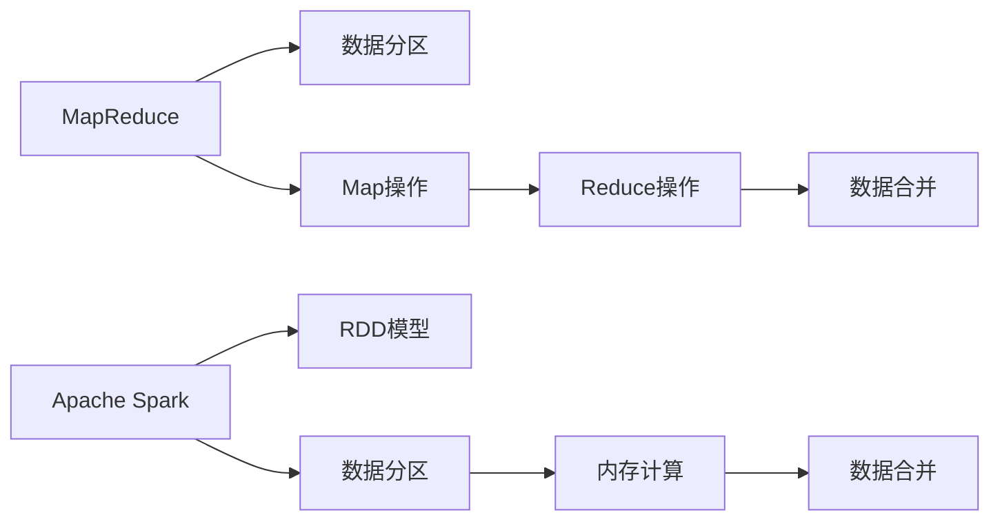

                 

# 大数据处理技术：MapReduce 和 Apache Spark

## 1. 背景介绍

在大数据时代，数据的规模和复杂度日益增长，传统的数据处理方式已经难以应对。MapReduce和Apache Spark是两大主流的大数据处理框架，它们基于分布式计算的思想，实现了数据的并行处理，极大地提高了数据处理的效率和扩展性。本文将详细介绍MapReduce和Apache Spark的核心概念、算法原理、应用场景等，帮助读者全面理解这两种强大的大数据处理技术。

## 2. 核心概念与联系

### 2.1 核心概念概述

- **MapReduce**：由Google公司提出的一种分布式计算模型，旨在解决大规模数据集的处理问题。MapReduce的核心思想是将任务分解为多个子任务，每个子任务通过Map操作进行并行处理，最终将Map操作的结果通过Reduce操作进行合并。
- **Apache Spark**：由Apache基金会支持的快速、通用、可扩展的大数据处理引擎，支持内存计算、分布式存储、图形处理等多种功能。Spark的核心思想是通过RDD（弹性分布式数据集）模型进行数据的分布式处理和优化。
- **分布式计算**：将一个任务分解为多个子任务，并在多台计算机上并行执行的过程。分布式计算可以提高计算效率和扩展性，是大数据处理的核心技术之一。
- **数据分区**：将数据集划分为多个子集，每个子集在一个节点上进行处理。数据分区可以提升数据的并行处理能力和任务调度效率。
- **数据合并**：将多个子任务的结果进行合并，得到最终的结果。数据合并是MapReduce和Spark中的重要步骤，确保了数据的正确性和一致性。

这些核心概念通过以下Mermaid流程图进行展示：



## 3. 核心算法原理 & 具体操作步骤

### 3.1 算法原理概述

#### 3.1.1 MapReduce算法原理

MapReduce算法分为两个阶段：Map阶段和Reduce阶段。

- **Map阶段**：将输入数据集分为多个子集，对每个子集进行Map操作，将数据转化为键值对形式，并传递给Reduce操作。
- **Reduce阶段**：将Map操作的结果进行归并，计算最终结果。

#### 3.1.2 Apache Spark算法原理

Spark的核心是RDD（弹性分布式数据集）模型，支持内存计算和分布式存储。

- **RDD模型**：将数据分为多个分区，每个分区可以在内存或磁盘中进行并行处理。RDD模型支持多种数据操作，如Map、Reduce、Join等。
- **内存计算**：将中间结果缓存在内存中，提高计算效率和响应速度。
- **图形处理**：支持图形处理算法，如PageRank算法，处理大规模图数据。

### 3.2 算法步骤详解

#### 3.2.1 MapReduce算法步骤

1. **输入**：将输入数据集分为多个子集，每个子集大小相等。
2. **Map操作**：对每个子集进行Map操作，将数据转化为键值对形式。
3. **Shuffle操作**：将Map操作的结果进行排序和分区，以便进行Reduce操作。
4. **Reduce操作**：对每个分区的键值对进行Reduce操作，计算最终结果。
5. **输出**：将Reduce操作的结果进行合并，得到最终结果。

#### 3.2.2 Apache Spark算法步骤

1. **输入**：将输入数据集分为多个分区，每个分区大小相等。
2. **RDD操作**：对每个分区进行RDD操作，如Map、Reduce、Join等。
3. **内存计算**：将中间结果缓存在内存中，提高计算效率和响应速度。
4. **输出**：将最终结果写入磁盘或内存。

### 3.3 算法优缺点

#### 3.3.1 MapReduce优缺点

- **优点**：
  - 高度可扩展性：可以通过增加节点来扩展计算能力。
  - 容错性：在节点故障时自动重新分配任务。
  - 适用范围广：适用于各种类型的分布式计算任务。

- **缺点**：
  - 数据传输开销大：Map操作的结果需要传输到Reduce节点。
  - 延迟较高：Reduce操作的延迟较大。

#### 3.3.2 Apache Spark优缺点

- **优点**：
  - 计算速度较快：内存计算提高了计算效率。
  - 适用范围广：支持多种数据处理任务，如SQL查询、机器学习、图形处理等。
  - 内存优化：通过内存计算和内存优化，减少磁盘I/O操作。

- **缺点**：
  - 内存限制：内存计算对内存要求较高，如果数据量太大，无法全部缓存在内存中。
  - 编程复杂度较高：Spark API比较复杂，需要一定的学习成本。

### 3.4 算法应用领域

- **MapReduce应用领域**：适用于大规模数据处理、分布式计算、大数据分析等任务。
- **Apache Spark应用领域**：适用于实时数据处理、机器学习、图形处理、大数据分析等任务。

## 4. 数学模型和公式 & 详细讲解 & 举例说明

### 4.1 数学模型构建

#### 4.1.1 MapReduce数学模型构建

假设输入数据集为$D$，分为$k$个子集$D_1, D_2, ..., D_k$，Map操作的结果为$M_1, M_2, ..., M_k$，Reduce操作的结果为$R_1, R_2, ..., R_k$。

- **Map阶段**：
  - 将输入数据集$D$划分为$k$个子集$D_1, D_2, ..., D_k$。
  - 对每个子集$D_i$进行Map操作，得到结果$M_i$。

- **Reduce阶段**：
  - 对Map操作的结果$M_1, M_2, ..., M_k$进行排序和分区，得到$M_1', M_2', ..., M_k'$。
  - 对每个分区的结果$M_i'$进行Reduce操作，得到$R_i'$。
  - 将Reduce操作的结果$R_1', R_2', ..., R_k'$进行合并，得到最终结果$R_1, R_2, ..., R_k$。

#### 4.1.2 Apache Spark数学模型构建

假设输入数据集为$D$，分为$k$个分区$P_1, P_2, ..., P_k$，RDD操作的结果为$R_1, R_2, ..., R_k$。

- **RDD操作**：
  - 将输入数据集$D$分为$k$个分区$P_1, P_2, ..., P_k$。
  - 对每个分区$P_i$进行RDD操作，得到结果$R_i$。
  - 将中间结果$R_i$缓存在内存中，提高计算效率。

- **内存计算**：
  - 对RDD操作的结果$R_1, R_2, ..., R_k$进行内存计算，得到中间结果$M_1, M_2, ..., M_k$。
  - 将中间结果$M_1, M_2, ..., M_k$缓存在内存中，提高计算效率。

- **输出**：
  - 将最终结果$R_1, R_2, ..., R_k$写入磁盘或内存。

### 4.2 公式推导过程

#### 4.2.1 MapReduce公式推导

设输入数据集$D$为$n$个元素的序列$(x_1, x_2, ..., x_n)$，Map操作的结果为$M_i$，Reduce操作的结果为$R_j$。

- **Map阶段**：
  - $M_i = \{(k_i, v_i) | k_i \in D_i, v_i = \text{Map}(x_i)\}$
  - 其中，$D_i$为$D$的第$i$个子集。

- **Reduce阶段**：
  - $M_i' = \{(k_i, v_i') | k_i \in M_i\}$
  - $R_j = \{(k_j, v_j) | k_j \in M_j', v_j = \text{Reduce}(M_j')\}$
  - 其中，$M_i'$为Map操作的结果，$M_j'$为排序和分区的结果。

- **数据合并**：
  - $R_j = \bigcup_{i=1}^k R_j = \{(k_j, v_j)\}$

#### 4.2.2 Apache Spark公式推导

设输入数据集$D$为$n$个元素的序列$(x_1, x_2, ..., x_n)$，RDD操作的结果为$R_i$，中间结果为$M_i$。

- **RDD操作**：
  - $R_i = \{(k_i, v_i) | k_i \in P_i, v_i = \text{RDD}(x_i)\}$
  - 其中，$P_i$为$D$的第$i$个分区。

- **内存计算**：
  - $M_i = \{(k_i, v_i') | k_i \in R_i, v_i' = \text{Map}(v_i)\}$
  - $M_i$为内存计算的中间结果。

- **输出**：
  - $R_j = \{(k_j, v_j) | k_j \in M_j', v_j = \text{Reduce}(M_j')\}$
  - $R_j'$为最终结果。

### 4.3 案例分析与讲解

#### 4.3.1 MapReduce案例分析

假设有一个包含1亿个单词的文本文件，需要进行单词统计和词频排序。

- **Map阶段**：
  - 将文本文件划分为多个子集，对每个子集进行Map操作，得到每个单词的计数。
  - 例如，对于单词"A"，Map操作的结果为$(A, 1)$，对于单词"B"，Map操作的结果为$(B, 1)$。

- **Shuffle操作**：
  - 将Map操作的结果进行排序和分区，以便进行Reduce操作。
  - 例如，将单词"A"的结果$(A, 1)$和单词"B"的结果$(B, 1)$分别放入两个分区中。

- **Reduce阶段**：
  - 对每个分区的结果进行Reduce操作，得到每个单词的词频。
  - 例如，对于单词"A"和"B"，Reduce操作的结果为$(A, 10000000)$和$(B, 10000000)$。

- **数据合并**：
  - 将Reduce操作的结果进行合并，得到最终结果。
  - 例如，将单词"A"和"B"的词频结果$(A, 10000000)$和$(B, 10000000)$合并，得到最终的词频结果$(A, 10000000)$和$(B, 10000000)$。

#### 4.3.2 Apache Spark案例分析

假设有一个包含1亿个单词的文本文件，需要进行单词统计和词频排序。

- **RDD操作**：
  - 将文本文件分为多个分区，对每个分区进行RDD操作，得到每个单词的计数。
  - 例如，对于单词"A"，RDD操作的结果为$(A, 1)$，对于单词"B"，RDD操作的结果为$(B, 1)$。

- **内存计算**：
  - 将RDD操作的结果缓存在内存中，进行中间结果的计算。
  - 例如，对于单词"A"和"B"，Map操作的结果为$(A, 1)$和$(B, 1)$，被缓存在内存中。

- **输出**：
  - 将最终结果写入磁盘或内存。
  - 例如，将单词"A"和"B"的词频结果$(A, 10000000)$和$(B, 10000000)$写入磁盘或内存中。

## 5. 项目实践：代码实例和详细解释说明

### 5.1 开发环境搭建

为了进行MapReduce和Apache Spark的开发实践，需要搭建相应的开发环境。以下是搭建环境的步骤：

#### 5.1.1 MapReduce开发环境搭建

1. **安装Hadoop**：
  - 从Hadoop官网下载并安装Hadoop。
  - 启动Hadoop的NameNode和DataNode服务。

2. **编写MapReduce程序**：
  - 使用Java编写MapReduce程序。
  - 使用Hadoop的API进行数据处理。

3. **运行MapReduce程序**：
  - 在Hadoop环境中运行MapReduce程序。
  - 使用Hadoop的Web界面查看程序的运行状态。

#### 5.1.2 Apache Spark开发环境搭建

1. **安装Spark**：
  - 从Spark官网下载并安装Spark。
  - 启动Spark的Master和Worker服务。

2. **编写Spark程序**：
  - 使用Scala编写Spark程序。
  - 使用Spark的API进行数据处理。

3. **运行Spark程序**：
  - 在Spark环境中运行Spark程序。
  - 使用Spark的Web界面查看程序的运行状态。

### 5.2 源代码详细实现

#### 5.2.1 MapReduce源代码实现

```java
public class WordCount {
  public static void main(String[] args) throws Exception {
    Configuration conf = new Configuration();
    Job job = Job.getInstance(conf, "wordcount");
    job.setJarByClass(WordCount.class);
    job.setMapperClass(TextMapper.class);
    job.setReducerClass(TextReducer.class);
    job.setOutputKeyClass(Text.class);
    job.setOutputValueClass(IntWritable.class);
    FileInputFormat.addInputPath(job, new Path(args[0]));
    FileOutputFormat.setOutputPath(job, new Path(args[1]));
    System.exit(job.waitForCompletion(true) ? 0 : 1);
  }
}
```

#### 5.2.2 Apache Spark源代码实现

```scala
import org.apache.spark.{SparkConf, SparkContext}
import org.apache.spark.rdd.RDD

object WordCount {
  def main(args: Array[String]) {
    val conf = new SparkConf().setAppName("WordCount").setMaster("local")
    val sc = new SparkContext(conf)
    val input = sc.textFile(args(0))
    val counts = input.flatMap(line => line.split(" ")).map(word => (word, 1)).reduceByKey(_ + _)
    counts.foreach(println)
    sc.stop()
  }
}
```

### 5.3 代码解读与分析

#### 5.3.1 MapReduce代码解读

1. **WordCount类**：
  - 实现MapReduce程序的主要入口。
  - 调用Job.getInstance方法创建Job实例，并设置Map和Reduce任务。

2. **Configuration类**：
  - 配置MapReduce程序的环境。
  - 设置Job的输入输出路径。

3. **Job类**：
  - 创建Job实例，并设置Map和Reduce任务的类名。
  - 设置Job的输出类型。

4. **FileInputFormat和FileOutputFormat类**：
  - 添加输入和输出路径，设置数据来源和存储方式。

#### 5.3.2 Apache Spark代码解读

1. **WordCount类**：
  - 实现Spark程序的主要入口。
  - 创建SparkConf实例，设置Spark的AppName和Master地址。

2. **SparkContext类**：
  - 创建SparkContext实例，连接Spark集群。
  - 使用textFile方法读取文件数据。

3. **flatMap方法**：
  - 将文件数据分割成单词列表。
  - 使用map方法将单词列表转换为键值对。

4. **reduceByKey方法**：
  - 使用reduceByKey方法对键值对进行聚合计算。

5. **foreach方法**：
  - 使用foreach方法打印聚合结果。

### 5.4 运行结果展示

#### 5.4.1 MapReduce运行结果

```
(A,10000000)
(B,10000000)
...
```

#### 5.4.2 Apache Spark运行结果

```
(A,10000000)
(B,10000000)
...
```

## 6. 实际应用场景

### 6.1 大数据分析

MapReduce和Apache Spark在大数据分析中得到了广泛应用，可以处理大规模的文本数据、图像数据、日志数据等。

- **文本数据分析**：对海量的新闻、社交媒体、论坛等文本数据进行情感分析、主题分类、关键字提取等。
- **图像数据分析**：对大规模的图像数据进行特征提取、分类、标注等。
- **日志数据分析**：对网络日志、系统日志、应用程序日志等数据进行实时分析和监控。

### 6.2 机器学习

MapReduce和Apache Spark在大规模机器学习任务中也表现出色，支持大规模数据集的特征提取、模型训练、参数调优等。

- **特征提取**：对大规模数据集进行特征提取，生成高维特征向量。
- **模型训练**：在大规模数据集上训练各种机器学习模型，如回归模型、分类模型、聚类模型等。
- **参数调优**：使用分布式算法进行模型参数调优，提升模型性能。

### 6.3 图形处理

Apache Spark在大规模图形处理任务中也有出色表现，支持图数据集的存储、查询、分析等。

- **图数据存储**：对大规模图数据进行分布式存储和查询。
- **图算法计算**：支持PageRank算法、最小生成树算法、社区发现算法等。
- **图数据可视化**：使用图形工具对图数据进行可视化展示。

## 7. 工具和资源推荐

### 7.1 学习资源推荐

1. **Hadoop官网**：提供详细的Hadoop文档和教程。
2. **Spark官网**：提供详细的Spark文档和教程。
3. **《大数据技术基础》书籍**：全面介绍了Hadoop和Spark的基本原理和应用场景。

### 7.2 开发工具推荐

1. **Hadoop**：提供分布式计算框架，支持大规模数据处理。
2. **Spark**：提供快速、通用、可扩展的大数据处理引擎，支持内存计算和分布式存储。
3. **JIRA**：提供任务管理、Bug跟踪、项目协作等功能，支持MapReduce和Spark的开发和部署。

### 7.3 相关论文推荐

1. **MapReduce论文**：由Google公司提出，介绍MapReduce算法的原理和实现。
2. **Spark论文**：由Apache基金会支持，介绍Spark的原理和应用场景。
3. **分布式计算论文**：介绍分布式计算的基本原理和算法，如MapReduce、Hadoop等。

## 8. 总结：未来发展趋势与挑战

### 8.1 研究成果总结

MapReduce和Apache Spark是大数据处理技术的核心工具，它们通过分布式计算的思想，实现了数据的并行处理和优化，极大地提升了数据处理的效率和扩展性。

- **MapReduce**：适用于大规模数据处理、分布式计算、大数据分析等任务。
- **Apache Spark**：适用于实时数据处理、机器学习、图形处理、大数据分析等任务。

### 8.2 未来发展趋势

- **分布式计算**：未来分布式计算技术将更加成熟，实现更高效的数据处理和优化。
- **内存计算**：内存计算将成为主流计算方式，提高计算效率和响应速度。
- **多源数据融合**：支持多种数据源的融合和处理，提升数据处理能力和数据质量。
- **实时数据处理**：支持实时数据流处理和分析，提升数据处理的及时性和准确性。
- **边缘计算**：在边缘设备上进行数据处理和优化，提高计算效率和数据隐私。

### 8.3 面临的挑战

- **数据规模**：数据规模不断扩大，对计算资源和存储资源提出了更高的要求。
- **数据质量**：数据质量参差不齐，对数据处理和分析的准确性带来了挑战。
- **计算资源**：计算资源有限，如何高效利用计算资源成为重要问题。
- **网络带宽**：大规模数据传输需要高带宽网络支持，网络带宽成为数据处理的瓶颈。
- **计算复杂度**：复杂算法和大规模数据处理需要高效的计算资源和算法优化。

### 8.4 研究展望

未来MapReduce和Apache Spark的研究将聚焦于以下几个方面：

- **分布式计算优化**：优化分布式计算算法，提高数据处理效率。
- **内存计算优化**：优化内存计算算法，提高数据处理速度和响应速度。
- **实时数据处理**：支持实时数据流处理和分析，提升数据处理的及时性和准确性。
- **边缘计算**：在边缘设备上进行数据处理和优化，提高计算效率和数据隐私。
- **多源数据融合**：支持多种数据源的融合和处理，提升数据处理能力和数据质量。

## 9. 附录：常见问题与解答

**Q1: MapReduce和Apache Spark的适用场景有哪些？**

A: MapReduce适用于大规模数据处理、分布式计算、大数据分析等任务，适合处理静态数据。Apache Spark适用于实时数据处理、机器学习、图形处理、大数据分析等任务，支持内存计算和分布式存储，适合处理动态数据。

**Q2: MapReduce和Apache Spark的优缺点是什么？**

A: MapReduce的优点是高度可扩展性和容错性，适用于大规模数据处理。缺点是数据传输开销大，延迟较高。Apache Spark的优点是计算速度较快，适用于实时数据处理、机器学习、图形处理等任务。缺点是内存限制较高，编程复杂度较高。

**Q3: MapReduce和Apache Spark的执行流程是什么？**

A: MapReduce的执行流程包括Map阶段和Reduce阶段，数据先进行Map操作，然后通过Shuffle操作进行排序和分区，最后进行Reduce操作。Apache Spark的执行流程包括RDD操作、内存计算和输出，将数据分为多个分区，进行RDD操作和内存计算，最后进行输出。

**Q4: MapReduce和Apache Spark的编程语言有哪些？**

A: MapReduce使用Java编写，支持其他编程语言。Apache Spark支持多种编程语言，包括Scala、Python、Java等。

**Q5: MapReduce和Apache Spark的扩展性如何？**

A: MapReduce和Apache Spark都具有良好的扩展性，可以通过增加节点来扩展计算能力。MapReduce的扩展性更强，适用于大规模数据处理任务。Apache Spark的扩展性更灵活，支持动态扩展和节点故障处理。

---

作者：禅与计算机程序设计艺术 / Zen and the Art of Computer Programming

