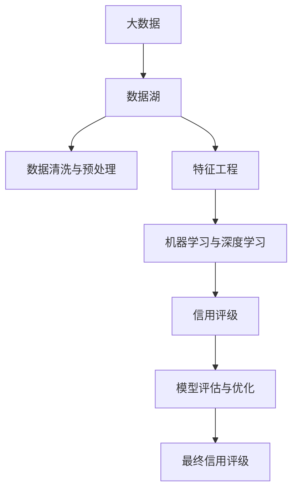

                 

# 大数据技术在银行个人信贷信用评级中的应用研究

## 1. 背景介绍

随着金融科技的迅猛发展，银行在个人信贷业务中面临着如何更准确、更高效地进行信用评级的挑战。传统的信用评级方法主要依赖于人工审核、简单的统计模型等，难以适应大规模、高频率的业务需求，且容易受到主观偏见的影响。而大数据技术的广泛应用，为银行个人信贷信用评级提供了全新的思路和技术支持。

本文将深入探讨大数据技术在银行个人信贷信用评级中的应用，包括数据采集与预处理、特征工程与模型构建、评估与优化等多个关键环节，以期为银行信贷业务的智能化、精准化提供参考。

## 2. 核心概念与联系

### 2.1 核心概念概述

为更好地理解大数据技术在银行个人信贷信用评级中的应用，本节将介绍几个密切相关的核心概念：

- **大数据**：指超出传统数据处理软件在合理时间周期内处理能力的数据集，涵盖结构化数据、非结构化数据和半结构化数据。大数据的核心价值在于其规模大、种类多、速度快、价值密度低等特点。

- **数据湖**：指收集、存储、管理、分析海量数据的平台。与数据仓库不同，数据湖不追求数据的结构化，更强调数据的完整性。

- **数据清洗与预处理**：指从原始数据中剔除错误、重复、缺失、无关数据，进行数据格式化、归一化、缺失值处理等操作，为后续分析提供高质量的数据。

- **特征工程**：指通过数据变换、特征选择、特征构造等方式，提取有意义的特征信息，提升模型的预测能力。特征工程在大数据应用中尤为重要。

- **机器学习与深度学习**：通过算法自动从数据中学习规律和模式，实现对未知数据的预测和分类。在大数据背景下，机器学习和深度学习算法被广泛应用于信用评级等金融业务。

- **信用评级**：根据客户的财务、信用记录、社会信息等数据，综合评估其信用风险，为银行提供决策参考。信用评级是银行风险管理的核心环节。

- **模型评估与优化**：通过各种评估指标和算法，评估信用评级的准确性、稳定性、鲁棒性等性能，并进行模型优化，提升预测效果。

这些核心概念之间的逻辑关系可以通过以下Mermaid流程图来展示：



这个流程图展示了大数据技术在银行个人信贷信用评级中的应用框架：

1. 大数据为数据湖提供数据来源。
2. 数据湖通过数据清洗与预处理，形成高质量的数据集。
3. 特征工程从数据中提取有意义的特征信息。
4. 机器学习和深度学习算法对数据进行建模。
5. 信用评级模型对客户进行风险评估。
6. 模型评估与优化确保模型的预测效果。

这些概念共同构成了大数据技术在银行个人信贷信用评级中的应用框架，使其能够更好地应对大规模数据和复杂需求。

## 3. 核心算法原理 & 具体操作步骤
### 3.1 算法原理概述

大数据技术在银行个人信贷信用评级中的应用，主要涉及数据清洗与预处理、特征工程、机器学习与深度学习算法等方面。以下将分别介绍这些关键步骤的原理和操作方法。

### 3.2 算法步骤详解

#### 3.2.1 数据清洗与预处理

数据清洗与预处理是信用评级的第一步，直接影响后续模型训练和评估的质量。具体步骤如下：

1. **数据收集**：收集客户的财务记录、社交网络信息、在线行为数据等，形成数据集。
2. **数据去重与归一化**：去除数据中的重复记录，将不同来源的数据进行格式统一。
3. **缺失值处理**：对缺失数据进行填补或删除，以保证数据完整性。
4. **异常值检测**：使用统计方法或机器学习算法检测并处理异常值，减少噪声干扰。

#### 3.2.2 特征工程

特征工程是大数据应用中的核心环节，通过特征提取、特征选择和特征构造，提升模型的预测能力。具体步骤如下：

1. **特征提取**：从原始数据中提取有意义的特征，如客户的收入水平、资产负债率、信用历史等。
2. **特征选择**：选择对信用评级影响较大的特征，减少冗余和噪声。
3. **特征构造**：通过计算、组合等方式构造新的特征，如信用评分的滞后值、平滑值等。

#### 3.2.3 机器学习与深度学习算法

机器学习与深度学习算法是信用评级的技术手段，通过训练模型，对客户进行风险预测。具体步骤如下：

1. **模型选择**：根据数据特征和业务需求，选择合适的机器学习或深度学习算法，如决策树、随机森林、梯度提升树、深度神经网络等。
2. **模型训练**：使用历史数据对模型进行训练，调整模型参数。
3. **模型评估**：通过交叉验证、AUC、PR曲线、ROC曲线等评估指标，评估模型性能。
4. **模型优化**：调整模型结构、参数和算法，提升模型预测效果。

### 3.3 算法优缺点

大数据技术在银行个人信贷信用评级中的应用具有以下优点：

1. **数据覆盖广泛**：大数据技术可以处理多种类型的数据，涵盖客户的财务、社交、行为等多个方面，提供更全面的风险评估信息。
2. **模型精度高**：通过深度学习等复杂模型，能够捕捉数据中的复杂模式和关系，提高信用评级的准确性。
3. **实时性较强**：大数据技术支持实时数据处理和分析，能够及时响应市场变化和客户需求，提升业务决策的效率。
4. **自动化程度高**：数据清洗、特征提取、模型训练等环节可以自动化进行，减少人工干预，提高工作效率。

但大数据技术在信用评级中也存在一些局限性：

1. **数据隐私问题**：大数据处理涉及大量敏感信息，可能面临数据隐私和安全的风险。
2. **模型复杂度**：深度学习模型结构复杂，需要大量数据和计算资源支持，存在过拟合的风险。
3. **算法透明度不足**：深度学习等算法通常是黑盒模型，难以解释其决策过程，存在一定的可信度问题。
4. **数据质量依赖**：模型训练和评估依赖于数据的质量，数据噪声和缺失对模型性能有较大影响。

尽管存在这些局限性，但大数据技术在信用评级中的应用，仍然为银行信贷业务带来了显著的进步。

### 3.4 算法应用领域

大数据技术在银行个人信贷信用评级中的应用，可以广泛涉及多个领域，具体如下：

1. **个人信用评分**：通过综合分析客户的财务、信用历史、社交网络等数据，生成个人信用评分，作为贷款审批的参考。
2. **欺诈检测**：识别和防范客户在申请贷款过程中的欺诈行为，保护银行资产安全。
3. **风险预警**：实时监测客户的财务状况和信用行为，及时发现和预警潜在的违约风险。
4. **信用衍生品定价**：根据信用评分，对信用衍生品进行定价，为客户提供更灵活的融资方式。
5. **客户画像分析**：通过大数据分析，形成详细的客户画像，指导贷款营销和客户管理。

除了上述这些经典应用外，大数据技术还可以应用于更多场景中，如金融风险管理、客户行为分析、市场预测等，为银行信贷业务提供全方位的支持。

## 4. 数学模型和公式 & 详细讲解 & 举例说明

### 4.1 数学模型构建

在银行个人信贷信用评级中，常见的数学模型包括线性回归、逻辑回归、决策树、随机森林、梯度提升树、深度神经网络等。这里以逻辑回归为例，构建信用评级的数学模型。

假设客户的财务记录、信用历史等数据集为 $X = [x_1, x_2, ..., x_n]$，其中 $x_i$ 表示第 $i$ 个特征值。信用评分的标签为 $Y = [y_1, y_2, ..., y_n]$，其中 $y_i$ 表示第 $i$ 个样本的信用评级。

逻辑回归模型的公式为：

$$
\hat{Y} = \frac{1}{1+e^{-Z}}
$$

其中 $Z = \beta_0 + \beta_1 x_1 + \beta_2 x_2 + ... + \beta_n x_n$，$\beta_0$、$\beta_1$、$\beta_2$、...、$\beta_n$ 为模型的参数。

### 4.2 公式推导过程

逻辑回归模型的推导过程如下：

1. 假设数据集 $D$ 服从二项分布，即 $Y_i \sim Bernoulli(p_i)$，其中 $p_i$ 表示客户信用评分的概率。
2. 根据最大似然估计原理，通过最大化 $L(p_i)$ 来求解 $p_i$。
3. 利用对数似然函数，将 $L(p_i)$ 转换为对数函数，即 $L(p_i) = \sum_{i=1}^N log[p_i^{y_i}(1-p_i)^{1-y_i}]$。
4. 对 $L(p_i)$ 求导，得到梯度下降的更新公式。
5. 将更新公式带入循环迭代，训练得到最终模型参数。

### 4.3 案例分析与讲解

以某银行的个人信用评分模型为例，其训练过程如下：

1. 收集客户的财务记录、信用历史等数据，形成数据集 $D$。
2. 对数据集进行清洗和预处理，去除重复、缺失、异常数据。
3. 对数据集进行特征工程，提取有意义的特征，如客户的年收入、信用评分、社交网络活跃度等。
4. 使用逻辑回归模型对数据集进行训练，调整模型参数。
5. 在验证集上评估模型性能，如AUC、PR曲线、ROC曲线等。
6. 使用测试集评估最终模型，对新客户进行信用评分预测。

## 5. 项目实践：代码实例和详细解释说明

### 5.1 开发环境搭建

在进行项目实践前，我们需要准备好开发环境。以下是使用Python进行Scikit-learn开发的开发环境配置流程：

1. 安装Anaconda：从官网下载并安装Anaconda，用于创建独立的Python环境。

2. 创建并激活虚拟环境：
```bash
conda create -n sklearn-env python=3.8 
conda activate sklearn-env
```

3. 安装Scikit-learn、NumPy、Pandas等工具包：
```bash
pip install scikit-learn numpy pandas matplotlib tqdm jupyter notebook ipython
```

4. 安装数据处理和可视化工具：
```bash
pip install seaborn plotly
```

5. 安装机器学习库：
```bash
pip install lightgbm catboost
```

完成上述步骤后，即可在`sklearn-env`环境中开始项目实践。

### 5.2 源代码详细实现

以下是一个简单的逻辑回归模型实现代码，用于信用评分的预测：

```python
import pandas as pd
from sklearn.model_selection import train_test_split
from sklearn.linear_model import LogisticRegression
from sklearn.metrics import roc_auc_score

# 加载数据集
data = pd.read_csv('credit_score.csv')

# 划分训练集和测试集
train, test = train_test_split(data, test_size=0.2, random_state=42)

# 数据预处理
train = train.dropna()
test = test.dropna()

# 特征工程
features = train[['income', 'credit_history', 'social_activity']]
labels = train['rating']

# 训练模型
model = LogisticRegression(solver='lbfgs')
model.fit(features, labels)

# 预测
predictions = model.predict_proba(test[['income', 'credit_history', 'social_activity']])
roc_auc = roc_auc_score(test['rating'], predictions[:, 1])

print(f'ROC-AUC Score: {roc_auc:.4f}')
```

### 5.3 代码解读与分析

让我们再详细解读一下关键代码的实现细节：

**数据加载与预处理**：
- 使用Pandas库加载数据集，通过`train_test_split`方法划分训练集和测试集。
- 数据预处理阶段，通过`dropna`方法去除缺失数据。

**特征工程**：
- 选取与信用评分相关的特征，如客户的年收入、信用历史、社交网络活跃度等。
- 使用`fit`方法训练逻辑回归模型，调整模型参数。

**模型评估**：
- 使用`predict_proba`方法对测试集进行预测，得到每个样本的信用评分概率。
- 使用`roc_auc_score`方法计算AUC值，评估模型性能。

**结果展示**：
- 在代码最后，打印出模型的AUC分数，作为模型评估的指标。

可以看到，通过简单的逻辑回归模型，我们便能够对客户进行信用评分预测。在实际应用中，需要根据具体业务需求选择合适的算法和模型，并进行细致的调参和评估。

## 6. 实际应用场景

### 6.1 个人信用评分

个人信用评分是大数据技术在银行个人信贷信用评级中的重要应用场景。通过分析客户的财务记录、信用历史、社交网络等数据，生成信用评分，作为贷款审批的参考。

在技术实现上，可以收集客户的财务记录、信用历史等数据，通过机器学习算法对数据进行建模。模型训练后，对新客户进行信用评分预测，根据预测结果进行贷款审批。对于信用评分较低且无担保的客户，可以要求其提供其他形式的担保，或者提高贷款利率等风险控制措施。

### 6.2 欺诈检测

欺诈检测是大数据技术在银行个人信贷信用评级中的关键环节。通过分析客户的在线行为数据、交易记录等，识别和防范欺诈行为，保护银行资产安全。

在技术实现上，可以收集客户的交易记录、在线行为数据等，使用深度学习等算法对数据进行建模。模型训练后，实时监测客户的交易行为，发现异常交易或可疑行为，及时发出预警信号，防止欺诈行为的发生。

### 6.3 风险预警

风险预警是大数据技术在银行个人信贷信用评级中的重要功能。通过实时监测客户的财务状况和信用行为，及时发现和预警潜在的违约风险。

在技术实现上，可以收集客户的财务记录、信用历史等数据，使用机器学习算法对数据进行建模。模型训练后，实时监测客户的财务状况和信用行为，发现异常或预警信号，及时采取风险控制措施。

### 6.4 未来应用展望

随着大数据技术的不断发展，银行个人信贷信用评级将呈现以下几个发展趋势：

1. **多模态数据融合**：未来将更多地融合客户的财务、行为、社交等数据，提供更全面的信用评估信息。
2. **实时信用评估**：通过实时数据处理和分析，实现动态信用评估，提升决策效率。
3. **深度学习模型应用**：深度学习模型在大数据背景下具有更强的预测能力，未来将广泛应用在信用评级中。
4. **模型集成与优化**：结合多种模型进行集成学习，提升模型的鲁棒性和泛化能力。

## 7. 工具和资源推荐

### 7.1 学习资源推荐

为了帮助开发者系统掌握大数据技术在银行个人信贷信用评级中的应用，这里推荐一些优质的学习资源：

1. 《Python数据科学手册》系列书籍：由知名数据科学家编写，全面介绍了Python在数据科学中的应用，涵盖数据清洗、特征工程、模型训练等多个方面。

2. Coursera《机器学习》课程：由斯坦福大学Andrew Ng教授主讲，系统讲解机器学习的基础理论和经典算法，是数据科学入门的必读课程。

3. Kaggle竞赛：Kaggle平台上的各类数据科学竞赛，可以锻炼实战能力，积累项目经验。

4. Google Cloud AI平台：Google提供的云端AI开发平台，提供丰富的学习资源和实践环境。

5. Scikit-learn官方文档：Scikit-learn库的官方文档，提供了海量机器学习算法的介绍和样例代码，是学习大数据应用的必备资料。

通过对这些资源的学习实践，相信你一定能够快速掌握大数据技术在银行个人信贷信用评级中的应用，并用于解决实际的业务问题。

### 7.2 开发工具推荐

高效的开发离不开优秀的工具支持。以下是几款用于大数据技术在银行个人信贷信用评级应用的开发工具：

1. Jupyter Notebook：开源的交互式开发环境，支持代码编写、数据可视化、实时交互等，是数据分析和机器学习的理想工具。

2. Apache Spark：大数据处理和分析框架，支持分布式计算，能够高效处理海量数据。

3. Hadoop生态系统：分布式存储和计算平台，支持大规模数据的存储和管理。

4. PyTorch：深度学习框架，支持动态计算图，适合快速迭代研究。

5. TensorFlow：由Google开发的深度学习框架，生产部署方便，适合大规模工程应用。

合理利用这些工具，可以显著提升大数据技术在银行个人信贷信用评级应用的开发效率，加快创新迭代的步伐。

### 7.3 相关论文推荐

大数据技术在银行个人信贷信用评级中的应用源于学界的持续研究。以下是几篇奠基性的相关论文，推荐阅读：

1. 《A Survey on Credit Scoring Models》：总结了各类信用评分模型的优缺点，为模型选择提供了理论基础。

2. 《Credit Scoring Using Data Mining Techniques》：介绍了数据挖掘技术在信用评分中的应用，展示了如何通过数据挖掘提升信用评分模型的性能。

3. 《Deep Learning for Credit Scoring》：讨论了深度学习在信用评分中的应用，展示了如何通过深度学习提升信用评分模型的准确性。

4. 《A Multi-Modal Deep Learning Approach for Credit Scoring》：提出了多模态深度学习方法，展示了如何通过多模态数据提升信用评分模型的性能。

5. 《Real-Time Credit Scoring with Stream Processing》：讨论了实时信用评分技术，展示了如何通过流处理技术提升信用评分模型的实时性。

这些论文代表了大数据技术在银行个人信贷信用评级中的应用方向，通过学习这些前沿成果，可以帮助研究者把握学科前进方向，激发更多的创新灵感。

## 8. 总结：未来发展趋势与挑战

### 8.1 总结

本文对大数据技术在银行个人信贷信用评级中的应用进行了全面系统的介绍。首先阐述了大数据技术在银行信贷业务中的重要性和应用价值，明确了大数据技术在信用评级中的关键作用。其次，从数据收集与预处理、特征工程与模型构建、评估与优化等多个关键环节，详细讲解了大数据技术在信用评级中的应用方法。同时，本文还广泛探讨了大数据技术在个人信用评分、欺诈检测、风险预警等多个具体场景中的应用前景，展示了大数据技术在银行信贷业务中的广阔应用。

通过本文的系统梳理，可以看到，大数据技术在银行个人信贷信用评级中的应用，不仅能够提升信用评级的准确性和效率，还能够帮助银行更好地识别和管理风险，提升客户服务质量，增强市场竞争力。大数据技术的发展前景广阔，未来有望在更多金融业务中发挥更大的作用。

### 8.2 未来发展趋势

展望未来，大数据技术在银行个人信贷信用评级中将呈现以下几个发展趋势：

1. **多模态数据融合**：未来的信用评级将更多地融合客户的财务、行为、社交等数据，提供更全面的信用评估信息。
2. **实时信用评估**：通过实时数据处理和分析，实现动态信用评估，提升决策效率。
3. **深度学习模型应用**：深度学习模型在大数据背景下具有更强的预测能力，未来将广泛应用在信用评级中。
4. **模型集成与优化**：结合多种模型进行集成学习，提升模型的鲁棒性和泛化能力。

### 8.3 面临的挑战

尽管大数据技术在银行个人信贷信用评级中的应用已经取得了显著进展，但在迈向更加智能化、普适化应用的过程中，仍面临诸多挑战：

1. **数据隐私问题**：大数据处理涉及大量敏感信息，可能面临数据隐私和安全的风险。如何在数据隐私保护和信用评级之间找到平衡，是一个重要问题。
2. **模型复杂度**：深度学习模型结构复杂，需要大量数据和计算资源支持，存在过拟合的风险。如何提升模型的泛化能力，减少过拟合风险，需要更多的研究。
3. **算法透明度不足**：深度学习等算法通常是黑盒模型，难以解释其决策过程，存在一定的可信度问题。如何提升模型的可解释性，增强算法的可信度，是一个重要的研究方向。
4. **数据质量依赖**：模型训练和评估依赖于数据的质量，数据噪声和缺失对模型性能有较大影响。如何提升数据质量，减少噪声和缺失值，是一个重要的优化方向。

尽管存在这些挑战，但大数据技术在银行个人信贷信用评级中的应用，仍然为银行信贷业务带来了显著的进步。未来需要更多的研究和技术创新，解决这些问题，推动大数据技术在银行信贷业务中的广泛应用。

### 8.4 研究展望

面向未来，大数据技术在银行个人信贷信用评级领域的研究，还需要在以下几个方面寻求新的突破：

1. **数据隐私保护**：如何在大数据分析和隐私保护之间找到平衡，提升数据隐私保护水平，减少数据泄露风险。
2. **模型可解释性**：如何提升模型的可解释性，增强算法的可信度，使信用评级过程更加透明和可控。
3. **多模态数据融合**：如何融合多种数据类型，提升模型的鲁棒性和泛化能力，提供更全面的信用评估信息。
4. **实时信用评估**：如何实现动态信用评估，提升信用评级的实时性和准确性，更好地应对市场变化和客户需求。

只有勇于创新、敢于突破，才能不断拓展大数据技术在银行个人信贷信用评级中的应用范围，为银行信贷业务带来更大的价值。总之，大数据技术在未来金融业务中的应用前景广阔，必将在更多领域中发挥重要作用。

## 9. 附录：常见问题与解答

**Q1：大数据技术在银行个人信贷信用评级中是否适用于所有数据来源？**

A: 大数据技术在银行个人信贷信用评级中，适用于多种数据来源，包括客户财务记录、信用历史、社交网络数据、在线行为数据等。但不同的数据来源可能有不同的数据格式和数据质量，需要进行预处理和清洗，才能用于模型训练。

**Q2：如何选择合适的特征工程方法？**

A: 特征工程方法的选择应基于具体业务需求和数据特点。通常可以从数据预处理、特征选择、特征构造等多个环节进行优化。常用的特征工程方法包括PCA降维、LDA降维、主成分分析、特征选择算法等。

**Q3：在模型训练过程中，如何避免过拟合？**

A: 避免过拟合的方法包括数据增强、正则化、早停法、交叉验证等。在实际应用中，可以采用这些方法结合使用，根据具体业务需求选择最合适的策略。

**Q4：在信用评级中，如何处理缺失值？**

A: 处理缺失值的方法包括删除法、填补法、插值法等。常用的填补法包括均值填补、中位数填补、回归填补等。具体选择哪种方法，应根据缺失值的分布和数据特点进行判断。

**Q5：如何评估模型的性能？**

A: 模型的性能评估应基于多个指标，如准确率、召回率、AUC、PR曲线、ROC曲线等。在实际应用中，应根据具体业务需求选择合适的评估指标，并结合多种方法进行综合评估。

---

作者：禅与计算机程序设计艺术 / Zen and the Art of Computer Programming

