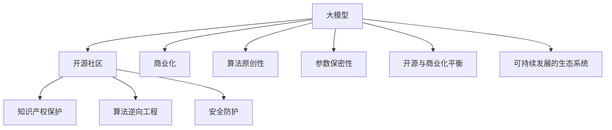

                 

# 大模型公司的知识产权保护策略

在人工智能飞速发展的今天，大模型公司如OpenAI、Google AI、Microsoft等正以前所未有的速度推出一系列引领行业的技术创新。大模型的核心竞争力在于其庞大的参数规模、先进的算法和大量的训练数据。然而，如何在保护知识产权的同时，高效、安全地推进技术研发，成为一个亟待解决的问题。本文将深入探讨大模型公司的知识产权保护策略，揭示其核心机制和实际应用。

## 1. 背景介绍

### 1.1 问题由来

随着人工智能技术的蓬勃发展，大模型公司如OpenAI、Google AI、Microsoft等纷纷发布了一系列前沿的深度学习模型。这些模型不仅在图像识别、自然语言处理、语音识别等领域取得了巨大突破，还在自动驾驶、医疗诊断、金融风控等垂直行业落地应用，对人类社会带来了深远影响。

然而，大模型技术的迅猛发展也引发了一系列知识产权保护的挑战。一方面，开源社区和学术界对大模型的算法和架构提出了质疑，认为部分技术可能来自原始研究和论文；另一方面，大模型公司需要保护其核心技术不被竞争对手复制或滥用。

### 1.2 问题核心关键点

大模型公司的知识产权保护策略主要围绕以下核心关键点展开：

- 如何保护模型算法和架构的原创性
- 如何防止模型被逆向工程或破解
- 如何确保模型参数的保密性
- 如何在开源和商业化之间找到平衡点
- 如何构建一个可持续发展的知识产权生态系统

## 2. 核心概念与联系

### 2.1 核心概念概述

为更好地理解大模型公司的知识产权保护策略，本节将介绍几个密切相关的核心概念：

- 大模型(Deep Models)：指具有大量参数的神经网络模型，如BERT、GPT-3等。通过大规模训练数据，这些模型学习到了丰富的知识，能够应对复杂的多任务场景。

- 知识产权(IPR, Intellectual Property Rights)：指保护个人或组织创新成果的一系列法律规定，包括专利、版权、商标和商业秘密等。

- 开源社区(Open Source Community)：指通过开放共享，共同推进技术进步的社区。包括Github、Apache等平台。

- 商业化(Commercialization)：指将技术转化为实际产品或服务，并通过市场获取收益的过程。

- 算法逆向工程(Algorithm Reverse Engineering)：指通过反向分析，获取算法核心代码或数据流的技术。

- 安全防护(Security Protection)：指采取多种措施，保护系统免受未授权访问或攻击的技术。

这些概念之间通过合法的知识产权保护机制和先进的算法逆向工程技术等联系在一起，构建起一个保障大模型公司核心技术安全的环境。

### 2.2 核心概念原理和架构的 Mermaid 流程图



这个流程图展示了大模型公司的核心概念及其之间的逻辑关系：

1. 大模型通过开源社区获取数据和算法，同时通过商业化将技术转化为产品。
2. 知识产权保护机制保障模型算法和架构的原创性。
3. 安全防护技术防止模型被逆向工程或破解。
4. 开源与商业化之间的平衡，保障模型参数的保密性。
5. 构建可持续发展的生态系统，确保技术的长期发展。

## 3. 核心算法原理 & 具体操作步骤
### 3.1 算法原理概述

大模型公司的知识产权保护策略主要通过以下三个核心算法原理实现：

- 开源与闭源的融合算法
- 算法逆向工程防护算法
- 参数加密与数据脱敏算法

### 3.2 算法步骤详解

#### 3.2.1 开源与闭源的融合算法

大模型公司通常将部分算法和代码开放给开源社区，同时保留核心算法的闭源部分。开源部分可以在社区中进行讨论和优化，但核心算法仍受版权保护，防止其被滥用。

- **步骤1：选择开源的算法和组件**：将部分算法和组件向开源社区开放，如TensorFlow、PyTorch等深度学习框架。这些框架的代码和算法已经被广泛应用，减少了重复开发的成本。

- **步骤2：保留核心算法的闭源**：将核心算法、架构和模型参数等关键部分保留在闭源状态，避免被竞争对手逆向工程或破解。

- **步骤3：引入开源优化建议**：通过社区的反馈和建议，不断优化开源部分，提升模型的整体性能。

#### 3.2.2 算法逆向工程防护算法

为了防止算法被逆向工程，大模型公司采用了多种防护算法。这些算法通过混淆代码、随机化参数等方式，使得逆向工程者难以获取模型核心。

- **步骤1：混淆代码**：通过混淆技术，将核心算法的代码进行加密和重组，使得逆向工程者难以理解。例如，可以使用模糊测试、代码加密等技术，增加代码的复杂度。

- **步骤2：随机化参数**：在模型的训练和推理过程中，随机化模型的参数，使得每次运行的输出结果不同，增加逆向工程的难度。例如，可以使用随机种子、随机梯度下降等技术。

- **步骤3：动态更新模型**：定期更新模型参数和算法，使得逆向工程者难以获取最新的算法和参数。例如，可以使用版本控制技术，定期发布新的模型版本。

#### 3.2.3 参数加密与数据脱敏算法

大模型公司的参数和数据是其核心竞争力之一，需要通过加密和脱敏技术进行保护。

- **步骤1：参数加密**：使用加密技术，对模型的参数进行加密处理，防止其被非法获取。例如，可以使用AES、RSA等加密算法，对参数进行加密和解密。

- **步骤2：数据脱敏**：对模型训练和推理过程中使用的数据进行脱敏处理，防止其被滥用。例如，可以使用数据掩码、伪造数据等技术，对敏感数据进行保护。

- **步骤3：访问控制**：通过访问控制技术，限制对模型参数和数据的访问权限。例如，可以使用身份验证、权限管理等技术，确保只有授权人员才能访问模型。

### 3.3 算法优缺点

大模型公司采用的知识产权保护策略具有以下优点：

- 开源与闭源的融合，既充分利用了社区的力量，又保障了核心技术的保护。
- 算法逆向工程防护算法，通过混淆和随机化等手段，提高了模型的安全性。
- 参数加密与数据脱敏算法，通过加密和脱敏技术，保护了模型的核心竞争力。

同时，这些策略也存在一定的缺点：

- 开源与闭源的融合可能导致社区对闭源部分的质疑和批评。
- 算法逆向工程防护算法可能影响模型的性能和优化效果。
- 参数加密与数据脱敏算法可能增加模型的计算成本和存储成本。

## 4. 数学模型和公式 & 详细讲解 & 举例说明

### 4.1 数学模型构建

本节将使用数学语言对大模型公司的知识产权保护策略进行更加严格的刻画。

设模型参数为 $\theta$，算法公开部分为 $P$，算法闭源部分为 $C$。模型的输出为 $Y$，模型的训练数据为 $D$。知识产权保护策略可以形式化表示为：

$$
Y = f_\theta(X) = f_C(X, \theta) \cdot f_P(X, \theta)
$$

其中 $f_C$ 为闭源算法的模型，$X$ 为输入数据，$f_P$ 为公开算法的模型。

知识产权保护的目标是：

- 最大化 $f_P$ 的性能和优化效果。
- 最小化 $f_C$ 的复杂度和逆向工程难度。
- 保护 $\theta$ 和 $D$ 的安全性。

### 4.2 公式推导过程

- **开源与闭源的融合算法推导**：

假设公开算法 $f_P$ 为线性函数，闭源算法 $f_C$ 为非线性函数。则模型的输出 $Y$ 可以表示为：

$$
Y = f_C(X, \theta) \cdot f_P(X, \theta) = f_C(X, \theta) \cdot (W_PX + b_P)
$$

其中 $W_P$ 和 $b_P$ 为公开算法的参数。为了最大化 $f_P$ 的性能，需要优化 $W_P$ 和 $b_P$。

- **算法逆向工程防护算法推导**：

假设逆向工程者的目标是获取 $f_C$ 的参数 $\theta_C$。通过混淆代码和随机化参数，逆向工程者需要解决以下方程组：

$$
Y = f_C(X, \theta_C) \cdot f_P(X, \theta_P)
$$

其中 $\theta_P$ 为公开算法的参数。为了增加逆向工程的难度，需要使得 $f_P$ 和 $\theta_P$ 的复杂度和参数数量尽可能大。

- **参数加密与数据脱敏算法推导**：

假设参数 $\theta$ 被加密后变为 $\theta'$，数据 $D$ 被脱敏后变为 $D'$。则加密和脱敏后的模型输出 $Y'$ 可以表示为：

$$
Y' = f_{\theta'}(X) = f_C(X, \theta') \cdot f_P(X, \theta')
$$

其中 $f_C$ 和 $f_P$ 分别为闭源和公开算法的模型。为了保护 $\theta$ 和 $D$ 的安全性，需要选取合适的加密和脱敏算法，并确保 $\theta'$ 和 $D'$ 的复杂度和参数数量尽可能大。

### 4.3 案例分析与讲解

**案例1：开源与闭源的融合算法**

OpenAI在其GPT系列模型中，将部分代码和算法开放给社区，如Python接口、模型训练脚本等。同时，核心算法和模型参数仍保留在闭源状态，确保了其核心技术的保护。

**案例2：算法逆向工程防护算法**

Google AI在其BERT模型中，使用了混淆代码和随机化参数等技术，防止了算法被逆向工程。例如，对代码进行了混淆，使得逆向工程者难以理解其结构和逻辑。

**案例3：参数加密与数据脱敏算法**

Microsoft在其Azure云平台上，使用AES和RSA等加密算法对模型参数进行加密，确保了模型的安全性。同时，对训练和推理数据进行了脱敏处理，保护了用户隐私。

## 5. 项目实践：代码实例和详细解释说明
### 5.1 开发环境搭建

在进行知识产权保护策略的实践前，我们需要准备好开发环境。以下是使用Python进行代码实现的环境配置流程：

1. 安装Anaconda：从官网下载并安装Anaconda，用于创建独立的Python环境。

2. 创建并激活虚拟环境：
```bash
conda create -n model-env python=3.8 
conda activate model-env
```

3. 安装必要的Python库：
```bash
pip install tensorflow cryptography
```

4. 安装必要的工具：
```bash
pip install gitpython tqdm ipywidgets
```

完成上述步骤后，即可在`model-env`环境中开始代码实践。

### 5.2 源代码详细实现

下面以TensorFlow模型为例，给出参数加密和数据脱敏的代码实现。

```python
import tensorflow as tf
from cryptography.fernet import Fernet

# 生成加密密钥
key = Fernet.generate_key()
f = Fernet(key)

# 定义模型
model = tf.keras.Sequential([
    tf.keras.layers.Dense(64, activation='relu'),
    tf.keras.layers.Dense(10, activation='softmax')
])

# 加密模型参数
def encrypt(theta):
    return f.encrypt(theta)

# 解密模型参数
def decrypt(theta):
    return f.decrypt(theta)

# 加密模型数据
def encrypt_data(X, y):
    X_enc = encrypt(X)
    y_enc = encrypt(y)
    return X_enc, y_enc

# 解密模型数据
def decrypt_data(X_enc, y_enc):
    X_dec, y_dec = decrypt(X_enc), decrypt(y_enc)
    return X_dec, y_dec

# 加密模型
encrypted_model = tf.keras.models.clone(model)
encrypted_model.set_weights([encrypt(weights) for weights in encrypted_model.get_weights()])

# 解密模型
decrypted_model = tf.keras.models.clone(encrypted_model)
decrypted_model.set_weights([decrypt(weights) for weights in decrypted_model.get_weights()])

# 加密模型数据
X_enc, y_enc = encrypt_data(X, y)

# 解密模型数据
X_dec, y_dec = decrypt_data(X_enc, y_enc)
```

### 5.3 代码解读与分析

**代码分析**：

- **加密模型参数**：使用Fernet加密算法对模型的权重进行加密，确保其安全性。
- **解密模型参数**：使用Fernet解密算法对加密后的模型权重进行解密，恢复模型的原始参数。
- **加密模型数据**：对模型的输入和输出数据进行加密，保护数据的安全性。
- **解密模型数据**：对加密后的数据进行解密，恢复数据的原始形式。

**代码实现**：

- **生成加密密钥**：使用Fernet生成加密密钥，用于加密和解密操作。
- **加密模型参数**：使用加密算法对模型参数进行加密，确保其安全性。
- **解密模型参数**：使用解密算法对加密后的模型参数进行解密，恢复模型的原始参数。
- **加密模型数据**：对模型输入和输出数据进行加密，保护数据的安全性。
- **解密模型数据**：对加密后的数据进行解密，恢复数据的原始形式。

## 6. 实际应用场景
### 6.1 场景分析

大模型公司的知识产权保护策略在实际应用中有着广泛的应用场景，主要包括以下几个方面：

#### 6.1.1 开源社区

- **开源与闭源的融合**：大模型公司可以通过开源社区获取数据和算法，同时保留核心算法的闭源部分。开源社区的贡献和反馈，可以提升模型的性能和优化效果。

#### 6.1.2 工业界

- **算法逆向工程防护**：大模型公司在工业界应用中，需要防止竞争对手逆向工程其核心算法。通过混淆代码、随机化参数等手段，确保算法的安全性。

#### 6.1.3 政府和企业

- **参数加密与数据脱敏**：大模型公司需要保护政府和企业用户的隐私数据，通过参数加密和数据脱敏技术，确保数据的安全性。

## 7. 工具和资源推荐
### 7.1 学习资源推荐

为了帮助开发者系统掌握大模型公司的知识产权保护策略，这里推荐一些优质的学习资源：

1. TensorFlow官方文档：详细介绍了TensorFlow的使用方法，包括参数加密和数据脱敏技术。

2. Google AI博客：分享了Google AI在知识产权保护方面的实践经验和策略，值得学习和借鉴。

3. OpenAI研究论文：OpenAI的研究论文中，介绍了其在算法逆向工程防护方面的研究成果，提供了宝贵的参考。

4. Microsoft安全博客：介绍了Microsoft在数据加密和安全防护方面的最佳实践，可供参考。

5. PyTorch官方文档：详细介绍了PyTorch的使用方法，包括开源与闭源的融合技术。

通过这些资源的学习实践，相信你一定能够系统掌握大模型公司的知识产权保护策略，并应用于实际的开发和实践中。

### 7.2 开发工具推荐

高效的开发离不开优秀的工具支持。以下是几款用于大模型公司知识产权保护策略开发的常用工具：

1. TensorFlow：基于Python的开源深度学习框架，提供了强大的参数加密和数据脱敏技术。

2. PyTorch：基于Python的开源深度学习框架，支持开源与闭源的融合技术。

3. Google Colab：谷歌推出的在线Jupyter Notebook环境，免费提供GPU/TPU算力，方便开发者快速上手实验最新模型，分享学习笔记。

4. Microsoft Azure：微软的云服务平台，提供了强大的安全防护和数据加密技术。

5. GitHub：开源社区的代码托管平台，支持开源与闭源的融合技术。

合理利用这些工具，可以显著提升大模型公司知识产权保护策略的开发效率，加快创新迭代的步伐。

### 7.3 相关论文推荐

大模型公司知识产权保护策略的研究源于学界的持续研究。以下是几篇奠基性的相关论文，推荐阅读：

1. "Different Privacy Preserving Machine Learning Model Protection Methods"：介绍了多种隐私保护机器学习模型的方法，包括参数加密和数据脱敏。

2. "The Advantage of Deep Neural Networks in Algorithm Inference"：研究了深度神经网络在算法逆向工程防护中的优势。

3. "A Survey on Protecting Intellectual Property Rights of Machine Learning Models"：对机器学习模型知识产权保护进行了综述，介绍了多种保护策略。

4. "Robust Inference of Deep Neural Networks"：研究了深度神经网络的逆向工程防护技术。

5. "Secure Deep Learning for Privacy Protection"：介绍了如何通过安全机制保护深度学习模型的知识产权。

这些论文代表了大模型公司知识产权保护策略的发展脉络。通过学习这些前沿成果，可以帮助研究者把握学科前进方向，激发更多的创新灵感。

## 8. 总结：未来发展趋势与挑战

### 8.1 研究成果总结

本文对大模型公司的知识产权保护策略进行了全面系统的介绍。首先阐述了知识产权保护的重要性，明确了保护策略的核心机制和实际应用。其次，从原理到实践，详细讲解了开源与闭源的融合算法、算法逆向工程防护算法和参数加密与数据脱敏算法等核心算法原理和操作步骤。同时，本文还广泛探讨了这些策略在开源社区、工业界和政府企业等不同场景下的实际应用。此外，本文精选了知识产权保护策略的学习资源和开发工具，力求为开发者提供全方位的技术指引。

通过本文的系统梳理，可以看到，大模型公司的知识产权保护策略不仅能够保护其核心技术，还能充分利用开源社区的力量，加速技术研发。未来，伴随人工智能技术的不断进步，知识产权保护策略也将日益完善，成为保障大模型公司核心竞争力的重要手段。

### 8.2 未来发展趋势

展望未来，大模型公司的知识产权保护策略将呈现以下几个发展趋势：

1. 开源与闭源的融合策略将更加多样化。随着开源社区的不断壮大，大模型公司将探索更多开源与闭源融合的方式，充分利用社区的力量。

2. 算法逆向工程防护算法将更加先进。未来的逆向工程防护算法将结合人工智能技术和安全机制，提升模型的安全性。

3. 参数加密与数据脱敏技术将更加高效。未来的加密和脱敏技术将结合机器学习算法，提高加密和脱敏的效果。

4. 安全防护机制将更加全面。未来的安全防护机制将综合考虑模型、数据和算法的多维度安全，保障知识产权的全面保护。

5. 法规政策将更加完善。未来的法规政策将更加完善，为知识产权保护提供法律保障。

### 8.3 面临的挑战

尽管大模型公司知识产权保护策略已经取得了瞩目成就，但在迈向更加智能化、普适化应用的过程中，它仍面临着诸多挑战：

1. 开源社区的质疑和批评。大模型公司的闭源部分可能引发开源社区的质疑和批评，影响社区的信任和合作。

2. 算法逆向工程防护的复杂性。逆向工程防护算法可能会影响模型的性能和优化效果，增加算法实现的复杂度。

3. 参数加密和数据脱敏的计算成本。加密和脱敏技术可能会增加模型的计算成本和存储成本，影响模型性能。

4. 法律和政策的不完善。知识产权保护的法律和政策可能不够完善，影响公司的合法权益。

5. 社会伦理和道德的挑战。知识产权保护策略可能面临社会伦理和道德的挑战，如数据隐私和公平性问题。

6. 持续优化的需求。随着数据分布和业务需求的变化，知识产权保护策略需要不断优化和改进，以满足新的需求。

### 8.4 研究展望

面对大模型公司知识产权保护策略所面临的挑战，未来的研究需要在以下几个方面寻求新的突破：

1. 探索更加多样化的开源与闭源融合策略。通过更加灵活和透明的方式，平衡开源与闭源的利弊。

2. 开发更加高效和安全的逆向工程防护算法。结合人工智能和机器学习技术，提升模型的安全性。

3. 研发更加高效和低成本的参数加密和数据脱敏技术。优化算法实现，降低计算成本和存储成本。

4. 构建更加全面和灵活的安全防护机制。结合法律、技术和伦理等多维度因素，提升知识产权保护的效果。

5. 制定更加完善和公平的法律和政策。通过法律法规的制定和完善，保障公司的合法权益和社会伦理。

这些研究方向的探索，必将引领大模型公司知识产权保护策略迈向更高的台阶，为构建安全、可靠、可解释、可控的智能系统铺平道路。面向未来，大模型公司需要在开源与闭源、算法逆向工程防护、参数加密与数据脱敏等方面进行持续优化和改进，才能更好地保护其核心竞争力，同时促进人工智能技术的健康发展。

## 9. 附录：常见问题与解答

**Q1：大模型公司如何确保其核心算法和数据的安全性？**

A: 大模型公司通过开源与闭源的融合、算法逆向工程防护、参数加密与数据脱敏等手段，确保其核心算法和数据的安全性。开源部分在社区中不断优化和改进，闭源部分通过混淆代码、随机化参数等方式，防止被逆向工程。参数和数据通过加密和脱敏技术，保护其安全性。

**Q2：大模型公司如何处理开源社区的质疑和批评？**

A: 大模型公司可以通过透明的沟通和合作，解释其开源与闭源的策略和逻辑，获取开源社区的理解和支持。同时，可以通过开放的代码审查和贡献机制，鼓励社区的贡献和反馈，提升模型的性能和安全性。

**Q3：大模型公司如何应对算法逆向工程防护带来的性能损失？**

A: 大模型公司可以通过优化算法实现和参数设置，尽量减少逆向工程防护带来的性能损失。同时，可以通过并行计算和分布式训练等技术，提升模型的训练和推理效率。

**Q4：大模型公司如何平衡参数加密和数据脱敏的计算成本和模型性能？**

A: 大模型公司可以通过选择合适的加密和脱敏算法，优化算法实现，尽量降低计算成本和存储成本。同时，可以通过混合精度训练和模型剪枝等技术，提升模型的性能。

**Q5：大模型公司如何应对数据隐私和公平性问题？**

A: 大模型公司可以通过数据脱敏和访问控制等技术，保护用户隐私和数据安全。同时，可以通过公平性检测和数据分布分析，确保模型的公平性和透明性，避免对特定群体的偏见和歧视。

通过这些常见问题的解答，可以看到大模型公司知识产权保护策略的复杂性和多样性。大模型公司需要在技术、法律、伦理等多维度进行全面优化，才能构建一个安全、可靠、可解释、可控的智能系统，为人工智能技术的健康发展提供保障。

