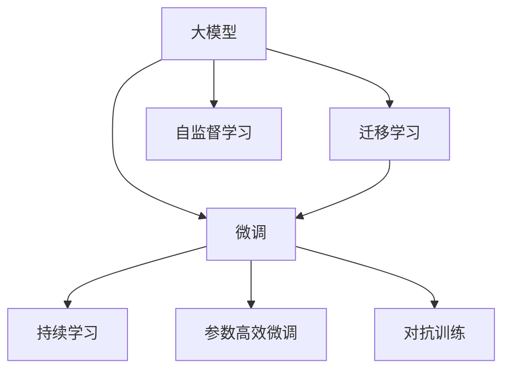

                 

## 1. 背景介绍

### 1.1 问题由来
近年来，随着深度学习技术的快速迭代和应用场景的日益丰富，大模型创业如雨后春笋般涌现，成为人工智能领域最炙手可热的风向标。从自然语言处理(NLP)到计算机视觉(CV)，从语音识别(Speech)到机器人控制(Robotics)，大模型正以前所未有的速度改变着各行业的技术格局。然而，在大模型创业的浪潮中，技术创新的热情与市场竞争的复杂性并存，如何在保持技术创新的同时，确保业务的稳健发展，成为所有创业者和投资者的共同课题。

### 1.2 问题核心关键点
大模型创业的核心关键点在于以下几个方面：
- **技术创新**：能否开发出具有前瞻性和突破性的深度学习模型，引领行业发展趋势。
- **业务落地**：能否将大模型技术转化为可规模化部署的商业产品或服务，并满足实际需求。
- **市场扩展**：能否快速抢占市场份额，形成竞争优势，并不断拓展业务边界。
- **盈利模式**：能否设计出可持续的商业模式，实现商业可持续性。

本文将围绕技术创新、业务落地、市场扩展和盈利模式四个核心点，深入探讨大模型创业的战略方向与挑战，助力更多创业者和投资人在大模型领域取得成功。

## 2. 核心概念与联系

### 2.1 核心概念概述

为更好地理解大模型创业的复杂性，本节将介绍几个核心概念及其相互关系：

- **大模型**：基于大规模数据和先进算法构建的深度学习模型，如BERT、GPT-3等。其特点在于参数量巨大，能够处理复杂非结构化数据，具有强大的表示能力和泛化能力。
- **微调**：在大模型基础上，利用少量标注数据进行有监督学习，优化模型在特定任务上的性能。微调是提升模型效果的重要手段，也是大模型应用的关键步骤。
- **迁移学习**：将一个领域学习到的知识迁移到另一个相关领域，在大模型微调中尤为重要。通过迁移学习，可以减少标注样本需求，提高模型泛化能力。
- **持续学习**：指模型能够持续从新数据中学习，保持知识更新。这对于大模型保持时效性和适应性至关重要。
- **参数高效微调**：在不增加模型参数量的情况下，优化模型性能，避免资源浪费。
- **对抗训练**：通过引入对抗样本，增强模型鲁棒性，防止过拟合。
- **自监督学习**：利用未标注数据进行模型训练，提升模型的泛化能力和自适应能力。

这些概念之间的逻辑关系可以通过以下Mermaid流程图来展示：



这个流程图展示了大模型创业的关键概念及其之间的关系：

1. 大模型通过大规模数据和先进算法进行预训练，获得丰富的语言和视觉表示。
2. 微调在大模型基础上进行特定任务的优化，提升模型性能。
3. 迁移学习利用已有知识减少标注样本需求，提高模型泛化能力。
4. 持续学习使模型能够不断吸收新知识，保持性能与时俱进。
5. 参数高效微调在不增加参数的情况下提升模型性能，避免资源浪费。
6. 对抗训练增强模型鲁棒性，防止过拟合。
7. 自监督学习利用未标注数据进行训练，提升模型泛化能力。

这些概念共同构成了大模型创业的理论基础，为大模型创业的实践提供了方向性指导。

## 3. 核心算法原理 & 具体操作步骤
### 3.1 算法原理概述

大模型创业的核心算法原理主要围绕以下几个方面展开：

- **模型设计**：如何设计高效、可扩展的模型架构，以适应各种应用场景。
- **数据预处理**：如何从大规模无标签数据中提取有效信息，进行预训练和微调。
- **优化算法**：如何选择合适的优化算法和参数，以实现高效模型训练。
- **模型评估**：如何设计合理的评估指标，评估模型在不同任务上的性能。

在大模型创业过程中，模型设计、数据预处理、优化算法和模型评估是四个关键环节，缺一不可。

### 3.2 算法步骤详解

基于大模型创业的算法步骤通常包括以下几个关键步骤：

**Step 1: 数据准备**
- 收集并处理大规模无标签数据，进行预处理和标注。
- 选择预训练模型和微调任务，确定模型架构和参数设置。
- 划分训练集、验证集和测试集，确保模型在不同数据集上的性能评估。

**Step 2: 模型预训练**
- 利用无标签数据对模型进行预训练，学习基础的语义和视觉表示。
- 设计合适的预训练任务，如语言模型、视觉特征提取等。
- 使用大规模分布式训练框架，如TensorFlow、PyTorch等，加速模型训练。

**Step 3: 模型微调**
- 选择少量标注数据，对预训练模型进行微调，优化特定任务的性能。
- 设计合适的微调任务，如分类、生成、匹配等。
- 应用正则化技术，如L2正则、Dropout等，防止过拟合。
- 利用对抗训练等技术，增强模型鲁棒性。

**Step 4: 模型评估**
- 使用测试集评估微调后模型的性能，对比微调前后的提升效果。
- 设计多种评估指标，如准确率、F1-score、ROC-AUC等，全面评估模型效果。
- 收集用户反馈，不断迭代优化模型，提升用户体验。

### 3.3 算法优缺点

大模型创业的算法优点主要在于：
- **高效**：利用大规模无标签数据进行预训练，通过少量标注数据进行微调，训练时间短，模型效果显著。
- **泛化能力强**：基于大规模数据训练的大模型具有较强的泛化能力，适用于多种应用场景。
- **灵活性高**：模型架构可调，参数设置可变，适应不同的业务需求。

同时，大模型创业的算法也存在一些局限性：
- **数据依赖**：预训练和微调过程对标注数据有依赖，获取高质量标注数据成本较高。
- **资源消耗大**：大规模数据和模型参数训练消耗大量计算资源，成本较高。
- **技术门槛高**：模型设计、数据预处理、优化算法等环节技术复杂，需要较强的技术背景。
- **解释性差**：大模型通常是一个黑盒模型，缺乏可解释性，难以调试和优化。

尽管存在这些局限性，但大模型创业在技术创新和市场扩展方面仍然具有巨大的潜力，吸引了众多创业者和投资者的关注。

### 3.4 算法应用领域

大模型创业的算法在多个领域都有广泛的应用，包括：

- **自然语言处理(NLP)**：如文本分类、情感分析、机器翻译、对话系统等。
- **计算机视觉(CV)**：如目标检测、图像分类、人脸识别、视频分析等。
- **语音识别(Speech)**：如语音识别、语音合成、情感识别等。
- **机器人控制(Robotics)**：如机器人路径规划、动作控制、交互理解等。

此外，大模型创业还应用于医疗、金融、交通、智能制造等多个垂直领域，为各行各业带来数字化转型的契机。

## 4. 数学模型和公式 & 详细讲解 & 举例说明

### 4.1 数学模型构建

在大模型创业过程中，数学模型构建是关键的一环。这里我们将介绍几个常用的数学模型及其构建过程：

- **卷积神经网络(CNN)**：用于图像处理和计算机视觉任务。模型的核心是卷积层和池化层，通过参数共享和局部连接，提取图像的局部特征。
- **循环神经网络(RNN)**：用于序列数据的处理，如自然语言处理任务。模型的核心是循环结构，能够处理变长的序列数据。
- **Transformer**：一种自注意力机制的神经网络结构，用于自然语言处理任务。模型的核心是多头自注意力机制和位置编码，能够有效处理长序列数据。

### 4.2 公式推导过程

以Transformer为例，其自注意力机制的公式推导过程如下：

$$
\text{Attention}(Q, K, V) = \text{Softmax}\left(\frac{QK^T}{\sqrt{d_k}}\right)V
$$

其中 $Q, K, V$ 分别表示查询向量、键向量和值向量，$d_k$ 为向量的维度。该公式计算出每个查询向量的注意力权重，通过权重对值向量进行加权求和，得到最终的输出向量。

### 4.3 案例分析与讲解

下面以BERT模型为例，分析其在大模型创业中的应用：

BERT模型是一种预训练语言模型，通过在大规模语料上进行自监督学习，学习通用的语言表示。其核心在于利用掩码语言模型和下一句预测任务进行预训练，学习上下文和语义关系。在微调时，可以选择特定的NLP任务，如情感分析、命名实体识别等，通过少量标注数据进行优化，提升模型在该任务上的性能。

例如，对于情感分析任务，可以使用BERT作为预训练模型，在其基础上进行微调。微调的过程包括：
1. 收集情感标注数据，如电影评论、产品评价等。
2. 使用BERT模型进行预训练，学习通用的语言表示。
3. 对情感标注数据进行微调，优化模型在情感分类任务上的性能。
4. 在测试集上评估微调后模型的性能，对比微调前后的提升效果。

## 5. 项目实践：代码实例和详细解释说明

### 5.1 开发环境搭建

在进行大模型创业的实践前，我们需要准备好开发环境。以下是使用Python进行TensorFlow开发的环境配置流程：

1. 安装Anaconda：从官网下载并安装Anaconda，用于创建独立的Python环境。

2. 创建并激活虚拟环境：
```bash
conda create -n tf-env python=3.8 
conda activate tf-env
```

3. 安装TensorFlow：根据CUDA版本，从官网获取对应的安装命令。例如：
```bash
conda install tensorflow=2.6 -c conda-forge
```

4. 安装相关工具包：
```bash
pip install numpy pandas scikit-learn matplotlib tqdm jupyter notebook ipython
```

完成上述步骤后，即可在`tf-env`环境中开始大模型创业的实践。

### 5.2 源代码详细实现

这里以BERT模型为例，展示使用TensorFlow进行情感分析任务的代码实现。

首先，定义情感分析任务的数据处理函数：

```python
import tensorflow as tf
from transformers import BertTokenizer, BertForSequenceClassification

class SentimentAnalysisDataset(tf.data.Dataset):
    def __init__(self, texts, labels, tokenizer, max_len=128):
        self.texts = texts
        self.labels = labels
        self.tokenizer = tokenizer
        self.max_len = max_len
        
    def __len__(self):
        return len(self.texts)
    
    def __getitem__(self, item):
        text = self.texts[item]
        label = self.labels[item]
        
        encoding = self.tokenizer(text, return_tensors='tf', max_length=self.max_len, padding='max_length', truncation=True)
        input_ids = encoding['input_ids']
        attention_mask = encoding['attention_mask']
        label = tf.convert_to_tensor([label], dtype=tf.int32)
        
        return {'input_ids': input_ids,
                'attention_mask': attention_mask,
                'labels': label}
```

然后，定义模型和优化器：

```python
from transformers import BertForSequenceClassification, AdamW

model = BertForSequenceClassification.from_pretrained('bert-base-uncased', num_labels=2, output_attentions=False, output_hidden_states=False)

optimizer = AdamW(model.parameters(), lr=2e-5)
```

接着，定义训练和评估函数：

```python
import os
import tensorflow as tf

def train_epoch(model, dataset, batch_size, optimizer):
    dataloader = tf.data.Dataset.from_generator(lambda: dataset, output_signature={'input_ids': tf.TensorSpec(shape=(None, None), dtype=tf.int32), 'attention_mask': tf.TensorSpec(shape=(None, None), dtype=tf.int32), 'labels': tf.TensorSpec(shape=(None,), dtype=tf.int32)})
    dataloader = dataloader.batch(batch_size).shuffle(1024).repeat()
    
    model.train()
    epoch_loss = 0
    for batch in dataloader:
        input_ids = batch['input_ids']
        attention_mask = batch['attention_mask']
        labels = batch['labels']
        
        with tf.GradientTape() as tape:
            outputs = model(input_ids, attention_mask=attention_mask, labels=labels)
            loss = tf.keras.losses.SparseCategoricalCrossentropy()(labels, outputs.logits)
        
        loss = loss * attention_mask
        loss = tf.reduce_mean(loss)
        loss = tf.reshape(loss, [])
        
        gradients = tape.gradient(loss, model.trainable_variables)
        optimizer.apply_gradients(zip(gradients, model.trainable_variables))
        
        epoch_loss += loss
        
    return epoch_loss / len(dataloader)

def evaluate(model, dataset, batch_size):
    dataloader = tf.data.Dataset.from_generator(lambda: dataset, output_signature={'input_ids': tf.TensorSpec(shape=(None, None), dtype=tf.int32), 'attention_mask': tf.TensorSpec(shape=(None, None), dtype=tf.int32), 'labels': tf.TensorSpec(shape=(None,), dtype=tf.int32)})
    dataloader = dataloader.batch(batch_size).shuffle(1024).repeat()
    
    model.eval()
    preds, labels = [], []
    with tf.GradientTape() as tape:
        for batch in dataloader:
            input_ids = batch['input_ids']
            attention_mask = batch['attention_mask']
            labels = batch['labels']
            
            outputs = model(input_ids, attention_mask=attention_mask)
            batch_preds = tf.argmax(outputs.logits, axis=1)
            preds.extend(batch_preds.numpy().tolist())
            labels.extend(labels.numpy().tolist())
    
    print('Accuracy:', tf.metrics.mean(tf.cast(tf.equal(preds, labels), tf.float32)))
```

最后，启动训练流程并在测试集上评估：

```python
epochs = 5
batch_size = 16

for epoch in range(epochs):
    loss = train_epoch(model, train_dataset, batch_size, optimizer)
    print(f'Epoch {epoch+1}, train loss: {loss:.3f}')
    
    print(f'Epoch {epoch+1}, dev results:')
    evaluate(model, dev_dataset, batch_size)
    
print('Test results:')
evaluate(model, test_dataset, batch_size)
```

以上就是使用TensorFlow对BERT进行情感分析任务微调的完整代码实现。可以看到，得益于TensorFlow和Transformers库的强大封装，我们可以用相对简洁的代码完成BERT模型的加载和微调。

### 5.3 代码解读与分析

让我们再详细解读一下关键代码的实现细节：

**SentimentAnalysisDataset类**：
- `__init__`方法：初始化文本、标签、分词器等关键组件。
- `__len__`方法：返回数据集的样本数量。
- `__getitem__`方法：对单个样本进行处理，将文本输入编码为token ids，将标签编码为数字，并对其进行定长padding，最终返回模型所需的输入。

**模型和优化器**：
- 使用BertForSequenceClassification从预训练模型加载模型，并设置学习率和优化器。

**训练和评估函数**：
- 使用TensorFlow的DataLoader对数据集进行批次化加载，供模型训练和推理使用。
- 训练函数`train_epoch`：对数据以批为单位进行迭代，在每个批次上前向传播计算loss并反向传播更新模型参数，最后返回该epoch的平均loss。
- 评估函数`evaluate`：与训练类似，不同点在于不更新模型参数，并在每个batch结束后将预测和标签结果存储下来，最后使用TensorFlow的mean函数对整个评估集的预测结果进行打印输出。

**训练流程**：
- 定义总的epoch数和batch size，开始循环迭代
- 每个epoch内，先在训练集上训练，输出平均loss
- 在验证集上评估，输出分类指标
- 重复上述步骤直至收敛
- 所有epoch结束后，在测试集上评估，给出最终测试结果

可以看到，TensorFlow配合Transformers库使得BERT微调的代码实现变得简洁高效。开发者可以将更多精力放在数据处理、模型改进等高层逻辑上，而不必过多关注底层的实现细节。

## 6. 实际应用场景

### 6.1 智能客服系统

基于大模型创业的对话技术，可以广泛应用于智能客服系统的构建。传统客服往往需要配备大量人力，高峰期响应缓慢，且一致性和专业性难以保证。而使用大模型创业的对话模型，可以7x24小时不间断服务，快速响应客户咨询，用自然流畅的语言解答各类常见问题。

在技术实现上，可以收集企业内部的历史客服对话记录，将问题和最佳答复构建成监督数据，在此基础上对大模型进行微调。微调后的对话模型能够自动理解用户意图，匹配最合适的答案模板进行回复。对于客户提出的新问题，还可以接入检索系统实时搜索相关内容，动态组织生成回答。如此构建的智能客服系统，能大幅提升客户咨询体验和问题解决效率。

### 6.2 金融舆情监测

金融机构需要实时监测市场舆论动向，以便及时应对负面信息传播，规避金融风险。传统的人工监测方式成本高、效率低，难以应对网络时代海量信息爆发的挑战。基于大模型创业的文本分类和情感分析技术，为金融舆情监测提供了新的解决方案。

具体而言，可以收集金融领域相关的新闻、报道、评论等文本数据，并对其进行主题标注和情感标注。在此基础上对大模型进行微调，使其能够自动判断文本属于何种主题，情感倾向是正面、中性还是负面。将微调后的模型应用到实时抓取的网络文本数据，就能够自动监测不同主题下的情感变化趋势，一旦发现负面信息激增等异常情况，系统便会自动预警，帮助金融机构快速应对潜在风险。

### 6.3 个性化推荐系统

当前的推荐系统往往只依赖用户的历史行为数据进行物品推荐，无法深入理解用户的真实兴趣偏好。基于大模型创业的推荐系统，可以更好地挖掘用户行为背后的语义信息，从而提供更精准、多样的推荐内容。

在实践中，可以收集用户浏览、点击、评论、分享等行为数据，提取和用户交互的物品标题、描述、标签等文本内容。将文本内容作为模型输入，用户的后续行为（如是否点击、购买等）作为监督信号，在此基础上微调预训练语言模型。微调后的模型能够从文本内容中准确把握用户的兴趣点。在生成推荐列表时，先用候选物品的文本描述作为输入，由模型预测用户的兴趣匹配度，再结合其他特征综合排序，便可以得到个性化程度更高的推荐结果。

### 6.4 未来应用展望

随着大模型创业和微调方法的不断发展，基于微调范式将在更多领域得到应用，为传统行业带来变革性影响。

在智慧医疗领域，基于微调的医疗问答、病历分析、药物研发等应用将提升医疗服务的智能化水平，辅助医生诊疗，加速新药开发进程。

在智能教育领域，微调技术可应用于作业批改、学情分析、知识推荐等方面，因材施教，促进教育公平，提高教学质量。

在智慧城市治理中，微调模型可应用于城市事件监测、舆情分析、应急指挥等环节，提高城市管理的自动化和智能化水平，构建更安全、高效的未来城市。

此外，在企业生产、社会治理、文娱传媒等众多领域，基于大模型创业的人工智能应用也将不断涌现，为NLP技术带来全新的突破。相信随着预训练语言模型和微调方法的持续演进，大模型创业必将在更广阔的应用领域大放异彩，深刻影响人类的生产生活方式。

## 7. 工具和资源推荐

### 7.1 学习资源推荐

为了帮助开发者系统掌握大模型创业的理论基础和实践技巧，这里推荐一些优质的学习资源：

1. 《深度学习》系列书籍：涵盖深度学习的基本概念、算法和实践，是入门和进阶的好读物。
2. CS231n《计算机视觉基础》课程：斯坦福大学开设的视觉识别课程，内容全面，实践性强。
3. CS224N《自然语言处理》课程：斯坦福大学开设的NLP课程，内容深入，应用广泛。
4. Google AI Blog：谷歌AI团队发布的最新研究和技术文章，涵盖了深度学习、自然语言处理、计算机视觉等多个领域。
5. TensorFlow官方文档：TensorFlow的官方文档，详细介绍了TensorFlow的各个组件和API，是开发者不可或缺的参考。
6. Transformers官方文档：Transformers的官方文档，提供了丰富的预训练模型和微调样例代码。

通过对这些资源的学习实践，相信你一定能够快速掌握大模型创业的精髓，并用于解决实际的NLP问题。

### 7.2 开发工具推荐

高效的开发离不开优秀的工具支持。以下是几款用于大模型创业开发的常用工具：

1. TensorFlow：基于Google的深度学习框架，支持分布式训练，适合大规模工程应用。
2. PyTorch：基于Facebook的深度学习框架，灵活高效，适合快速迭代研究。
3. Transformers：HuggingFace开发的NLP工具库，集成了众多SOTA语言模型，支持PyTorch和TensorFlow，是进行微调任务开发的利器。
4. Weights & Biases：模型训练的实验跟踪工具，可以记录和可视化模型训练过程中的各项指标，方便对比和调优。
5. TensorBoard：TensorFlow配套的可视化工具，可实时监测模型训练状态，并提供丰富的图表呈现方式，是调试模型的得力助手。
6. Jupyter Notebook：免费的交互式开发环境，支持Python和多种科学计算库，适合快速原型开发。

合理利用这些工具，可以显著提升大模型创业的开发效率，加快创新迭代的步伐。

### 7.3 相关论文推荐

大模型创业的研究源于学界的持续研究。以下是几篇奠基性的相关论文，推荐阅读：

1. Attention is All You Need：提出了Transformer结构，开启了NLP领域的预训练大模型时代。
2. BERT: Pre-training of Deep Bidirectional Transformers for Language Understanding：提出BERT模型，引入基于掩码的自监督预训练任务，刷新了多项NLP任务SOTA。
3. Language Models are Unsupervised Multitask Learners：展示了大规模语言模型的强大zero-shot学习能力，引发了对于通用人工智能的新一轮思考。
4. Transformer-XL：提出了长序列Transformer模型，解决了长期依赖问题，提升了语言模型的建模能力。
5. GPT-3：展示了Transformer模型在预训练和微调后的强大语言生成能力，成为大模型创业的里程碑。

这些论文代表了大模型创业的发展脉络。通过学习这些前沿成果，可以帮助研究者把握学科前进方向，激发更多的创新灵感。

## 8. 总结：未来发展趋势与挑战

### 8.1 总结

本文对基于大模型创业的创新与挑战进行了全面系统的介绍。首先阐述了技术创新、业务落地、市场扩展和盈利模式四个核心点，明确了创业者和投资者在大模型创业中的关注重点。其次，从模型设计、数据预处理、优化算法和模型评估四个方面，详细讲解了大模型创业的算法步骤。最后，通过实际应用场景、学习资源、开发工具和相关论文的推荐，为大模型创业的实践提供了方向性指导。

通过本文的系统梳理，可以看到，基于大模型创业在技术创新、市场扩展和业务落地方面都具有巨大的潜力。然而，在大模型创业的过程中，也面临着标注数据需求高、计算资源消耗大、技术门槛高等诸多挑战。唯有在技术创新和业务发展中不断优化，才能在大模型创业的道路上稳步前行。

### 8.2 未来发展趋势

展望未来，大模型创业将呈现以下几个发展趋势：

1. **技术创新**：深度学习模型和算法将不断演进，引入更多创新技术，如自监督学习、自适应学习、因果学习等，提升模型的泛化能力和自我适应能力。
2. **业务落地**：大模型创业将更加注重实际应用，推动技术落地，解决实际问题。如智能客服、金融舆情监测、推荐系统等，将迎来更多创新应用。
3. **市场扩展**：随着技术成熟和成本降低，大模型创业将逐渐普及，覆盖更多垂直领域，形成广泛的市场需求。
4. **盈利模式**：将探索更多可持续的商业模式，如SaaS、API服务、定制开发等，满足不同客户的需求，实现商业可持续性。

这些趋势凸显了大模型创业的广阔前景，未来将有更多创业者和投资者的关注和投入，推动大模型创业走向成熟。

### 8.3 面临的挑战

尽管大模型创业前景广阔，但也面临着诸多挑战：

1. **数据获取困难**：大模型创业需要大量标注数据，但标注成本高、数据获取困难，制约了模型的发展。
2. **计算资源消耗大**：大模型参数量巨大，计算资源消耗大，难以快速迭代优化。
3. **技术门槛高**：深度学习模型和算法复杂，需要较强的技术背景，人才短缺。
4. **解释性差**：大模型创业中的深度学习模型通常是黑盒模型，缺乏可解释性，难以调试和优化。
5. **伦理和安全性问题**：大模型创业中可能存在偏见和有害信息，需要建立伦理导向的模型评估机制。

面对这些挑战，大模型创业需要在技术创新、业务落地和市场扩展中寻求平衡，不断优化和改进。

### 8.4 研究展望

面对大模型创业的诸多挑战，未来的研究需要在以下几个方面寻求新的突破：

1. **数据高效获取**：探索无监督和半监督学习技术，减少对标注数据的依赖，利用大规模非结构化数据进行训练。
2. **计算资源优化**：研究模型压缩、剪枝、量化等技术，提升模型计算效率，降低计算成本。
3. **技术门槛降低**：开发简单易用的工具和框架，降低技术门槛，推动更多开发者参与大模型创业。
4. **模型可解释性**：引入可解释性技术，如Attention可视化、模型蒸馏等，增强模型的可解释性。
5. **伦理和安全**：建立伦理导向的模型评估机制，避免偏见和有害信息，确保模型输出的安全性。

这些研究方向将引领大模型创业技术迈向更高的台阶，为构建安全、可靠、可解释、可控的智能系统铺平道路。面向未来，大模型创业需要与更多领域的深度融合，推动人工智能技术在更多垂直行业的落地应用。

## 9. 附录：常见问题与解答

**Q1：大模型创业的竞争优势体现在哪里？**

A: 大模型创业的竞争优势主要体现在以下几个方面：
1. **技术先进性**：利用先进的大模型架构和技术，如Transformer、BERT等，提升模型的精度和泛化能力。
2. **计算资源优势**：借助分布式训练和云计算资源，快速迭代模型，缩短开发周期。
3. **数据驱动**：利用大规模无标签数据进行预训练，提升模型的泛化能力。
4. **多样应用场景**：大模型创业适用于多种应用场景，如智能客服、金融舆情监测、推荐系统等，具有更强的市场适应性。

**Q2：大模型创业的技术难点有哪些？**

A: 大模型创业的技术难点主要在于以下几个方面：
1. **数据标注成本高**：大模型创业需要大量标注数据，但标注成本高，获取困难。
2. **计算资源消耗大**：大模型参数量巨大，计算资源消耗大，难以快速迭代优化。
3. **模型解释性差**：大模型通常是黑盒模型，缺乏可解释性，难以调试和优化。
4. **伦理和安全问题**：大模型创业中可能存在偏见和有害信息，需要建立伦理导向的模型评估机制。

**Q3：大模型创业的盈利模式有哪些？**

A: 大模型创业的盈利模式主要有以下几个方面：
1. **SaaS服务**：将大模型封装为SaaS服务，提供API接口，供第三方开发者使用。
2. **定制开发**：为企业提供定制化的模型开发和应用部署服务。
3. **软件即服务(SaaS)**：将大模型嵌入到企业内部的应用系统中，提升业务效率。
4. **数据服务**：提供数据标注、数据增强等数据服务，帮助企业提升模型效果。

**Q4：如何应对大模型创业中的技术挑战？**

A: 应对大模型创业中的技术挑战，主要可以从以下几个方面入手：
1. **数据高效获取**：探索无监督和半监督学习技术，减少对标注数据的依赖，利用大规模非结构化数据进行训练。
2. **计算资源优化**：研究模型压缩、剪枝、量化等技术，提升模型计算效率，降低计算成本。
3. **技术门槛降低**：开发简单易用的工具和框架，降低技术门槛，推动更多开发者参与大模型创业。
4. **模型可解释性**：引入可解释性技术，如Attention可视化、模型蒸馏等，增强模型的可解释性。
5. **伦理和安全**：建立伦理导向的模型评估机制，避免偏见和有害信息，确保模型输出的安全性。

**Q5：大模型创业的未来发展方向是什么？**

A: 大模型创业的未来发展方向主要在于以下几个方面：
1. **技术创新**：引入更多创新技术，如自监督学习、自适应学习、因果学习等，提升模型的泛化能力和自我适应能力。
2. **业务落地**：推动技术落地，解决实际问题，如智能客服、金融舆情监测、推荐系统等，将迎来更多创新应用。
3. **市场扩展**：随着技术成熟和成本降低，大模型创业将逐渐普及，覆盖更多垂直领域，形成广泛的市场需求。
4. **盈利模式创新**：探索更多可持续的商业模式，如SaaS、API服务、定制开发等，满足不同客户的需求，实现商业可持续性。

这些研究方向将引领大模型创业技术迈向更高的台阶，为构建安全、可靠、可解释、可控的智能系统铺平道路。

---

作者：禅与计算机程序设计艺术 / Zen and the Art of Computer Programming

