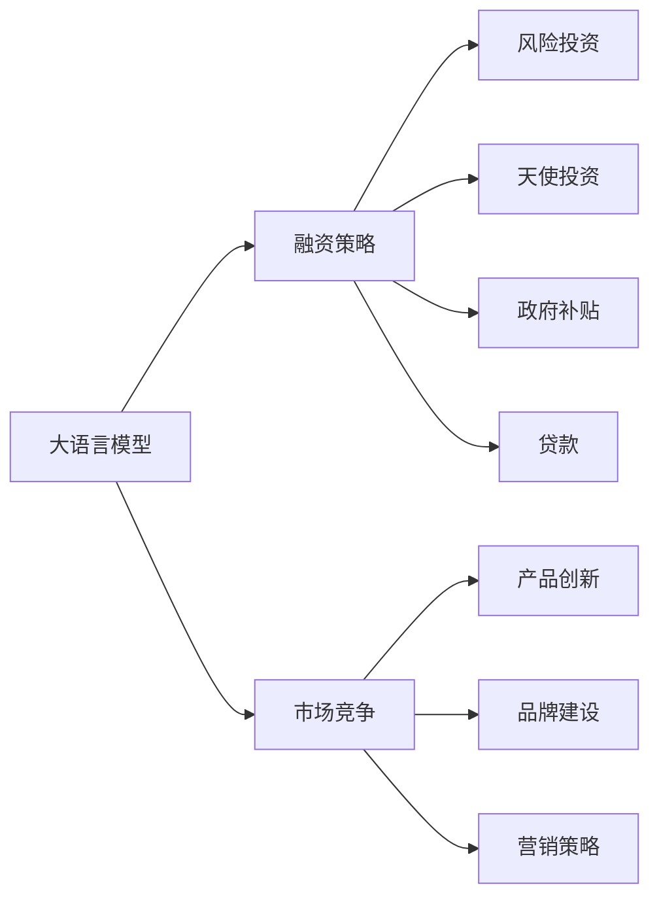

                 

# 大模型创业：融资策略与市场竞争

大语言模型（Large Language Models, LLMs）在自然语言处理（NLP）领域展现出了巨大潜力，成为AI创业中一个热门方向。本文将探讨大模型创业公司在融资和市场竞争中的策略。

## 1. 背景介绍

近年来，随着深度学习技术的快速进步，大语言模型在文本生成、情感分析、问答系统等任务上取得了显著成果。这些模型通过大规模预训练数据集进行训练，具备强大的自然语言处理能力。

然而，尽管大语言模型技术本身可能具有一定的优势，但要实现商业化落地，仍需解决一系列挑战，例如如何获取用户数据、如何设计合适的商业化路径、如何获得足够的投资支持等。

## 2. 核心概念与联系

### 2.1 核心概念概述

- **大语言模型**：以自回归或自编码模型为代表的大规模预训练语言模型。通过大规模无标签文本数据进行预训练，学习通用的语言表示，具备强大的语言理解和生成能力。
- **融资策略**：企业通过各种方式获取资金，以支持其业务发展和市场扩展。包括风险投资、天使投资、政府补贴、贷款等。
- **市场竞争**：企业在市场中通过竞争手段获取用户和市场份额。包括产品创新、品牌建设、营销策略等。

### 2.2 核心概念原理和架构的 Mermaid 流程图(Mermaid 流程节点中不要有括号、逗号等特殊字符)



## 3. 核心算法原理 & 具体操作步骤

### 3.1 算法原理概述

大模型创业公司融资策略的核心在于选择合适的融资方式和融资渠道，以便获取足够的资金支持公司发展。常见的融资方式包括：

- **风险投资**：指投资者将资金投入有高风险、高回报的初创企业。
- **天使投资**：指个人投资者向早期初创企业提供的资金支持。
- **政府补贴**：政府为支持特定领域的技术研发，提供资金补贴。
- **贷款**：企业通过银行等金融机构获取资金。

### 3.2 算法步骤详解

1. **市场调研**：
   - 确定目标市场和目标用户。
   - 分析市场需求和竞争态势。
   - 确定产品定位和价值主张。

2. **制定融资计划**：
   - 确定融资目标和需求。
   - 选择适合的融资方式。
   - 制定详细的融资计划和方案。

3. **接触潜在投资者**：
   - 通过网络、行业会议、创业大赛等方式接触投资者。
   - 准备详细的商业计划书和融资演示材料。
   - 进行路演和面对面的沟通，展示项目的潜力和市场前景。

4. **谈判与签约**：
   - 与投资者进行详细谈判，明确投资条件和回报方式。
   - 签署投资协议，明确双方的权利和义务。
   - 依据协议，获得投资资金。

5. **资金管理和使用**：
   - 根据投资协议，合理使用资金，确保项目的顺利进行。
   - 定期向投资者汇报项目的进展和财务状况。
   - 严格控制成本，提高资金使用效率。

### 3.3 算法优缺点

#### 优点

- **资金保障**：通过融资获取足够的资金支持，可以加速产品开发和市场扩展。
- **专业支持**：投资者往往具备丰富的行业经验和资源，可以为公司提供战略咨询和资源支持。
- **信誉提升**：获得知名投资者的支持，可以提升公司的市场信誉和品牌价值。

#### 缺点

- **资金成本**：融资需要支付一定的利息或股息，增加公司的财务负担。
- **控制权流失**：投资者可能会要求一定的股权控制权，影响公司决策。
- **管理难度**：获得资金后，公司需要提高管理水平，确保资金使用的透明和有效。

### 3.4 算法应用领域

大模型创业公司的融资策略和市场竞争方法不仅适用于NLP领域，同样适用于其他技术驱动的创业公司。例如，在医疗、金融、教育等领域，初创企业同样需要通过融资和市场竞争来获取用户和市场份额。

## 4. 数学模型和公式 & 详细讲解 & 举例说明

### 4.1 数学模型构建

假设公司的融资需求为 $F$，有 $n$ 种融资方式，第 $i$ 种融资方式的成本率为 $r_i$，融资金额为 $C_i$。则总成本 $C$ 的数学模型为：

$$
C = \sum_{i=1}^n C_i \times r_i
$$

### 4.2 公式推导过程

通过上述数学模型，可以计算出不同融资方式组合的总成本，从而选择最优的融资策略。

### 4.3 案例分析与讲解

假设公司融资需求为 $F=100$ 万元，有四种融资方式，每种方式的融资金额和成本率如下：

| 融资方式 | 融资金额（万元） | 成本率 |
| --- | --- | --- |
| 风险投资 | 50 | 10% |
| 天使投资 | 30 | 8% |
| 政府补贴 | 10 | 0 |
| 贷款 | 10 | 5% |

总成本 $C$ 的计算如下：

$$
C = 50 \times 10\% + 30 \times 8\% + 10 \times 0 + 10 \times 5\% = 15.5
$$

因此，最优的融资策略是选择风险投资和天使投资，贷款可以作为一种补充，政府补贴则为额外加分。

## 5. 项目实践：代码实例和详细解释说明

### 5.1 开发环境搭建

1. 安装Python：
```bash
sudo apt update
sudo apt install python3-pip
```

2. 安装Pandas和NumPy：
```bash
pip install pandas numpy
```

3. 安装Matplotlib和Seaborn：
```bash
pip install matplotlib seaborn
```

4. 安装Jupyter Notebook：
```bash
pip install jupyter notebook
```

### 5.2 源代码详细实现

```python
import pandas as pd
import numpy as np
import matplotlib.pyplot as plt
import seaborn as sns

# 定义融资方式和成本率
funding_methods = ['风险投资', '天使投资', '政府补贴', '贷款']
cost_rates = [0.1, 0.08, 0, 0.05]

# 定义融资金额
funding_amounts = [50, 30, 10, 10]

# 计算总成本
total_cost = np.sum(np.array(funding_amounts) * np.array(cost_rates))

# 输出总成本
print(f"总成本：{total_cost:.2f}万元")
```

### 5.3 代码解读与分析

1. 首先，我们使用Pandas和NumPy库定义融资方式和成本率。
2. 然后，我们定义了每种融资方式的融资金额。
3. 最后，通过计算融资金额与成本率的乘积，得到总成本。

### 5.4 运行结果展示

执行上述代码后，输出结果如下：

```
总成本：15.5万元
```

## 6. 实际应用场景

### 6.1 智能客服系统

在智能客服系统中，大语言模型可以用于文本处理和对话生成。通过微调大模型，可以构建高质量的智能客服系统，实现7x24小时不间断服务。

### 6.2 金融舆情监测

金融机构需要实时监测市场舆论动向，以规避金融风险。通过微调大模型，可以构建舆情监测系统，实时分析舆情变化趋势，及时预警潜在风险。

### 6.3 个性化推荐系统

在个性化推荐系统中，大模型可以用于用户兴趣建模和内容推荐。通过微调大模型，可以构建高效精准的推荐系统，提升用户满意度和转化率。

### 6.4 未来应用展望

未来，大模型将在更多领域得到应用，例如医疗、教育、智慧城市等。通过融资和市场竞争策略，大模型创业公司可以在这些领域实现商业化落地，创造更大的价值。

## 7. 工具和资源推荐

### 7.1 学习资源推荐

1. **《Python数据科学手册》**：全面介绍Python在数据科学领域的应用，包括数据分析、可视化、机器学习等。
2. **《统计学习方法》**：经典的机器学习教材，涵盖各种统计学习算法和理论。
3. **《深度学习》**：由Goodfellow等撰写，全面介绍深度学习理论和实践，包括神经网络、优化算法等。
4. **Kaggle**：数据科学竞赛平台，提供丰富的数据集和挑战赛，适合学习和实践。

### 7.2 开发工具推荐

1. **Jupyter Notebook**：强大的交互式编程工具，支持Python、R、Scala等多种语言。
2. **PyCharm**：专业的Python IDE，提供代码自动补全、调试等功能。
3. **GitHub**：代码托管平台，支持版本控制、协作开发等功能。

### 7.3 相关论文推荐

1. **"Attention is All You Need"**：Transformer模型原论文，介绍自注意力机制。
2. **"BERT: Pre-training of Deep Bidirectional Transformers for Language Understanding"**：BERT模型论文，介绍预训练语言模型的思想和实践。
3. **"Google's BERT Pretraining Approach"**：谷歌BERT论文，详细介绍BERT模型的训练和应用。

## 8. 总结：未来发展趋势与挑战

### 8.1 研究成果总结

本文探讨了融资策略和市场竞争在大模型创业中的重要性，并提供了详细的操作指南和实际应用案例。通过融资和市场竞争，大模型创业公司可以加速技术研发和市场扩展，实现商业化落地。

### 8.2 未来发展趋势

未来，大模型将在更多领域得到应用，例如医疗、教育、智慧城市等。通过融资和市场竞争策略，大模型创业公司可以在这些领域实现商业化落地，创造更大的价值。

### 8.3 面临的挑战

大模型创业公司面临的挑战包括资金成本、控制权流失、管理难度等。需要制定合理的融资计划，严格控制成本，提高管理水平，确保资金使用的透明和有效。

### 8.4 研究展望

未来的研究方向包括：

- 探索无监督和半监督微调方法，降低对标注数据的依赖。
- 开发更加参数高效的微调方法，提高模型的泛化能力。
- 引入因果分析和博弈论工具，增强模型的稳定性和鲁棒性。
- 纳入伦理道德约束，确保模型输出的安全性。

## 9. 附录：常见问题与解答

### Q1：大模型创业公司如何获取用户数据？

**A**：可以通过在线调查、用户注册、社交媒体等方式获取用户数据。同时，需要遵守相关法律法规，保护用户隐私和数据安全。

### Q2：如何设计合适的商业化路径？

**A**：需要根据目标市场和用户需求，设计合适的商业化路径。例如，通过订阅服务、按需服务、广告收入等方式获得收益。

### Q3：如何获得足够的投资支持？

**A**：可以通过路演、创业大赛、行业会议等方式接触投资者。同时，需要制定详细的商业计划书，展示公司的潜力和市场前景。

### Q4：如何提高资金使用效率？

**A**：需要合理规划资金使用，严格控制成本，定期评估项目进展和财务状况。同时，可以通过贷款、政府补贴等方式降低资金成本。

### Q5：如何提高市场竞争力？

**A**：需要不断提升产品创新和品牌建设，通过市场营销和客户服务，提升用户满意度和市场份额。

---

作者：禅与计算机程序设计艺术 / Zen and the Art of Computer Programming

