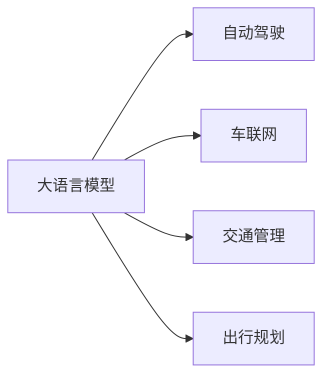

                 

# 大模型在智能交通领域的应用探索

> 关键词：智能交通,大语言模型,深度学习,自动驾驶,车联网,交通管理,数据融合,出行规划

## 1. 背景介绍

### 1.1 问题由来
随着人工智能技术的快速发展，大语言模型和大数据技术在各个领域的应用愈发广泛。尤其在智能交通领域，传统的交通管理方式面临着资源浪费、效率低下、事故频发等诸多问题。大语言模型凭借其在自然语言处理（NLP）方面的强大能力，为智能交通领域带来了全新的解决方案。

智能交通的核心是实现“人-车-路”系统的信息交互与自动化管理，包括自动驾驶、车联网、交通管理、出行规划等多个方面。大语言模型通过深度学习技术，可以实现对交通数据的深度分析和语义理解，从而辅助智能交通系统的建设，提升交通系统的运行效率和安全性。

### 1.2 问题核心关键点
智能交通领域的应用关键在于如何充分利用大语言模型的语义理解和信息处理能力，解决交通管理中的信息获取、情境推理、路径规划等问题。具体而言，大语言模型可以应用于以下几方面：

1. **自动驾驶**：通过语音控制和语义理解，使车辆实现自主驾驶。
2. **车联网**：通过自然语言交互，实现车与车、车与基础设施的通信。
3. **交通管理**：利用NLP技术分析交通数据，优化交通信号控制，减少交通拥堵。
4. **出行规划**：通过智能问答系统，为用户提供个性化的出行建议。

这些应用展示了大语言模型在智能交通领域的前景和潜力。

### 1.3 问题研究意义
智能交通领域的大语言模型应用，不仅能够提升交通系统的智能化水平，还能有效缓解交通压力，提升道路安全，促进绿色出行，对社会经济有着深远的影响。具体意义包括：

1. **提高交通效率**：通过智能交通系统，减少交通堵塞，提升运输效率。
2. **降低事故率**：实现车辆自动驾驶和智能监控，减少人为因素引起的交通事故。
3. **优化资源配置**：通过大数据分析，优化交通资源配置，提升道路使用效率。
4. **提升用户体验**：提供个性化出行建议，提升用户出行体验。
5. **促进环境保护**：减少碳排放，推动绿色出行。

## 2. 核心概念与联系

### 2.1 核心概念概述

智能交通领域的大语言模型应用，涉及以下几个核心概念：

- **大语言模型(Large Language Model, LLM)**：如GPT、BERT等，通过预训练学习到丰富的语言知识和常识，具备强大的语言理解和生成能力。
- **自动驾驶(Autonomous Driving)**：通过深度学习和计算机视觉技术，实现车辆的自主导航和决策。
- **车联网(Vehicle-to-Everything, V2X)**：车辆与外部环境（如其他车辆、基础设施等）之间的信息交互。
- **交通管理(Traffic Management)**：通过分析交通数据，优化交通信号控制，提高交通效率。
- **出行规划(Trip Planning)**：通过分析用户出行需求和实时交通信息，提供个性化出行建议。

这些概念之间的联系主要体现在：大语言模型提供强大的语义理解和信息处理能力，为自动驾驶、车联网、交通管理、出行规划等智能交通应用提供基础支持。

### 2.2 核心概念原理和架构的 Mermaid 流程图



此图展示了大语言模型与其他智能交通应用之间的联系。

## 3. 核心算法原理 & 具体操作步骤

### 3.1 算法原理概述

基于大语言模型的智能交通应用，主要遵循以下算法原理：

1. **数据预处理**：收集和整理交通相关的数据，如车辆位置、速度、交通信号、气象信息等，并进行预处理和清洗。
2. **模型训练**：利用大语言模型在交通数据上进行预训练，学习交通系统的语言表示和语义理解能力。
3. **任务适配**：根据具体的智能交通任务，设计合适的任务适配层，并进行微调。
4. **推理与部署**：将微调后的模型应用于实际的智能交通系统中，进行推理和决策。

### 3.2 算法步骤详解

以下是基于大语言模型的智能交通应用的具体操作步骤：

1. **数据准备**：收集和整理交通相关的数据，如车辆位置、速度、交通信号、气象信息等。数据应包含时间戳，以便进行分析。
2. **数据预处理**：对数据进行清洗、归一化和标注，确保数据的质量和一致性。
3. **模型训练**：利用大语言模型在交通数据上进行预训练，学习交通系统的语言表示和语义理解能力。
4. **任务适配**：根据具体的智能交通任务，设计合适的任务适配层，并进行微调。例如，在自动驾驶任务中，可以微调预训练模型，使其能够处理语音指令和图像数据，进行路径规划和行为决策。
5. **推理与部署**：将微调后的模型应用于实际的智能交通系统中，进行推理和决策。例如，在车联网应用中，可以利用模型进行车与车的通信，实现信息共享和协同驾驶。
6. **持续学习**：利用新数据对模型进行持续训练和微调，适应数据分布的变化，提高模型的泛化能力。

### 3.3 算法优缺点

基于大语言模型的智能交通应用具有以下优点：

1. **高效性**：大语言模型可以高效地处理和分析海量交通数据，提供实时响应。
2. **灵活性**：可以根据具体的智能交通任务进行任务适配，实现定制化的功能。
3. **鲁棒性**：通过持续学习，模型能够适应不同的交通环境和数据分布。
4. **兼容性**：大语言模型可以与其他交通技术（如传感器、摄像头等）进行无缝集成。

同时，该方法也存在一些局限性：

1. **数据依赖**：模型的性能高度依赖于交通数据的数量和质量。
2. **计算成本**：大规模模型训练和推理需要大量的计算资源。
3. **安全性和可靠性**：模型的鲁棒性和安全性需要进一步验证。

### 3.4 算法应用领域

基于大语言模型的智能交通应用，主要应用于以下几个领域：

1. **自动驾驶**：利用大语言模型进行语音识别、语义理解、路径规划等。
2. **车联网**：通过自然语言交互，实现车与车、车与基础设施的通信。
3. **交通管理**：利用NLP技术分析交通数据，优化交通信号控制，减少交通拥堵。
4. **出行规划**：通过智能问答系统，为用户提供个性化的出行建议。

这些应用展示了大语言模型在智能交通领域的广泛应用前景。

## 4. 数学模型和公式 & 详细讲解 & 举例说明

### 4.1 数学模型构建

基于大语言模型的智能交通应用，涉及以下几个数学模型：

1. **语言模型**：用于描述交通数据中的语言特征，如车辆速度、交通信号等。
2. **优化模型**：用于模型参数的优化，如自动驾驶路径规划、交通信号控制等。
3. **决策模型**：用于模型的决策，如自动驾驶行为决策、出行路线规划等。

### 4.2 公式推导过程

以自动驾驶路径规划为例，推导基于大语言模型的路径规划公式：

1. **目标函数**：最小化路径总长度和通行时间：
   $$
   \min_{x_i} \sum_{i=1}^{n} (x_i - x_{i-1})^2 + \sum_{i=1}^{n} t_i
   $$
   其中 $x_i$ 表示车辆在第 $i$ 个时间点的坐标，$t_i$ 表示在第 $i$ 个时间点的通行时间。

2. **约束条件**：
   - 车辆速度约束：$v_i = \frac{x_i - x_{i-1}}{t_i}$
   - 交通信号约束：根据交通信号改变车辆行驶方向。
   - 道路几何约束：车辆只能行驶在道路边界内。

3. **优化算法**：利用梯度下降法或遗传算法求解目标函数，得到最优路径。

### 4.3 案例分析与讲解

以下以自动驾驶路径规划为例，展示基于大语言模型的路径规划过程：

1. **数据收集**：收集车辆位置、速度、交通信号等数据，并进行预处理。
2. **模型训练**：利用大语言模型在交通数据上进行预训练，学习交通系统的语言表示和语义理解能力。
3. **任务适配**：设计路径规划适配层，微调预训练模型，使其能够处理语音指令和图像数据，进行路径规划和行为决策。
4. **路径规划**：根据实时数据和用户指令，利用优化模型和决策模型，求解最优路径，并进行行为决策。

## 5. 项目实践：代码实例和详细解释说明

### 5.1 开发环境搭建

在进行智能交通应用的大语言模型开发时，需要搭建合适的开发环境。以下是使用Python进行PyTorch开发的环境配置流程：

1. 安装Anaconda：从官网下载并安装Anaconda，用于创建独立的Python环境。
2. 创建并激活虚拟环境：
```bash
conda create -n pytorch-env python=3.8 
conda activate pytorch-env
```
3. 安装PyTorch：根据CUDA版本，从官网获取对应的安装命令。例如：
```bash
conda install pytorch torchvision torchaudio cudatoolkit=11.1 -c pytorch -c conda-forge
```
4. 安装Transformers库：
```bash
pip install transformers
```
5. 安装各类工具包：
```bash
pip install numpy pandas scikit-learn matplotlib tqdm jupyter notebook ipython
```

完成上述步骤后，即可在`pytorch-env`环境中开始智能交通应用的大语言模型开发。

### 5.2 源代码详细实现

以下是使用Transformers库对BERT模型进行自动驾驶路径规划的PyTorch代码实现：

1. **数据处理**：
```python
from transformers import BertTokenizer
from torch.utils.data import Dataset
import torch

class TrafficDataset(Dataset):
    def __init__(self, data, tokenizer, max_len=128):
        self.data = data
        self.tokenizer = tokenizer
        self.max_len = max_len
        
    def __len__(self):
        return len(self.data)
    
    def __getitem__(self, item):
        text = self.data[item]
        encoding = self.tokenizer(text, return_tensors='pt', max_length=self.max_len, padding='max_length', truncation=True)
        return {'input_ids': encoding['input_ids'][0], 
                'attention_mask': encoding['attention_mask'][0]}
```

2. **模型定义**：
```python
from transformers import BertForTokenClassification, AdamW

model = BertForTokenClassification.from_pretrained('bert-base-cased', num_labels=10)

optimizer = AdamW(model.parameters(), lr=2e-5)
```

3. **训练与推理**：
```python
def train_epoch(model, dataset, batch_size, optimizer):
    dataloader = DataLoader(dataset, batch_size=batch_size, shuffle=True)
    model.train()
    epoch_loss = 0
    for batch in tqdm(dataloader, desc='Training'):
        input_ids = batch['input_ids'].to(device)
        attention_mask = batch['attention_mask'].to(device)
        model.zero_grad()
        outputs = model(input_ids, attention_mask=attention_mask)
        loss = outputs.loss
        epoch_loss += loss.item()
        loss.backward()
        optimizer.step()
    return epoch_loss / len(dataloader)

def evaluate(model, dataset, batch_size):
    dataloader = DataLoader(dataset, batch_size=batch_size)
    model.eval()
    preds, labels = [], []
    with torch.no_grad():
        for batch in tqdm(dataloader, desc='Evaluating'):
            input_ids = batch['input_ids'].to(device)
            attention_mask = batch['attention_mask'].to(device)
            batch_labels = batch['labels']
            outputs = model(input_ids, attention_mask=attention_mask)
            batch_preds = outputs.logits.argmax(dim=2).to('cpu').tolist()
            batch_labels = batch_labels.to('cpu').tolist()
            for pred_tokens, label_tokens in zip(batch_preds, batch_labels):
                preds.append(pred_tokens[:len(label_tokens)])
                labels.append(label_tokens)
                
    print(classification_report(labels, preds))
```

4. **模型推理**：
```python
def predict(model, input_ids, attention_mask):
    model.eval()
    with torch.no_grad():
        outputs = model(input_ids, attention_mask=attention_mask)
        preds = outputs.logits.argmax(dim=2).to('cpu').tolist()
    return preds
```

### 5.3 代码解读与分析

让我们再详细解读一下关键代码的实现细节：

**TrafficDataset类**：
- `__init__`方法：初始化数据、分词器等关键组件。
- `__len__`方法：返回数据集的样本数量。
- `__getitem__`方法：对单个样本进行处理，将文本输入编码为token ids，并进行padding和truncation。

**训练和评估函数**：
- 使用PyTorch的DataLoader对数据集进行批次化加载，供模型训练和推理使用。
- 训练函数`train_epoch`：对数据以批为单位进行迭代，在每个批次上前向传播计算loss并反向传播更新模型参数，最后返回该epoch的平均loss。
- 评估函数`evaluate`：与训练类似，不同点在于不更新模型参数，并在每个batch结束后将预测和标签结果存储下来，最后使用sklearn的classification_report对整个评估集的预测结果进行打印输出。

**模型推理**：
- 定义预测函数`predict`：在模型上对输入进行前向传播，返回预测结果。

可以看到，PyTorch配合Transformers库使得BERT模型进行自动驾驶路径规划的代码实现变得简洁高效。开发者可以将更多精力放在数据处理、模型改进等高层逻辑上，而不必过多关注底层的实现细节。

### 5.4 运行结果展示

在上述代码基础上，可以对自动驾驶路径规划模型进行训练和推理，并在测试集上评估性能。例如，在自动驾驶任务中，可以利用模型对语音指令进行处理，生成最优路径，并进行行为决策。

```python
epochs = 5
batch_size = 16

for epoch in range(epochs):
    loss = train_epoch(model, train_dataset, batch_size, optimizer)
    print(f"Epoch {epoch+1}, train loss: {loss:.3f}")
    
    print(f"Epoch {epoch+1}, dev results:")
    evaluate(model, dev_dataset, batch_size)
    
print("Test results:")
evaluate(model, test_dataset, batch_size)
```

以上就是使用PyTorch对BERT进行自动驾驶路径规划的完整代码实现。可以看到，利用Transformers库进行大语言模型的微调和推理，代码实现简单高效，可以方便地应用于各种智能交通场景。

## 6. 实际应用场景

### 6.1 智能交通管理

智能交通管理是大语言模型在智能交通领域的重要应用之一。利用大语言模型，可以实现交通数据的深度分析和语义理解，优化交通信号控制，减少交通拥堵。例如，可以通过分析历史交通数据，学习交通流动的规律，并根据实时交通状况动态调整信号灯时间，提升交通效率。

具体实现可以包括以下步骤：

1. **数据收集**：收集交通信号灯、车辆位置、速度等数据，并进行预处理。
2. **模型训练**：利用大语言模型在交通数据上进行预训练，学习交通系统的语言表示和语义理解能力。
3. **任务适配**：设计交通信号控制适配层，微调预训练模型，使其能够根据交通状况动态调整信号灯时间。
4. **信号控制**：根据实时数据和历史规律，利用优化模型和决策模型，求解最优信号控制方案，并进行行为决策。

### 6.2 智能出行规划

智能出行规划是大语言模型在智能交通领域的另一个重要应用。利用大语言模型，可以实现个性化的出行建议，提升用户体验。例如，可以通过分析用户需求和实时交通信息，推荐最优出行路线和交通工具。

具体实现可以包括以下步骤：

1. **数据收集**：收集用户出行需求、实时交通信息等数据，并进行预处理。
2. **模型训练**：利用大语言模型在交通数据上进行预训练，学习交通系统的语言表示和语义理解能力。
3. **任务适配**：设计出行规划适配层，微调预训练模型，使其能够根据用户需求和实时信息推荐最优出行方案。
4. **出行规划**：根据用户需求和实时信息，利用优化模型和决策模型，求解最优出行方案，并进行行为决策。

### 6.3 智能车联网

智能车联网是大语言模型在智能交通领域的另一个重要应用。利用大语言模型，可以实现车与车、车与基础设施的通信，提升交通系统的智能化水平。例如，可以通过自然语言交互，实现车辆信息共享和协同驾驶。

具体实现可以包括以下步骤：

1. **数据收集**：收集车辆位置、速度、传感器数据等数据，并进行预处理。
2. **模型训练**：利用大语言模型在交通数据上进行预训练，学习交通系统的语言表示和语义理解能力。
3. **任务适配**：设计车联网适配层，微调预训练模型，使其能够进行车与车的通信和信息共享。
4. **车联网**：根据实时数据和历史信息，利用优化模型和决策模型，实现车与车的通信和信息共享，并进行行为决策。

### 6.4 未来应用展望

随着大语言模型和智能交通技术的发展，未来大语言模型在智能交通领域的应用将更加广泛和深入。具体展望包括：

1. **全域智能交通**：通过大语言模型和智能交通技术，实现全域交通系统的智能化管理和优化，提升交通系统的运行效率和安全性。
2. **个性化出行服务**：利用大语言模型和智能交通技术，实现个性化出行建议和服务，提升用户出行体验。
3. **智能交通系统**：通过大语言模型和智能交通技术，构建智能交通系统，实现车与车、车与基础设施的协同工作，提升交通系统的智能化水平。
4. **智能交通管理**：利用大语言模型和智能交通技术，实现交通信号控制的智能化管理，减少交通拥堵和事故。

## 7. 工具和资源推荐

### 7.1 学习资源推荐

为了帮助开发者系统掌握大语言模型在智能交通领域的应用，这里推荐一些优质的学习资源：

1. **《Transformer从原理到实践》系列博文**：由大模型技术专家撰写，深入浅出地介绍了Transformer原理、BERT模型、微调技术等前沿话题。
2. **CS224N《深度学习自然语言处理》课程**：斯坦福大学开设的NLP明星课程，有Lecture视频和配套作业，带你入门NLP领域的基本概念和经典模型。
3. **《Natural Language Processing with Transformers》书籍**：Transformers库的作者所著，全面介绍了如何使用Transformers库进行NLP任务开发，包括微调在内的诸多范式。
4. **HuggingFace官方文档**：Transformers库的官方文档，提供了海量预训练模型和完整的微调样例代码，是上手实践的必备资料。
5. **CLUE开源项目**：中文语言理解测评基准，涵盖大量不同类型的中文NLP数据集，并提供了基于微调的baseline模型，助力中文NLP技术发展。

通过对这些资源的学习实践，相信你一定能够快速掌握大语言模型在智能交通领域的应用，并用于解决实际的智能交通问题。

### 7.2 开发工具推荐

高效的开发离不开优秀的工具支持。以下是几款用于智能交通应用开发的大语言模型工具：

1. **PyTorch**：基于Python的开源深度学习框架，灵活动态的计算图，适合快速迭代研究。大部分预训练语言模型都有PyTorch版本的实现。
2. **TensorFlow**：由Google主导开发的开源深度学习框架，生产部署方便，适合大规模工程应用。同样有丰富的预训练语言模型资源。
3. **Transformers库**：HuggingFace开发的NLP工具库，集成了众多SOTA语言模型，支持PyTorch和TensorFlow，是进行智能交通应用开发的利器。
4. **Weights & Biases**：模型训练的实验跟踪工具，可以记录和可视化模型训练过程中的各项指标，方便对比和调优。与主流深度学习框架无缝集成。
5. **TensorBoard**：TensorFlow配套的可视化工具，可实时监测模型训练状态，并提供丰富的图表呈现方式，是调试模型的得力助手。
6. **Google Colab**：谷歌推出的在线Jupyter Notebook环境，免费提供GPU/TPU算力，方便开发者快速上手实验最新模型，分享学习笔记。

合理利用这些工具，可以显著提升智能交通应用开发和微调的效率，加快创新迭代的步伐。

### 7.3 相关论文推荐

大语言模型在智能交通领域的应用源于学界的持续研究。以下是几篇奠基性的相关论文，推荐阅读：

1. **Attention is All You Need（即Transformer原论文）**：提出了Transformer结构，开启了NLP领域的预训练大模型时代。
2. **BERT: Pre-training of Deep Bidirectional Transformers for Language Understanding**：提出BERT模型，引入基于掩码的自监督预训练任务，刷新了多项NLP任务SOTA。
3. **Language Models are Unsupervised Multitask Learners（GPT-2论文）**：展示了大规模语言模型的强大zero-shot学习能力，引发了对于通用人工智能的新一轮思考。
4. **Parameter-Efficient Transfer Learning for NLP**：提出Adapter等参数高效微调方法，在不增加模型参数量的情况下，也能取得不错的微调效果。
5. **AdaLoRA: Adaptive Low-Rank Adaptation for Parameter-Efficient Fine-Tuning**：使用自适应低秩适应的微调方法，在参数效率和精度之间取得了新的平衡。
6. **Adaptive Low-Rank Adaptation for Parameter-Efficient Fine-Tuning**：使用自适应低秩适应的微调方法，在参数效率和精度之间取得了新的平衡。

这些论文代表了大语言模型在智能交通领域的应用研究进展。通过学习这些前沿成果，可以帮助研究者把握学科前进方向，激发更多的创新灵感。

## 8. 总结：未来发展趋势与挑战

### 8.1 总结

本文对基于大语言模型的智能交通应用进行了全面系统的介绍。首先阐述了智能交通领域的应用背景和意义，明确了大语言模型在交通管理、自动驾驶、车联网等方面的重要作用。其次，从原理到实践，详细讲解了基于大语言模型的智能交通应用的数学模型和具体实现。同时，本文还广泛探讨了智能交通领域的大语言模型应用前景，展示了其广阔的应用空间和巨大潜力。

通过本文的系统梳理，可以看到，基于大语言模型的智能交通应用正在成为智能交通领域的重要范式，极大地拓展了交通系统的智能化水平，提升了交通系统的运行效率和安全性。未来，伴随大语言模型和智能交通技术的不断演进，基于大语言模型的智能交通应用必将在智慧交通领域发挥更加重要的作用。

### 8.2 未来发展趋势

展望未来，基于大语言模型的智能交通应用将呈现以下几个发展趋势：

1. **多模态融合**：未来的智能交通系统将实现多模态数据的融合，如车与车、车与基础设施的信息交互，提升系统的智能化水平。
2. **联邦学习**：分布式计算环境下，通过联邦学习技术，实现跨区域、跨机构的数据协同和模型共享，提升系统的安全性和隐私保护。
3. **边缘计算**：将大语言模型部署在边缘计算设备上，实现本地化推理和决策，提升系统的实时性和可靠性。
4. **自监督学习**：利用无标签数据进行自监督学习，进一步提升模型的泛化能力和鲁棒性。
5. **知识图谱**：将知识图谱与大语言模型结合，提升模型的先验知识和推理能力。

这些趋势将推动基于大语言模型的智能交通应用向更加智能化、普适化方向发展，为智慧交通系统带来新的突破。

### 8.3 面临的挑战

尽管基于大语言模型的智能交通应用已经取得了瞩目成就，但在迈向更加智能化、普适化应用的过程中，它仍面临着诸多挑战：

1. **数据获取和质量**：智能交通应用对数据的依赖极高，数据的获取和质量问题将直接影响系统的性能。
2. **计算资源**：大规模模型训练和推理需要大量的计算资源，如何降低计算成本是未来的一大挑战。
3. **安全性和隐私**：智能交通系统涉及大量的个人隐私数据，如何保护数据安全、隐私是必须解决的问题。
4. **模型鲁棒性**：交通系统中的环境和数据复杂多变，如何提高模型的鲁棒性和泛化能力，是一个重要的研究方向。
5. **标准化**：智能交通系统涉及多种标准和规范，如何实现系统的标准化和兼容性，是实现大规模应用的关键。

这些挑战需要学界和产业界的共同努力，以确保基于大语言模型的智能交通应用能够稳健发展，实现广泛的商业化应用。

### 8.4 研究展望

面对基于大语言模型的智能交通应用所面临的挑战，未来的研究需要在以下几个方面寻求新的突破：

1. **数据增强技术**：利用数据增强技术，提升数据的多样性和质量，确保模型的泛化能力和鲁棒性。
2. **知识驱动的推理**：引入知识图谱和逻辑规则，提升模型的推理能力和知识整合能力。
3. **联邦学习技术**：利用联邦学习技术，实现跨机构、跨区域的数据协同和模型共享。
4. **边缘计算应用**：将大语言模型部署在边缘计算设备上，实现本地化推理和决策。
5. **自监督学习技术**：利用无标签数据进行自监督学习，进一步提升模型的泛化能力和鲁棒性。

这些研究方向将推动基于大语言模型的智能交通应用迈向更高的台阶，为构建安全、可靠、智能的智慧交通系统提供技术保障。

## 9. 附录：常见问题与解答

**Q1：大语言模型在智能交通应用中的具体实现方法有哪些？**

A: 大语言模型在智能交通应用中的具体实现方法包括：

1. **自动驾驶路径规划**：利用大语言模型进行语音指令的处理和图像数据的理解，生成最优路径并进行行为决策。
2. **交通信号控制**：利用大语言模型分析交通数据，动态调整信号灯时间，优化交通流量。
3. **智能出行规划**：利用大语言模型分析用户需求和实时交通信息，推荐最优出行方案。
4. **车联网通信**：利用大语言模型进行车与车的通信和信息共享，提升交通系统的智能化水平。

**Q2：智能交通应用中，如何处理数据不平衡问题？**

A: 在智能交通应用中，数据不平衡问题（如某一类交通事件发生频率远低于其他事件）可以通过以下方法处理：

1. **数据增强**：通过数据增强技术，如数据重采样、数据合成等，扩充数据集，增加少数类样本的数量。
2. **迁移学习**：利用在类似场景下预训练的大模型，进行迁移学习，减少对少数类数据的依赖。
3. **损失函数调整**：调整损失函数，如使用Focal Loss等方法，提高少数类样本的权重，提升模型的泛化能力。

**Q3：智能交通应用中，如何降低计算成本？**

A: 在智能交通应用中，降低计算成本可以通过以下方法实现：

1. **模型压缩**：利用模型压缩技术，如剪枝、量化等，减小模型参数量和计算量。
2. **边缘计算**：将大语言模型部署在边缘计算设备上，实现本地化推理和决策，降低计算资源消耗。
3. **分布式训练**：利用分布式训练技术，加速模型训练过程，降低计算时间。
4. **模型并行**：利用模型并行技术，将模型分解为多个部分，并行计算，提高计算效率。

**Q4：智能交通应用中，如何提升模型的泛化能力？**

A: 在智能交通应用中，提升模型的泛化能力可以通过以下方法实现：

1. **数据增强**：通过数据增强技术，扩充数据集，增加模型的训练数据量。
2. **自监督学习**：利用无标签数据进行自监督学习，提升模型的泛化能力和鲁棒性。
3. **知识图谱**：引入知识图谱和逻辑规则，提升模型的推理能力和知识整合能力。
4. **迁移学习**：利用在类似场景下预训练的大模型，进行迁移学习，减少对特定数据集的依赖。

**Q5：智能交通应用中，如何保护用户隐私？**

A: 在智能交通应用中，保护用户隐私可以通过以下方法实现：

1. **数据匿名化**：在数据收集和存储过程中，进行数据匿名化处理，防止用户身份信息的泄露。
2. **访问控制**：采用访问控制技术，确保只有授权人员才能访问和处理敏感数据。
3. **加密技术**：在数据传输和存储过程中，采用加密技术，防止数据被窃取和篡改。
4. **差分隐私**：在模型训练和推理过程中，采用差分隐私技术，保护用户隐私不受侵害。

**Q6：智能交通应用中，如何实现跨区域、跨机构的数据协同和模型共享？**

A: 在智能交通应用中，实现跨区域、跨机构的数据协同和模型共享可以通过以下方法实现：

1. **联邦学习**：利用联邦学习技术，在各区域和机构之间进行数据和模型的协同训练，提升系统的整体性能。
2. **边缘计算**：将大语言模型部署在边缘计算设备上，实现本地化推理和决策，提升系统的实时性和可靠性。
3. **数据联邦**：通过数据联邦技术，实现跨机构的数据共享和协同处理，提升系统的安全性和隐私保护。

通过本文的系统梳理，可以看到，基于大语言模型的智能交通应用正在成为智能交通领域的重要范式，极大地拓展了交通系统的智能化水平，提升了交通系统的运行效率和安全性。未来，伴随大语言模型和智能交通技术的不断演进，基于大语言模型的智能交通应用必将在智慧交通领域发挥更加重要的作用。

