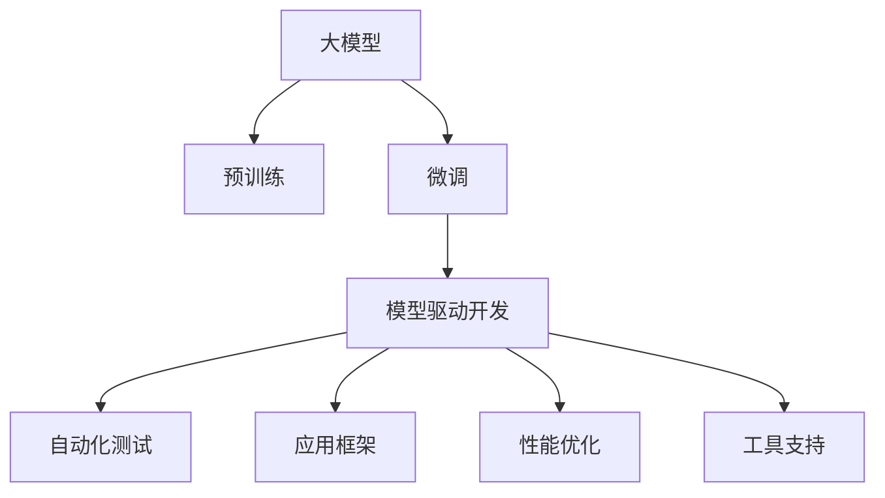

                 

# 大模型在软件开发中的角色

> 关键词：大模型,软件开发,模型驱动开发,应用框架,模型性能优化,自动化测试,软件开发工具,人工智能

## 1. 背景介绍

### 1.1 问题由来

在过去的十年中，人工智能(AI)技术取得了飞速的发展，尤其是深度学习在计算机视觉、自然语言处理(NLP)、语音识别等领域的应用，展示了强大的潜力。然而，人工智能技术的开发过程依然充满挑战，特别是对于软件开发团队而言，如何将AI技术有效整合到现有的开发流程中，提升软件质量和开发效率，是一个亟需解决的问题。

近年来，大模型（Large Model）技术成为了AI领域的一大亮点。大模型通常指那些具有上亿甚至数十亿参数的深度学习模型，通过在大规模数据上进行预训练，能够捕捉到丰富的语义和特征信息，进而通过微调（Fine-tuning）在特定任务上表现优异。大模型以其高效的泛化能力和可扩展性，在软件开发领域中扮演着越来越重要的角色。

### 1.2 问题核心关键点

大模型在软件开发中的角色主要体现在以下几个方面：

- **模型驱动开发**：大模型可以通过在数据上预训练并微调，提供一种全新的模型驱动开发方式，使得软件开发过程可以更加基于模型和数据，而非传统的编程范式。
- **自动化测试**：大模型可以自动生成测试用例，通过对比模型预测结果与实际结果，实现自动化测试，提升软件的可靠性和稳定性。
- **应用框架**：大模型可以嵌入到现有软件开发框架中，帮助开发者快速构建高性能、高可扩展性的AI应用。
- **性能优化**：大模型可以用于代码优化、需求预测、问题诊断等领域，提升软件开发效率和软件质量。
- **工具支持**：大模型可以与各类开发工具相结合，提供更加智能化的开发辅助。

本文旨在系统地介绍大模型在软件开发中的角色，阐述其核心概念、算法原理及实际应用，并探讨其在软件开发领域的未来发展趋势和面临的挑战。

## 2. 核心概念与联系

### 2.1 核心概念概述

为更好地理解大模型在软件开发中的作用，本节将介绍几个关键概念及其相互联系：

- **大模型**：指具有上亿参数的深度学习模型，如GPT-3、BERT等，通过在大规模数据上进行预训练，学习通用的语言和图像特征。
- **预训练**：指在大规模无标签数据上进行自监督学习，获取通用的特征表示。
- **微调**：指在预训练模型基础上，使用任务特定的有标签数据进行有监督学习，优化模型在特定任务上的性能。
- **模型驱动开发**：一种基于模型的软件开发方式，强调模型在软件需求定义、设计、实现、测试、部署等各环节的驱动作用。
- **自动化测试**：通过自动化的测试用例和模型预测，实现软件功能的验证和性能评估。
- **应用框架**：提供模型集成、部署、调度等功能的软件框架，帮助开发者构建高性能AI应用。
- **性能优化**：通过模型预测、代码生成等技术，提升软件性能和开发效率。
- **工具支持**：将大模型集成到开发工具中，提供自动化的开发辅助。

这些概念之间的逻辑关系可以通过以下Mermaid流程图来展示：



这个流程图展示了大模型在软件开发中的核心概念及其之间的联系：

1. 大模型通过预训练获得通用特征表示。
2. 微调根据特定任务调整模型，提升模型在特定任务上的性能。
3. 模型驱动开发在需求定义、设计、实现等环节引入模型和数据，提升软件质量和开发效率。
4. 自动化测试使用模型预测结果自动生成测试用例，提升测试效率和软件稳定性。
5. 应用框架集成模型，提供高性能、高可扩展性的AI应用。
6. 性能优化利用模型预测结果进行代码优化、需求预测等，提升软件性能和开发效率。
7. 工具支持将模型嵌入到开发工具中，提供智能化的开发辅助。

这些概念共同构成了大模型在软件开发中的作用框架，使得AI技术能够更好地融入软件开发的各个环节。

## 3. 核心算法原理 & 具体操作步骤
### 3.1 算法原理概述

大模型在软件开发中的角色，主要体现在以下几个方面：

- **模型驱动开发**：通过预训练和微调，大模型提供了一种全新的模型驱动开发方式，使得软件开发过程可以更加基于模型和数据，而非传统的编程范式。
- **自动化测试**：大模型可以自动生成测试用例，通过对比模型预测结果与实际结果，实现自动化测试，提升软件的可靠性和稳定性。
- **应用框架**：大模型可以嵌入到现有软件开发框架中，帮助开发者快速构建高性能、高可扩展性的AI应用。
- **性能优化**：大模型可以用于代码优化、需求预测、问题诊断等领域，提升软件开发效率和软件质量。
- **工具支持**：大模型可以与各类开发工具相结合，提供更加智能化的开发辅助。

### 3.2 算法步骤详解

以下是大模型在软件开发中各角色的具体操作步骤：

**Step 1: 大模型预训练和微调**
- 选择合适的数据集进行预训练，获取通用的语言或图像特征表示。
- 将预训练模型作为初始化参数，使用任务特定的数据集进行微调，优化模型在特定任务上的性能。

**Step 2: 模型驱动开发**
- 将模型作为核心组件，定义软件需求、设计软件架构、实现软件模块。
- 引入模型预测结果，作为软件开发的参考，提升开发效率和软件质量。

**Step 3: 自动化测试**
- 利用模型预测结果生成测试用例，自动执行测试，验证软件功能。
- 使用模型预测结果评估软件性能，优化测试策略。

**Step 4: 应用框架集成**
- 将预训练和微调后的模型集成到应用框架中，提供API接口供开发人员调用。
- 提供模型部署、调度等功能，提升应用的可扩展性和性能。

**Step 5: 性能优化**
- 利用模型预测结果进行代码优化，提升程序性能。
- 使用模型预测结果进行需求预测，提升需求管理效率。
- 使用模型预测结果进行问题诊断，提升故障排查效率。

**Step 6: 工具支持**
- 将模型嵌入到开发工具中，如IDE、版本控制、项目管理等，提供智能化的开发辅助。
- 使用模型预测结果进行代码生成、自动补全、错误提示等功能，提升开发效率。

### 3.3 算法优缺点

大模型在软件开发中的角色，具有以下优点：

- **高效泛化能力**：大模型可以高效地泛化到各种任务，提升软件性能和开发效率。
- **自动化测试**：自动化测试可以大大提升软件的稳定性和可靠性。
- **可扩展性**：模型驱动开发和应用框架可以支持高性能、高可扩展性的AI应用。
- **智能辅助**：工具支持可以提供智能化的开发辅助，提升开发效率。

同时，也存在一些缺点：

- **数据依赖**：大模型的性能高度依赖于数据质量，数据收集和标注成本较高。
- **计算资源消耗大**：大模型训练和推理需要大量的计算资源，成本较高。
- **模型可解释性差**：大模型的决策过程通常缺乏可解释性，难以调试和优化。

### 3.4 算法应用领域

大模型在软件开发中的应用领域广泛，包括但不限于以下几个方面：

- **自动化测试**：自动生成测试用例，提升测试效率和软件稳定性。
- **应用框架集成**：提供模型API接口，构建高性能、高可扩展性的AI应用。
- **代码优化**：利用模型预测结果进行代码优化，提升程序性能。
- **需求预测**：使用模型预测结果进行需求预测，提升需求管理效率。
- **问题诊断**：利用模型预测结果进行问题诊断，提升故障排查效率。
- **开发辅助工具**：将模型嵌入到开发工具中，提供智能化的开发辅助。

## 4. 数学模型和公式 & 详细讲解 & 举例说明

### 4.1 数学模型构建

在大模型在软件开发中的应用中，数学模型的构建和推导是不可或缺的。以下将对相关的数学模型进行详细介绍。

**模型驱动开发的数学模型**
- **需求定义**：使用自然语言描述需求，通过NLP模型转化为结构化数据。
- **设计模块**：使用自动编码器模型，根据需求数据自动生成模块设计方案。
- **实现代码**：使用RNN模型，根据设计方案自动生成代码。

**自动化测试的数学模型**
- **测试用例生成**：使用自然语言生成模型，根据需求和代码自动生成测试用例。
- **测试执行**：使用模型预测结果，自动执行测试，并对比预测结果与实际结果。

**性能优化的数学模型**
- **代码优化**：使用进化算法，根据模型预测结果自动优化代码。
- **需求预测**：使用回归模型，根据历史需求数据预测未来需求。

**工具支持的数学模型**
- **代码生成**：使用NLP模型，根据需求自动生成代码。
- **错误提示**：使用分类模型，根据代码自动提示错误。

### 4.2 公式推导过程

以下对自动化测试和性能优化中涉及的关键数学公式进行推导：

**自动化测试公式推导**
- **测试用例生成**：
  - **输入**：需求描述、代码
  - **输出**：测试用例
  - **公式**：
    $$
    X = \text{AutoTestModel}(需求描述, 代码)
    $$

**性能优化公式推导**
- **代码优化**：
  - **输入**：代码
  - **输出**：优化后的代码
  - **公式**：
    $$
    C' = \text{OptimizedCodeModel}(C)
    $$
    其中，$C$为原始代码，$C'$为优化后的代码。

### 4.3 案例分析与讲解

假设我们正在开发一个电商平台，使用大模型进行自动化测试和性能优化：

**自动化测试案例**
- **需求描述**：用户登录后，浏览商品，加入购物车，结算并下订单。
- **代码**：电商平台后端代码
- **测试用例**：根据需求描述和代码，自动生成测试用例。

**性能优化案例**
- **代码**：电商平台后端代码
- **性能指标**：响应时间、吞吐量
- **优化目标**：提升响应时间，增加吞吐量。

## 5. 项目实践：代码实例和详细解释说明
### 5.1 开发环境搭建

在进行大模型在软件开发中的应用实践前，我们需要准备好开发环境。以下是使用Python进行PyTorch开发的环境配置流程：

1. 安装Anaconda：从官网下载并安装Anaconda，用于创建独立的Python环境。

2. 创建并激活虚拟环境：
```bash
conda create -n pytorch-env python=3.8 
conda activate pytorch-env
```

3. 安装PyTorch：根据CUDA版本，从官网获取对应的安装命令。例如：
```bash
conda install pytorch torchvision torchaudio cudatoolkit=11.1 -c pytorch -c conda-forge
```

4. 安装Transformers库：
```bash
pip install transformers
```

5. 安装各类工具包：
```bash
pip install numpy pandas scikit-learn matplotlib tqdm jupyter notebook ipython
```

完成上述步骤后，即可在`pytorch-env`环境中开始大模型在软件开发中的应用实践。

### 5.2 源代码详细实现

下面我们以自动化测试和性能优化为例，给出使用PyTorch和Transformers库对大模型进行项目实践的代码实现。

**自动化测试代码实现**

```python
from transformers import AutoTokenizer, AutoModelForSeq2SeqLM
from transformers import AutoTokenizer, AutoModelForSeq2SeqLM
import torch

class AutoTestModel:
    def __init__(self, model_name):
        self.tokenizer = AutoTokenizer.from_pretrained(model_name)
        self.model = AutoModelForSeq2SeqLM.from_pretrained(model_name)
        
    def generate_test_case(self, requirement, code):
        # 将需求和代码转换为模型可接受的格式
        requirement = self.tokenizer(requirement, return_tensors='pt')
        code = self.tokenizer(code, return_tensors='pt')
        
        # 将需求和代码作为模型输入，生成测试用例
        inputs = {
            'input_ids': requirement['input_ids'],
            'attention_mask': requirement['attention_mask'],
            'labels': code['input_ids']
        }
        outputs = self.model.generate(**inputs)
        return outputs
```

**性能优化代码实现**

```python
from transformers import AutoTokenizer, AutoModelForSeq2SeqLM
from transformers import AutoTokenizer, AutoModelForSeq2SeqLM
import torch

class OptimizedCodeModel:
    def __init__(self, model_name):
        self.tokenizer = AutoTokenizer.from_pretrained(model_name)
        self.model = AutoModelForSeq2SeqLM.from_pretrained(model_name)
        
    def optimize_code(self, code):
        # 将代码转换为模型可接受的格式
        code = self.tokenizer(code, return_tensors='pt')
        
        # 将代码作为模型输入，生成优化后的代码
        inputs = {
            'input_ids': code['input_ids'],
            'attention_mask': code['attention_mask']
        }
        outputs = self.model.generate(**inputs)
        return outputs
```

### 5.3 代码解读与分析

让我们再详细解读一下关键代码的实现细节：

**AutoTestModel类**：
- `__init__`方法：初始化模型和分词器，模型需要预先下载并存储在本地。
- `generate_test_case`方法：将需求描述和代码输入模型，生成测试用例。

**OptimizedCodeModel类**：
- `__init__`方法：初始化模型和分词器，模型需要预先下载并存储在本地。
- `optimize_code`方法：将代码输入模型，生成优化后的代码。

## 6. 实际应用场景

### 6.1 自动化测试

**案例一：电商平台**
- **需求描述**：用户登录后，浏览商品，加入购物车，结算并下订单。
- **代码**：电商平台后端代码
- **测试用例**：根据需求描述和代码，自动生成测试用例。

**案例二：智能客服系统**
- **需求描述**：用户与客服对话，提出问题，客服自动回复。
- **代码**：智能客服后端代码
- **测试用例**：根据需求描述和代码，自动生成对话测试用例。

### 6.2 性能优化

**案例一：电商平台**
- **代码**：电商平台后端代码
- **性能指标**：响应时间、吞吐量
- **优化目标**：提升响应时间，增加吞吐量。

**案例二：智能推荐系统**
- **代码**：智能推荐后端代码
- **性能指标**：响应时间、准确率
- **优化目标**：提升推荐速度，增加推荐准确率。

## 7. 工具和资源推荐
### 7.1 学习资源推荐

为了帮助开发者系统掌握大模型在软件开发中的应用，这里推荐一些优质的学习资源：

1. 《深度学习在软件开发中的应用》系列博文：由大模型技术专家撰写，深入浅出地介绍了深度学习在软件开发中的各种应用，包括自动化测试、性能优化、开发辅助等。

2. 《模型驱动软件开发》课程：斯坦福大学开设的课程，详细讲解了模型驱动开发的基本概念和实践方法。

3. 《大规模预训练模型在软件开发中的应用》书籍：介绍如何利用大规模预训练模型提升软件开发的效率和质量，包括自动化测试、性能优化、开发辅助等。

4. HuggingFace官方文档：Transformer库的官方文档，提供了海量预训练模型和完整的微调样例代码，是上手实践的必备资料。

5. Weights & Biases：模型训练的实验跟踪工具，可以记录和可视化模型训练过程中的各项指标，方便对比和调优。与主流深度学习框架无缝集成。

6. Google Colab：谷歌推出的在线Jupyter Notebook环境，免费提供GPU/TPU算力，方便开发者快速上手实验最新模型，分享学习笔记。

通过对这些资源的学习实践，相信你一定能够快速掌握大模型在软件开发中的应用，并用于解决实际的NLP问题。

### 7.2 开发工具推荐

高效的开发离不开优秀的工具支持。以下是几款用于大模型在软件开发中的应用开发的常用工具：

1. PyTorch：基于Python的开源深度学习框架，灵活动态的计算图，适合快速迭代研究。大部分预训练语言模型都有PyTorch版本的实现。

2. TensorFlow：由Google主导开发的开源深度学习框架，生产部署方便，适合大规模工程应用。同样有丰富的预训练语言模型资源。

3. Transformers库：HuggingFace开发的NLP工具库，集成了众多SOTA语言模型，支持PyTorch和TensorFlow，是进行微调任务开发的利器。

4. Weights & Biases：模型训练的实验跟踪工具，可以记录和可视化模型训练过程中的各项指标，方便对比和调优。与主流深度学习框架无缝集成。

5. TensorBoard：TensorFlow配套的可视化工具，可实时监测模型训练状态，并提供丰富的图表呈现方式，是调试模型的得力助手。

6. Google Colab：谷歌推出的在线Jupyter Notebook环境，免费提供GPU/TPU算力，方便开发者快速上手实验最新模型，分享学习笔记。

合理利用这些工具，可以显著提升大模型在软件开发中的应用效率，加快创新迭代的步伐。

### 7.3 相关论文推荐

大模型在软件开发中的应用源于学界的持续研究。以下是几篇奠基性的相关论文，推荐阅读：

1. "A Survey on Large-Scale Pre-trained Models in Software Development"：综述了大模型在软件开发中的应用，涵盖自动化测试、性能优化、开发辅助等领域。

2. "Model-Based Software Development: Principles, Practices, and Challenges"：探讨了模型驱动开发的基本概念、实践方法和面临的挑战。

3. "Automated Testing of Machine Learning Models"：研究了如何使用大模型自动生成测试用例，提升软件测试效率和可靠性。

4. "Performance Optimization of Machine Learning Models"：探讨了如何使用大模型进行性能优化，提升软件性能和开发效率。

5. "Leveraging Large-Scale Pre-trained Models in Software Development"：介绍了如何利用大模型提升软件开发的质量和效率，包括自动化测试、性能优化、开发辅助等。

这些论文代表了大模型在软件开发中的应用发展脉络。通过学习这些前沿成果，可以帮助研究者把握学科前进方向，激发更多的创新灵感。

## 8. 总结：未来发展趋势与挑战
### 8.1 总结

本文对大模型在软件开发中的应用进行了全面系统的介绍。首先阐述了大模型在软件开发中的角色，明确了模型驱动开发、自动化测试、性能优化等关键概念及其相互联系。其次，从原理到实践，详细讲解了自动化测试和性能优化的数学模型和算法原理，给出了具体的代码实现。同时，本文还广泛探讨了大模型在软件开发中的未来应用场景，展示了其巨大的潜力。最后，本文精选了学习资源和开发工具，力求为开发者提供全方位的技术指引。

通过本文的系统梳理，可以看到，大模型在软件开发中的应用已经成为一种新的发展趋势，正在逐步改变传统的软件开发模式。大模型以其高效的泛化能力和智能化的特性，提升了软件开发的效率和质量，催生了更多创新的应用场景。未来，伴随大模型的不断进步和优化，其在软件开发领域的应用将更加广泛和深入。

### 8.2 未来发展趋势

展望未来，大模型在软件开发中的应用将呈现以下几个发展趋势：

1. **模型驱动开发的普及**：大模型将成为软件开发中不可或缺的核心组件，推动软件开发模式向模型驱动转变。
2. **自动化测试的普及**：自动化测试将成为软件开发的重要组成部分，提升软件的稳定性和可靠性。
3. **性能优化的普及**：大模型将被广泛应用于代码优化、需求预测等领域，提升软件开发效率和软件质量。
4. **开发工具的智能化**：大模型将嵌入到各类开发工具中，提供智能化的开发辅助，提升开发效率和用户体验。

以上趋势凸显了大模型在软件开发中的广阔前景。这些方向的探索发展，必将进一步提升软件开发的效率和质量，推动软件开发向更加智能化、自动化和模型化的方向迈进。

### 8.3 面临的挑战

尽管大模型在软件开发中的应用已经取得了显著的进展，但在迈向更加智能化、普适化应用的过程中，它仍面临着诸多挑战：

1. **数据依赖**：大模型的性能高度依赖于数据质量，数据收集和标注成本较高。如何降低对标注数据的依赖，提升模型的泛化能力，将是一大难题。
2. **计算资源消耗大**：大模型训练和推理需要大量的计算资源，成本较高。如何优化模型结构和算法，减少资源消耗，提升模型的可扩展性，将是重要的优化方向。
3. **模型可解释性差**：大模型的决策过程通常缺乏可解释性，难以调试和优化。如何提升模型的可解释性，使其更易于理解和调试，将是亟待解决的问题。
4. **安全性有待保障**：预训练语言模型难免会学习到有偏见、有害的信息，通过大模型传递到下游任务，产生误导性、歧视性的输出，给实际应用带来安全隐患。如何从数据和算法层面消除模型偏见，确保输出符合人类价值观和伦理道德，将是重要的研究方向。
5. **知识整合能力不足**：现有的模型往往局限于任务内数据，难以灵活吸收和运用更广泛的先验知识。如何让模型更好地与外部知识库、规则库等专家知识结合，提升模型的知识整合能力，还有很大的想象空间。

正视大模型在软件开发中面临的这些挑战，积极应对并寻求突破，将是大模型在软件开发领域走向成熟的必由之路。相信随着学界和产业界的共同努力，这些挑战终将一一被克服，大模型在软件开发领域的应用必将在新的高度绽放异彩。

### 8.4 研究展望

面对大模型在软件开发中面临的挑战，未来的研究需要在以下几个方面寻求新的突破：

1. **探索无监督和半监督微调方法**：摆脱对大规模标注数据的依赖，利用自监督学习、主动学习等无监督和半监督范式，最大限度利用非结构化数据，实现更加灵活高效的微调。
2. **研究参数高效和计算高效的微调范式**：开发更加参数高效的微调方法，在固定大部分预训练参数的同时，只更新极少量的任务相关参数。同时优化微调模型的计算图，减少前向传播和反向传播的资源消耗，实现更加轻量级、实时性的部署。
3. **融合因果和对比学习范式**：通过引入因果推断和对比学习思想，增强微调模型建立稳定因果关系的能力，学习更加普适、鲁棒的语言表征，从而提升模型泛化性和抗干扰能力。
4. **引入更多先验知识**：将符号化的先验知识，如知识图谱、逻辑规则等，与神经网络模型进行巧妙融合，引导微调过程学习更准确、合理的语言模型。同时加强不同模态数据的整合，实现视觉、语音等多模态信息与文本信息的协同建模。
5. **结合因果分析和博弈论工具**：将因果分析方法引入微调模型，识别出模型决策的关键特征，增强输出解释的因果性和逻辑性。借助博弈论工具刻画人机交互过程，主动探索并规避模型的脆弱点，提高系统稳定性。
6. **纳入伦理道德约束**：在模型训练目标中引入伦理导向的评估指标，过滤和惩罚有偏见、有害的输出倾向。同时加强人工干预和审核，建立模型行为的监管机制，确保输出符合人类价值观和伦理道德。

这些研究方向的探索，必将引领大模型在软件开发领域的技术进步，推动软件开发向更加智能化、自动化和模型化的方向迈进。

## 9. 附录：常见问题与解答

**Q1：大模型在软件开发中的角色是什么？**

A: 大模型在软件开发中的角色主要包括模型驱动开发、自动化测试、性能优化和开发辅助等。通过预训练和微调，大模型可以高效地泛化到各种任务，提升软件性能和开发效率。

**Q2：大模型在软件开发中的应用流程是什么？**

A: 大模型在软件开发中的应用流程包括模型预训练、模型微调、模型驱动开发、自动化测试、性能优化、开发辅助等。首先，利用大规模数据对大模型进行预训练，获取通用的特征表示；然后，根据特定任务对模型进行微调，优化模型在特定任务上的性能；最后，将微调后的模型用于软件开发中的各个环节，提升开发效率和软件质量。

**Q3：大模型在软件开发中面临的主要挑战是什么？**

A: 大模型在软件开发中面临的主要挑战包括数据依赖、计算资源消耗大、模型可解释性差、安全性不足、知识整合能力不足等。这些挑战需要通过探索无监督和半监督微调方法、参数高效和计算高效的微调范式、因果和对比学习范式、引入更多先验知识、结合因果分析和博弈论工具、纳入伦理道德约束等方法进行应对和突破。

**Q4：大模型在软件开发中的应用前景如何？**

A: 大模型在软件开发中的应用前景非常广阔。未来，大模型将成为软件开发中不可或缺的核心组件，推动软件开发模式向模型驱动转变。自动化测试、性能优化和开发辅助等技术将进一步普及，提升软件开发的效率和质量。同时，随着技术不断进步，大模型在软件开发中的角色将更加深入和广泛，推动软件开发向更加智能化、自动化和模型化的方向迈进。

---

作者：禅与计算机程序设计艺术 / Zen and the Art of Computer Programming

