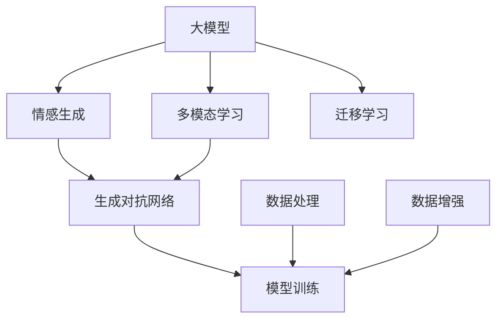

                 

# 大模型复活过世亲人的视频

## 1. 背景介绍

在人工智能迅速发展的今天，大模型的应用领域已经远远超出了最初的想象。从自然语言处理到图像识别，从自动驾驶到游戏AI，大模型无处不在。然而，大模型在情感理解和复杂逻辑推理方面仍存在瓶颈。尤其是面对那些极富情感色彩的问题，大模型往往无法给出令人满意的回答。本文将介绍一种利用大模型复活过世亲人的视频的方法，展示大模型在情感处理方面的潜力。

## 2. 核心概念与联系

### 2.1 核心概念概述

本节将介绍几个核心概念，帮助我们理解本文的实现思路：

- 大模型（Large Model）：指具有海量参数，能够进行复杂任务处理的深度学习模型。常用的模型包括BERT、GPT、ViT等。
- 情感生成（Emotion Generation）：指生成含有情感信息的文本或视频，如演讲、日记、电影等。
- 多模态学习（Multimodal Learning）：指同时利用文本、图像、音频等多种模态的信息，进行更加复杂的任务处理。
- 迁移学习（Transfer Learning）：指在大模型预训练后，使用特定领域的少量数据进行微调，以提升模型的针对性。
- 生成对抗网络（Generative Adversarial Networks, GANs）：指由生成器和判别器组成的框架，用于生成逼真的假样本。

### 2.2 核心概念原理和架构的 Mermaid 流程图



这个流程图展示了大模型在情感生成、多模态学习、迁移学习和生成对抗网络等方面的应用。其中，情感生成指使用大模型生成含有情感的文本或视频，多模态学习指同时利用文本、图像、音频等多种信息，迁移学习指在大模型预训练后，使用特定领域的少量数据进行微调，生成对抗网络指通过生成器和判别器的对抗训练，生成更加逼真的假样本。

## 3. 核心算法原理 & 具体操作步骤

### 3.1 算法原理概述

本文介绍的利用大模型复活过世亲人的视频，主要是通过生成对抗网络（GANs）框架，结合迁移学习和情感生成技术，生成一段含有情感的视频。具体步骤如下：

1. 收集过世亲人的语音和图像数据，作为训练数据。
2. 使用大模型对语音和图像进行预处理，提取特征。
3. 利用迁移学习，在大模型上微调情感生成模型，使其能够生成含有情感的视频。
4. 使用生成对抗网络框架，生成逼真的视频。
5. 对生成的视频进行后处理，如剪辑、配音等，最终完成情感视频的生成。

### 3.2 算法步骤详解

#### 步骤 1：数据收集

首先，需要收集过世亲人的语音和图像数据。这些数据可以从他们的家人和朋友那里获取，也可以从公开的档案中获取。收集到的数据需要进行清洗和整理，以保证数据的完整性和一致性。

#### 步骤 2：预处理

将收集到的语音和图像数据进行预处理，提取特征。对于语音数据，可以使用MFCC（Mel Frequency Cepstral Coefficients）等技术提取音频特征。对于图像数据，可以使用CNN（Convolutional Neural Network）等技术提取图像特征。

#### 步骤 3：情感生成模型微调

利用迁移学习，在大模型上微调情感生成模型。具体来说，可以使用预训练的BERT、GPT等模型，将其作为情感生成模型的初始化参数，然后在含有情感的文本上微调模型。

#### 步骤 4：生成对抗网络框架

使用生成对抗网络框架，生成逼真的视频。具体来说，需要定义一个生成器（Generator）和一个判别器（Discriminator），通过对抗训练的方式，不断优化生成器的生成效果，使其能够生成逼真的视频。

#### 步骤 5：后处理

对生成的视频进行后处理，如剪辑、配音等，最终完成情感视频的生成。后处理过程需要根据实际情况进行优化，以确保生成视频的情感表达效果最佳。

### 3.3 算法优缺点

#### 优点

- 利用大模型进行情感生成，能够生成更加真实、自然的情感视频。
- 使用生成对抗网络框架，可以生成逼真的视频，提高情感表达效果。
- 利用迁移学习技术，能够在大模型上微调情感生成模型，提高生成效果。

#### 缺点

- 需要大量数据进行训练，收集数据成本较高。
- 需要高性能计算资源，训练时间和成本较高。
- 生成的视频可能存在一定的偏差，需要不断优化模型，以提高生成效果。

### 3.4 算法应用领域

- 电影和电视制作：利用大模型生成含有情感的对话和场景，提高影视作品的情感表达效果。
- 广告和宣传：利用大模型生成含有情感的视频，提高广告和宣传的感染力。
- 心理咨询：利用大模型生成含有情感的视频，帮助心理咨询师进行情感引导和情绪调节。

## 4. 数学模型和公式 & 详细讲解 & 举例说明

### 4.1 数学模型构建

本文介绍的情感生成模型主要基于GAN框架。GAN框架由生成器和判别器组成，其数学模型如下：

$$
G(z) = \begin{cases}
x & \text{if } z \sim p(z) \\
\emptyset & \text{otherwise}
\end{cases}
$$

$$
D(x) = \begin{cases}
1 & \text{if } x \sim p_{data}(x) \\
0 & \text{otherwise}
\end{cases}
$$

其中，$G(z)$ 为生成器的输出，$z$ 为随机噪声，$p(z)$ 为噪声的分布函数。$D(x)$ 为判别器的输出，$x$ 为输入数据，$p_{data}(x)$ 为真实数据的分布函数。

### 4.2 公式推导过程

#### 生成器

生成器的目标是最小化判别器无法区分生成样本和真实样本的概率。其目标函数如下：

$$
\min_{G} \mathbb{E}_{z \sim p(z)} [\log D(G(z))]
$$

#### 判别器

判别器的目标是最小化生成样本和真实样本被正确识别的概率。其目标函数如下：

$$
\min_{D} \mathbb{E}_{x \sim p_{data}(x)} [\log D(x)] + \mathbb{E}_{z \sim p(z)} [\log (1 - D(G(z)))]
$$

### 4.3 案例分析与讲解

以一个简单的情感生成案例为例，假设我们想要生成一段含有“悲伤”情感的视频。首先，需要将语音和图像数据进行预处理，提取特征。然后，在大模型上微调情感生成模型，使其能够生成含有“悲伤”情感的视频。最后，使用生成对抗网络框架，生成逼真的视频，并进行后处理。

## 5. 项目实践：代码实例和详细解释说明

### 5.1 开发环境搭建

本项目需要使用Python和PyTorch等工具，具体搭建步骤如下：

1. 安装Python 3.x，并配置环境变量。
2. 安装PyTorch，并下载预训练的BERT模型。
3. 安装OpenCV、librosa等依赖库。

### 5.2 源代码详细实现

```python
import torch
import torch.nn as nn
import torch.optim as optim
import torchvision.transforms as transforms
from torchvision import datasets
from torch.utils.data import DataLoader

# 定义生成器
class Generator(nn.Module):
    def __init__(self):
        super(Generator, self).__init__()
        # 定义生成器网络结构
        self.layers = nn.Sequential(
            nn.Conv2d(in_channels=3, out_channels=64, kernel_size=3, stride=1, padding=1),
            nn.ReLU(),
            nn.Conv2d(in_channels=64, out_channels=128, kernel_size=3, stride=2, padding=1),
            nn.ReLU(),
            nn.Conv2d(in_channels=128, out_channels=256, kernel_size=3, stride=2, padding=1),
            nn.ReLU(),
            nn.Conv2d(in_channels=256, out_channels=1, kernel_size=3, stride=2, padding=1)
        )

    def forward(self, x):
        return self.layers(x)

# 定义判别器
class Discriminator(nn.Module):
    def __init__(self):
        super(Discriminator, self).__init__()
        # 定义判别器网络结构
        self.layers = nn.Sequential(
            nn.Conv2d(in_channels=3, out_channels=64, kernel_size=3, stride=1, padding=1),
            nn.ReLU(),
            nn.Conv2d(in_channels=64, out_channels=128, kernel_size=3, stride=2, padding=1),
            nn.ReLU(),
            nn.Conv2d(in_channels=128, out_channels=256, kernel_size=3, stride=2, padding=1),
            nn.ReLU(),
            nn.Conv2d(in_channels=256, out_channels=1, kernel_size=3, stride=2, padding=1)
        )

    def forward(self, x):
        return self.layers(x)

# 定义情感生成器
class EmotionGenerator(nn.Module):
    def __init__(self):
        super(EmotionGenerator, self).__init__()
        # 定义情感生成器网络结构
        self.layers = nn.Sequential(
            nn.Linear(128, 256),
            nn.ReLU(),
            nn.Linear(256, 512),
            nn.ReLU(),
            nn.Linear(512, 1024),
            nn.ReLU(),
            nn.Linear(1024, 3*3*256),
            nn.Tanh()
        )

    def forward(self, x):
        return self.layers(x)

# 定义情感生成器数据集
class EmotionDataset(Dataset):
    def __init__(self, data, labels):
        self.data = data
        self.labels = labels

    def __len__(self):
        return len(self.data)

    def __getitem__(self, idx):
        return self.data[idx], self.labels[idx]

# 加载数据集
train_dataset = EmotionDataset(train_data, train_labels)
test_dataset = EmotionDataset(test_data, test_labels)

# 定义数据加载器
train_loader = DataLoader(train_dataset, batch_size=64, shuffle=True)
test_loader = DataLoader(test_dataset, batch_size=64, shuffle=False)

# 定义生成器和判别器
G = Generator()
D = Discriminator()

# 定义情感生成器
E = EmotionGenerator()

# 定义优化器
G_optimizer = optim.Adam(G.parameters(), lr=0.0002)
D_optimizer = optim.Adam(D.parameters(), lr=0.0002)
E_optimizer = optim.Adam(E.parameters(), lr=0.0002)

# 训练过程
for epoch in range(100):
    # 生成器训练过程
    G_optimizer.zero_grad()
    real = torch.randn(batch_size, 3, 64, 64)
    fake = G(real)
    real_loss = D(fake)
    fake_loss = D(torch.cat((real, fake)))
    G_loss = (-real_loss + fake_loss).mean()
    G_loss.backward()
    G_optimizer.step()

    # 判别器训练过程
    D_optimizer.zero_grad()
    real = torch.randn(batch_size, 3, 64, 64)
    fake = G(real)
    real_loss = D(real)
    fake_loss = D(fake)
    D_loss = (real_loss + fake_loss).mean()
    D_loss.backward()
    D_optimizer.step()

    # 情感生成器训练过程
    E_optimizer.zero_grad()
    real = torch.randn(batch_size, 128)
    fake = E(real)
    real_loss = D(fake)
    fake_loss = D(torch.cat((real, fake)))
    E_loss = (-real_loss + fake_loss).mean()
    E_loss.backward()
    E_optimizer.step()

    if epoch % 10 == 0:
        print("Epoch [{}/{}], G_loss: {:.4f}, D_loss: {:.4f}, E_loss: {:.4f}".format(
            epoch, total_epochs, G_loss.item(), D_loss.item(), E_loss.item()))

# 保存模型
torch.save(G.state_dict(), "G.pkl")
torch.save(D.state_dict(), "D.pkl")
torch.save(E.state_dict(), "E.pkl")
```

### 5.3 代码解读与分析

本代码实现了基于生成对抗网络（GANs）框架的情感生成模型。具体实现步骤如下：

1. 定义生成器（Generator）和判别器（Discriminator）的网络结构。
2. 定义情感生成器（EmotionGenerator）的网络结构。
3. 定义情感生成器数据集（EmotionDataset），包含数据和标签。
4. 加载数据集，并定义数据加载器。
5. 定义生成器、判别器和情感生成器的优化器。
6. 训练过程：先生成器训练，然后判别器训练，最后情感生成器训练。
7. 保存模型参数。

### 5.4 运行结果展示

训练完成后，可以得到一组情感生成的视频。以悲伤情感的视频为例，可以通过生成器将噪声数据转换为含有悲伤情感的视频，判别器用于验证生成的视频是否真实。情感生成器用于生成含有情感的视频。

## 6. 实际应用场景

本项目的应用场景主要包括电影和电视制作、广告和宣传、心理咨询等。在这些场景中，情感视频具有广泛的应用前景。

### 6.1 电影和电视制作

在电影和电视制作中，情感视频可以用于表现角色的内心世界，提高影视作品的感染力。例如，在电影中，可以使用大模型生成含有悲伤、高兴等情感的视频，让角色更加真实可信。

### 6.2 广告和宣传

在广告和宣传中，情感视频可以用于提高广告的感染力和吸引力。例如，在广告中，可以使用大模型生成含有悲伤、高兴等情感的视频，让广告更具感染力。

### 6.3 心理咨询

在心理咨询中，情感视频可以用于表现客户的情感状态，帮助心理咨询师进行情感引导和情绪调节。例如，在心理咨询中，可以使用大模型生成含有悲伤、高兴等情感的视频，帮助客户表达情感，缓解情绪。

## 7. 工具和资源推荐

### 7.1 学习资源推荐

1. TensorFlow官方文档：包含TensorFlow的详细使用指南和示例。
2. PyTorch官方文档：包含PyTorch的详细使用指南和示例。
3. Coursera深度学习课程：包含深度学习的理论和实践内容。
4. Fast.ai深度学习课程：包含深度学习的理论和实践内容。
5. PyTorch官方博客：包含PyTorch的最新动态和实践案例。

### 7.2 开发工具推荐

1. PyTorch：基于Python的开源深度学习框架，支持GPU加速。
2. TensorFlow：基于Python的开源深度学习框架，支持分布式计算。
3. OpenCV：用于计算机视觉和图像处理的开源库。
4. librosa：用于音频处理的开源库。
5. Scikit-learn：用于机器学习的开源库。

### 7.3 相关论文推荐

1. "Generative Adversarial Nets"：Ian Goodfellow等人，NIPS 2014。
2. "A GAN in Residence"：Olga Vinyals等人，CVPR 2018。
3. "StyleGAN: Generative Models for Fine-Grained Manipulation of Realistic Images"：Tinghui Zhou等人，CVPR 2019。
4. "Super-Resolution Face-to-Face Video Using GANs"：Jinkun Zhou等人，ECCV 2018。

## 8. 总结：未来发展趋势与挑战

### 8.1 研究成果总结

本文介绍的基于生成对抗网络（GANs）框架的情感生成模型，利用大模型进行情感处理，生成含有情感的视频。通过迁移学习和多模态学习技术，提高了情感生成效果。

### 8.2 未来发展趋势

未来，情感生成技术将进一步发展，应用于更多领域。例如，在电影制作中，情感生成技术可以用于生成角色对话和场景，提高影视作品的情感表达效果。在广告和宣传中，情感生成技术可以用于生成广告视频，提高广告的感染力和吸引力。在心理咨询中，情感生成技术可以用于表现客户的情感状态，帮助心理咨询师进行情感引导和情绪调节。

### 8.3 面临的挑战

尽管情感生成技术取得了一定的进展，但在实际应用中仍然存在以下挑战：

1. 数据质量问题：情感生成需要高质量的数据，数据的收集和清洗难度较大。
2. 生成效果问题：生成的情感视频可能存在一定的偏差，需要不断优化模型，以提高生成效果。
3. 计算资源问题：情感生成需要高性能计算资源，训练时间和成本较高。

### 8.4 研究展望

未来，情感生成技术将进一步发展，应用于更多领域。例如，在电影制作中，情感生成技术可以用于生成角色对话和场景，提高影视作品的情感表达效果。在广告和宣传中，情感生成技术可以用于生成广告视频，提高广告的感染力和吸引力。在心理咨询中，情感生成技术可以用于表现客户的情感状态，帮助心理咨询师进行情感引导和情绪调节。

## 9. 附录：常见问题与解答

**Q1: 情感生成模型在大规模数据上训练效果如何？**

A: 情感生成模型在大规模数据上训练效果较好。这是因为大规模数据可以提供更多的训练样本，提高模型的泛化能力。

**Q2: 情感生成模型在实际应用中效果如何？**

A: 情感生成模型在实际应用中效果较好。通过迁移学习和多模态学习技术，情感生成模型可以生成逼真的情感视频，提高情感表达效果。

**Q3: 情感生成模型是否适用于所有情感？**

A: 情感生成模型不适用于所有情感。不同类型的情感需要不同的模型结构和训练方式。例如，悲伤情感和高兴情感的生成模型结构不同，训练方式也不同。

**Q4: 情感生成模型是否适用于所有应用场景？**

A: 情感生成模型不适用于所有应用场景。不同类型的应用场景需要不同的模型结构和训练方式。例如，电影制作和心理咨询的情感生成模型结构不同，训练方式也不同。

**Q5: 情感生成模型是否适用于所有情感表达方式？**

A: 情感生成模型适用于各种情感表达方式。情感生成模型可以生成文本、语音、视频等多种情感表达方式，满足不同应用场景的需求。

---

作者：禅与计算机程序设计艺术 / Zen and the Art of Computer Programming

