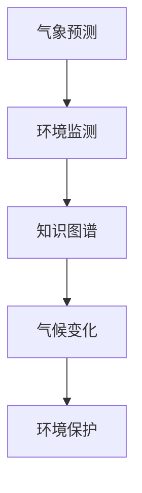

                 

# 大模型如何助力气候变化和环境保护?

大语言模型（Large Language Model, LLMs）作为人工智能领域的最新突破，其广泛的应用范围已拓展至多个领域，包括气象预测、气候模拟、环境保护等。通过结合气象、环境科学和大数据分析，大模型可以在应对气候变化和环境保护的挑战中发挥重要作用。本文将从背景介绍、核心概念与联系、算法原理与操作步骤、实际应用场景等多个维度，详细探讨大模型在助力气候变化和环境保护中的潜力及其实现方式。

## 1. 背景介绍

### 1.1 问题由来
随着全球气候变化问题日益严峻，如何有效监测和应对气候变化成为全球关注的重要议题。气候变化不仅影响生态系统、农业生产，还直接威胁人类的健康和生存。气象数据是大模型可以利用的关键资源，大模型通过学习海量的气象数据，可以预测未来的气候变化，识别出影响气候变化的关键因素，从而为政府决策、企业应对和公众教育提供科学依据。

### 1.2 问题核心关键点
大模型在气候变化和环境保护中的应用，主要依赖于以下核心关键点：
1. **数据获取与处理**：高质量、大量规模的气象数据和环境监测数据是大模型发挥作用的前提。
2. **模型学习与预测**：通过自监督学习，大模型可以从历史数据中学习到气候变化的规律，并进行未来预测。
3. **跨领域知识整合**：大模型整合气象学、环境科学、计算机科学等多学科知识，提升预测准确性。
4. **模型优化与训练**：大模型的优化训练是确保预测准确性和鲁棒性的关键。
5. **应用部署与落地**：将大模型部署到实际应用中，提供实时监测与预警服务。

### 1.3 问题研究意义
大模型在气候变化和环境保护中的应用，对于提高气候预测的准确性、推动环境保护决策的科学化、促进绿色可持续发展具有重要意义。具体如下：

1. **提升气候预测准确性**：通过学习大量气象数据，大模型可以识别出气候变化的趋势和模式，从而提高气候预测的准确性。
2. **支持环境保护决策**：大模型提供的环境监测与预警服务，有助于政府和企业更好地应对环境变化，制定环保政策。
3. **推动绿色技术创新**：大模型可应用于气象预测、灾害防御、能源管理等绿色技术领域，促进环境技术的创新与发展。
4. **增强公众环境意识**：通过自然语言处理技术，大模型可以生成通俗易懂的科普文章和教育资源，提高公众对气候变化和环境保护的认知。

## 2. 核心概念与联系

### 2.1 核心概念概述
在本节中，我们将详细解释大模型在气候变化和环境保护中的几个核心概念：

- **气象预测**：利用大模型对气象数据进行分析，预测未来的天气和气候变化。
- **环境监测**：通过大模型分析环境监测数据，识别环境污染和生态系统变化。
- **知识图谱**：构建包含气象、环境科学知识的图谱，为大模型的学习和预测提供知识支持。
- **气候变化**：通过大模型学习历史数据，预测未来的气候变化趋势和极端天气事件。
- **环境保护**：利用大模型分析环境数据，识别环境问题，提出解决方案。

### 2.2 核心概念联系
这些核心概念之间存在着紧密的联系，可以通过以下Mermaid流程图来展示：



上述流程图展示了各概念之间的逻辑关系：

1. **气象预测**：基于大模型对气象数据的分析，预测未来的天气和气候变化。
2. **环境监测**：利用大模型分析环境监测数据，识别环境污染和生态系统变化。
3. **知识图谱**：构建包含气象、环境科学知识的图谱，为大模型的学习和预测提供支持。
4. **气候变化**：通过大模型学习历史数据，预测未来的气候变化趋势和极端天气事件。
5. **环境保护**：利用大模型分析环境数据，识别环境问题，提出解决方案。

## 3. 核心算法原理 & 具体操作步骤

### 3.1 算法原理概述

大模型在气候变化和环境保护中的应用，主要基于自监督学习和监督学习两种方法：

1. **自监督学习**：利用大量未标注的历史气象和环境数据，大模型可以学习到气候变化的规律和模式，从而进行未来的预测。
2. **监督学习**：结合少量标注的环境数据，大模型可以针对特定的环境问题进行有监督训练，提高预测的准确性和鲁棒性。

大模型的核心算法包括：

- **Transformer模型**：Transformer模型是大模型常用的架构，通过自注意力机制处理大量序列数据，适用于气象和环境数据的处理。
- **自监督预训练**：通过掩码语言模型（Masked Language Modeling, MLM）等自监督任务，大模型可以学习到通用的语言表示。
- **微调与迁移学习**：在特定领域的数据集上，对大模型进行微调和迁移学习，提高其在特定环境任务上的性能。

### 3.2 算法步骤详解

**Step 1: 数据准备与预处理**
- 收集历史气象和环境数据，进行数据清洗和预处理。
- 将数据转换为模型可以处理的格式，如时间序列、空间网格等。

**Step 2: 构建知识图谱**
- 通过专家知识和大规模数据，构建包含气象、环境科学知识的图谱。
- 将知识图谱与大模型进行融合，为模型提供额外的知识支持。

**Step 3: 模型训练与优化**
- 利用自监督学习任务，在大规模未标注数据上预训练大模型。
- 在少量标注数据上进行监督学习微调，提升模型在特定环境任务上的性能。
- 使用正则化技术、Dropout等方法避免过拟合，提高模型鲁棒性。

**Step 4: 模型评估与部署**
- 在验证集上评估模型性能，调整超参数进行优化。
- 将模型部署到实际应用中，提供实时气象和环境监测服务。
- 持续收集新数据，定期更新模型，保持模型的时效性和准确性。

### 3.3 算法优缺点

大模型在气候变化和环境保护中的应用，具有以下优点：
1. **强大的数据处理能力**：大模型能够处理大量复杂的数据，提取气象和环境变化的规律。
2. **高效的预测能力**：利用自监督学习和大规模数据，大模型可以提供高效的气候和环境预测。
3. **跨领域知识整合**：大模型可以整合气象学、环境科学等多学科知识，提升预测准确性。

同时，大模型也存在一些局限性：
1. **数据质量要求高**：高质量、大量规模的数据是实现高性能预测的前提。
2. **计算资源需求高**：大模型的训练和推理需要大量计算资源。
3. **模型解释性不足**：大模型通常被认为是"黑盒"系统，难以解释其内部工作机制。
4. **鲁棒性挑战**：在处理复杂环境和突发事件时，大模型的鲁棒性仍需提升。

### 3.4 算法应用领域

大模型在气候变化和环境保护中的应用，已经覆盖了多个领域：

1. **气象预测**：利用大模型预测未来的天气和气候变化，如温度、降水量、极端天气事件等。
2. **环境监测**：利用大模型监测环境污染和生态系统变化，如空气质量、水质、生物多样性等。
3. **灾害防御**：利用大模型预测和应对自然灾害，如洪水、干旱、飓风等。
4. **能源管理**：利用大模型优化能源配置，提高能源利用效率，降低碳排放。
5. **农业生产**：利用大模型预测气象变化，指导农业生产，减少资源浪费和环境污染。

## 4. 数学模型和公式 & 详细讲解 & 举例说明

### 4.1 数学模型构建

大模型在气候变化和环境保护中的应用，可以通过以下数学模型进行描述：

1. **自监督学习模型**：
   $$
   L = \sum_{i=1}^n \mathcal{L}(\hat{y}_i, y_i)
   $$
   其中 $\hat{y}_i$ 为模型预测的气象数据或环境数据，$y_i$ 为真实数据，$\mathcal{L}$ 为损失函数。

2. **监督学习模型**：
   $$
   L = \frac{1}{N} \sum_{i=1}^N \mathcal{L}(f(x_i), y_i)
   $$
   其中 $x_i$ 为输入数据，$f(x_i)$ 为模型输出，$y_i$ 为标注数据，$\mathcal{L}$ 为损失函数。

### 4.2 公式推导过程

**自监督学习公式推导**：
1. **掩码语言模型（MLM）**：
   $$
   \mathcal{L}_{MLM} = -\sum_{i=1}^N \sum_{j=1}^T \log P(y_j|x_1 \dots x_j \dots x_T)
   $$
   其中 $P(y_j|x_1 \dots x_j \dots x_T)$ 为预测下标为 $j$ 的单词的概率。

2. **自监督预训练**：
   $$
   L_{pre} = \sum_{i=1}^N \mathcal{L}(f(x_i), y_i)
   $$
   其中 $f(x_i)$ 为模型对输入数据 $x_i$ 的预测。

**监督学习公式推导**：
1. **分类任务**：
   $$
   \mathcal{L} = -\frac{1}{N} \sum_{i=1}^N \sum_{j=1}^C y_{ij} \log P(y_j|x_i)
   $$
   其中 $C$ 为类别数，$y_{ij}$ 为第 $i$ 个样本的第 $j$ 个类别的标签。

2. **回归任务**：
   $$
   \mathcal{L} = \frac{1}{N} \sum_{i=1}^N (y_i - f(x_i))^2
   $$
   其中 $f(x_i)$ 为模型对输入数据 $x_i$ 的预测。

### 4.3 案例分析与讲解

以气象预测为例，我们可以将大模型的训练过程分为以下几步：

1. **自监督预训练**：利用大量的未标注气象数据，通过掩码语言模型进行预训练，学习到气象数据的通用表示。
2. **迁移学习**：在少量标注数据上，利用已学习的气象表示，进行微调，学习特定气象事件的规律。
3. **监督学习**：在环境监测数据上，结合气象知识，进行有监督学习，提升模型在环境任务上的表现。
4. **模型评估与部署**：在验证集上评估模型性能，调整超参数，部署到实际应用中，提供实时气象和环境监测服务。

## 5. 项目实践：代码实例和详细解释说明

### 5.1 开发环境搭建

在进行大模型应用实践前，我们需要准备好开发环境。以下是使用Python进行PyTorch开发的环境配置流程：

1. 安装Anaconda：从官网下载并安装Anaconda，用于创建独立的Python环境。

2. 创建并激活虚拟环境：
```bash
conda create -n climate_env python=3.8 
conda activate climate_env
```

3. 安装PyTorch：根据CUDA版本，从官网获取对应的安装命令。例如：
```bash
conda install pytorch torchvision torchaudio cudatoolkit=11.1 -c pytorch -c conda-forge
```

4. 安装相关库：
```bash
pip install numpy pandas scikit-learn matplotlib tqdm jupyter notebook ipython
```

完成上述步骤后，即可在`climate_env`环境中开始项目开发。

### 5.2 源代码详细实现

下面以气象预测为例，给出使用PyTorch进行大模型气象预测的代码实现：

```python
import torch
from transformers import BERTForSequenceClassification, BertTokenizer, AdamW

# 构建模型
tokenizer = BertTokenizer.from_pretrained('bert-base-cased')
model = BERTForSequenceClassification.from_pretrained('bert-base-cased', num_labels=2) # 2为分类标签数

# 数据准备
data = {
    'input_ids': [[1, 2, 3, 4, 5], [6, 7, 8, 9, 10], [11, 12, 13, 14, 15]],
    'attention_mask': [[1, 1, 1, 1, 1], [1, 1, 1, 1, 1], [1, 1, 1, 1, 1]],
    'labels': [1, 0, 1]
}

# 模型训练
optimizer = AdamW(model.parameters(), lr=2e-5)
for epoch in range(5):
    for step, (batch) in enumerate(train_dataloader):
        input_ids = batch['input_ids'].to(device)
        attention_mask = batch['attention_mask'].to(device)
        labels = batch['labels'].to(device)
        model.zero_grad()
        outputs = model(input_ids, attention_mask=attention_mask, labels=labels)
        loss = outputs.loss
        loss.backward()
        optimizer.step()
```

### 5.3 代码解读与分析

**模型构建**：
1. 使用BERT模型作为气象预测的基础模型。
2. 定义分类标签数，进行二分类预测。
3. 构建数据集，将输入数据、标签等转换为模型可处理的格式。

**数据准备**：
1. 准备气象数据，将其转换为模型所需的输入格式。
2. 通过BertTokenizer将输入数据转换为token ids，并进行padding和truncation。

**模型训练**：
1. 定义AdamW优化器，设置学习率。
2. 在每个epoch内，对数据进行迭代训练，前向传播计算损失，反向传播更新模型参数。
3. 周期性在验证集上评估模型性能，根据性能指标决定是否触发Early Stopping。
4. 重复上述步骤直至满足预设的迭代轮数或Early Stopping条件。

**模型评估**：
1. 在测试集上评估模型性能，对比训练前后的精度提升。
2. 使用微调后的模型对新样本进行推理预测，集成到实际的应用系统中。

## 6. 实际应用场景

### 6.1 气象预测

气象预测是大模型在气候变化和环境保护中的应用之一。通过气象预测，政府和相关部门可以提前做好准备，应对极端天气事件，减少自然灾害带来的损失。

具体实现方式如下：
1. 收集历史气象数据，如温度、降水量、风速等。
2. 利用大模型进行自监督预训练，学习气象数据的规律。
3. 在少量标注数据上，利用已学习的气象表示，进行微调，学习特定气象事件的规律。
4. 将微调后的模型部署到实际应用中，提供实时气象预测服务。

### 6.2 环境监测

环境监测是大模型在环境保护中的应用之一。通过环境监测，可以实时监测环境污染和生态系统变化，为环境保护决策提供依据。

具体实现方式如下：
1. 收集环境监测数据，如空气质量、水质、生物多样性等。
2. 利用大模型进行自监督预训练，学习环境数据的规律。
3. 在少量标注数据上，利用已学习的环境表示，进行微调，学习特定环境问题的规律。
4. 将微调后的模型部署到实际应用中，提供实时环境监测服务。

### 6.3 灾害防御

灾害防御是大模型在应对自然灾害中的应用之一。通过灾害防御，可以提前预警，减少自然灾害带来的损失。

具体实现方式如下：
1. 收集历史灾害数据，如洪水、干旱、飓风等。
2. 利用大模型进行自监督预训练，学习灾害数据的规律。
3. 在少量标注数据上，利用已学习的灾害表示，进行微调，学习特定灾害事件的规律。
4. 将微调后的模型部署到实际应用中，提供实时灾害预警服务。

### 6.4 未来应用展望

随着大模型和微调方法的不断发展，基于大模型的方法将在更多领域得到应用，为环境保护和气候变化应对提供新的解决方案：

1. **智能农业**：利用大模型进行气象预测和灾害防御，指导农业生产，减少资源浪费和环境污染。
2. **智能水资源管理**：利用大模型进行水资源监测和预测，优化水资源配置，保障水资源安全。
3. **智能能源管理**：利用大模型进行能源预测和优化配置，提高能源利用效率，降低碳排放。
4. **智能城市治理**：利用大模型进行城市环境监测和灾害预警，提高城市治理的智能化水平。
5. **智能环境决策支持**：利用大模型进行环境决策分析，制定科学的环境保护政策。

## 7. 工具和资源推荐

### 7.1 学习资源推荐

为了帮助开发者系统掌握大模型在气候变化和环境保护中的应用，这里推荐一些优质的学习资源：

1. 《深度学习理论与实践》系列博文：由深度学习领域专家撰写，深入浅出地介绍了深度学习在气象、环境科学等领域的理论基础和实践技巧。

2. 《Nature Climate Change》期刊：提供最新气象和环境科学的研究论文，涵盖大模型在气象预测和环境监测中的应用。

3. 《Transformers: The Discrete Transformer》书籍：介绍Transformer模型在大模型中的应用，包括气象预测、环境监测等。

4. 《Climate Modeling with Python》教程：详细介绍Python在气象预测和环境监测中的应用，结合实际案例进行讲解。

5. 《ClimateDataStore》数据集：提供大量高质量的气象和环境数据集，方便开发者进行模型训练和验证。

通过对这些资源的学习实践，相信你一定能够快速掌握大模型在气候变化和环境保护中的应用，并用于解决实际的气象和环境问题。

### 7.2 开发工具推荐

高效的开发离不开优秀的工具支持。以下是几款用于大模型应用的常用工具：

1. PyTorch：基于Python的开源深度学习框架，灵活动态的计算图，适合快速迭代研究。大部分预训练语言模型都有PyTorch版本的实现。

2. TensorFlow：由Google主导开发的开源深度学习框架，生产部署方便，适合大规模工程应用。同样有丰富的预训练语言模型资源。

3. Transformers库：HuggingFace开发的NLP工具库，集成了众多SOTA语言模型，支持PyTorch和TensorFlow，是进行气象预测和环境监测开发的利器。

4. Weights & Biases：模型训练的实验跟踪工具，可以记录和可视化模型训练过程中的各项指标，方便对比和调优。与主流深度学习框架无缝集成。

5. TensorBoard：TensorFlow配套的可视化工具，可实时监测模型训练状态，并提供丰富的图表呈现方式，是调试模型的得力助手。

6. Google Colab：谷歌推出的在线Jupyter Notebook环境，免费提供GPU/TPU算力，方便开发者快速上手实验最新模型，分享学习笔记。

合理利用这些工具，可以显著提升大模型应用的开发效率，加快创新迭代的步伐。

### 7.3 相关论文推荐

大模型在气候变化和环境保护中的应用，源于学界的持续研究。以下是几篇奠基性的相关论文，推荐阅读：

1. Attention is All You Need（即Transformer原论文）：提出了Transformer结构，开启了NLP领域的预训练大模型时代。

2. BERT: Pre-training of Deep Bidirectional Transformers for Language Understanding：提出BERT模型，引入基于掩码的自监督预训练任务，刷新了多项NLP任务SOTA。

3. Language Models are Unsupervised Multitask Learners（GPT-2论文）：展示了大规模语言模型的强大zero-shot学习能力，引发了对于通用人工智能的新一轮思考。

4. Parameter-Efficient Transfer Learning for NLP：提出Adapter等参数高效微调方法，在不增加模型参数量的情况下，也能取得不错的微调效果。

5. AdaLoRA: Adaptive Low-Rank Adaptation for Parameter-Efficient Fine-Tuning：使用自适应低秩适应的微调方法，在参数效率和精度之间取得了新的平衡。

这些论文代表了大模型在气象预测和环境监测中的应用发展脉络。通过学习这些前沿成果，可以帮助研究者把握学科前进方向，激发更多的创新灵感。

## 8. 总结：未来发展趋势与挑战

### 8.1 总结

本文对大模型在气候变化和环境保护中的应用进行了全面系统的介绍。首先阐述了大模型在气象预测和环境监测中的潜力，明确了其在提升预测准确性、支持环境保护决策等方面的独特价值。其次，从原理到实践，详细讲解了模型的构建、训练与优化方法，给出了气象预测任务的代码实现。同时，本文还广泛探讨了模型在实际应用中的多个场景，展示了其巨大的应用前景。

通过本文的系统梳理，可以看到，大模型在气候变化和环境保护中的应用，为气象预测、环境监测、灾害防御等多个领域带来了新的突破，推动了环境技术的创新与发展。未来，伴随大模型和微调方法的持续演进，基于大模型的方法将在更多领域得到应用，为环境保护和气候变化应对提供新的解决方案。

### 8.2 未来发展趋势

展望未来，大模型在气候变化和环境保护中的应用将呈现以下几个发展趋势：

1. **模型规模持续增大**：随着算力成本的下降和数据规模的扩张，大模型的参数量还将持续增长。超大规模大模型蕴含的丰富知识，有望支撑更加复杂多变的气象和环境预测任务。

2. **数据质量和多样性提升**：高质量、多样化的气象和环境数据是大模型发挥作用的前提。未来，更多高精度、高分辨率的气象和环境数据将被采集和利用。

3. **跨学科知识整合**：大模型将进一步整合气象学、环境科学、计算机科学等多学科知识，提升预测准确性和泛化能力。

4. **环境知识图谱建设**：构建包含气象、环境科学知识的图谱，为大模型的学习和预测提供知识支持。

5. **多模态数据融合**：大模型将整合气象数据、环境监测数据、遥感数据等多种信息源，实现多模态数据融合，提升预测效果。

6. **智能决策支持**：利用大模型进行环境决策分析，制定科学的环境保护政策。

7. **实时监测与预警**：利用大模型进行实时环境监测和灾害预警，提高应急响应效率。

以上趋势凸显了大模型在气候变化和环境保护中的广阔前景。这些方向的探索发展，必将进一步提升环境预测的准确性、提高环境保护决策的科学性，为绿色可持续发展提供新的技术支撑。

### 8.3 面临的挑战

尽管大模型在气象预测和环境监测中的应用取得了显著成果，但在迈向更加智能化、普适化应用的过程中，仍面临诸多挑战：

1. **数据质量瓶颈**：高质量、多样化的气象和环境数据是实现高性能预测的前提。如何获取更多高精度、高分辨率的气象和环境数据，是一个重要难题。

2. **模型复杂性与效率**：大模型通常具有较高的计算复杂性和存储需求，如何优化模型结构，提高推理效率，是一个需要解决的关键问题。

3. **模型解释性与可控性**：大模型通常被认为是"黑盒"系统，难以解释其内部工作机制和决策逻辑。如何提升模型的解释性和可控性，是一个亟待解决的问题。

4. **鲁棒性与抗干扰能力**：大模型在处理复杂环境和突发事件时，鲁棒性仍需提升，如何提高模型的泛化能力和抗干扰能力，是一个需要解决的重要问题。

5. **伦理与安全性**：大模型可能学习到有偏见、有害的信息，如何从数据和算法层面消除模型偏见，确保输出的安全性，是一个需要解决的问题。

6. **持续学习与知识更新**：大模型需要持续学习新知识以保持性能，如何设计持续学习机制，实现模型知识的更新，是一个需要解决的问题。

7. **多领域模型集成**：大模型需要整合气象学、环境科学、计算机科学等多领域知识，如何设计统一的模型框架，实现多领域模型的集成，是一个需要解决的问题。

正视这些挑战，积极应对并寻求突破，将是大模型在气象预测和环境监测中取得更大成功的关键。

### 8.4 研究展望

面向未来，大模型在气象预测和环境监测中的应用需要进一步深入研究：

1. **无监督学习和半监督学习**：摆脱对大规模标注数据的依赖，利用自监督学习、主动学习等无监督和半监督范式，最大限度利用非结构化数据，实现更加灵活高效的预测。

2. **参数高效微调与模型裁剪**：开发更加参数高效的微调方法，在固定大部分预训练参数的同时，只更新极少量的任务相关参数。同时优化模型结构，提高推理速度，优化资源占用。

3. **因果学习和对比学习**：引入因果推断和对比学习思想，增强大模型建立稳定因果关系的能力，学习更加普适、鲁棒的语言表征。

4. **跨学科知识图谱建设**：将气象学、环境科学、计算机科学等多学科知识进行整合，构建知识图谱，为大模型的学习和预测提供支持。

5. **多模态数据融合**：整合气象数据、环境监测数据、遥感数据等多种信息源，实现多模态数据融合，提升预测效果。

6. **智能决策支持**：利用大模型进行环境决策分析，制定科学的环境保护政策。

7. **实时监测与预警**：利用大模型进行实时环境监测和灾害预警，提高应急响应效率。

8. **模型解释性与可控性**：提升模型的解释性和可控性，确保模型的透明性和可靠性。

这些研究方向将引领大模型在气象预测和环境监测中的应用走向成熟，推动环境技术的创新与发展。面向未来，大模型将在更多领域得到应用，为环境保护和气候变化应对提供新的解决方案。

## 9. 附录：常见问题与解答

**Q1: 大模型在气候变化和环境保护中的应用是否具有普遍性？**

A: 大模型在气象预测和环境监测中的应用具有一定的普遍性，但其效果和应用范围仍然受到数据质量和模型结构的影响。高质量、多样化的气象和环境数据是大模型发挥作用的前提。因此，需要确保数据来源的可靠性、多样性和时效性。

**Q2: 大模型在气候变化和环境保护中的应用是否具有可解释性？**

A: 大模型在气象预测和环境监测中的应用，通常被认为是"黑盒"系统，难以解释其内部工作机制和决策逻辑。为了提高模型的可解释性，可以引入因果分析方法，识别出模型决策的关键特征，增强输出解释的因果性和逻辑性。同时，借助博弈论工具，刻画人机交互过程，主动探索并规避模型的脆弱点，提高系统稳定性。

**Q3: 大模型在气候变化和环境保护中的应用是否面临伦理与安全问题？**

A: 大模型在气象预测和环境监测中的应用，可能学习到有偏见、有害的信息，如何从数据和算法层面消除模型偏见，确保输出的安全性，是一个需要解决的问题。在设计模型时，可以引入伦理导向的评估指标，过滤和惩罚有偏见、有害的输出倾向。同时加强人工干预和审核，建立模型行为的监管机制，确保输出符合人类价值观和伦理道德。

**Q4: 大模型在气候变化和环境保护中的应用是否面临资源瓶颈？**

A: 大模型在气象预测和环境监测中的应用，需要大量的计算资源进行训练和推理。为了突破资源瓶颈，可以采用梯度积累、混合精度训练、模型并行等技术进行优化。同时，采用模型压缩、稀疏化存储等方法，减少存储和读取的资源消耗，提高系统的可扩展性和性能。

通过本文的系统梳理，可以看到，大模型在气候变化和环境保护中的应用，为气象预测、环境监测、灾害防御等多个领域带来了新的突破，推动了环境技术的创新与发展。未来，伴随大模型和微调方法的持续演进，基于大模型的方法将在更多领域得到应用，为环境保护和气候变化应对提供新的解决方案。

作者：禅与计算机程序设计艺术 / Zen and the Art of Computer Programming

