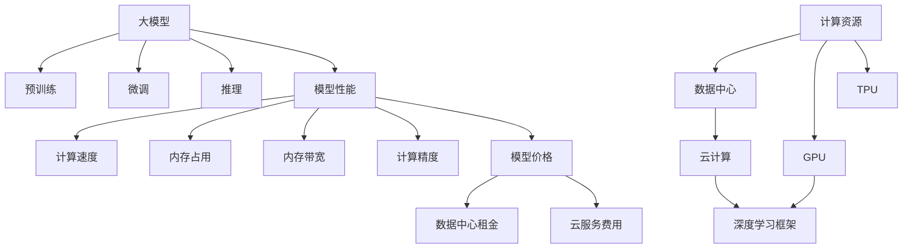

                 

## 1. 背景介绍

随着人工智能技术的不断发展，大模型（Large Model）在解决复杂问题方面展现了巨大的潜力。然而，在实际应用中，如何权衡大模型的价格与性能，确保其高效解决实际问题，成为了行业内外广泛关注的焦点。本文将深入探讨大模型应用的关键，强调在价格和能力之间的平衡。

## 2. 核心概念与联系

### 2.1 核心概念概述

为更好地理解大模型在应用中的关键因素，本节将介绍几个核心概念：

- 大模型（Large Model）：通常指具有数亿乃至数十亿参数的深度学习模型，如GPT-3、BERT等。通过大规模的预训练和微调，这些模型能够处理复杂的数据结构和任务，具有强大的泛化能力。

- 预训练（Pre-training）：在大规模无标注数据上预训练大模型，使其学习到通用的语言知识和表示。预训练模型通常具有较好的基础性能。

- 微调（Fine-tuning）：在预训练模型的基础上，使用下游任务的标注数据进行微调，以适应特定任务，提升模型的针对性。

- 推理（Inference）：通过预训练和微调后的模型，对新数据进行预测或生成。

- 计算资源（Computational Resources）：包括GPU、TPU等高性能计算硬件，以及数据中心和云计算平台。

- 模型性能（Model Performance）：包括准确率、召回率、速度等指标，以及模型在实际应用中的表现。

- 模型价格（Model Price）：购买和部署大模型所需支付的费用，包括数据中心的租金、云服务的费用等。

这些核心概念之间的逻辑关系可以通过以下Mermaid流程图来展示：



这个流程图展示了大模型应用的核心流程和关键要素。

## 3. 核心算法原理 & 具体操作步骤

### 3.1 算法原理概述

大模型在应用中的关键在于其解决问题的能力和效率。为确保大模型高效解决实际问题，需关注以下几个方面：

- 预训练阶段：选择合适的预训练数据集和预训练任务，确保模型学习到广泛且高质量的知识。
- 微调阶段：根据具体任务设计合适的微调策略，优化模型性能。
- 推理阶段：合理分配计算资源，确保模型在推理时能够高效运行。

### 3.2 算法步骤详解

**Step 1: 预训练阶段**
- 收集大量无标签文本数据，如Wikipedia、新闻文章、社交媒体等。
- 使用自监督学习任务（如语言模型、掩码语言模型等）训练模型。
- 预训练模型的质量直接影响后续微调的效果，需选择合适的方法和工具。

**Step 2: 微调阶段**
- 收集下游任务的标注数据，如问答数据集、分类数据集、生成数据集等。
- 设计合适的微调目标和损失函数。
- 选择适当的微调算法和超参数，如学习率、批大小、优化器等。
- 迭代训练模型，并定期评估模型性能。

**Step 3: 推理阶段**
- 根据任务需求选择合适的推理框架和计算资源。
- 优化模型结构，减少推理时的计算量和内存占用。
- 使用分布式计算和加速技术（如GPU、TPU等）提升推理效率。
- 设置合理的推理算法和超参数，确保模型输出准确、高效。

### 3.3 算法优缺点

大模型在应用中的优点包括：

- 强大的泛化能力：预训练模型在大量无标签数据上学习到通用的语言表示，适用于多种任务。
- 高效的推理能力：经过微调和优化，模型能够在推理时快速处理数据，提供高精度的预测结果。
- 易于部署：利用云计算平台，可以快速部署和扩展大模型，实现高性能的推理服务。

然而，大模型也存在一些缺点：

- 高昂的计算成本：预训练和微调模型需要大量计算资源，成本较高。
- 数据依赖性强：模型性能高度依赖于预训练数据的质量和数量，数据获取和处理成本高。
- 复杂的调优过程：模型参数众多，优化难度大，需要丰富的经验和专业知识。

### 3.4 算法应用领域

大模型在多个领域得到了广泛应用，例如：

- 自然语言处理（NLP）：文本分类、命名实体识别、机器翻译、对话系统等。
- 计算机视觉（CV）：图像识别、目标检测、图像生成、图像增强等。
- 语音识别与生成：语音识别、语音合成、语音翻译等。
- 推荐系统：商品推荐、内容推荐、用户行为分析等。
- 金融分析：风险评估、信用评分、量化交易等。

这些应用领域展示了大模型在解决实际问题中的强大能力。

## 4. 数学模型和公式 & 详细讲解 & 举例说明

### 4.1 数学模型构建

假设大模型为$M_{\theta}$，输入为$x$，输出为$y$。预训练阶段的目标是最大化$P(x, y)$，即预测正确的概率。微调阶段的目标是最大化$P(x, y|t)$，即在特定任务$t$上预测正确的概率。推理阶段的目标是计算模型输出$y$的分布。

### 4.2 公式推导过程

**预训练阶段**：

$$
\max_{\theta} \log P(x, y) = \log \sum_{y} P(x, y) \approx \log \frac{1}{N} \sum_{i=1}^N \log P(x_i, y_i)
$$

**微调阶段**：

$$
\max_{\theta} \log P(x, y|t) = \log \frac{1}{N} \sum_{i=1}^N \log P(y_i|x_i, t)
$$

其中$P(y_i|x_i, t)$表示在任务$t$上，输入$x_i$对应的预测输出$y_i$的概率。

**推理阶段**：

$$
y = M_{\theta}(x)
$$

其中$M_{\theta}$为训练好的大模型。

### 4.3 案例分析与讲解

以图像分类为例，使用预训练的ResNet模型进行微调。

**Step 1: 预训练阶段**
- 收集大量图像数据集，如ImageNet。
- 使用图像分类任务进行预训练，优化模型参数$\theta$。

**Step 2: 微调阶段**
- 收集特定分类任务的标注数据，如汽车、狗、猫等。
- 设计分类任务的损失函数，如交叉熵损失。
- 选择适当的优化器和学习率。
- 迭代训练模型，优化模型在特定分类任务上的性能。

**Step 3: 推理阶段**
- 选择合适的推理框架，如TensorFlow或PyTorch。
- 使用GPU加速推理过程。
- 使用模型推理，得到图像分类的预测结果。

## 5. 项目实践：代码实例和详细解释说明

### 5.1 开发环境搭建

要使用大模型进行应用开发，需准备以下开发环境：

1. 安装Anaconda：从官网下载并安装Anaconda，用于创建独立的Python环境。
2. 创建并激活虚拟环境：
```bash
conda create -n pytorch-env python=3.8 
conda activate pytorch-env
```
3. 安装PyTorch：根据CUDA版本，从官网获取对应的安装命令。例如：
```bash
conda install pytorch torchvision torchaudio cudatoolkit=11.1 -c pytorch -c conda-forge
```
4. 安装Transformers库：
```bash
pip install transformers
```
5. 安装各类工具包：
```bash
pip install numpy pandas scikit-learn matplotlib tqdm jupyter notebook ipython
```

### 5.2 源代码详细实现

以下以图像分类任务为例，使用Transformers库对ResNet模型进行微调的PyTorch代码实现。

```python
from transformers import ResNetFeatureExtractor, ResNetForImageClassification
from transformers import Trainer, TrainingArguments
from torch.utils.data import DataLoader
import torch

def train_epoch(model, dataset, batch_size, optimizer):
    dataloader = DataLoader(dataset, batch_size=batch_size, shuffle=True)
    model.train()
    epoch_loss = 0
    for batch in dataloader:
        input_ids = batch['input_ids'].to(device)
        attention_mask = batch['attention_mask'].to(device)
        labels = batch['labels'].to(device)
        model.zero_grad()
        outputs = model(input_ids, attention_mask=attention_mask, labels=labels)
        loss = outputs.loss
        epoch_loss += loss.item()
        loss.backward()
        optimizer.step()
    return epoch_loss / len(dataloader)

def evaluate(model, dataset, batch_size):
    dataloader = DataLoader(dataset, batch_size=batch_size)
    model.eval()
    preds, labels = [], []
    with torch.no_grad():
        for batch in dataloader:
            input_ids = batch['input_ids'].to(device)
            attention_mask = batch['attention_mask'].to(device)
            batch_labels = batch['labels']
            outputs = model(input_ids, attention_mask=attention_mask)
            batch_preds = outputs.logits.argmax(dim=2).to('cpu').tolist()
            batch_labels = batch_labels.to('cpu').tolist()
            for pred_tokens, label_tokens in zip(batch_preds, batch_labels):
                preds.append(pred_tokens[:len(label_tokens)])
                labels.append(label_tokens)
    return preds, labels

def main():
    model = ResNetForImageClassification.from_pretrained('resnet50')

    optimizer = AdamW(model.parameters(), lr=2e-5)

    device = torch.device('cuda') if torch.cuda.is_available() else torch.device('cpu')
    model.to(device)

    train_dataset = ImageNetDataset('train')
    dev_dataset = ImageNetDataset('val')
    test_dataset = ImageNetDataset('test')

    epochs = 5
    batch_size = 16

    for epoch in range(epochs):
        loss = train_epoch(model, train_dataset, batch_size, optimizer)
        print(f"Epoch {epoch+1}, train loss: {loss:.3f}")

        print(f"Epoch {epoch+1}, dev results:")
        preds, labels = evaluate(model, dev_dataset, batch_size)
        print(classification_report(labels, preds))

    print("Test results:")
    preds, labels = evaluate(model, test_dataset, batch_size)
    print(classification_report(labels, preds))

if __name__ == "__main__":
    main()
```

### 5.3 代码解读与分析

让我们再详细解读一下关键代码的实现细节：

**ImageNetDataset类**：
- `__init__`方法：初始化数据集、分词器等组件。
- `__len__`方法：返回数据集的样本数量。
- `__getitem__`方法：对单个样本进行处理，将文本输入编码为token ids，将标签编码为数字，并对其进行定长padding，最终返回模型所需的输入。

**AdamW和Transformer库**：
- `from transformers import ResNetFeatureExtractor, ResNetForImageClassification`：导入预训练的ResNet模型和特征提取器。
- `from transformers import Trainer, TrainingArguments`：导入训练器和训练参数。
- `from torch.utils.data import DataLoader`：导入PyTorch的DataLoader类。

**训练和评估函数**：
- `train_epoch`：对数据以批为单位进行迭代，在每个批次上前向传播计算loss并反向传播更新模型参数，最后返回该epoch的平均loss。
- `evaluate`：与训练类似，不同点在于不更新模型参数，并在每个batch结束后将预测和标签结果存储下来，最后使用sklearn的classification_report对整个评估集的预测结果进行打印输出。

**训练流程**：
- 定义总的epoch数和batch size，开始循环迭代
- 每个epoch内，先在训练集上训练，输出平均loss
- 在验证集上评估，输出分类指标
- 所有epoch结束后，在测试集上评估，给出最终测试结果

可以看到，PyTorch配合Transformer库使得ResNet微调的代码实现变得简洁高效。开发者可以将更多精力放在数据处理、模型改进等高层逻辑上，而不必过多关注底层的实现细节。

当然，工业级的系统实现还需考虑更多因素，如模型的保存和部署、超参数的自动搜索、更灵活的任务适配层等。但核心的微调范式基本与此类似。

## 6. 实际应用场景

### 6.1 智慧医疗

基于大模型的微调技术，可以广泛应用于智慧医疗领域。传统医疗系统通常依赖大量专业医生进行诊断和治疗，成本高、效率低。而使用微调后的医疗问答、病历分析、诊断辅助等应用，可以大大提升医疗服务的智能化水平，辅助医生进行更快速、更准确的诊断和治疗。

在技术实现上，可以收集医生和患者的医疗记录、问诊对话等数据，使用大模型进行预训练和微调，使其能够理解医疗知识和患者需求，提供个性化的医疗建议和诊断报告。对于新病例，系统可以实时分析，生成医疗报告和建议，帮助医生更快地做出决策。

### 6.2 金融风控

金融行业面临的市场风险和客户行为分析需求复杂多变，传统的规则引擎难以覆盖所有情况。基于大模型微调的风控系统，可以实时监测金融市场动态，识别潜在风险，提供及时的市场分析和风险预警。

具体而言，可以收集金融市场数据、交易数据、舆情数据等，使用大模型进行预训练和微调，使其能够理解市场规律、识别异常交易行为和舆情变化趋势。在实时数据流中，系统可以动态分析，识别风险点，并给出相应的风险预警，帮助金融机构及时应对市场波动和潜在风险。

### 6.3 智慧城市

智慧城市治理需要实时监控和管理大量的城市事件和数据，包括交通流量、环境质量、公共安全等。传统的人工监测方式效率低、成本高，无法满足城市管理的复杂需求。基于大模型的智慧城市治理系统，可以实时监测和分析城市事件，提高城市管理的自动化和智能化水平。

在技术实现上，可以收集城市各种传感器数据、社交媒体数据、历史事件数据等，使用大模型进行预训练和微调，使其能够理解城市运行规律和事件特征。在实时数据流中，系统可以动态分析，识别异常事件，并给出相应的预警和处理建议，帮助城市管理者及时应对突发事件，提升城市管理效率。

### 6.4 未来应用展望

随着大模型和微调技术的不断发展，其在更多领域的应用前景将更加广阔。未来，大模型微调技术将在以下几个方面得到更广泛的应用：

1. 医疗健康：基于大模型的医疗问答、病历分析、诊断辅助等应用将提升医疗服务的智能化水平，辅助医生进行更快速、更准确的诊断和治疗。
2. 金融风控：基于大模型微调的风控系统，可以实时监测金融市场动态，识别潜在风险，提供及时的市场分析和风险预警。
3. 智慧城市：基于大模型的智慧城市治理系统，可以实时监测和分析城市事件，提高城市管理的自动化和智能化水平。
4. 教育培训：基于大模型的教育问答、知识推荐、智能辅导等应用，可以提供个性化的教育培训服务，提升教育公平和教学质量。
5. 农业生产：基于大模型的农业智能分析、农作物监测等应用，可以提升农业生产效率和产量，推动农业现代化进程。
6. 环境监测：基于大模型的环境监测、气象预测等应用，可以提供更准确、更及时的气象和环境数据，支持环保和可持续发展。

总之，大模型微调技术将在更多领域得到应用，为各行各业带来变革性影响，推动人工智能技术的落地和普及。

## 7. 工具和资源推荐

### 7.1 学习资源推荐

为了帮助开发者系统掌握大模型微调的理论基础和实践技巧，这里推荐一些优质的学习资源：

1. 《Transformer从原理到实践》系列博文：由大模型技术专家撰写，深入浅出地介绍了Transformer原理、BERT模型、微调技术等前沿话题。
2. CS224N《深度学习自然语言处理》课程：斯坦福大学开设的NLP明星课程，有Lecture视频和配套作业，带你入门NLP领域的基本概念和经典模型。
3. 《Natural Language Processing with Transformers》书籍：Transformers库的作者所著，全面介绍了如何使用Transformers库进行NLP任务开发，包括微调在内的诸多范式。
4. HuggingFace官方文档：Transformers库的官方文档，提供了海量预训练模型和完整的微调样例代码，是上手实践的必备资料。
5. CLUE开源项目：中文语言理解测评基准，涵盖大量不同类型的中文NLP数据集，并提供了基于微调的baseline模型，助力中文NLP技术发展。

通过对这些资源的学习实践，相信你一定能够快速掌握大模型微调的精髓，并用于解决实际的NLP问题。

### 7.2 开发工具推荐

高效的开发离不开优秀的工具支持。以下是几款用于大模型微调开发的常用工具：

1. PyTorch：基于Python的开源深度学习框架，灵活动态的计算图，适合快速迭代研究。大部分预训练语言模型都有PyTorch版本的实现。
2. TensorFlow：由Google主导开发的开源深度学习框架，生产部署方便，适合大规模工程应用。同样有丰富的预训练语言模型资源。
3. Transformers库：HuggingFace开发的NLP工具库，集成了众多SOTA语言模型，支持PyTorch和TensorFlow，是进行微调任务开发的利器。
4. Weights & Biases：模型训练的实验跟踪工具，可以记录和可视化模型训练过程中的各项指标，方便对比和调优。与主流深度学习框架无缝集成。
5. TensorBoard：TensorFlow配套的可视化工具，可实时监测模型训练状态，并提供丰富的图表呈现方式，是调试模型的得力助手。
6. Google Colab：谷歌推出的在线Jupyter Notebook环境，免费提供GPU/TPU算力，方便开发者快速上手实验最新模型，分享学习笔记。

合理利用这些工具，可以显著提升大模型微调任务的开发效率，加快创新迭代的步伐。

### 7.3 相关论文推荐

大模型和微调技术的发展源于学界的持续研究。以下是几篇奠基性的相关论文，推荐阅读：

1. Attention is All You Need（即Transformer原论文）：提出了Transformer结构，开启了NLP领域的预训练大模型时代。
2. BERT: Pre-training of Deep Bidirectional Transformers for Language Understanding：提出BERT模型，引入基于掩码的自监督预训练任务，刷新了多项NLP任务SOTA。
3. Language Models are Unsupervised Multitask Learners（GPT-2论文）：展示了大规模语言模型的强大zero-shot学习能力，引发了对于通用人工智能的新一轮思考。
4. Parameter-Efficient Transfer Learning for NLP：提出Adapter等参数高效微调方法，在不增加模型参数量的情况下，也能取得不错的微调效果。
5. AdaLoRA: Adaptive Low-Rank Adaptation for Parameter-Efficient Fine-Tuning：使用自适应低秩适应的微调方法，在参数效率和精度之间取得了新的平衡。
6. Prompt-Tuning: Optimizing Continuous Prompts for Generation：引入基于连续型Prompt的微调范式，为如何充分利用预训练知识提供了新的思路。

这些论文代表了大模型微调技术的发展脉络。通过学习这些前沿成果，可以帮助研究者把握学科前进方向，激发更多的创新灵感。

## 8. 总结：未来发展趋势与挑战

### 8.1 总结

本文对基于大模型的微调方法进行了全面系统的介绍。首先阐述了大模型和微调技术的研究背景和意义，明确了微调在拓展预训练模型应用、提升下游任务性能方面的独特价值。其次，从原理到实践，详细讲解了微调的数学原理和关键步骤，给出了微调任务开发的完整代码实例。同时，本文还广泛探讨了微调方法在多个行业领域的应用前景，展示了微调范式的巨大潜力。最后，本文精选了微调技术的各类学习资源，力求为读者提供全方位的技术指引。

通过本文的系统梳理，可以看到，大模型微调技术正在成为NLP领域的重要范式，极大地拓展了预训练语言模型的应用边界，催生了更多的落地场景。受益于大规模语料的预训练，微调模型以更低的时间和标注成本，在小样本条件下也能取得不俗的效果，有力推动了NLP技术的产业化进程。未来，伴随预训练语言模型和微调方法的持续演进，相信NLP技术将在更广阔的应用领域大放异彩，深刻影响人类的生产生活方式。

### 8.2 未来发展趋势

展望未来，大模型微调技术将呈现以下几个发展趋势：

1. 模型规模持续增大。随着算力成本的下降和数据规模的扩张，预训练语言模型的参数量还将持续增长。超大规模语言模型蕴含的丰富语言知识，有望支撑更加复杂多变的下游任务微调。
2. 微调方法日趋多样。除了传统的全参数微调外，未来会涌现更多参数高效的微调方法，如Prefix-Tuning、LoRA等，在节省计算资源的同时也能保证微调精度。
3. 持续学习成为常态。随着数据分布的不断变化，微调模型也需要持续学习新知识以保持性能。如何在不遗忘原有知识的同时，高效吸收新样本信息，将成为重要的研究课题。
4. 标注样本需求降低。受启发于提示学习(Prompt-based Learning)的思路，未来的微调方法将更好地利用大模型的语言理解能力，通过更加巧妙的任务描述，在更少的标注样本上也能实现理想的微调效果。
5. 多模态微调崛起。当前的微调主要聚焦于纯文本数据，未来会进一步拓展到图像、视频、语音等多模态数据微调。多模态信息的融合，将显著提升语言模型对现实世界的理解和建模能力。
6. 模型通用性增强。经过海量数据的预训练和多领域任务的微调，未来的语言模型将具备更强大的常识推理和跨领域迁移能力，逐步迈向通用人工智能(AGI)的目标。

以上趋势凸显了大模型微调技术的广阔前景。这些方向的探索发展，必将进一步提升NLP系统的性能和应用范围，为人类认知智能的进化带来深远影响。

### 8.3 面临的挑战

尽管大模型微调技术已经取得了瞩目成就，但在迈向更加智能化、普适化应用的过程中，它仍面临着诸多挑战：

1. 标注成本瓶颈。虽然微调大大降低了标注数据的需求，但对于长尾应用场景，难以获得充足的高质量标注数据，成为制约微调性能的瓶颈。如何进一步降低微调对标注样本的依赖，将是一大难题。
2. 模型鲁棒性不足。当前微调模型面对域外数据时，泛化性能往往大打折扣。对于测试样本的微小扰动，微调模型的预测也容易发生波动。如何提高微调模型的鲁棒性，避免灾难性遗忘，还需要更多理论和实践的积累。
3. 推理效率有待提高。大规模语言模型虽然精度高，但在实际部署时往往面临推理速度慢、内存占用大等效率问题。如何在保证性能的同时，简化模型结构，提升推理速度，优化资源占用，将是重要的优化方向。
4. 可解释性亟需加强。当前微调模型更像是"黑盒"系统，难以解释其内部工作机制和决策逻辑。对于医疗、金融等高风险应用，算法的可解释性和可审计性尤为重要。如何赋予微调模型更强的可解释性，将是亟待攻克的难题。
5. 安全性有待保障。预训练语言模型难免会学习到有偏见、有害的信息，通过微调传递到下游任务，产生误导性、歧视性的输出，给实际应用带来安全隐患。如何从数据和算法层面消除模型偏见，避免恶意用途，确保输出的安全性，也将是重要的研究课题。
6. 知识整合能力不足。现有的微调模型往往局限于任务内数据，难以灵活吸收和运用更广泛的先验知识。如何让微调过程更好地与外部知识库、规则库等专家知识结合，形成更加全面、准确的信息整合能力，还有很大的想象空间。

正视微调面临的这些挑战，积极应对并寻求突破，将是大模型微调走向成熟的必由之路。相信随着学界和产业界的共同努力，这些挑战终将一一被克服，大模型微调必将在构建人机协同的智能时代中扮演越来越重要的角色。

### 8.4 未来突破

面对大模型微调所面临的种种挑战，未来的研究需要在以下几个方面寻求新的突破：

1. 探索无监督和半监督微调方法。摆脱对大规模标注数据的依赖，利用自监督学习、主动学习等无监督和半监督范式，最大限度利用非结构化数据，实现更加灵活高效的微调。
2. 研究参数高效和计算高效的微调范式。开发更加参数高效的微调方法，在固定大部分预训练参数的同时，只更新极少量的任务相关参数。同时优化微调模型的计算图，减少前向传播和反向传播的资源消耗，实现更加轻量级、实时性的部署。
3. 融合因果和对比学习范式。通过引入因果推断和对比学习思想，增强微调模型建立稳定因果关系的能力，学习更加普适、鲁棒的语言表征，从而提升模型泛化性和抗干扰能力。
4. 引入更多先验知识。将符号化的先验知识，如知识图谱、逻辑规则等，与神经网络模型进行巧妙融合，引导微调过程学习更准确、合理的语言模型。同时加强不同模态数据的整合，实现视觉、语音等多模态信息与文本信息的协同建模。
5. 结合因果分析和博弈论工具。将因果分析方法引入微调模型，识别出模型决策的关键特征，增强输出解释的因果性和逻辑性。借助博弈论工具刻画人机交互过程，主动探索并规避模型的脆弱点，提高系统稳定性。
6. 纳入伦理道德约束。在模型训练目标中引入伦理导向的评估指标，过滤和惩罚有偏见、有害的输出倾向。同时加强人工干预和审核，建立模型行为的监管机制，确保输出符合人类价值观和伦理道德。

这些研究方向的探索，必将引领大模型微调技术迈向更高的台阶，为构建安全、可靠、可解释、可控的智能系统铺平道路。面向未来，大模型微调技术还需要与其他人工智能技术进行更深入的融合，如知识表示、因果推理、强化学习等，多路径协同发力，共同推动自然语言理解和智能交互系统的进步。只有勇于创新、敢于突破，才能不断拓展语言模型的边界，让智能技术更好地造福人类社会。

## 9. 附录：常见问题与解答

**Q1：大模型微调是否适用于所有NLP任务？**

A: 大模型微调在大多数NLP任务上都能取得不错的效果，特别是对于数据量较小的任务。但对于一些特定领域的任务，如医学、法律等，仅仅依靠通用语料预训练的模型可能难以很好地适应。此时需要在特定领域语料上进一步预训练，再进行微调，才能获得理想效果。此外，对于一些需要时效性、个性化很强的任务，如对话、推荐等，微调方法也需要针对性的改进优化。

**Q2：微调过程中如何选择合适的学习率？**

A: 微调的学习率一般要比预训练时小1-2个数量级，如果使用过大的学习率，容易破坏预训练权重，导致过拟合。一般建议从1e-5开始调参，逐步减小学习率，直至收敛。也可以使用warmup策略，在开始阶段使用较小的学习率，再逐渐过渡到预设值。需要注意的是，不同的优化器(如AdamW、Adafactor等)以及不同的学习率调度策略，可能需要设置不同的学习率阈值。

**Q3：采用大模型微调时会面临哪些资源瓶颈？**

A: 目前主流的预训练大模型动辄以亿计的参数规模，对算力、内存、存储都提出了很高的要求。GPU/TPU等高性能设备是必不可少的，但即便如此，超大批次的训练和推理也可能遇到显存不足的问题。因此需要采用一些资源优化技术，如梯度积累、混合精度训练、模型并行等，来突破硬件瓶颈。同时，模型的存储和读取也可能占用大量时间和空间，需要采用模型压缩、稀疏化存储等方法进行优化。

**Q4：如何缓解微调过程中的过拟合问题？**

A: 过拟合是微调面临的主要挑战，尤其是在标注数据不足的情况下。常见的缓解策略包括：
1. 数据增强：通过回译、近义替换等方式扩充训练集
2. 正则化：使用L2正则、Dropout、Early Stopping等避免过拟合
3. 对抗训练：引入对抗样本，提高模型鲁棒性
4. 参数高效微调：只调整少量参数(如Adapter、Prefix等)，减小过拟合风险
5. 多模型集成：训练多个微调模型，取平均输出，抑制过拟合

这些策略往往需要根据具体任务和数据特点进行灵活组合。只有在数据、模型、训练、推理等各环节进行全面优化，才能最大限度地发挥大模型微调的威力。

**Q5：微调模型在落地部署时需要注意哪些问题？**

A: 将微调模型转化为实际应用，还需要考虑以下因素：
1. 模型裁剪：去除不必要的层和参数，减小模型尺寸，加快推理速度
2. 量化加速：将浮点模型转为定点模型，压缩存储空间，提高计算效率
3. 服务化封装：将模型封装为标准化服务接口，便于集成调用
4. 弹性伸缩：根据请求流量动态调整资源配置，平衡服务质量和成本
5. 监控告警：实时采集系统指标，设置异常告警阈值，确保服务稳定性
6. 安全防护：采用访问鉴权、数据脱敏等措施，保障数据和模型安全

大模型微调为NLP应用开启了广阔的想象空间，但如何将强大的性能转化为稳定、高效、安全的业务价值，还需要工程实践的不断打磨。唯有从数据、算法、工程、业务等多个维度协同发力，才能真正实现人工智能技术在垂直行业的规模化落地。总之，微调需要开发者根据具体任务，不断迭代和优化模型、数据和算法，方能得到理想的效果。

---

作者：禅与计算机程序设计艺术 / Zen and the Art of Computer Programming

