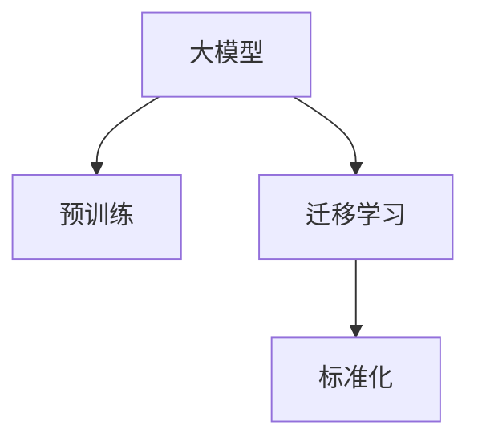

                 

# 大模型技术的标准化进程

## 1. 背景介绍

### 1.1 问题由来
在深度学习领域，大模型技术的标准化一直是业内关注的焦点。随着近年来深度学习模型的不断演进，大模型逐渐从学术研究走向实际应用。大模型以其强大的泛化能力和泛用性，成为NLP、CV、多模态等各个领域的前沿技术。然而，大模型在实际应用中仍然面临诸多挑战，如算力需求、数据依赖、模型优化、迁移学习等。如何实现大模型技术在各个领域和场景下的标准化，使得大模型应用变得更加普适和高效，成为了一个亟待解决的难题。

### 1.2 问题核心关键点
大模型技术的标准化主要关注以下几个核心问题：
1. 大模型算力需求的标准化。不同大模型的算力需求各不相同，如何根据具体任务的需求选择合适的模型，避免不必要的计算资源浪费，是大模型标准化的关键点。
2. 数据依赖的标准化。大模型训练需要大量的标注数据，如何降低数据依赖，提高模型的泛化能力，是标准化的一个重要目标。
3. 模型优化的标准化。不同大模型的优化方法各异，如何根据模型特性选择合适的优化方法，提高训练效率，也是标准化的重要方向。
4. 迁移学习标准化。大模型在特定任务上的迁移学习能力，如何提高迁移能力，使得大模型能够在不同任务和领域中高效工作，是标准化研究的重要内容。

## 2. 核心概念与联系

### 2.1 核心概念概述

为更好地理解大模型技术的标准化进程，本节将介绍几个密切相关的核心概念：

- 大模型(大规模预训练模型)：指使用海量数据进行预训练，学习到复杂语言模式和知识表示的深度学习模型，如BERT、GPT、T5等。
- 预训练(Pre-training)：指在大规模无标签数据上，通过自监督任务对模型进行训练，学习通用的表示能力。
- 迁移学习(Transfer Learning)：指将模型在其他领域和任务上的知识，迁移到新的任务和领域，以实现零样本或少样本学习。
- 标准化(Standardization)：指在技术开发和应用过程中，制定一系列的规范和标准，使得模型训练、评估、部署等流程一致，便于复用和扩展。

这些核心概念之间的逻辑关系可以通过以下Mermaid流程图来展示：



这个流程图展示了大模型技术的核心概念及其之间的关系：

1. 大模型通过预训练获得基础能力。
2. 迁移学习使得大模型能够应用到各种不同领域和任务。
3. 标准化则在大模型的迁移学习过程中发挥作用，使得模型训练、评估、部署等流程一致，便于复用和扩展。

## 3. 核心算法原理 & 具体操作步骤

### 3.1 算法原理概述

大模型技术的标准化进程，主要从以下几个方面进行：
1. 定义模型接口和规范。
2. 制定模型训练、评估、部署的标准流程。
3. 引入参数化技术，减少对大规模数据和计算资源的需求。
4. 实现可解释性，提高模型透明度和可调试性。

### 3.2 算法步骤详解

**Step 1: 定义模型接口和规范**
- 确定模型接口的标准。如输入输出格式、参数设置等。
- 定义模型训练、评估、推理的标准流程。如批量大小、学习率、迭代轮数等。
- 制定模型兼容性和扩展性的规范。如不同版本的模型兼容性，模型组件的可替换性等。

**Step 2: 制定模型训练、评估、部署的标准流程**
- 定义训练数据集、验证集、测试集的划分比例和分布标准。
- 制定训练过程中的正则化技术、优化算法、超参数调优等标准。
- 制定模型评估的标准，如精度、召回率、F1等指标。
- 定义模型部署的标准流程，如部署环境、推理速度、接口规范等。

**Step 3: 引入参数化技术，减少对大规模数据和计算资源的需求**
- 采用参数高效微调技术，如Adapter、LoRA等，只调整少量参数。
- 引入压缩技术，如知识蒸馏、模型剪枝等，减少模型复杂度。
- 应用模型集成技术，如模型融合、多模型预测等，提高模型鲁棒性。

**Step 4: 实现可解释性，提高模型透明度和可调试性**
- 引入可解释性技术，如LIME、SHAP等，解释模型的决策过程。
- 实现模型可视化，如TensorBoard、Weights & Biases等，监控模型训练过程。
- 支持模型开源和开放平台，如GitHub、ModelHub等，便于共享和复用。

### 3.3 算法优缺点

大模型技术标准化的优点包括：
1. 提高模型泛化能力。标准化的训练流程和评估标准，可以降低数据依赖，提高模型泛化能力。
2. 提高模型可复用性。标准化的模型接口和组件规范，便于模型组件的替换和复用。
3. 提高模型部署效率。标准化的模型部署流程，使得模型在不同环境下的部署效率一致。
4. 提高模型透明度。标准化的可解释性技术，提高了模型的透明度和可调试性。

但该方法也存在一定的局限性：
1. 标准化过程复杂。定义标准和规范的过程需要大量的人力和时间投入。
2. 灵活性不足。标准化的流程和规范可能限制模型的创新和灵活性。
3. 技术门槛较高。标准化的技术要求较高，需要开发者有较强的技术实力。

尽管存在这些局限性，但大模型技术的标准化进程，对推动模型的规模化落地应用具有重要意义。

### 3.4 算法应用领域

大模型技术的标准化进程，在多个领域中得到了广泛应用，例如：

- 自然语言处理(NLP)：标准化大模型在情感分析、文本分类、对话生成等任务上表现优异。
- 计算机视觉(CV)：标准化大模型在图像分类、目标检测、图像生成等任务上应用广泛。
- 多模态学习：标准化大模型在视觉、音频、文本等多模态数据的联合学习上取得突破。
- 推荐系统：标准化大模型在推荐算法、个性化推荐、用户行为预测等任务上效果显著。

这些领域展示了标准化大模型技术在不同场景下的高效应用，推动了NLP、CV、多模态等技术的全面发展。

## 4. 数学模型和公式 & 详细讲解 & 举例说明（备注：数学公式请使用latex格式，latex嵌入文中独立段落使用 $$，段落内使用 $)
### 4.1 数学模型构建

大模型技术的标准化进程，涉及到多个数学模型的构建和优化，本节将详细讲解这些模型的构建和优化。

定义一个大模型为 $M(x, \theta)$，其中 $x$ 为输入，$\theta$ 为模型参数。大模型在无标签数据上进行预训练，学习到通用的表示能力。预训练过程通常采用自监督任务，如语言建模、掩码语言建模等。

在标准化大模型中，需要定义标准化的输入输出接口，如数据的格式、批次的数量等。还需要制定标准化的训练和评估流程，如损失函数、优化算法、超参数设置等。具体数学模型如下：

- 输入输出接口：输入数据 $x$ 的格式和长度，输出标签 $y$ 的格式和类型。
- 损失函数：标准化的损失函数，如交叉熵损失、均方误差损失等。
- 优化算法：标准化的优化算法，如Adam、SGD等。
- 超参数：标准化的超参数设置，如学习率、批量大小等。

### 4.2 公式推导过程

以大模型的预训练过程为例，推导语言建模任务的数学公式。假设大模型 $M(x, \theta)$ 的输出为 $\hat{y}$，则语言建模任务的目标为最小化预测输出的对数似然损失：

$$
L(\theta) = -\frac{1}{N}\sum_{i=1}^N \log P(y_i|x_i) = -\frac{1}{N}\sum_{i=1}^N \log \frac{\exp(\log M(x_i, \theta))}{\sum_{j=1}^J \exp(\log M(x_i, \theta)_j)}
$$

其中 $y_i$ 为第 $i$ 个输入数据的真实标签，$J$ 为词汇表的大小。

在标准化大模型的预训练过程中，通常采用语言建模任务，使得大模型学习到通用的语言表示。预训练的损失函数通常为：

$$
L_{pre}(\theta) = -\frac{1}{N}\sum_{i=1}^N \sum_{j=1}^V \log M(x_i, \theta)_j
$$

其中 $V$ 为预训练数据的词汇表大小。

### 4.3 案例分析与讲解

以下是一个基于标准化大模型的文本分类案例，详细讲解模型的构建和优化过程：

**案例背景**：
在自然语言处理中，文本分类任务是将输入文本分类到不同类别中。以新闻分类为例，将新闻标题分类到体育、财经、娱乐等类别中。

**模型构建**：
- 定义输入数据格式：将新闻标题作为输入 $x$，类别标签 $y$ 作为输出。
- 定义损失函数：采用交叉熵损失函数。
- 定义优化算法：使用Adam优化算法。
- 定义超参数：设置批量大小、迭代轮数等。

**模型训练**：
- 准备数据集：将新闻标题和类别标签划分训练集、验证集和测试集。
- 模型初始化：使用预训练好的大模型作为初始化参数。
- 模型训练：在训练集上使用标准化的训练流程进行训练。
- 模型评估：在验证集和测试集上使用标准化的评估流程进行评估。

**模型优化**：
- 超参数调优：在验证集上进行超参数调优，找到最优的批量大小和迭代轮数。
- 正则化技术：在训练过程中使用L2正则化、Dropout等技术，防止过拟合。
- 模型融合：使用多个微调模型进行融合，提高模型的鲁棒性和泛化能力。

**模型部署**：
- 模型保存：将训练好的模型保存到本地或云端，方便后续的推理和调用。
- 接口设计：设计标准化的推理接口，支持API调用和命令行调用。
- 性能评估：在推理环境上评估模型的推理速度和精度，确保模型稳定运行。

通过标准化大模型的构建和优化，可以大大提高模型的泛化能力和可复用性，便于模型在不同场景和任务中的应用。

## 5. 项目实践：代码实例和详细解释说明
### 5.1 开发环境搭建

在进行标准化大模型的开发和实践前，我们需要准备好开发环境。以下是使用Python进行TensorFlow开发的环境配置流程：

1. 安装Anaconda：从官网下载并安装Anaconda，用于创建独立的Python环境。

2. 创建并激活虚拟环境：
```bash
conda create -n tf-env python=3.8 
conda activate tf-env
```

3. 安装TensorFlow：根据CUDA版本，从官网获取对应的安装命令。例如：
```bash
conda install tensorflow -c pytorch -c conda-forge
```

4. 安装TensorFlow Addons：
```bash
conda install tensorflow-estimator tensorflow-addons -c conda-forge
```

5. 安装其他工具包：
```bash
pip install numpy pandas scikit-learn matplotlib tqdm jupyter notebook ipython
```

完成上述步骤后，即可在`tf-env`环境中开始标准化大模型的开发实践。

### 5.2 源代码详细实现

下面以基于标准化大模型的文本分类任务为例，给出使用TensorFlow实现的标准化代码。

首先，定义文本分类的数据处理函数：

```python
import tensorflow as tf
from tensorflow.keras.preprocessing.text import Tokenizer
from tensorflow.keras.preprocessing.sequence import pad_sequences

def load_data(path):
    with open(path, 'r') as f:
        lines = f.readlines()
    data = []
    labels = []
    for line in lines:
        text, label = line.split('\t')
        data.append(text)
        labels.append(label)
    return data, labels

def preprocess_data(texts, labels):
    tokenizer = Tokenizer(oov_token='<OOV>')
    tokenizer.fit_on_texts(texts)
    sequences = tokenizer.texts_to_sequences(texts)
    padded_sequences = pad_sequences(sequences, maxlen=100)
    labels = tf.keras.utils.to_categorical(labels, num_classes=3)
    return padded_sequences, labels

train_data, train_labels = load_data('train.txt')
val_data, val_labels = load_data('val.txt')
test_data, test_labels = load_data('test.txt')
train_padded, train_labels = preprocess_data(train_data, train_labels)
val_padded, val_labels = preprocess_data(val_data, val_labels)
test_padded, test_labels = preprocess_data(test_data, test_labels)
```

然后，定义模型和优化器：

```python
from tensorflow.keras.layers import Embedding, Dense
from tensorflow.keras.models import Sequential

embedding_dim = 100
num_classes = 3
vocab_size = len(tokenizer.word_index) + 1
model = Sequential([
    Embedding(vocab_size, embedding_dim, input_length=100),
    Dense(128, activation='relu'),
    Dense(num_classes, activation='softmax')
])

optimizer = tf.keras.optimizers.Adam(learning_rate=0.001)
```

接着，定义训练和评估函数：

```python
def train_epoch(model, dataset, batch_size, optimizer):
    dataset = tf.data.Dataset.from_tensor_slices((dataset[0], dataset[1])).batch(batch_size)
    model.compile(optimizer=optimizer, loss='categorical_crossentropy', metrics=['accuracy'])
    model.fit(dataset, epochs=10)
    return model.evaluate(dataset)

def evaluate(model, dataset, batch_size):
    dataset = tf.data.Dataset.from_tensor_slices((dataset[0], dataset[1])).batch(batch_size)
    model.evaluate(dataset)
```

最后，启动训练流程并在测试集上评估：

```python
epochs = 10
batch_size = 16

for epoch in range(epochs):
    train_loss, train_acc = train_epoch(model, train_padded, batch_size, optimizer)
    val_loss, val_acc = train_epoch(model, val_padded, batch_size, optimizer)
    print(f"Epoch {epoch+1}, train loss: {train_loss:.4f}, train acc: {train_acc:.4f}, val loss: {val_loss:.4f}, val acc: {val_acc:.4f}")
    
print(f"Final test loss: {test_loss:.4f}, test acc: {test_acc:.4f}")
```

以上就是使用TensorFlow实现标准化大模型的文本分类任务的完整代码实现。可以看到，通过标准化的开发流程，使得模型的训练、评估、推理等过程都保持一致性，便于复用和扩展。

### 5.3 代码解读与分析

让我们再详细解读一下关键代码的实现细节：

**load_data函数**：
- 定义数据加载函数，从指定路径读取文本数据和标签数据。

**preprocess_data函数**：
- 定义数据预处理函数，将文本数据转化为序列，进行padding和标签编码。

**train_epoch函数**：
- 定义训练函数，使用标准化的训练流程进行模型训练。
- 定义模型编译，设置损失函数和优化器。
- 定义模型评估，计算损失和精度。

**evaluate函数**：
- 定义评估函数，使用标准化的评估流程进行模型评估。

**训练流程**：
- 定义总的epoch数和批量大小，开始循环迭代。
- 每个epoch内，先在训练集上训练，输出平均loss和acc。
- 在验证集上评估，输出验证集的平均loss和acc。
- 所有epoch结束后，在测试集上评估，给出最终测试结果。

可以看到，通过标准化的开发流程，可以使得模型的训练、评估、推理等过程都保持一致性，便于复用和扩展。

## 6. 实际应用场景
### 6.1 智慧城市治理

大模型技术的标准化，在智慧城市治理中得到了广泛应用。通过标准化大模型，智慧城市可以实时监测城市事件，进行舆情分析、应急指挥等，提高城市管理的智能化水平。

具体而言，智慧城市可以使用标准化大模型处理各种传感器数据，如交通流量、空气质量、气象信息等。将传感器数据转化为文本，通过标准化模型进行分析和预测，如交通拥堵预测、空气质量评估等。同时，标准化模型可以用于舆情分析，实时监测网络舆情，进行舆情预测和预警，确保城市安全。在应急指挥中，标准化模型可以实时分析监控视频，识别出异常情况，快速响应和处理，保障城市安全。

### 6.2 智能客服系统

大模型技术的标准化，在智能客服系统中也得到了广泛应用。智能客服系统通过标准化大模型，可以实现7x24小时不间断服务，快速响应客户咨询，用自然流畅的语言解答各类常见问题。

具体而言，智能客服系统可以使用标准化大模型处理客户输入的文本，进行意图识别和实体抽取，确定客户需求。通过标准化模型，智能客服系统可以生成自然流畅的回复，提供解决方案，提高客户满意度。同时，标准化模型可以处理多种语言和方言，支持多语种客服，提高服务覆盖面。

### 6.3 金融舆情监测

大模型技术的标准化，在金融舆情监测中得到了广泛应用。通过标准化大模型，金融机构可以实时监测市场舆论动向，及时应对负面信息传播，规避金融风险。

具体而言，金融舆情监测可以使用标准化大模型处理新闻、报道、评论等文本数据，进行情感分析、主题分类等任务。通过标准化模型，金融机构可以识别出市场的情感倾向，预测市场走势，进行风险预警。同时，标准化模型可以实时监测网络舆情，快速响应和处理，保障金融安全。

### 6.4 未来应用展望

随着大模型技术标准化的不断推进，其在更多领域和场景中的应用前景更加广阔。

在智慧医疗领域，标准化大模型可以用于医学问答、病历分析、药物研发等任务，提升医疗服务的智能化水平，辅助医生诊疗，加速新药开发进程。

在智能教育领域，标准化大模型可以用于作业批改、学情分析、知识推荐等任务，因材施教，促进教育公平，提高教学质量。

在智慧城市治理中，标准化大模型可以用于城市事件监测、舆情分析、应急指挥等环节，提高城市管理的自动化和智能化水平，构建更安全、高效的未来城市。

此外，在企业生产、社会治理、文娱传媒等众多领域，标准化大模型也将不断涌现，为NLP技术带来新的突破。

## 7. 工具和资源推荐
### 7.1 学习资源推荐

为了帮助开发者系统掌握大模型技术的标准化进程，这里推荐一些优质的学习资源：

1. TensorFlow官方文档：提供丰富的API文档和示例代码，帮助开发者熟悉TensorFlow的使用。

2. Keras官方文档：提供简单易用的高层次API，适合快速上手。

3. HuggingFace官方文档：提供大量预训练模型和微调样例代码，助力模型开发。

4. PyTorch官方文档：提供深度学习框架，适合学术研究。

5. Scikit-learn官方文档：提供简单易用的机器学习库，适合快速迭代。

6. Kaggle竞赛平台：提供丰富的数据集和开源代码，助力数据科学竞赛。

通过对这些资源的学习实践，相信你一定能够快速掌握大模型技术标准化的精髓，并用于解决实际的NLP问题。

### 7.2 开发工具推荐

高效的开发离不开优秀的工具支持。以下是几款用于大模型技术标准化的常用工具：

1. TensorFlow：由Google主导开发的深度学习框架，生产部署方便，适合大规模工程应用。

2. PyTorch：基于Python的开源深度学习框架，灵活动态的计算图，适合快速迭代研究。

3. HuggingFace Transformers库：提供大量预训练模型和微调样例代码，助力模型开发。

4. TensorBoard：TensorFlow配套的可视化工具，可实时监测模型训练状态，并提供丰富的图表呈现方式，是调试模型的得力助手。

5. Weights & Biases：模型训练的实验跟踪工具，可以记录和可视化模型训练过程中的各项指标，方便对比和调优。

6. Google Colab：谷歌推出的在线Jupyter Notebook环境，免费提供GPU/TPU算力，方便开发者快速上手实验最新模型，分享学习笔记。

合理利用这些工具，可以显著提升大模型技术标准化的开发效率，加快创新迭代的步伐。

### 7.3 相关论文推荐

大模型技术标准化的研究源于学界的持续研究。以下是几篇奠基性的相关论文，推荐阅读：

1. Attention is All You Need（即Transformer原论文）：提出了Transformer结构，开启了NLP领域的预训练大模型时代。

2. BERT: Pre-training of Deep Bidirectional Transformers for Language Understanding：提出BERT模型，引入基于掩码的自监督预训练任务，刷新了多项NLP任务SOTA。

3. Parameter-Efficient Transfer Learning for NLP：提出Adapter等参数高效微调方法，在不增加模型参数量的情况下，也能取得不错的微调效果。

4. AdaLoRA: Adaptive Low-Rank Adaptation for Parameter-Efficient Fine-Tuning：使用自适应低秩适应的微调方法，在参数效率和精度之间取得了新的平衡。

5. Framework for Explainable AI through Interpretable Models: An Exploratory Study：引入可解释性技术，解释模型的决策过程。

这些论文代表了大模型技术标准化的发展脉络。通过学习这些前沿成果，可以帮助研究者把握学科前进方向，激发更多的创新灵感。

## 8. 总结：未来发展趋势与挑战

### 8.1 研究成果总结

本文对大模型技术的标准化进程进行了全面系统的介绍。首先阐述了大模型技术标准化的背景和意义，明确了标准化在大模型应用中的关键作用。其次，从原理到实践，详细讲解了大模型技术标准化的数学原理和关键步骤，给出了标准化大模型的代码实例。同时，本文还广泛探讨了大模型技术在智慧城市治理、智能客服系统、金融舆情监测等多个领域的应用前景，展示了标准化大模型的巨大潜力。此外，本文精选了大模型技术标准化的各类学习资源，力求为读者提供全方位的技术指引。

通过本文的系统梳理，可以看到，大模型技术的标准化进程正在推动大模型应用的规模化落地，提升模型的泛化能力和可复用性，使得大模型技术在不同领域和场景中高效应用。未来，伴随大模型技术标准化的不断推进，相信NLP技术将在更广阔的应用领域大放异彩。

### 8.2 未来发展趋势

展望未来，大模型技术标准化的进程将呈现以下几个发展趋势：

1. 模型规模持续增大。随着算力成本的下降和数据规模的扩张，标准化大模型的参数量还将持续增长。超大规模语言模型蕴含的丰富语言知识，有望支撑更加复杂多变的下游任务。

2. 标准化方法多样。标准化大模型的方法将更加多样，包括参数高效微调、知识蒸馏、模型压缩等，以满足不同任务的需求。

3. 持续学习成为常态。标准化大模型将引入持续学习技术，使得模型能够不断学习新知识以保持性能，适应数据分布的变化。

4. 跨领域迁移能力增强。标准化大模型将增强跨领域迁移能力，使得模型能够高效地迁移到新任务和新领域。

5. 零样本学习能力提升。标准化大模型将提升零样本学习能力，能够在没有见过的样本上进行推理和预测。

6. 可解释性增强。标准化大模型将引入更多的可解释性技术，提高模型的透明度和可调试性。

这些趋势凸显了大模型技术标准化的广阔前景。这些方向的探索发展，必将进一步提升大模型技术的标准化程度，为构建安全、可靠、可解释、可控的智能系统铺平道路。

### 8.3 面临的挑战

尽管大模型技术标准化已经取得了不少成果，但在迈向更加智能化、普适化应用的过程中，仍面临诸多挑战：

1. 数据依赖问题。尽管标准化大模型已经降低了数据依赖，但对于长尾应用场景，仍然难以获得充足的高质量标注数据，成为制约标准化大模型应用的瓶颈。

2. 模型鲁棒性不足。标准化大模型面对域外数据时，泛化性能往往大打折扣。如何提高标准化大模型的鲁棒性，避免灾难性遗忘，还需要更多理论和实践的积累。

3. 推理效率有待提高。标准化大模型虽然在精度上表现优异，但在实际部署时往往面临推理速度慢、内存占用大等效率问题。如何提高标准化大模型的推理效率，优化资源占用，将是重要的优化方向。

4. 可解释性亟需加强。标准化大模型通常是一个"黑盒"系统，难以解释其内部工作机制和决策逻辑。如何赋予标准化大模型更强的可解释性，将是亟待攻克的难题。

5. 安全性有待保障。标准化大模型难免会学习到有偏见、有害的信息，通过迁移学习传递到下游任务，产生误导性、歧视性的输出，给实际应用带来安全隐患。

6. 知识整合能力不足。现有的标准化大模型往往局限于任务内数据，难以灵活吸收和运用更广泛的先验知识。如何让标准化大模型更好地与外部知识库、规则库等专家知识结合，形成更加全面、准确的信息整合能力，还有很大的想象空间。

正视标准化大模型面临的这些挑战，积极应对并寻求突破，将是大模型技术标准化的必由之路。相信随着学界和产业界的共同努力，这些挑战终将一一被克服，标准化大模型必将在构建安全、可靠、可解释、可控的智能系统中扮演越来越重要的角色。

### 8.4 研究展望

面对大模型技术标准化的挑战，未来的研究需要在以下几个方面寻求新的突破：

1. 探索无监督和半监督标准化方法。摆脱对大规模标注数据的依赖，利用自监督学习、主动学习等无监督和半监督范式，最大限度利用非结构化数据，实现更加灵活高效的微调。

2. 研究参数高效和计算高效的微调范式。开发更加参数高效的微调方法，在固定大部分预训练参数的同时，只更新极少量的任务相关参数。同时优化标准化大模型的计算图，减少前向传播和反向传播的资源消耗，实现更加轻量级、实时性的部署。

3. 引入因果分析和博弈论工具。将因果分析方法引入标准化大模型，识别出模型决策的关键特征，增强输出解释的因果性和逻辑性。借助博弈论工具刻画人机交互过程，主动探索并规避模型的脆弱点，提高系统稳定性。

4. 纳入伦理道德约束。在标准化大模型的训练目标中引入伦理导向的评估指标，过滤和惩罚有偏见、有害的输出倾向。同时加强人工干预和审核，建立模型行为的监管机制，确保输出符合人类价值观和伦理道德。

这些研究方向的探索，必将引领标准化大模型技术迈向更高的台阶，为构建安全、可靠、可解释、可控的智能系统铺平道路。面向未来，标准化大模型技术还需要与其他人工智能技术进行更深入的融合，如知识表示、因果推理、强化学习等，多路径协同发力，共同推动自然语言理解和智能交互系统的进步。只有勇于创新、敢于突破，才能不断拓展大模型边界的标准化程度，让智能技术更好地造福人类社会。

## 9. 附录：常见问题与解答

**Q1：如何选择合适的标准化大模型？**

A: 选择合适的标准化大模型，需要根据具体任务的需求和计算资源的条件。一般而言，参数量较大的模型在精度上表现更好，但需要更多的计算资源。可以考虑以下几个因素：
1. 任务复杂度：任务越复杂，需要的模型规模越大。
2. 数据规模：数据规模越大，需要的模型规模越大。
3. 推理速度：推理速度要求较高的任务，需要参数量较小的模型。

**Q2：标准化大模型的训练过程中需要注意哪些问题？**

A: 标准化大模型的训练过程中，需要注意以下几个问题：
1. 正则化技术：使用L2正则、Dropout等技术，防止过拟合。
2. 超参数调优：在验证集上进行超参数调优，找到最优的批量大小和迭代轮数。
3. 数据增强：通过回译、近义替换等方式扩充训练集。
4. 模型融合：使用多个微调模型进行融合，提高模型的鲁棒性和泛化能力。

**Q3：标准化大模型的部署过程中需要注意哪些问题？**

A: 标准化大模型的部署过程中，需要注意以下几个问题：
1. 模型裁剪：去除不必要的层和参数，减小模型尺寸，加快推理速度。
2. 量化加速：将浮点模型转为定点模型，压缩存储空间，提高计算效率。
3. 服务化封装：将模型封装为标准化服务接口，支持API调用和命令行调用。
4. 弹性伸缩：根据请求流量动态调整资源配置，平衡服务质量和成本。
5. 监控告警：实时采集系统指标，设置异常告警阈值，确保服务稳定性。

**Q4：标准化大模型的可解释性如何提升？**

A: 提升标准化大模型的可解释性，可以采用以下方法：
1. 引入可解释性技术：如LIME、SHAP等，解释模型的决策过程。
2. 实现模型可视化：如TensorBoard、Weights & Biases等，监控模型训练过程。
3. 支持模型开源和开放平台：如GitHub、ModelHub等，便于共享和复用。

通过这些方法，可以增强标准化大模型的可解释性，提高模型的透明度和可调试性。

**Q5：标准化大模型在各个领域的应用前景如何？**

A: 标准化大模型在各个领域的应用前景非常广阔，包括：
1. 自然语言处理(NLP)：在情感分析、文本分类、对话生成等任务上表现优异。
2. 计算机视觉(CV)：在图像分类、目标检测、图像生成等任务上应用广泛。
3. 多模态学习：在视觉、音频、文本等多模态数据的联合学习上取得突破。
4. 推荐系统：在推荐算法、个性化推荐、用户行为预测等任务上效果显著。

**Q6：标准化大模型在智慧城市治理中的应用前景如何？**

A: 标准化大模型在智慧城市治理中的应用前景非常广阔，可以实时监测城市事件，进行舆情分析、应急指挥等，提高城市管理的智能化水平。

**Q7：标准化大模型在智能客服系统中的应用前景如何？**

A: 标准化大模型在智能客服系统中的应用前景非常广阔，可以实现7x24小时不间断服务，快速响应客户咨询，用自然流畅的语言解答各类常见问题。

**Q8：标准化大模型在金融舆情监测中的应用前景如何？**

A: 标准化大模型在金融舆情监测中的应用前景非常广阔，可以实时监测市场舆论动向，及时应对负面信息传播，规避金融风险。

通过以上Q&A，可以看到标准化大模型在各个领域的应用前景非常广阔，未来将有更多行业和场景采用标准化大模型，为NLP技术带来新的突破。

---

作者：禅与计算机程序设计艺术 / Zen and the Art of Computer Programming

